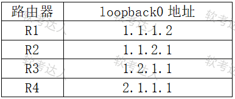
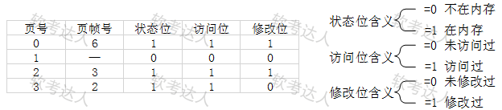

# 丢分项


### 下列关于光纤FC交换机的说法中错误的是(  C  )。

```
A	光纤FC交换机用Zone来划分逻辑通道，不同Zone的设备无法相互通信`

B	光纤FC交换机将存储设备、服务器等设备连接起来组成光纤通道网络`

C	光纤FC交换机与以太网光纤交换机相同都是基于IP协议工作`

D	光纤FC交换机与以太网光纤交换机相比，具有低延迟和无损坏数据传输的优点`
```

FC-SAN跟IP-SAN的区别：FC-SAN是使用**光纤通道协议**、IP-SAN是使用**IP协议**

------

#### 下列IPv6数据报头的字段在IPv4报头中无对应功能的是	(	D	)

```
`A`	`Payload Length

`B`	`Traffic Class

`C`		`Hop Limit			

`D`		`Flow Label		头部校验和 二层和四层都有校验和，故在IPv6中取消了三层的校验和
```

------

#### 设信道带宽为3400Hz，采用PCM编码，采样周期为125µs，每个样本量化为128个等级，则信道的数据速率为（ C ）

```
A	10Kb/s
B	16Kb/s
C	56Kb/s
D	64Kb/s
```

采样周期为125µs，我们可以得到采样频率为：1/125=8000s，而每个样本量化为128个等级，说明码元种类数为128种，因为2的7次方是128，每个样本用7位二进制数字表示。

给定参数：

- 采样周期（T_s） = 125 µs = 125 × 10⁻⁶ s
- 采样率（f_s） = 1 / T_s = 1 / (125 × 10⁻⁶) = 8000 Hz
- 量化等级数 = 128，每个样本的比特数（n） = log₂(128) = 7 bit

因此数据速率为：R=7bit*8000=56000kbps=56kbps。在数字信道上传输这种数字化了的话音信号的速率是7 X 8000=56kb/s。

- **数据速率（R） = 采样率（f_s） × 每个样本的比特数（n）**

  ------

  #### 在广播网络中的4台路由器在缺省配置下，分别只配置了loopback0地址如下表，R1：1.1.1.2 1.1.2.1、 1.2.1.1和 2.1.1.1，启动OSPF后，将选取（ ）为BDR。

  

ospf选举规则 **越大越优先**  

虽然题目没说谁route-id最大 但是route-id选举  取决于loopback越大就是**DR** 	第二就是**BDR**

1、手工配置，如：ospf router-id 1.1.1.1

2、选取**loopback接口**中最大的IP地址

3、选取**物理接口**中最大的IP地址

4、0.0.0.0

------

#### 下面有关TCP协议，说法错误的是（B ）。

```
A  	TCP首部的报头长度字段的取值最小为5

B  	窗口大小就是发送方的发送窗口大小		

C	SYN flooding攻击是利用了三次握手无法顺利完成而造成的攻击

D	校验和的校验范围包括TCP首部和数据部分的整个TCP报文段。
```

TCP首部报头是TCP首部的长度（**4字节**为单位）。**最小值为5**，对应20字节的首部长度

TCP首部中的“窗口大小”字段是接收方通告的窗口大小（即接收窗口），用于指示接收方当前可接收的数据量。发送方的实际发送窗口受接收窗口和拥塞窗口共同限制

------

#### 三层交换机能够通过（ ）来实现VLAN之间的数据相互转发，转发的依据是 （C ） 。

```
A		MAC-adress表

B		ARP表

C		路由表			vlan通过路由表来转发！！！

D		VLAN信息表
```


------

#### 下列加密算法可以抵抗潜在量子计算攻击的是	D

```
A		AES

B		RSA

C		同态加密

D		格基加密
```

量子计算具有经典计算无法比拟的信息携带和并行处理能力，量子攻击时强大的互联网攻击工具，典型的量子攻击包括Short算法、Grover算法等，量子计算可以在短短8小时内破解长达2048位的RSA加密，可以**抵抗潜在量子计算攻击**的是新一代密码算法的**后量子密码（格级加密-格子加密**）。
格基加密：格密码算法是目前后量子领域最受主瞩目的算法，目前尚不能被量子算法破解。核心问题是SIS（小整数解问题）和LWE（容错学习问题）。它们将格的内容抽象化，使得研究者不需要去考虑最糟糕情况困难性的安全性证明，只需要基于SIS与LWE这两个中间问题即可构造出安全的密码学方案。	
同态加密：第一代FHE通过构造一个类同态加密方案，然后压缩解密电路，使得它能够同态计算它本身增强的解密电路，得到一个可以“自举”的同态加密方案，最后有序执行自举操作。

------

##### 以下关于执行MPLS转发中标签弹出（Pop）操作设备的描述中，正确的是（ B）。

```css
A	该报文进入MPLS网络处的LER设备上		进入是压入push

B	该报文离开MPLS网络处的LER设备上		离开是弹出pop

C	MPLS网络中的所有LSR设备上

D	MPLS网络中的所有设备上
```

------

##### 某进程有4个页面，页号为0~3，页面变换表及状态位、访问位和修改位的含义如下图所示。系统给该进程分配了3个存储块，当采用第二次机会页面替换算法时，若访问的页面1不在内存，这时应该淘汰的页号为（ 3号 ）。  

 

```html
本题3个存储块，4个页面
现在一开始3个存储块里面的页号是0、2、3
现在需要访问页号1，也就是把0、2、3中的一个替换出来
根据第二次机会算法。先看访问位，访问位一样的话，再看修改位。
没有修改的页号3替换出来。
```

------

##### 下面可用于消息认证的算法是（ C ） 。

```
A 	DES

B	PGP

C	MD5

D	KMI
```

------

##### 网络地址和端口翻译（NAPT）用于（  ），这样做的好处是（  ）。

```
A	把内部的大地址空间映射到外部的小地址空间

B	把外部的大地址空间映射到内部的小地址空间

C	把内部的所有地址映射到一个外部地址

D	把外部的所有地址映射到一个内部地址
```

------

##### 某计算机系统中互斥资源R的可用数为8，系统中有3个进程Pl、P2和P3竞争R,且每个进程都需要i个R，该系统可能会发生死锁的最小i值为 (C ) 。

```
A 	2

B 	3

C 	4

D 	5
```

根据不死锁的公式**n*(w-1)+1≤m**，其中n表示进程个数，w表示进程需要的资源个数，m表示互斥资源总数。3×(w-1)+1≤8，解得w≤3.33，即进程需要的资源个数满足小于等于3.33的情况下不会出现死锁，当w大于4个时就可能会出现死锁，出现死锁的最小个数是4

------

##### 人工智能模型可以分为多种类型，其中基于数据和经验进行学习，能够通过训练和分析数据来自主地学习数据中的规律和模式的模型是 (A ) 

```
A.
机器学习模型
B.
深度学习模型
C.
规则模型
D.
聚类模型
```

人工智能模型可以分为多种类型，典型的如：

机器学习模型：这类模型**基于数据和经验**进行学习，能够通过训练和分析数据来自主地学习数据中的规律和模式。常见的机器学习模型包括决策树、支持向量机、神经网络等。

深度学习模型：**基于神经网络的机器学习模型**，通过多层神经元网络进行训练和学习，能够处理和分析复杂数据。包括卷积神经网络、循环神经网络、变换器等。

规则模型：**基于人类经验和知识**进行推理的模型，通过归纳和整理人类经验和知识，建立规则和逻辑来进行推理和决策。常见的规则模型包括专家系统、决策树等。

------

##### 若在光纤通信系统中使用100mW的激光器，当其发射波长为1550nm时，其光功率为（A ）。

```
A.
20dBM

B.
10dBm

C.
40dBm

D.
30dBm
```

光通信中，光功率单位常用毫瓦(mw)和分贝毫瓦(dBm)表示，其中两者的关系为：1mw=0dBm.也就是0 dBm=10lg1mw。本题目中使用100mW的激光器，则激光功率是100mw,因此代入公式可以知道10lg100mw=20dbm。  计算公式： **dbm=10lg(100mw/1)**

------

##### 依据《数据中心设计规范》，在设计数据中心时，背对背布置的机柜正面之间的距离不应小于（A ）。

```
A.
	0.8m

B.
	1.2m

C.
	1.5m
	
D.
	2m
```

```bash
依据《数据中心设计规范》,主机房内通道与设备之间的距离应符合下列规定：

1 用于搬运设备的通道净宽不应小于1.5m；

2 面对面布置的机柜（架）正面之间的距离不宜小于1.2m；

3 背对背布置的机柜（架）背面之间的距离不宜小于0.8m；

4 当需要在机柜（架）侧面和后面维修测试时，机柜（架）与机柜（架）、机柜（架）与墙之间的距离不宜小于1.0m；

5 成行排列的机柜（架），其长度大于6m时，两端应设有通道；当两个通道之间的距离大于15m时，在两个通道之间还应增加通道。通道的宽度不宜小于1m，局部可为0.8m。
依据《数据中心设计规范》，在设计数据中心时，背对背布置的机柜正面之间的距离不应小于 800毫米。这一距离有助于确保维护通道的畅通、电缆管理的便利以及热量管理的有效性，同时满足消防安全和操作需求。
```

------

##### 在我国商用密码算法体系中，（B ）属于摘要算法。

```
A.SM1	B.SM3	C.SM4	D.SM7
```

国密算法基础概念。SM3是**摘要算法**，**SM2和9**是非对称，**SM1，4，7是对称密钥密码算法**（分组加密算法）。

------

##### Tracert命令通过多次向目标发送ICMP回声请求报文来确定到达目标的路径，在连续发送的多个IP数据包中，（A ）字段都是相同的。

```
A.源IP地址	B.目标IP地址	C.TTL	D.目标MAC
```

在tracert第一次发送的回声请求报文中置TTL=1，然后每次加1， 这样就能收到沿途各个路由器返回的超时报文，直至收到目标返回的ICMP回声响应报文。**目标IP地址也是每一段中间的IP地址，目标MAC在每个网段也是变化的**。

------

##### 以下无线协议支持6GHz频段的是（ A）。

```
A.802.11be	B.802.11ax	C.802.11ac	D.802.11n
```

Wi-Fi 7在多个方面超越了Wi-Fi 6：

- **频段支持**：Wi-Fi 7支持2.4GHz、5GHz和**6GHz**频段，频谱资源更丰富。
- **带宽**：Wi-Fi 7最大支持**320MHz**，而Wi-Fi 6仅支持160MHz。
- **调制方式**：Wi-Fi 7采用**4096-QAM**，相比Wi-Fi 6的1024-QAM提升了信息承载能力。
- **吞吐量**：Wi-Fi 7的理论最大速率为**46.1Gbps**，是Wi-Fi 6的近5倍。

------

##### 如果某链路每秒发送4000个帧，每个时隙8个比特，则该采用TDM的链路数据传输速率为（C ）。

```
A.500b/s	B.1000b/s	C.32Kb/s	D.64Kb/s
```

由于该链路每秒发送4000个帧，每个帧实际上对应的就是一个时隙的数据，也就是每帧8比特，因此采用TDM的链路数据速率为4000*8=32000bps。

------

##### 目前浏览器IE 11.0默认是使用了HTTP/1.1协议，HTTP/1.1协议的持续连接有非流水线和流水线方式两种工作方式。下面有关HTTP/1.1的说法错误的是（ B）。

```
A.
使用了持续连接，一次TCP连接可以传输多次请求报文和响应报文

B.
非流水线方式是每次请求都需要建立一次TCP连接

C.
流水线方式的特点是客户端可以在没有收到响应的情况下连续发送多次请求

D.
HTTP/1.1的两种工作方式在传输多对象页面时的用时均小于HTTP/1.0
```

HTTP/1.1协议的持续连接有两种工作方式，即**非流水线方式和流水线方式**。两种方式都是在**只建立一次TCP**连接的前提下。

非流水线方式的特点是客户在收到前一个响应后才能发出下一个请求。因此，在TCP连接已建立后，客户每访问一次对象都要用去一个往返时间RTT。这比非持续连接要用两倍RTT的开销，**节省了建立TCP连接所需的一个RTT时间**。但非流水线方式还是有缺点的，因为服务器在发送完一个对象后，其TCP连接就处于空闲状态，**浪费了服务器资源**。	***建立TCP之后只发送一来一回 不需要再建TCP连接***

流水线方式的特点是**客户在收到HTTP的响应报文之前就能够接着发送新的请求报文**。于是一个接一个的请求报文到达服务器后，服务器就可连续发回响应报文。因此，使用流水线方式时，客户访问所有的对象只需花费一个RTT时间。流水线工作方式使TCP连接中的空闲时间减少，**提高了下载效率**。  ***可以一直发送 只花费一个RTT时间 提高了效率***

------

##### 以下关于ICMP的叙述中，正确的是（ C）。

```
A.ICMP和ARP一样，封装在以太网帧中	

B.ICMP消息的传输是可靠的	

C.ICMP可用来进行差错控制	

D.ICMP可以用来流量控制
```

ICMP（**差错与控制报文**）一个数据报产生差错时，ICMP能向数据报最初源站报告差错情况。

ICMP是封装在**IP数据包**中的，而IP协议是一种**不可靠**的无连接协议。

------

##### 启用端口安全port-security max-mac-num 5后，默认违例处理是（ B）。

```
A.仅记录日志B.关闭端口C.丢弃超标流量D.发送告警
```

华为交换机默认违例动作是shutdown（需配合**port-security protect-action**修改为**restrict或protect**）。

------

##### 下列不属于软件定义网络(SDN)特点的是（ ）。

```
A.转发与控制分离	B.控制集中化	C.网络设备功能虚拟化	D.实现网络开放可编程
```

软件定义网络的三大特点是**网络开放可编程、控制平面与数据平面的分离、逻辑上的控制集中化**。网络功能虚拟化是网络切片的主要技术特点。

------

##### VXLAN组播模式下，解决VTEP自动发现问题的机制是（B ）。

```
A.ARP代理	B.头端复制（Head-End Replication）	C.IGMP Snooping	D.PIM-SM
```

头端复制由 源VTEP 复制多份单播报文发送给各接收者，替代传统组播，简化网络配置。

------

##### 在以太网中，若争用时间片为25.6us,某站点在发送帧时已经连续2次冲突，则基于二进制指数回退算法，该站点有可能最长等待（ ）时间后重新发送。

```
A.0us	B.76.8us	C.178.2us	D.204.8us
```

经过3次冲突，则需要在[0,1,. . . ,2^k-1]（k=2）个时间片即（0,1,2,3）个时间片中随机选择一个等待，则最短时间是0us，最长时间是3×25.6us=76.8us。但是都必须是25.6us的整倍数。

------

