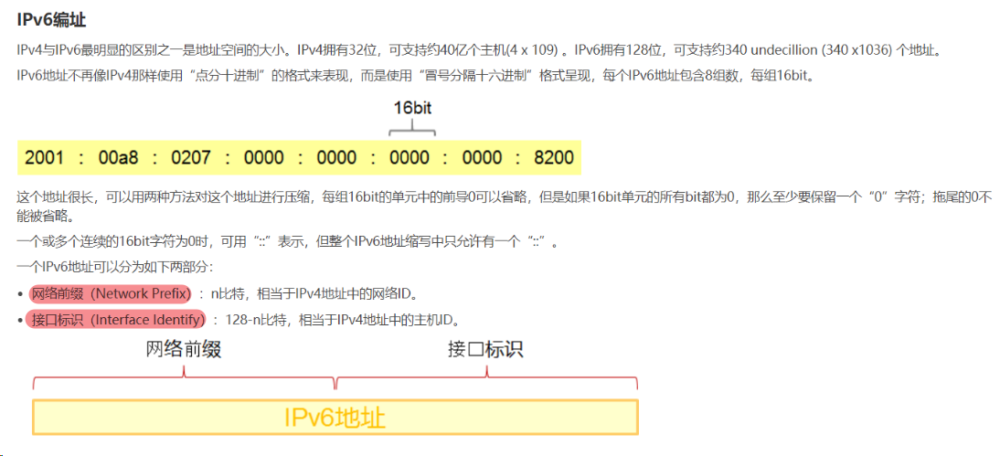
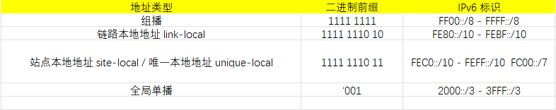
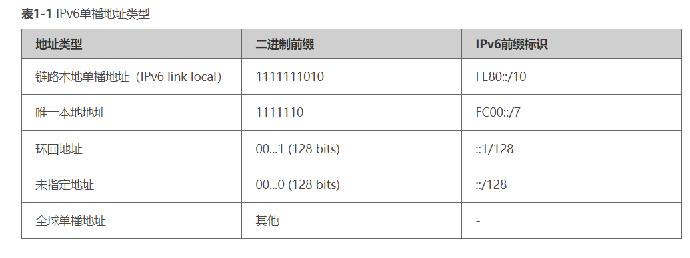
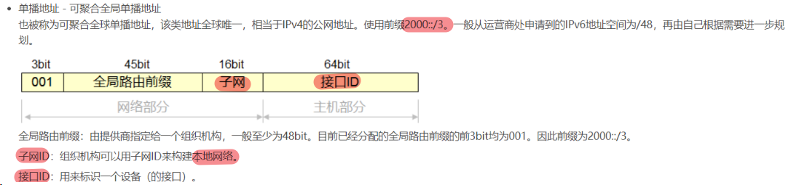
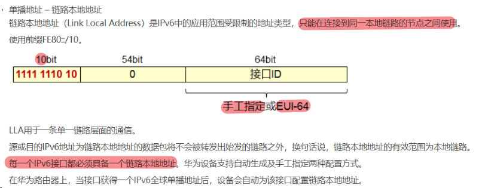
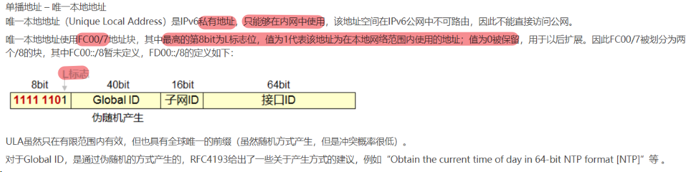

# IPv6 

## 地址分类
### 单播地址
```
Unicast Address，
    标识单个传输单位（路由器 或 终端）
    目的地为单播地址的数据转发到单个设备，可以作为源 或 目的地址
```
### 组播地址
```
Multicast Address
    标识一组设备 或 接收者，只能出现在目的地中，不能作为源地址出现
```
### 任播地址
```
Anycast Address
    标识一组节点，目的地为 任意播地址的流量被转发到组里最近的节点
```

### IPv6 地址参考表



## 单播地址
标识单个设备（接口）的地址
### 全局单播地址 (global unicasting address)
(类似 IPv4 中的公网地址)


### 链路本地地址
```
- 只能在连接到同一本地链路的节点之间使用
- 每一个IPv6 接口都必须具备一个链路本地地址
    - 华为设备 支持 
        - 自动生成
        - 手工指定
    - 华为设备当接口获得一个 IPv6 全球单播地址，
        - 设备会自动为该接口配置 链路本地地址
```


### 唯一本地地址
```
- 是 IPv6 私有地址
- 只能够在 内网中使用，不可直接访问公网

- 唯一本地地址使用 FC00/7 地址块

- 最高的 第8bit 为 L 的标志位
    - L = 1， 代表该地址在本地网络范围内使用的地址
    - L = 0， 保留 
```


[Ipv6 的划分](./IPv6%20Subnetting%20(pdf).pdf)

