# OSPF

## 状态机
- Down
    - 初始阶段
- Init
    - 收到 不包含 自己 RID的 Hello 报文
- 2-way
    - 收到 包含 自己 RID 的 Hello 报文
    - （在此状态下进行了，DR 选举）
- Exstart
    - DR选举后进入
- Exchange
    - 主从协商完毕
- Loading
    - DD报文交换完成后
- Full
    - 收到对方请求的 LSA 后的 LSAck
    - 以及发给对端的 LSAck ，也收到后

## 建立过程 (BMA)
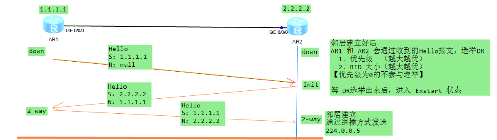
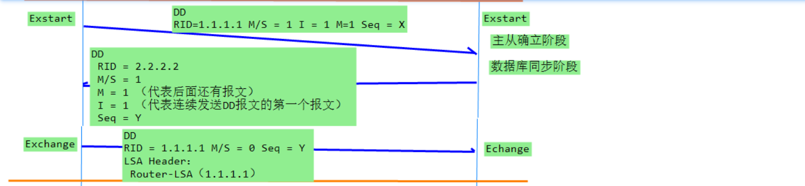
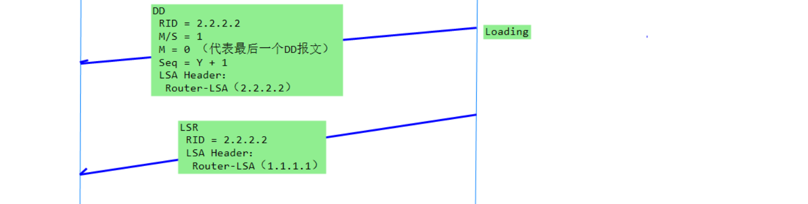
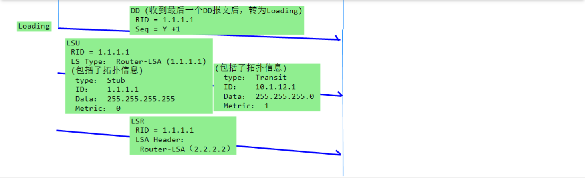
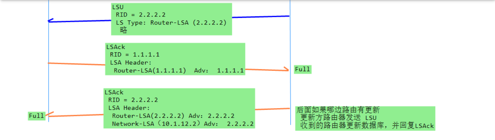

[OSPF 建立拓扑.zip](./OSPF建立过程.zip)

## 报文详
[OSPF报文详解](https://blog.51cto.com/xxy12345/2518384)

### 报文类型
```
- Hello报文
    - 周期性发送，发现和维护邻居关系
- DD报文
    - 描述本地LSDB的摘要信息
    - 用于两台路由器进行数据库同步
- LSR报文
    - 链路状态请求报文，
    - 向对方请求所需要的LSA
- LSU报文
    - 链路状态更新报文
    - 向对方发送其所需要的LSA 或 泛洪自己更新的LSA
- LSAck报文
    - 对收到的LSA进行确认
```

### OSPF 报文头
```
这5个报文都有相同的报文头格式
    - 24字节
```
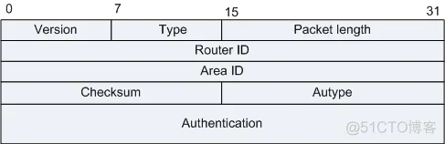
```
- Type
    - 8bit, OSPF报文类型
    - 1： hello
    - 2： DD
    - 3： LSR
    - 4： LSU
    - 5： LSAck

- Autype
    - 16bit
    - 校验类型
    - 0： 不验证
    - 1： 简单认证
    - 2： MD5 认证
```

#### Hello报文
```
    作用:
        建立 和 维护 邻接关系
```
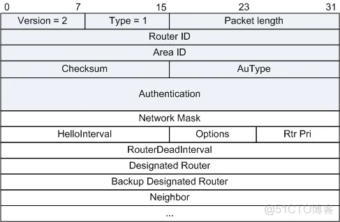
```
- Options；
    - 8bit
    - E： 允许泛洪 AS-Externa-LSAs(允许AS外部路由)
    - MC: 转发IP组播报文
    - N/P： 处理 7Type-LSA
    - DC：  处理按需链路
```
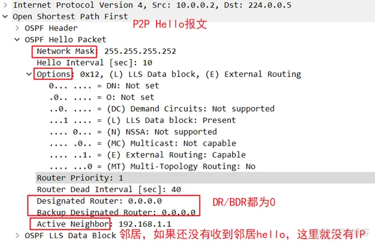

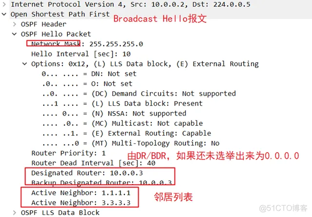

#### DD 报文
```
作用：
    - 数据库同步

    报文内容包含LSDB的每一条LSA的Header
        - （LSA的header可以唯一标识一条LSA）
```
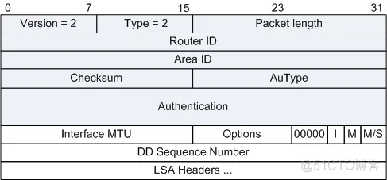

```
- Options；
    - 8bit
    - E： 允许泛洪 AS-Externa-LSAs(允许AS外部路由)
    - MC: 转发IP组播报文
    - N/P： 处理 7Type-LSA
    - DC：  处理按需链路

- I 位（Initialization）：
    - 1bit
    - 初始位
    - 置1 表示第一份DD报文

- M 位（More）：
    - 1bit
    - 当发送多个DD报文时候，为1
    - 当这个DD为最后一个DD报文时候，为0
    - 表示后面还有DD报文（置1）

- Seq
    - 32bit
    - 用于确保DD报文传输的可靠性 和 完整性
```

#### LSR报文
```
作用：
    向对方发送请求所需的LSA
```
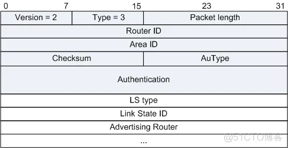

```
唯一确认一条LSA
    - LS Type
    - Link State ID
    - Advertising Router
```

#### LSU报文
```
作用：
    - 用于提供给对端 Router所需的LSA
    - 泛洪自己更新的LSA

    需要LSAck 进行确认。

    没有收到确认报文的LSA进行重传
        - 重传的LSA是直接发送给邻居的
```
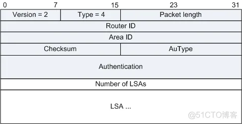

#### LSAck报文
```
    对接收到的LSU报文进行确认
```
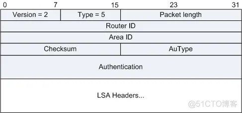
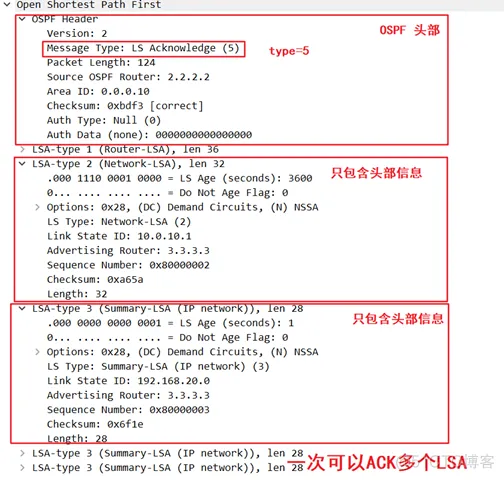

### LSA 报文头
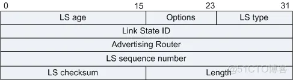
```
- Options；
    - 8bit
    - E： 允许泛洪 AS-Externa-LSAs(允许AS外部路由)
    - MC: 转发IP组播报文
    - N/P： 处理 7Type-LSA
    - DC：  处理按需链路
```
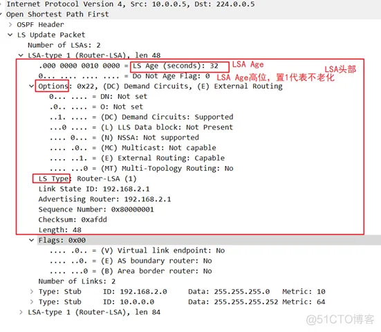

#### Router-LSA
```
    每个路由器都会产生
        - 描述路由器的链路状态和开销
        - 区域内泛洪
```
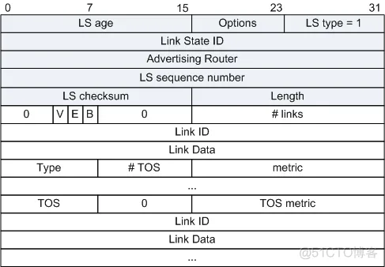
```
- Link-State ID:
    - LSA的 Router-id

- V（Virtual Link）：
    - 置1，此LSA的路由器是虚连接连接的节点

- E（External）：
    - 置1，ASBR路由器

- B（Border）：
    - 置1，ABR路由器
```

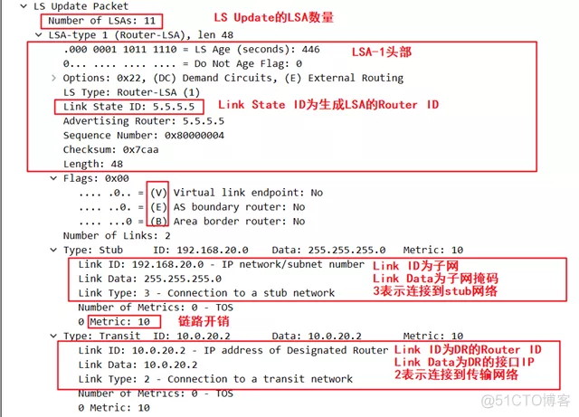

#### Network-LSA
```
    由BMA或NBMA网络中DR产生
        - 仅在广播类型和NBMA链路上传播（P2P链路没有）
        - 区域内传播
```
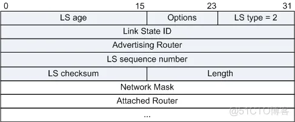

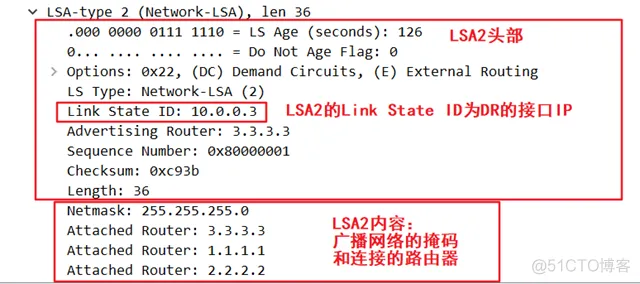

#### Summary-LSA
```
3Type LSA 和 4Type LSA，格式相同
    - 都是有ABR产生

Type3 LSA： 
    - 产生于 ABR
    - Network-Summary LSA
    - 区域内所有网段的路由
        - 通告给其他相关区域，
        - 区域间泛洪
        - （到达其他区域必须经过骨干网转发该LSA）
        - 通告 非 Totally Stub，NSSA区域

Type4 LSA：
    - 产生于 ABR
    - ASBR-Summary-LSA
    - 描述到ASBR的路由
        - 通告除了ASBR所在区域的其他区域
        - （通告整个路由域，只在普通区域内泛洪）
        - ABR 在区域边界会 为其他区域 再产生LSA4，并泛洪
```
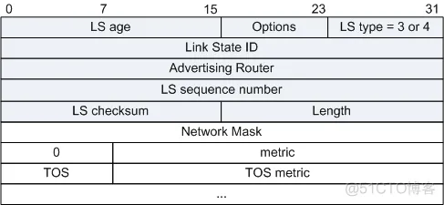
```
Link State ID：
    - Type3 LSA的是 网络地址
    - Type4 LSA的是 ASBR的Router ID

Network Mask；
    - 该广播或NBMA网络地址的掩码
    - 如果是 Type4 LSA，该字段无意义（0.0.0.0）
    - 看下面问题（为什么Network mask字段在ASBR-Summary LSA中无意义？）
```
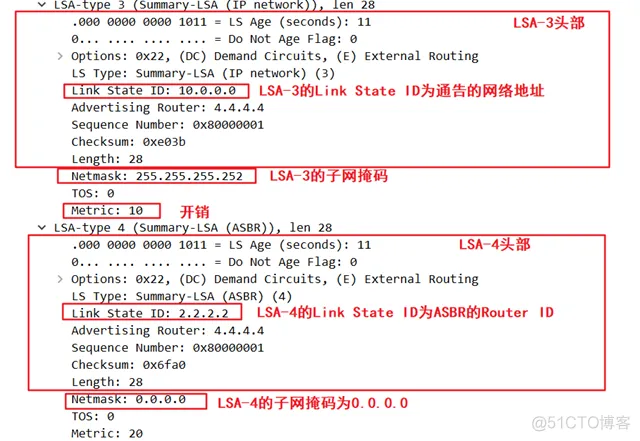


#### AS-External-LSA（Type5）
```
    - 由ASBR产生
    - 描述到AS外部的路由
        - 唯一一种通告到所有区域的LSA
        - （Stub 和 NSSA除外）
```
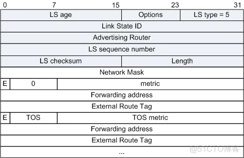
```
- E：
    - 外部度量值类型
    - 0:    
        - 第一类外部路由
    - 1：
        - 第二类外部路由（默认）
- FA：
    - 到所通告的目的地址的报文将被转发到这个地址
- External Route Tag:
    - 添加外部路由上的标记
```
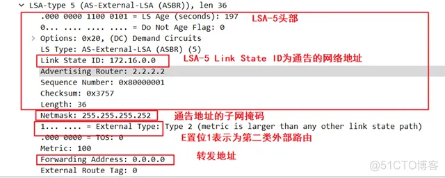


#### NSSA AS-External-LSA （7Type LSA）
    - 7type LSA 的 FA 一定非0
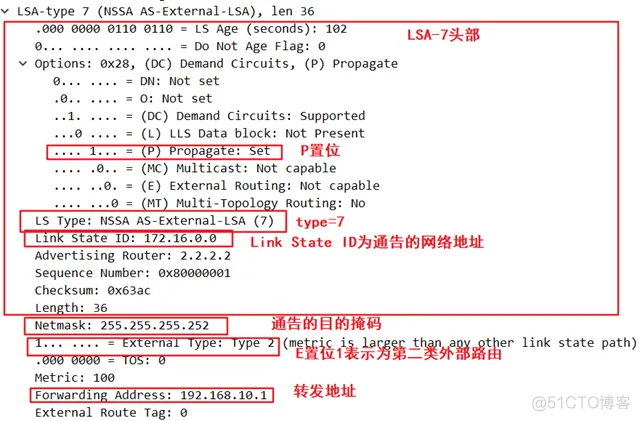


## FA (Forwording Address,转发地址)
```
仅出现在 Type5 和 Type7 LSA中
    - 是数据包访问外部网络时，
    - 数据报文离开OSPF路由域时，必须经过的设备地址
```
### 作用：
```
    5LSA 中 FA 决定外部路由能否进入路由表，及转发路径
``` 
```
    LSA5 携带外部路由，该外部路由一定要出现在路由表中，
        - 则要依赖LSA5 的FA可达性
        - 如果不可达，则外部路由不进入 路由表
```
### FA = 0 / FA != 0
```
    FA = 0 时： 
        - 数据包转发经过 ASBR 访问外部网络
    
    FA != 0 时;
        - 数据包转发至拥有FA地址的设备
        - 再由其转发到外部设备
```
#### FA != 0 的条件
```
1. 该外部路由的下一跳地址所在的网段接口 
    - 要发布到OSPF中
2. 该外部路由的下一跳地址所在的网段接口 
    - 不能设置 silent 接口
3. 下一跳地址所在网段接口OSPF网络类型，
    - 属于 BMA 或 NBMA

    ** 缺少任意一个都不成立，导致 FA = 0
```

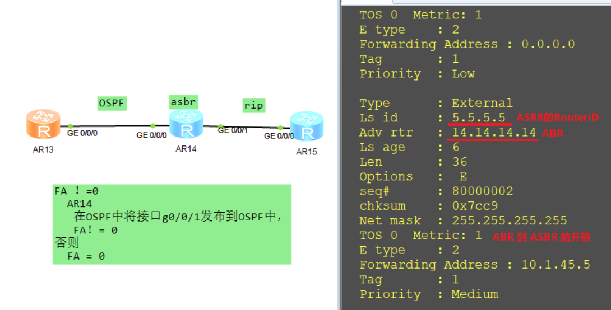

#### FA = 0 情况
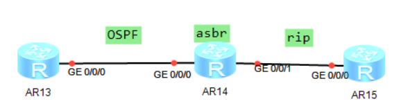
```
AR13 与 AR14 运行OSPF
    - AR14 不发布接口g0/0/1
```
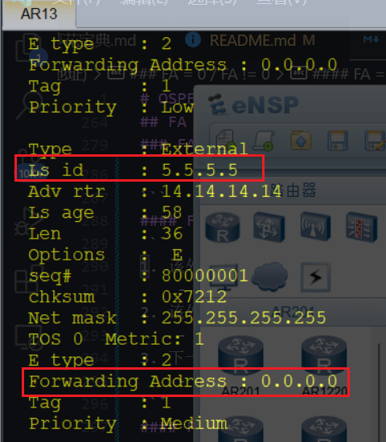

#### FA != 0

```
AR13 与 AR14 运行OSPF
    - AR14 发布接口g0/0/1
```
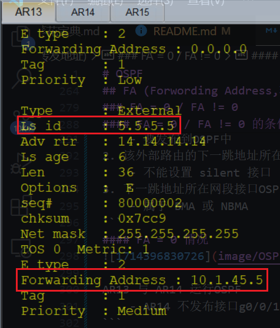


## 


# 问题
## 1. DR 的选举过程 以及 时间？
### 选举过程
```
    1. 路由设备都认为自己是 DR Other
```
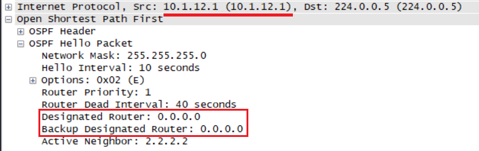

```
    2. 先从中选取BDR 出来，
       - 发现没有 DR，自动成为DR
       - 再选举 BDR

    ** 只有广播网络中 才选举 DR

    ** 如果广播网络中，已经选举出 DR 和 BDR
        - 不进行重新选举 和 抢占（减少网络震荡）
```

### 时间
```
    选举时间 = Dead Time 
            = 4 倍 Hello = 40s
```

## 2. DR 是否具有抢占性？
```
1. 当DRother设备加入 已经选举DR的网络中，
     是不具有DR抢占性的 [例如:一台优先级比DR优的路由器加入]

2. 当另一个ospf网络 已经选举好DR的网络加入，DR就具有抢占性，
          此时会有两个DR ，和 两个BDR，
          从DR之间先比较，次优的直接变成DRother，BDR同理)
```

## 3. First DD 与 DD 的区别
- First DD
    - 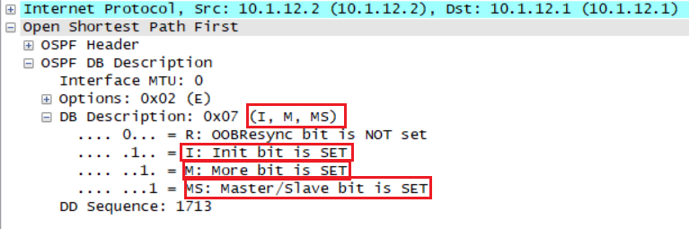
- DD
    - 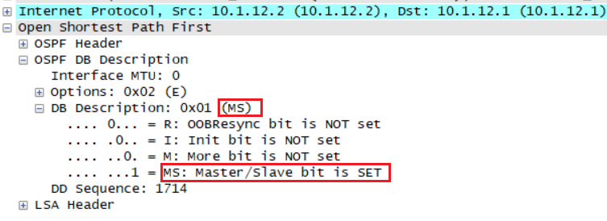

```
    特点：
        - 空 DD （不含LSA Header）
        - I 置位
            - 代表连续发送 DD的第一个报文（First DD）
        - M 置位
            - 代表后面还有 DD报文

    First DD 作用
        - 选举出 主从
```

## 4. 如何选举主从，选举主从的作用是什么？
```
    1. 选择 Router ID大的为主
    
    2. 作用：
        - 用于协商 统一的序列号
        - 保证 同步数据库的有序、可靠
```

## 5. 隐式确认 / 显式确认
```
    OSPF主从关系中的显式确认和隐式确认
        - 是指在OSPF协议中用于确认LSA（链路状态通告）传输的两种不同机制。
        - 作用：
            - 为了保证 OSPF协议中LSA的 正确传输和接收
            - 而设计的两种确认方式。
```

### 显式确认 (通过手工配置 选举DR)
```
可以通过配置OSPF接口的优先级来实现，优先级高的路由器将成为主路由器，优先级低的路由器将成为从路由器。具体步骤如下：

    1. router ospf [process-id]。
    2. interface [interface-type interface-number]。
    3. ip ospf priority [priority]。
```

### 隐式确认（系统通过默认规则自己选举DR）
```
    1. 优先级 （越大越优）
    2. Router ID （越大越优）
```

## 6. 为什么Network mask字段在ASBR-Summary LSA中无意义？
```
在讨论为什么Network mask字段在ASBR-Summary LSA中无意义之前，我们需要了解几个概念：

    Network mask：
        在IP地址中，网络掩码用于区分IP地址中的网络部分和主机部分。它通常用于定义一个网络的范围。

    ASBR：
        自治系统边界路由器是连接到OSPF自治系统的外部路由器，它负责将OSPF自治系统内部的路由信息传递给外部的路由协议，如BGP。

    LSA：
        链路状态通告，是OSPF协议中用于描述网络拓扑和路由器之间路径的一种数据结构。

Type-3 LSA：
    也称为ASBR-Summary LSA，由ABR生成，用于通告其他区域的路由器关于如何到达自治系统内的ASBR。

当你创建一个ASBR-Summary LSA时，你实际上不是在描述一个具体的网络，而是在描述如何到达一个特定的ASBR。因此，这个LSA并不关心ASBR连接的具体网络的网络掩码，它只关心到达ASBR的路径。这是因为ASBR可以连接到多个网络，并且可以向OSPF自治系统内部的路由器通告这些网络的路由信息。

在ASBR-Summary LSA中，Network mask字段通常被设置为0，因为：

    目的：
        这个LSA的目的是通告ASBR的位置，而不是描述一个特定的网络。
    路径选择：
        OSPF使用这个LSA来计算到达ASBR的最佳路径，而不是到达一个特定网络的最佳路径。
    外部路由：
        ASBR将使用外部路由协议（如BGP）来学习并通告关于其连接的外部网络的路由信息，这些外部网络的网络掩码在那时才是相关的。

因此，在ASBR-Summary LSA中，Network mask字段无意义，因为它不是用来描述一个具体的网络，而是用来描述到达ASBR的路径。
```

## 