# BGP 边界网关协议

## 基础
```
    1. 基于 TCP协议，只要能够建立 TCP连接即可建立BGP
    2. 只传递路由信息，不会 AS 的拓扑信息
    3. 触发式更新，而不是进行周期性更新

BGP 是基于单拨的方式建立 tcp链接，所有要在网络能够互通的情况下，才可以建立邻居
```

```
1. AS (自治系统)在同一管理组织下，运行相同路由协议和策略的集合
    (在AS内部，设备都是互相信任，互相传递拓扑 和 路由信息)

2、IGP：内部网关协议，主要用于 AS 内发现路由和计算路由
	（OSPF、IS-IS 等）

3、EGP：外部网关协议，用于 AS 之间传递路由和控制路由
	（EGP 只能传递路由表中已有路由，无法发现和计算路由）但是 EGP 因为无法满足防环和控制选路的需求，则被 BGP 取代了
```

- 特点
```
BGP（边界网关协议）也是用于传递路由和控制路由，BGP 有丰富的选路属性
```
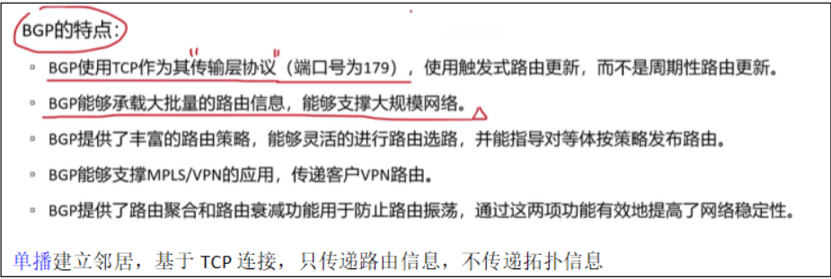

### BGP 5 种报文
- Open报文
  - 协商 BGP参数
  - （如：BGP 的版本、AS 号、Router id 等信息）仅在对等体建立过程中发送一次

- Update报文
  - 用于更新路由信息（如：传递可达路由及路径属性，撤销路由）

- Keepalive报文
  - 用于维护 BGP 对等体关系，周期性发送（缺省时间为 holdtime 的 1/3）

- Notification报文
  - 用于传递差错信息，收到该信息的 BGP 对等体会立刻中断回到 idle 状态（中断 TCP 连接）

- Route-Refresh报文
  - 刷新路由（如：软重置 “可以在对等体关系不中断的情况下刷新路由”，ORF（出方向路由过滤）可以减少不必要路由的传递）

### Route Refresh报文什么时候会产生？
```
  1. refresh bgp all import
  
  2. ORF (出向路由过滤)(建立邻居时协商完成ORF功能后，发送refresh报文通知对端自己需要哪些报文)
```

### BGP 状态机
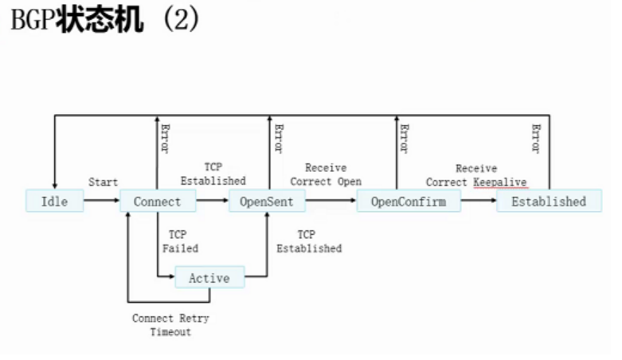
```
1、idle：
  代表 TCP 连接中断（或刚使能 BGP 协议，初始状态）
  
  “idle 需要等待一个 32s 的计时器才会进入到 connect 
  并发起 TCP 建立请求“

2、connect：
  代表发起 TCP 的连接请求（三次握手），建立 TCP 连接
		① connect 会发起 2 次 TCP 建立请求，1s 和 5s （第一次发起后会启动 32s 的计时器，32s 后重新回到 1s）

			“如果对等体没有响应，则每隔 32s 是一个周期，
             每个周期发起 2 次 TCP 建立请求”

		② 如果在 connect 建立过程中，
          对等体响应但不同意建立 TCP 连接，则进入 active 状态
		
        ③ 如果对等体回复了响应，并且同意 TCP 连接建立请求，
          则进入到 open sent 状态

3、active：
  在 connect 中收到对等体的响应（但不通过）继续 32s 的计时器，等待对等体发起 TCP 建立请求
		① 如果对等体发起建立请求，并且 TCP 连接建立成功，
          则进入到 open sent状态
		
        ② 如果持续建立失败，或者对等体没有发起 TCP 连接建立请求，
          则等待计时器超时（32s）超时后则回到 connect 重新发起 TCP 连接建立

===============================================================================

4、open sent 状态：
  代表 TCP 连接建立成功，发送 Open 报文协商对等体参数信息
		（包括版本、Router id、AS 号、地址族等信息）
		① 如果协商成功，则进入 open confirm
		
        ② 如果协商失败，则发送 Notification 报文，
          并中断 TCP 连接回到 idle 状态

5、open confirm 状态：
  会发送 keep alive 报文（代表 Open 协商成功）等待对等体回应
		
    ① 如果对等体回复了  keep alive 报文，则进入到最终状态 established
		
    ② 如果等待超时，且没有回复，则发送 Notification 报文，
      并中断 TCP 连接回到 idle 状态
		
6、established 状态：
  代表 BGP 对等体建立成功，后续会继续交互（Update、keep alive 
```

#### 注意
```
1. 
  bgp as-number 配置后不匹配，会发送 Notification 差错报文,且回到 idle 状态

2. 
network 和 import 的区别
  1.Network 可以单独发布一条
  2.Import 全发布

3. IBGP 的默认 TTL=255
    TTL 每经过一个 三层设备 -1
  
4. TCP
    建立连接的时候
    SIP（Source IP） 源IP 1.1.1.1
    DIP（Destinct IP） 目的IP 3.3.3.3

  如果在 R1 13.1.1.1 处 与 3.3.3.3 不通的原因？
    - 因为对方和我们建立对等体的是 1.1.1.1
    - 而不是 13.1.1.1 所以在 建立 的时候 SIP 不对，
    - 所以就建立不了 tcp 连接

5. 配置 TTL 的跳数
  peer 3.3.3.3 ebgp-max-hop 10
```

### 描述 BGP 建立邻居过程
- 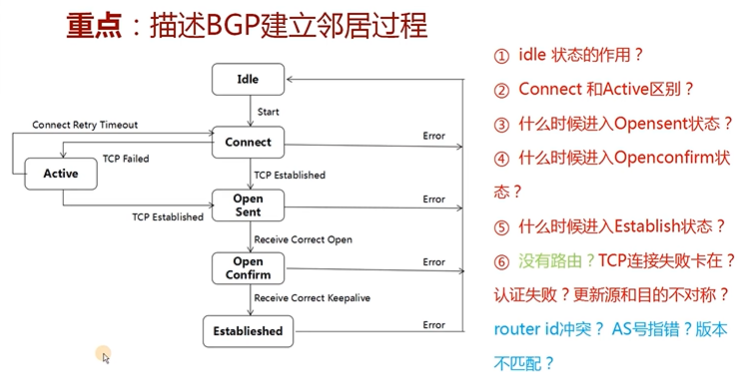
#### 问题
```
1. idle 状态的作用？
  - Start 事件是由一个操作者配置一个BGP过程，
    - 或者重置一个已经存在的过程或路由器软件重置引起的
  - 任何状态中收到 Notification 报文 或 TCP 拆链通知等 Error 事件后，BGP 都会转至 Idle状态
  - Idle 状态 start 计时器约32s
  - 在该状态下不做任何配置

2. Connect 和 Active 状态的区别？
  - Connect 是主动建立 TCP连接
  - Active 是被动建立 TCP连接

3. 什么时候进入 Opensent状态？
  - 当建立起 TCP连接时候
  - 同时发送Open报文，协商

4. 什么时候进入 Openconfirm状态？
  - 如果 收到正确的 Open报文，进入Openconfirm状态

5. 什么时候进入 Establieshed 状态？
  - 收到正确的 Keepalive报文时候

6. 
没有路由？ 
  - 卡在 Connect 或 Active 状态处

TCP 连接失败卡在？
认证失败？
更新源和目的不对称？
  - 卡在 Connect 或 Active 状态

router id冲突？
AS号错误？
版本不匹配？
  - 卡在 Opensent 状态
```

### BGP 邻居关系
```
  1、IBGP（内部 BGP）用于 AS 内传递路由信息（如：公司内部两个分支机构的 AS 都一致的情况下，使用 BGP 传递路由信息）
		① IBGP 的 TTL 默认为：255		

  2、EBGP（外部 BGP）用于 AS 间传递路由信息
		① EBGP 的 TTL 默认为：1（非直连邻居需要指定 ebgp-max-hop）

================================================================

BGP 使用直连接口建立邻居，无需指定更新源（设备会根据目的 IP 地址，寻找距离目的 IP 地址最近的物理接口，作为源 IP 地址）
	
问题
	① 直连接口会收到链路的影响，链路不稳定（邻居关系也会不稳定）
	② 使用直连建立保障冗余性，需要建立多个 BGP 邻居关系（会导致路由重复泛洪，增加设备压力）	

	使用 loopback 接口解决以上问题（更新源）
	① loopback 接口不受物理接口影响，仅受设备影响
	② 只要该接口可达，无论使用哪一条物理链路都可以（减少邻居关系，仅建立一个即可）
	
	但是使用 loopback 接口（逻辑接口）无法自动作为更新源地址，需要手工指定该地址为建立 BGP 对等体的更新源地址（connect-interface）
	为了确保任意设备都可以发起建立，使用了 loopback 接口的设备都必须指定更新源
```

### BGP 跨跳建立对等体
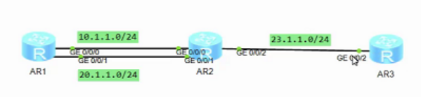
```
AR1 与 AR3 建立对等体
1. 前提
  - 路由可达
  - 因为是基于 TCP 连接，需要通过知道对方的ip来建立 tcp连接

2. BGP 可以跨跳建立连接的原因？
  BGP 单播
    - 单播可以跨越广播域

  OSPF 组播
    - 组播不能跨越广播域

3. BGP 的老化时间为 180s
```

### 硬重置
```
# 需要重新建立邻居关系而达到刷新路由的目的
reset bgp all
```

### 软重置
```
# 不需要中断邻居关系的，则可以刷新路由
refresh bgp all import // 代表本设备给其他路由发送一次路由
refresh bgp all export // 代表其他邻居给我发一次路由
```

### BGP 认证
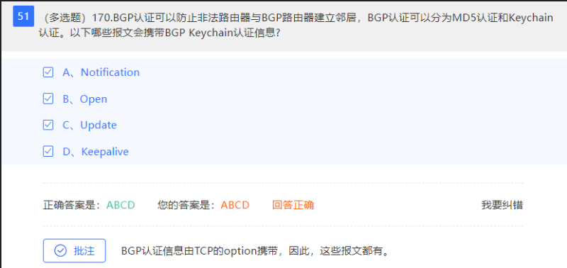

### 负载均衡
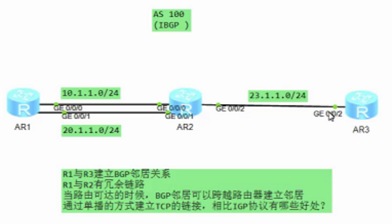
```
1. 使用 接口建立邻居（冗余）
  - AR1 只需要 和 AR3 的 2 口建立一个邻居
  - AR3 则需要 与 AR1 的 0 和 1 口建立邻居

2. 使用 环回接口 建立邻居
  - AR1 和 AR3 只用建立一个邻居就可以实现负载均衡
  - peer 1.1.1.1 as-number 100
  - peer 1.1.1.1 connect-interface LoopBack 0

##############################
使用 环回接口 建立邻居的好处
  - 实现链路冗余，可以减少网络中的邻居状态
  - 更加稳定，不会收到物理链路的影响
```
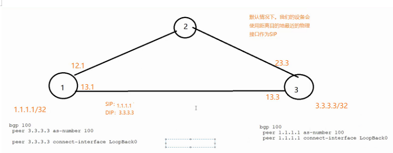
```
使用 Loopback 接口建立邻居的注意
  1. 需要保证接口的可达(双方均课访问)
  2. 指定更新源 (connect-interface LoopBack 0)
```


```
负载均衡

  （最大支持 8 条 IBGP 或 EBGP 的负载均衡配置）
	
  bgp 进程下
	maximum load-balancing ebgp 2			// 设置最大支持 2 条 EBGP 路由的负载均衡

	maximum load-balancing ibgp 8			// 设置最大支持 8 条 IBGP 路由的负载均衡
```

## BGP 路由汇总
```
① 手工汇总
	aggregate + 汇总路由及其掩码（如：192.168.1.0 24）+  detail-suppressed（用于抑制明细路由）

② 静态配置汇总
	需要汇总的路由不 network 到 BGP 中
	如：10.1.1.1/32  10.1.1.2/32
	通过手工配置静态路由   ip route-static 10.1.1.0 30 null0		
                          // 配置指向 NULL0 的防环汇总路由

	在把该静态路由发布到 BGP 中
	network 10.1.1.0 30

③ 自动汇总
	summary automatic 			// 自动汇总只能针对本设备引入的路由生效，并根据目的地址的类型自动填充掩码

如：192.168.1.1/32  自动汇总为 C 类网段，192.168.1.0/24
```

## BGP 路由通告原则
```
1*、IBGP 水平分割：从 IBGP 对等体收到的路由，不会再传递给其他 IBGP 对等体
	（解决办法：全互联、反射器、联盟等）

2*、BGP 不会传递无效路由（如：当下一跳不可达的 BGP 路由称为无效路由，在 BGP 路由表不会携带 * 号 “该路由也无法加载到全局路由表中”）

3、BGP 只会把最优的路由传递给对等体（BGP 路由表中携带 > 号）

4、EBGP 没有水平分割，可以把 BGP 路由传递给任意对等体
	补充：EBGP 之间可以通过 AS-Path 属性防止环路产生，EBGP 传递路由时，会携带 BGP 路由经过的 AS-Path 列表
		如果列表中存在本 AS 相同的 AS 号，就会拒收路由

5、*（路由黑洞）BGP 同步（现在已经不再使用）用于解决 BGP 的路由黑洞问题
	“因为 BGP 一般会承载大量的运营商路由，IGP 协议无法处理这些路由条目，所有一般不会开启 BGP 同步功能”
		采用使用隧道技术（MPLS、GRE 等）来解决路由黑洞问题
```

### BGP 路由通告问题
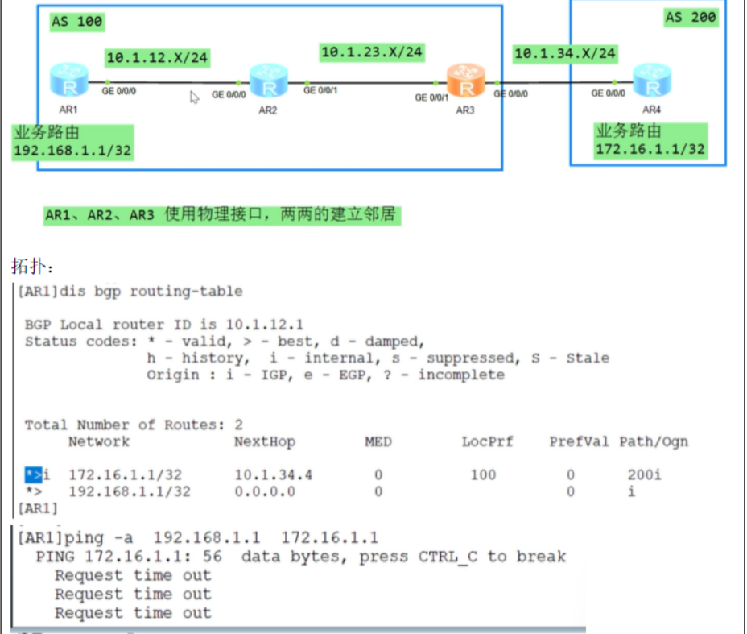
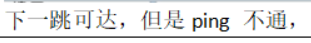
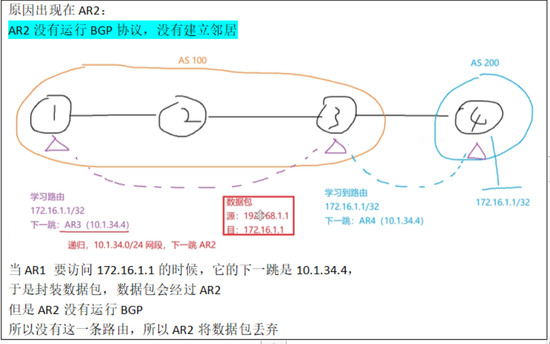

## BGP 配置
```
BGP 配置
（BGP 建立邻居的 IP 地址必须可达，可以先进行 ping 测试，在配置邻居关系）

1、创建 BGP 进程及 AS 号
	bgp 100						// 创建 BGP，且 AS 号为：100

2、指定邻居关系（IPv4）
 	peer X.X.X.X as-number 100 			// 例如：与 AS 100 的 X.X.X.X 设备建立邻居（X 为对等体的通信 IP 地址）必须保障可达

3、指定更新源
	peer X.X.X.X connect-interface + 接口 ID		// 指定接口与对方建立对等体关系（使用非直连接口，如：loopback 必须指定更新源）	

4、如果是 EBGP 建立邻居（非直连，如：跨越多个设备，或者使用 loopback0，都需要根据设备的数量和接口添加 TTL 值）
	peer X.X.X.X ebgp-max-hop 10			// 把 EBGP 的 TTL 改为 10（该命令，只在 EBGP 生效）

5、发布 BGP 路由
	network 192.168.1.1 32				// 把路由 192.168.1.1/32 发布到 BGP 路由表中
							（确保发布设备的全局路由表有 192.168.1.1/32 的路由，且掩码都必须相等）
6、修改路由发布的下一跳
	peer X.X.X.X next-hop-local			// 传递路由给 X.X.X.X 对等体时，下一跳改为本设备的更新源地址


查看配置命令
display bgp peer					// 查看邻居关系及参数（状态为：established 代表建立成功）

display bgp routing-table				// 查看 BGP 路由表（本地路由表）
```


## BGP 路径属性

### 1. 公认必遵
```
  公认：
    所有的 BGP 路由器都能识别
	
  必遵：
    所有的 BGP 路由器传递路由信息时都必须携带（如果不携带会产生 notification 报文，断开 TCP 连接，回到 idle 状态）

	（Origin、AS_Path、Next_hop）
```

### 2. 公认任意
```
  公认：
    所有的 BGP 路由器都能识别
	
  任意：
    BGP 路由器传递路由时，可以选择是否携带该属性（如果不携带也不会产生差错信息）
	
  （Local_Preference、Atomic_aggregate） 
```

### 3. 可选过渡
```
  可选：
    BGP 路由器可以不识别（不是强制需要识别的）
	
  过渡：
    当 BGP 对等体对于该属性识别或者是不识别都会传递（可以传递给其他对等体识别）
	
  （Aggregator、Community）
```

### 4. 可选非过渡
```
  可选：
    BGP 路由器可以不识别（不是强制需要识别的）
	
  非过渡：
    该属性如果 BGP 路由器能够识别，则传递给其他对等体（如果不识别，则不传递）
```

## 常见 BGP 路由属性及所属类型
### 公认必遵
---
#### Origin属性

```
- 一定在 Update 报文中 存在
- 用于标记一条 BGP 路由的路由信息源类型
  - 指明了当前路由是从哪一类设备中产生

dis bgp routing-table
```
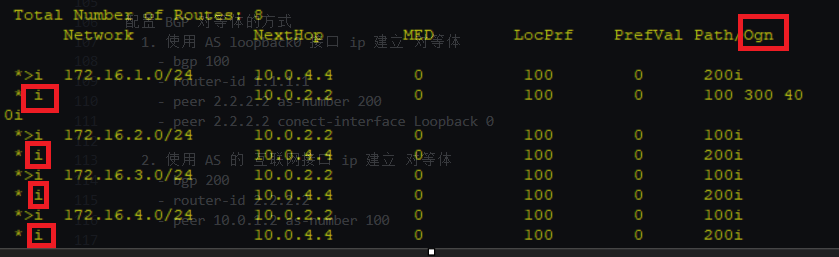
```
三种类型

1. IGP(i):
    - 是从 IBGP 设备 通过 network 通告的路由
    - 本 AS 内产生的路由，
    - 优先级最高

2. EGP(e):
    - 从 EBGP 对等体学习到的路由
    - 优先级次之

3. incomplete(?):
    - 优先级最低
    - 通过其他方式学习到的路由

优选顺序：
  i > e > ?
```

#### AS_Path 属性
```
- 顺序记录了某条路由从 本地 到达 目的地址
- 所经过的所有 AS 号

例如：
  (200,400,100)
    - 表示 该路由经过 AS200，AS400，AS100 这三个路由
    - 其中 AS200 最近
    - AS100 最远


（1） 通过 自身引入路由
      - 发给 EBGP 对等体
        - update 报文中 创建 一个携带本地 AS 号的 AS_Path 列表
      - 发给 IBGP 对等体
        - update 报文中，创建 一个空的 AS_Path 列表

（2）通过从其他BGP Specker 的 Update 报文学到的路由
      - 发 EBGP 
        - 本地 AS 号加到 AS路径列表 最前面
      - 发 IBGP
        - 不改变 AS_Path

（3）缺省
      - BGP 不接受 AS_Path 中已有 本地AS号的路由，避免环路
      - （只有 EBGP 对等体之间通报 才在 AS_Path 表中 添加 AS 号，同一 AS 中通告，不加）
```
##### 作用
```
	① 描述所经过的路径：
    每经过一个 AS 都会携带一个 AS 号，并且会把这些 AS 号记录起来
	
  ② 防环：
    如果收到一条 BGP 路由，携带的 AS-path 与本地 AS 相同，则禁止接收该路由（防止路由回灌）
	
  ③ 路由选路：
    会优选 AS-path 更短的路由（与数值无关，与长度有关）

	
  有序列表：
      会根据所经过的 AS 按顺序添加
	
  无序列表：
      会把无法区分顺序的 AS 存放到 {} 中，{} 中的 AS 无顺序之分，按照一个 AS 长度处理
```
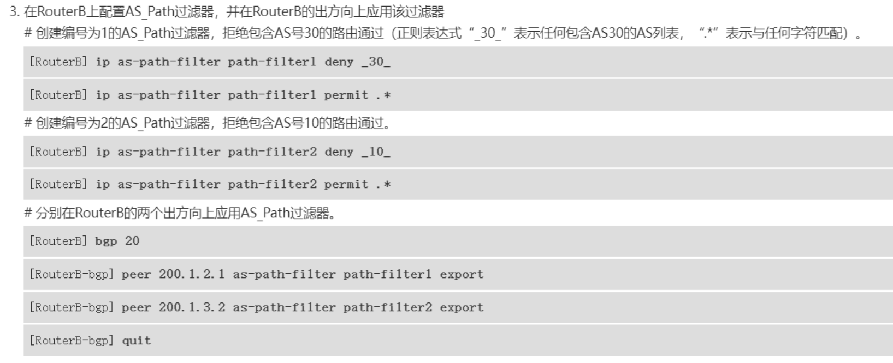
[AS-Path 属性配置](#AS_Path)

#### Next_hop
```
作用：
  引导数据包找到最优路径转发
	
  ① IBGP（非始发）传递路由给其他 IBGP 邻居，下一跳不改变（引导数据包从最优的 EBGP 出接口出去本 AS）
		但是也可能会导致下一跳不可达，路由无效的问题
	
  （使用 next-hop local 解决下一跳不可达和次优路径的问题，配置后 IBGP 路由器传递路由时会修改下一跳为本地更新源地址）

	② EBGP 默认传递路由的时候，下一跳会修改
		EBGP 会根据收到路由的下一跳，和本地需要修改的下一跳做对比，相同网段则不修改下一跳传递（如果不同网段则修改下一跳地址）
```

### 公认可选
---
#### Local_Preference (本地优先级)
```
只在 IBGP邻居之间传递，不能传递给EBGP邻居（本AS范围使用）

  默认值：100 （越大越优，取值范围0 ~ 4294967295）

  作用：影响本 AS 的设备如何选择出去本 AS 的最优路径（影响流量的出口）
```

#### Atomic_aggregate （原子聚合属性）
```
是一个告警属性，
  告知设备该汇总路由有成员属性的丢失（但无确切值），
  有环路的风险或其他风险
```

### 可选过渡
---
#### Aggregator（聚合者属性）
```
用于告知其他对等体，该汇总路由，由哪一个 AS，哪一台设备产生
		携带聚合路由的产生者  AS 及其 Router id
```

#### community（团体属性）
```
用于标识一组路由，方便管理和控制
		① 公认团体属性：
            设备默认就能识别，并且携带相关动作的团体属性
	
		② 自定义团体属性：
            为了满足用户的需求，可以配置自定义团体属性
				（用户可以根据不同的路由打上标签，团体属性就相当于标签 ”无特殊含义“）
```

### 可选非过渡
---
```
cluster list

originator id（可以参考二：反射器笔记）
```
#### MED
```
用于控制流量如何从最优路径进入到本 AS 中

	缺省值（0，或者根据路由进入 BGP 时的开销值计算）
	
    MED 缺省情况下只在相邻的 AS 传递，不会再传递给第三方 AS，同时 MED 比较时（这些路由都需要来自相同 AS）
```
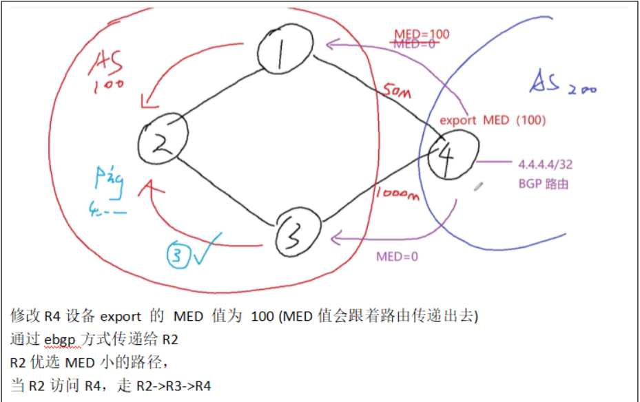
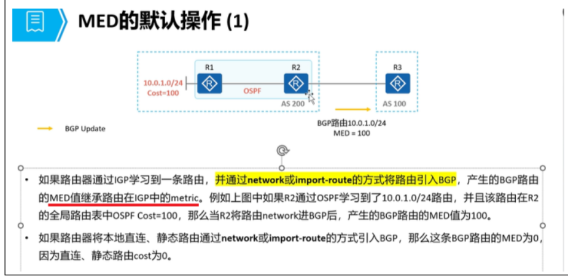
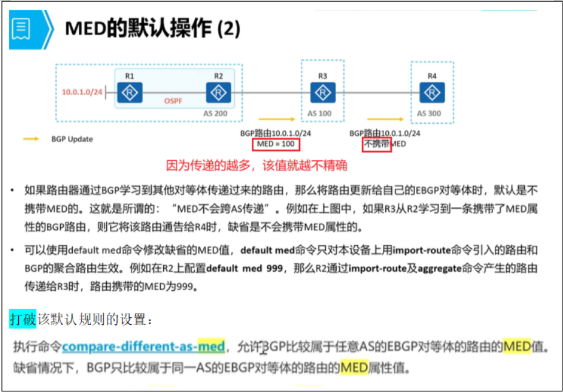


## BGP 路径属性修改
```
一、创建路由策略
1、匹配需要修改的路由信息
	acl 2000
	rule permit source 192.168.1.1 0		// 运行 192.168.1.1/32 路由通过

2、创建 route-policy（系统配置视图）
	route-policy test permit node 10 		// 创建路由策略，名称：test，动作为运行放行，节点 10

3、匹配需要修改的对象，及修改属性
	if-match acl 2000 				// 匹配 ACL 2000 中的路由信息
 	apply as-path 200 additive			// 动作为在原有基础上添加 AS 200

	（在原有基础上，把 192.168.1.1/32 路由 AS-path 再添加上 200）


	（默认情况下，使用路由策略，没有被放行的路由，默认动作为拒绝）
	如果除了 ACL 2000 匹配的路由以外，还有其他路由需要传递，则需要在原有的 node 10 基础上，添加一条放行策略

	route-policy test permit node 20 		// 创建路由策略，名称：test，动作为放行，节点 10
							（匹配所有的路由，不做属性修改，直接放行）
	
二、调用（需要进入相关协议调用以上策略）
	bgp 100
	peer 2.2.2.2 route-policy test import（或者 export）	// import 代表，从 2.2.2.2 收到的路由，把 192.168.1.1/32 as-path 进行修改
								// 如果为 export 则为本设备传递路由给 2.2.2.2 时，修改 as-path 属性

	最终效果（例如：AR2 有路由 192.168.1.1/32 和 172.16.1.1/32）
	在 AR1 接收到 AR2 的路由时，把 192.168.1.1/32 的路由修改 AS-path 属性，其余路由（172.16.1.1/32）不做修改直接接收

```

### 例子
```
背景：AR1 的 loopback 接口地址（1.1.1.1/32） 、AR2（2.2.2.2/32）、AR3（3.3.3.3/32）
	这三台设备均使用 loopback 接口建立邻居关系（修改属性值）

例子1：（AR1 把 192.168.1.1/32 的业务路由传递给 AR2，并修改本地优先级为 500）


	AR1 配置
	①acl 2000
	rule permit source 192.168.1.1 0		// 运行 192.168.1.1/32 路由通过

	②route-policy LP permit node 10 
 	if-match acl 2000 
 	apply local-preference 500  			// 创建路由策略（LP）允许 ACL 2000 的路由通告，并且修改本地优先级为 500

	route-policy LP permit node 20 			// 如果 AR1 还存在其他路由，则需要添加额外的放行 node

	③bgp 100
	peer 2.2.2.2 route-policy LP export		// AR1 把 ACL 2000 匹配的路由传递给 AR2，同时修改本地优先级属性为 500
							（代表把属性修改后，再传递给 AR2）
	（删除节点 undo route-policy LP 20，删除节点 20）
```

```
例子2：（AR3 收到来自 AR1 的 192.168.1.1/32 路由，首选值修改为 50，其余路由不修改）
	AR3 配置
	①acl 2000
	rule permit source 192.168.1.1 0		// 运行 192.168.1.1/32 路由通过

	②route-policy PV permit node 10 
 	if-match acl 2000 
 	apply preferred-value 50			// 创建路由策略 PV，允许 192.168.1.1/32 路由通告，且首选值修改为 50

	route-policy PV permit node 20			// 允许其他路由通过，且不修改属性

	③bgp 300
	peer 1.1.1.1 route-policy PV import		// import 代表接收到路由后，再修改属性

```


### BGP 路由选路和负载分担配置
```
  1. 配置 BGP 协议的优先级
  2. 配置 Next_Hop 属性
  3. 配置 BGP 路由首选值
  4. 配置本机缺省 Local_Pref 属性
  5. 配置 AS_Path 属性
  6. 配置 MED 属性
  7. 配置 BGP 团体属性
  8. 配置 BGP 负载分担
```

## 小结
```
配置 BGP 对等体的方式
  1. 使用 AS loopback0 接口 ip 建立 对等体
    - bgp 100
    - router-id 1.1.1.1
    - peer 2.2.2.2 as-number 200
    - peer 2.2.2.2 conect-interface Loopback 0

  2. 使用 AS 的 互联网接口 ip 建立 对等体
    - bgp 200
    - router-id 2.2.2.2
    - peer 10.0.1.2 as-number 100

### 有问题？  为什么要这样呢？
- AS 系统内部 使用 Loopback0 建立 对等体
- AS 系统之间 使用 互联网接口 建立 对等体
```

## 实验
### 1. BGP (使用 loopback0 来建立对等体) 
```
    你是公司的网络管理员。公司的网络采用了 BGP 协议作为路由协议。公司的网络由多个自治
系统组成，不同的分支机构使用了不同的 AS 号，现在你需要完成公司网络的搭建工作。在公
司总部使用了 OSPF 作为 IGP，公司内部不同分支机构使用的是私有的 BGP AS 号。在完成网
络搭建以后，你还需要观察 BGP 路由信息的传递。

# 任务
    1. 设备 IP 地址配置。
    2. 配置 AS 64512 内的 OSPF。
    3. 配置 AS 64512 内的全互联 IBGP 对等体关系。
    4. 配置 AS 64512、AS 64513、AS 64514 之间的 EBGP 对等体关系。
    5. 在 R1、R5 上将 Loopback1 接口路由发布到 BGP，
    在 R2、R4 上修改 BGP 下一跳地址。
```
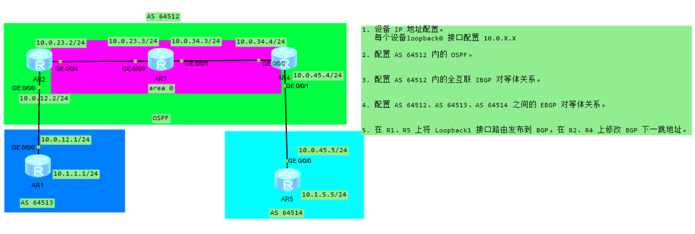
```bash
1. 设备 IP 地址配置。

2. 配置 AS 64512 内的 OSPF。
# R2
    ospf 1 router-id 10.0.2.2 
    area 0.0.0.0 
        network 10.0.2.2 0.0.0.0 
        network 10.0.23.2 0.0.0.0 

# R3
    ospf 1 router-id 10.0.3.3 
    area 0.0.0.0 
        network 10.0.3.3 0.0.0.0 
        network 10.0.23.3 0.0.0.0 
        network 10.0.34.3 0.0.0.0

# R4
    ospf 1 router-id 10.0.4.4 
    area 0.0.0.0 
        network 10.0.4.4 0.0.0.0 
        network 10.0.34.4 0.0.0.0

3. 配置 AS 64512 内的全互联 IBGP 对等体关系。
# R2
    # 1. 启动 BGP AS号为 64512
    bgp 64512
    # 2. 配置完 BGP 设备的 router-id 用于指定设备的 Route-id
    router-id 10.0.2.2
    # 3. 创建 BGP 对等体
    peer 10.0.3.3 as-number 64512
    peer 10.0.3.3 connect-interface LoopBack0
    # 4. 指定建立 EBGP 连接允许的最大跳数
    peer 10.0.1.1 ebgp-max-hop 2
    - 如果 ebgp 有一端，两端都要配置 本命令

4. 配置 AS 64512、AS 64513、AS 64514 之间的 EBGP 对等体关系。
5. 在 R1、R5 上将 Loopback1 接口路由发布到 BGP，
在 R2、R4 上修改 BGP 下一跳地址。
```
#### 配置
##### R1
```
#
interface GigabitEthernet0/0/0
    ip address 10.0.12.1 255.255.255.0 
#
interface LoopBack0
 ip address 10.0.1.1 255.255.255.255 
#
interface LoopBack1
 ip address 10.1.1.1 255.255.255.0 
#
bgp 64513
 router-id 10.0.1.1
 peer 10.0.2.2 as-number 64512 
 peer 10.0.2.2 ebgp-max-hop 2 

 network 10.1.1.0 255.255.255.0 
#
ospf 1 
 area 0.0.0.0 
#
ip route-static 10.0.2.2 255.255.255.255 10.0.12.2
#
```
##### R2
```
#
interface GigabitEthernet0/0/0
 ip address 10.0.12.2 255.255.255.0 
#
interface GigabitEthernet0/0/1
 ip address 10.0.23.2 255.255.255.0 
#
interface LoopBack0
 ip address 10.0.2.2 255.255.255.255 
#
bgp 64512
 router-id 10.0.2.2
 peer 10.0.1.1 as-number 64513 
 peer 10.0.1.1 ebgp-max-hop 2 
 peer 10.0.3.3 as-number 64512 
 peer 10.0.3.3 connect-interface LoopBack0
 peer 10.0.4.4 as-number 64512 
 peer 10.0.4.4 connect-interface LoopBack0

 peer 10.0.3.3 next-hop-local 
 peer 10.0.4.4 next-hop-local 
#
ospf 1 router-id 10.0.2.2 
 area 0.0.0.0 
  network 10.0.2.2 0.0.0.0 
  network 10.0.23.2 0.0.0.0  
#
ip route-static 10.0.1.1 255.255.255.255 10.0.12.1
#
```
##### R3
```
#
interface GigabitEthernet0/0/0
 ip address 10.0.23.3 255.255.255.0 
#
interface GigabitEthernet0/0/1
 ip address 10.0.34.3 255.255.255.0 
#
interface LoopBack0
 ip address 10.0.3.3 255.255.255.255 
#
bgp 64512
 router-id 10.0.3.3
 peer 10.0.2.2 as-number 64512 
 peer 10.0.2.2 connect-interface LoopBack0
 peer 10.0.4.4 as-number 64512 
 peer 10.0.4.4 connect-interface LoopBack0
#
ospf 1 router-id 10.0.3.3 
 area 0.0.0.0 
  network 10.0.3.3 0.0.0.0 
  network 10.0.23.3 0.0.0.0 
  network 10.0.34.3 0.0.0.0 
#
```
##### R4
```
#
interface GigabitEthernet0/0/0
 ip address 10.0.34.4 255.255.255.0 
#
interface GigabitEthernet0/0/1
 ip address 10.0.45.4 255.255.255.0 
#
interface LoopBack0
 ip address 10.0.4.4 255.255.255.255 
#
bgp 64512
 peer 10.0.2.2 as-number 64512 
 peer 10.0.2.2 connect-interface LoopBack0
 peer 10.0.3.3 as-number 64512 
 peer 10.0.3.3 connect-interface LoopBack0
 peer 10.0.5.5 as-number 64514 
 peer 10.0.5.5 ebgp-max-hop 2 
 #
  peer 10.0.2.2 next-hop-local 
  peer 10.0.3.3 next-hop-local 
#
ospf 1 router-id 10.0.4.4 
 area 0.0.0.0 
  network 10.0.4.4 0.0.0.0 
  network 10.0.34.4 0.0.0.0 
#
ip route-static 10.0.5.5 255.255.255.255 10.0.45.5
#
```
##### R5
```
#
interface GigabitEthernet0/0/0
 ip address 10.0.45.5 255.255.255.0 
#
interface LoopBack0
 ip address 10.0.5.5 255.255.255.255 
#
interface LoopBack1
 ip address 10.1.5.5 255.255.255.0 
#
bgp 64514
 peer 10.0.4.4 as-number 64512 
 peer 10.0.4.4 ebgp-max-hop 2 
 #
  network 10.1.5.0 255.255.255.0 
#
ip route-static 10.0.4.4 255.255.255.255 10.0.45.4
#
```

### 1.1 BGP (使用 互联网接口 来建立对等体)
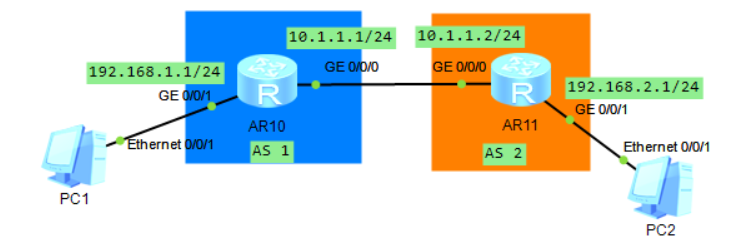

#### AR10
```
#
interface GigabitEthernet0/0/0
 ip address 10.1.1.1 255.255.255.0 
#
interface GigabitEthernet0/0/1
 ip address 192.168.1.1 255.255.255.0 
#
interface GigabitEthernet0/0/2
#
bgp 1
 peer 10.1.1.2 as-number 2 
 #
 ipv4-family unicast
  undo synchronization
  network 192.168.1.0 
  peer 10.1.1.2 enable
#
```

#### AR11
```
#
interface GigabitEthernet0/0/0
 ip address 10.1.1.2 255.255.255.0 
#
interface GigabitEthernet0/0/1
 ip address 192.168.2.1 255.255.255.0 s
#
bgp 2
 peer 10.1.1.1 as-number 1 
 #
 ipv4-family unicast
  undo synchronization
  network 192.168.2.0 
  peer 10.1.1.1 enable
#
```


### 总结
```
1. 启动 BGP 进程
    bgp as-number

2. 设置 router-id
    router-id ip-address
# 缺省时，自动选择 loopback接口最大 ip地址， 接口最大ip地址，ip地址

3. 设置对等体
    peer ip as-number 64513(AS号)
```

### 2. BGP 汇总
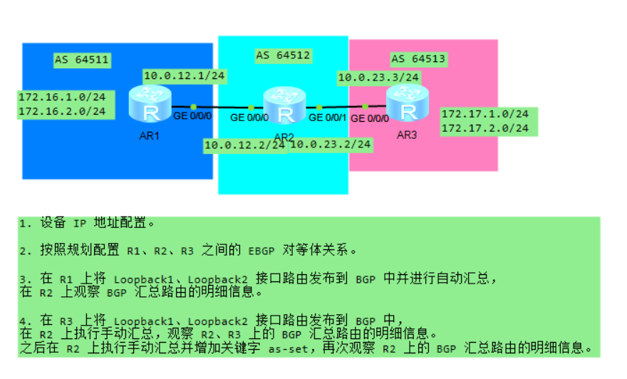
```
1. 设备 IP 地址配置。

2. 按照规划配置 R1、R2、R3 之间的 EBGP 对等体关系。

3. 在 R1 上将 Loopback1、Loopback2 接口路由发布到 BGP 中并进行自动汇总，
在 R2 上观察 BGP 汇总路由的明细信息。

4. 在 R3 上将 Loopback1、Loopback2 接口路由发布到 BGP 中，
在 R2 上执行手动汇总，观察 R2、R3 上的 BGP 汇总路由的明细信息。
之后在 R2 上执行手动汇总并增加关键字 as-set，再次观察 R2 上的 BGP 汇总路由的明细信息。
```
#### 配置
##### AR1
```
sysname AR1
#
interface GigabitEthernet0/0/0
 ip address 10.0.12.1 255.255.255.0 
#
interface LoopBack0
 ip address 10.0.1.1 255.255.255.255 
#
interface LoopBack1
 ip address 172.16.1.1 255.255.255.0 
#
interface LoopBack2
 ip address 172.16.2.1 255.255.255.0 
#
#
bgp 64511
 router-id 10.0.1.1
 peer 10.0.12.2 as-number 64512 
 #
 ipv4-family unicast
  undo synchronization
  summary automatic
  import-route direct route-policy hcip
  peer 10.0.12.2 enable
#
route-policy hcip permit node 10 
 if-match ip-prefix 1 
#
ip ip-prefix 1 index 10 permit 172.16.0.0 16 greater-equal 24 less-equal 24
#
```
###### 注意
```
1. 使用 BGP 汇总时候 不要 network 那个网段，否则路由汇总会出问题
·
#
bgp 64511
 router-id 10.0.1.1
 peer 10.0.12.2 as-number 64512 
 #
 ipv4-family unicast
  undo synchronization
  summary automatic
  import-route direct route-policy hcip

#################### 有问题的位置  ###########################
  network 172.16.1.0 255.255.255.0
  network 172.16.2.0 255.255.255.0
##############################################################

  peer 10.0.12.2 enable
#
route-policy hcip permit node 10 
 if-match ip-prefix 1 
#
ip ip-prefix 1 index 10 permit 172.16.0.0 16 greater-equal 24 less-equal 24
#
·

2. BGP 汇总解释
    - 1. 设置 路由策略
        #
        route-policy hcip permit node 10 
        if-match ip-prefix 1 
        #
        ip ip-prefix 1 index 10 permit 172.16.0.0 16 greater-equal 24 less-equal 24
        #
    - 2. 路由导入 汇总
        summary automatic
        import-route direct route-policy hcip
```
##### AR2
```
sysname AR2
#
interface GigabitEthernet0/0/0
 ip address 10.0.12.2 255.255.255.0 
#
interface GigabitEthernet0/0/1
 ip address 10.0.23.2 255.255.255.0 
#
interface LoopBack0
 ip address 10.0.2.2 255.255.255.255 
#
bgp 64512
 router-id 10.0.2.2
 peer 10.0.12.1 as-number 64511 
 peer 10.0.23.3 as-number 64513 
 #
 ipv4-family unicast
  undo synchronization
  aggregate 172.17.0.0 255.255.252.0 as-set detail-suppressed 
  peer 10.0.12.1 enable
  peer 10.0.23.3 enable
#

# 执行手动汇总
# 为防止路由环路，在 R2 上执行手动汇总时增加 as-set 关键字
    aggregate 172.17.0.0 255.255.252.0 as-set detail-suppressed
```
##### AR3
```
sysname AR3
#
interface GigabitEthernet0/0/0
 ip address 10.0.23.3 255.255.255.0 
#
interface LoopBack0
 ip address 10.0.3.3 255.255.255.255 
#
interface LoopBack1
 ip address 172.17.1.1 255.255.255.0 
#
interface LoopBack2
 ip address 172.17.2.1 255.255.255.0 
#
bgp 64513
 router-id 10.0.3.3
 peer 10.0.23.2 as-number 64512 
 #
 ipv4-family unicast
  undo synchronization
  import-route direct route-policy hcip
  peer 10.0.23.2 enable
#
route-policy hcip permit node 10 
 if-match ip-prefix 1 
#
ip ip-prefix 1 index 10 permit 172.17.0.0 16 greater-equal 24 less-equal 24
#


- 1. 设置 路由策略
        #
        route-policy hcip permit node 10 
        if-match ip-prefix 1 
        #
        ip ip-prefix 1 index 10 permit 172.17.0.0 16 greater-equal 24 less-equal 24
        #
- 2. 引入
    import-route direct route-policy hcip
```

### 2. 思考
Aggregate 和 Summary automatic 产生的汇总路由在携带的路径属性上有什么不同？


### 3. BGP 反射器
#### 路由反射器
```
三个角色：
  1、反射器（RR）：打破水平分割的问题；将路由传递给客户机
  2、客户机（client）
  3、非客户机（不是反射器也不是客户机，则为非客户机）

反射器规则：非非不传
  从非客户机收到的路由，不能反射给非客户机

  1、从非客户机收到的路由，可以反射给客户机，EBGP邻居
  2、从客户机收到的路由，可以反射给客户机，非客户机，EBGP邻居
  3、从非客户机收到的路由，不能反射给非客户机

配置：
bgp 100
  peer 1.1.1.1 reflect-client  //将1.1.1.1设备作为客户机，即本设备为RR


反射簇：
  反射器+客户机组成的集群
```

#### 添加属性
```
1. originator id：
  由第一台 RR 添加，添加传递该路由的 BGP 路由器 router id，并且不会被后续的 RR 修改
	
    用于簇内防环，当收到的 originator id 与本设备的 router id 相同，则会拒收该路由

	补充：该属性还能用于选路，选择 originator id 更小的路由

2. cluster list：
	簇间防环
	
  ① 反射器反射路由时会默认添加上自己 Router id（cluster id）
	
  ② 每经过一个反射器都会添加上该设备的 cluster id，这些 id 会组成一个列表（list）代表该路由经过的簇
	   如果收到的路由 cluster list 包含本地的 router id，则拒收路由（认为存在环路风险）

	补充：用于路由优选时，优先选择 cluster list 更短的路由
      
      优点：反射器可以不改变现有的对等体关系（依旧为 IBGP）即可打破水平分割和环路

	  缺点：网络规模越大，对等体关系越多需要的反射器就越多（客户机是不知道自己是客户机的，有可能会重复配置反射器）也会来重复路由反射的问题


补充规则：
	反射器会原封不动的把客户机的路由反射给其他设备（反射过程中的路由无法修改 BGP 属性，只能保留原始属性 “cluster list 和 originator id 除外”）
```

#### 主备反射器设置
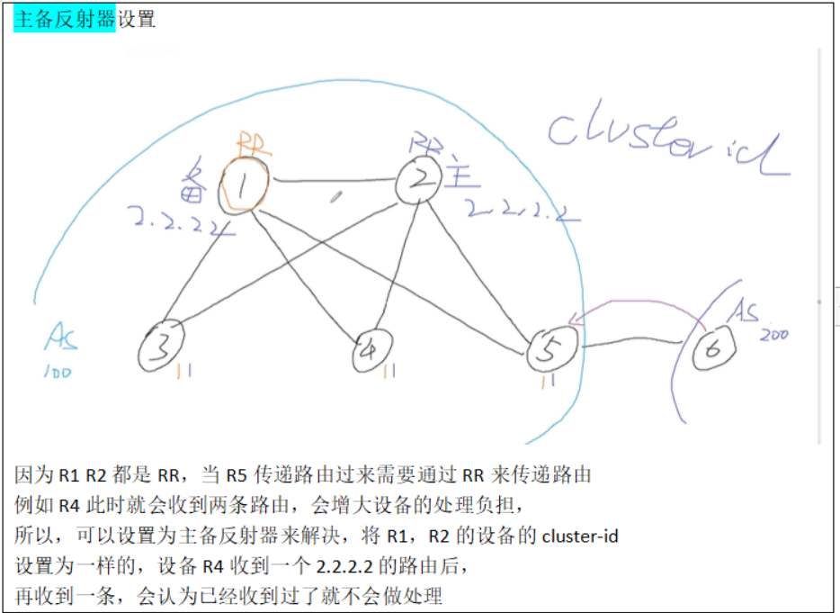

#### 思考题
- 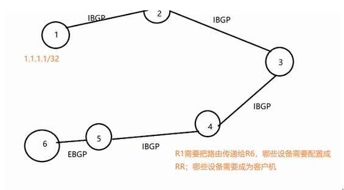
```
### 答案
 RR: 
    2,3,4
 Client:
    3,4,5

### 原因
    因为对于Client是在 R2 上设置，R3 并不知道自己是Client
    而且 IBGP 之间有水平分割，所以无法传递下去，
    需要将 R3 设置为Client 也要作为 RR3，才能传递下去
```
- 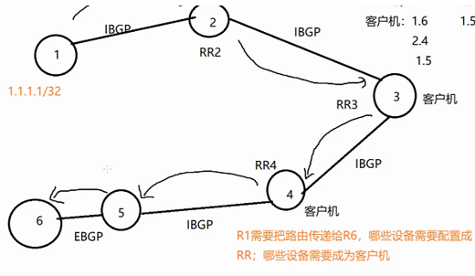


#### 反射器常见组网方式
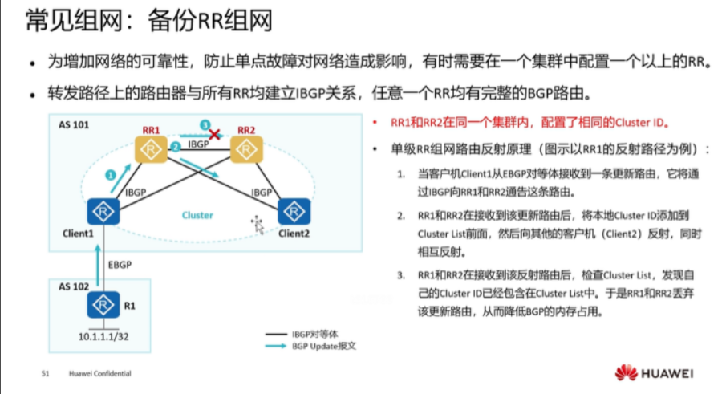
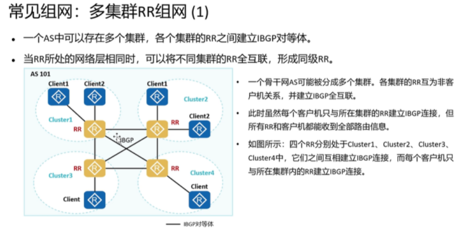
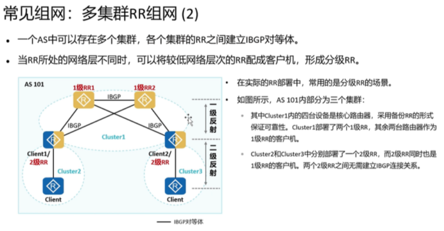


#### 例子
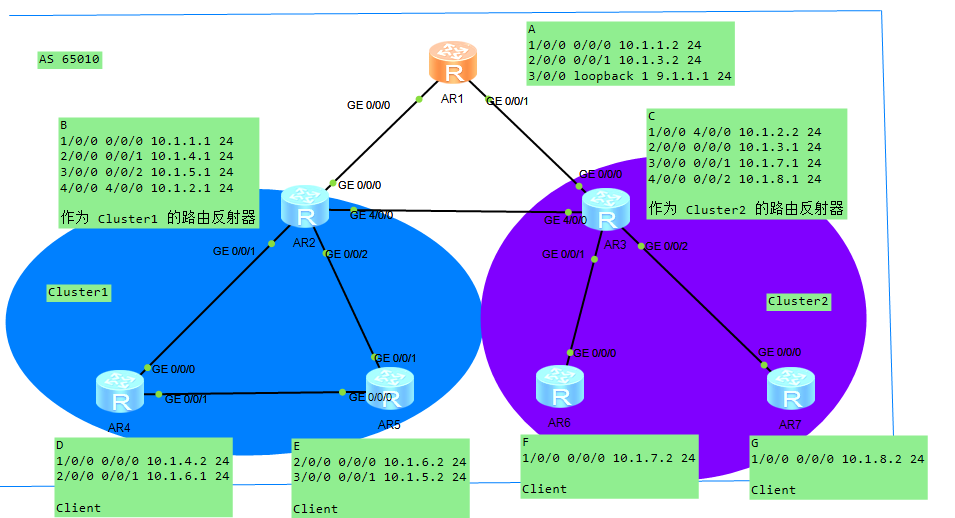
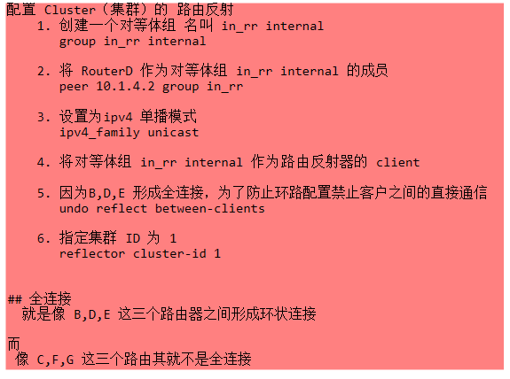
```
举例
A
1/0/0 0/0/0 10.1.1.2 24
意思是 1/0/0 端口对应实际 0/0/0 端口 ip 配置为 10.1.1.2 24
```
#### AR1
```
#
interface GigabitEthernet0/0/0
 ip address 10.1.1.2 255.255.255.0 
#
interface GigabitEthernet0/0/1
 ip address 10.1.3.2 255.255.255.0 
#
interface LoopBack1
 ip address 9.1.1.1 255.255.255.0 
#
bgp 65010
 router-id 1.1.1.1
 peer 10.1.1.1 as-number 65010 
 peer 10.1.3.1 as-number 65010 
 #
 ipv4-family unicast
  undo synchronization
  network 9.1.1.0 255.255.255.0 
  peer 10.1.1.1 enable
  peer 10.1.3.1 enable
#
```
#### AR2
```
#
interface GigabitEthernet0/0/0
 ip address 10.1.1.1 255.255.255.0 
#
interface GigabitEthernet0/0/1
 ip address 10.1.4.1 255.255.255.0 
#
interface GigabitEthernet0/0/2
 ip address 10.1.5.1 255.255.255.0 
#
interface GigabitEthernet4/0/0
 ip address 10.1.2.1 255.255.255.0 
#
bgp 65010
 router-id 2.2.2.2
 peer 10.1.1.2 as-number 65010 
 peer 10.1.8.1 as-number 65010 
 group in_rr internal  // 创建一个名叫 in_rr internal 的对等体组
 peer 10.1.4.2 as-number 65010 
 peer 10.1.4.2 group in_rr // 将 Router4 作为对等体组 in_rr 的成员
 peer 10.1.5.2 as-number 65010 
 peer 10.1.5.2 group in_rr // 将 Router5 作为对等体组 in_rr 的成员
 #
 ipv4-family unicast
  undo synchronization
  undo reflect between-clients // 禁止客户间直接通信，因为 AR4 和 AR5之间是全连接的，
                               // 而 反射器客户间是不能直接通信的，为了防止环路的产生
  reflector cluster-id 1 // 指定集群 ID 号 为 1
  peer 10.1.1.2 enable
  peer 10.1.8.1 enable
  peer in_rr enable 
  peer in_rr reflect-client // 将对等体组 in_rr internal 作为路由反射器的客户
  peer 10.1.4.2 enable
  peer 10.1.4.2 group in_rr 
  peer 10.1.5.2 enable
  peer 10.1.5.2 group in_rr 
#
```
#### AR3
```
#
interface GigabitEthernet0/0/0
 ip address 10.1.3.1 255.255.255.0 
#
interface GigabitEthernet0/0/1
 ip address 10.1.7.1 255.255.255.0 
#
interface GigabitEthernet0/0/2
 ip address 10.1.8.1 255.255.255.0 
#
interface GigabitEthernet4/0/0
 ip address 10.1.2.2 255.255.255.0 
#
bgp 65010
 router-id 3.3.3.3
 peer 10.1.2.1 as-number 65010 
 peer 10.1.3.2 as-number 65010 
 group in_rr internal
 peer 10.1.7.2 as-number 65010 
 peer 10.1.7.2 group in_rr 
 peer 10.1.8.2 as-number 65010 
 peer 10.1.8.2 group in_rr 
 #
 ipv4-family unicast
  undo synchronization
  reflector cluster-id 2
  peer 10.1.2.1 enable
  peer 10.1.3.2 enable
  peer in_rr enable
  peer in_rr reflect-client
  peer 10.1.7.2 enable
  peer 10.1.7.2 group in_rr 
  peer 10.1.8.2 enable
  peer 10.1.8.2 group in_rr 
#
```
#### AR4
```
#
interface GigabitEthernet0/0/0
 ip address 10.1.4.2 255.255.255.0 
#
interface GigabitEthernet0/0/1
 ip address 10.1.6.1 255.255.255.0 
#
bgp 65010
 router-id 4.4.4.4
 peer 10.1.4.1 as-number 65010 
 peer 10.1.6.2 as-number 65010 
 #
 ipv4-family unicast
  undo synchronization
  peer 10.1.4.1 enable
  peer 10.1.6.2 enable
#
```
#### AR5
```
#
interface GigabitEthernet0/0/0
 ip address 10.1.6.1 255.255.255.0 
#
bgp 65010
 router-id 5.5.5.5
 peer 10.1.5.1 as-number 65010 
 peer 10.1.6.1 as-number 65010 
 #
 ipv4-family unicast
  undo synchronization
  peer 10.1.5.1 enable
  peer 10.1.6.1 enable
#
```

#### AR6
```
#
interface GigabitEthernet0/0/0
 ip address 10.1.7.2 255.255.255.0 
#
bgp 65010
 router-id 6.6.6.6
 peer 10.1.7.1 as-number 65010 
 #
 ipv4-family unicast
  undo synchronization
  peer 10.1.7.1 enable
#
```
#### AR7
```
#
interface GigabitEthernet0/0/0
 ip address 10.1.8.2 255.255.255.0 
#
bgp 65010
 router-id 7.7.7.7
 peer 10.1.8.1 as-number 65010 
 #
 ipv4-family unicast
  undo synchronization
  peer 10.1.8.1 enable
#
```

### 4. BGP 联盟
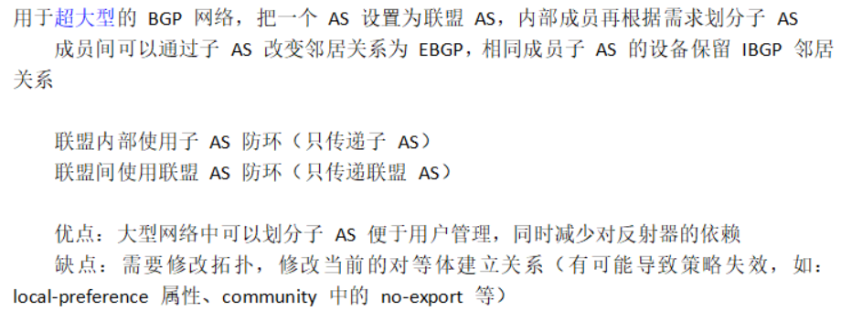

#### 例子
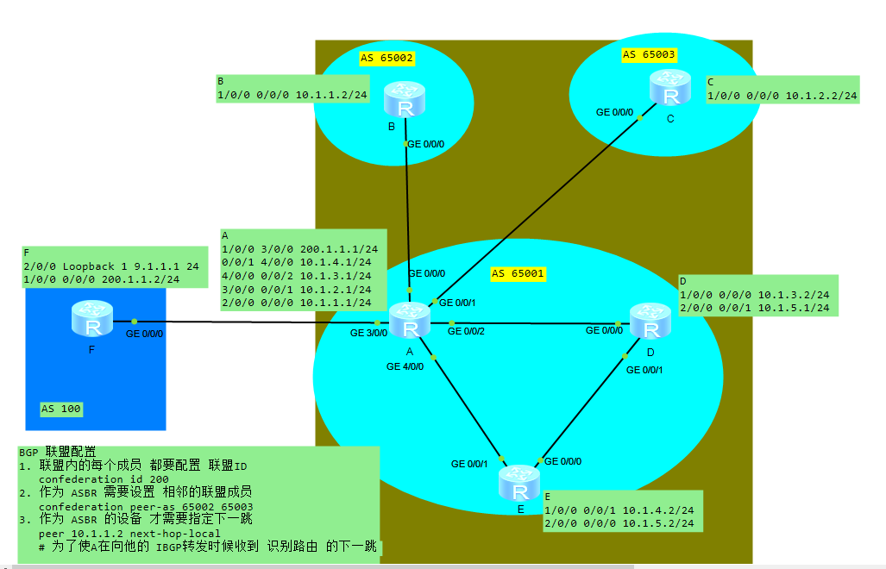
#### A （作为 ASBR 需要指定属于同一个联盟的 其他 AS， 以及需要指定的吓一跳）
```
#
interface GigabitEthernet0/0/0
 ip address 10.1.1.1 255.255.255.0 
#
interface GigabitEthernet0/0/1
 ip address 10.1.2.1 255.255.255.0 
#
interface GigabitEthernet0/0/2
 ip address 10.1.3.1 255.255.255.0 
#
interface GigabitEthernet3/0/0
 ip address 200.1.1.1 255.255.255.0 
#
interface GigabitEthernet4/0/0
 ip address 10.1.4.1 255.255.255.0 
#
interface NULL0
#
bgp 65001
 router-id 1.1.1.1
 confederation id 200     // 配置联盟 ID 为 200
 confederation peer-as 65002 65003 // 指定与 AS 65001 属于同一个联盟的还有 AS 65002，AS 65003
 peer 10.1.1.2 as-number 65002 
 peer 10.1.2.2 as-number 65003 
 peer 10.1.3.2 as-number 65001 
 peer 10.1.4.2 as-number 65001 
 peer 200.1.1.2 as-number 100 
 #
 ipv4-family unicast
  undo synchronization
  peer 10.1.1.2 enable
  peer 10.1.1.2 next-hop-local // 指定 端口为 RouterB 进行路由转发的 吓一跳 设为自己的出接口 ip 地址
  peer 10.1.2.2 enable
  peer 10.1.3.2 enable
  peer 10.1.3.2 next-hop-local 
  peer 10.1.4.2 enable
  peer 10.1.4.2 next-hop-local 
  peer 200.1.1.2 enable
#
```

#### B
```
#
interface GigabitEthernet0/0/0
 ip address 10.1.1.2 255.255.255.0 
#
bgp 65002
 router-id 2.2.2.2
 confederation id 200
 confederation peer-as 65001  // 因为没有和 RouterC 直接连接，所以与它指定 同一联盟设置，
                              // 且不是 ASBR所以不需要设置 routerA 的路由吓一跳 作为自己的出接口
 peer 10.1.1.1 as-number 65001 
 #
 ipv4-family unicast
  undo synchronization
  peer 10.1.1.1 enable
#
```

#### C
```
#
interface GigabitEthernet0/0/0
 ip address 10.1.2.2 255.255.255.0 
#
interface LoopBack1
 ip address 10.1.1.1 255.255.255.0 
#
bgp 65003
 router-id 3.3.3.3
 confederation id 200
 confederation peer-as 65001
 peer 10.1.2.1 as-number 65001 
 #
 ipv4-family unicast
  undo synchronization
  network 10.1.1.0 255.255.255.0 
  peer 10.1.2.1 enable
#
```

#### D
```
#
interface GigabitEthernet0/0/0
 ip address 10.1.3.2 255.255.255.0 
#
interface GigabitEthernet0/0/1
 ip address 10.1.5.1 255.255.255.0 
#
bgp 65001
 router-id 4.4.4.4
 confederation id 200
 peer 10.1.3.1 as-number 65001 
 peer 10.1.5.1 as-number 65001 
 peer 10.1.5.2 as-number 65001 
 #
 ipv4-family unicast
  undo synchronization
  peer 10.1.3.1 enable
  peer 10.1.5.1 enable
  peer 10.1.5.2 enable
#
```

#### E
```
#
interface GigabitEthernet0/0/0
 ip address 10.1.5.2 255.255.255.0 
#
interface GigabitEthernet0/0/1
 ip address 10.1.4.2 255.255.255.0 
#
bgp 65001
 router-id 5.5.5.5
 confederation id 200
 peer 10.1.4.1 as-number 65001 
 peer 10.1.5.1 as-number 65001 
 #
 ipv4-family unicast
  undo synchronization
  peer 10.1.4.1 enable
  peer 10.1.5.1 enable
#
```

#### F
```
#
interface GigabitEthernet0/0/0
 ip address 200.1.1.2 255.255.255.0 
#
interface LoopBack1
 ip address 9.1.1.1 255.255.255.0 
#
bgp 100
 router-id 6.6.6.6
 peer 200.1.1.1 as-number 200 
 #
 ipv4-family unicast
  undo synchronization
  network 9.1.1.0 255.255.255.0 
  peer 200.1.1.1 enable
#
```

### 5. BGP 路由优选
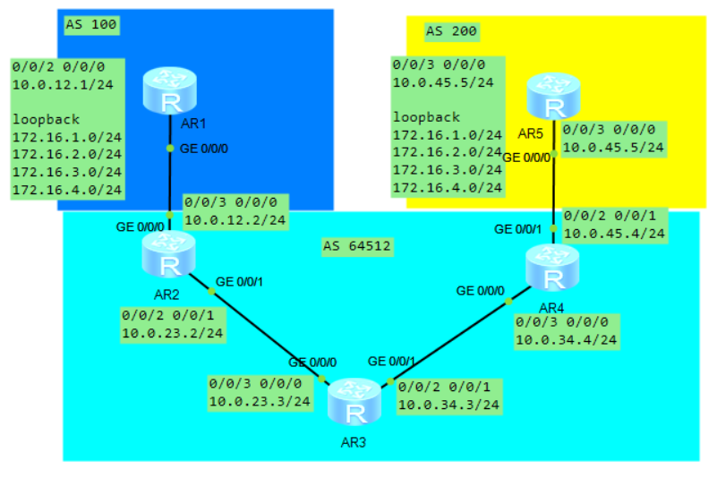
#### 基本配置
##### AR1
```
#
interface GigabitEthernet0/0/0
 ip address 10.0.12.1 255.255.255.0 
#
interface LoopBack0
 ip address 10.0.1.1 255.255.255.255 
#
interface LoopBack1
 ip address 172.16.1.1 255.255.255.0 
#
interface LoopBack2
 ip address 172.16.2.1 255.255.255.0 
#
interface LoopBack3
 ip address 172.16.3.1 255.255.255.0 
#
interface LoopBack4
 ip address 172.16.4.1 255.255.255.0 
#
bgp 100
 router-id 10.0.1.1
 peer 10.0.12.2 as-number 64512 
 #
 ipv4-family unicast
  undo synchronization
  network 172.16.1.0 255.255.255.0 
  network 172.16.2.0 255.255.255.0 
  network 172.16.3.0 255.255.255.0 
  network 172.16.4.0 255.255.255.0 
  peer 10.0.12.2 enable
#
```
##### AR2
```
#
interface GigabitEthernet0/0/0
 ip address 10.0.12.2 255.255.255.0 
#
interface GigabitEthernet0/0/1
 ip address 10.0.23.2 255.255.255.0 
#
interface LoopBack0
 ip address 10.0.2.2 255.255.255.255 
#
bgp 64512
 router-id 10.0.2.2
 peer 10.0.3.3 as-number 64512 
 peer 10.0.3.3 connect-interface LoopBack0
 peer 10.0.12.1 as-number 100 
 #
 ipv4-family unicast
  undo synchronization
  peer 10.0.3.3 enable
  peer 10.0.3.3 next-hop-local 
  peer 10.0.12.1 enable
#
ospf 1 router-id 10.0.2.2 
 area 0.0.0.0 
  network 10.0.2.2 0.0.0.0 
  network 10.0.23.2 0.0.0.0 
#
```
##### AR3
```
#
interface GigabitEthernet0/0/0
 ip address 10.0.23.3 255.255.255.0 
#
interface GigabitEthernet0/0/1
 ip address 10.0.34.3 255.255.255.0 
#
interface LoopBack0
 ip address 10.0.3.3 255.255.255.255 
#
bgp 64512
 router-id 10.0.3.3
 peer 10.0.2.2 as-number 64512 
 peer 10.0.2.2 connect-interface LoopBack0
 peer 10.0.4.4 as-number 64512 
 peer 10.0.4.4 connect-interface LoopBack0
 #
 ipv4-family unicast
  undo synchronization
  peer 10.0.2.2 enable
  peer 10.0.4.4 enable
#
ospf 1 router-id 10.0.3.3 
 area 0.0.0.0 
  network 10.0.3.3 0.0.0.0 
  network 10.0.23.3 0.0.0.0 
  network 10.0.34.3 0.0.0.0 
#
```
##### AR4
```
#
interface GigabitEthernet0/0/0
 ip address 10.0.34.4 255.255.255.0 
#
interface GigabitEthernet0/0/1
 ip address 10.0.45.4 255.255.255.0 
#
interface LoopBack0
 ip address 10.0.4.4 255.255.255.255 
#
bgp 64512
 router-id 10.0.4.4
 peer 10.0.3.3 as-number 64512 
 peer 10.0.3.3 connect-interface LoopBack0
 peer 10.0.45.5 as-number 200 
 #
 ipv4-family unicast
  undo synchronization
  peer 10.0.3.3 enable
  peer 10.0.3.3 next-hop-local 
  peer 10.0.45.5 enable
#
ospf 1 router-id 10.0.4.4 
 area 0.0.0.0 
  network 10.0.4.4 0.0.0.0 
  network 10.0.34.4 0.0.0.0 
#
```
##### AR5
```
#
interface GigabitEthernet0/0/0
 ip address 10.0.45.5 255.255.255.0 
#
interface LoopBack0
 ip address 10.0.4.4 255.255.255.255 
#
interface LoopBack1
 ip address 172.16.1.2 255.255.255.0 
#
interface LoopBack2
 ip address 172.16.2.2 255.255.255.0 
#
interface LoopBack3
 ip address 172.16.3.2 255.255.255.0 
#
interface LoopBack4
 ip address 172.16.4.2 255.255.255.0 
#
bgp 200
 router-id 10.0.5.5
 peer 10.0.45.4 as-number 64512 
 #
 ipv4-family unicast
  undo synchronization
  network 172.16.1.0 255.255.255.0 
  network 172.16.2.0 255.255.255.0 
  network 172.16.3.0 255.255.255.0 
  network 172.16.4.0 255.255.255.0 
  peer 10.0.45.4 enable
#
```

#### AS-Path属性配置
<h2 id="AS_Path"></h2>

```
AS_Path 按照矢量
```


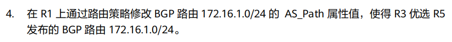
- 修改前
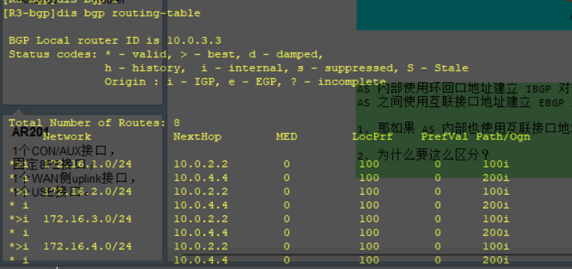

##### 修改AS_Path 属性
```bash
## 思路
  在 R1上通过路由策略修改 BGP 路由172.16.1.0/24 的 AS_Path 属性值，
  使得 R3 优选 R5 发布的 BGP 路由 172.16.1.0/24
```
- 修改后
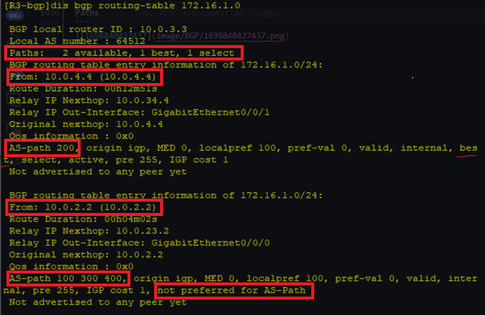
```
由图可知
  R2 通告的没有被优选的原因是 AS_path 长度

配置
  # bgp
  peer 10.0.12.2 route-policy hcip export

  # 只有满足路由匹配规则，才会改变 AS_Path 属性
  route-policy hcip permit node 10 
  if-match ip-prefix 1 
  apply as-path 300 400 additive
  #
  route-policy hcip permit node 20 // 创建一个空节点，对于另外 3条 BGP 路由不做处理
  #
  // 创建IP前缀列表 匹配对应接口
  ip ip-prefix 1 index 10 permit 172.16.1.0 24 greater-equal 24 less-equal 24

  退出系统视图
  refresh bgp all export
```
##### 创建路由策略的节点
```
#######################################################################

  # 创建路由策略的节点

  # route-policy 规则名 permit node 策略节点号

  permit/deny
    拒绝，如果路由 与 节点所有的 if-match 子句匹配成功则拒绝，否则下一句

  node 
    - 指定策略的节点号
    - 执行策略，先从节点小的进行匹配，成功则不在匹配其他节点

#######################################################################
```
##### 设置BGP 的路由AS_Path 属性
```
#######################################################################

  apply as-path ass-number-plain additive

  apply as-path 300 400 additive

  - as-number-plain
    指定要替换或增加的 整数形式的 AS 号

  - additive 
      添加 指定 AS 编号
      原（100）
      后（100，300，400）

  - overwrite
      覆盖 指定 AS 编号
      原（100）
      后（300，400）


#######################################################################
```
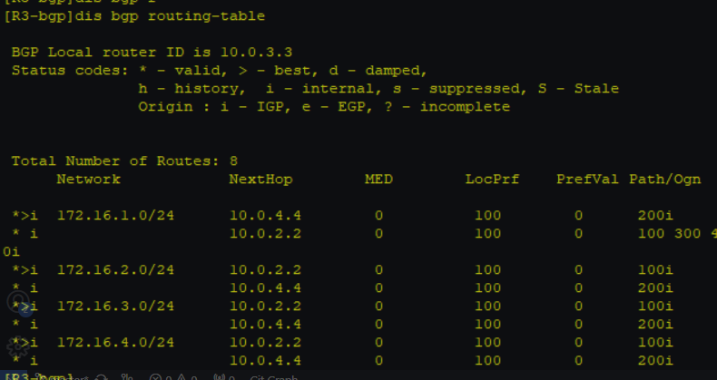


### 通过 MED 属性控制路由选择的配置示例
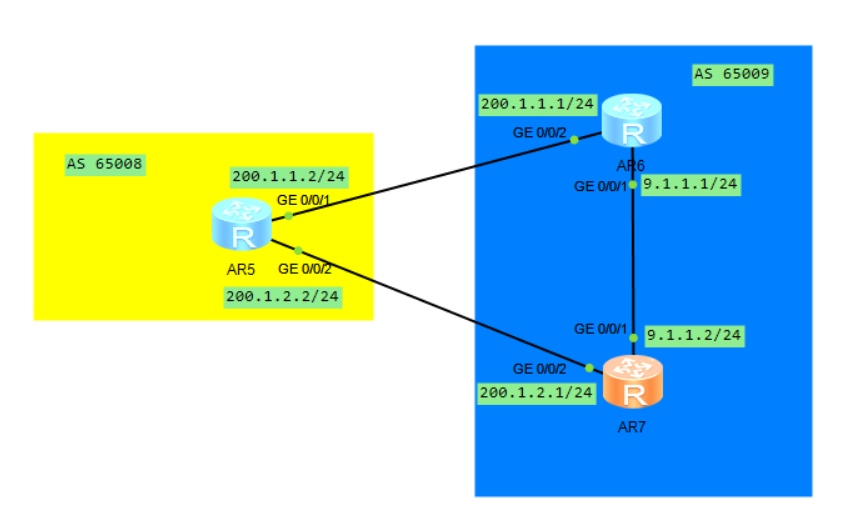

#### A
```bash
#
interface GigabitEthernet0/0/1
 ip address 200.1.1.2 255.255.255.0 
#
interface GigabitEthernet0/0/2
 ip address 200.1.2.2 255.255.255.0 
#
bgp 65008
 router-id 1.1.1.1
 peer 200.1.1.1 as-number 65009 
 peer 200.1.2.1 as-number 65009 
 #
 ipv4-family unicast
  undo synchronization
  peer 200.1.1.1 enable
  peer 200.1.2.1 enable
#
```
#### B
```bash
#
interface GigabitEthernet0/0/1
 ip address 9.1.1.1 255.255.255.0 
#
interface GigabitEthernet0/0/2
 ip address 200.1.1.1 255.255.255.0 
#
bgp 65009
 router-id 2.2.2.2
 peer 9.1.1.2 as-number 65009 
 peer 200.1.1.2 as-number 65008 
 #
 ipv4-family unicast
  undo synchronization
  network 9.1.1.0 255.255.255.0 
  peer 9.1.1.2 enable
  peer 200.1.1.2 enable
  peer 200.1.1.2 route-policy 10 export
#
```

#### C
```bash
#
interface GigabitEthernet0/0/1
 ip address 9.1.1.2 255.255.255.0 
#
interface GigabitEthernet0/0/2
 ip address 200.1.2.1 255.255.255.0 
#
bgp 65009
 router-id 3.3.3.3
 peer 9.1.1.1 as-number 65009 
 peer 200.1.2.2 as-number 65008 
 #
 ipv4-family unicast
  undo synchronization
  network 9.1.1.0 255.255.255.0 
  peer 9.1.1.1 enable
  peer 200.1.2.2 enable
#
```

#### 
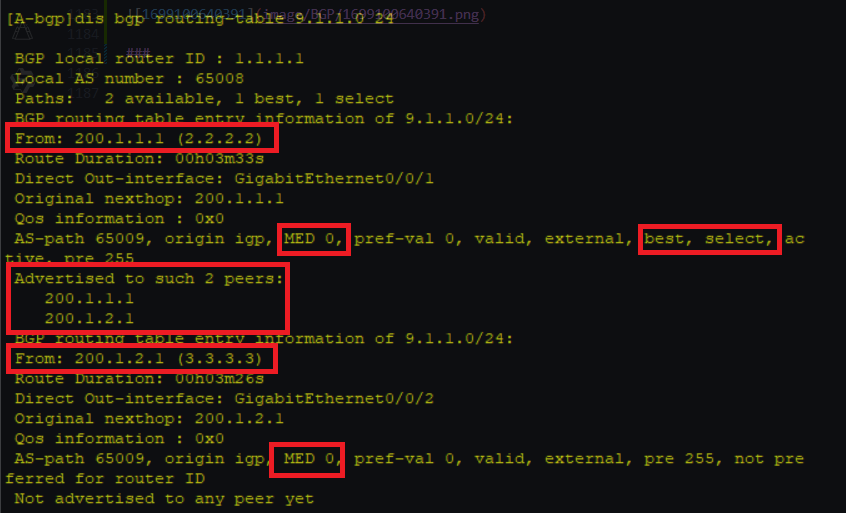

#### 配置 MED 属性后，Router C 的 MED 更大，所以更优
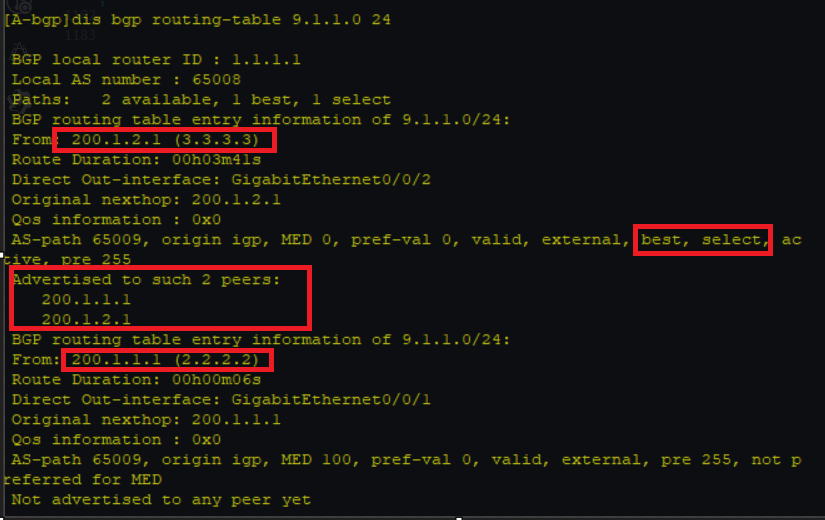

### BGP 团体配置示例
```
基本配置思路

  RouterA 上利用路由策略定义发往 对等体 RouterB 的路由带有 No_Export 团体属性
  实现 AS10 发布到 AS20 上的路由不再被 AS20 向其他 AS 转发s
```
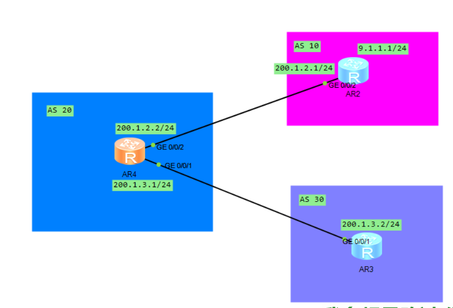

#### 配置 前 后现象
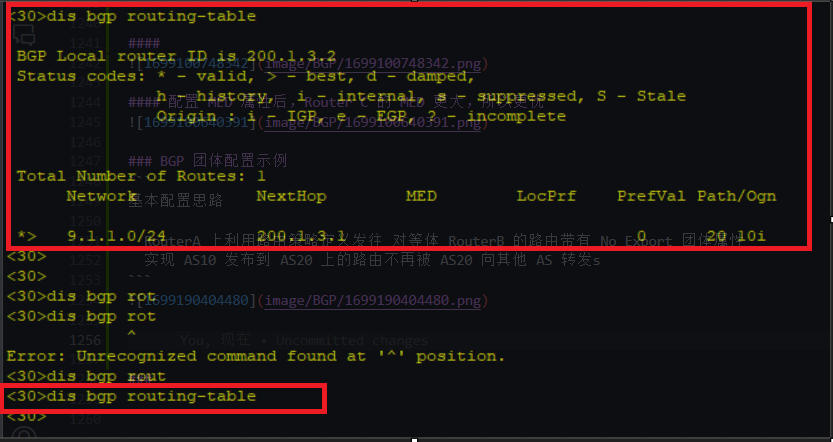

#### 配置
#### AR1
```
#
interface GigabitEthernet0/0/2
 ip address 200.1.2.1 255.255.255.0 
#
interface LoopBack1
 ip address 9.1.1.1 255.255.255.0 
#
bgp 10
 router-id 1.1.1.1
 peer 200.1.2.2 as-number 20 
 #
 ipv4-family unicast
  undo synchronization
  network 9.1.1.0 255.255.255.0 
  peer 200.1.2.2 enable
  /**
    通过 路由器策略 对向对等体 发布 的路由配置指定团体属性
   */
  peer 200.1.2.2 route-policy comm_policy export
  // 配置允许将 团体属性传递给对等体或对等体组
  peer 200.1.2.2 advertise-community
#
// 配置 路由策略
route-policy comm_policy permit node 10 
 // 配置 BGP 路由的团体属性
 // no-export 表示 符合路由条件策略的路由不能向 AS 外发送的路由
 // 但是可以发送给其他子路由
 apply community no-export 
#
```

#### AR2
```
#
interface GigabitEthernet0/0/1
 ip address 200.1.3.1 255.255.255.0 
#
interface GigabitEthernet0/0/2
 ip address 200.1.2.2 255.255.255.0 
#
bgp 20
 router-id 2.2.2.2
 peer 200.1.2.1 as-number 10 
 peer 200.1.3.2 as-number 30 
 #
 ipv4-family unicast
  undo synchronization
  peer 200.1.2.1 enable
  peer 200.1.3.2 enable
#
```

#### AR3
```
#
interface GigabitEthernet0/0/1
 ip address 200.1.3.2 255.255.255.0 
#
interface GigabitEthernet0/0/2
#
interface NULL0
#
bgp 30
 peer 200.1.3.1 as-number 20 
 #
 ipv4-family unicast
  undo synchronization
  peer 200.1.3.1 enable
##
interface GigabitEthernet0/0/1
 ip address 200.1.3.2 255.255.255.0 
#
bgp 30
 peer 200.1.3.1 as-number 20 
 #
 ipv4-family unicast
  undo synchronization
  peer 200.1.3.1 enable
#
```

### BGP 负载分担
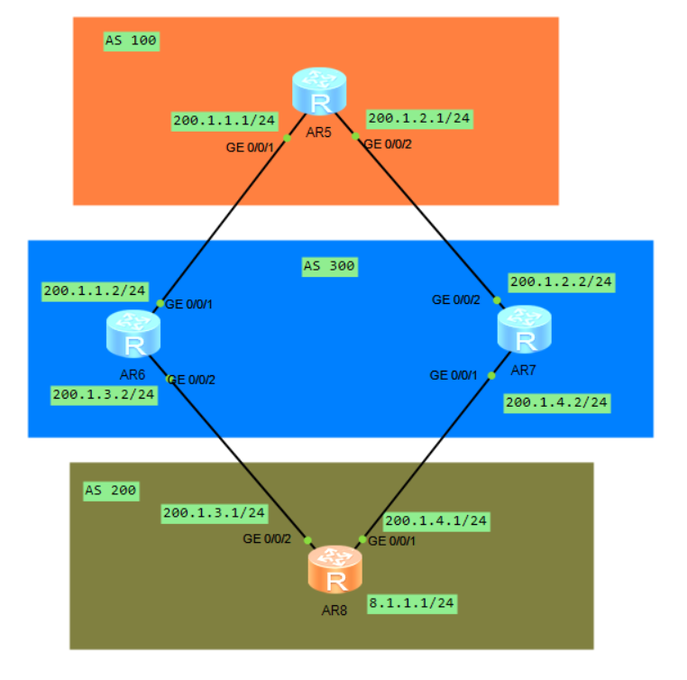
#### 配置前现象
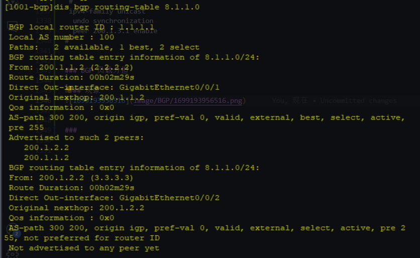
#### 配置后
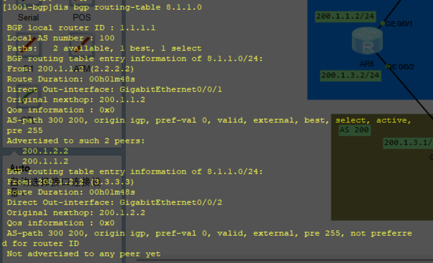
#### AR5
```
#
interface GigabitEthernet0/0/1
 ip address 200.1.1.1 255.255.255.0 
#
interface GigabitEthernet0/0/2
 ip address 200.1.2.1 255.255.255.0 
#
bgp 100
 router-id 1.1.1.1
 peer 200.1.1.2 as-number 300 
 peer 200.1.2.2 as-number 300 
 #
 ipv4-family unicast
  undo synchronization

  // 允许两条等价路由
  maximum load-balancing 2
  peer 200.1.1.2 enable
  peer 200.1.2.2 enable
#
```
## 简化 IBGP 网络连接
```
  BGP 规定，AS 内部 IBGP 设备之间，为了防止路由环路，
  
  IBGP 设备从其 IBGP 对等体学习来的路由不再通告给其他 IBGP 对等体，只能单跳通告

  导致 AS 内部 IBGP 之间，可能无法实现互联互通
  
  于是提出
    1. 配置 BGP 路由反射器
    2. 配置 BGP 联盟
```

### 配置 BGP 路由反射器 
```
路由反射器中的 role
  1. 路由反射器 (RR):
  2. 客户机（Client）
  3. 非客户机（non-client）
  4. 集群（Cluster）
  5. 始发者（Originator）

原理：
  
    同一集群中的客户机 只需要 与该集群的 RR 直接交换路由信息，
    
    因此客户机只需要与 RR 之间建立 IBGP 连接
```
#### 实验
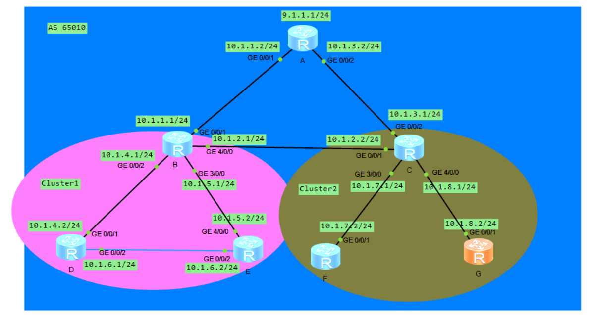

##### 现象
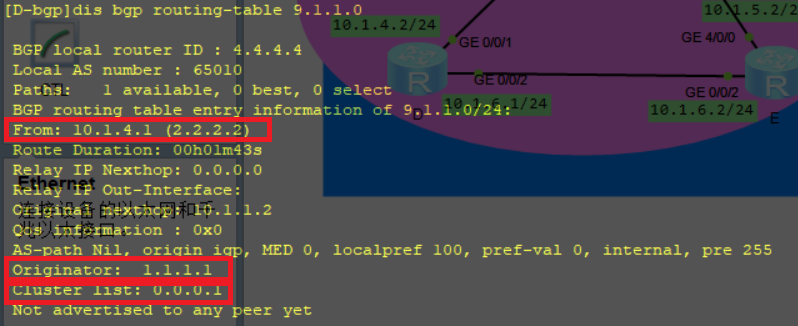
```
## 始发者
Originator: 1.1.1.1
## 集群列表
Cluster list: 0.0.0.1
```
##### 反射器配置
```
bgp 65010
  group in_rr internal     // 创建一个名为 in_rr internal 的对等体组
  peer 10.1.4.2 group in_rr  // 将 RouterD 作为对等体组 in_rr internal 的成员
  peer in_rr reflect_client  // 将对等体组 in_rr internal 作为路由反射器的客户
  reflector cluster-id 2     // 设置集群ID 号为 2

先要建立好 bgp 对等体
```

### BGP 与 BFD 联动配置
```
## BGP 与 BFD 联动的意义
  通过与 BFD 联动实现更加快速的链路故障检测能力，
  BFD 检测是 毫秒 级别的

## 注意
  在 EBGP 邻居之间不需要配置 BGP 与 BFD 联动
  因为 BGP 已经缺省配置了 ebgp-interface-sensitive 快速感知链路故障
```

#### 实验
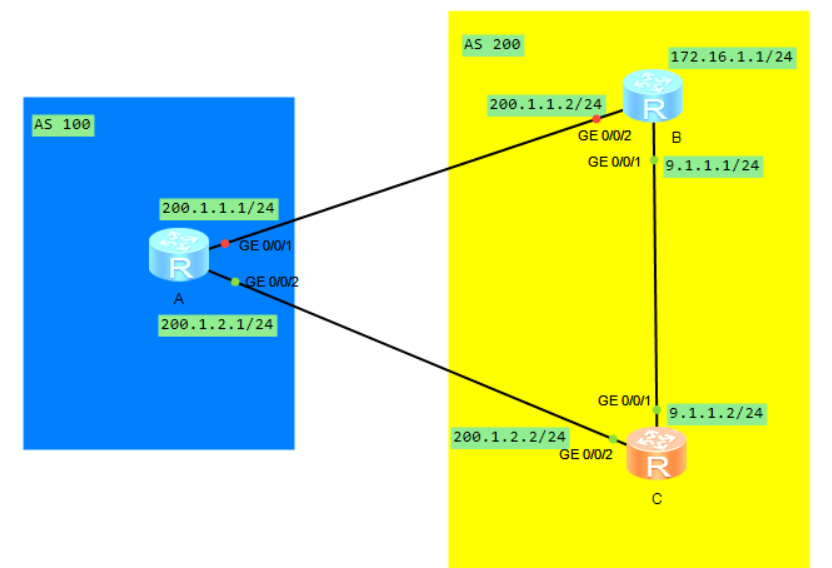
```
## 配置注意
1. 在RA 与 RB/RC 之间是非直连 EBGP 连接，
    所以在它们之间建立 EBGP 连接时候一定要 peer ebgp-max-hop 命令允许建立 EBGP连接

2. 配置路由策略 发送给它们的对等体之间的 MED 属性
  route-policy 10 permit node 10
  apply cost 100

  bgp 200
  peer 200.1.1.1 route-policy 10 export

3. 配置 BGP BFD 联动
  bfd
  bgp 200
  // bgp 对等体 使能 bfd
  peer 200.1.1.2 bfd enable
  // 设置 发送间隔和接收间隔 都为 100 ms 以及本地检测时间倍数参数 4
  peer 200.1.1.2 bfd min-tx-interval 100 min-rx-interval 100 detect-multiplier 4
```

##### 配置
###### RA
```
#
interface GigabitEthernet0/0/1
 ip address 200.1.1.1 255.255.255.0 
#
interface GigabitEthernet0/0/2
 ip address 200.1.2.1 255.255.255.0 
#
interface NULL0
#
bgp 100
 router-id 1.1.1.1
 peer 200.1.1.2 as-number 200 
 peer 200.1.1.2 ebgp-max-hop 2 
 peer 200.1.1.2 bfd min-tx-interval 100 min-rx-interval 100 detect-multiplier 4
 peer 200.1.1.2 bfd enable
 peer 200.1.2.2 as-number 200 
 peer 200.1.2.2 ebgp-max-hop 2 
 #
 ipv4-family unicast
  undo synchronization
  peer 200.1.1.2 enable
  peer 200.1.2.2 enable
#
```
###### RB
```
#
interface GigabitEthernet0/0/1
 ip address 9.1.1.1 255.255.255.0 
#
interface GigabitEthernet0/0/2
 shutdown
 ip address 200.1.1.2 255.255.255.0 
#
interface LoopBack1
 ip address 172.16.1.1 255.255.255.0 
#
bgp 200
 router-id 2.2.2.2
 peer 9.1.1.2 as-number 200 
 peer 200.1.1.1 as-number 100 
 peer 200.1.1.1 ebgp-max-hop 2 
 peer 200.1.1.1 bfd min-tx-interval 100 min-rx-interval 100 detect-multiplier 4
 peer 200.1.1.1 bfd enable
 #
 ipv4-family unicast
  undo synchronization
  network 172.16.1.0 255.255.255.0 
  peer 9.1.1.2 enable
  peer 200.1.1.1 enable
  peer 200.1.1.1 route-policy 10 export
#
route-policy 10 permit node 10 
 apply cost 100 
#
```
###### RC
```
#
interface GigabitEthernet0/0/1
 ip address 9.1.1.2 255.255.255.0 
#
interface GigabitEthernet0/0/2
 ip address 200.1.2.2 255.255.255.0 
#
bgp 200
 router-id 3.3.3.3
 peer 9.1.1.1 as-number 200 
 peer 200.1.2.1 as-number 100 
 peer 200.1.2.1 ebgp-max-hop 2 
 #
 ipv4-family unicast
  undo synchronization
  import-route direct
  peer 9.1.1.1 enable
  peer 200.1.2.1 enable
  peer 200.1.2.1 route-policy 10 export
#
route-policy 10 permit node 10 
 apply cost 150 
#
```

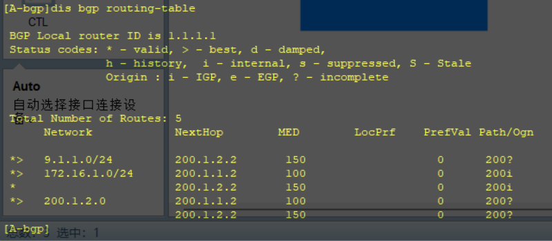
##### 模拟故障，B 路由的 2口 shutdown
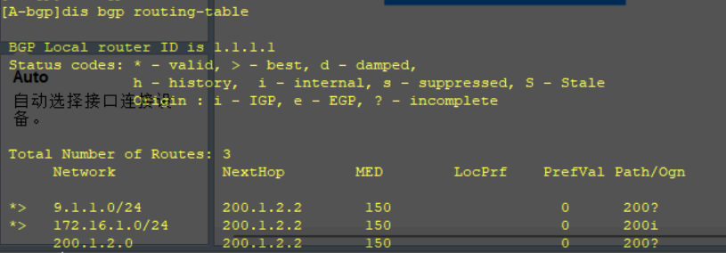

# 路由反射器组网设计
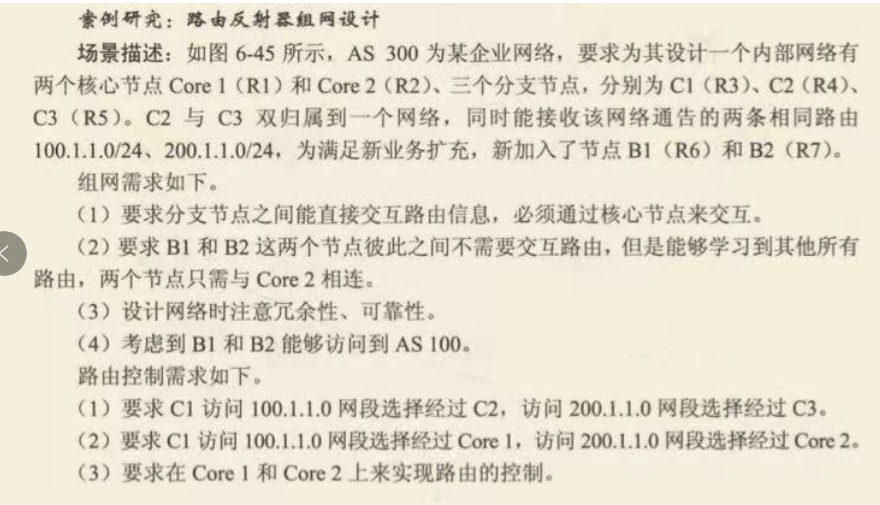
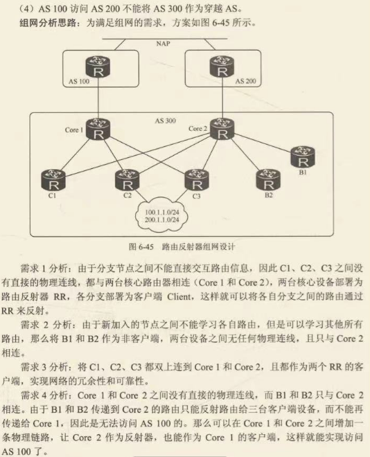

## 需求
1. 分支节点之间可以直接交换路由信息，必须通过核心节点进行
2. B1 和 B2 这两个节点之间彼此不交换路由到但是可以学习到其他路由，两个节点只和Core2相连
