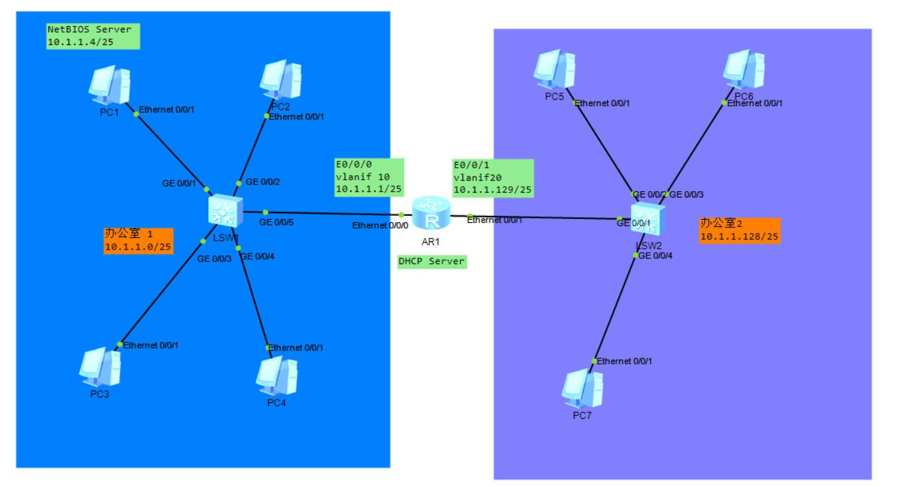
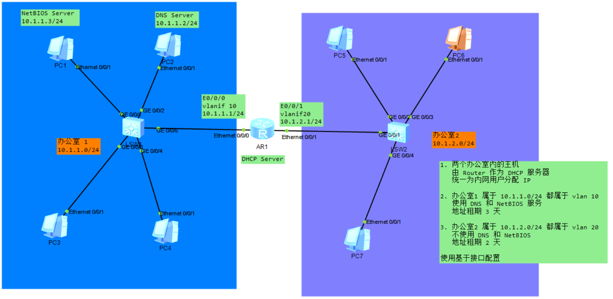
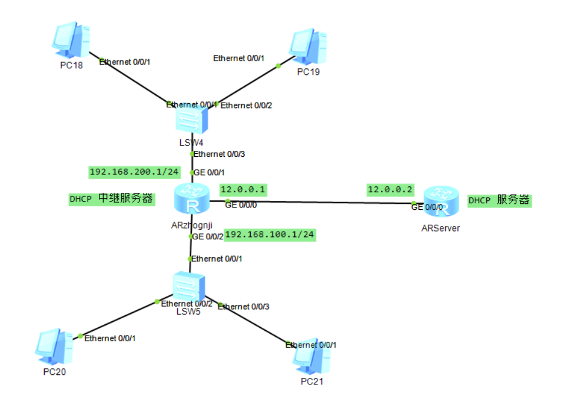

# DHCP
## 基于全局地址池的 DHCP 服务器配置

```
办公室 1
    所属网段为 10.1.1.0/25 主机都属于 vlan 10
    只使用 DNS 服务 不使用 NetBIOS 服务，地址租期 10 天
办公室 2
    所属网段 10.1.1.128/25 属于 vlan 20
    使用 DNS 和 NetBIOS 服务 地址租期 2 天

要求 Router 做 DHCP 服务器，配置全局地址池，采用 动态地址分配

思路：
    1. 在 Router 上创建两个不同全局地址池，并配置各自地址池相关属性
    2. 在 vlanif10 和 20 接口上配置采用 全局 DHCP 服务器的地址分配方式
```
### 配置
```
# Router
1. 先使能 DHCP 服务
    dhcp enable

2. 配置 地址池
    pool1:
        ip pool pool1
            # 设置 出口网关
            gateway-list 10.1.1.1 
            # 设置 地址池范围
            network 10.1.1.0 mask 255.255.255.128 
            # 排除地址
            excluded-ip-address 10.1.1.2 
            excluded-ip-address 10.1.1.4
            # 设置地址池租用期
            lease day 10
            # DNS 地址 设置
            dns-list 10.1.1.2 
        
    pool2:
        ip pool pool2
            gateway-list 10.1.1.129 
            network 10.1.1.128 mask 255.255.255.128 
            lease day 2 
            dns-list 10.1.1.2 
            # 设置 NetBIOS 地址
            # 配置 DHCP 客户端的 NetBIOS 服务器地址
            nbns-list 10.1.1.4 

3. 端口配置 vlan
    e0/0/0:
        port hybird pvid vlan 10
        port hybird untagged vlan 10

    e0/0/1:
        port hybird pvid vlan 20
        port hybird untagged vlan 20

4. 进入vlanif 接口
    vlanif1:
        ip address 10.1.1.1 255.255.255.128
        dhcp select global

    vlanif2:
        ip address 10.1.1.128 255.255.255.128
        dhcp select global

# NetBIOS 网络输入输出系统
```

## 基于接口地址池的 DHCP 服务器

```
1. 两个办公室内的主机
   由 Router 作为 DHCP 服务器
   统一为内网用户分配 IP

2. 办公室1 属于 10.1.1.0/24 都属于 vlan 10 
   使用 DNS 和 NetBIOS 服务
   地址租期 3 天

3. 办公室2 属于 10.1.2.0/24 都属于 vlan 20
   不使用 DNS 和 NetBIOS
   地址租期 2 天

使用基于接口配置
```
### 配置
```
# Router 
1. 使能 dhcp
    dhcp enable
2. 创建对应 vlan
    vlan batch 10 20
3. 配置 端口 dhcp 服务
    interface Vlanif10
    ip address 10.1.1.1 255.255.255.0 
    dhcp select interface
    dhcp server excluded-ip-address 10.1.1.2 10.1.1.3 
    dhcp server lease day 3 hour 0 minute 0 
    dhcp server dns-list 10.1.1.2 
    dhcp server nbns-list 10.1.1.3 
    #
    interface Vlanif20
    ip address 10.1.2.1 255.255.255.0 
    dhcp select interface
    dhcp server lease day 2 hour 0 minute 0 
    #
4. 划分网段
    interface Ethernet0/0/0
    port hybrid pvid vlan 10
    port hybrid untagged vlan 10
    #
    interface Ethernet0/0/1
    port hybrid pvid vlan 20
    port hybrid untagged vlan 20
    #
```

## 配置 DHCP 中继
### 作用
```
    当 DHCP 客户端 和 DHCP 服务器之间经过三层设备相连时， (此时 DHCP客户端 和 DHCP服务端 不在同一个网段)
    DHCP 服务器不能直接 和 DHCP 服务器直接通信
    这时候就需要通过 DHCP 中继设备在中间担当中间代理角色，负责DHCP 客户端 和 服务端的 DHCP通信 转发
    这样就可以多个网段的客户端使用同一个 DHCP 服务器
```
### 实验

```
# Router Server
    int g0/0/0                                 ### 与DHCP中继连接方向的接口
    ip add 12.0.0.2 24    ### 配置IP

    dhcp enable           ### 系统视图下开启DHCP功能

    #
        ip pool 1
        gateway-list 192.168.100.1 
        network 192.168.100.0 mask 255.255.255.0 
        lease day 10 hour 0 minute 0 
        dns-list 8.8.8.8 
    #
        ip pool 2
        gateway-list 192.168.200.1 
        network 192.168.200.0 mask 255.255.255.0 
        lease day 7 hour 7 minute 7                  ### 可以精确到分钟
        dns-list 114.114.114.114 
    #
    ip route-static 0.0.0.0 0.0.0.0 12.0.0.1 
                                ### 末梢网络所以配置默认路由，跨网段一定要配置静态路由
    int g0/0/0
    dhcp select global   ### 不要忘记配置global


# Router zhongji

    int g0/0/1
    ip add 192.168.200.1 24
    int g0/0/0
    ip add 192.168.100.1 24
    int g0/0/2
    ip add 12.0.0.1 24

    #配置中继
    dhcp enable
    int g0/0/0                               ### 与客户端相连的接口
    dhcp select relay   ### 开启DHCP中继功能
    dhcp relay server-ip 12.0.0.2 
                                      ### 指向DHCP服务器的地址12.0.0.1请求DHCP服务

    int g0/0/1                        ### 同上
    dhcp select relay
    dhcp relay server-ip 12.0.0.2
```
 