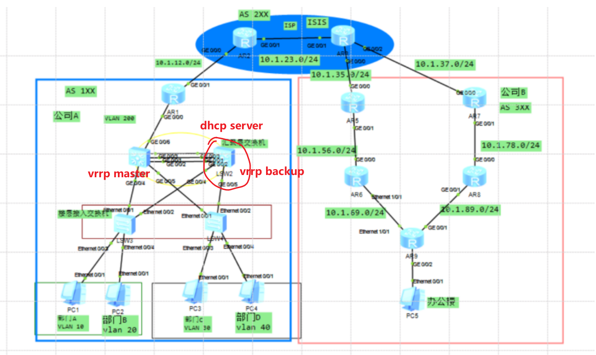
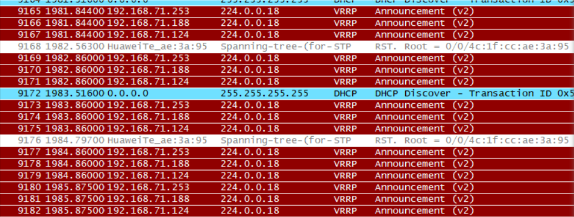

## 现象
```
PC 无法获得 dhcp 分配地址
```
- 抓包
    - 
    - 可以收到 dhcp server 的报文
- 于是查看 两台 LSW 的 arp 表项，将pc 配置静态
    - 然后ping 网关
    - 发现 pc 找网关找的是 LSW1
## 原因
```
    因为 vrrp 原因导致 pc 发送的 dhcp discover 包给 LSW2(dhcp server)
主机收到，但是将回的包 给了 LSW1 导致 LSW2 （dhcp server）接收不到，
所以无法获取到地址
```