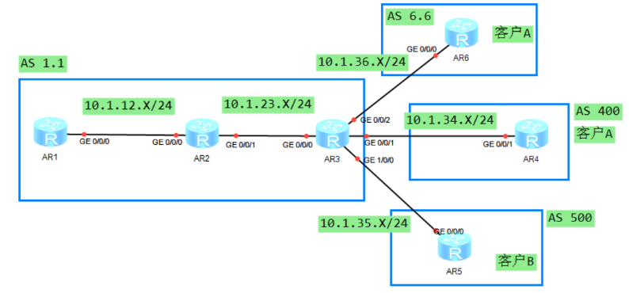
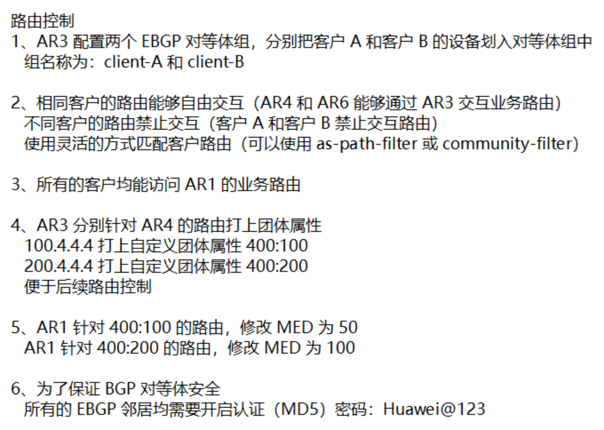
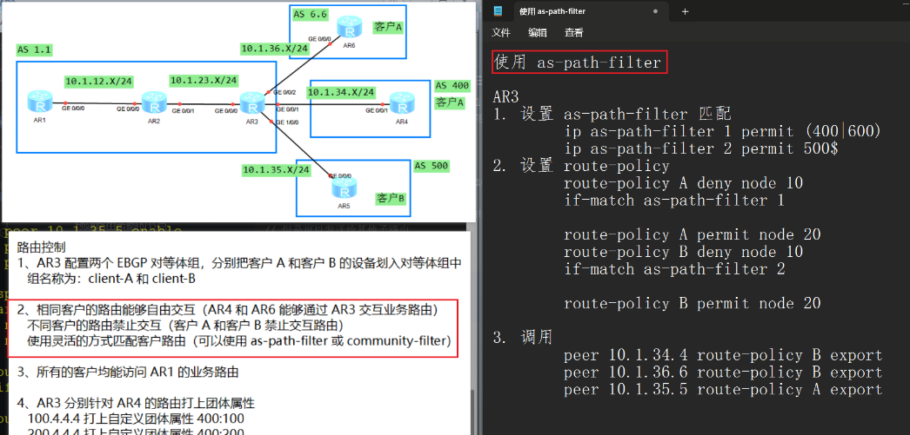
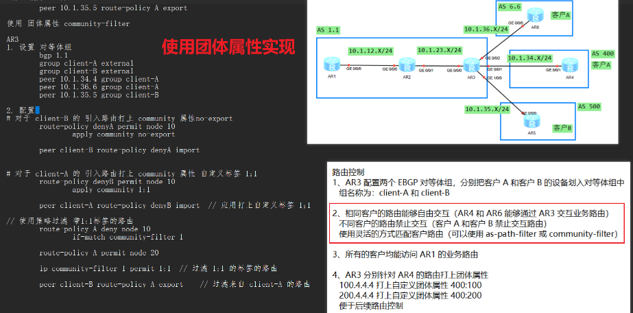
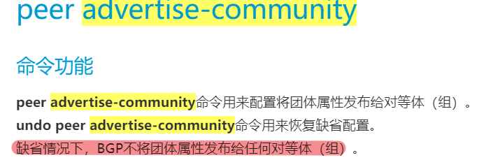

# BGP高级特性练习



## 2.
## as-path-filter 实现

## community-filter 实现


## 5. AR1 没有收到 AR3 打的团体属性标签

```
1. 当 AR2 不是反射器时
在 AR3 配置
    peer 2.2.2.2 advertise-community
    peer 1.1.1.1 advertise-community

2. AR2 是反射器
配置 AR3
    peer 2.2.2.2 advertise-community
配置 AR2
    peer 1.1.1.1 advertise-community
```
### 第5题题解
```
AR1 配置
1. 将 400；100 400：200 的路由匹配出来
    ip community-filter 1 permit 400:100
    ip community-filter 2 permit 400:200

2. 配置路由策略
    route-policy MED permit node 10 
    if-match community-filter 1 
    apply cost 50 
    #
    route-policy MED permit node 20 
    if-match community-filter 2 
    apply cost 100 
    #
    route-policy MED permit node 30
    
3. 应用路由策略
    peer 3.3.3.3 route-policy MED import
```

[练习](./BGP%20高级特性练习(2).rar)
[练习答案](./BGP%20高级特性练习（2）已完成.rar)