# 一、VPLS
```
作用：
    在 MPLS 网络中建立 L2 VPN 隧道，使得用户的二层流量可以穿过运营商实现互访

概念
	1. 隧道和 PW
		隧道一般是指使用 MPLS LDP 建立的 LSP 传输隧道
		
        PW 称为伪线，用于承载不同客户的流量
            - （相当于在 MPLS 网络中划分出多条传输隧道，
                每条隧道承载不同客户的流量）

	2、VSI（虚拟机交换实例）类似于 IP vpn-instance（VRF = 虚拟路由转发）
		- 不同点在于，交换设备使用 MAC 地址表进行转发，
        - VSI 用于独立存放 MAC 地址表（类似于 VRF）

	3、AC（接入电路）是指 CE 与 PE 互联的链路，需要绑定实例
		- AC 与 VSI 绑定，到 PW 上
        - （解析：AC 上需要绑定实例，实例为 VSI，
           - VSI 需要绑定隧道 PW）用于客户区分 MAC 地址表和隧道
```

## 存在问题
```
1. 无法实现双活（多活）因为交换设备多根传输线缆会导致环路产生，VPLS 也需要像 STP 一样，阻塞一个接口避免环路产生，导致无法多链路传输

2. 交换设备学习 MAC 地址，需要通过流量泛洪的方式学习，学习时间长（需要流量到达设备）没有控制平面参与，无法快速收敛
	   （无法像 OSPF 一样，学习多条备份路由，当主路由失效，可以快速切换到备份路径）
```

# EVPN

## EVPN 工作流程
```
1. 启动阶段
    - 建立三个表项
        - MAC-VRF 表
            - 用于记录已知单播转发
        - BUM 流量转发表
            - 指导广播，未知单播，流量转发
        - ES 成员表
            - 记录用户接入信息
2. 流量转发阶段
```
### 1. 启动阶段
```
1.  PE 建立实例，配置 RD 与 RT，
        PE 上本地激活 EVPN，产生 MAC-VRF
```
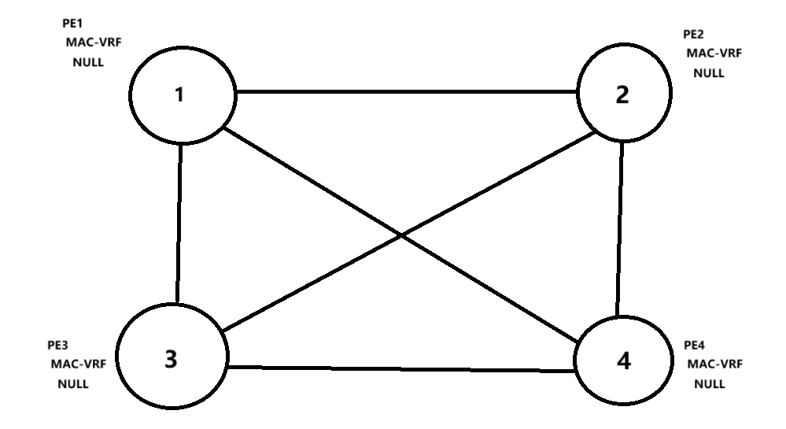

```
2. 配置 PE 之间 peer 关系
    - 通过 Type3 路由发现邻居分配标签，分配标签
```
```
每一台 PE 指定了 EVPN 的隧道源 IP 地址后，都会产生标签（BUM 标签，PE1 = 101）通过 Type=3 发送给所有的 BGP 邻居
		其他设备会生成 BUM 流量转发表，
        如：
            PE3（生成 BUM 流量转发标签，
                PE1（1.1.1.1）
                标签：101）
		最终 PE3 的 BUM 表项会显示（PE1=101、PE2=102、PE4=104）
```

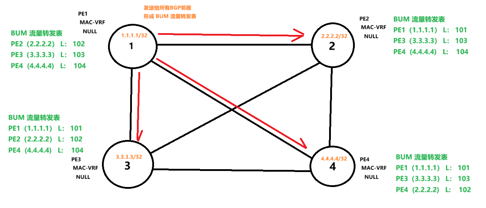
```
    发给 所有BGP邻居，最终形成稳定的 BUM 流量转发表
```

```
3. 配置接口绑定 EVPN 实例
    - 在 PE 连接 CE 的接口 配置 ESI
    - PE 交互 Type4， 传播ESI 选DF（指定转发）
```
```
需要配置 EVPN instance 绑定连接 CE 的接口，同时配置 ESI（链路 ID）
	PE1 会把该 ESI 发送给所有的 PE 设备，
        - 但 PE2 和 PE4 设备不记录，因为 ESI 不同   
            - 补充：使用 Type=4 通告
	
    PE2 会记录 ESI 相同的信息，如：PE1，ESI-1，标签 201
		- 最终 PE1 也会记录 PE2 生成的 ESI 标签，
        如：
            PE3，ESI-1，标签 203
            （代表 PE1 和 PE3 是 ES 成员）

	生成表项后，启动阶段结束
		Type=4 还会选举出 DF（ES 的成员会选出一个最优的作为 DF）
```
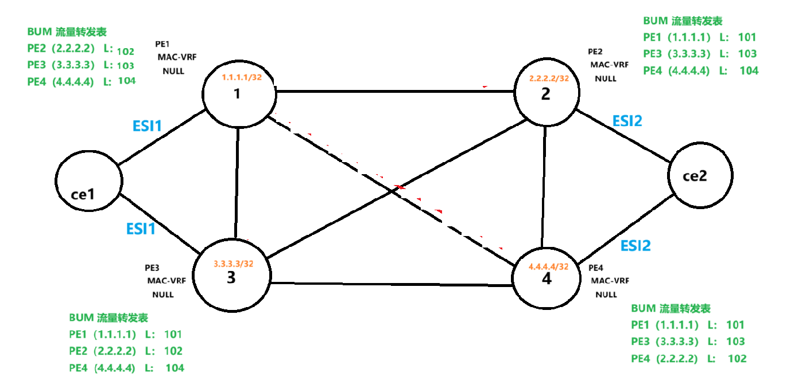
```
1. 形成 ES 成员表
    - PE1 向所有 邻居发送，PE2,4不保存，因为 ESI不同
    - 相同 ESI 才收
```
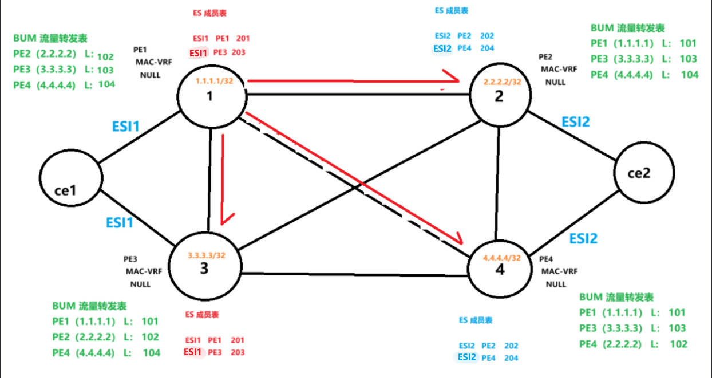
```
    假设 PE1 PE2 选举为 DF（相同成员之间才选）
```
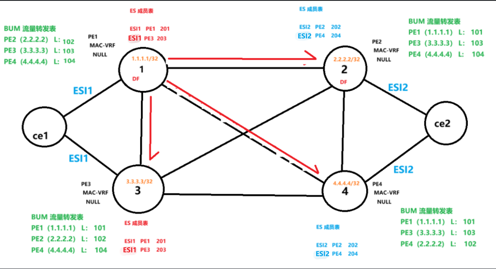
```
    分发ESI标签，通过 Type1 路由分发
        - 标签用于水平分割，防止同一ES收到，产生环路
```
```
DF 的作用:
    - 转发 BUM流量

1. 当 PE1 收到一份 BUM 流量
    - 发送给所有 BUM 成员
2. PE3 转发，但 PE4 不转发（非DF不转发）
    - 避免CE2 收到重复流量
```
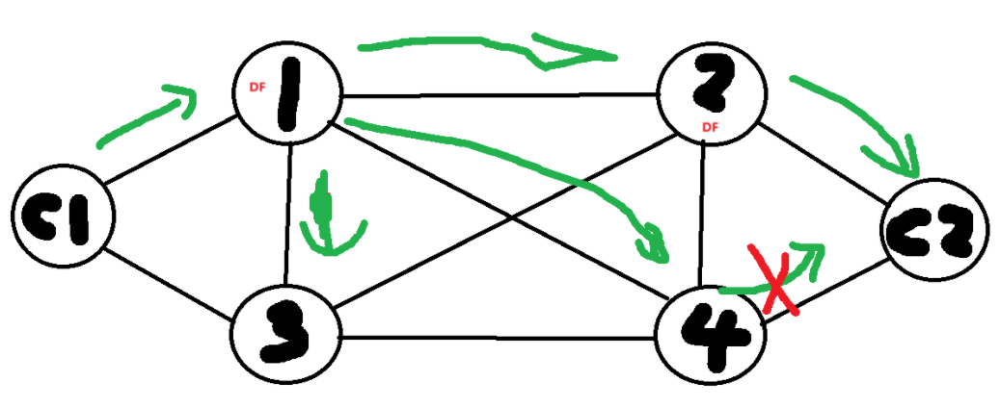

```
到这 启动阶段就完成了
    - 建立了三个表
        - MAC-VRF 表
        - ES成员表
        - BUM 成员表
```
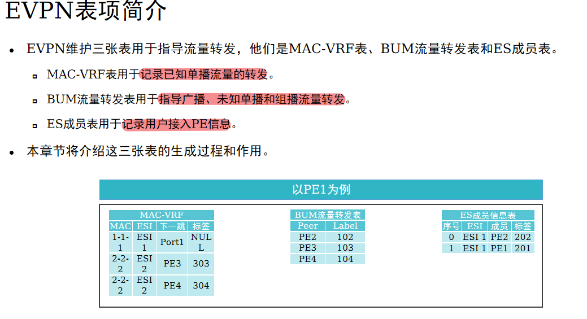

### 2. 转发阶段
```
1. CE1 访问 CE2
```
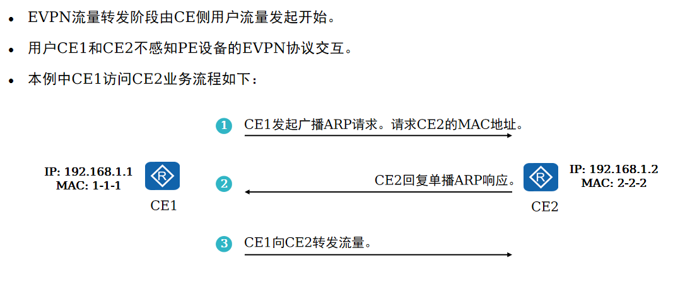
```
2. CE1 访问 CE2
    - 发起 ARP 请求
    - PE1 收到后生成 本地MAC表条目
```
```
CE 把 ARP 请求广播发送给 PE1 或 PE2，假设（PE1 收到了）
	
    PE1 会生成 MAC-VRF
        （如：ESI-1，G0/0/1，1-1-1，标签：301）
	
    PE1 会把以上的信息，通过 Type=2 MAC-Route 进行通告，通告给所有的 BUM 成员
```
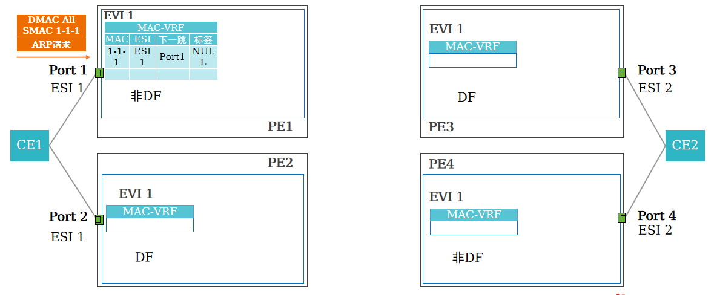
```
MAC 地址通告
    - PE1 EVPN 将本地MAC地址表项生成 Type2路由
        - 携带 PE1 设备分配的标签 301 
```
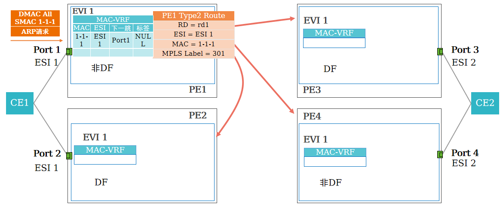
```
远端设备通过 MP-BGP学习到 EVPN路由，
    - 生成 MAC表项
```
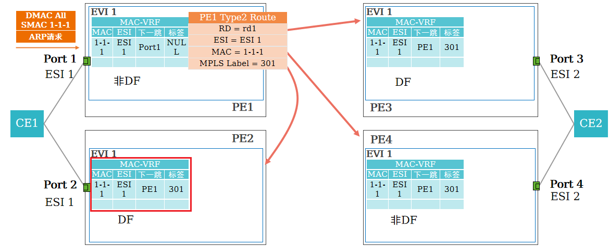
```
EVPN 支持CE多活接入PE。PE2感知直连CE1，
    - 刷新最优的MAC表条目，
    - 并生成和通告Type 2路由。
```
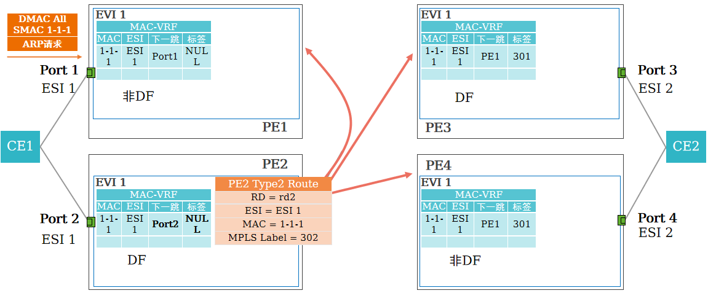
```
因 PE1和PE2 分配不同的MPLS标签，
    - PE3和PE4有两条路径到达CE1。
```
```
PE3 收到的 PE1 的 MAC-Route 通告，会生成表项（ESI-1、PE1、1-1-1、标签：301）

	PE2 也会生成该表项（ESI-1、PE1、1-1-1、标签：301）
        - 但，PE2 会发现 ESI-1 相同，代表同属一个 CE
	
    PE1（1.1.1.1）非最优接口，需要更新最优接口为 G0/0/2，并重新生成标签（如：ESI-1、G0/0/2、1-1-1、标签：302）
		并且 PE2 也会产生新的 Type=2 通告给其他 PE

	最终：PE3 和 PE4 收到 2 份不同的 Type 2 生成表项
    （ESI-1、PE1、1-1-1、标签：301
	  ESI-1、PE2、1-1-1、标签：302）
    代表到达 1-1-1 有 2 条路径
```
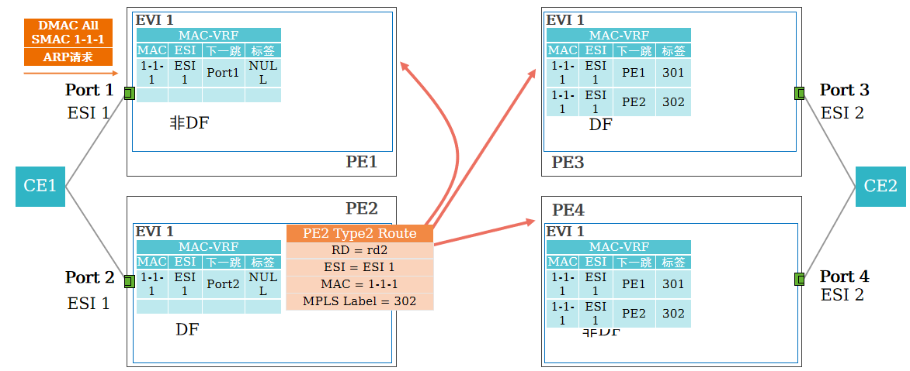

#### ARP 广播转发
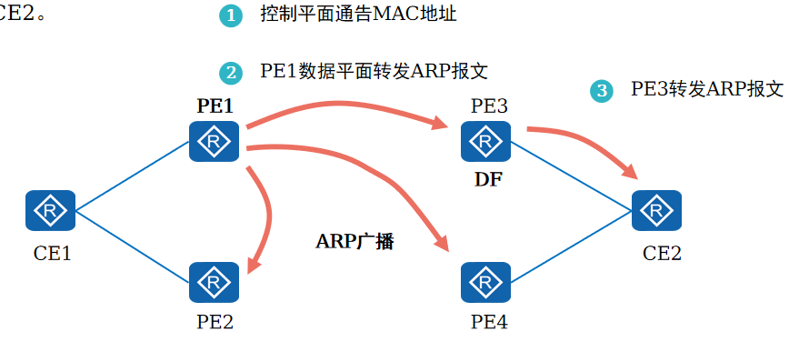
```
CE1发送的ARP请求达到PE1。
    - PE1通过数据面学习到CE1的MAC地址，
    - 然后通过Type 2路由发送给所有邻居。

控制平面行为完成后，
    - PE1将执行数据平面行为，即转发ARP广播请求。
    - 最后因 PE3为DF，PE3转发ARP广播报文到CE2。
```
```
为了防止环路，PE1 把 ARP 广播流量泛洪的时候，发给给 PE3（携带标签 103）发送给 PE2 会多添加一个成员标签（携带标签：202、102）
	
    PE3 收到后认为是 BUM 流量，转发给 CE2（因为 PE3 是 DF）
	
    PE4 收到后认为是 BUM 流量，但 PE4 不是 DF，则丢弃流量
	
    PE2 收到流量后，发现标签 202 为本地 ES 标签，代表流量从同一个 CE 经过，避免该 CE 重复收到流量（防止环路）也丢弃流量

	最终：CE2 只从 PE3 收到 ARP 请求的广播流量
```
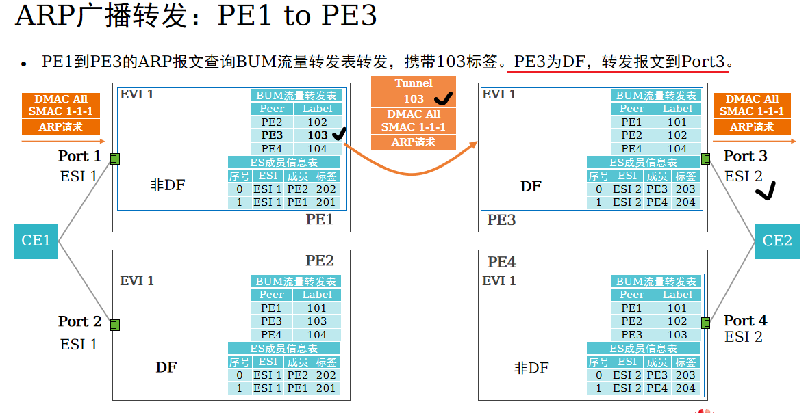
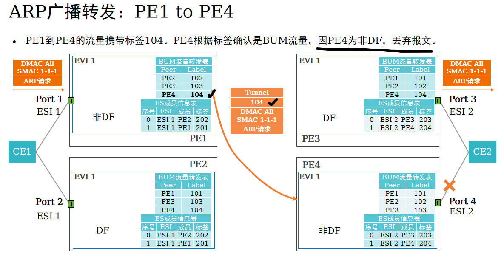
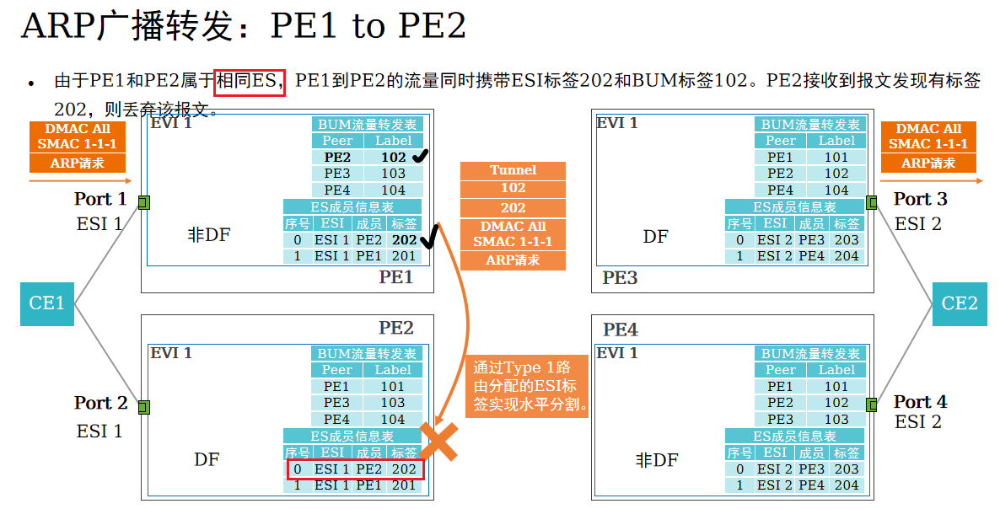


#### ARP 单播回应
```
CE2 会回传 ARP 响应报文，
    - 根据 MAC 地址对应，转发给 PE3
	- PE3 会重复步骤 ③、④、⑤ 最终，只有 PE1（DF）把 ARP 响应报文转发给 CE1
	- PE4 会更新自己的 MAC 地址表，产生 Type2 的通告，让 PE1 和 PE2 收到两条路径
	 -（ESI-2、PE3、2-2-2、标签：303
		ESI-2、PE4、2-2-2、标签：304）
```
```
CE2单播回复ARP应答。
    - PE3首先本地学习CE2的MAC地址，然后触发EVPN控制面行为，
        - 即发送Type 2路由。
    - PE3查询MAC地址表转发单播报文到PE1，
        - 最后PE1转发ARP报文到CE1。
```
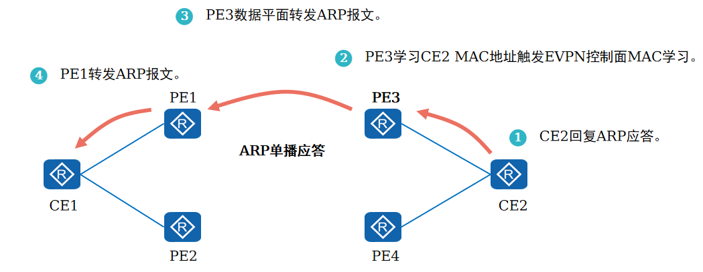

```
CE2回复单播ARP应答。
    - PE3通过数据面学习到 CE2的 MAC地址，
    - 生成本地MAC-VRF表项。
```
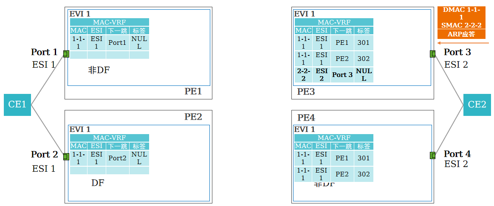

```
PE3生成并通告Type 2路由。
    - 其他PE接收PE3发出的Type 2路由，
    - 刷新本地MAC表项。
```
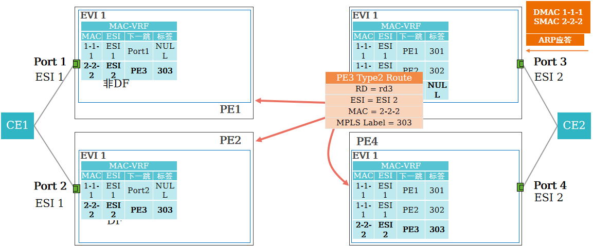

```
PE4的接口属于ESI 2，
    - 因此刷新更优的 MAC地址表。
    - 同时生成和发布 Type 2路由。
```
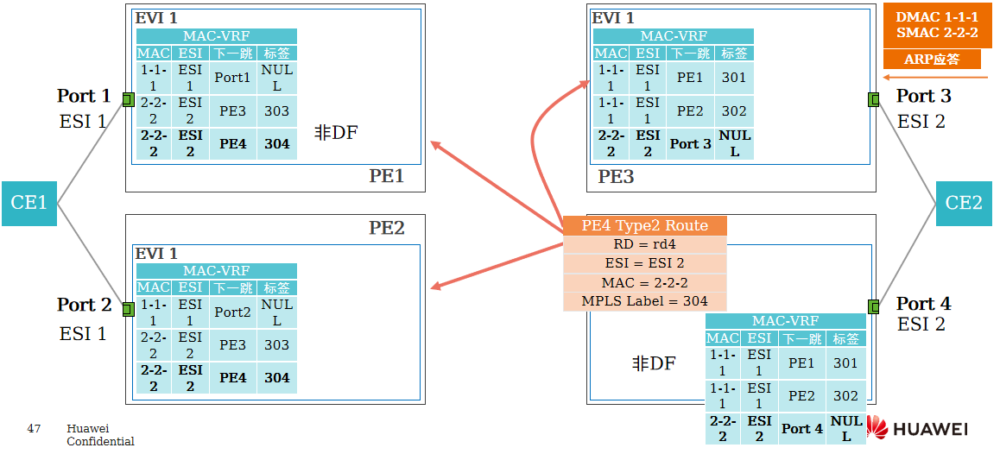

```
PE3通过负载分担算法找出下一跳（如：PE1）发送报文，
    - 携带标签301。
    - PE1接收报文后 向Port1转发。
```
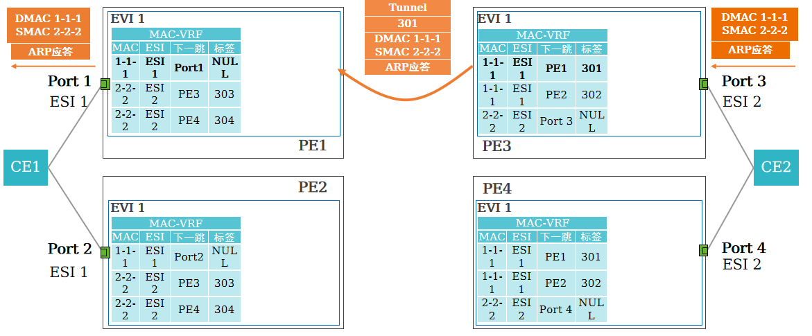

# EVPN 概念
```
通过 BGP 来学习 MAC 地址
    - （通过路由协议参与学习，有控制平面，加快收敛）

通过 ESI 来防环（或者路由协议防环）
    - 可以支持双活
```
```
1、概念
	① ES 代表用户站点（设备或网络），连接到 PE 的一组以太网链路使用 ESI 来唯一标识

		ESI 10 个字节（如：0000.1111.2222.1111.0000）
	
		ESI 可以手工配置，也可以自动生成（需要运行 LACP 协议）
		如：
            Eth-trunk 中的 lacp-static

	② EVI（evpn instance）
        - 用于区分客户表项（如：MAC、IP 等）
		- 类似于 MPLS VPN 中 ip vpn-instance

		MAC-VRF（类似于 IP 的 VRF）
            - 每个客户都会单独分配一个 evpn instance 并且绑定一张 MAC-VRF

	③ RD 值（路由区分符）作用类似于 VPNv4 中的 RD，
        - 用于绑定 MAC 地址，区分 MAC 信息
		- 在 PE 传递 MAC 信息时使用 RD 来区分用户信息，一个 EVI 绑定一个 RD 值

	④ RT 值（vpn-target）作用类似于 VPNv4 的 RT，
        - 用于控制 MAC 地址的传递
		- import RT 和 export RT
         （传递 MAC 时携带 export RT，接收时使用 import RT）

	⑤ DF（指定转发）双归属 PE 会选择一个能够转发 BUM 流量的设备，该设备为 DF
		- 避免 PE 传递重复流量给 CE 设备
        - （类似于组播中的断言机制，DF 为 winner）

	⑥ BUM（广播、未知单播、组播）交换设备泛洪的流量，可以称为 BUM 流量
```

## 配置命令
```
CE 侧配置：
1、创建 VLAN 并配置 IP 地址
	vlan batch 10
	interface Vlanif10
	ip address 192.168.1.1 255.255.255.0 
	
2、创建 Eth-Trunk 接口用于连接 PE 设备
	interface Eth-Trunk1
	port link-type trunk
	port trunk allow-pass vlan 10
	mode lacp-static                                                          // 注意模式为 LACP 模式（因 PE 设备必须支持 E-Trunk 技术）
	
PE 侧配置：
基础配置
1、创建 loopback 接口，并使用任意 IGP 协议实现底层 loopback 互通
2、运行 MPLS LDP 协议，并建立 MPLS LDP 邻居关系

EVPN 配置
1、使用 loopback 接口建立 EVPN 邻居关系（需要使用 L2VPN 地址簇）
	bgp 100
	peer 3.3.3.3 as-number 100
	peer 3.3.3.3 connect-interface LoopBack0

	 l2vpn-family evpn
	 policy vpn-target                                                      // 打开 policy vpn-target
	 peer 3.3.3.3 enable                                                  // 使能邻居关系

2、全局设置 EVPN 源地址
	evpn source-address  1.1.1.1                                   // 指定为本设备的 loopback 接口地址

PE 与 CE 互联配置
1、全局设置关闭 DCN
	undo dcn
	
2、创建 EVPN 实例
	evpn vpn-instance A bd-mode                                 // 注意实例模式（bd-mode）即：多归属模式
	route-distinguisher 1:1
	vpn-target 100:100 export-extcommunity
	vpn-target 100:100 import-extcommunity
	
3、把实例绑定至 BD 中
	bridge-domain 10                                                      // 桥域（类似于 VLAN，后续 VXLAN 中会补充）
	evpn binding vpn-instance A                                   // 绑定实例（或绑定 Eth-Trunk 接口均可）
	
4、创建 E-Trunk 接口
	lacp  e-trunk  system-id  00e0-fc00-0000              // 设置虚拟 MAC 地址
	lacp e-trunk priority 1                                               // 设置 Eth-Trunk 优先级
	
	e-trunk 1
	peer-address 2.2.2.2 source-address 1.1.1.1        // 建立 E-Trunk 邻居关系
	                                                              （使得多个 PE 设备能用虚拟 MAC 地址与 CE 建立 LACP 关系）

5、绑定 E-Trunk 与 Eth-Trunk 接口的关系，并设置双活
	interface Eth-Trunk1
	mode lacp-static                                                         // 注意模式必须为 LACP 模式
	e-trunk 1
	e-trunk mode force-master                                      // 绑定 E-Trunk 接口并设置为 Master 模式
									其他多归属 PE 也为 Master 模式（多活状态）
	esi 0000.1111.2222.1111.1111                               // 为该链路设置 ESI ID（多归属 PE 设置相同的 ESI，每链路唯一）
	
6、划入成员接口，并配置中间子接口（NE40 为路由器，Eth-Trunk 接口默认为三层接口）
	interface Eth-Trunk1
	trunkport interface Ethernet1/0/0

	interface Eth-Trunk1.1 mode l2
	encapsulation dot1q vid 10                                      // 该接口识别 VLAN 10 标签
	rewrite pop single                                                      // 该接口弹出 VLAN 标签                           
bridge-domain 10                                                      // 该接口属于 BD 10，并绑定 BD 10 EVPN 实例
```


