# 一、IGP（内部网关协议）
```
	用于发现路由、计算路由
	协议：OSPF、IS-IS、RIP
```

## OSPF 快收敛特性

### 1、邻居故障发现

#### 1. 协议自身的 Hello 发现故障
```
（网络类型：BMA、P2P）
    - hello 时间间隔：10s、
    - dead 是 hello 的 4 倍（40s）

（补充：P2MP、NBMA ）
    - hello 时间间隔：30s、
    - dead 是 120s）

可以通过修改接口的 hello 时间间隔缩短邻居故障的发现时长
    （1—65535，单位：s）

补充：双方的 
    - Hello 时间间隔 
    - 和 Dead 时间间隔
        - 必须一致，否则设备无法建立 OSPF 邻居关系

```
- **配置**
```
    interface G0/0/X

    // 修改接口的 Hello 时间间隔（1s）
    ospf timer hello 1								

    // Dead 时间默认会修改为 hello 的 4 倍
    // （也可以手动修改，但不能与 hello 时间间隔一致）
    ospf timer dead 4								

    查看方式
    display ospf interface 
```

#### 2. OSPF 与 BFD 联动
```
利用 BFD 的机制绑定 OSPF 的会话，
    - 当 BFD 会话中断会引导 OSPF 会话中断
	- BFD 可以实现毫秒级的网络收敛，增强收敛速度
```

- **配置命令**
```
① 全局开启 BFD 功能
    bfd

② 进入 OSPF 进程（批量）
    
    // 所有发布到 OSPF 协议的接口都开启 BFD
    bfd all-interfaces enable						

③ 进入某个单独的接口开启（独立）					
    
    // 仅 G0/0/X 接口开启 BFD 功能
    interface G0/0/X
    ospf bfd enable
——————————————————————————————————————————
可选参数
    interface G0/0/X

    // 最小的接收时延：100ms、最小传输时延：100ms
    ospf bfd  min-rx-interval 100 min-tx-interval 100 detect-multiplier 3				

    本设备的老化时间 = 接收时延 x 倍数
        - （检测倍数 
            - 默认为：3倍，
        - 检测时延 和 接收时延 
            - 默认为：1000ms）

    ospf 1

    // 进程下针对所有接口生效	
    bfd  all-interface  min-rx-interval 100 min-tx-interval 100 detect-multiplier 3		

    补充：
        同时部署，接口 优先于 进程生效
```

##### 补充（单臂回声）
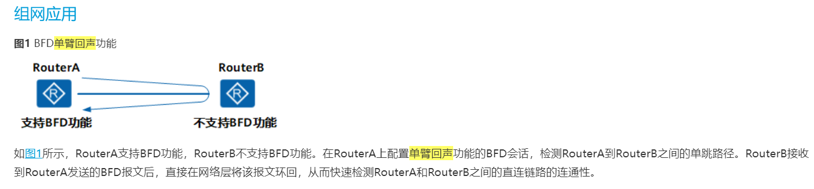
```
例如：
    AR2 到达外部网络配置一条静态路由，无法与 ISP 建立 BFD 会话
    
    // 创建 BFD 会话 1，指定对端的传输地址，本地发送数据包的接口		
    bfd 1 bind peer-ip 10.1.100.1 interface G0/0/2 one-arm-echo	
    
    // one-arm-echo（代表单臂回声）   
    
    discriminator local 1000		
    // 1000 为本地标识符
    

    // 让 BFD 会话生效
    commit																

    // 把 BFD 会话绑定到静态路由上，使得静态路由也可以自我检测故障
    ip route-static 0.0.0.0 0.0.0.0 10.1.100.1 track bfd-session 1
    
    （当 BFD 会话 down 静态路由失效）
```
- 全局开启 bfd
    - 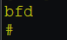
- 配置 单臂回声
    - 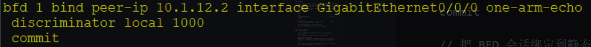
- 把 BFD 会话绑定到静态路由上，使得静态路由也可以自我检测故障
    - 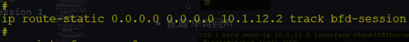


### 2、SPF 计算（默认开启，默认生效）
#### 1. Full-mush（计算全局）
```
    当区域内的设备
        1. 同步完成 LSDB（建立邻接关系后）
        2. 会以 自身为父节点，计算 到达其他节点的路径，
        3. 并且 生成路由

    （Full-mush 的收敛时间 
        - 与 
            1. 区域内设备的数量、
            2. 路由的数量有关，
            设备越多、路由越多计算的时间也越长）
    
        * 仅会在 FULL 后计算一次
```

#### 2. I-SPF（只计算变化的 节点和路由）
```
		当拓扑发生改变时（链路故障、节点故障和修改开销等）
            - 都会 引发节点发生改变，
            - 需要 执行 I-SPF 计算

		（只对变化的 
            ** 节点和路由 进行计算，缩减收敛时间）

① 补充：
    1. OSPFv2（1、2类 LSA 不仅包含了网络信息，也包含了拓扑信息）
        - 一旦更新会整一份 LSA 重新生成，
        - 引发 I-SPF 计算

	2. OSPFv2 域内的路由也算是拓扑改变，也会引发 I-SPF 计算

② 补充：
    1. OSPFv3 对 OSPFv2 进行了改进
        - （OSPFv3 的 1、2 类 LSA 不再携带网络信息，
            - 由 8、9 类 LSA 携带）
		- 可以实现域内的路由单独计算，使用 PRC 算法
```		
#### 3. PRC（部分路由计算）（只针对 路由部分 计算，不计算 拓扑）
```
    只针对 **路由部分 进行计算，
    
    - 当路由生成时
        - 更新到 OSPF 路由表中，
    - 当路由失效时，
        - 生成 age 为 3600s 的撤销 LSA

    - 不会 对拓扑进行 计算，
        - 该算法称为 PRC（部分路由计算）
    
    例如：
        域间、域外路由（3、4、5、7 LSA）
```

### 3、智能定时器
```
针对 LSA 的生成和接收，都有不同的计时器（概念一致，时间不同）
	
    更新 LSA 的智能定时器（默认情况下开启)
```
#### （生成定时器）
```
为了 避免设备更新 LSA 时间过长，
- 又 避免网络不稳定产生的频繁更新问题，启动智能定时器
    - （初始时间 500ms）
    - （最大时间 5000ms）
    - （基数时间 1000ms）

		1. 第 1 次更新，
            - 使用初始时间（500ms）
		2. 第 2 次更新
            - （基数时间 x 2 的（N-2 次方）2的0次方）1000ms
		3. 第 3 次更新
            - （基数时间 x 2 的（N-2 次方）2的1次方）2000ms
			如此类推
		4. 最大不超过 5000ms，
            - 3次最大更新时间 
            - 则回到初始时间周期
```
- 配置命令：
```
进程下
// 最大、初始、基数
lsa-originate-interval intelligent-timer 5000 500 1000 		
```	
#### （接收定时器）
```
    初始时间（500ms）
    最大时间（1000ms）
    基数时间（500ms）
    
    公式与生成的时间一致
```
- 配置命令：
```
进程下
// 最大、初始、基数
lsa-arrival-interval intelligent-timer 1000 500 500			
```

### 4、IP FRR [快速重路由FRR（Fast Reroute）]
```
指当物理层或链路层检测到故障时
    - 将故障消息上报至上层路由系统，
    - 并立即启用一条备份链路转发报文。
    - IP FRR是一种快速实现路由备份的方式。
```
```
IP FRR 可以利用 OSPF 的 LFA 算法，
    - 通过候选表路径生成备份链路，
    - 一旦主链路故障
    （无需等待网络收敛，可以直接采用备份路径进行转发）
```
#### 作用
```
    - 用于满足特殊业务的切换（如：IP 语音、视频会议等）
        - 需要把收敛时间缩减到 50ms 内
	    - （使用了 IP FRR 可以在 BFD 发现故障后立刻切换链路，
            不需要等待 LSA 更新和重新计算转发路径）
```
- 配置：
```
	ospf 1
    
    // 进程下开启 FRR
	frr											
    // 开启 LFA 算法功能
 	loop-free-alternate							

	查看备份路径
    // 可以通过查看明细的路由表信息，得出备份路径
	display ip routing-table 1.1.1.1 32 verbose			
```
#### （缺陷：可能会引起微环，TI-LFA 可以解决）
```
	因为 LFA 是
        - 本地有效的，
        - 设备无法感知全局拓扑的信息
```
# OSPF
## 二、OSPF 路由控制
### 1、路由的优先级
```
OSPF 协议优先级，
    - 内部路由（OSPF 10），
    - 外部路由（O_ASE 150）（NSSA 150）

	设备会根据优先级进行选择，优先选择路由优先级小的路由
    （越小越优）

OSPF 还会选择 LSA 的类型
	域内（1、2） > 域间（3） > 域外（5、7）（Type1 > Type2）：
        - 以上类型不比较开销，
            - 直接比较 LSA 信息
            （相同 LSA 类型的路由才会比较开销值）

如果以上信息均为一致，保留相同目的地址和掩码的路由，
    - 进行负载分担
	- 默认开启负载分担（最大支持 8 条负载路由）
```

### 2、缺省路由的生成
#### 1. 在 OSPF 进程下配置（手工下发）
```
	
    // 如果本地有缺省路由，则通告给其他邻居
        （以 5类 LSA 方式通告）
    default-route-advertise							

  // 添加该参数（会自动生成缺省路由，且不需要满足任意条件）												
	
    default-route-advertise	always					
    
    不推荐使用该参数
        - （无法动态感知路由故障，
        - 也无法自主撤销路由，
        - 可能会导致不必要的带宽浪费）
```
#### 2. （自动下发）一般是特殊区域
```
1. STUB（可以过滤 4、5 类 LSA "主要用于过滤域外的 LSA"）
    - 在 ABR 上（STUB 的 ABR）生成一条  3类 的缺省路由，
    - 可以让 STUB 区域内部的其他设备通过 ABR 访问外网

2. Totally STUB（可以在过滤 4、5 类 LSA 的基础上，
    - 再过滤区域内的 3类 LSA，
    - 仅保留一条 3类 的缺省路由）
——————————————————————————————————————————————————
（STUB 完全过滤了外部路由，没有了引入外部路由的能力）

3. NSSA（保留了引入本区域外部路由的能力，但同时也过滤其他区域的外部路由）
    
    （可以过滤 4、5 类 LSA，但保留引入外部路由的能力）
    - 为了保留能够访问其他区域外部路由的能力，
    - NSSA 区域的 ABR 会产生一条 7 类的缺省路由
            （支持 1、2、3、7 类 LSA）
            
4. Totally NSSA（可以在过滤 4、5 类 LSA 的基础上，
    - 再过滤区域内的 3类 LSA，
    - Totally NSSA 可以支持 1、2、7（3类缺省））
        会同时生成 2条 缺省路由，一条 3类、一条 7类 的缺省路由，
        优先使用 3类 的缺省路由
—————————————————————————————————————————————————————————————————
以上的缺省路由都由 ABR 自动产生，无需配置	
```
##### Router LSA 中会存在设备的角色信息
```
    ① Router LSA 中的 flags  
        1.（E=1 代表设备是 ASBR）
        2.（B=1 代表设备是 ABR）
        3.（E=1 代表设备是 vlink 的一个节点）
    
    ② Hello 报文的 option（E=支持 5类 LSA、NP=支持 7类 LSA）
            
            1. E=1、N=0（普通区域或者骨干区域）
            2. E=0、N=0（STUB 区域）
            3. E=0、N=1（NSSA 区域）

    ③ NSSA 的 ABR 设备会进行 7 转 5
        （如果支持则 P=1、否则 P=0）
        例如：
            NSSA 区域的 ABR 也是 ASBR 且引入了外部路由的情况下，
                - 产生的 7类 LSA 无需支持 7转5（P=0）
                - 因为该设备可以直接产生一份 5类 和一份 7类 LSA
```

### 3、OSPF 的 LSA 过滤（及路由过滤）

#### （*常用） 域内的路由过滤（filter-policy）
```
    AR2 针对传递给 AR3 的 LSA 
        - 使用 filter-policy export（无效），
        - 因为 AR2 不传递路由，仅传递 LSA

    AR2 针对来自于 AR1 的 1.1.1.1/32 LSA，
        - 使用 filter-policy import 过滤（有效）
        - 但仅 AR2 本地有效

		① AR1 把 LSA 传递给 AR2，AR2 会存进 LSDB 中，
            - 并且根据 LSDB 的 LSA 生成 OSPF 路由（1.1.1.1/32 stub）
		② AR2 会把 OSPF 的 stub 路由，
            - 存放到全局路由表中（filter-policy 可以针对路由进入全局路由表时生效）
		③ AR2 使用 filter-policy import 
            - 可以拒绝路由从 OSPF 路由表进入到全局路由表中，
            - 所以 AR2 设备的全局路由表无法查看到 1.1.1.1/32 的 OSPF 路由
		④ 只会影响 AR2 的全局路由表，
            -不影响 AR3 和其他设备的路由表（因为 AR2 传递的是 LSA）
```
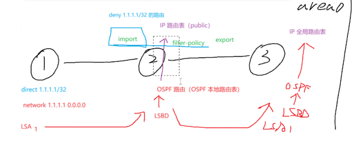
```
虽然 AR3 上有 1.1.1.1/32 的路由，但是 ping不通，
    - 因为 该LSA 是 AR2 泛洪 过来的 （一个接口收到 LSA，存放到LSDB后，再从“其他接口”重新泛洪出去）
    - 在全局路由表中 没有1.1.1.1/32的路由，无法传递，导致不通
```


#### 域间的路由过滤（filter-policy）
```
AR3 针对 AR1 的 1.1.1.1/32 路由进行过滤
    - （使用 filter-policy import）有效
		① AR3 需要把区域 0 的 stub 1.1.1.1/32 
            - 先转换为 inter-area（区域间） 1.1.1.1/32，
            - 才能生成 3类 LSA 并且传递到区域 1 中
		② AR3 本地路由表没有 1.1.1.1/32 的路由，
            - 所以也无法转发为  inter-area（区域间） 1.1.1.1/32，
            - 无法产生 3类 LSA，整个区域 1 的设备都无法收到该 LSA 无法计算路由

AR3 针对 AR1 的 1.1.1.1/32 路由进行 export 方向的过滤
    - （使用 filter-policy export）无效
		① AR3 可以把 1.1.1.1/32 的路由收进全局路由表，
            - 并且转换为 3类 LSA，出方向过滤无法针对 3类 LSA 生效，所以过滤失败	 
```

#### （*常用） 域间路由过滤（filter）直接针对 LSA 生效
```
AR3 为 ABR
    ① 针对 AR1（area 0）的 1.1.1.1/32 路由进行过滤，
        - 区域 0 中使用 filter export
        - （禁止 3类 LSA 离开区域 0）
    ② 针对 AR1（area 0）的 1.1.1.1/32 路由进入区域 1，
        - 可以在区域 1 中使用，filter import
        - （禁止 1.1.1.1/32 的3类 LSA 进入到区域 1 中）

    以上的两条配置，都可以让 AR4 无法接收到 1.1.1.1/32 的 LSA
    （区别在于，
            配置①，除了区域0，所有其他区域都无法访问 1.1.1.1/32，
            配置②，仅有区域1，无法访问 1.1.1.1/32）
```
- （拓扑图补充：AR1-area0-AR3-area1-AR4）
    - 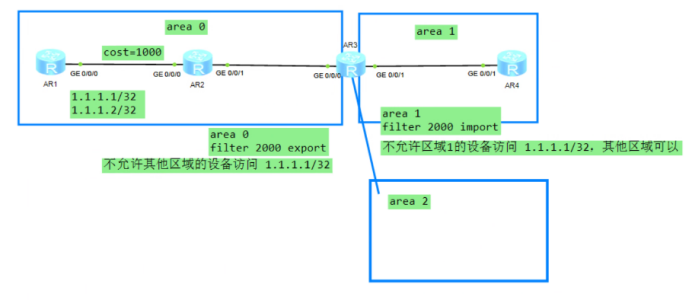

- 实验拓扑
    - 
```
AR1 和 AR2 是 Area 0 区域，
AR2 和 AR3 是 Area 1 区域
AR2 和 AR4 是 Area 2 区域
情况 1：
    在 AR2 的 area 0 配置 filter export （作用 area 0 中的所有3类LSA都无法出 Area 0 区域）
情况 2：
    在 AR2 的 area 1 配置 filter import （作用 area 1 禁止所有来自于 Area 0 的3类LSA，进入 Area 0）
```
- 实验结果（仅仅展示 情况 2）
    - 


#### （*常用） 域间路由过滤（filter-lsa-out）接口配置
```
    可以直接在 AR3 传递 LSA 给 AR4 路由器的接口使用，
        - ospf  filter-lsa-out summary acl 2000

    针对 AR3 传递给 AR4 的 3 类进行过滤
    （补充：完成配置后，需要重启 AR3 和 AR4 的 OSPF 进程）

	域间路由过滤
	AR3（始发 ABR 上）可以汇总路由后，进行过滤
		针对 AR1（area 0）的 1.1.1.1/32、1.1.1.2/32 路由可以进行汇总后拒绝通告
		area 0
        
        // 拒绝通告 1.1.1.0/30 的路由，其余路由可以正常放行
		abr-summary 1.1.1.0 255.255.255.252 not-advertise 					
	————————————————————————————————————————————————————————————————
```

#### 域外路由过滤（5、7类 LSA）
- 5类 LSA 可以在 ASBR 上执行过滤（filter-policy export 有效）
- ```
	- OSPF 需要把其他协议的路由，
        - 从全局路由表中引入到 OSPF 内部生成 5类 LSA
	- filter-policy 可以针对全局路由表生效，
        - 可以在其他协议的路由 从全局路由表离开时 生效，
        - 禁止该路由生成对应的 5类 LSA

	（补充：import 无效，因为 OSPF 不能过滤其他协议的路由）
    ```

- 5类 LSA 也可以在引入的时候进行过滤（import-route route-policy 执行过滤）
    -   *例1：需要过滤 1.1.1.1/32 路由，放行 2.2.2.2/32 路由
```
配置：
    acl 2000
    rule permit source 1.1.1.1 0

    route-policy A deny node 10
    if-match  acl 2000
    
    route-policy A permit node 20

    ospf 1
    import-route static route-policy A
	——————————————————————————————————————————————
	1.1.1.1/32 路由的过滤流程
		① 先查看 OSPF 进程的引入路由  import-route static route-policy A			
            // 代表引入静态路由的时候执行 route-policy A 的策略
		② 执行 route-policy A 策略（node 10 节点）
		③ node 10 节点下，需要拒绝的是 ACL 2000 中，匹配的路由
		④ ACL 2000 中匹配的路由为：1.1.1.1/32
		⑤ 综合：OSPF 引入静态路由时，过滤 1.1.1.1/32 的路由
	——————————————————————————————
	2.2.2.2/32 路由的放行流程
		① 先查看 OSPF 进程的引入路由  import-route static route-policy A			
            // 代表引入静态路由的时候执行 route-policy A 的策略
		② 执行 route-policy A 策略（node 10 节点）
		③ node 10 节点下，需要拒绝的是 ACL 2000 中，匹配的路由
		④ ACL 2000 中，并没有节点匹配 2.2.2.2/32，
            - 所以该节点无法执行操作，
            - 跳过 node 10 节点，
            - 转而执行 node 20 节点
		⑤ node 20 节点，放行所有的路由，2.2.2.2/32 可以被接收
```

- 	例2：需要过滤 1.1.1.1/32 路由，放行 2.2.2.2/32 路由
```
配置
    acl 2000
    rule 5 deny source 2.2.2.2 0
    rule 10 permit source any

    route-policy A deny node 10
    if-match  acl 2000
    
    route-policy A permit node 20

    ospf 1
    import-route static route-policy A
	——————————————————————————————————————————————
	2.2.2.2/32 路由放行流程
		① 先查看 OSPF 进程的引入路由  import-route static route-policy A			
            // 代表引入静态路由的时候执行 route-policy A 的策略
		② node 10 策略需要匹配 ACL 2000 的路由进行过滤
		③ ACL 2000 先执行 rule 5，rule 5 代表匹配 2.2.2.2/32 的路由，
            - 但是匹配后直接跳过节点（因为 ACL 的动作是 deny）
		④ route-policy A node 10 中匹配的对象无法执行操作，
            - 直接跳过 node 10 节点，转而执行 node 20 节点
		⑤ 2.2.2.2/32 的路由，执行 node 20 节点，
            - 代表匹配通过，放行 2.2.2.2/32 的路由

	1.1.1.1/32 路由拒绝流程
		① 先查看 OSPF 进程的引入路由  import-route static route-policy A			
            - // 代表引入静态路由的时候执行 route-policy A 的策略
		② node 10 策略需要匹配 ACL 2000 的路由进行过滤
		③ ACL 2000 中，rule 5 无法匹配 1.1.1.1/32 
            - 则转交给 rule 10 匹配，
            - 匹配成功 1.1.1.1/32 的路由
		④ 匹配成功 1.1.1.1/32 的路由后，执行 route-policy node 10 节点，
            - 动作为 deny，所以 1.1.1.1/32 的路由被拒绝
```


## 三、OSPF 特性
### 1、FA 地址
#### 1. 解决次优路径，可以根据 FA 地址找到访问目的地的最优接口
##### 条件 FA 非 0
```
① 接口为 MA 类型
    - （BMA、NBMA）
② FA 地址在 OSPF 路由表存在
    - （发布到 OSPF 中）
③ 非静默接口
    - （没有配置为 silent-interface）
```
##### 补充：
```
1. FA 不为 0 的情况下，必须保障 FA 地址是可达的，
    - 否则该外部路由不可用（下一跳不可达的路由不使用）
2. 如果 FA 等于 0 
    - 则直接找到 ASBR 即可，无需查看 FA 地址是否可达
```
#### 2. 防环
```
当收到的 5类 LSA，
    - FA 地址 与 本设备出口一致，
    - 则该 5类 LSA 仅接收但不计算（避免环路的产生）
```
#### 3. 7类的 FA 地址，一定不为 0
```
用于防止环路 和 次优路径
    - （在 7 转 5 的时候，也会继承 FA 地址）

补充：
    - NSSA 区域能够进行 7 转换 5 的设备为
        - 区域内 Router ID 最大的 ABR
        - （转换后的 ABR 也是 ASBR 设备）
```

### 2、外部路由开销的计算

#### Type 1 = 外部开销 + 内部开销之和（直接比较开销值）

#### Type 2 = 仅显示外部开销
```
① 先比较外部开销  
② 如果一致 则再比较内部开销
```
##### 补充：
```
    Type 1 > Type 2
    （如果开销类型不一致，则优先选举 Type 1 的路由，不看具体的开销值）
	（类型一致则参考上面的比较方式）
```
		
### 3、路由策略（route-policy、filter-policy）
```
	没有放行的路由，默认动作是拒绝
```

### 4、策略路由（traffic-policy、traffic-filter、policy-based-route）
```
	没有拒绝的流量，默认动作是放行
```

### 5、OSPFv2 多进程
```
通过 ip vpn-instance 进行隔离，
    - 使得一个路由器能够运行多个 OSPF 协议进程，
    - 同时也能发布路由

进程之间相互独立，互不干扰（用于 MPLS VPN 中的 PE 设备）
```
### 6、GR (Graceful Restart, 平滑重启)
```
保障 restart 设备在重启过程中
    - 转发表项不改变，
    - 保留业务通信能力（减少流量中断）
当 restart 设备重启完成并且同步 LSDB 后，
    - 会重新计算路由，
    - 并且同步给邻居（最后退出 GR 状态）
    - 更新新的 FIB 表
```

### （测试练习）
```
NE 设备作为 helper 端
AR 设备作为 restart 端

1、基础配置
① 接口配置 IP 地址（略），并添加 loopback0 接口地址，模拟业务路由（略）
② 配置 OSPF 邻居并发布相应接口

2、GR 配置及测试
① GR 配置
	ospf 1
	opaque-capability enable                         // 开启不透明 LSA 协商能力
	graceful-restart                                         // 默认 GR 周期（120s）

② 测试
	Restarter 设备进行系统配置视图
	reset ospf process graceful-restart            // 重启 OSPF 进程（GR）
	
	Helper 设备则可以持续访问该设备，并查看 LSDB 信息
	display ospf lsdb opaque-link
```

#### 实验
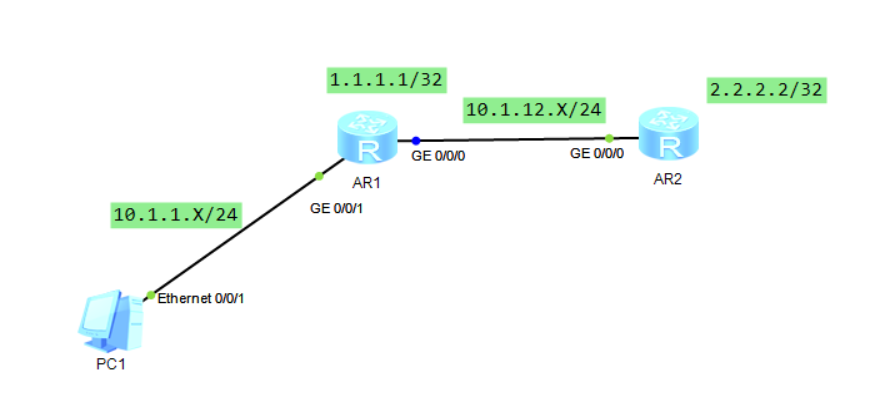
##### 1. 没有启动 GR
- 配置
- AR1
    - 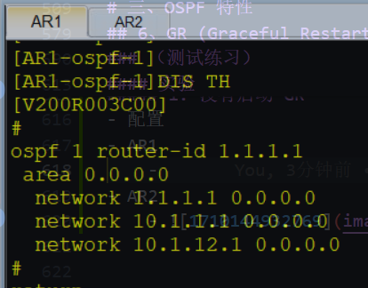
- AR2
    - 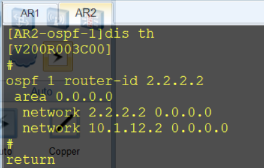
```
PC1 持续 ping 2.2.2.2
期间 重启 ospf 
reset ospf process
```
- 结果
    - 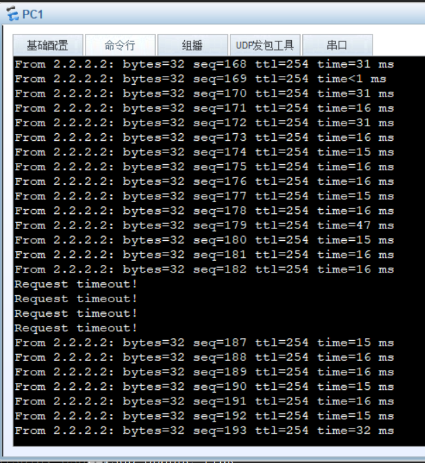

##### 2. 配置 GR
- 配置
- AR1
    - 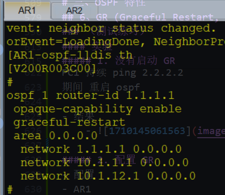
- AR2
    - 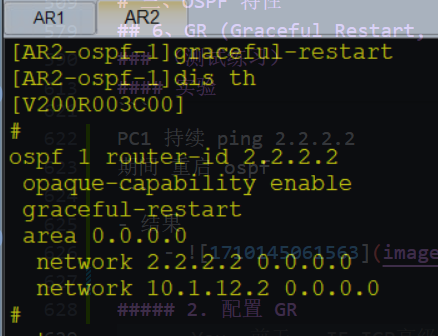 

```
PC1 持续 ping 2.2.2.2
期间 重启 ospf 
reset ospf process graceful-restart
```
- 结果
    - 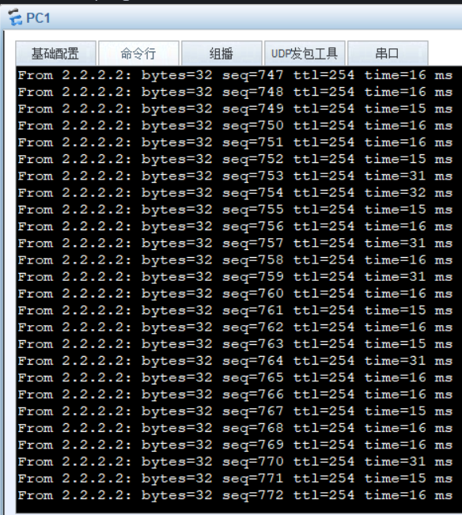

# 练习 OSPF
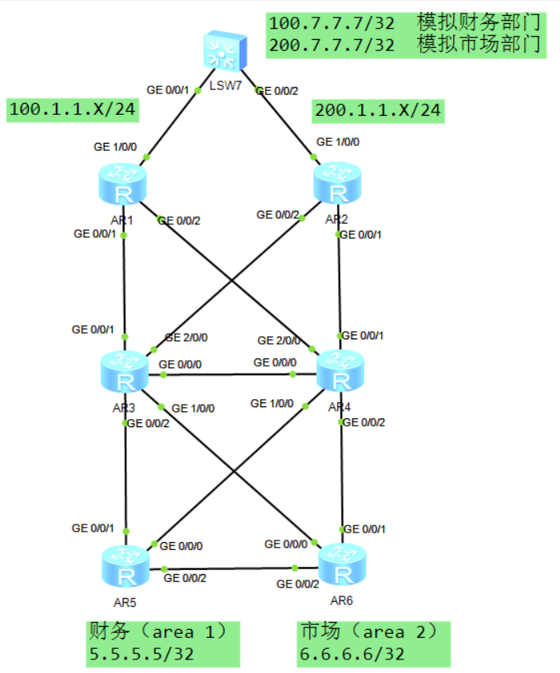
```
拓扑描述：
1、LSW7 模拟外网设备，已完成互联接口配置
   （互联接口地址为：100.1.1.7 和 200.1.1.7，分别与 AR1 和 AR2 互联）
   （LSW1 已经配置回程静态路由，分别指向 AR1 和 AR2）

2、内网设备为 AR1—AR6，均已运行 OSPF 协议并建立邻居关系
   设备互联网段为：10.1.Y.X/24   Y 为设备互联编号
  （如：AR5 与 AR6 的 G0/0/2 接口为：10.1.56.X/24）

3、财务部员工，使用 AR5 的 loopback0 接口模拟，地址为：5.5.5.5/32
   市场部员工，使用 AR6 的 loopback0 接口模拟，地址为：6.6.6.6/32
   已发布到相关区域

4、财务服务器使用 LSW7 的 loopback0 接口模拟，地址为：100.7.7.7/32
   市场服务器使用 LSW7 的 loopback1 接口模拟，地址为：200.7.7.7/32
   均已配置
——————————————————————————————————————————————————————————————————————

配置需求
1、AR1 与 AR2 分别写静态路由到达财务服务器和市场部门服务器

2、AR1 和 AR2 分别把静态路由引入到 OSPF 协议中

3、实现财务部员工访问部门服务器时（100.7.7.7）优先从 AR1 设备到达
   市场部员工访问部门服务器时（200.7.7.7）优先从 AR2 设备到达

4、当 AR1 和 AR3 设备正常时，财务员工访问服务器，数据包必须经过 AR1
   当 AR2 和 AR4 设备正常时，市场员工访问服务器，数据包必须经过 AR2

5、保证来回路径一致且流量清晰
   ① 链路及设备均正常时，财务员工访问服务器路径为（AR5、AR3、AR1、LSW7）
   ② AR1 与 AR3 链路故障后，财务员工访问服务器路径为（AR5、AR3、AR4、AR1、LSW7）
   ③ 当 AR1、AR3、AR5 互联路径故障，财务员工访问服务器路径为（AR5、AR4、AR1、LSW7）
   （市场部门同理）

6、为了快速收敛，所有运行 OSPF 协议的设备均需要在 1s 内发现邻居故障
   当 OSPF 设备故障或链路故障后，能够在毫秒级内完成备份链路切换
```	
## 配置
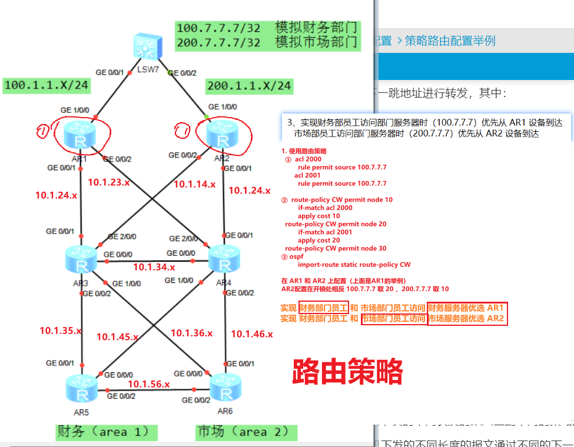
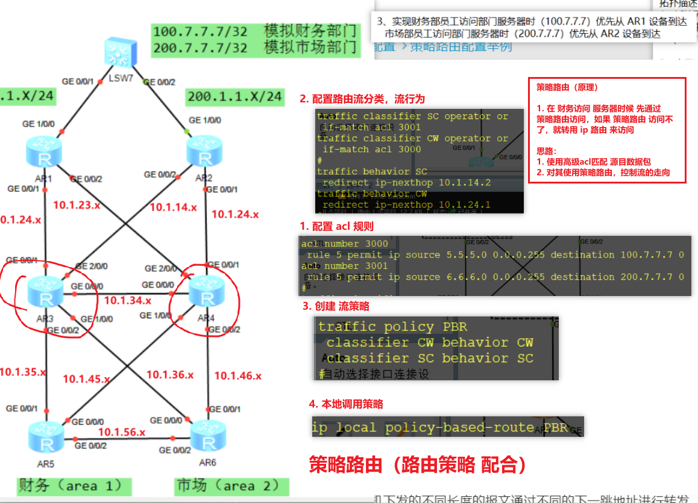
- [练习](./OSPF%20选路控制.rar)
- [练习配置好的](./OSPF%20选路控制%20配置好.zip)


# ISIS
```
IS-IS 与 OSPF 的协议类似，很多快速收敛的机制均一致
```
## 一、IS-IS 协议快速收敛的特性

###	1、SPF 算法
```
IS-IS 也支持 full-mush、I-SPF、PRC 计算

涉及拓扑节点变化的信息
    - （如：新增节点、删除节点、修改节点开销值等，
    - 都使用 I-SPF 计算）

只涉及路由变化
    - （如：新增外部路由、新增 loopback 这类型的接口时，
    - 只执行 PRC 计算）
```

### 2、BFD 联动	
```
利用 BFD 的机制绑定 IS-IS 的会话，
    - 当 BFD 会话中断会引导 IS-IS 会话中断

BFD 可以实现 毫秒级的网络收敛，增强收敛速度
```

#### 配置命令
```
① 全局开启 BFD 功能
    bfd

② 进入 IS-IS 进程（批量）
    isis 1
    // 所有发布到 IS-IS 协议的接口都开启 BFD
    bfd all-interfaces enable						

③ 进入某个单独的接口开启（独立）					
// 仅 G0/0/X 接口开启 BFD 功能
    interface G0/0/X
    isis bfd enable
——————————————————————————————————————————
可选参数
    interface G0/0/X
    
    // 最小的接收时延：100ms、最小传输时延：100ms
    isis bfd  min-rx-interval 100 min-tx-interval 100 detect-multiplier 3				
    
    本设备的老化时间等于接收时延 x 倍数
                                                                （检测倍数默认为：3倍，检测时延和接收时延默认为：1000ms）
    
    isis 1
    // 进程下针对所有接口生效	
    bfd  all-interface  min-rx-interval 100 min-tx-interval 100 detect-multiplier 3		
    
    补充：同时部署，接口优先于进程生效
```

###	3、智能定时器
```
isis 1
// 修改智能定时器的参数
    - （5s 为最大生成时间）
    - （500ms 是初始时间）
    - （1000ms 基数时间）
timer lsp-generation 5 500 1000 level-2		

第一次：
    按照初始时间生成 LSP（500ms）
第二次：
    在初始时间上添加基数时间（1500ms）
第三次：
    基数时间 x 2 倍（2500ms）
第四次：
    （前一次基数时间）基数时间 x 2 倍（4500ms）最大不超过 5s，
    - 3次 最大时间后，切换为 初始时间生成
```

### 4、快速扩散
```
当设备收到更新的 LSP 时，可以在路由计算前，
    - 把指定数量的 LSP 先扩散给其他邻居设备

isis 1

// 100ms 内把新增的 10 份 level-2 的 LSP 快速扩散出去
flash-flood 10 max-timer-interval 100 level-2				
```

### 5、IP FRR 联动 [快速重路由FRR（Fast Reroute）]
```
指当物理层或链路层检测到故障时
    - 将故障消息上报至上层路由系统，
    - 并立即启用一条备份链路转发报文。
    - IP FRR是一种快速实现路由备份的方式。
```
```
isis 1
// 进入进程开启 FRR 功能
frr													
// 开启 LFA 算法，根据算法生成备份路径
loop-free-alternate level-2								

查看方式
    // 其中 X.X.X.X 为路由条目、Y 为掩码长度
    display ip routing-table X.X.X.X Y verbose	

（如：2.2.2.2 32  查看 2.2.2.2/32 路由的备份信息）
```

## 二、IS-IS 特性
### 1、level-1 的路由会通过 level-1-2 设备 主动注入 到 level-2 区域中
```
① level-2
    - （由连续的 level-2 设备可以组成骨干区域）
② level-1
    - （普通区域，类似于 OSPF 的 Totally NSSA 区域，
    - 可以引入外部路由，但无法学习到其他区域的明细路由）
③ level-1-2 设备类似于 OSPF 的 ABR 可以连接骨干区域和普通区域

备注：
    - 因为 level-1-2 设备
    - 默认开启了 import-route isis level-1 into level-2 命令，
    - 所以 level-1 的路由才能主动注入 level-2

level-2 的设备一般会拥有其他区域的明细路由，可以通过路由访问

level-1 设备一般是采用缺省路由访问其他区域和 level-2 区域
```

### 2、缺省路由的生成
#### 1. ATT = 1
```
当满足以下两个条件，
    - level-1-2 的设备会产生 ATT = 1 的 LSP（level-1），
    - 可以让其他 level-1 设备收到后，自动产生一条到达 level-1-2 的缺省路由

    ① level-1-2 设备必须有 2 个等级的邻居，
        - 一个 level-1 另一个 level-2
    ② level-1 和 level-2 邻居的
        - 区域 ID 不能一致			
    注意：
        - （如果一致代表无需访问其他区域，
        - 让 level-1 区域的设备有访问其他区域的能力）
```
##### 举例
```
① level-1-2 设备必须有 2 个等级的邻居，
    - 一个 level-1 另一个 level-2
② level-1 和 level-2 邻居的
    - 区域 ID 不能一致
```
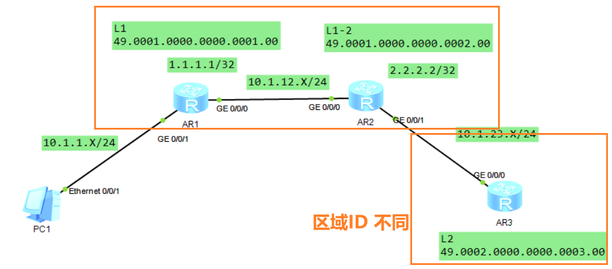
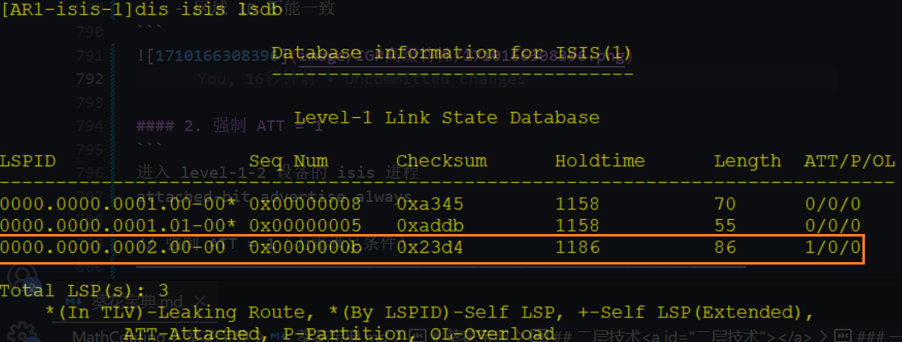

##### 补充（ATT 的作用）


#### 2. 强制 ATT = 1
```
进入 level-1-2 设备的 isis 进程
attached-bit advertise always 						

// 强制 ATT = 1（无需满足条件）
————————————————————————————————————————————————————————————————
```
##### 举例
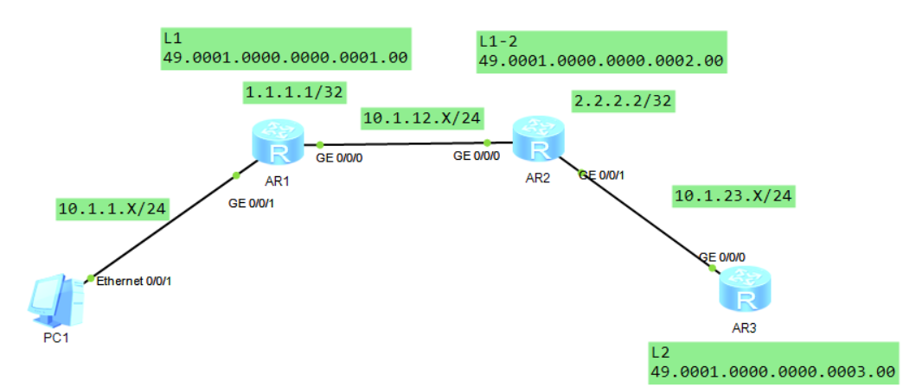
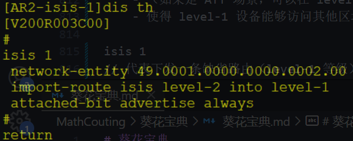
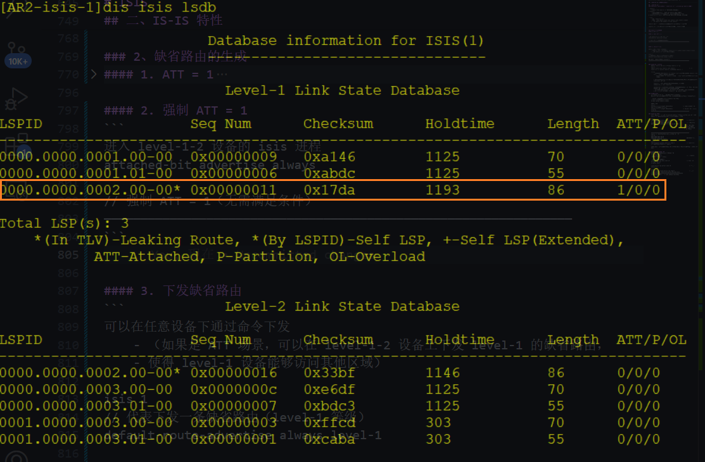

#### 3. 下发缺省路由
##### 作用

##### 配置
```
可以在任意设备下通过命令下发
    - （如果是 ATT 场景，可以在 level-1-2 设备上下发 level-1 的缺省路由，
    - 使得 level-1 设备能够访问其他区域）

isis 1
// 代表下发一条缺省路由（level-1 等级）
default-route-advertise always level-1 					

如果不添加等级，则默认为：level-2
————————————————————————————————————————————————————————————————
```

###### 举例
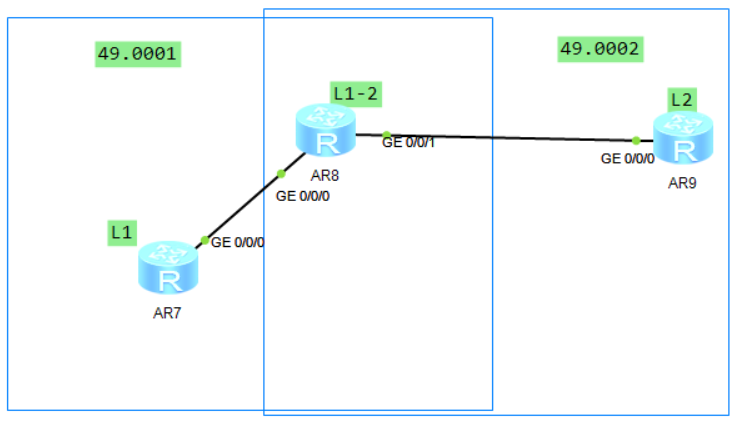
```
在AR2（L1-2）设备没有配置 default-route-advertise level-1 时
```
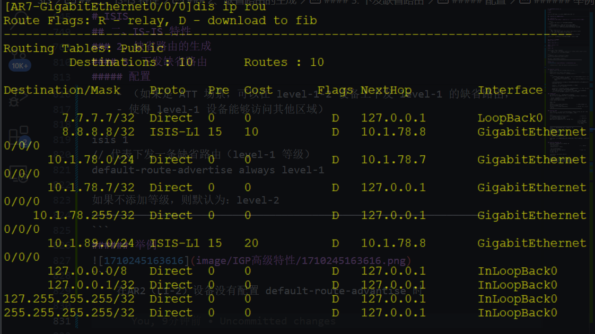
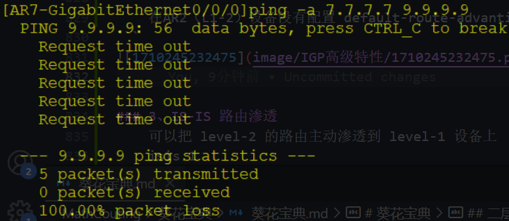

```
在 AR2上配置 default-route-advertise level-1
```
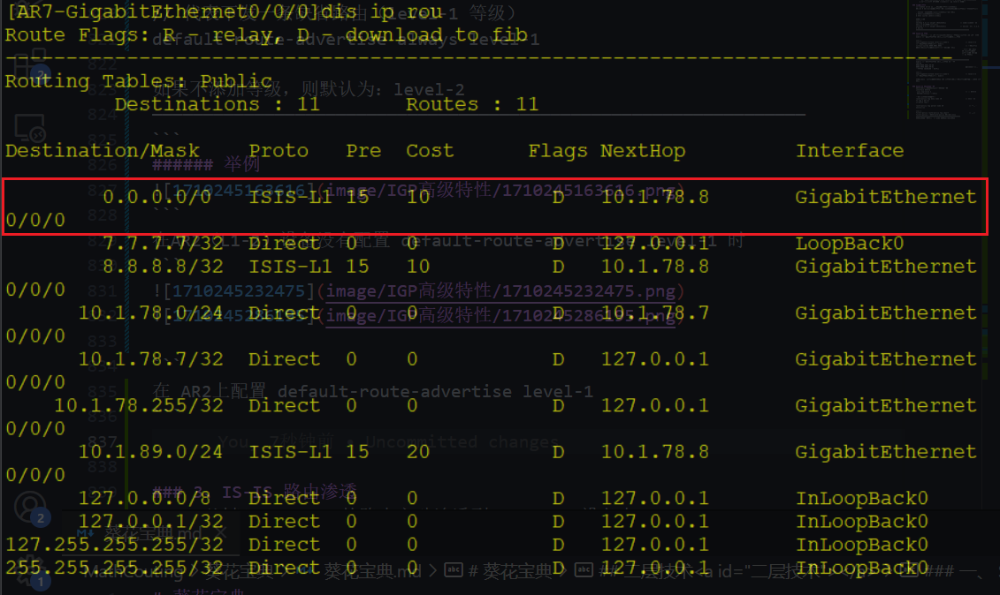
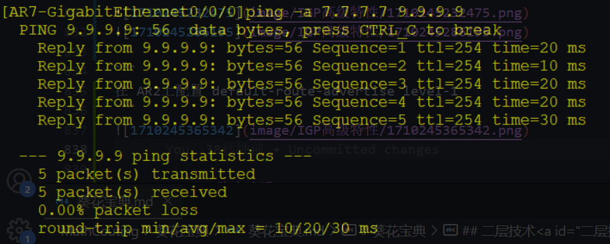

##### 注意
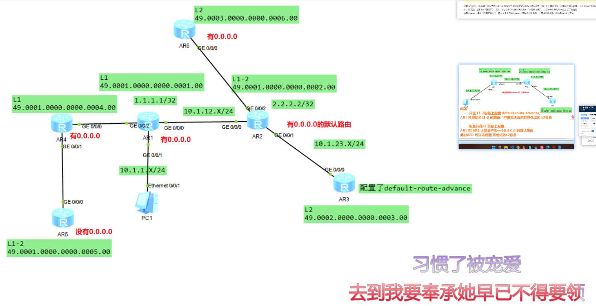

### 3、IS-IS 路由渗透 （L2 -> L1）
```
可以把 level-2 的路由主动渗透到 level-1 设备上

isis 1

// 在 level-1-2 设备上，把 level-2 路由引入到 level-1 中
import-route isis level-2 into level-1						
```
#### 作用：
##### 1. 解决次优路径，
```
level-1 设备只能通过缺省路由访问，
    - 不知道 level-2 路由真实开销，
    - 容易出现次优路径的问题

    渗透后，可以继承 level-2 路由的开销，
        - 通过明细路由访问（非缺省路由访问）
```
##### 2. 可以解决没有明细路由，无法建立隧道的问题
```
（如：MPLS LSP）需要有明细路由才能构建 LDP LSP 
```

##### 解决方式：(使用 up / down-bit)
```
渗透类似于双点双向引入，可能会引入次优和环路问题

up/down-bit 是
    - 由高等级路由引入到低等级区域时才会添加，
    - 一旦添加（路由的优先级为最低）
    - 且不能反向渗透到高等级区域

    ① 防止次优路径，
        - level-2 也比 level-1 带 UP/DOWN 位的路由优先级高
    ② 防止环路，
        - 带 UP/DOWN 路由不能回传到 level-2 区域中
```

##### 次优路径 以及 环路的产生
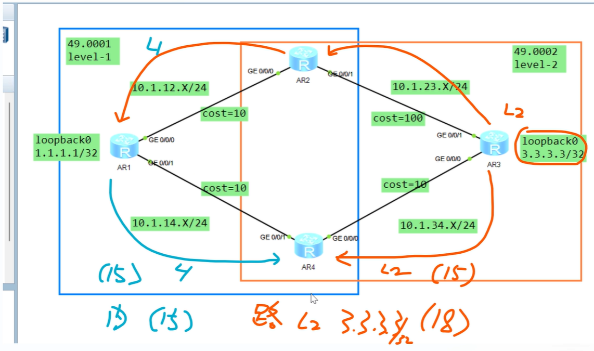
```
当做完路由渗透后，3.3.3.3/32的路由会 以L2等级发布给 AR2 和 AR4
AR2 （L1）发布给 AR1， -> AR4
此时，AR4 会出现两条路由
    1. 来自 AR1 (L1) 外部优先级 15，内部优先级 L1 = 15
    2. 来自 AR3 (L1) 外部优先级 15，内部优先级 L2 = 18

所以，优选AR1的路由，（此时次优路径产生）

由于做了路由渗透，所以 AR1 的L1路由会发布给 AR3
当 AR3删除 loopb0口，此时刚好 g0/0/0 路径出了些故障，
导致暂时没法收到撤销路由，而发往AR2的路由被撤销了
所以此时，如果访问3.3.3.3，（会产生环路）
```

### 4、负载分担
```
缺省情况下 IS-IS 协议也支持负载分担路由（8条）

如果有 N 条路由，但负载分担配置为：
    - 1（不支持负载）则会按照以下规则选举

    1.  比较下一跳的权重值：越小越优（缺省不配置）
    2.  比较路由优先级（越小越优）
    3.  比较 system id（越小越优）

权重值设置

    isis 1
    // 目的路由的下一跳（X.X.X.X）权重值越小越好
    nexthop X.X.X.X weight 10（1—254）				
    // 优选下一跳为 X.X.X.X 的路由
    nexthop Y.Y.Y.Y weight 50（1—254）				
```

### 5、IS-IS 分片
#### mode-1
```
当设备无法通过一份 LSP 承载信息时，可以通过分片方式携带更多的 LSP  内容
mode-1 设备无法识别分片 ID，使用虚拟系统来进行分片

	isis 1
    
    // level-1-2 设备支持分片，分片类型为 mode-1
	lsp-fragments-extend level-1-2 mode-1					
	
    // 配置虚拟系统（注意：虚拟系统不能与真实设备的系统一致）
    virtual-system 0000.0001.0002							
	
一个设备最多支持 50 个虚拟系统（加上真实系统 ID，最多 51 分片）
```
#### mode-2
```
mode-2 设备可以识别分片 ID，使用分片 ID 标识
LSP-ID
	0000.0000.0001.00-00
	0000.0000.0001.00-01									
    
    最后的两位用于标识分片 ID（0x00 - 0xFF）

	isis 1
    
    // level-1-2 设备支持分片，分片类型为 mode-2	
	lsp-fragments-extend level-1-2 mode-2					

（如果不添加虚拟系统可以支持 256 个分片，
    如果配置虚拟系统则最多 13056 个分片）
```

### 6、IS-IS 支持管理标记
```
可以直接在任意的接口上，配置管理标记
	interface G0/0/X
    // 为 G0/0/X 接口的路由打上标签（2）
	isis tag-value 2										

过滤路由时可以快速匹配
    // 拒绝所有带 tag 2 的路由
	route-policy tag deny node 10 							
	if-match tag 2

    // 放行所有其他路由
	route-policy tag permit node 20 							

	isis 1
    
    // 使用 filter-policy 过滤（route-policy 调用的路由）
	filter-policy route-policy tag import 						
——————————————————————————————————————————————————
补充：
    管理标记必须开启 wide 度量模式才能支持
```
