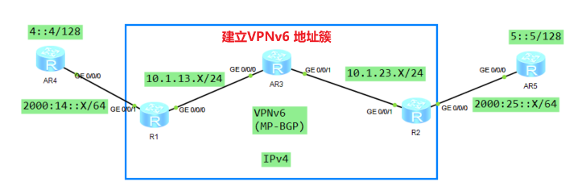
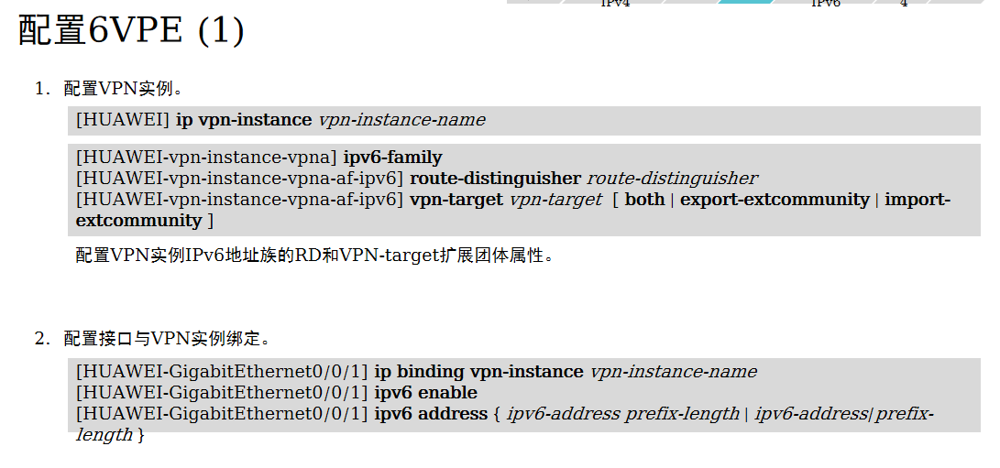
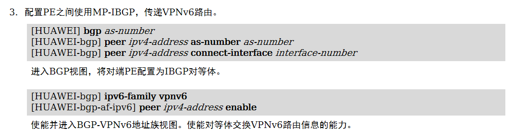

# 6VPE 
```
    在IPv4 MPLS骨干网上承载IPv6的VPN业务
```

```
通过 IPv4 的核心网，传递 IPv6 的路由条目（运营商现有 IPv4 建立的 MPLS VPN 网络，仅需要利用现有的核心网络构建即可）

MPLS VPN 本身也不需要获取路由信息，仅需要标签信息即可实现转发
```
	
## 配置命令
```
运营商设备（R1、AR3、R2）
1、内部接口使用任意 IGP 协议建立邻居关系，并学习接口 IP 地址
	略

2、R1、AR3、R2 建立 MPLS 及 LDP 邻居
	mpls lsr-id X.X.X.X							// 各自设备的 loopback0 接口地址
	mpls
	mpls ldp

	interface G0/0/X
	mpls
	mpls ldp									// 开启 MPLS 及 LDP 


3、R1 和 R2 建立 VPNv6 邻居（R2 配置参考）
	bgp 100									// 创建 BGP 进程，及 AS number
	router-id 1.1.1.1							// 需要手工指定 Router id
	undo default ipv4-unicast					// 删除 IPv4 单播信息

 	peer 1.1.1.1 as-number 100					// 指定对等体信息（R1）
 	peer 1.1.1.1 connect-interface LoopBack0		// 指定更新源
	
 	ipv6-family vpnv6							// 创建 VPNv6 协议簇
  	peer 1.1.1.1 enable							// 指定 R2 为 6PE 邻居


4、创建 IPv6 实例（R2 参考配置）
	ip vpn-instance B							// 创建实例 VRF-B
 	ipv6-family								// 设置实例协议簇（需要指定 IPv6 地址簇，默认为 IPv4 地址簇）
  	route-distinguisher 2:2						// 设置 RD
  	vpn-target 100:100 both					//  设置 RT（出入方向均为 100:100）


5、绑定 PE 连接 CE 的接口
	interface G0/0/X
	ipv6 enable
 	ip binding vpn-instance B					// 绑定后重新部署接口地址


6、PE 与 CE 建立 IPv6 BGP 邻居
	bgp 100
	ipv6-family vpn-instance B
	peer  2000:25::5 as-number 102				// 参考 R2 与 AR5 设备建立 EBGP 邻居


7、AR5 配置
	bgp 102
	router-id 5.5.5.5							// 需要手工指定 Router id
	peer  2000:25::5 as-number 100	

	ipv6-family unicast							// 参考 R2 与 AR5 设备建立 EBGP 邻居
	peer 2000:25::5 enable
	network 5::5 128							// 发布测试接口路由
```

## 练习





[6VPE练习](./6VPE%20练习.rar)
