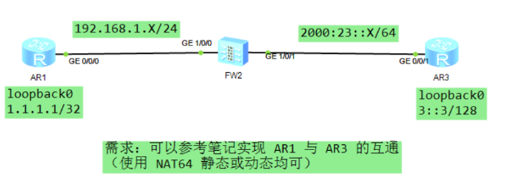

# NAT64（互通技术）
```
可以实现 IPv4 和 IPv6 的转换，实现互访

补充：
    NAT64 需要配置转换的前缀，
    
    如：3000::/96  剩余 32 bit 由 IPv4 地址嵌套填充
```
## 1、NAT64 静态
```
可以实现 1:1 的互访，无论是 IPv4 或 IPv6 方发起访问，均可以实现互访

场景：
    一般用于 IPv6 服务器为固定地址，IPv4 客户任意地址访问的场景
```

## 2、NAT64 动态
```
可以实现 1:N 的互访，但仅可以实现 IPv6 的主动发起对 IPv4 的访问
    - （适合于 IPv6 的主机，访问 IPv4 内部地址的情况，
        - 必须得知 IPv4 内部地址和 NAT64 前缀才能实现）
    - 或者使用 DNS

可以把 IPv6 地址动态映射到一个 IPv4 地址上（多个 IPv6 ： 1个 IPv4）
```


## 配置命令：
### NAT64静态
```
私网设备（AR1、FW2）
	1、接口配置 IP 地址，且运行任意的 IGP 协议使其可达
		interface G0/0/X
		ip address 10.1.12.1 24

		interface loopback0
		ip address 192.168.1.1 32	（模拟主机设备）

	2、防火墙（FW2）
		interface G1/0/X
		ip address 10.1.12.2 24

	3、双方建立 OSPF 邻居
		ospf 1 router-id X.X.X.X
		area 0
		network（接口路由和 loopback）

	4、防火墙 FW2 需要下发缺省路由
		ospf
		default-route-advertise always


公网设备（FW2、AR3）
	1、FW2 配置接口 IPv6 地址，及缺省路由
		ipv6 

		interface G1/0/X
		ipv6 enable
		ipv6 address  2000:23::2 64

		ipv6 route-static  ::  0  2000:23::3		// 配置缺省路由


	2、AR3
		ipv6 

		interface G0/0/X
		ipv6 enable
		ipv6 address  2000:23::3 64

		interface loopback0
		ipv6 enable
		ipv6 address  3::3 128				// 模拟公网服务器
	————————————————————————————————
	NAT64 配置
	防火墙配置
		firewall zone untrust
 		add interface G1/0/X				// 连接外网的接口配置非信任

		firewall zone trust
 		add interface G1/0/X				// 连接内网的接口配置信任

	安全策略
		security-policy
 		default action permit				// 放行所有流量（步骤 ① ）可以使用 AR 设备 ping 测试获取防火墙通信的流量

		步骤 ② display firewall session table  可以查看防火墙数据通过的信息，后续修改防火墙策略

	配置 NAT64
	 	nat64 prefix 3000:: 96				// 指定转换的 NAT64 前缀
 		nat64 static 3::3 200.1.1.3			// 指定 3::3 服务映射的公网 IPv4 地址
 		nat64 enable						// 开启 NAT 64 功能

	FW2 接口调用 NAT64
		interface G1/0/X
		nat64 enable						// 公网和私网接口均需要调用

	完成 NAT64 配置后，可以使用 AR1 ping 测试 200.1.1.3（实现 NAT64 转换）同时根据步骤 ① 和 ② 查看防火墙流量的放行情况
	重新修改防火墙策略
		security-policy
		default action deny					// 把所有的流量全部拒绝通过
	
		rule name NAT64
  		source-zone trust
  		destination-zone untrust
		source-address 1.1.1.1  32
  		source-address 192.168.1.0  24		// 还需要指定能够发起访问的 IP 地址
  		destination-address 200.1.1.3 32		// 允许信任区域访问非信任区域，且访问服务器：200.1.1.3（转换前的 NAT64 地址）
  		action permit
	

	双方均能发起访问
	AR1  ping  200.1.1.3（源地址可以不用指定，任意 IPv4 设备均可，类似于 NAT server）

	AR3 发起访问，就需要嵌套 IPv4 地址
	如：AR3  ping ipv6  3000:: + IPv4 目的地址（如：3000::C0A8:101）
	——————————————————————————————————————————————————————————
```

### 动态 NAT64
```
私网设备（AR1、FW2）
	1、接口配置 IP 地址，且运行任意的 IGP 协议使其可达
		interface G0/0/X
		ip address 10.1.12.1 24

		interface loopback0
		ip address 192.168.1.1 32	（模拟主机设备）

	2、防火墙（FW2）
		interface G1/0/X
		ip address 10.1.12.2 24

	3、双方建立 OSPF 邻居
		ospf 1 router-id X.X.X.X
		area 0
		network（接口路由和 loopback）

	4、防火墙 FW2 需要下发缺省路由
		ospf
		default-route-advertise always


公网设备（FW2、AR3）
	1、FW2 配置接口 IPv6 地址，及缺省路由
		ipv6 

		interface G1/0/X
		ipv6 enable
		ipv6 address  2000:23::2 64

		ipv6 route-static  ::  0  2000:23::3		// 配置缺省路由


	2、AR3
		ipv6 

		interface G0/0/X
		ipv6 enable
		ipv6 address  2000:23::3 64

		interface loopback0
		ipv6 enable
		ipv6 address  3::3 128				// 模拟公网服务器
	————————————————————————————————
	NAT64 配置
	防火墙配置
		firewall zone untrust
 		add interface G1/0/X				// 连接外网的接口配置非信任

		firewall zone trust
 		add interface G1/0/X				// 连接内网的接口配置信任

	安全策略
		security-policy
 		default action permit				// 放行所有流量


	配置 NAT64
	 	nat64 prefix 3000:: 96				// 指定转换的 NAT64 前缀
 		nat64 enable						// 开启 NAT 64 功能

	配置动态 NAT 策略
		nat-policy
 		rule name NAT64			
  		nat-type nat64
  		action source-nat easy-ip

	FW2 接口调用 NAT64
		interface G1/0/X
		nat64 enable						// 公网和私网接口均需要调用


	可以实现 IPv6 主动访问，如：AR3  ping ipv6  3000:: + IPv4 目的地址（如：3000::C0A8:101）
```

# 练习 动态NAT64 easyip

- AR1
```
interface GigabitEthernet0/0/0
	ip address 192.168.1.1 255.255.255.0

interface LoopBack0
	ip address 1.1.1.1 255.255.255.255 

// 放行路由
ip route-static 0.0.0.0 0.0.0.0 192.168.1.2
```
- AR3
```
ipv6
interface GigabitEthernet0/0/1
	ipv6 enable 
	ipv6 address 2000:23::3/64 

interface LoopBack0
	ipv6 enable 
	ipv6 address 3::3/128 

// 放行路由
ipv6 route-static 3000:: 96 2000:23::2
```

- FW2
```
ipv6

nat64 prefix 3000:: 96
nat64 enable

################################
静态路由就配置多这一条
	nat64 route-static 3000:: 96 200.1.1.10
################################

interface GigabitEthernet1/0/0
	ip address 192.168.1.2 255.255.255.0
	nat64 enable

interface GigabitEthernet1/0/1
	ipv6 enable
	ipv6 address 2000:23::2/64
	nat64 enable

firewall zone trust
	add interface GigabitEthernet1/0/0

firewall zone untrust
	add interface GigabitEthernet1/0/1

// 放行路由
ipv6 route-static 3::3 128 2000:23::3

security-policy
	default action permit

nat-policy
 rule name NAT64
  nat-type nat64
  action source-nat easy-ip
```

## 练习
[NAT64](./NAT64%20练习.rar)