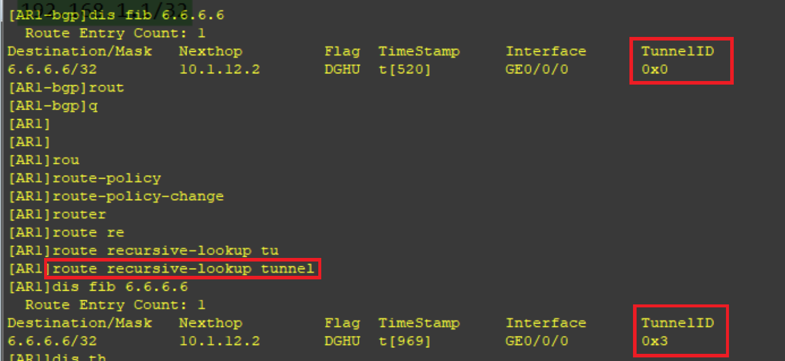
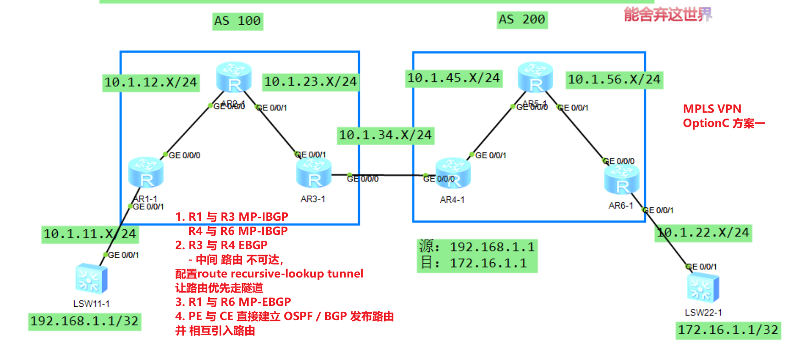
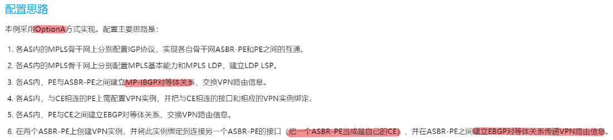
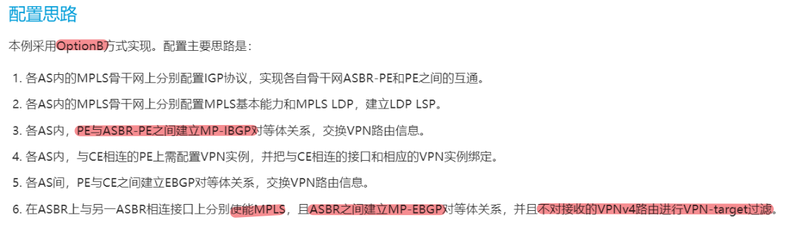
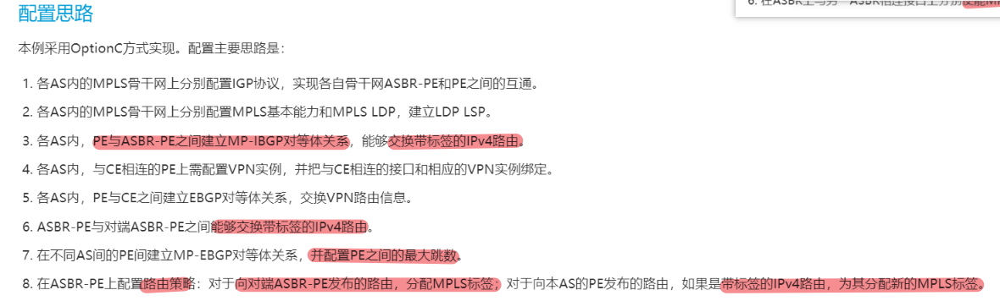
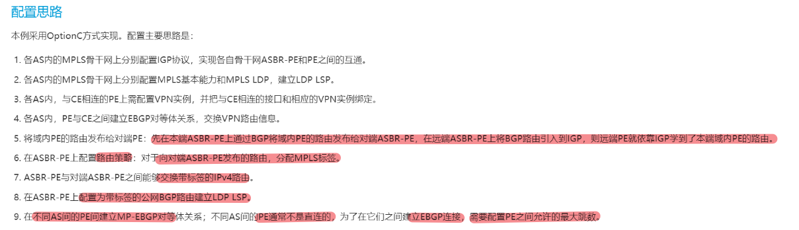
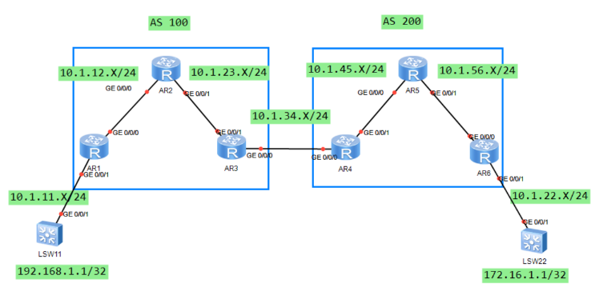
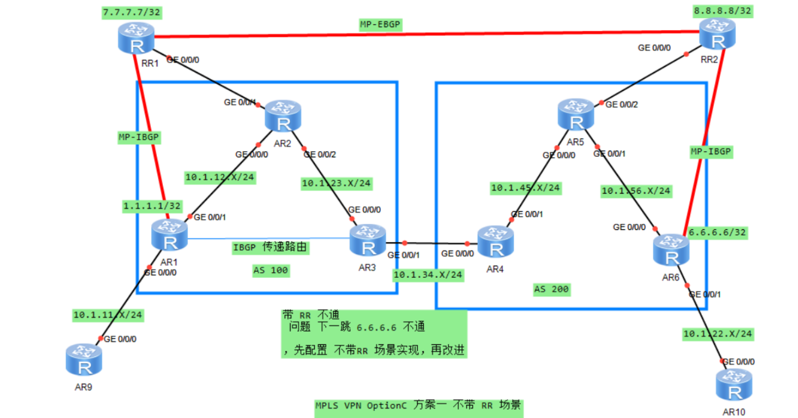

# MPLS VPN 跨域
```
分支站点需要经过多个 AS 来传递路由（MPLS VPN 处于多个 AS 来进行工作）
```

- 问题1：
```
AS 内部运行 IGP 协议，AS 间不会建立 IGP 邻居关系，无法学习对方 AS 的路由

    （导致 LDP 邻居无法建立，无法在 AS 之间直接建立 LDP LSP）导致隧道断裂，无法转发数据包
```
- 问题2：
```
AS 间 PE 无法学习到对端路由，导致 PE 间也无法建立 MP-BGP 邻居关系，无法传递客户的 VPNv4 路由
```

# 区别
```
Option A 
	- VRF to VRF

Option B
	- PE与ASBR-PE之间建立MP-IBGP对等体关系，交换VPN路由信息。
	- 在ASBR上与另一ASBR相连接口上分别使能MPLS，
		- 且ASBR之间建立MP-EBGP对等体关系，
		- 并且不对接收的VPNv4路由进行VPN-target过滤。

Option C
	方案一
		- PE 之间建立 MP-EBGP
		- PE 与 ASBR 之间建立 IBGP
		- ASBR 之间建立 EBGP
		- CE 与 PE 之间绑定vpn
		- 在 ASBR 之间配置 路由策略 （因为路由到达ASBR时候没有公网标签）
			- 去往 PE 的路由，
				- if-match mpls-label
				- apply mpls-label
			- 去往对方PE的路由
				- apply mpls-label
		- 在 pe 上需要让路由优先走隧道
			- route recursive-lookup tunnel
```
- route recursive-lookup tunnel 的情况


```

	方案二
		- PE 之间建立 MP-EBGP
		- ASBR 之间建立EBGP，发布路由，引入IGP
		- 在 ASBR 之间配置路由策略，分配标签给路由
			- 对带有BGP公网标签的路由建立 LDP LSP隧道
```
## OptionA 配置思路


## OptionB 配置思路


## OptionC 方案一 配置思路


## OptionC 方案二 配置思路


# 二、跨域方案
## 1、option A（VRF to VRF）

```
解决问题2：
    ① PE1（AR1） 设备与本 AS 的 ASBR1（AR3）
        - 建立 VPNv4 的邻居关系，传递内部的 VPNv4 路由

    ② ASBR1（AR3）把 ASBR2（AR4）当成是 CE 设备，传递 IPv4 路由    	 
        补充：
            AS 之间无需 MP-BGP 也可以传递路由
            （且可以使用任意协议 OSPF、IS-IS 等）

    ③ ASBR2（AR4）认为 ASBR2（AR3）是 CE 设备，
        - 从 CE 设备收到的路由重新转换为 VPNv4 路由，
        - 并传递给 PE2（ AR6）
        - 从而完成跨 AS 的 VPNv4 路由传递

    ④ PE2（AR6）设备把 IPv4 路由传递给客户 CE，完成路由传递

解决问题1：
    ① CE2 通过 IPv4 路由表，
        - 转发普通的 IPv4 流量到达 PE2（AR6）
    ② PE2（AR6）会把流量封装到 MPLS 中（打上私网、公网标签）
        - 通过 MPLS LSP 转发给 ASBR2（AR4）
    ③ ASBR2（AR4）收到该流量时，
        - 会弹出标签（公网、私网均弹出）
        - 改为普通的 IPv4 流量传递给 CE 设备（ASBR2-AR3）
        补充：
            AR4 和 AR3 交互的是普通的 IPv4 流量，
            无需封装隧道（类似于 PE 与 CE 直接传输 IPv4 流量）

    ④ ASBR1（AR3）设备收到 IPv4 流量，
        - 认为是从 CE 传递过来的（ASBR2-AR4）在 AR3 设备看来，是客户 CE
        - 重新执行标签封装（类似于步骤 ②）封装 MPLS 的私网和公网标签，并跨越 AS 100 传递给 PE1（AR1）设备
    ⑤ PE1（AR1）也会执行（步骤 ③）把标签弹出后，
        - 变为 IPv4 流量传递给 CE1，实现数据包的转发

    这种方案称为 VRF to VRF（流量每经过一个 AS，就相当于执行了一次域内的 VRF 转发）
```
### 优点：
```
① 该方案不需要额外修改配置，只需要 ASBR 之间建立 IPv4 的邻居即可
    - （双方 ASBR 互为 PE 和 CE 角色）
```
### 缺点：
```
① AS 越多，需要的接口和 VPN 实例就越多，
    - 对于 ASBR 设备而言压力较大（管理压力）
② 配置量大（每一个 AS 都需要一个 VRF）
    - 一般适用于跨域的 AS 较少的场景
```
		
### 配置命令
```
	AS 内部（参考单域的 MPLS VPN 配置即可）
	
	AS 间（ASBR 配置）
		AR3 需要创建实例，对接的客户机（CE）为 AR4

		AR3 与 AR4 如果使用 OSPF 建立邻居，需要开启以下命令
		ospf 2 router-id 3.3.3.3 vpn-instance A
 		dn-bit-check disable summary	/ ase					// 关闭 DN bit 的检测（可选路由类型：summary、ase）3 类 和 5 类

		AR4 同理，需要关闭 DN 的检测，防止路由传递失败（其他的 IGP 或 BGP 协议，均不需要配置）
```
### [MPLS VPN OptionA.zip](./Vpn跨域/OptionA.zip)
		

## 2、Option B 方案
```
问题1：
    AS 内部运行 IGP 协议，AS 间不会建立 IGP 邻居关系，
        无法学习对方 AS 的路由

        （导致 LDP 邻居无法建立，无法在 AS 之间直接建立 LDP LSP）
        导致隧道断裂，无法转发数据包

问题2：
    AS 间 PE 无法学习到对端路由，
        导致 PE 间也无法建立 MP-BGP 邻居关系，
        无法传递客户的 VPNv4 路由
```
```
解决问题2：
    ASBR 之间建立 MP-EBGP 邻居关系（使用直连的物理接口建立）用于传递 AS 之间的 VPNv4 路由

    ① PE1（AR1）把客户路由添加上 RD 形成 VPNv4 路由，
        - 并通过内部的 MP-IBGP 邻居传递 VPNv4 路由给 ASBR1（AR3）

    ② ASBR1（AR3）通过与 ASBR2（AR4）建立的 MP-EBGP 邻居关系，
        - 之间传递该 VPNv4 路由
    
    ③ ASBR2（AR4）可以通过内部的 MP-IBGP 邻居，
        - 把 VPNv4 路由传递给 PE2（AR6）

    补充：
        ASBR 相比于 Option A 都不需要创建 vpn-instance，
            因此需要关闭对 RT 的检查（undo policy vpn-target）

            PE1 与 PE2 需要配置可以进行私网交叉的 RT 值
            （PE1 的 export 需要等于 PE2 的 import）


解决问题1：
    ASBR 之间通过 MP-EBGP 邻居产生的私网标签，
        建立 L3VPN LSP 用于转发 AS 之间的数据包
    
    解决了 AS 间没有隧道的问题
```			
### 优点：
```
① 该方案 ASBR 之间建立 MP-EBGP 传递路由即可，
    - 无需配置 vpn-instance 减少配置量

② 利用 MP-EBGP 传递路由的特性，产生私网标签，
    - 并使用私网标签自动建立 L3VPN LSP，
    - 解决数据包传递过程中的黑洞问题
```
### 缺点：
```
① ASBR 需要承载 VPNv4 路由，对该设备的要求较高
    - （同时，AS 越多，ASBR 的压力也越大）
    - “需要为 MP-EBGP 邻居和 VPNv4 路由表”

适合于大型的跨域 VPN 配置，
    - 减少接口和 vpn-instance 的配置和消耗		
```

### 配置命令
```
AS 内部（参考单域的 MPLS VPN 配置即可）

AS 间（ASBR 配置）
    bgp 100									// ASBR1 与 ASBR2 建立 MP-EBGP 邻居关系
    undo default ipv4-unicast
    peer 10.1.34.4 as-number 200 					// 使用直连的物理接口

    ipv4-family vpnv4
    undo policy vpn-target						// 因为 ASBR 没有 vpn-instance 无法检查 RT 值，需要关闭 RT 检查功能
    peer 10.1.34.4 enable

    interface G0/0/X
    mpls										// ASBR 互联的接口因为也需要封装 MPLS 标签（L3VPN）所以也需要开启 MPLS 功能
```
### [MPLS VPN OptionB.zip](./Vpn跨域/OptionB.zip)

## Option A 与 B
```	
补充：
    无论是 option A 或 B 都需要 ASBR 建立邻居交换客户路由
        - option A 方案，ASBR 交互的是 IPv4 的客户路由
        - option B 方案，ASBR 交互的是 VPNv4 的客户路由
```
```
传统的 MPLS VPN 方案，应该由 PE 交互路由，
    - 可以使用 option C 方案，实现 PE 直接建立邻居和交互路由
```

————————————————————————————————————————————————————————————————————
```
1、PE1 和 PE2 需要建立 MP-EBGP 邻居关系
	解决：
	PE1（AR1） 和 PE2（AR6） 的 loopback 接口路由可达
		1.  AS 内部使用 IGP 协议，学习到各自设备的 loopback 接口地址，并且实现可达
	  
	  	（补充：AS 100 和 AS 200 内部需要运行 OSPF 协议，AR3 和 AR4 互联接口不需要发布到 OSPF，因为这两个接口属于 AS 间的互联接口）

		2. AR3 和 AR4（ASBR）之间使用直连的物理接口，建立 EBGP 邻居关系，并且同时 network 各自 PE 的 loopback 接口地址
	  
	   （补充：AR3 和 AR4 使用物理接口建立邻居，然后 AR3 network 1.1.1.1 32 路由，AR4 network 6.6.6.6 32 路由，并通过 BGP 传递给对方 ASBR）

		3. ASBR 学习到路由后，还需要通过 IBGP 邻居传递给 PE
	  
	  	（补充：AR4 学习到 1.1.1.1/32 的 EBGP 路由 "来自于 AR3"，再通过 AR4 和 AR6 建立的 IBGP 邻居，把 1.1.1.1/32 路由传递给 AR6） " AR3 以此类推 "

		4. PE 设备和 ASBR 设备都可以学习到 1.1.1.1 和 6.6.6.6 路由，但中间 P 设备无法学习到路由（没有运行 BGP）
	   
	   	（补充：需要 PE、P、ASBR 设备运行 MPLS LDP 使其能够解决路由黑洞问题，最终实现互访）

	
2、路由可以传递，但数据包的标签问题无法解决（ASBR 之间没有相应的标签隧道，导致数据包传递会出现黑洞问题）
	
	1. ASBR 通过路由策略（route-policy）为 network 的路由手工下发 BGP 标签，形成 BGP LSP

	    最终数据包转发过程中（PE 设备发出的数据包会存在 3 层标签：私网、BGP、公网标签）
```

### 配置命令：
```
1、	①（AS 内部的路由互访）
		所有的路由器（PE1、P、ASBR1）AR1、AR2、AR3 建立 IGP 邻居关系
		略（互联接口、loopback 接口都需要发布到 OSPF 中）	注意：ASBR 互联的接口（AR3 和 AR4 互联的 G0/0/0 接口无需发布）
		（已经完成配置）

	② ASBR 之间建立 EBGP 邻居（AR3 为例）
		bgp 100
		peer 10.1.34.4 as-number 200 

		network 1.1.1.1 32						// 建立 EBGP 邻居后，发布 PE1 的路由给到对端 AS 设备

	③ AS 内部需要建 IBGP 邻居传递路由（AR3 和 AR1 建立 IBGP 邻居）
		bgp 100
		peer 1.1.1.1 as-number 100 
		peer 1.1.1.1 connect-interface loopback0
		peer 1.1.1.1 next-hop-local				// 从 EBGP 学习的路由，传递给 IBGP 邻居，下一跳不改变（需要改为本地，否则可能不可达）

	④ AS 内部需要建立 MPLS LDP 邻居，解决路由黑洞问题（P 设备，AR2 没有运行 BGP 无法学习路由）
		mpls lsr-id X.X.X.X						// 各自设备的 loopback0 接口地址
		mpls
		mpls ldp

		interface G0/0/X						// AS 内部互联的接口均需要配置 MPLS 及 LDP
		mpls								   补充：ASBR 互联的接口也需要运行 MPLS，但无需运行 LDP
		mpls ldp

	⑤ 默认情况下 PE 设备不会自动递归隧道（BGP 是非公网路由，MP-BGP 才是公网路由）
		PE 设备需要配置以下命令（全局下）
		route recursive-lookup tunnel			// 非公网路由，优先迭代到隧道转发

		完成以上配置后，PE 设备能够互访（ping -a 测试）	


2、	① PE 设备间建立 MP-EBGP 邻居关系（例：AR1）
	bgp 100
	peer 6.6.6.6 as-number 200 
	peer 6.6.6.6 ebgp-max-hop 10 				// EBGP 邻居默认的 TTL 等于 1 （需要修改为 N，大于设备跳数）
	peer 6.6.6.6 connect-interface LoopBack0		

	ipv4-family unicast
	undo peer 6.6.6.6 enable					// 删除不必要的 IPv4 单播邻居
	
	ipv4-family vpnv4							// 使能 VPNv4 邻居
		peer 6.6.6.6 enable

② 解决 BGP 隧道问题（ASBR 间没有传输的 LSP，会导致路由黑洞问题）
	例如：6.6.6.6/32 的路由，从 AR4 传递给 AR3，AR3 再传递给 AR1		（AR4、AR3、AR1 均需要产生 BGP 标签）

	AR4 配置
	route-policy asbr permit node 10 				// 创建路由策略
	apply mpls-label							// 为传递的路由生成标签（MPLS 标签）

	bgp 200
	peer 10.1.34.3 route-policy asbr export			// 传递 6.6.6.6/32 的路由给 AR3 时，调用策略生成 MPLS 标签
	peer 10.1.34.3 label-route-capability			// 开启 AR4 和 AR3 的标签路由通告能力
	——————————————————————————————————————

	AR3 配置
	route-policy ar1 permit node 10 				// 创建路由策略
	if-match mpls-label 						// 把带标签的路由（6.6.6.6/32）匹配
	apply mpls-label							// 重新生成新的 MPLS 标签

	route-policy ar1 permit node 20 				// 其他没有带标签的路由，直接放行

	bgp 100
	peer 1.1.1.1 route-policy ar1 export			// 传递 6.6.6.6/32 的路由给 AR1 时，调用策略生成 MPLS 标签
	peer 1.1.1.1 label-route-capability				// 开启 AR3 和 AR1 的标签路由通告能力
	————————————————————————————————————————————————

	AR1 配置
	bgp 100
	peer 3.3.3.3 label-route-capability				// 开启 AR1 和 AR3 的标签路由通告能力


	③ PE 设备需要创建 vpn-instance 并建立邻居，学习 CE 设备路由
	略
```

## 三、Option C
### 1、方式一
```
特点：有 3 层标签（私网、BGP、公网标签）
		
		私网标签（用于 PE 设备识别目的路由，属于哪一个 VRF）在最后一跳 PE 使用（弹出），在第一跳 PE 封装
		
		BGP 标签（用于 PE 设备和 ASBR 设备传递数据包）在第一跳 PE 设备封装，到达对端的 ASBR 后弹出
		
		公网标签（用于 PE 和 ASBR 之间传递数据包，解决 P 设备的路由黑洞问题）在第一跳 PE 设备封装，到达本端的 ASBR 弹出
																								在 ASBR 封装，到达最终 PE 弹出

优点：
	可以实现 PE 设备直接传递 VPNv4 路由，无需 ASBR 承载和传递路由
		（对比 A 和 B 方案）

缺点：
	需要封装 3 层标签隧道，多次查表（降低转发效率）
			配置复杂，不易于排障（且标签隧道不完整，需要多条隧道结合使用）
```

### 2、方式二
```
只需要 2 层标签即可转发（LDP + 私网标签）
可以通过 MPLS LDP 的特性，把 BGP 标签替换为 LDP 标签，使得 PE 之间使用一条完整的 LDP LSP 来转发数据包
（类似于单域的 MPLS VPN，PE 使用完整的 LDP 隧道）

	优点：
		1. 可以实现 PE 设备直接传递 VPNv4 路由，无需 ASBR 承载和传递路由
			（对比 A 和 B 方案）

		2. 只需要两层标签隧道即可完成传输（无需像 type 1 一样，三层标签封装）

	缺点：
		配置复杂
			（AS 越多，PE 的压力也越大，PE 设备一般需要承载客户路由（CE 的路由）
				- 又需要维护对端 PE 的路由（VPNv4），同时还需要查表转发数据包）
			
			补充：
				- 使用带 RR 传输的场景，使用 RR 设备传递路由，
				- PE 设备转发数据包，减轻路由承载和邻居维护的压力
```	

### [OptionC 方案一 已完成](./Vpn跨域/Option%20c%20方案一%20已完成.zip)

### [OptionC 方案二 已完成](./Vpn跨域/Optionc%20方案二%20已完成.zip)

## 带 RR 反射器场景
```
Option B 和 C

RR 设备针对 PE 和 对端 RR 传递路由时，下一跳不改变

	bgp 100
	ipv4-family vpnv4
	peer X.X.X.X next-hop-invariable 			// 传递路由给 PE 或 RR 时，下一跳不能改变


优点：	
	1. 使用 RR 设备作为 ASBR 与其他的 AS 设备建立 MP-EBGP 邻居关系

		- （减少 PE 设备的 BGP 邻居维护，只需要有一个 RR 的邻居即可）
		- " 把路由传递和邻居维护的压力，交给 RR 设备"

	2. RR 设备只负责传递路由，不传递数据包

		- （数据包依然由 PE、P 和 ASBR 设备建立的 MPLS LSP 来传递）
		-  "转、控分离" 减轻 RR 的设备压力
```

### 方案一

```
关键配置：
	1. PE 与 RR 建立 MP-IBGP
	   PE 与 ASBR 建立 MP-IBGP
	   RR 与 ASBR 建立 MP-IBGP
	
	2. RR 与 RR 建立 MP-EBGP
		- 注意：
			- 配置 ebgp 跳数限制
		- ASBR 之间需要 network RR 的ip，并引入 IGP协议
		- 使 RR 建立MP-EBGP 邻居
		- 路由不可达
			- 配置 route recursive-lookup tunnel
			- 优先迭代到 隧道中，使 路由可达，建立邻居

	3. RR 对 对端 RR ，以及 本端PE 配置不修改下一跳配置
		- 使 转/控平面分离，转发走 1-2-3-4-5-6
		- 控制走 1-7-8-6
		- RR 为 PE 分担压力
		RR 对于 本端 PE ，和 对端RR 配置不修改下一跳配置
		- ipv4-family vpnv4
		- peer X.X.X.X next-hop-invariable		
		- // 传递路由给 PE 或 RR 时，下一跳不能改变
	
	4. AR3 对 发往 AR4 的路由打上标签
		- AR3 
			- net 1.1.1.1 32
			- net 7.7.7.7 32
		- AR4
			- net 6.6.6.6 32
			- net 8.8.8.8 32
		- AR1 - AR7 - AR3
			- 相互使能 label-route-capability 能力
		- AR6 - AR4 - AR8
			- 同理
		- 路由策略 
			- peer 4.4.4.4 route-policy asbr export
		- 并使能 标签转换能力
			- peer 4.4.4.4 label-route-capability
		
		AR3 对发往 AR1 的路由 添加标签
			- if-match mpls-label
			- apply mpls
```

#### 配置
##### R1
```
sysname AR1
#
ip vpn-instance A
 ipv4-family
  route-distinguisher 100:100
  vpn-target 100:200 export-extcommunity
  vpn-target 200:100 import-extcommunity
#
mpls lsr-id 1.1.1.1
mpls
#
mpls ldp
#
interface GigabitEthernet0/0/0
 ip binding vpn-instance A
 ip address 10.1.11.1 255.255.255.0 
#
interface GigabitEthernet0/0/1
 ip address 10.1.12.1 255.255.255.0 
 mpls
 mpls ldp
#
interface LoopBack0
 ip address 1.1.1.1 255.255.255.255 
#
bgp 100
 peer 3.3.3.3 as-number 100 
 peer 3.3.3.3 connect-interface LoopBack0
 peer 7.7.7.7 as-number 100 
 peer 7.7.7.7 connect-interface LoopBack0
 #
 ipv4-family unicast
  peer 3.3.3.3 enable
  peer 3.3.3.3 label-route-capability
  peer 7.7.7.7 enable
 # 
 ipv4-family vpnv4
  peer 3.3.3.3 enable
  peer 7.7.7.7 enable
 #
 ipv4-family vpn-instance A 
  import-route direct
  peer 10.1.11.9 as-number 65001 
#
ospf 1 router-id 1.1.1.1 
 area 0.0.0.0 
  network 1.1.1.1 0.0.0.0 
  network 10.1.12.1 0.0.0.0 
#
route recursive-lookup tunnel
#
```

##### R2 
```
#
 sysname AR2
#
mpls lsr-id 2.2.2.2
mpls
#
mpls ldp
#
interface GigabitEthernet0/0/0
 ip address 10.1.12.2 255.255.255.0 
 mpls
 mpls ldp
#
interface GigabitEthernet0/0/1
 ip address 10.1.27.2 255.255.255.0 
 mpls
 mpls ldp
#
interface GigabitEthernet0/0/2
 ip address 10.1.23.2 255.255.255.0 
 mpls
 mpls ldp
#
interface LoopBack0
 ip address 2.2.2.2 255.255.255.255 
#
ospf 1 router-id 2.2.2.2 
 area 0.0.0.0 
  network 0.0.0.0 255.255.255.255 
#
```

##### R3
```
 sysname AR3
#
mpls lsr-id 3.3.3.3
mpls
#
mpls ldp
#
interface GigabitEthernet0/0/0
 ip address 10.1.23.3 255.255.255.0 
 mpls
 mpls ldp
#
interface GigabitEthernet0/0/1
 ip address 10.1.34.3 255.255.255.0 
 mpls
#
interface LoopBack0
 ip address 3.3.3.3 255.255.255.255 
#
bgp 100
 peer 1.1.1.1 as-number 100 
 peer 1.1.1.1 connect-interface LoopBack0
 peer 7.7.7.7 as-number 100 
 peer 7.7.7.7 connect-interface LoopBack0
 peer 10.1.34.4 as-number 200 
 #
 ipv4-family unicast
  network 1.1.1.1 255.255.255.255 
  network 7.7.7.7 255.255.255.255 
  peer 1.1.1.1 enable
  peer 1.1.1.1 route-policy ar1 export
  peer 1.1.1.1 next-hop-local 
  peer 1.1.1.1 label-route-capability
  peer 7.7.7.7 enable
  peer 7.7.7.7 next-hop-local 
  peer 7.7.7.7 label-route-capability
  peer 10.1.34.4 enable
  peer 10.1.34.4 route-policy asbr export
  peer 10.1.34.4 label-route-capability
 # 
 ipv4-family vpnv4
  peer 1.1.1.1 enable
  peer 7.7.7.7 enable
#
ospf 1 router-id 3.3.3.3 
 area 0.0.0.0 
  network 3.3.3.3 0.0.0.0 
  network 10.1.23.3 0.0.0.0 
#
route-policy asbr permit node 10 
 apply mpls-label
#
route-policy ar1 permit node 10 
 if-match mpls-label 
 apply mpls-label
#
```

##### RR1
```
 sysname RR1
#
mpls lsr-id 7.7.7.7
mpls
#
mpls ldp
#
interface GigabitEthernet0/0/0
 ip address 10.1.27.7 255.255.255.0 
 ospf enable 1 area 0.0.0.0
 mpls
 mpls ldp
#
interface LoopBack0
 ip address 7.7.7.7 255.255.255.255 
 ospf enable 1 area 0.0.0.0
#
bgp 100
 peer 1.1.1.1 as-number 100 
 peer 1.1.1.1 connect-interface LoopBack0
 peer 3.3.3.3 as-number 100 
 peer 3.3.3.3 connect-interface LoopBack0
 peer 8.8.8.8 as-number 200 
 peer 8.8.8.8 ebgp-max-hop 255 
 peer 8.8.8.8 connect-interface LoopBack0
 #
 ipv4-family unicast
  peer 1.1.1.1 enable
  peer 3.3.3.3 enable
  peer 3.3.3.3 label-route-capability
  undo peer 8.8.8.8 enable
 # 
 ipv4-family vpnv4
  undo policy vpn-target
  peer 1.1.1.1 enable
  peer 1.1.1.1 reflect-client
  peer 1.1.1.1 next-hop-invariable 
  peer 3.3.3.3 enable
  peer 8.8.8.8 enable
  peer 8.8.8.8 next-hop-invariable 
#
ospf 1 router-id 7.7.7.7 
 area 0.0.0.0 
#
route recursive-lookup tunnel
```

##### R4
```
 sysname AR4
#
mpls lsr-id 4.4.4.4
mpls
#
mpls ldp
#
interface GigabitEthernet0/0/0
 ip address 10.1.34.4 255.255.255.0 
 mpls
#
interface GigabitEthernet0/0/1
 ip address 10.1.45.4 255.255.255.0 
 mpls
 mpls ldp
#
interface LoopBack0
 ip address 4.4.4.4 255.255.255.255 
#
bgp 200
 peer 6.6.6.6 as-number 200 
 peer 6.6.6.6 connect-interface LoopBack0
 peer 8.8.8.8 as-number 200 
 peer 8.8.8.8 connect-interface LoopBack0
 peer 10.1.34.3 as-number 100 
 #
 ipv4-family unicast
  network 6.6.6.6 255.255.255.255 
  network 8.8.8.8 255.255.255.255 
  peer 6.6.6.6 enable
  peer 6.6.6.6 route-policy ar6 export
  peer 6.6.6.6 next-hop-local 
  peer 6.6.6.6 label-route-capability
  peer 8.8.8.8 enable
  peer 8.8.8.8 next-hop-local 
  peer 8.8.8.8 label-route-capability
  peer 10.1.34.3 enable
  peer 10.1.34.3 route-policy asbr export
  peer 10.1.34.3 label-route-capability
 # 
 ipv4-family vpnv4
  peer 6.6.6.6 enable
  peer 8.8.8.8 enable
#
ospf 1 router-id 4.4.4.4 
 area 0.0.0.0 
  network 4.4.4.4 0.0.0.0 
  network 10.1.45.4 0.0.0.0 
#
route-policy asbr permit node 10 
 apply mpls-label
#
route-policy ar6 permit node 10 
 if-match mpls-label 
 apply mpls-label
#
```

##### R5
```
 sysname AR5
#
mpls lsr-id 5.5.5.5
mpls
#
mpls ldp
#
interface GigabitEthernet0/0/0
 ip address 10.1.45.5 255.255.255.0 
 mpls
 mpls ldp
#
interface GigabitEthernet0/0/1
 ip address 10.1.56.5 255.255.255.0 
 mpls
 mpls ldp
#
interface GigabitEthernet0/0/2
 ip address 10.1.58.5 255.255.255.0 
 mpls
 mpls ldp
#
interface LoopBack0
 ip address 5.5.5.5 255.255.255.255 
#
ospf 1 router-id 5.5.5.5 
 area 0.0.0.0 
  network 0.0.0.0 255.255.255.255 
#
```

##### RR2
```
 sysname RR2
#
mpls lsr-id 8.8.8.8
mpls
#
mpls ldp
#
#
interface GigabitEthernet0/0/0
 ip address 10.1.58.8 255.255.255.0 
 ospf enable 1 area 0.0.0.0
 mpls
 mpls ldp
#
interface LoopBack0
 ip address 8.8.8.8 255.255.255.255 
 ospf enable 1 area 0.0.0.0
#
bgp 200
 peer 4.4.4.4 as-number 200 
 peer 4.4.4.4 connect-interface LoopBack0
 peer 6.6.6.6 as-number 200 
 peer 6.6.6.6 connect-interface LoopBack0
 peer 7.7.7.7 as-number 100 
 peer 7.7.7.7 ebgp-max-hop 255 
 peer 7.7.7.7 connect-interface LoopBack0
 #
 ipv4-family unicast
  undo synchronization
  peer 4.4.4.4 enable
  peer 4.4.4.4 label-route-capability
  peer 6.6.6.6 enable
  undo peer 7.7.7.7 enable
 # 
 ipv4-family vpnv4
  undo policy vpn-target
  peer 4.4.4.4 enable
  peer 6.6.6.6 enable
  peer 6.6.6.6 reflect-client
  peer 6.6.6.6 next-hop-invariable 
  peer 7.7.7.7 enable
  peer 7.7.7.7 next-hop-invariable 
#
ospf 1 router-id 8.8.8.8 
 area 0.0.0.0 
#
route recursive-lookup tunnel
#
```

##### R6
```
 sysname AR6
#
ip vpn-instance B
 ipv4-family
  route-distinguisher 200:200
  vpn-target 200:100 export-extcommunity
  vpn-target 100:200 import-extcommunity
#
mpls lsr-id 6.6.6.6
mpls
#
mpls ldp
#
interface GigabitEthernet0/0/0
 ip address 10.1.56.6 255.255.255.0 
 mpls
 mpls ldp
#
interface GigabitEthernet0/0/1
 ip binding vpn-instance B
 ip address 10.1.22.6 255.255.255.0 
#
interface LoopBack0
 ip address 6.6.6.6 255.255.255.255 
#
bgp 200
 peer 4.4.4.4 as-number 200 
 peer 4.4.4.4 connect-interface LoopBack0
 peer 8.8.8.8 as-number 200 
 peer 8.8.8.8 connect-interface LoopBack0
 #
 ipv4-family unicast
  undo synchronization
  peer 4.4.4.4 enable
  peer 4.4.4.4 label-route-capability
  peer 8.8.8.8 enable
 # 
 ipv4-family vpnv4
  policy vpn-target
  peer 4.4.4.4 enable
  peer 8.8.8.8 enable
 #
 ipv4-family vpn-instance B 
  import-route direct
  peer 10.1.22.10 as-number 65002 
#
ospf 1 router-id 6.6.6.6 
 area 0.0.0.0 
  network 6.6.6.6 0.0.0.0 
  network 10.1.56.6 0.0.0.0 
#
route recursive-lookup tunnel
```


##### R9 
```
 sysname CE1
#
interface GigabitEthernet0/0/0
 ip address 10.1.11.9 255.255.255.0 
#
interface LoopBack0
 ip address 9.9.9.9 255.255.255.255 
#
bgp 65001
 peer 10.1.11.1 as-number 100 
 #
 ipv4-family unicast
  undo synchronization
  import-route direct
  peer 10.1.11.1 enable
#
```

##### R10 
```
 sysname CE2
#
interface GigabitEthernet0/0/0
 ip address 10.1.22.10 255.255.255.0 
#
interface LoopBack0
 ip address 10.10.10.10 255.255.255.255 
#
bgp 65002
 peer 10.1.22.6 as-number 200 
 #
 ipv4-family unicast
  undo synchronization
  import-route direct
  peer 10.1.22.6 enable
#
```


#### [MPLS VPN 方案一 带 RR 已完成（上述配置对应拓扑）](./MPLS%20VPN（跨域）/MPLSvpn%20方案一%20带RR.zip)

#### [MPLS VPN 带 RR 场景 方案一 (练习)](./MPLS%20VPN（跨域）/option%20C（方式一）带%20RR.zip)

### 方案二
```
关键配置：
	1. PE 与 RR 建立 MP-IBGP
	
	2. RR 与 RR 建立 MP-EBGP
		- 注意：
			- 配置 ebgp 跳数限制
		- ASBR 之间需要 network RR 的ip，并引入 IGP协议
		- 使 RR 建立MP-EBGP 邻居
	
	3. AR3 对 发往 AR4 的路由打上标签
		- 路由策略 
			- peer 4.4.4.4 route-policy asbr export
		- 并使能 标签转换能力
			- peer 4.4.4.4 label-route-capability
		
		AR3 与 AR4 上配置
			- lsp-trigger bgp-label-route
			- 为 带标签的 公网BGP 路由建立LDP LSP
```

[MPLS VPN 带 RR 场景 方案二](./MPLS%20VPN（跨域）/option%20C（方式二）带%20RR.zip)