# NETCONF YANG 原理与实践
```
传统的更改设备数据的方式：
    1. 命令行cli
    2. SNMP
        - 基于 UDP，对于配置管理来说不可靠，无状态，无序
        - 只能对一个对象单独配置，而不是面向一个业务。
```
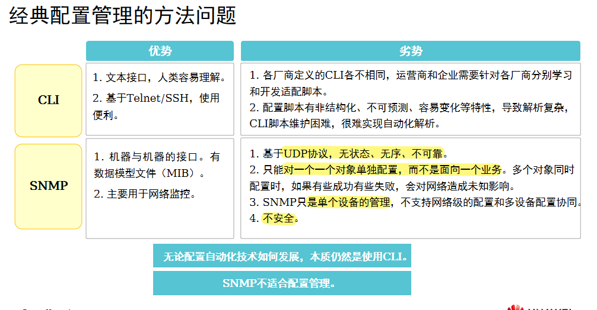

## NETCONF 协议（网络配置协议）
```
提供了一套管理网络设备的机制

NETCONF有三个对象
    - NETCONF 客户端
    - NETCONF 服务端
    - NETCONF 消息
```
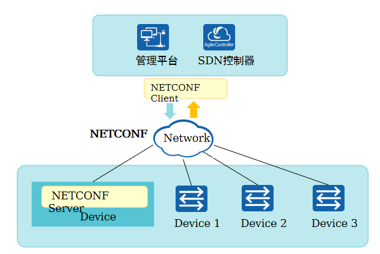

### NETCONF 协议框架
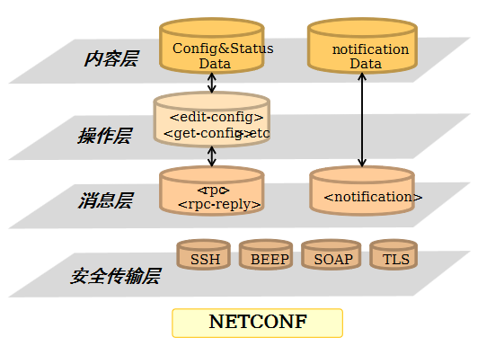
```
NETCONF 协议在概念上可以分为4层：
    1. 安全传输层
        - 为客户端 和 服务器之间建立通讯路径
        - 华为使用 ssh，作为NETCONF的承载协议
    2. 消息层
        - 提供一种简单的不依赖传输协议层的 RPC请求 和 回应机制
    3. 操作层
        - 定义一组基本操作，作为RPC的调用方法
        - 这些操作组成了 NETCONF基本能力
    4. 内容层
        - 描述了网络管理所涉及的配置数据，而这些数据依赖于各种制造商
```

#### XML 编码
```
NETCONF 使用 XML 的编码格式
```
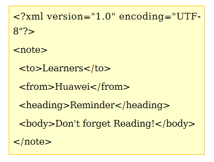
```
XML 编码格式文件头：
其中:
    <? : 
        表示一条指令的开始
    
    xml :
        表示此文件是 XML文件
    
    ?> :
        表示一条指令的结束
```

#### NETCONF传输层与消息层
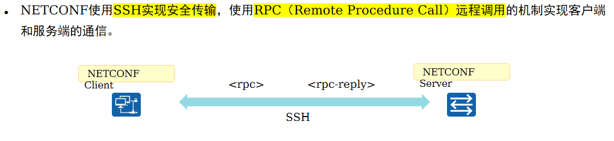
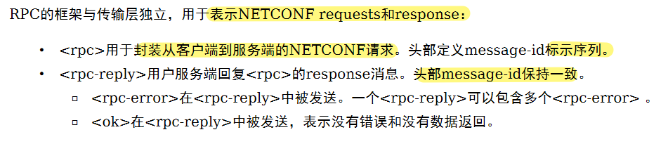

#### NETCONF 操作层 
##### NETCONF 基本操作
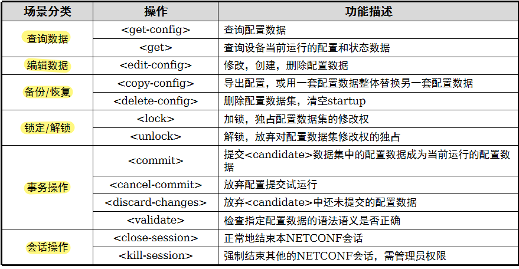

##### NETCONF 操作对象
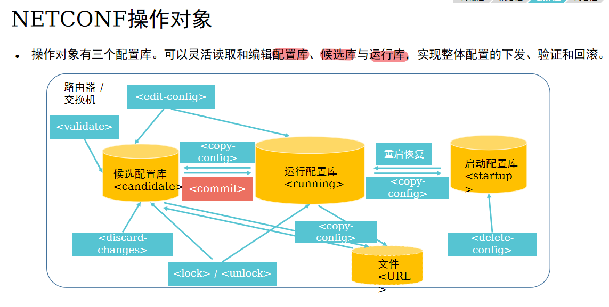

##### 案例： 下发VLAN
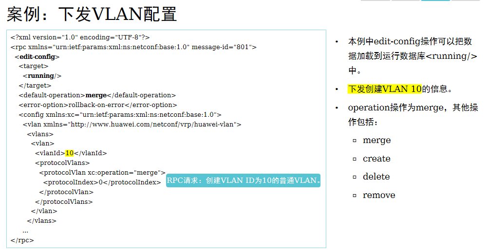
```
<config>中可能包含可选的“operation”属性，用来给配置数据指定操作类型。
    - 如果未携带“operation”属性，则默认为merge操作。
    - Operation取值如下：
        - merge：
            - 在数据库中修改存在或不存在的目标数据，
            - 如果目标数据不存在则创建，
            - 如果目标数据存在则修改。这是默认操作。
        - create：
            - 当且仅当配置数据库中 不存在待创建 的配置数据时，才能成功添加到配置数据库。
            - 如果配置数据存在，
                - 则会返回<rpc-error>，其中包含一个<error-tag>值“data-exists”。
        - delete：
            - 删除配置数据库中指定的配置数据记录。
            - 如果数据存在，则删除该数据，
            - 如果数据不存在，则返回<rpc-error>，其中包含一个<error-tag>值“data-missing”。
        - remove：
            - 删除配置数据库中指定的配置数据记录。
            - 如果数据存在，则删除该数据，
            - 如果数据不存在，则返回成功。
```

#### NETCONF 内容层
```
NETCONF当前有两种建模语言，Schema和YANG：
    - Schema
        - 是为了描述XML文档而定义的一套规则。
        - Schema文件中定义了设备所有管理对象，以及管理对象的层次关系、读写属性和约束条件。
    - YANG
        - 是专门为NETCONF协议设计的数据建模语言，
        - 用来为NETCONF协议设计可操作的配置数据、状态数据模型、远程调用（RPCs）模型和通知机制等。
```
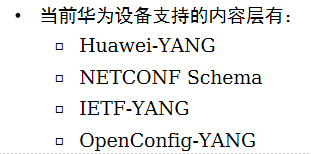

##### 案例 （HUAWEI YANG）
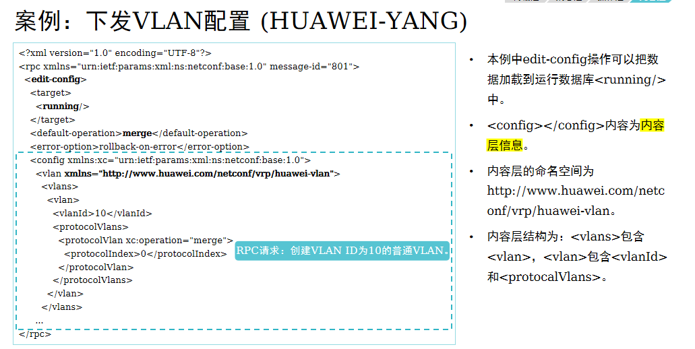

##### 案例 （Schema）
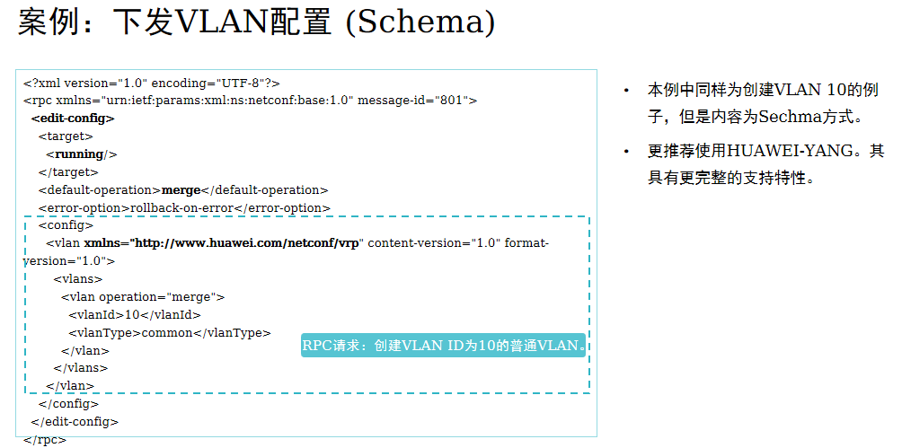

#### 配置命令
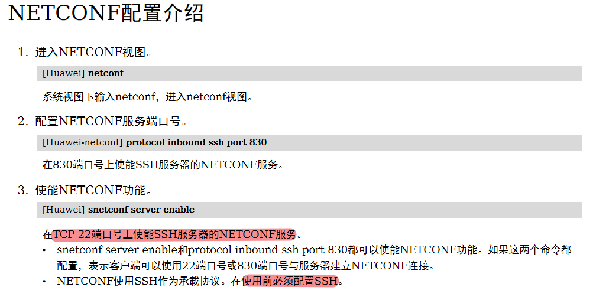

## YANG
```
YANG起源于NETCONF，但不仅用于NETCONF。
    - 虽然统一了YANG建模语言，但是YANG文件没有统一。

YANG文件可以简单分为三类：
    - 厂家私有YANG文件，
    - IETF标准YANG
    - OpenConfig YANG。

NETCONF协议中的 
    - Config&Status Data
    - Notification Data
    - 底层的RPC的消息
    - 都可以通过YANG模型来建模实现。

YANG 的模型文件可以通过工具转换到对应格式的XML/JSON文件，
    - 被最终的NETCONF/RESTCONF消息封装。
```
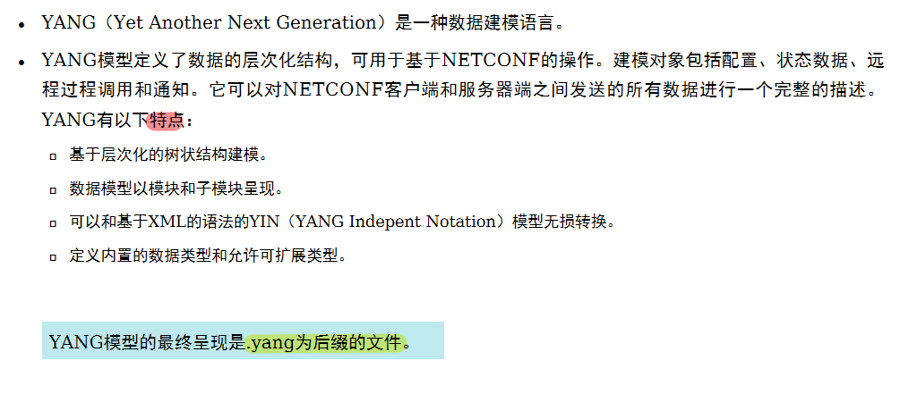

### Module （YANG 中定义的模块）
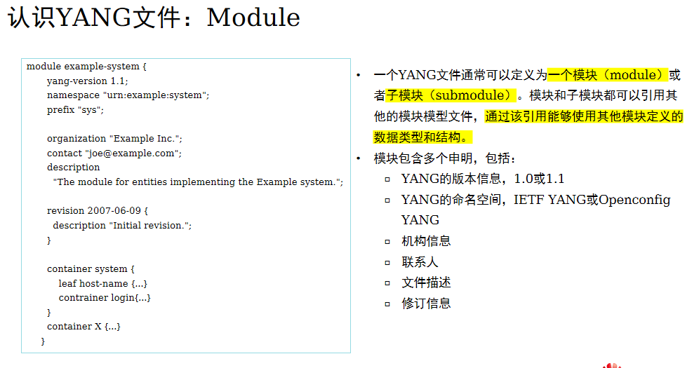

### Leaf Node （YANG 中定义的一个简单指定类型的变量）
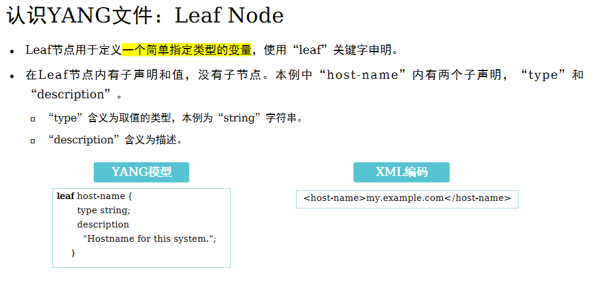

### Leaf List （YANG 中定义一个数组类型变量）
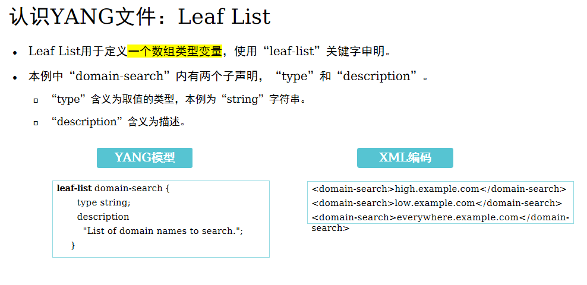

### Leaf Node （YANG 中定义一个更高层次的数据节点）
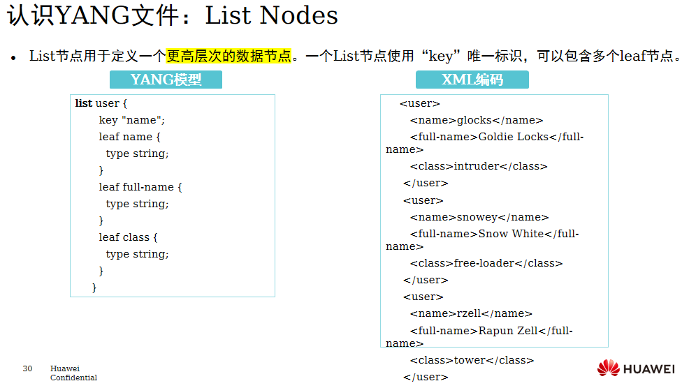

### Container Nodes （YANG 中定义更大范围的数据集合）
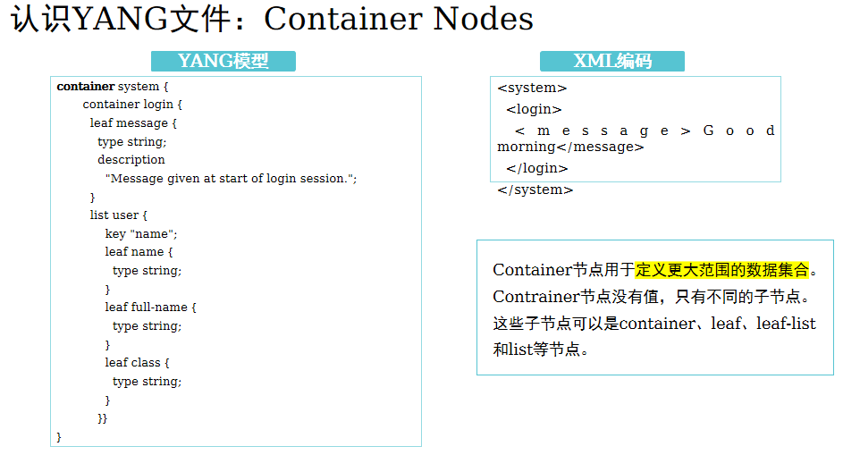

### Grouping （YANG 中用于定义可以重复使用的节点）
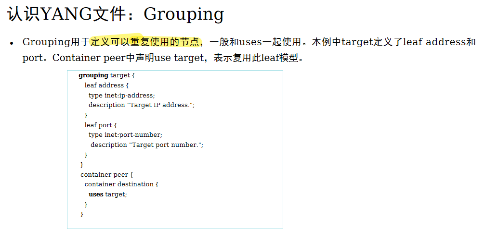

### 配置数据 和 状态数据
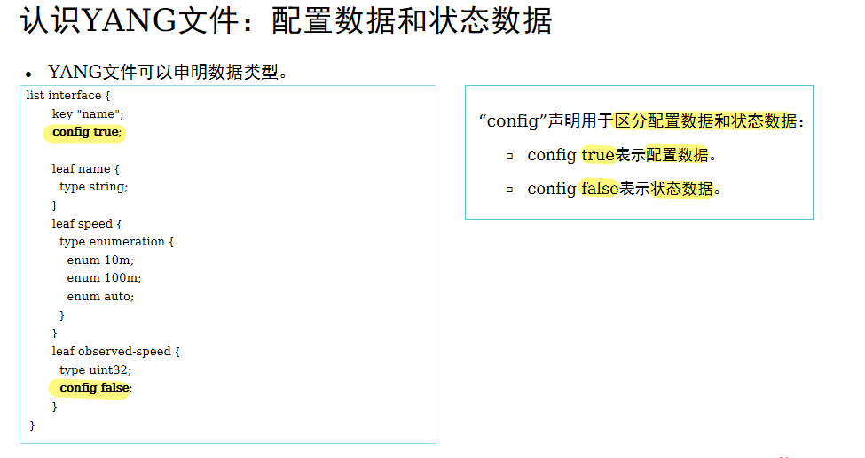

### YANG 支持的数据类型
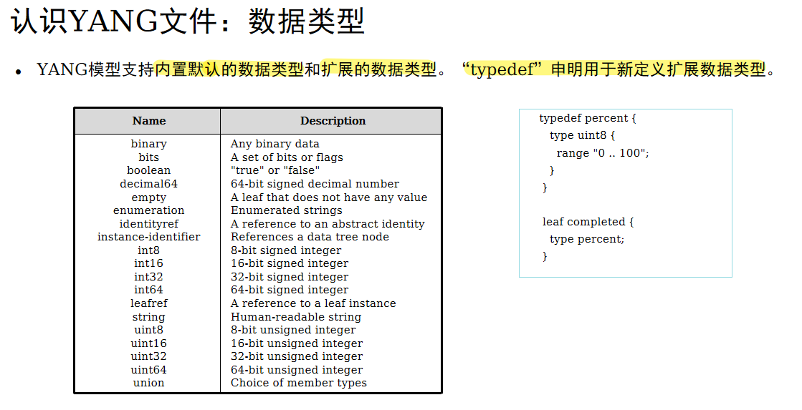

# F&Q 如何加载 YANG 文件
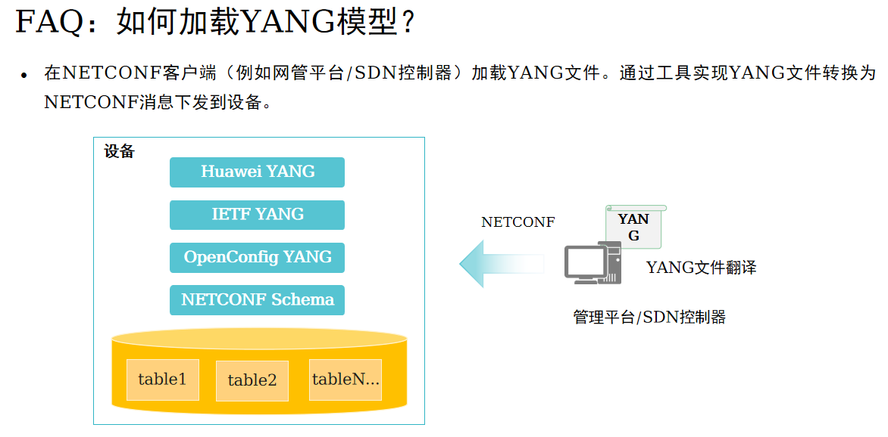


# 配置
```
NETCONF 主机配置
1、创建账户
	aaa
	local-user netconf password irreversible-cipher Huawei@123
 	local-user netconf service-type ssh（真实设备修改为 api）
 	local-user netconf level 3

2、开启 SNETCONF 服务
	snetconf server enable								// 开启 snetconf 服务
		
	ssh user netconf
	ssh user netconf authentication-type password
	ssh user netconf service-type all						// 包含 stelnet、sftp、snetconf

3、开启 NETCONF 服务
	netconf											// 进入 netconf 视图
 	protocol inbound ssh ipv4 port 830					// 使用 SSH 接入，端口号：830

4、支持 SSH 登录
	user-interface vty 0 4
 	authentication-mode aaa
 	protocol inbound ssh		


Python代码：
from ncclient import manager

host = '10.1.1.1'
port = 830
user = 'netconf'
password = 'Huawei@123'


def huawei_connect(host, port, user, password):
    return manager.connect(host=host, port=port, username=user, password=password, hostkey_verify=False,
                           device_params={'name': "huawei"}, allow_agent=False, look_for_keys=False)
print('连接成功')


CREATE_INTERFACE = """
    <config>
      <!--将以太网接口从二层模式切换到三层模式-->
      <ethernet xmlns="http://www.huawei.com/netconf/vrp" content-version="1.0" format-version="1.0">
        <ethernetIfs>
          <ethernetIf operation="merge">
            <ifName>GE1/0/1</ifName>
            <l2Enable>disable</l2Enable>
          </ethernetIf>
        </ethernetIfs>
      </ethernet>
      <!--配置接口的描述信息和IP地址-->
      <ifm xmlns="http://www.huawei.com/netconf/vrp" content-version="1.0" format-version="1.0">
        <interfaces>
          <interface operation="merge">
            <ifName>GE1/0/1</ifName>
            <ifDescr>Config by NETCONF</ifDescr>
            <ifmAm4>
              <am4CfgAddrs>
                <am4CfgAddr operation="create">
                  <subnetMask>255.255.255.0</subnetMask>
                  <addrType>main</addrType>
                  <ifIpAddr>192.168.10.10</ifIpAddr>
                </am4CfgAddr>
              </am4CfgAddrs>
            </ifmAm4>
          </interface>
        </interfaces>
      </ifm>
    </config>
"""


m = huawei_connect(host, port, user, password) #建立NETCONF连接
m.edit_config(target='running', config=CREATE_INTERFACE) #下发XML数据、配置接口IP地址

```