# 一、Qos
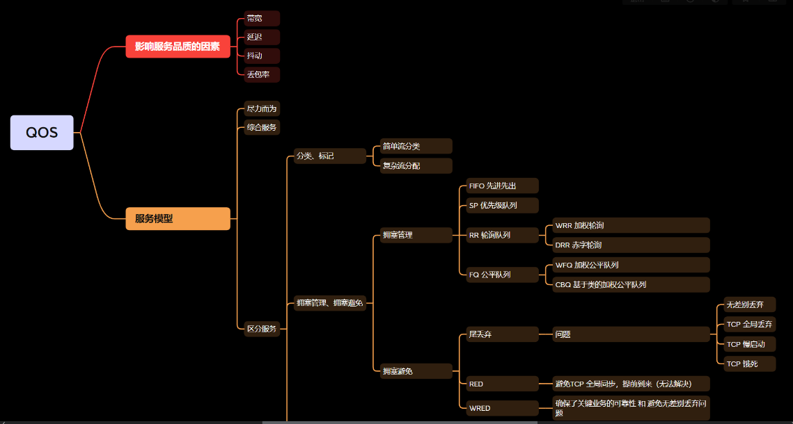

## 影响服务品质因素
### 1. 带宽：
```
传输带宽，一般是只 1s 内能够传输的数据量大小（100Mpbs）

越大越好，带宽越大实时传输的数据流量就越多
```
### 2. 延迟：
```
数据包完成一次往返的时间（设备处理时延、串行化时延、传输时延等）

延迟越短越好，代表实时传输的速率越快
```

### 3. 抖动：
```
持续的数据流，往返的时间不一（一会延迟小、一会延迟大，不稳定）

最低延迟和最高延迟之差越大，就证明抖动越明显
```

### 4. 丢包率：
```
丢包（代表网络传输中数据包可能无法到达目的地，或者没有响应）
是对网络品质影响最大的因素

丢包率越低，网络越稳定
```

### 如何提高网络品质
```
1、提升带宽（可以使用链路聚合提升传输带宽、替换设备和线缆）
2、使用 QOS 对流量进行分类处理
3、进行合理的流量调优等
```

# 二、服务模型
## 1、尽量而为
```
对待流量处理方式最为简单（采用：先进先出）方式转发数据包，不做特殊处理
	优点：
        处理机制简单，不占用额外延迟
	缺点：
        对特殊流量或关键业务的服务品质，无法得到保障
```
## 2、综合服务
```
使用 RSVP 协议(资源预留协议, Resource Reservation Protocol)
对特定的业务进行带宽的预留，保障关键业务的服务品质

（传输路径上的所有设备都需要运行 RSVP 和 MPLS TE 建立带宽预留的隧道）
	优点：
        保障关键业务的服务品质
	缺点：
        对非关键业务，服务品质无法保障
		（同时会带来带宽的浪费，
        如：关键业务的流量没有占满预留的带宽资源，
        其他服务也无法使用该带宽）
```

## 3、区分服务
```	
对不同的流量进行分类和打标记，不同标记的流量得到相应的处理方式
（如：语音流量优先转发、文件传输流量对带宽和可靠性进行保障等）
	优点：
        可以对不同的流量进行分类和标记，
        对特定的流量和关键业务都可以进行标识处理
	缺点：
        配置复制，需要管理员对流量进行合理规划处理
```

### 区分服务模型
#### 一、分类、标记
##### 1、简单流分类：基于报文自身 QOS 优先级进行分类的方式
```
数据链路层（使用 802.1p 进行分类，VLAN 字段）3bit 取值范围：0—7

	MPLS（使用 exp 位进行分类）3bit 取值范围：0—7

网络层（使用 Tos 字段进行分类，8 bit 但没有完全使用，可以分为两类）
	1. IPP（IP 优先级）只占用高位 3bit（取值范围：0—7）

	2. DSCP（目的服务代码点）是对 IPP 字段进行了扩充（延迟、可靠性和吞吐量）占用 6bit（取值范围：0—63）
	补充：DSCP 目前有定义的只有 21 种，结合 PHB（逐跳行为）来进行分类

		EF：快速转发（加速转发）

		AF：确保转发
		    AF 的 X 和 Y（分别代表转发优先级和丢弃优先级）
			AF13		// 1 代表转发优先级、3 代表丢弃优先级
									
            AF41、AF42、AF43
            AF31、AF32、AF33
            AF21、AF22、AF23
            AF11、AF12、AF13

        CS：类选择器（1—7）用于兼容 IP 优先级

        BE：尽力而为（CS0）

        网络设备一般会按照以下的优先级对业务进行分类
            优先级7（CS7）：
                - 一般是监管协议流量，
                - 如：
                    - BFD、SNMP 这类型的监管协议
                     （优先级最高，最优先转发）
            优先级6（CS6）：
                - 一般用于知名网络协议（路由器协议）
                - 如：OSPF、BGP 等
            优先级5（EF、CS5）：
                - 一般用于语音流量，对延迟要求较高的业务
            优先级4（AF4、CS4）：
                - 一般用于语音信令流量
                - （或者是电信级业务）
            优先级3（AF3、CS3）：
                - 直播视频流量（IPTV）
            优先级2（AF2、CS2）：
                - 缓存视频流量
            优先级1（AF1、CS1）：
                - 邮件系统、上网流量和 FTP 等
            优先级0（BE）：
                - 没有分类的流量，都默认为 BE 等级

优点：
    基于报文自身优先级进行分类，分类的方式简单
    （基于带宽的速率、接口等方式自行分类即可，
        知名协议流量也会自动进行分类）
缺点：
    相同协议类型，但不同的客户无法进行精确划分
```

##### 2、复杂流分类
```
可以基于 5 元组进行分类
    （源 IP、目的 IP、协议号、源端口号、目的端口号）
    还可以基于 报文优先级 和 接口 进行分类

	优点：
        可以根据不同类型的报文进行精确分类
	缺点：
        需要结合 ACL、MQC 等工具进行匹配
```

###### 方式一
```
配置命令：（使用 MQC 工具）
    acl 2000  									// 匹配流量
    rule 5 permit source 192.168.1.0 0.0.0.255		// 匹配源地址为：192.168.1.0/24 网段的流量		

    traffic classifier OA 							// 创建流分类：OA
    if-match acl 2000							// 匹配 OA 流量（192.168.1.0/24）

    traffic behavior AF11						// 创建流行为：AF11
    remark dscp af11							// 重标记，把优先级修改为：AF11

    traffic policy OA
    classifier OA behavior AF11					// 把 OA 流量的优先级重标记为 AF11

    interface G0/0/X
    traffic-policy OA inbound					// 只要从 G0/0/X 接口进入的 192.168.1.0/24 流量都会把优先级修改为 AF11
```

##### 方式二
```
配置命令：
    interface G0/0/X
    trust dscp  override 							// 信任 DSCP 优先级（允许替换优先级）

    qos map-table dscp-dscp 						// 进入 Qos 映射模板（DSCP-DSCP 模式）
    input  0 output 10								// 进入的为 BE 流量，出去时修改为 AF11 流量
```

#### 二、拥塞管理、拥塞避免
##### 1、拥塞管理：当队列发生拥塞时，会根据不同的调度机制对流量进行差分服务
###### 1. 先进先出队列（FIFO）：对进入队列的流量不做分类，先进先出
```
（缺省模式）				
优点：
    处理机制简单，无需占用额外的处理时延
缺点：
    对关键业务和紧急流量的服务品质都无法得到保障
```	

###### 2.优先级队列（SP）：严格按照队列的优先级进行转发，高优先级队列会先获得调度的机会
```
优点：
    对关键业务和紧急流量（或优先级高的业务）都可以很好的保障服务品质
缺点：
    低优先级的流量可能会出现 "饿死" 现象（一直无法转发）

队列等级：
    高、中、正常、低（4个等级）
	没有队列等级则按照报文优先级进行处理
```


###### 3. RR（轮询队列）：每个队列都有调度的机会，轮询转发

###### WRR（加权轮询）在轮询调度的基础上，为队列加入权重值（权重值越高，调度的机会就越多）
```
根据权重值来进行转发，
    - 权重值为正数（则可以调度数据包），
    - 0（则无法调度数据包）

每个队列调度一个报文，权重值依次减一，
    所有队列的权重均为 0 时，开启新的一轮调度

优点：
    - 保障了每个队列都有调度的机会，
    - 且权重值高的队列能够获得更多的调度机会
缺点：
    - 不公平，紧急流量也无法得到及时转发
    -（只考虑了数据包的个数，没有考虑长度，所以不公平）
    -（如果紧急流量的队列，权重值已经消耗完，则需要等待下一轮才能进行转发）
```					
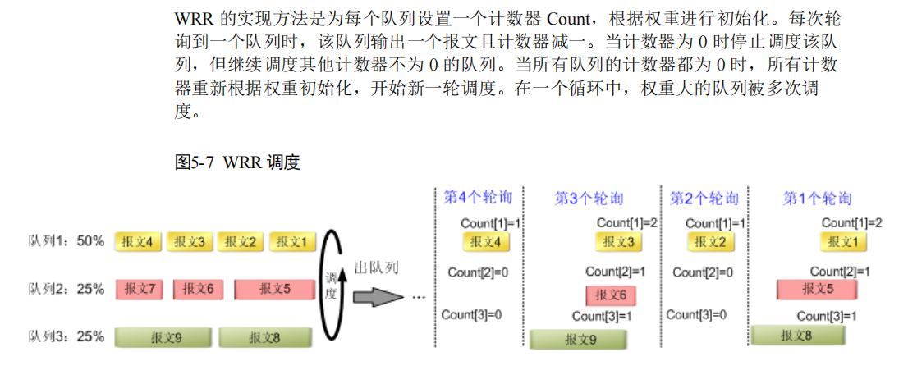

###### DRR（赤字轮询）在 WRR 的基础上，考虑了数据包的长度，使其转发时更加公平
```
以参考带宽除以权重值，瓜分接口带宽
    - （权重值越高，获得的带宽越多，调度的机会也越多）

参考带宽 + 赤字值来判断报文是否能够参与转发（赤字值小于等于 0 时，无法转发）

赤字值减去报文大小，
    - 如果剩余的赤字值为 0 或者负数，
        - 则下一轮不转发，
    - 否则可以继续转发

优点：
    - 保障每个队列都获得调度的机会，
    - 权重值越高获得的调度机会也越多，
    - 同时兼顾了数据包的长度
缺点：
    - 紧急流量无法得到保障，轮询调度
```
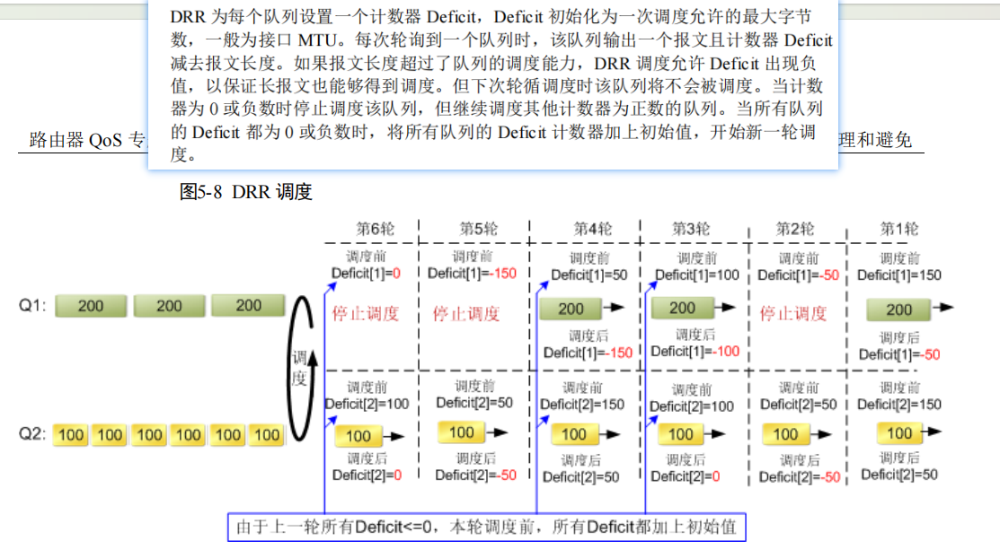

###### FQ（公平队列）每个队列都能获得调度机会，会把流量划分为小粒度的方式进行转发（如：bit 流）

```
每个队列都有报文时，长度短的会优先转发完成
（把每个队列的总体延迟降到最低，抖动也可以随着降低）
```
###### 4. WFQ（加权公平队列）在 FQ 基础上，加入权重值，可以设置部分队列能够获得更多的调度机会
```
接口带宽根据队列的权重值公平瓜分，
    - 权重值越高获得的带宽也越多，
    - 报文越小转发时间越短（越优先转发完成）
    - 优先级高，报文小则转发时延越低

优点：
    - 公平处理，延迟和抖动较小
缺点：
    - 紧急流量无法得到保障，需要配合 PQ 使用，
    - 根据报文优先级进入队列无法认为修改报文进入的流量队列

补充：
无论以上哪一种队列都会有各自的优缺点，所以能够结合调度
    
如：PQ + WRR、PQ + WFQ、PQ + DRR 组合
    （例如：PQ 是队列 6 to 7，并且设置最大的带宽为 30%）
        其余队列使用 WFQ 或 DRR 瓜分剩余接口带宽
        优点：
            - 既可以保障紧急业务能够快速得到转发，
            - 又可以避免低优先级队列出现 "饿死" 现象
        缺点：
            - 进入队列的流量均为根据优先级进行划分的流量，
            - 无法人工定义流量或定义进入的队列
```
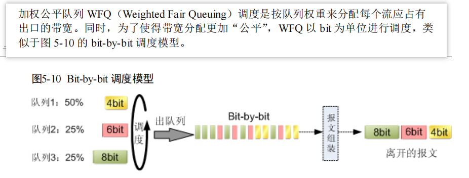

###### 5. CBQ（基于类的加权公平队列）是 WFQ 的扩展，可以基于类进行流量划分（复杂流分类）
```
可以把流量划入 EF、AF、BE 队列等（*特殊队列 LLQ）

- EF 空闲时可以占用 AF 和 BE 带宽，
    - 非空闲时按照设定带宽转发（适合于优先转发的紧急业务）
- AF 空闲时可以占用 AF 总体带宽
    - （AF 队列可以按权重瓜分剩余的 AF 队列带宽），
    - 非空闲时按照各自的 AF 队列带宽转发
- BE 没有划分队列的流量，
    - 默认进入 BE（BE 采用 WFQ 方式进行转发）

优点：
    - 可以根据用户需求定义转发队列，
    - 确保紧急流量、特殊流量的服务品质
缺点：
    - 配置较为复杂，不易于扩展	
```					
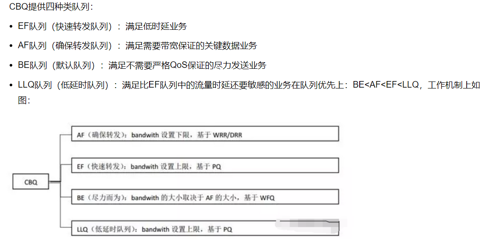

###### 配置命令：（简单流调度方式）
```
前提条件（已经完成了流分类，流量已经进入到各自的队列中）

qos queue-profile 1						// 创建队列模板，名称：1					
schedule wfq 0 to 7							// 队列 0 — 7 使用 WFQ 方式进行调度
queue 6 to 7 weight 20						// 其中（队列 6 和 7 的权重值为：20）其余默认为：10	（瓜分接口 1000M 带宽）
											0—5 带宽为（100M）6 和 7 带宽为（200M）

interface G0/0/X
qos queue-profile 1						// 针对从 G0/0/X 接收并缓存的流量生效
————————————————————————————————————————————————————————
也可以配合 PQ 使用，例如
qos queue-profile 2						// 创建队列模板：名称：2
schedule wfq 0 to 5 pq 6 to 7					// 队列 0 — 5 采用 WFQ 转发，6—7 采用 PQ 转发
queue 6 to 7 gts cir 204800 cbs 5120000		// 队列 6 到 7 分别获得的带宽为 200M（kbit/s）		

interface G0/0/X
qos queue-profile 2						// 针对从 G0/0/X 接收并缓存的流量生效

队列 6 和队列 7 的流量会优先转发，但为了防止低优先级的队列无法转发流量，则限定队列 6 和 7 的带宽为（200M）
其余队列按照权重值瓜分剩余接口的带宽（默认权重值为：10）
既保障了低延迟的流量，又避免了 "饿死" 现象
————————————————————————————————————————————————————————
```
###### （复杂流分类方式）
```
使用 MQC 工具配置
假设：ACL 已经匹配好相应的流量

流分类
traffic classifier RD 							// 第一步（使用流分类，匹配好对应的 ACL 和流量）
 if-match acl 3000

traffic classifier OA 
 if-match acl 3001

traffic classifier FR 
 if-match acl 3002
—————————
流行为
traffic behavior RD							// 第二步（使用流行为，定义流量需要进入的队列和占用的带宽）
 queue ef bandwidth pct 20					// EF 队列，带宽（20%）

traffic behavior OA
 queue af bandwidth pct 30					// AF 队列，带宽（30%）

traffic behavior FR							
 queue llq bandwidth pct 10					// LLQ 队列（特殊的 EF，延迟更低）带宽（10%）

traffic behavior BE							
 queue wfq								// BE 队列（默认采用 WFQ 转发）
—————————
流策略
traffic policy IN							// 第三步（使用流策略，绑定流分类和行为）
 classifier RD behavior RD
 classifier OA behavior OA
 classifier FR behavior FR
 classifier default-class behavior BE			// 剩余的缺省流量，都进入 BE 队列
—————————
调用流量策略
	interface G0/0/X
	traffic-policy IN inbound				// G0/0/X 接口执行策略（收到的流量都会按照以上绑定信息进行划分）
										流量大小不能超过接口带宽（百分比则不能大于 100%）
```
	
##### 2、拥塞避免：当队列无法缓存流量时（或发生拥塞比较严重时）会对缓存流量进行丢弃处理

###### ① 尾丢弃：当设备的硬件队列和软件队列都已经无法存放数据包时，则后续接收的所有流量都会被丢弃，以此来缓解拥塞的加剧
```
问题：
一、无差别丢弃：
    - 对尾丢弃的流量不做分类，
    - 会导致紧急流量或关键流量被丢弃
    - （非关键流量可能会被转发）

二、TCP 全局同步：
    - TCP 流量被丢包后会通过重传机制来确保可靠性
    - 如果有多个 TCP 流量持续发生，当发生拥塞时
        - （转发阈值时，则会同时丢包）
    - 同时丢包意味着会同时缩减窗口
        - （把流量释放，从 0 开始增长）到达封装后，又重新丢包回到初始值
    - 该现象会周而复始，多个 TCP 流量同时减少，
        - 同时增长和丢包（称为 TCP 的全局同步）
```
###### TCP 全局同步的原因
```
怎么会产生TCP全局同步？
    当大量TCP 报文丢弃后会造成重连接，导致TCP慢启动（滑动窗口的大小值初始值慢慢增加）
        - TCP 确认包由于拥塞被丢弃，导致发送方收不到TCP确认，
            - 认为是网络故障
            - 于是将TCP 窗口 大小减小，导致整体流量减少
        - 流量减少，拥塞消除，当流量越来越大时，队列满了进行尾丢弃，
            - 又会进行重连接，周而复始
```
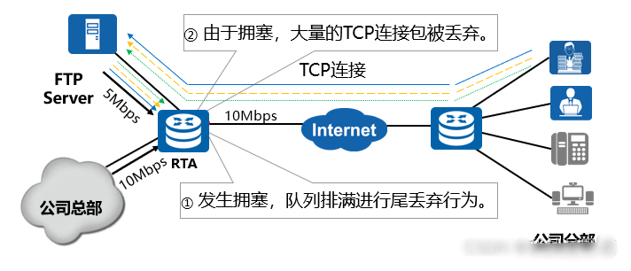
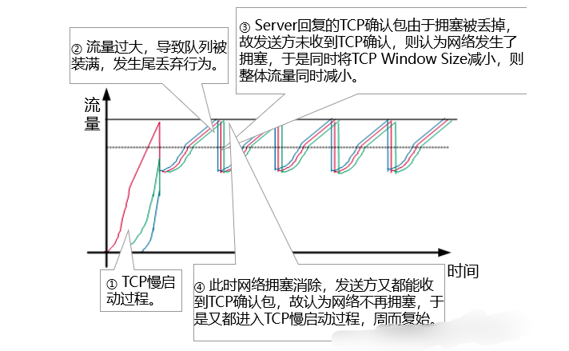
```
三、慢启动：
    - TCP 检查到拥塞时，会降低发生窗口值
        - （如：2 的 0 次方）当拥塞减缓时，则会逐步恢复发生窗口
            - （从 0 次方逐步递增，直至恢复原有窗口）
        - 当 TCP 发生全局同步时，该慢启动的现象会周期性进行
            - （导致 TCP 流量抖动较大）

四、TCP 饿死：
    - 如果网络中存在 TCP 和 UDP 的流量，
        - TCP 会减少发送窗口（同时会进行重传）
        - UDP 不会减少窗口值，也不会重传
            - （只要有空闲带宽就会转发）如果 TCP 流量持续拥塞，则 UDP 会占用原有 TCP 的带宽
            - 导致 TCP 拥塞加剧，甚至 "饿死"（TCP 流量得不到转发）
```
###### ② RED（早期随机检查）可以设定阈值
```
1. 小于等于低门限时，均可以转发
2. 大于低门限，小于等于高门限时，随机丢弃
    -（根据设置的丢弃阈值来执行）
3. 大于高门限，则全部丢弃

优点：
    - 避免 TCP 全局同步的提前到来，
    - 但无法解决该问题
    - （如果拥塞持续加剧还是会出现全局同步现象）
缺点：
    - 无法根据报文优先级进行划分
```
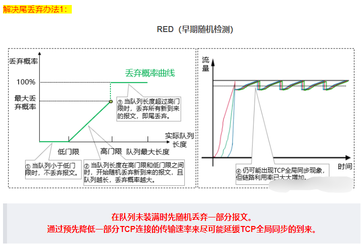

###### WRED（加权早期随机检查）：加入权重值（根据报文优先级来进行丢弃处理）
```
如：AF11 的流量在带宽占用率小于等于 30% 时，
    可以全部转发；大于 30% 到小于等于 50% 之间，会随机丢弃 50% 流量
    
    （补充：30%—50% 中的二分之一）如果是大于 50% 的流量，则全部丢弃

    dscp af11 low-limit 30 high-limit 50 discard-percentage 50

如：EF 的流量在带宽占用率小于等于 60% 时，可以全部转发；
    大于 60% 到小于等于 80% 之间，会随机丢弃 33% 流量
    
    （补充：60%—80% 中的三分之一）如果是大于 80% 的流量，则全部丢弃
    
    dscp ef low-limit 60 high-limit 80 discard-percentage 33

可以实现 高优先级的流量 比 低优先级的流量 可以获得更多的缓存空间，
    - 使得低优先级的流量优先丢弃
    - （避免抢占缓存空间和带宽）

优点：
    确保了关键业务的可靠性和避免的无差别丢弃的问题
缺点：
    需要指定设备配置，不易于扩展
```
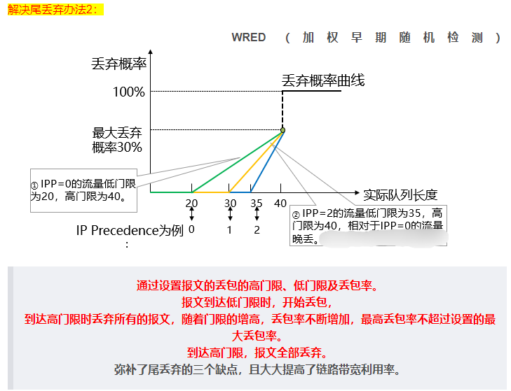
 
		
# 三、流量的限速技术
```
如果对接入的用户不加以管理，则网络容易出现带宽被抢占和拥塞的现象，所以得对接入用户的速率进行限制
```
## 1、令牌桶：测速工具
		
### 1. 单桶单速双色标记法
|||
|:-:|:-:|
|CBS | 承载突发尺寸（C 桶）     |
|B   | 报文大小（单位：字节）   |
|CIR  |  承诺信息速率          |
|Tc   | 当前时刻的 C 桶令牌容量 | 
```
1. 当 Tc >= B 的时候， B 取走令牌，
    - 并且标记为绿色
    - （这部分为 CIR（承诺信息速率）的流量）
2. 当 Tc < B 的时候，B 无法取走令牌，
    - 则标记为红色
    - （这部分流量为超额流量）

（补充：令牌桶无法对报文进行处理，丢弃或者转发等操作，根据限速工具执行）

作用：
    测速，判断流量符合标准（不允许突发，不允许额外流量）
```
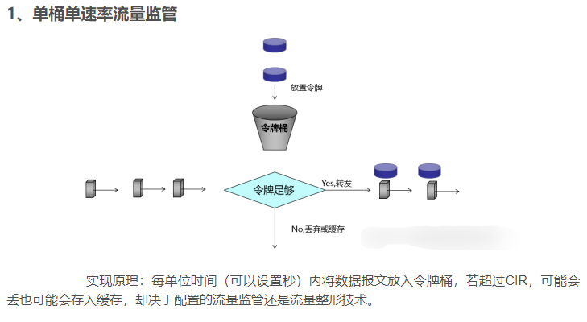
		
### 2. 双桶单速三色标记法
|||
|:-:|:-:|
| CBS | 承载突发尺寸（C 桶）				|
| B | 报文大小（单位：字节）|
| CIR | 承诺信息速率					|
| Tc | 当前时刻的 C 桶令牌容量				|
| EBS | 超额突发尺寸（E 桶）：没有令牌，只能缓存 C 桶溢出的令牌|
| Te  |  当前时刻的 E 桶令牌容量|
```
1. 当 Tc >= B 的时候， B 取走令牌，
    - 并且标记为绿色
    - （这部分为 承诺信息速率的流量）; 
    - Te 令牌无需减少
2. 当 Tc < B 的时候，则会查看 Te 是否大于 B，
    - 如果是（Te >= B）则取走 Te 令牌，
    -标记为：黄色（这部分为 超额突发流量）

3. 当 Tc < B，Te < B 是，
    - 则无法取走任意令牌，
    - 标记为：红色

（补充：Tc 和 Te 无法叠加使用，只会单独比较）

作用：
    测速，并且可以允许少量的突发流量
    （但突发流量不稳定，需要 C 桶溢出）
```
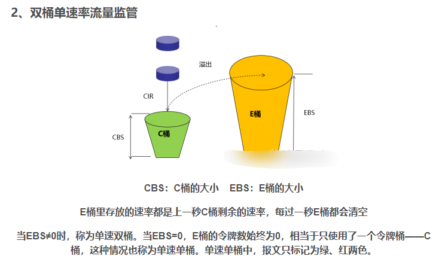

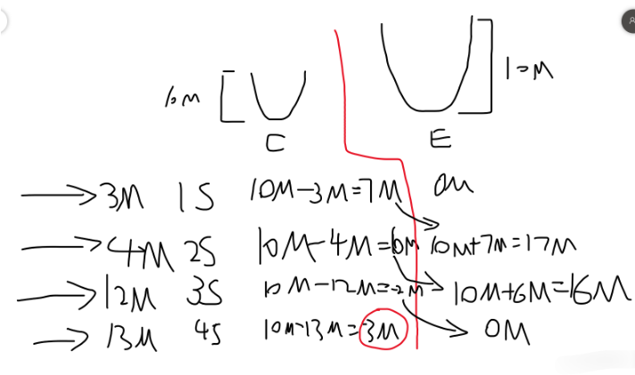
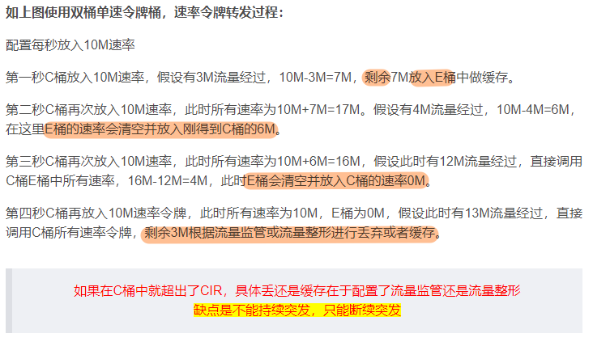

### 3. 双桶双速三色标记法
|||
|:-:|:-:|
|CBS | 承载突发尺寸（C 桶）				|
|B | 报文大小（单位：字节）|
|CIR | 承诺信息速率									|
|Tc | 当前时刻的 C 桶令牌容量				|
|PBS | 峰值突发尺寸（P 桶）|
|PIR | 峰值信息速率|
|Tp  |  当前时刻的 P 桶令牌容量|
```
（每秒 C 桶以 CIR 速率往桶内注入令牌，P 桶也会以 PIR 速率往 P 桶注入令牌，分开计算）
    * P 桶必须大于等于 C 桶，不能小于 C 桶

数据包到达设备后，会先进行 P 桶的比较，再进行 C 桶比较（P 桶为峰值）
1. 当 Tp >= B , Tc >= B 时，
    - 会取走两个令牌桶中的令牌，
    - 并且标记为：绿色（承诺流量）

2. 当 Tp >= B , Tc < B 时，
    - 则只会取走 P 桶令牌，
    - 并且标记为：黄色（突发流量）

3. 当 Tp < B 时，
    - 无需比较 C 桶，
    - 标记为：红色（超出峰值的流量）


补充：
    - 流量整形、限速均使用
        - （单桶单速双色标记法）
    - 流量监管使用
        - （双桶单速三色标记法、双桶双速三色标记法）
```
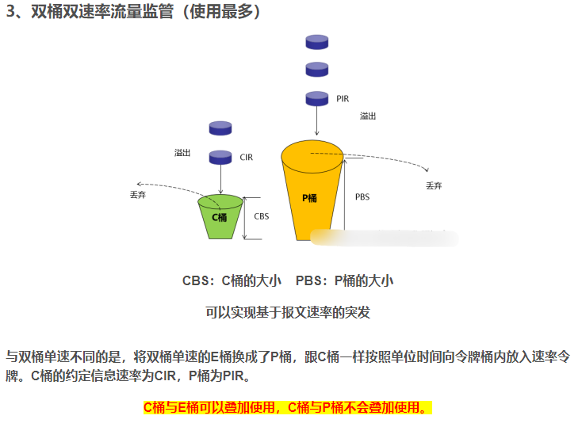
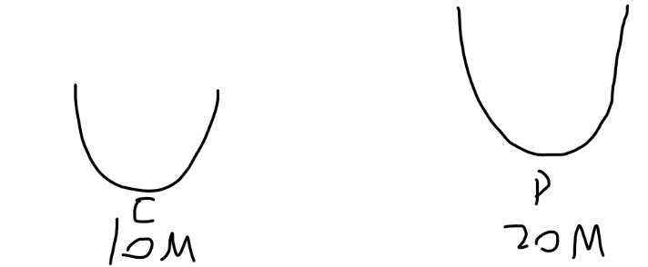
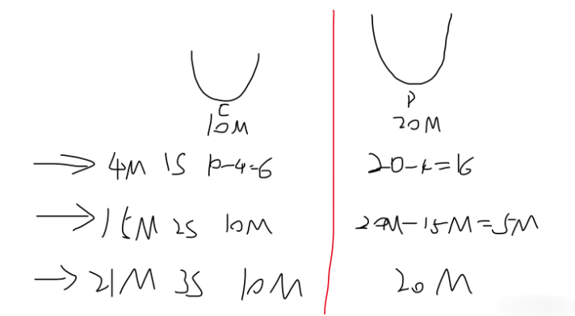
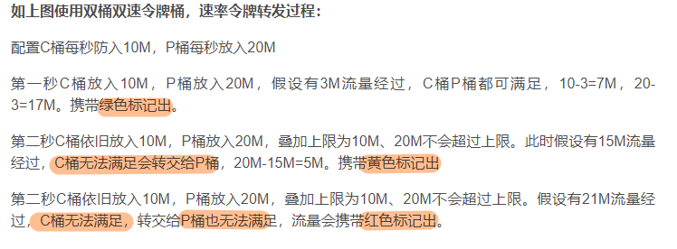

## 2、流量限速技术
### 1. 流量整形：
```
在流量的 出方向使用（入方向无效）对符合速率的流量进行转发，
    超额流量先进行缓存（如果无法缓存，则丢弃处理）
    优点：
        - 减少数据丢包，削峰填谷
        - （使得流量更加平缓，减少抖动）
    缺点：
        - 引入额外的延迟和存储空间
```
#### 整形的分类
---
#### 1、接口整形：针对物理接口、子接口等（经过该接口的流量生效， 不做分类）
```
配置命令：
interface G0/0/2
// 设置从 G0/0/2 接口发出的流量，带宽为 20M（CBS 无需添加）
qos gts cir 20480 cbs 512000						
```
#### 2、队列整形：基于简单流分类，根据流量队列进行整形
```
配置命令：
// 创建队列模板，名称：3
qos queue-profile 3							
// 队列 0 到 5 速率为：10M
queue 0 to 5 gts cir 10240 cbs 256000				
// 队列 6 到 7 速率为：20M
queue 6 to 7 gts cir 20480 cbs 512000				
（可以根据优先级进入队列后，针对不同优先级的流量进行整形）

interface G0/0/X
// 针对 X 接口的出方向流量生效
qos queue-profile 3 							
```
#### 3、基于类的流量整形（CBTS）：基于复杂流分类，对不同的业务或者用户进行流量整形
```
traffic classifier GTS 
if-match acl 3000

traffic behavior GTS
// 针对特定的流量（ACL 3000）分配带宽为：10M
gts cir 10240 cbs 256000 queue-length 1			

traffic policy GTS
classifier GTS behavior GTS

interface G0/0/X
// 只针对出方向流量生效（inbound 会报错）
traffic-policy GTS outbound						
```
	
						
### 2. 流量监管：在出入方向均可使用，对符合速率的流量进行转发，突发流量可以转发并进行重标记，不符合速率的流量可以选择丢弃
```
优点：
    支持重标记，不引入额外延迟
缺点：
    - 无法缓存数据包，会丢弃流量
    - （可能会导致网络抖动，如：TCP 重传等）
```
#### 监管的分类
---
#### 1、基于接口：针对进入接口或者出去接口的流量生效（对流量不做分类）
```
配置命令：
interface G0/0/X
qos car inbound / outbound

（后续配置： 
qos car inbound cir 51200 pir 56320 green pass remark-dscp ef yellow pass remark-dscp default red discard）

针对进入到 G0/0/X 接口的流量，符合速率（绿色）标记为 EF 转发，突发流量（黄色）标记为 BE 转发，超额流量（红色）则丢弃
（配置了 CIR 和 PIR 为双桶双速三色标记法）

（后续配置： 
qos car inbound cir 51200 green pass remark-dscp ef yellow pass remark-dscp default red discard）
（只配置了 CIR 为双桶单速三色标记法）PBS 就等于 EBS
```

#### 2、基于类的配置：针对特殊流量生效（复杂流分类）
```
配置命令：
// 创建流分类
traffic classifier CAR 									
if-match acl 3000

// 创建流行为
traffic behavior CAR									
car cir 10240 pir 20480 green pass yellow pass remark-dscp default red discard
（符合速率转发，突发流量降低优先级，超额流量丢弃）	

traffic policy CAR
classifier CAR behavior CAR	

nterface G0/0/X
// 监管可以针对出、入方向生效
traffic-policy CAR outbound	/ inbound					
```

### 3. 限速：LR 针对流量进行过滤，但不同的设备可能命令的作用不一致
```
例如：AR 系列路由器（主要根据产品文档的描述来得知意义）
interface G0/0/X
// 针对出方向流量生效，超出接口速率 50% 则丢弃
qos lr pct 50										

交换设备(S系列）
interface G0/0/X
// 入方向相当于监管（超出速率流量，直接丢弃）
qos lr inbound cir 10240							

interface G0/0/X
// 出方向相当于整形，对超额流量先进行缓存（无法缓存则丢弃）
qos lr outbound cir 10240							
```			

# HQoS 层次化QoS（Hierarchical Quality of Service）
```
一种通过 多级队列调度机制，解决 Diffserv 模型下多用户多业务带宽保证技术。
```
		


