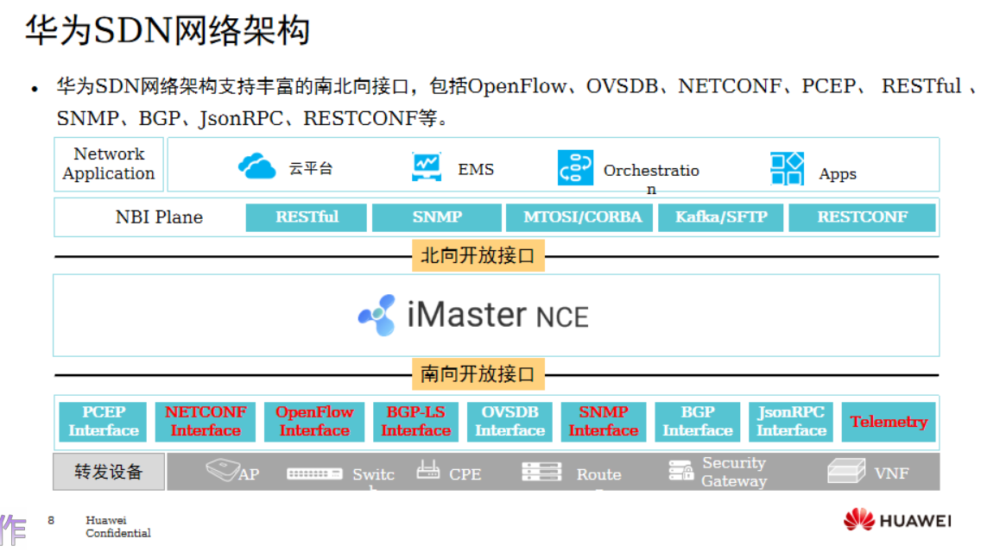
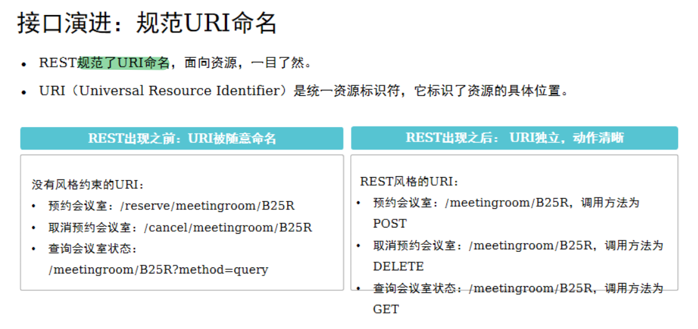
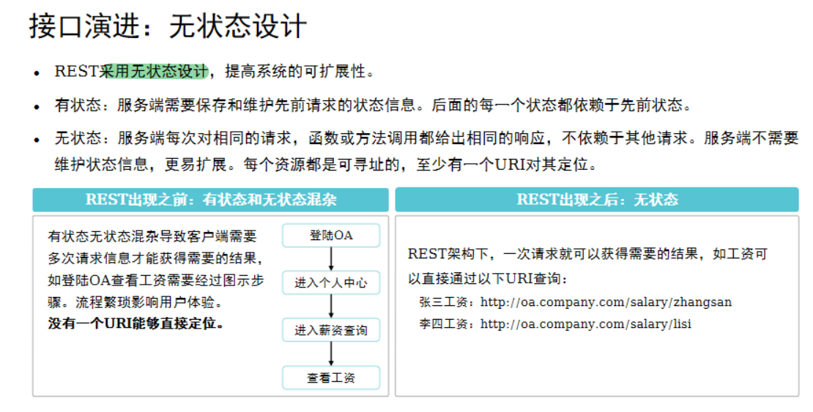
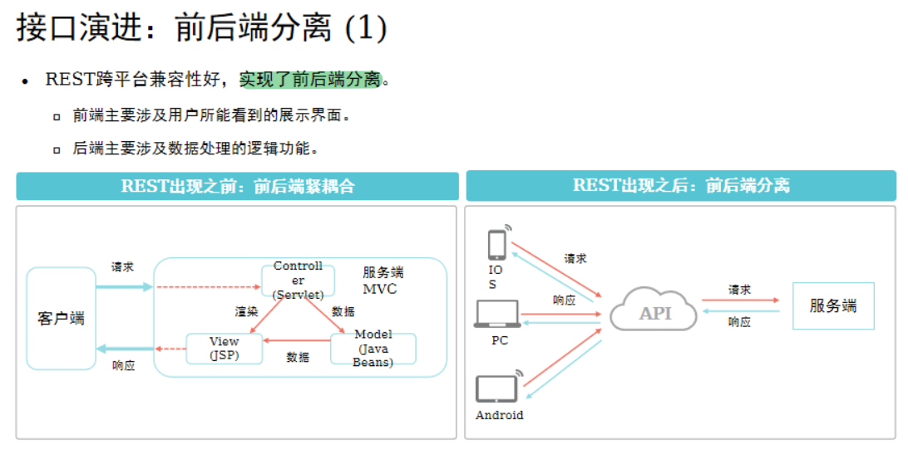
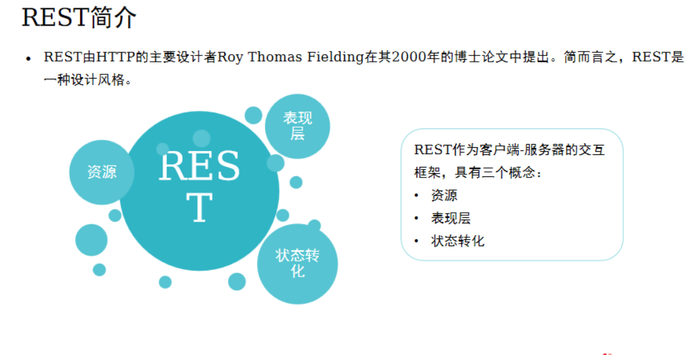
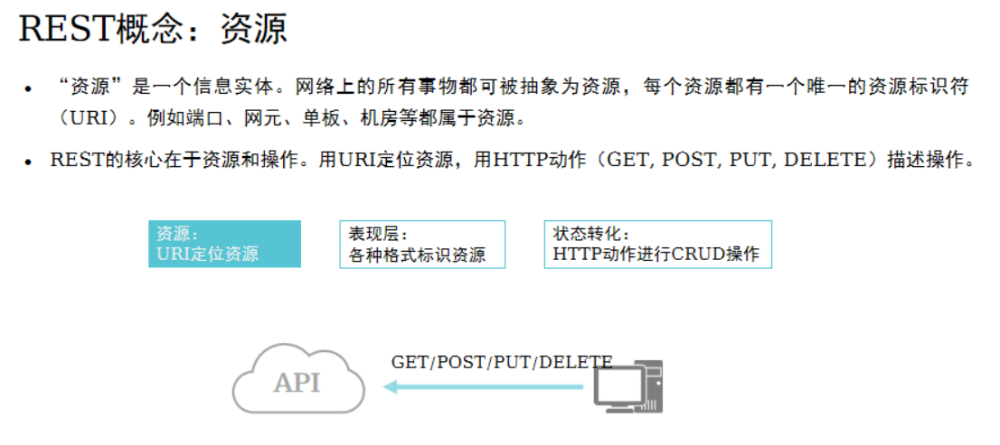
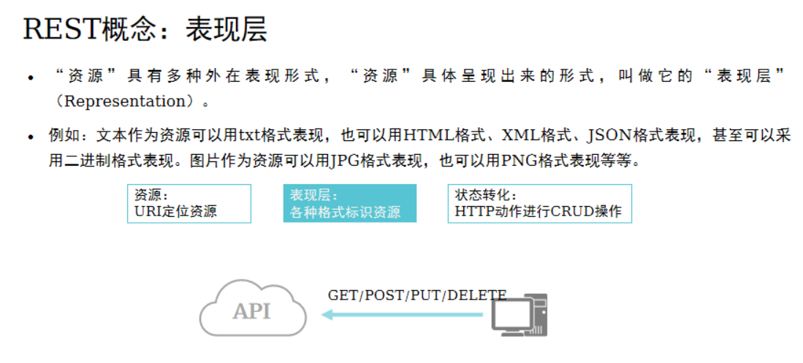
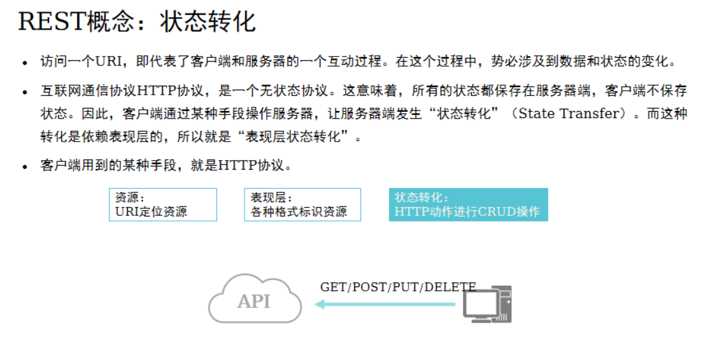
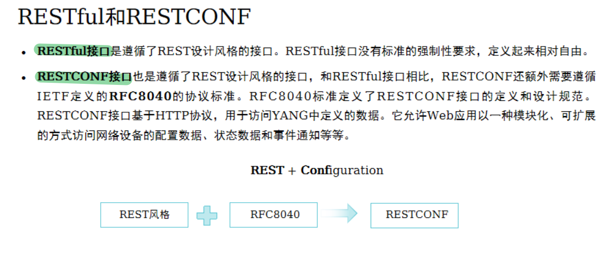
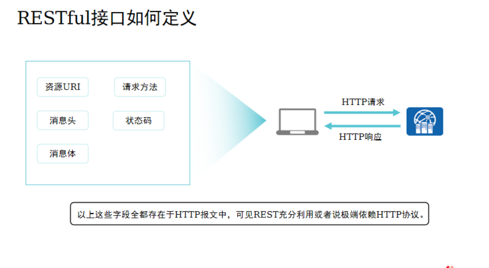

# RESTful
```
REST (Representational State Transfer，表现层状态转化)
```

## 规范 URI命名

## 无状态设计

```
状态化请求：
    服务器端一般都要保存请求的相关信息，每个请求可以默认地使用以前的请求信息。

无状态请求：
    服务器端的处理结果必须全部来自于一次请求所携带的信息。
```
## 前后端分离










[RESTful 原理与实践](../IE%20课件/39%20RESTful原理与实践.pptx)