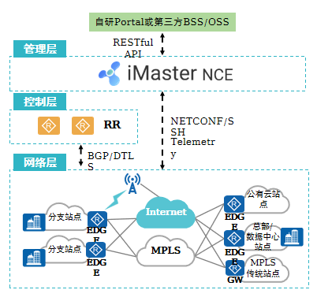
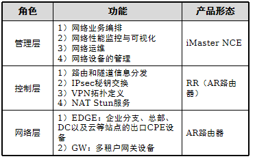
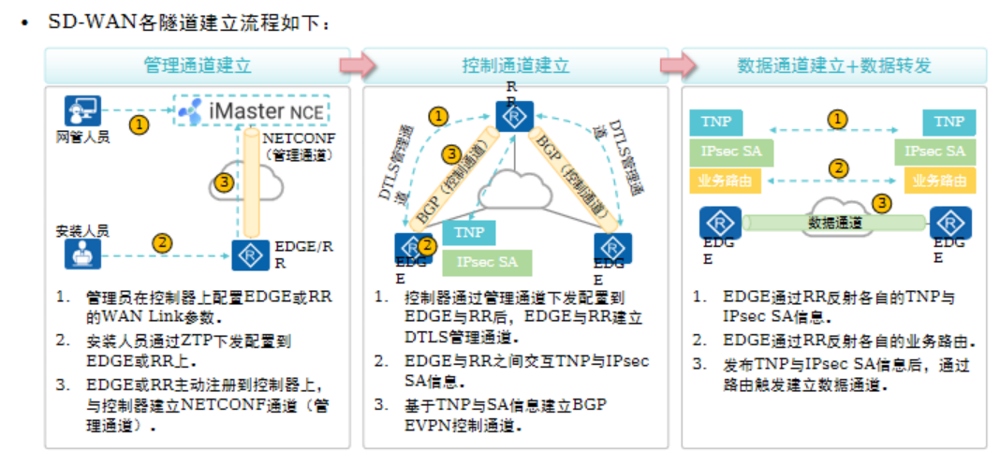

# SD-WAN
```
背景：现在的网络应用类型越来越多（海量的应用类型）
	① 不同的应用对网络的要求不一，
		- 如：视频流量（直播、视频会议。一般对带宽要求相对较低，延迟和抖动要求高）
			（高清视频，4K、8K 视频。这类视频对带宽要求非常高，但延迟和抖动一般）
		
		传统的网络根据五元组来进行划分（源、目 IP 地址、端口号、协议号）来进行区分，
			- 无法很好的区分不同的视频流量，应该如何控制转发
	
	② 新兴业务的流量（如：远程控制、无人机、云游戏、云桌面）
		- 不同类型的应用如何划分服务等级，如何进行网络切片
```

## （SAC）智能应用控制：用于灵活的识别应用（区分应用）
```
会对进入设备的流量进行识别，
	- 先检查流量的五元组是否可以匹配
	-（如果可以匹配，则代表是已识别应用，直接三层转发）
	-（如果未识别匹配，则先根据 FPI 进行匹配，如：ACL、域名、端口号和协议号来进行匹配）
			
			① 如果匹配成功，则根据 FPI 规则转发，
				- 并生成应用识别转发表
			
			② 如果均匹配失败，则再转交给 SA 特征库识别
				- （匹配常规应用，如：域名、服务器 IP 地址、协议号来区分）
```

## （SPR）智能策略路由：可以根据网络品质来进行选路
```
通常流量会根据开销值来进行转发，不会检查（延迟、抖动、丢包率是否能够满足应用需求）

SPR 可以根据网络链路的状态来发生切换，如：主链路延迟超过 50ms，则切换到备份链路转发

SPR 通常会配合 NQA 来检查链路状态（如：延迟、抖动、丢包率，DNS 解析延迟、TCP 链接延迟等）

	① SPR 会查看主用组中的接口是否满足业务需求，
		- 如果均满足，则使用主用组中 CMI 得分最高的链路

	② 如果主用组链路均无法使用（或无法满足需求）则查看备用组是否能够满足业务需求，
		- 如果可以则采用备用组 CMI 得分最高的链路

	③ 如果所有主用和备用接口都故障，则采用逃生链路（逃生链路不检查网络品质）
```

————————————————————————————————————————————————————————————————————

# 一、SD-WAN
```
背景：
	① 云计算网络的出现，使得应用激增
		- （不同的应用对网络品质的需求不一，如：VR/AR 需要大带宽、低延迟；远程控制需要低延迟、高可靠性等）
		- 需要广域网互联提供相应的服务品质

	② 新站点业务开通时间长（需要 7-15 天，甚至 2-3 个月）
	
	③ 分支站点过多，维护难度大，运维成本高

SD-WAN 解决方案
	① 可以根据不同的业务类型进行分类，以及根据应用对网络的需求进行智能选路

	② 开通时间长，SD-WAN 支持 ZTP（零配置开局）模板化快速下发业务，
		- 对分支站点进行开通（2-7 天完成开通）
	
	③ 可视化的集中管理（全网可视），支持智能故障分析和自动化智能运维
	
	④ 支持增值业务（QOS、IPSec、流量分析等）
```
## 华为 SD-WAN 解决方案架构


```
从功能角度
	1. 管理层
		- 控制器对企业互联的业务全流程精细管理
		- 南向通过 NETCONF 实现对网络设备的纳管
		- 北向提供 RESTful 接口与第三方应用对接

	2. 控制层
		- 控制器 与 分布式控制组件配合
		- 负责区域内不同站点之间的路由传递
		- 实现区域间网络的互联互通

	3. 网络层
		- 分支、总部 和 云平台之间通过高性价比的网络设备
		- 采用 Overlay 技术，按需构建基于 Internet、 传统专线等任意链路的全网络联接

iMaster NCE-WAN/iMaster NCE-Campus 都可以被作为华为 SD-WAN 控制器使用

企业分支、总部、数据中心 以及 在云上部署的 IT 基础设施
	- 可以统称 企业站点
```

## 1、概念

### 网络设备
```
	Underlay（运营商网络设备作为底座，物理网络）

	Overlay（运营商或用户构建的虚拟网络，如：通过 MPLS、IPSec VPN 等方式构建传输网络）

	如：用户 A 租用了运营商的带宽服务（使用的是 internet）用户为了保障分支和总部的安全性，自行搭建了 IPSec VPN 传输内部流量
	 	运营商网络为 Underlay，客户自行搭建的 IPSec VPN 则为 Overlay


	① Edge 是 SD-WAN 网络的边缘，用于构建 Overlay 隧道技术，实现流量转发
		也意味着数据流量从 Edge 进入 SD-WAN 网络
		补充：一般 Edge 设备为物理设备（公有云可以使用软件模拟）一般都被 iMaster 纳管，由管理员和租户管理

	
	② RR 是 SD-WAN 的 BGP 反射器
		用于减少 BGP 邻居关系，Edge 和 RR 一般都被 iMaster 纳管，RR 和 Edge 建立 BGP 邻居关系
		（用于传递路由、控制和网络信息，在 SD-WAN 中 RR 也称为区域控制器）

	补充：iMaster 与 RR、Edge 建立控制通道，用于下发配置信息，收集设备状态，收集监控信息

	③ Gateway（网关设备）为了保护已有投资和网络过渡（MPLS VPN 过渡到 SD-WAN）
		一般是指具有传统网络转发能力（MPLS VPN）和 SD-WAN 网络转发能力的设备
```

### 2、华为SD-WAN解决方案主要提供如下功能：
```
① 零配置（ZTP）开局，分钟级业务开通
	待开局设备安装开局软件（可以使用 U 盘、邮件、DHCP 等方式下发）
	待开局设备通过向 iMaster NEC 注册，即可完成开局

	例如：
		AP 获取 IP 地址后，通过 CAPWAP 隧道向 AC 注册，AC 可以编排业务（VAP 配置）并下发给 AP，
		完成 AP 部署 iMaster NCE 控制器就类似于 AC，AP 就类似于 待开局的设备（如：Edge、RR）

	优点：
		① 待开局设备由控制器统一配置部署，实现零配置开局，提高了开局效率，适用于大规模网络站点开局
		② 通过 URL 链接 或 DHCP Option（148）参数实现开局配置，简化了开局流程，一键完成开局部署
			类似于 DHCP 服务器给 AP 下发 option 43（告知 AP 设备，AC 的传输地址，使其能够注册上线）
			开局后设备自动注册到控制器，完成配置下发（简化开局配置）
	
	支持的开局方式
		① U盘开局  ② 邮件开局  ③ DHCP 开局（常用的开局方式）通过 DHCP 分配 IP 地址，以及分配 option 信息（包含 iMaster 服务器 IP 地址）
		补充：如果分支站点距离服务器较远（如：相隔运营商）无法通过 DHCP 分配地址，则采用邮件或者 U 盘开局


② 转控分离，灵活组网
	华为 SD-WAN 解决方案通过以下三种通道实现灵活组网：

		管理通道：
			- 用于 iMaster 与 Edge、RR 等被纳管设备交互配置信息、控制信息和管理信息（如：路由协议配置、IP 业务配置等）
			- 使用 NETFON 协议实现远程配置

		控制通道：
			- 当 iMaster NCE 通过 "管理通道" 下发配置后，设备通过 BGP EVPN 协议建立控制通道
			- 控制通道的主要作用是传递 TNP（Transport Network Port）"隧道的 IP 地址、RD 号、隧道类型等信息"
			- IPsec SA（加密算法、转发模式、认证算法等信息），客户业务路由（客户内部网络，VPNv4、EVPN 等路由）信息

		数据通道：
			- 通过控制通道下发的 IP 信息和路由信息构建底层网络，同时根据这些 IP 地址也可以构建传输隧道
			- 如：GRE、GRE over IPSec 等隧道，用于转发用户的数据包


③ 应用体验，业务可控可视
	使用 SAC 来识别不同类型的应用，通过 SPR 来实现智能选路
	① SAC通过SA与FPI识别应用并分组流量

	② SPR基于探测报文确定链路质量从而决定转发路径

	③ 相同转发路径的数据包还可以通过 Qos 和 HQos 实现网络品质保障
	
	④ 通过 A-FEC 实现网络可靠性（冗余转发）


④ 完整安全防御体系，业务安全无忧
	可以根据不同的通道实现安全封装

	如：NETCONF（管理通道）通过 NETCONF 协议下发配置，可以使用 SSH 来确保安全性
	数据通道、控制通道，使用 IPSec 来封装传输（支持加密、认证功能），确保安全性


⑤ 支持全局可视化管理
	1. 拓扑结构（如：互联的接口、设备信息、IP 地址信息、ESN 信息等）

	2. 设备状态可视化（如：CPU、内存、磁盘利用率、链路吞吐量，带宽利用率、延迟等 45+ 可视化信息）

	3. 全网自动告警（如：某个阈值超出限定，带宽超过 70%，平台自助告警，还可以提供定位）


	补充：华为 SD-WAN 的使用场景主要有：企业自建，MSP 转售与运营商转售
```

# 二、SD-WAN 设计
## 1、站点设计
```
设备角色：
	Edge、RR 设备选择

WAN 链路设计（单 PE 双上行、双 PE 双上行等）
	一般连接 MPLS 为主用链路，Internet 为备用链路

LAN 链路设计
	二层通过链路聚合连接汇聚、VRRP + MSTP 等方式
	三层通过路由协议计算备份路径

CPE 通过 interlink 传输 IPSec SA、链路信息、TNP 信息等
```

## 2、隧道设计
```
	管理隧道
	控制隧道
	数据隧道

	概念：
		① Site ID（全局唯一，用于标识站点信息）
			- 相同的 Site ID 代表属于同一站点（如：Site Y）
		
		② CPE Router ID（全局唯一，使用设备的 loopback 接口标识）
			- 一个站点一般有 1-2 个 CPE 组成
		
		③ TN（传输网络）
			- 由运营商提供，用于接入运营商网络和传输数据
		
		④ RD（路由域）
			- 用于标识传输网络是否能够互通，相同 RD 的 TN 可以互通，不同 RD 的 TN 相互隔离
		
		⑤ WAN link（广域网链路）
			- 标识 Site 接入广域网的接口

		⑥ TNP（传输网络接入点）
			- 包含以上信息（Site ID、CPE Router id、接口 IP 地址等）
```

## SD-WAN 隧道建立过程

```
作用
	1. 管理通道
		- 建立控制通道以及下发配置

	2. 控制通道
		- 建立数据通道
		- DTLS（Datagram Transport Layer Security）
			- 数据包传输层安全性协议
			- 用于保障TCP数据安全
	
	3. 数据通道
		- 传递用户数据
	
	TNP 信息一共会交互两次
		- 控制通道建立阶段
			- TNP 交互作用是 交互 RR 与 EDGE 之间建立通道信息
		- 数据通道建立阶段
			- TNP 交互作用是 交互 EDGE 与 EDGE 之间建立通道信息
```