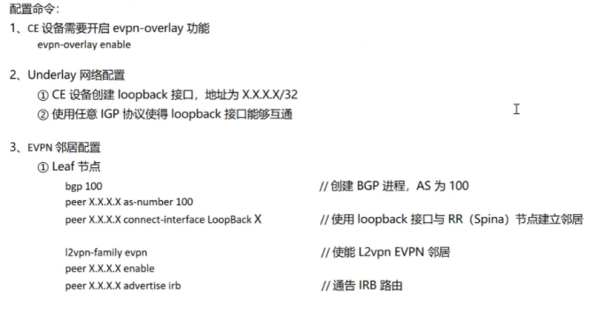
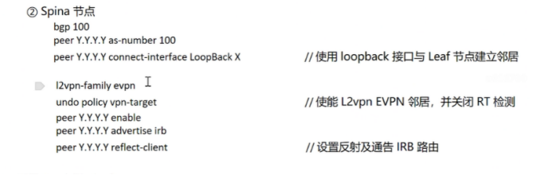
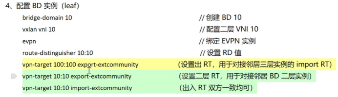
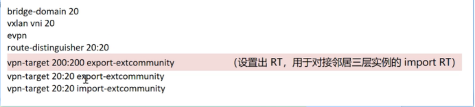
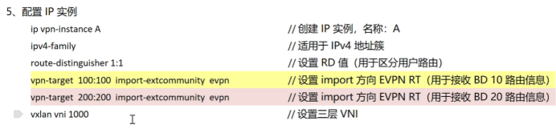
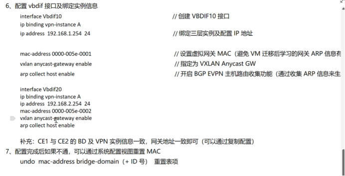
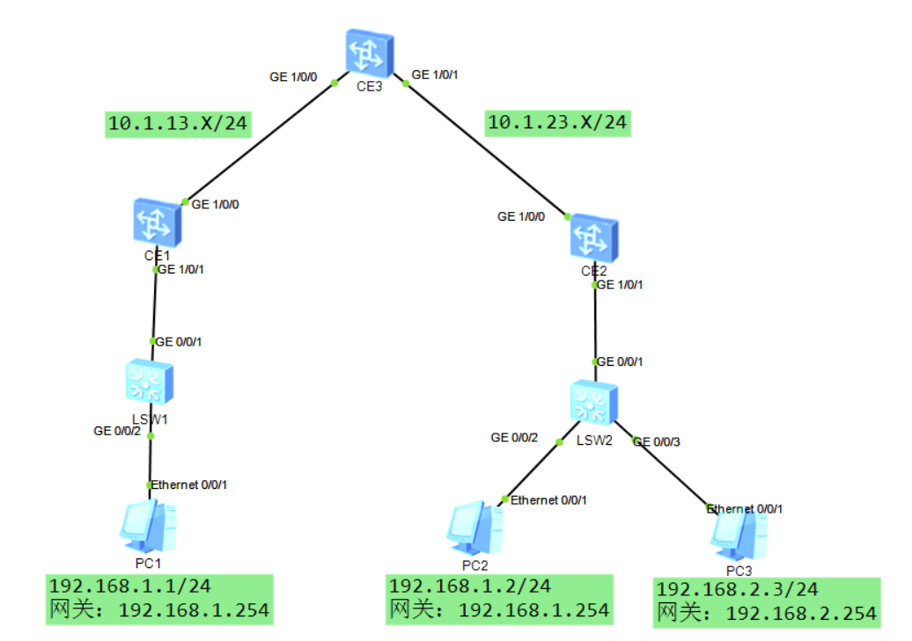

# VXLAN
## 一、虚拟化技术
```
作用：
    提高资源的利用率，操作系统与硬件解耦

特性
    1. 分区：
        - 把物理资源分成不同的空间
        - （如：一块硬盘，分成多个逻辑盘，如：C、D、E、F 等）
	2. 隔离：
        - 分区的资源互相独立，互补占用和干扰
	3. 封装：
        - 虚拟机可以封装为一个文件
        - （如：qcow2、vdsk 等）可以独立于硬件运行（与硬件解耦）
	4. 独立于硬件：
        - 虚拟机文件可以与硬件解耦，实现虚拟机的迁移
```

## 二、VXLAN 产生背景及概念
```
产生背景：
	1. 海量的租户（VM）无法使用 VLAN ID（2的12次方）来进行隔离，可以使用 VXLAN 的 VNI 进行隔离（2的24次方）
	
    2. 虚拟机的迁移需要跨域三层（如：不同的可用区之间）保障迁移后流量不中断
	
    3. 交换设备无法满足海量租户的 MAC 信息保存，受到 MAC 地址表的限制

概念
1. NVE（网络虚拟边缘）
    - 意味着数据包进入了 VXLAN 域
    - （是 VXLAN 域的边缘设备，类似于 MPLS VPN 中的 PE 设备）

2. VETP（VXLAN 隧道端点）
    ① 是 NVE 中的 IP 地址，使用 IP 地址来标识 VTEP
    ② 两个 VTEP 可以唯一标识一条隧道（分为源 VTEP 和 目的 VTEP）
    ③ VTEP 用于 VXLAN 数据包的封装和解封装

3. VNI（VXLAN ID）
    - 类似于 VLAN ID，用于标识 VXLAN 的隧道
    - 与 BD 绑定，1个 VNI 对应一个 BD

4. BD（桥域）
    - 用于标识一个大二层网络，BD 相同代表处于一个大二层网络，BD 不同代表处于不同的广播域（不同的二层网络）

    - （补充：类似于 VLAN 相同 VLAN 处于一个二层网络，
        - 相同 BD 也处于一个大二层网络）

    - 补充：一个 BD 映射一个 VNI，一个 BD 可以映射多个 VLAN
    - （VLAN 对于 VXLAN 而已，只是用于标识进入那一个 BD 中）
			
5. VAP（虚拟接入点）
	- 一般是 NVE 的接口（可以是物理接口也可以是虚拟接口）
	
    - 用于接收用户流量，一般是子接口
    （如：给用户剥离 VLAN 标签，映射到相应的 BD 中）

6、VBDIF（虚拟的 BD 接口）
    - 类似于 VLAN 的 VLANIF 接口，是 BD 的三层接口
    （一般作为网关设备使用）
	
    - 可以实现 BD 内的二层终端访问外部网络，也可以实现不同的 BD 间的终端实现三层互访（二层隔离，三层互访）
```

### 二层VNI 与 三层VNI
```
二层VNI
	1.二层VNI通常以1:1的方式映射到广播域BD（Bridge Domain），实现VXLAN报文同子网的转发。
	- 这意味着，属于同一二层VNI的设备可以直接进行二层通信，就像它们位于同一个物理网络中一样. 

	配置
		1. 创建 Vxlan 实例
		2. 配置隧道接口
		3. 配置 Vxlan 隧道
		4. 配置 Vxlan 转发

三层VNI
	1. 三层VNI则与VPN实例进行关联，用于VXLAN报文跨子网的转发。
	- 这允许来自不同子网的设备通过三层VNI进行通信，即使它们在物理网络中位于不同的位置。
	- 三层VNI的使用扩展了VXLAN的通信范围，使得虚拟网络能够跨越更广泛的地理区域.
	
	配置
		1. 创建 Vxlan 实例
		2. 配置 隧道接口
		3. 配置 Vxlan 隧道
		4. 配置 VBDIF 接口
```

# 配置命令：（二层互访）相同子网跨域大二层网络互访
```
1、接入交换设备（DVS）
	① 创建 VLAN
		vlan batch 10
	
	② 对应终端配置 access 接口（服务器中的普通接口）
		interface G0/0/X
		port link-type access
 		port default vlan 10

	③ DVS 对接 VXLAN 网络设备的接口（服务器中的上行链路，需要配置为中继接口）
		interface G0/0/X
		port link-type trunk
 		port trunk allow-pass vlan 10				// 需要保留标签发出

2、CE 设备配置（NVE）
	1、基础配置
		所有的 CE 设备均需要配置接口 IP 地址
		<Huawei> system-view immediately 			// 使用该命令进入系统配置视图，否则配置命令 * 时，需要配置 commit 才能使命令生效（~）

		物理接口默认关闭，且为二层接口
		interface G0/0/X
		undo portswitch							// 切换为三层接口模式
 		undo shutdown							// 开启端口

		接口配置 IP 地址且使用任意 IGP 协议发布即可（OSPF、IS-IS 等）
		补充：最好每个设备创建一个 loopback 接口，用于 BGP 和 VXLAN 隧道建立

	2、NVE 配置
		① 创建 BD 并配置 VNI
			bridge-domain 10						// BD 10
			vxlan vni 10							// VNI 10（注意：BD 和 VNI 唯一绑定，但 VNI 和 BD 的值可以不一致，如：BD 10，VNI 100）

		② 手工建立 VXLAN 隧道
			interface Nve1							// 进入 NVE1 接口
			source 1.1.1.1							// 配置源 VTEP（使用本地 IP 地址）
 			vni 10 head-end peer-list 3.3.3.3			// 建立 VXLAN VNI 10 的隧道，指定目的 VTEP IP 地址
			（补充：模拟器仅有一个目的隧道会生效）
		
	3、NVE 对接服务器配置（VAP 接口）
			interface GE1/0/0.1 mode l2				// 把对接终端交换机（DVS 的接口）即：对接服务器设备的接口，配置为二层子接口
 			encapsulation dot1q vid 10				// 剥离标签 dot1q
 			bridge-domain 10						// 配置 BD 即可（该接口属于 BD 广播域）

	查看配置
		1、查看 VXLAN 隧道详细信息
			display  vxlan vni 10					// 查看 VNI 10 的 VXLAN 隧道
			display  vxlan tunnel verbose 			// 可以互相使用

		2、查看 BD 与 VNI 对应关系
			display bridge-domain  10  verbose 

		3、查看 BD 10 的 MAC 地址表（学习客户终端的 MAC "VM 设备的 MAC"）
			display  mac-address bridge-domain 10	// 例如：可以查看 VM 访问的信息，如果有下一跳地址，则为隧道转发，否则内部接口转发
```

## 集中式网关（三层互访，不同 BD 和子网间的终端互访）
```
配置命令
1、接入交换设备（DVS）
	① 创建 VLAN
		vlan batch 10
	
	② 对应终端配置 access 接口（服务器中的普通接口）
		interface G0/0/X
		port link-type access
 		port default vlan 10

	③ DVS 对接 VXLAN 网络设备的接口（服务器中的上行链路，需要配置为中继接口）
		interface G0/0/X
		port link-type trunk
 		port trunk allow-pass vlan 10				// 需要保留标签发出

2、CE 设备配置（NVE）
	1、基础配置
		所有的 CE 设备均需要配置接口 IP 地址
		<Huawei> system-view immediately 			// 使用该命令进入系统配置视图，否则配置命令 * 时，需要配置 commit 才能使命令生效（~）

		物理接口默认关闭，且为二层接口
		interface G0/0/X
		undo portswitch							// 切换为三层接口模式
 		undo shutdown							// 开启端口

		接口配置 IP 地址且使用任意 IGP 协议发布即可（OSPF、IS-IS 等）
		补充：最好每个设备创建一个 loopback 接口，用于 BGP 和 VXLAN 隧道建立

	2、NVE 配置
		CE1 和 CE2 配置（CE1 使用 BD 10、CE2 使用 BD 20 即可）
		① 创建 BD 并配置 VNI
			bridge-domain 10						// BD 10
			vxlan vni 10							// VNI 10（注意：BD 和 VNI 唯一绑定，但 VNI 和 BD 的值可以不一致，如：BD 10，VNI 100）

		② 手工建立 VXLAN 隧道
			interface Nve1							// 进入 NVE1 接口
			source 1.1.1.1							// 配置源 VTEP（使用本地 IP 地址）
 			vni 10 head-end peer-list 3.3.3.3			// 建立一条到达网关设备的 VXLAN 隧道

		③ 同理网关设备也需要创建 BD，并且指定回程 VXLAN 隧道
			CE3（集中式网关）
			bridge-domain 10						// BD 10
			vxlan vni 10							// VNI 10

			bridge-domain 20						// BD 20
			vxlan vni 20							// VNI 20

		④ 创建对应的三层接口
			interface vbdif10
			ip address 192.168.1.254 24

			interface vbdif20
			ip address 192.168.2.254 24

		⑤ 建立回程 VXLAN 隧道
			interface Nve1
			source 3.3.3.3
 			vni 10 head-end peer-list 1.1.1.1
 			vni 20 head-end peer-list 2.2.2.2			// 建立两条分别到达 CE1 和 CE2 的 VXLAN 隧道
			
	3、NVE 对接服务器配置（VAP 接口）
			interface GE1/0/0.1 mode l2				// 把对接终端交换机（DVS 的接口）即：对接服务器设备的接口，配置为二层子接口
 			encapsulation dot1q vid 10				// 剥离标签 dot1q
 			bridge-domain 10						// 配置 BD 即可（该接口属于 BD 广播域）

	查看配置
		1、查看 VXLAN 隧道详细信息
			display  vxlan vni 10					// 查看 VNI 10 的 VXLAN 隧道
			display  vxlan tunnel verbose 			// 可以互相使用

		2、查看 BD 与 VNI 对应关系
			display bridge-domain  10  verbose 

		3、查看 BD 10 的 MAC 地址表（学习客户终端的 MAC "VM 设备的 MAC"）
			display  mac-address bridge-domain 10	// 例如：可以查看 VM 访问的信息，如果有下一跳地址，则为隧道转发，否则内部接口转发
```

# 三、动态建立 VXLAN 隧道
```
	使用 BGP EVPN（Ethernet VPN）

	BGP 使用 EVPN 实现 MAC 地址的通告、VXLAN 隧道的自动发现、BUM 流量的通告及设备迁移时，ARP 和 MAC 地址的移动
	EVPN 通过以下 3个类型的 MP_REACH_NLRI 来通告信息

	1、Type 3路由（Inclusive Multicast 路由）
		用于自动发现 VXLAN 隧道通告 BUM 流量，主要的通告内容（VNI 标签、VTEP 的 IP 地址）

	2、Type 2路由（MAC route 路由）
		用于通告 BGP EVPN 学习到的 MAC 地址、IP 地址、二层 VNI 或 三层 VNI 的信息，把广播方式的 ARP 学习转换为单播方式学习
		减少流量的泛洪，使得学习效率更高

		二层互访
			Type2 只会携带（MAC 地址和 VNI 信息）
			① 当 CE1 从终端设备学习到 MAC 信息后，会先放入 MAC-BD 表项，并通过 BGP 生成 Type2
				记录 VNI=10 和 MAC=AA 的信息，转发给其他他的 VNI 10 邻居（单播转发）

			② CE2 收到会，会查看 RT 是否能够接收，如果可以则保留到 BGP 路由表中
				显示信息：VNI=10、MAC=AA，下一跳为 CE1 BGP 更新源地址（1.1.1.1/32）
			
			③ CE2 收到目的 MAC 地址为 AA 的数据包时，则能够快速依赖 BGP 路由表封装到 VNI=10 的 VXLAN 隧道，转发给 1.1.1.1 设备
				实现单播的学习 MAC 地址


		三层互访
			Type2 携带（ARP 信息）在集中式网关场景下
			① 当 CE1 为终端的网关设备，终端进行三层互访时，需要请求网关的 ARP 信息和 MAC 地址
				CE1 也会记录终端的 ARP 信息（如：IP 地址、MAC 地址、接口及 VNI ID）
			
			② CE1 会把该信息封装到 Type2 中，并且单播传递给 CE2 设备（其他的三层网关设备）
				CE2 会查看 RT 是否能够接收，如果可以则保留到 BGP 路由表中
				显示信息：VNI=10、MAC=AA，IP 地址：192.168.1.1/32  下一跳为 CE1 BGP 更新源地址（1.1.1.1/32）

			③ 当 CE2 收到目的 IP 地址为：192.168.1.1 的三层流量时，则会根据 ARP 表项信息，重新封装二层头部
				目的 IP 为：192.168.1.1、目的 MAC：AA   流量根据 VNI=10 和更新源地址（1.1.1.1/32）进行下一跳三层转发
				无需 CE2 请求 192.168.1.1 的 MAC 和 IP 的映射关系，即无需进行额外的 ARP 请求
```


## 集中式网关 + 二层访问部署（通过 BGP EVPN 自动建立）
```
配置命令
1、接入交换设备（DVS）
	① 创建 VLAN
		vlan batch 10
	
	② 对应终端配置 access 接口（服务器中的普通接口）
		interface G0/0/X
		port link-type access
 		port default vlan 10

	③ DVS 对接 VXLAN 网络设备的接口（服务器中的上行链路，需要配置为中继接口）
		interface G0/0/X
		port link-type trunk
 		port trunk allow-pass vlan 10							// 需要保留标签发出

2、CE 设备配置（NVE）
	1、基础配置
		所有的 CE 设备均需要配置接口 IP 地址
		<Huawei> system-view immediately 					// 使用该命令进入系统配置视图，否则配置命令 * 时，需要配置 commit 才能使命令生效（~）

		物理接口默认关闭，且为二层接口
		interface G0/0/X
		undo portswitch									// 切换为三层接口模式
 		undo shutdown									// 开启端口

		接口配置 IP 地址且使用任意 IGP 协议发布即可（OSPF、IS-IS 等）
		补充：每个设备创建一个 loopback 接口，用于 BGP 和 VXLAN 隧道建立

	2、NVE 配置
		CE1 和 CE2 配置（CE1 使用 BD 10、CE2 使用 BD 20 即可）
		① 创建 BD 并配置 VNI
			bridge-domain 10							// BD 10
			vxlan vni 10								// VNI 10（注意：BD 和 VNI 唯一绑定，但 VNI 和 BD 的值可以不一致，如：BD 10，VNI 100）

		② BD 需要配置 RD 和 RT 值，用于控制隧道的建立
			bridge-domain 10	
			evpn
  			route-distinguisher 1:1
  			vpn-target 100:100 export-extcommunity		
  			vpn-target 100:100 import-extcommunity		// 相同 BD 的设备，可以直接复制配置（使用相同的 RD 和 RT）

	3、开启 EVPN-overlay 功能（全局开启）
			evpn-overlay enable 						// 需要建立 BGP EVPN 的设备都需要开启

	4、建立 BGP EVPN 邻居
			bgp 100
			undo default ipv4-unicast
 			peer 3.3.3.3 as-number 100
 			peer 3.3.3.3 connect-interface LoopBack0		// CE1 与 CE3 建立邻居关系

 			l2vpn-family evpn
  			peer 3.3.3.3 enable							// 建立 L2-EVPN 邻居

			补充：RR 配置
			bgp 100
 			undo default ipv4-unicast
 			peer 1.1.1.1 as-number 100
			peer 1.1.1.1 connect-interface LoopBack 0
 			peer 2.2.2.2 as-number 100
			peer 2.2.2.2 connect-interface LoopBack 0
			
			l2vpn-family evpn
  			undo policy vpn-target						// RR 的 BD 可以不用配置 RD 和 RT 但是需要关闭检测
  			peer 1.1.1.1 enable
  			peer 1.1.1.1 advertise arp					// 开启 ARP 通告功能（允许通告 ARP 路由，类型2 信息）
  			peer 1.1.1.1 reflect-client					// 开启反射器功能
  			peer 2.2.2.2 enable
  			peer 2.2.2.2 advertise arp
  			peer 2.2.2.2 reflect-client

	5、BGP 设备之间建立 VXLAN 动态隧道
			interface Nve1
 			source 3.3.3.3								// 参考 RR 设备配置
 			vni 10 head-end peer-list protocol bgp
 			vni 20 head-end peer-list protocol bgp

	6、如果是集中式网关设备，则需要配置三层地址
			interface Vbdif10
 			ip address 192.168.1.254 24					// 例如：VBDIF 10 网关
 			arp collect host enable						// 开启主机的 ARP 自动发现和通告功能（不开启无法发送 ARP 的类型 2 和 IRB 路由）

	查看配置
		1、查看 VXLAN 隧道详细信息
			display  vxlan vni 10					// 查看 VNI 10 的 VXLAN 隧道
			display  vxlan tunnel verbose 			// 可以互相使用

		2、查看 BD 与 VNI 对应关系
			display bridge-domain  10  verbose 

		3、查看 BD 10 的 MAC 地址表（学习客户终端的 MAC "VM 设备的 MAC"）
			display  mac-address bridge-domain 10	// 例如：可以查看 VM 访问的信息，如果有下一跳地址，则为隧道转发，否则内部接口转发

		4、查看 BGP 邻居和路由信息
			display  bgp evpn peer					// 查看邻居
			display  bgp evpn all routing-table		// 查看路由

			display  bgp evpn all routing-table
			display  bgp evpn all  routing-table inclusive-route 		// 查看 VXLAN 隧道信息（加入明细路由后缀，可以查看详细内容）
															如：display  bgp evpn all  routing-table inclusive-route  0:32:1.1.1.1  

			display  bgp evpn all  routing-table mac-route 			// 查看类型2（MAC 信息、ARP 信息等）
			
            （加入明细路由后缀，可以查看详细内容）
		
        ① display  bgp evpn all  routing-table mac-route  0:48:fa3a-14cd-0001:0:0.0.0.0 	查看二层通信的 MAC 和 VNI
		
        ② display  bgp evpn all  routing-table mac-route  0:48:fa3a-14cd-0001:32:192.168.1.254 	查看三层通信的信息
		
        （② 有可能是 IRB 分布式网关信息、也有可能是 ARP 集中式网关信息）
		
        IRB 会有 2 层标签
            -（二层和三层 VNI）ARP 只有二层 VNI

```
# 园区网络虚拟化
## 一、设备
```
1、Border 边界网关节点
	（VXLAN 网络中用于连接外部网络的设备，一般也为内部 BGP 的 RR 设备）

2、Transparent 透传节点
	（VXLAN 网络中的中转设备，一般不需要支持 VXLAN 的封装功能，只需要支持 IP 转发即可）

3、Edge 边缘节点
	（内部设备进入 VXLAN 域的边缘设备，需要支持 VXLAN 封装，与 Border 和其他的 Edge 建立 VXLAN 隧道）

补充：Border 和 Edge 标识了 VXLAN 域的范围

4、扩展节点
	（不支持 VXLAN 配置的设备，也不在 VXLAN 域中，是接入层设备，如：接入交换机、AP 等）
```

## 二、网络类型
### 1、Underlay（底层网络）
```
在 VXLAN 域中的物理设备，由互联的 IP 地址、互联的 VLAN 及运行的 IGP 协议（目前 iMaster 支持 OSPF）组成
```

### 2、Fabric
```
把物理网络抽象成资源池，在物理网络上构建了 BGP EVPN 邻居和 VXLAN 隧道

不同的业务可以通过这些隧道转发，实现访问隔离
	包含（BD、VNI、VLAN）
	把网络划分为多个 BD 域，相同 BD 二层互访，不同 BD 则需要 VBDIF 是实现三层互访
```

### 3、Overlay（上层网络）
```
通过使用 IP vpn-instance 来构建多张虚拟网络，如：OA、RD、Guest 等
	实现一网多用

	补充：一网多用是指，一张物理网络通过 VN（虚拟网络）的技术，划分为多张虚拟网络的技术
		（类似于防火墙的 vsys 把一个物理防火墙，当作多个防火墙使用）

	默认情况下 VN 之间是隔离互访的，需要通过配置 VN 间路由（静态路由）才能实现互访
	VNI 包含的资源
		① 网络服务资源：（DHCP服务器、第三方RADIUS/Portal服务器等）
		② 外部网络（可选）：Internet（运营商网络）
```
```
① 每个 Leaf 节点都是 BD 网关站点，用户无感知网关具体位置
	（用户会认为 Leaf 就是一个三层路由器，这个路由器由 Leaf 组成 DVR）
	
	补充：
		- 在 iMaster NCE 中，VXLAN 分布式网关就是通过控制（RR）
		- 把网关信息通过 DVR 方式发布到每台 Leaf 节点上（或 Edge节点）
	
② 不同的用户网络通过 IP vpn-instance 隔离，
	这个信息也用于 VXLAN 的网关上，
	相同的用户网关使用一个 IP vpn-instance 绑定
	如：
		vbdif 10 和 20 都属于相同的租户，租户自身有不同部门或网段通过 BD 划分

③ BD 中有 2 个 Export RT 值，
	一个用于二层 MAC 和 VNI 通告，
	另一个用户三层 IP、MAC 机三层 VNI 通告（即：IRB 信息）
	
	用户上线后会获取 IP 地址，并通过发送免费 ARP 检测地址是否冲突
		（同时用于告知网关设备，用户上线）

	这时候用户连接的 VAP 接口会进行 MAC 地址学习，并绑定到 VAP 接口相关的 BD 中
		- 然后产生 Type 2 路由（包含该用户 PC 的 MAC 地址和二层 VNI 信息）
	
	如果该 BD 对应的 vbdif 中配置了（arp collect host enable）还会产生 IRB 信息，
		- 通过 Type 2 路由传递
	（包含该用户 PC 的 IP 地址、MAC 地址和三层 VNI 信息）

④ 二层转发时（不同节点但相同 BD）会根据 MAC BD 地址表查表转发，
	- 此时会根据 Type 2 的 MAC 地址，VNI 及下一跳地址进行封装转发

⑤ 三层转发时（不同节点不同 BD）会根据路由表及 ARP 信息进行转发，
	- 此时会根据 Type 2 的 IP 地址、三层 VNI 及下一跳地址进行封装转发
```
# 分布式网关 EVPN VXLAN 配置 







# 分布式网关EVPN VXLAN

```
配置需求：
1、按图所示配置接口 IP 地址，其中 X 为设备编号
    关闭接口端口二层交换功能
    使能evpn-overlay enable

2、所有的 CE 设备均配置一个 loopback0 接口，地址为：X.X.X.X/32
   X 为设备编号，并使用任意 IGP 协议使其能够互通

3、CE1 和 CE2 为 Edge 节点，与 RR 节点（CE3）建立 BGP EVPN 邻居，需求如下：
   ① 均属于 AS 100
   ② CE1 和 CE2 为 RR 设备的反射器，RR 关闭 vpn-target 检测
   ③ EVPN 邻居之间开启 IRB 通告功能

4、CE1 和 CE2 均创建 BD 10、20，需求如下：
   ① BD 10 的 VNI 为：10
       EVPN 实例信息
       RD 为 10:10
       RT 为 10:10 （二层 RT）both
       三层 RT 为  100:100  export

   ② BD 20 的 VNI 为：20
       EVPN 实例信息
       RD 为 20:20
       RT 为 20:20 （二层 RT）both
       三层 RT 为  200:200  export

5、CE1 和 CE2 均创建 VPN-instance A（相同用户使用同一名称实例即可）
   ① RD 为 1:1
   ② RT 为 100:100  import
           200:200  import   用于接收 BD 10 和 BD 20 的 IRB 路由
   ③ 三层 VNI 为：2000

6、PC1 属于 VLAN 10
   PC2 属于 VLAN 10、PC3 属于 VLAN 20
   LSW 交换机与 CE 交换机使用 trunk 接口互联并放行相关 VLAN
   CE 交换机使用二层子接口对接
  （其中 PC1 和 PC2 对应 BD 10、PC3 对应 BD 20）

7、CE1 和 CE2 分别为 BD 10 和 20 配置网关
   BD 10 地址为：192.168.1.254
   BD 20 地址为：192.168.2.254
   并绑定 ip vpn-instance A 实例
   不同的网关分别配置不同的 MAC 地址（避免虚拟机迁移后，网关 ARP 映射错误）
   网关内开启 ARP 主机路由探测功能

8、实现 PC1 能够访问 PC2 和 PC3
```

## 配置
### 1. 按图所示配置接口 IP 地址，其中 X 为设备编号
```
    关闭接口端口二层交换功能
    使能evpn-overlay enable
```
```
所有 CE
接口下
    interface GE1/0/0
        undo portswitch
        undo shutdown
全局：  
    evpn-overlay enable
```

### 2. 所有的 CE 设备均配置一个 loopback0 接口，地址为：X.X.X.X/32
```
   X 为设备编号，并使用任意 IGP 协议使其能够互通
```

### 3. CE1 和 CE2 为 Edge 节点，与 RR 节点（CE3）建立 BGP EVPN 邻居，需求如下：
```
   ① 均属于 AS 100
   ② CE1 和 CE2 为 RR 设备的反射器，RR 关闭 vpn-target 检测
   ③ EVPN 邻居之间开启 IRB 通告功能
```
#### CE1:
```
#
bgp 100
 undo default ipv4-unicast
 peer 2.2.2.2 as-number 100
 peer 2.2.2.2 connect-interface LoopBack0
 peer 3.3.3.3 as-number 100
 peer 3.3.3.3 connect-interface LoopBack0
 #
 ipv4-family unicast
  undo peer 2.2.2.2 enable
  undo peer 3.3.3.3 enable
 #
 l2vpn-family evpn
  policy vpn-target
  peer 2.2.2.2 enable
  peer 2.2.2.2 advertise irb
  peer 3.3.3.3 enable
  peer 3.3.3.3 advertise irb
#
```
#### CE3:
```
#
bgp 100
 undo default ipv4-unicast
 peer 1.1.1.1 as-number 100
 peer 1.1.1.1 connect-interface LoopBack0
 peer 2.2.2.2 as-number 100
 peer 2.2.2.2 connect-interface LoopBack0
 #
 ipv4-family unicast
  undo peer 1.1.1.1 enable
  undo peer 2.2.2.2 enable
 #
 l2vpn-family evpn
  undo policy vpn-target
  peer 1.1.1.1 enable
  peer 1.1.1.1 advertise irb
  peer 2.2.2.2 enable
  peer 2.2.2.2 advertise irb
#
```
#### CE2:
```
#
bgp 100
 undo default ipv4-unicast
 peer 1.1.1.1 as-number 100
 peer 1.1.1.1 connect-interface LoopBack0
 peer 3.3.3.3 as-number 100
 peer 3.3.3.3 connect-interface LoopBack0
 #
 ipv4-family unicast
  undo peer 1.1.1.1 enable
  undo peer 3.3.3.3 enable
 #
 l2vpn-family evpn
  policy vpn-target
  peer 1.1.1.1 enable
  peer 1.1.1.1 advertise irb
  peer 3.3.3.3 enable
  peer 3.3.3.3 advertise irb
#
```

### 4. CE1 和 CE2 均创建 BD 10、20，需求如下：
```
① BD 10 的 VNI 为：10
    EVPN 实例信息
    RD 为 10:10
    RT 为 10:10 （二层 RT）both
    三层 RT 为  100:100  export

② BD 20 的 VNI 为：20
    EVPN 实例信息
    RD 为 20:20
    RT 为 20:20 （二层 RT）both
    三层 RT 为  200:200  export
```
```
#
bridge-domain 10
 vxlan vni 10
 evpn
  route-distinguisher 10:10
  vpn-target 10:10 export-extcommunity
  vpn-target 10:10 import-extcommunity
  vpn-target 100:100 export-extcommunity
#
bridge-domain 20
 vxlan vni 20
 evpn
  route-distinguisher 20:20
  vpn-target 20:20 export-extcommunity
  vpn-target 20:20 import-extcommunity
  vpn-target 200:200 export-extcommunity
#
```

### 5. CE1 和 CE2 均创建 VPN-instance A（相同用户使用同一名称实例即可）
```
① RD 为 1:1
② RT 为 100:100  import
        200:200  import   用于接收 BD 10 和 BD 20 的 IRB 路由
③ 三层 VNI 为：2000
```
#### CE1:
```
#
ip vpn-instance A
 ipv4-family
  route-distinguisher 1:1
  vpn-target 100:100 import-extcommunity
  vpn-target 200:200 import-extcommunity
 vxlan vni 2000
#
```
#### CE2:
```
#
ip vpn-instance A
 ipv4-family
  route-distinguisher 2:2
  vpn-target 100:100 import-extcommunity
  vpn-target 200:200 import-extcommunity
 vxlan vni 2000
#
```

### 6. PC1 属于 VLAN 10
```
PC2 属于 VLAN 10、PC3 属于 VLAN 20
LSW 交换机与 CE 交换机使用 trunk 接口互联并放行相关 VLAN
CE 交换机使用二层子接口对接
（其中 PC1 和 PC2 对应 BD 10、PC3 对应 BD 20）
```
#### CE1
```
interface GE1/0/1.1 mode l2
 encapsulation dot1q vid 10
 bridge-domain 10
```
#### CE2
```
interface GE1/0/1.1 mode l2
 encapsulation dot1q vid 10
 bridge-domain 10

interface GE1/0/1.2 mode l2
 encapsulation dot1q vid 20
 bridge-domain 20
```

### 7. CE1 和 CE2 分别为 BD 10 和 20 配置网关
``` 
   BD 10 地址为：192.168.1.254
   BD 20 地址为：192.168.2.254
   并绑定 ip vpn-instance A 实例
   不同的网关分别配置不同的 MAC 地址（避免虚拟机迁移后，网关 ARP 映射错误）
   网关内开启 ARP 主机路由探测功能
```
#### CE1
```
建立隧道：
#
interface Nve1
 source 1.1.1.1
 vni 10 head-end peer-list protocol bgp
 vni 20 head-end peer-list protocol bgp
#
interface Vbdif10
 ip binding vpn-instance A
 ip address 192.168.1.254 255.255.255.0
 arp distribute-gateway enable
 arp collect host enable
#
interface Vbdif20
 ip binding vpn-instance A
 ip address 192.168.2.254 255.255.255.0
 arp distribute-gateway enable
 arp collect host enable
#
```

#### CE2：
```
#
interface Nve1
 source 2.2.2.2
 vni 10 head-end peer-list protocol bgp
 vni 20 head-end peer-list protocol bgp
#
interface Vbdif10
 ip binding vpn-instance A
 ip address 192.168.1.254 255.255.255.0
 arp distribute-gateway enable
 arp collect host enable
#
interface Vbdif20
 ip binding vpn-instance A
 ip address 192.168.2.254 255.255.255.0
 arp distribute-gateway enable
 arp collect host enable
#
```

### 8. 实现 PC1 能够访问 PC2 和 PC3

## [EVPN 分布式网关练习](EVPN（分布式网关）练习.zip)


