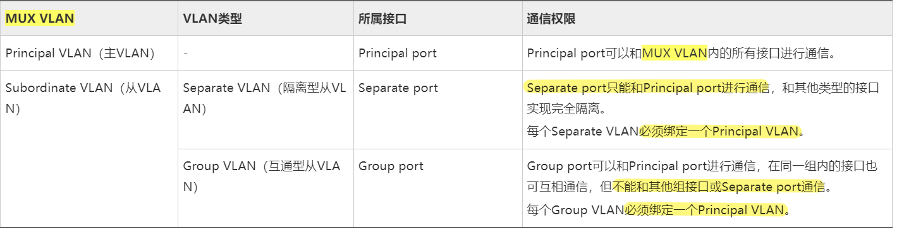
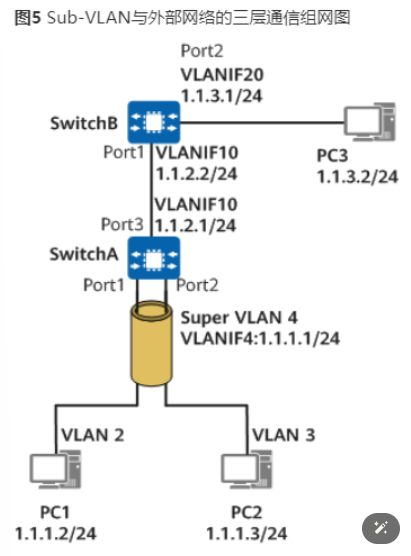

# 以太网安全
## 常见的局域网攻击类型（泛洪和欺骗）
### 1、泛洪攻击：
```
攻击者在短时间内发送大量的报文（如：广播数据帧、DHCP 请求、ARP 请求等）
    ① 造成设备的 CPU 利用率上升甚至不可用，
        - 占用设备带宽（广播域内的用户也会收到该泛洪数据帧）
    ② 占用表项（MAC 地址表、ARP 等）
    ③ DHCP 地址池耗尽（频繁发送地址请求报文）
```
### 2、欺骗攻击：
```
攻击者仿冒合法用户的 IP 地址或 MAC 来发起攻击，
非法获取合法用户的资源

    ① 仿冒管理员或合法用户，获得访问网络的权限
        - （如：网络内部资源）
    ② 仿冒合法用户进行中间人攻击
        - （如：仿冒 PC1 的 IP 地址，窃取其他设备与 PC1 的通信信息）
```


## 一、隔离端口组
```
	交换设备本地生效（只在配置的交换设备上生效）
	同组隔离，异组互访（补充：一个交换端口可以加入到多个端口组）

	应用场景：
		① 可以禁止本交换机内部的主机互访
		② 禁止 VLAN 的主机发起泛洪攻击，可以拒绝广播流量的接收（未知单播、组播等）
		③ 可以在 VLAN 内部实现主机隔离（或者 ACL 配合 Traffic-filter 也可以实现该功能）
```
### 配置命令：
```
interface G0/0/X
// 把 G0/0/X 划入端口组 1 中（禁止与本交换机的其他组 1 端口互访）
port-isolate enable group 1				

// 在主机对应网关的 Vlanif 接口（如：10、20、30 等）
interface VlanifX						
// 开启 VLAN 内的 ARP 代理
arp-proxy inner-sub-vlan-proxy enable		
    （开启后，可以实现二层隔离，三层互通）

系统配置视图
// 同时执行二层和三层隔离（禁止主机互访）
port-isolate mode all					

（模式必须是 mode L2）					// 开启二层隔离模式（缺省模式为 L2 only）
interface G0/0/2						// 进入 G0/0/2
am isolate G0/0/1						// 开启单向隔离，允许 G0/0/2 访问 G0/0/1 接口（反之禁止）
```


## 二、MUX VLAN （主从，互通隔离）
```
作用：
    实现二层的访问控制（注意：纯二层技术，绑定了 MUX VLAN 的 VLAN 都不能创建 VLANIF 接口）

主 VLAN（可以访问任意的从 VLAN）
    一般分配给服务器、网关等使用

从 VLAN
    ① 互通型（同一个 VLAN 内可以互访，不同 VLAN 隔离互访）
        分配给部门内部的员工使用

    ② 隔离型（相同或不同 VLAN 都禁止互访，仅能与主 VLAN 互访）
        分配给访客使用
```


### 配置命令：
```
1、创建 VLAN
    vlan batch 10 20 30 100						// 批量创建 VLAN

2、配置 MUX VLAN
    vlan 100									// 例如：VLAN 100 为主 VLAN
    mux-vlan									// 开启 MUX VLAN
    subordinate separate 30						// 配置隔离型从 VLAN（30）	    	注意：隔离型从 VLAN 只能配置一个
    subordinate group 10 20					// 配置互通型从 VLAN（10、20）	注意：互通型从 VLAN 可以允许多个 

3、进入终端或服务器的接口
    interface G0/0/X
    port link-type access
    port default vlan （10、20、30、100）			// 根据相应的终端，划分 VLAN
    
    port mux-vlan enable						// 最后应用 MUX-VLAN
```

## 三、Super VLAN （聚合VLAN，多合一）
```
作用：
    - 减少 IP 地址的浪费（可以把多个 VLAN 聚合为一个 VLAN）
    - 结合 VLAN 缩小广播域范围，避免广播的泛洪攻击针对整个广播域

角色：
    Super VLAN（主 VLAN）：
        - 可以与所有的从 VLAN 通信，并且是所有的从 VLAN 网关
        - （注意：是一个 VLANIF，不能包含二层接口）

    Sub VLAN（从 VLAN）：
        - 设备配置的 VLAN，属于 Super VLAN 后可以实现不同网段的互访
        - （注意：只能是二层接口）

例如：把 192.168.1.0/24 划分为 4 个子网
    （分别：192.168.1.0/26、
           192.168.1.64/26、
           192.168.1.128/26、
           192.168.1.192/26）
    
    每个子网需要一个 VLAN 及一个网关地址，才能实现子网间的通信
    （隔离广播域，二层隔离，三层互通）
    （每个子网都有一个广播地址、网络地址，网关地址等）

    使用 Super VLAN 可以把 4 个 VLAN 汇总成一个 VLANIF
    （只配置一个 192.168.1.254/24 的网关地址即可，
        实现 VLAN 间通信）
```
### Sub-vlan 与外部网络的二层通信组网图

```
从 PC1 侧进入 Port1 进入设备SWA会被打上 Vlan2 的 Tag
    - 在设备SWA中这个Tag不会因为vlan2 是 vlan10的Sub-vlan
    - 而变为 vlan10 的 Tag
    - 该数据帧从 Trunk 类型的接口Port3 出去时候仍然携带的是 Vlan2 的 Tag
    - 设备SWA 本身不会发出 Vlan10 的报文
    - 就算有其他设备发送Vlan10 的报文到该设备上
    - 这些报文也会因为设备SWA上没有Vlan10 对应端口
    - 而丢弃

Super vlan 中是不存在物理端口的，这种限制是强制的
    - 对于交换机SWA来说
    - 有效的vlan 只有 Vlan2 和 Vlan3
    - 所有数据帧都在这两个Vlan中转发
```

### Sub-vlan 与外部网络的三层通信组网图

```
如图所示，
    - SWA 配置了
        - Super-vlan 4
        - Sub-vlan 2 和 Sub-vlan 3
        - 并配置一个普通的vlan10
    - SWB 上配置了
        - 两个普通的vlan
        - vlan10 和 vlan20
```
```
假设 Super-vlan 4 中 Sub-vlan 2 下的PC1想要访问 与SWB相连的PC3
- 通信过程：
    - 假设SWA上配置了去往 1.1.3.0/24网段的路由
    - SWB 上配置了去往 1.1.1.0/24 网段的路由
    - PC1 将 PC3的IP地址（1.1.3.2） 和 自己所在网段1.1.1.0/24进行比较，发现PC3和自己不在同一个子网
    - PC1 发送 ARP请求 给自己的网关，请求网关的MAC地址
    - SWA 收到 ARP请求后，
        - 查找 Sub-vlan 和 Super-vlan 的对应关系
        - 从Sub-vlan 2 发送ARP应答给PC1
        - ARP应答报文中，源MAC地址为 Super-vlan 4 对应的vlanif4 对应的MAC地址
    - PC1 学习到网关的MAC地址
    - PC1 向网关发送目的MAC为Super-vlan 4 对应的vlanif4 的 MAC、目的ip 1.1.3.2 的报文
    - SWA 收到该报文后进行三层转发，
        - 下一跳为 1.1.2.2 出接口vlanif 10，将报文发送给SWB
    - SWB 收到该报文后进行三层转发，
        - 通过直连出接口Vlanif20，将报文发送给PC3
    - PC3的回应报文，在 SWB 上进行三层转发到达 SWA
    - SWA收到该报文后进行三层转发，
        - 通过Super-vlan，将报文发送给PC1
```

### 配置命令：
```
1、创建 VLAN
    vlan batch 10 20 30 						// 批量创建 VLAN

2、配置 Super VLAN
    vlan 30									// 例如：指定 VLAN 30
    aggregate-vlan							为 Super VLAN（aggregate-vlan）
    access-vlan 10 20							// 加入 Sub VLAN（access-vlan）

3、配置网关地址
    interface Vlanif 30
    ip address 192.168.1.254 24					// 该网关为 VLAN 10 和 20 的共同网关

4、（补充）如果 PC 设备属于不同的 VLAN，但相同的网段，则需要开启 ARP 代理
    interface Vlanif 30
    arp-proxy inter-sub-vlan-proxy enable			// 开启 VLAN 间的 ARP 代理
```


## 四、MAC 地址表
```
补充：在同一个 VLAN ID，不同接口中学习到相同的 MAC 地址，后学习的 MAC 地址会把前学习的覆盖
    （使用静态绑定，可以避免 MAC 地址被覆盖，适合于固定位置的设备，如：服务器、打印机等固定终端）	
```

### 1、MAC 地址类型
#### ① 动态 MAC：
```
根据数据帧的源 MAC 地址进行记录和学习
（把端口、VLAN 和 MAC 地址进行绑定）
    - 老化时间：300s

端口 UP/DOWN、热插拔、设备复位等都会删除 MAC 地址
    （老化后也会被删除）
```
#### ② 静态 MAC：
```
管理员手工指定的 MAC 地址（绑定 MAC、VLAN ID、接口信息）
    - 不老化
    - 不受设备复位、端口热插拔、端口 UP/DOWN 和 动态 MAC 覆盖的影响，也不会老化
```
#### ③ 黑洞 MAC：
```
管理员手工指定的 MAC 地址，
    - 与静态 MAC 一样不会受到老化和其他因素的影响
    
    （一般用于针对网络中的攻击者，一旦源或者目的 MAC 地址被黑洞 MAC 匹配，则立刻丢包）" 用于匹配黑名单 "
```

### 2、MAC 安全
```
除了黑洞 MAC 和静态 MAC 以外，还可以设置 MAC 地址老化时间、学习数量限制等来避免泛洪攻击

（泛洪攻击：
    ① 对交换设备带来性能压力，占用带宽。
    ② 如果源 MAC地址不停的更换，会占满 MAC 地址的学习上限，导致合法用户无法访问）

① 限制端口的学习数量：如 G0/0/1 端口最多只能学习 5 个 MAC，超限后默认丢弃后续的数据帧
```

#### 端口安全

##### ① 动态端口安全：
```
默认情况下开启了端口安全后，
    - 每个端口只能学习 1 个 MAC 地址，
    - 超限后默认丢弃数据包并警告
    （可以选择保护动作，如：丢弃不警告、关闭端口）

    （端口的热插拔后，会删除学习的信息）可能会被非法终端接入，导致合法用户无法正常访问
```
##### ② 静态端口安全：
```
管理员手工配置，不受接口的热插拔、系统复位等影响（与静态 MAC 类似）
```
   
##### ③ sticky MAC：
```
可以把动态学习到的 MAC 地址，
    - 转为静态绑定
    - （第一次上线的设备会绑定 MAC，不会老化，也不会受到端口热插拔等影响）
```
##### 注意
```
静态 MAC 和 sticky 都可以通过命令删除
补充：undo mac-address sticky						// 删除本交换机所有的 Sticky MAC 地址
        undo mac-address sticky G0/0/1				// 删除本交换机 G0/0/1 接口的 Sticky MAC 地址

模拟器无法配置（端口自动恢复）
error-down auto-recovery  cause  port-security  interval  30		// 接口因为端口安全（且保护动作为 shutdown）关闭，30s 后可以自动恢复
```

### 3、MAC 地址漂移
```
① 网络出现环路，
    - 数据帧从不同的接口重复学习，
    - 导致 MAC 地址表频繁变化
② 有攻击者仿冒合法用户发起攻击，
    - 使得攻击者刷新交换设备的 MAC 地址表	

（会导致：
    ① 设备访问的端口有误，信息被窃取 
    ② 使得 CPU 利用率升高，重复学习刷新 MAC 地址表）

开启 MAC 地址漂移检测功能
    （严格情况下，重复 3 次，则进行告警，
      也可以设置端口关闭或退出 VLAN）

配置保护动作后，自动恢复
    interface G0/0/X
    mac-address flapping trigger error-down						// 配置 MAC 地址漂移的端口保护动作（error-down）
                                                            
    默认已经开启了 MAC 地址漂移检测
    error-down auto-recovery  cause  mac-address-flapping   interval  30		
    以上命令配置完成后，再做冲突测试
```	

## 五、流量控制
```
交换设备收到（① 广播帧、② 未知组播帧 ③ 未知单播 ）会进行泛洪处理
```
### 1、接口开启流量抑制功能
```
可以在接口开启抑制的阈值（如：针对未知单播、组播和广播帧）
    - 也可以针对已知数据帧生效（控制接口的整体速率）
```	
### 2、风暴控制（主要针对未知单播、未知组播和广播数据帧生效）
```		
可以设置白名单（如：BPDU、ARP 和 OSPF 等协议的流量）控制更加精准
    - 还可以设置保护检测和动作，
    - 当超过阈值的接口，可以采用关闭方式来避免广播风暴
```
```
以上的保护主要防范泛洪攻击
```


## 六、DHCP snooping
```
功能：信任功能、监听功能
```
### 1、信任功能
```
DHCP 仿冒服务器攻击：
    - 攻击者通过配置 DHCP 服务器
    - 来为合法用户提供服务（仿冒服务器）给用户分配错误的网关地址和 DNS
    - 使得用户访问网络时，寻找伪冒网关或错误的网站设备
    - （导致信息被窃取）
                
用于防范 DHCP 仿冒服务器攻击，
    - 交换设备开启 DHCP snooping 后，
    - 会把所有的接口都设置为 untrust 接口

    - untrust 接口会拒绝接收（offer、ack 和 nak 的服务器报文）
        - 需要管理员在合法服务器互联的接口配置 trust，
        - 避免合法服务器的报文也被丢弃
```		

### 2、监听功能
```
开启 DHCP snooping 后，
    - 交换设备会监听 DHCP 服务器和客户机交互的报文，
    - 生成 DHCP snooping 绑定表
（绑定表：用户终端 MAC 地址、IP 地址、端口号、VLAN ID 及老化时间）

可以利用这个表项(DHCP snooping 绑定表) 
    - 防止 ARP 中间人攻击，和 IP 源欺骗攻击
        ① ARP 中间人攻击（使用 DAI 防范）
        ② IP 源欺骗（使用 IPSG 防范）
```

### 3、DHCP 服务器饿死攻击
```
攻击者修改 CHADDR 字段频繁的向服务器请求 IP 地址和网络参数信息，
    - 导致服务器地址池耗尽（饿死攻击）
    - （地址池耗尽后，无法给合法用户提供 IP 地址分配的服务）

① 可以在物理接口设置用户的最大接入上限
    - （如：G0/0/1 接口只允许 1 个用户接入，超出后则不再分配 IP 地址）
② 开启 CHADDR 字段检测功能，
    - 当数据帧的源 MAC 地址和 DHCP 报文中的 CHADDR 地址不一致时，
    - 丢弃该 DHCP 请求报文
```
### 配置命令
#### 1、信任功能：防止仿冒 DHCP 服务器攻击
```
dhcp enable 									// 开启 DHCP 服务（部分交换设备不需要打开该功能）

dhcp snooping enable 							// 开启 DHCP snooping 服务

vlan 1										// 针对所有的 VLAN 1 接口（也可以是其他 VLAN）
dhcp snooping enable							// 开启 DHCP snooping 功能（开启后，所有 VLAN 1 的物理接口都为非信任端口）

interface G0/0/1
dhcp snooping trusted							// 把连接 DHCP 合法服务器的端口，开启信任功能

查看信息
display  dhcp snooping							// 可以查看哪些端口为信任端口，和其他配置参数
```

#### 2、DAI（动态 ARP 检测）防止中间人攻击
```
① 开启 DHCP 和 DHCP snooping 功能
    dhcp enable
    dhcp snooping enable 					

② 进入 VLAN 开启 DHCP snooping 功能
    vlan 1
    dhcp snooping enable						// 只要客户设备从 VLAN 1 获取 IP 地址（DHCP 方式）即可主动生成表项

③ 进入需要保护的接口
    interface G0/0/X
    arp anti-attack check user-bind enable			// 进入接口开启 DAI 功能（主动检查 ARP 报文信息是否正确，避免非法设备进行仿冒攻击）

④（可选配置）如果是静态配置 IP 地址的设备（如：服务器）
    user-bind static ip-address 10.1.1.1 mac-address 0011-2222-3333 interface G0/0/1 vlan  1		// 手工绑定 dhcp snooping 表项信息

查看绑定表
    display  dhcp snooping user-bind all
    display  this （可以查看全局手工静态绑定的用户）
```

#### 3、DHCP 服务器饿死攻击防范
```
① 开启 DHCP 和 DHCP snooping 功能
    dhcp enable
    dhcp snooping enable 

② 进入接口或者 VLAN 开启保护功能
    interface G0/0/X							// 进入 G0/0/X 接口（如：G0/0/1）
    dhcp snooping enable						// 开启 DHCP snooping 功能
    dhcp snooping check dhcp-chaddr enable		// 开启针对请求报文的 CHADDR 地址的检测（如果源 MAC 和 CHADDR 不一致则丢弃）
    dhcp snooping max-user-number 1			// 限制接口的最大的用户接入数量为：1

③（补充）当开启了 DHCP 代理后，会单播请求服务器（代理设备会填充 Giaddr 地址，代理设备的地址，一般填充后不会被修改）
    攻击者利用修改该字段的方式，欺骗服务器分配 IP 地址给攻击者的 DHCP 代理设备
    vlan X									// 进入代理接口所属的 VLAN
    dhcp snooping check dhcp-giaddr enable		// 开启代理地址检测功能（检测 Giaddr 和源 IP 地址是否一致，不一致则丢弃）
```


## 七、URPF
```
单播反向路径转发检查
    - 用于防止源 IP 欺骗或 DDOS 攻击
    - （攻击者通过仿冒大量的合法报文发起攻击，使得设备瘫痪）
```
### ① 严格模式：
```
收到数据包后会查看数据包的源 IP 地址是否存在于路由表或 FIB 表中，
    - 如果不存在则直接丢弃
    - 如果存在相应表项中，
        - 则还会查看数据包进入的接口是否与路由表或 FIB 中的出接口一致，
        - 如果不一致则丢弃

（防止源 IP 欺骗攻击，和 DDOS 攻击，适合来回路径一致的场景）
```
### ② 松散模式：
```
收到数据包后会查看数据包的源 IP 地址是否存在于路由表或 FIB 表中，
    - 如果不存在则直接丢弃

（不检查是否与表项的出入接口一致，
    适合于来回路径有可能不一致的负载均衡链路，用于防止 DDOS 攻击）

    urpf  loose 松散							// 进入接口配置即可
    urpf  strict  严格							// 进入接口配置即可

    anti-attack urpf strict acl 2000				// 系统配置视图（针对特定流量进行 URPF 检查）
```

## 八、ARP 攻击
###	泛洪攻击
```
（发送大量的 ARP 报文，
    - 消耗设备的网络资源和 CPU 资源，使其无法工作）

（发送大量无法解析的 ARP 报文，
    - 占用设备的 ARP 表项资源，
    - 使其无法保存合法用户的 ARP 条目，
    - 导致无法转发数据包）
```
### ① ARP 报文限速，针对源 MAC 或 IP 地址，接口或全局等方式进行限速
```
（防止短时间内攻击者大量发送 ARP 报文导致设备的 CPU 升高，
    - 无法进行服务）

    arp speed-limit flood-rate 100				// 系统视图配置，针对本设备接收的 ARP 报文进行限速（1s 内最大 100 个）

    interface G0/0/X
    arp anti-attack rate-limit enable
    arp anti-attack rate-limit 100 1				// 针对 G0/0/X 接口，每秒只允许 100 个 ARP 报文通过
```

### ② 防 ARP Miss 攻击
```
攻击者发送大量的 ARP 请求报文
    - （目的地址在路由表中存在，但下一跳无法解析）
    - 设备会生成（未完成状态的 ARP 表项）

大量的报文会占用设备的 ARP 表项信息，
    - 占满后则无法继续记录 ARP 表项信息，
    - 导致合法用户无法通信

    arp-miss anti-attack rate-limit enable			// 全局开启 ARP Miss 限速
    arp-miss anti-attack rate-limit 100 1			// 每秒最大记录 100 条 Miss 消息
    
    interface G0/0/0							// 针对从 G0/0/0 学习到的 ARP Miss 表项（未完成状态的表项）
    arp-fake expire-time 120					// 120s 后删除
```

### ③ ARP 严格学习
```
攻击者大量发送 ARP 报文，
    - 使得设备处理 ARP 报文进行学习，
    - 导致 CPU 利用率升高，ARP 表项被占满

（开启严格学习后，只有网关设备主动发起的 ARP 请求报文，
    - 才会被记录到 ARP 表项中，
    - 其他设备发起的 ARP 请求，ARP 信息不学习）

    arp learning strict							// 开启全局的严格学习功能

    interface G0/0/X
    arp learning strict							// 开启接口严格学习功能
```

### 欺骗攻击
```
    （仿冒合法服务器发起 ARP 请求或响应，
        - 修改其他用户的 ARP 表项映射关系，
        - 窃取合法用户的数据信息）
```
#### ① ARP 中间人攻击（参考 DHCP snooping 结合 DAI 防护）
```
攻击者通过发送伪冒的 ARP 响应报文，修改合法用户的 ARP 表项

PC1 记录的 ARP 表项信息：
    - 192.168.1.2  MAC=2-2-2（PC2）	
    - 正常情况下数据包封装的
    -（目的 IP 地址和 MAC 为：IP=192.168.1.2，MAC=2-2-2）

交换设备会根据目的 MAC 地址（2-2-2）对应的接口转发给 PC2

攻击者仿冒 ARP 报文
    -（把 IP 地址 192.168.1.2 的 MAC 映射关系修改为：3-3-3），
    - 因为 ARP 协议没有检测的机制
    - PC1 收到后会立刻修改 ARP 的表项映射
        - （改为：IP=192.168.1.2，MAC = 3-3-3）数据包封装时，
        - 目的 MAC 则会被修改为：3-3-3

    - 交换设备根据目的 MAC 地址（3-3-3）转发给对接口的攻击者，
        - 导致信息泄漏

（使用 DHCP snooping 记录合法用的 IP 地址、MAC 地址、端口 ID、VLAN ID 等信息）
    - 如果 ARP 响应报文信息与表项不一致，则直接丢弃
    
开启 DHCP 和 DHCP snooping 功能并结合 DAI 检测
    dhcp enable
    dhcp snooping enable 		

    interface G0/0/X
    dhcp snooping enable 
    arp anti-attack check user-bind enable				// 接口开启动态 ARP 检测功能，检测 ARP 信息是否与 user-bind 表项一致
```

#### ② ARP 防网关冲突
```
攻击者仿冒网关设备发起 ARP 的响应
    - （导致合法用户的 ARP 表项被错误映射为攻击者表项）
    - 导致访问外网时数据包转发给攻击者
- （网关设备可以开启 ARP 防冲突功能，
    - 当设备收到的 ARP 报文，IP 地址与网关一致，
    - 但 MAC 地址不同，则该报文会被丢弃
    - 并且为了防止 DOS 攻击，设备会持续丢弃一段时间，
    - 只需要是网关地址的 ARP 响应，
    - 不会再查看表项是否一致直接丢弃）
        
    arp anti-attack gateway-duplicate enable					// 系统配置视图，开启 ARP 防网关冲突功能
        
配置免费 ARP 功能
    arp gratuitous-arp send enable							// 全局开启免费 ARP 自动发送
    arp gratuitous-arp send interval 120						// 每隔 120s 发送一次（刷新合法设备的 ARP 信息）
    （但开启后也可能会导致主机设备的 ARP 表项信息过多，且不老化）
```

#### ③ ARP 表项固化
```
攻击者通过仿冒合法用户的 ARP 响应报文，欺骗网关设备，导致网关设备数据包回复错误（回复给攻击者）

开启表项固化功能

1. fixed-all 模式：
    - 网关收到 ARP 响应报文会检测之前的记录
        - （如果有则检测记录是否一致，没有记录则直接保存 ARP 信息）
    
    - 检测过程中会检测 ARP 报文与之前记录的 VLAN、接口、IP 地址和 MAC 是否一致，不一致则丢弃
    
    （适合于固定位置的办公设备，如：服务器、打印机和有线接入员工）

2. fixed-mac 模式：
    - 网关收到 ARP 响应报文会检测之前的记录
        - （如果有则检测记录是否一致，没有记录则直接保存 ARP 信息）
    
    - 检测过程中只会查看 IP 地址和 MAC 地址信息是否一致，不检查 VLAN 和接口
    
    （如果能够通过检测，
        - 则 ARP 表项更新，刷新接口和 VLAN，
      如果 MAC 无法通过检测，
        - 则直接丢弃）

3. send-ack 模式：
    - 攻击者 A 向设备发起 ARP 响应报文，
        - 设备会先根据 ARP 表项重新向 B（合法用法）发起 ARP 请求，
        - 确认是否信息被修改
        - 如果 3s 内 B 回复了响应，
        - 且信息与设备绑定的 ARP 表项一致（IP、MAC、VLAN 和接口 ID）
            - 则丢弃 A 的报文，认为是攻击流量

    - 如果合法用户迁移了接口，
        - 重新发起 ARP 响应报文，
        - 设备会先根据 ARP 表项重新向 B（合法用法）发起 ARP 请求，
        - 确认是否信息被修改
    
    - （因为合法已经迁移，从 G0/0/1 迁移到 G0/0/2）
        - 则 G0/0/1，3s 内无响应
    
    - 设备还会根据新的接口 G0/0/2 再次发起 ARP 请求，
        - 合法设备响应请求，查看响应报文 IP 地址和 MAC 及 VLAN 是否一致
    
    - 如果一致则刷新 ARP 表项的接口； 
        - 否则丢弃 ARP 请求不刷新接口
```