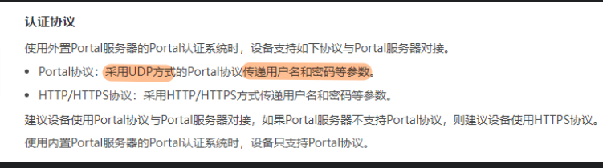
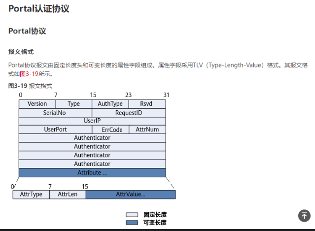
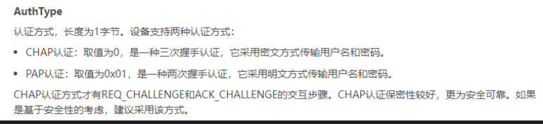
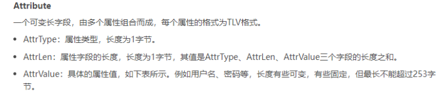
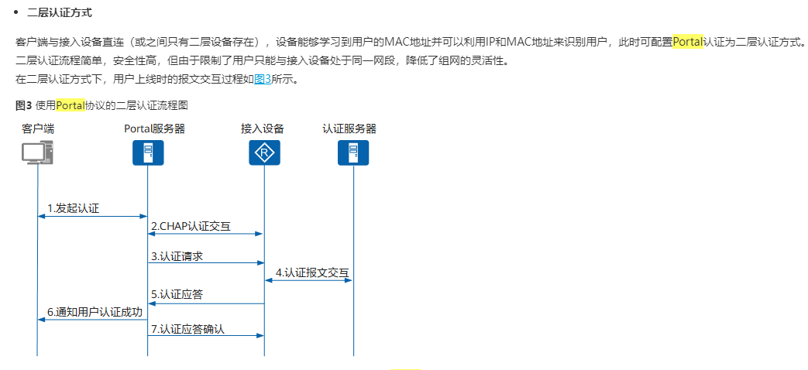
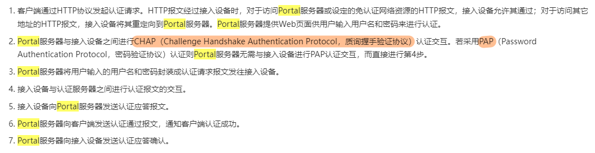
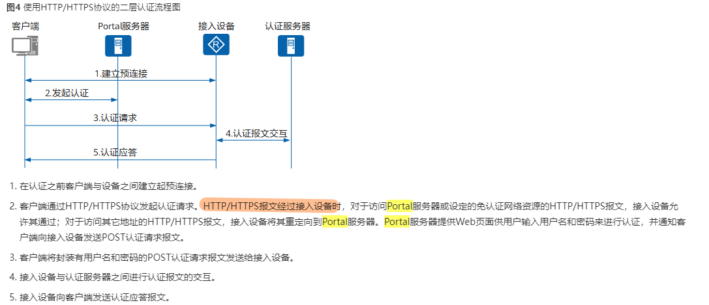

# NAC（网络准入控制）

## 1、用户登录网络时
```
可以主动认证（用户手工打开客户端进行认证）
或者触发认证（通过 ARP 报文、DHCP 报文、NS 报文等触发服务器的认证请求）
```

## 2、认证端设备（交换机、路由器）
```
会向客户端发起认证请求信息（如：CHAP 的挑战报文）
```

## 3、客户端需要输入用户名、密码信息响应认证请求
```
如果是 PAP 认证，可以主动发起用户名和密码信息
```

## 4、认证端设备会把这些认证信息封装到透传的报文中，传递给后台的认证服务器
```	
如：802.1x 认证为例，认证端设备会把用户信息封装到 EAPoL 报文中，透传给服务器（中继模式）
```

## 5、认证服务器对用户信息进行验证
```	
验证成功后，下发权限信息（如：VLAN “用于指定用户获取 IP 地址”，ACL “用于控制用户的访问行为”）

认证失败后，会跳转到隔离域（隔离域可以设置访问资源，如：FTP 服务器、用于下载客户端、或者更新补丁）
```

## 6、认证端设备收到授权信息后，回传给客户机
```
客户机可以通过授权信息获取 IP 地址和 ACL 信息

同时认证的策略执行点设备，会针对这些 ACL 信息执行访问控制
```

# 二、认证分类

## 802.1x 认证
### 特点：
```
需要用户安装客户端，如：PC（锐捷校园网）、服务器、手机等
支持的认证类型：EAP、PAP、CHAP 等
```
### EAP 支持
```
① EAP 中继：
    对 Radius 服务器的要求较高，服务器需要支持 EAP 和 Radius 服务，同时需要处理大量的报文信息

② EAP 终结：
    对中转设备要求较高，需要支持 EAP 协议和 Radius 协议，提取 EAP 报文中的用户信息，减轻服务器的压力
```
### 接口控制
```
① 接口模式：
    只要第一个用户登录，后续接入的设备均无需通过认证，都可以上网
    
    但第一次登录的用户退出后，所有用户都会离线
    （安全性较低，如果用户通过 HUB 或 LSW 接入网络，可以把端口开放给其他用户使用）

② MAC 模式：
    每个接入的用户都会记录 MAC 地址，如果 MAC 地址不一致，则无法上网
    
    用户下线，其他用户不受影响，每个用户独立认证（安全性更高）
```
### 工作过程：
```
1、客户端主动发起（在客户端软件主动输入用户名和密码进行接入）
    
    或者被动发起（客户端通过 DHCP 请求 IP 地址，或发出免费 ARP 激活，被动弹出客户端输入用户名和密码）

2、认证端设备收到后，会响应客户端的请求，请求客户端的用户名

3、客户端收到接入请求后（EAP-Request）会把用户名存放到 EAP-Response 报文中，传递给认证端设备

4、认证端设备收到后，会把 EAP-Response 报文存放到 Radius 报文中传递给认证服务器
    
    （这种方式称为 EAP 中继方式，
        认证设备作为客户端和 Radius 服务器的中转设备）

4、认证端设备收到后，会把 EAP-Response 拆开，提取出里面的用户名信息，封装到 Radius 报文中，传递给认证服务器
    
    （这种方式称为 EAP 终结方式，
        认证设备需要弹出 EAP 的报文，提取用户名）

5、认证服务器收到信息后，如果是 CHAP 认证，则认证服务器会先发起挑战报文（携带随机数、报文 ID）
    
    封装到 Radius 响应报文中，回传给认证端设备，再由认证端设备传递给客户端

6、客户端收到挑战报文后，会把（随机数 + 报文 ID + 本地密码）进行 MD5 运算，生成 Hash 值 = A
    
    通过 EAP 报文回传给认证设备，再由认证设备传递给服务器

7、服务器收到 Hash 值 A 后，本地也会进行计算（随机数 + 报文 ID + 本地密码）生成 Hash 值 = B
    
    对比 A 和 B 的结果，一致则通过认证，否则认证失败

8、服务器会根据 Hash 值对比的结果，返回认证成功或失败的信息，认证设备再根据结果选择是否打开端口
    
    打开端口，客户端可以上网，认证失败继续关闭端口
```
```
应用场景
    ① 办公网络：
        员工比较固定，对网络安全要求较高，且大部分设备均为 802.1x 的终端设备，可以安装客户端
   
   ② 园区网络：
        人员相对集中，且可以根据不同部门的用户分配访问权限

    不适合哑终端设备接入，如：打印机、摄像头、IP 电话等（无法安装 802.1x 的终端）和访客用户
```
## MAC 认证
```
可以通过提前收集终端设备的 MAC 地址，把 MAC 地址作为用户名来进行登录
```

### 工作过程
```
① 哑终端设备接入，如：摄像头，会主动发起 DHCP 报文，触发认证（其他报文：ARP、DHCPv6、NDP 等均可以）
	
② 认证端设备会直接查看数据包的源 MAC 地址，是否与本地配置的 MAC 地址一致
	如果一致，则认证端设备会自动填充密码，传递给认证服务器
		如果不一致，则不响应
	
③ 认证服务器通过认证后，会返回认证成功信息，开放端口
	适合于无法安装客户端的设备（哑终端），或者不想频繁输入用户名和密码的用户

	优点：
        可以快速认证
	缺点：
        安全性较差，且收集 MAC 地址的工作量巨大
```

## Portal 认证
```
通过客户端的 web 工具作为客户端，实现临时接入用户登录
```
### [Portal 协议](./01-03%20NAC配置.pdf)
```
1. Portal 协议采用 UDP 方式的 Portal协议传递用户名和密码
2. 报文采用 TLV 格式
3. 认证方式 PAP, CHAP
```





### 工作过程
```
① 客户端发起 http 或 https 服务时，与认证设备先建立预连接

② 认证设备会把客户端访问的网站或 IP 地址，跳转到 portal 服务器的认证界面（portal 服务器网页）

③ 客户端发起对 portal 服务器的访问，打开认证界面（需要输入用户信息，如：用户名、密码）

④ portal 服务器传递给 Radius 服务器进行鉴定
    *（根据传输协议的不同，可以分为 http/https 作为传输，或 portal 协议作为传输）
    
⑤ 认证成功后，Radius 返回认证结果
```

### 认证方式
#### 二层认证方式
##### 使用 Portal 协议的二层认证



##### 使用 Http/Https 协议的二层认证


#### 三层认证方式


