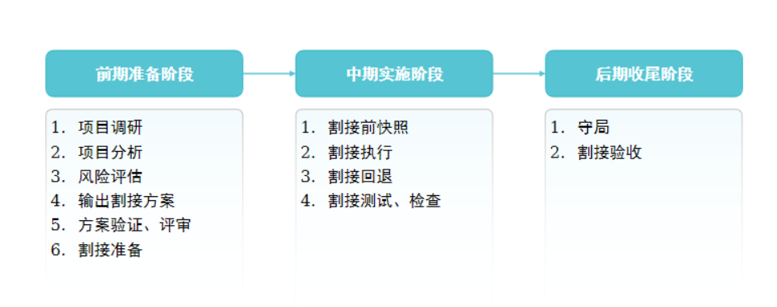

# 网络运维
[网络运维](../IE%20课件/13%20网络运维.pptx)

# 网络割接
```
割接项目
    如果对网络执行的技术迁移动作会影响现网运行业务，
    - 则在技术迁移项目实施时需严格地遵循 预先设定的操作流程 和 风险控制措施，
    - 一般将此类项目定义为 割接项目。
```

## 割接流程


[网络割接](../IE%20课件/15%20网络割接.pptx)
