# 双机热备份

```
VRRP：
	实现路由备份，提供虚拟IP作为网关，能够实现网关备份以及自动切换

VGMP：
	实现 VRRP 统一管理，防止上下行 VRRP 主在不同的设备上导致业务不通。
	- 防火墙有两个 VGMP 组
		- 一个叫 Master，初始优先级 65001，每个监视的端口 down 的优先级 减2
		- 一个叫 Slave， 初始优先级 65000，

HRP
	防火墙是基于状态的，配置以及会话等需要实现实时备份
	- HRP 就是用于做配置备份的。

	- HRP-M 就是 主
	- HRP-S 就是 备
	- 配置批量备份只可以从 主 到 备
		- 命令行部分主 备
		- 可以互相备份
```

# HRP (Huawei Redundancy Protocol)
参考 [强叔侃墙3](./强叔侃墙03.pdf)
## 作用
```
为什么需要 HRP？
    备份配置命令
```
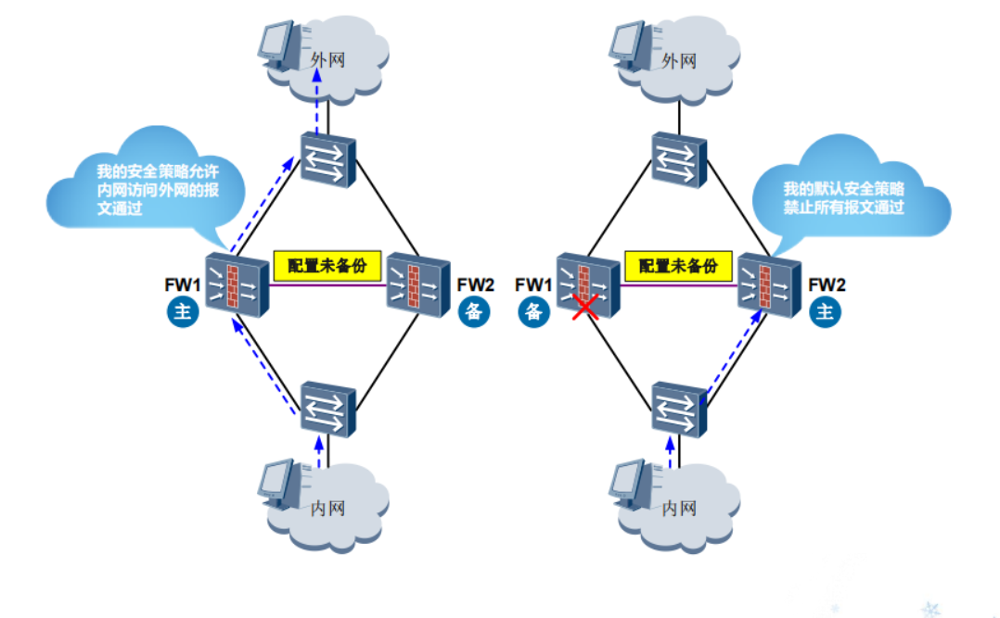
```
    因为 主设备上配置了 用户访问外网的安全策略

    - 如果 主设备 故障，
    - 使用 备用设备，
        - 备用设备没有设置 访问外网安全策略，
        - 用户将上不了外网


因为 防火墙属于 
    - 状态检测防火墙
    - 对于每一个动态生成的连接,都有一个会话表项与之对应。
        - 主用设备处理业务过程中创建了很多动态会话表项；而备用设备没有报文经过，因此没有创建会话表项。

    - 如果备用设备切换为主用设备前，会话表项没有备份到备用设备，
        - 则会导致后续业务报文无法匹配会话表，从而导致业务中断。
```
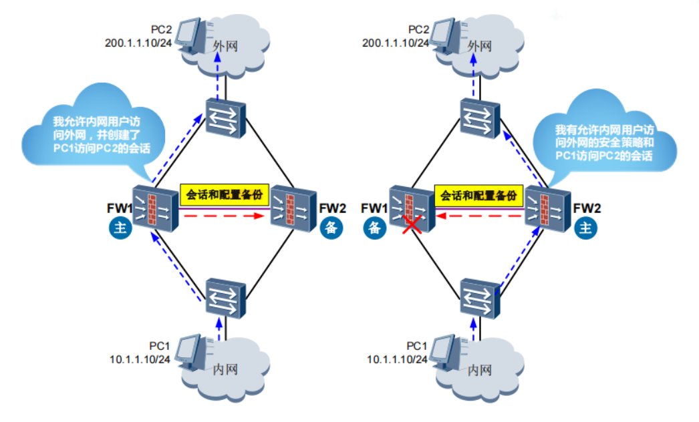

## 如何实现备份？
```
防火墙通过
    - 心跳线（HRP 备份通道）发送 和 接收 HRP 数据报文来实现 配置和状态信息的备份
```

### HRP 报文 
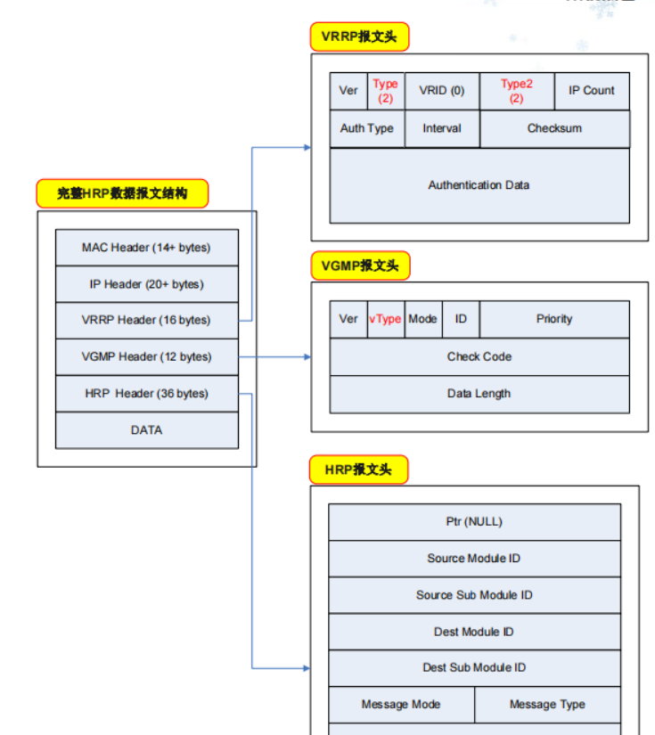

```
Source Module ID 和 Source Sub Module ID
    - 表示 本端防火墙哪一些特性需要备份
    - 和 子模块的数据需要备份

Dest Module ID 和 Dest Sub Module ID
    - 表示 需要向对端防火墙的哪一些模块
    - 和 子模块备份数据
```

### HRP 数据备份过程
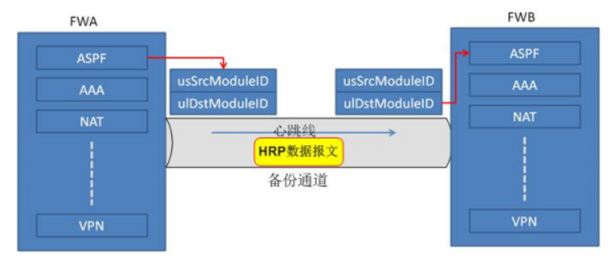
```
1. FWA在发送HRP数据报文时，
    - 会将 ASPF特性模块的ID 写入 HRP报文头 的“Source Module ID”和“Dest Module ID”字段中，
    - 并将 ASPF模块 的配置和表项信息封装到 HRP数据报文中。

2. FWA 将 HRP 数据报文 通过备份通道（心跳线）发送给 FWB

3. FWB 收到 HRP 数据报文后，会根据 HRP 报文中的“Source Module ID” 和 "Dest Module ID" 字段
    - 将报文中的配置 和 表项信息 发送到本端的
    - ASPF特性模块中，进行配置与表项的下发
```
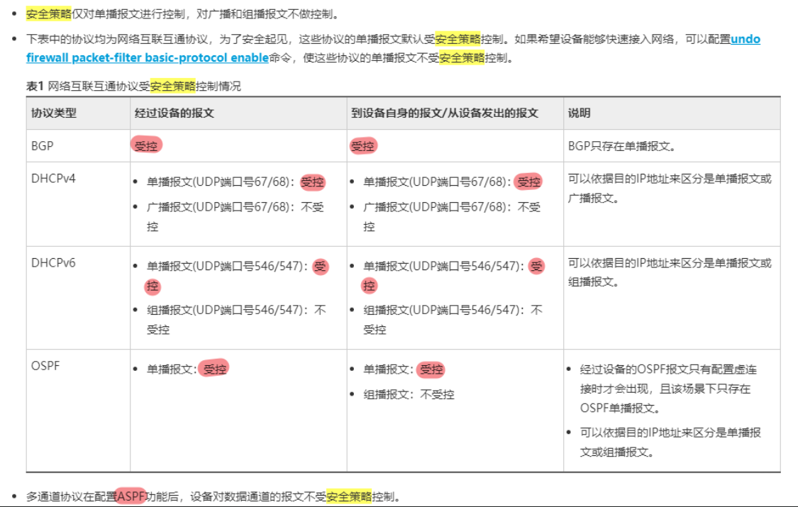
```
注意
    多通道协议
        - 配置了 ASPF 功能后，
        - 设备对数据通道的报文不受安全策略控制
```

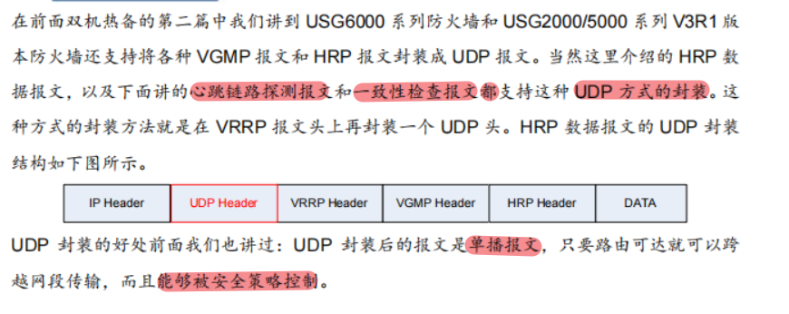

### HRP 能够备份哪些配置 与 状态信息？
#### 能备份的配置信息
```
防火墙能够备份的配置如下（以 HUAWEI USG6000 系列 V100R001 版本为例）

1. 策略：
    - 安全策略 、NAT策略 、带宽管理 、认证策略 、攻击防范 、黑名单 、ASPF

2. 对象
    - 地址 、地区、服务 、应用 、用户 、认证服务器、时间段 、URL分类 、关键字组 、邮件地址组 、签名 、安全配置文件（反病毒 、入侵防御 、URL过滤 、文件双机热备过滤 、内容过滤 、应用行为控制 、邮件过滤）

3. 网络
    - 新建逻辑接口、安全区域、DNS、IPSec、SSL VPN、TSM联动

4. 系统
    - 管理员、日志配置
```

#### 能备份的状态信息
```
这些配置需要在双机热备状态成功建立前配置完成。
    - 而上面支持备份的配置可以 
    - 在双机热备状态成功建立后，只在主用设备上配置。
```
```
     会话表
     SeverMap表
     IP监控表
     分片缓存表
     GTP表
     黑名单
     PAT方式端口映射表
     NO-PAT方式地址映射表
```

### HRP 备份的方向？ 什么是配置 主 和 配置 从设备？


```
那么在负载分担组网下，如何确定配置主和配置备设备呢？

    - 在负载分担组网下，最先建立双机热备状态的防火墙会成为配置主设备。也就是最先启用双机热备功能的防火墙会成为配置主设备。
```

### HRP 的几种备份方式？ 有什么特点？如何使用？
#### 自动备份
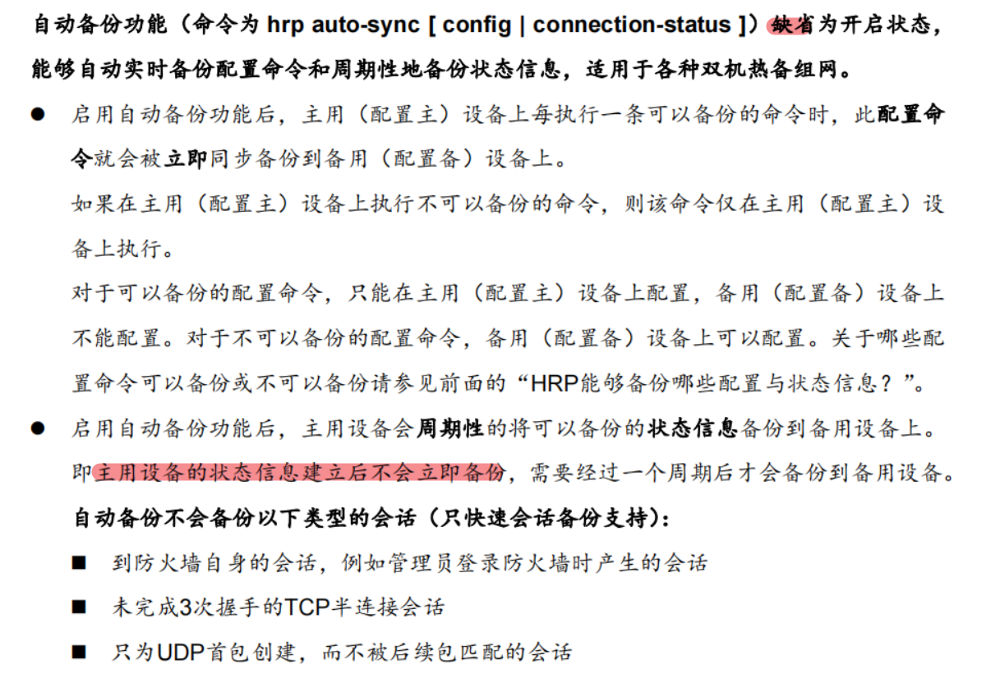

#### 手动批量备份
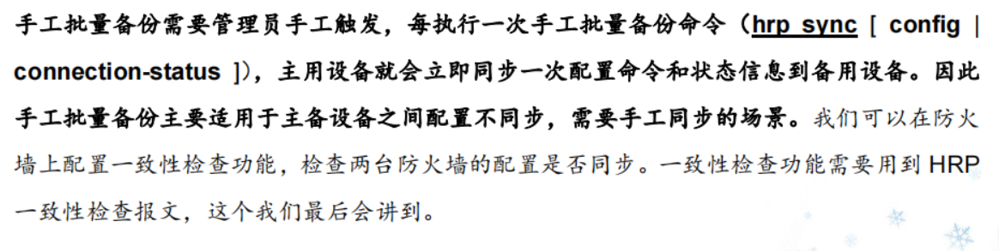


#### 快速备份
- 只是 备份状态信息，不备份 配置命令
- 配置命令的备份 是由 自动备份功能实现


### 综上三种备份方式
```
综上所示，三种备份方式的使用方式通常是：
    1. 自动备份（hrp auto-sync [ config | connection-status ]）默认开启，不要关闭；
    
    2. 如果主备设备之间配置不同步，需要执行手工批量备份的命令（hrp sync [ config | connection-status ]）；
    
    3. 如果是负载分担组网，一般需要开启快速会话备份功能（hrp mirror session enable）。
```

### 下面来讲解为什么快速会话备份特别适用于负载分担组网？
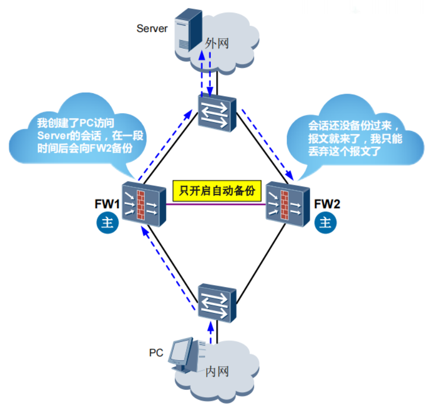
```
负载分担组网下，由于两台防火墙都是主用设备，都能转发报文，
    - 所以可能存在报文的来回路径不一致的情况，即来回两个方向的报文分别从不同的防火墙经过。
    - 这时如果两台防火墙的状态信息 没有及时相互备份，
    - 则回程报文会因为没有匹配到状态信息而被丢弃，从而导致业务中断。

为防止上述现象发生，需要在负载分担组网下配置快速会话备份功能，
    - 使两台防火墙能够实时的相互备份状态信息，
    - 使回程报文能够查找到相应的状态信息表项，从而保证内外部用户的业务不中断。
```

### 什么是心跳链路探测报文？与 HRP 心跳报文有什么区别？
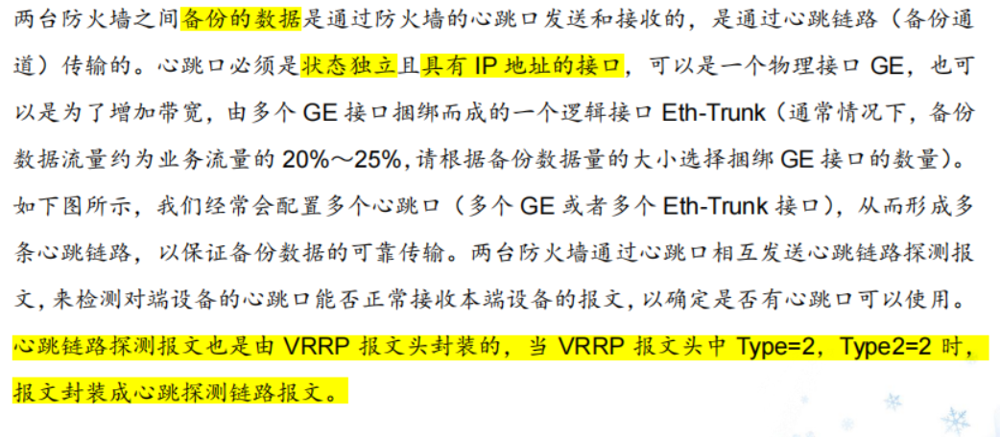
```
心跳链路探测报文也是由 VRRP 报文头封装的，
    - 当 VRRP 报文头中 Type=2，Type2=2 时，报文封装成心跳探测链路报文。
```
#### 心跳报文的五种状态(可以使用 display hrp interface 查看)
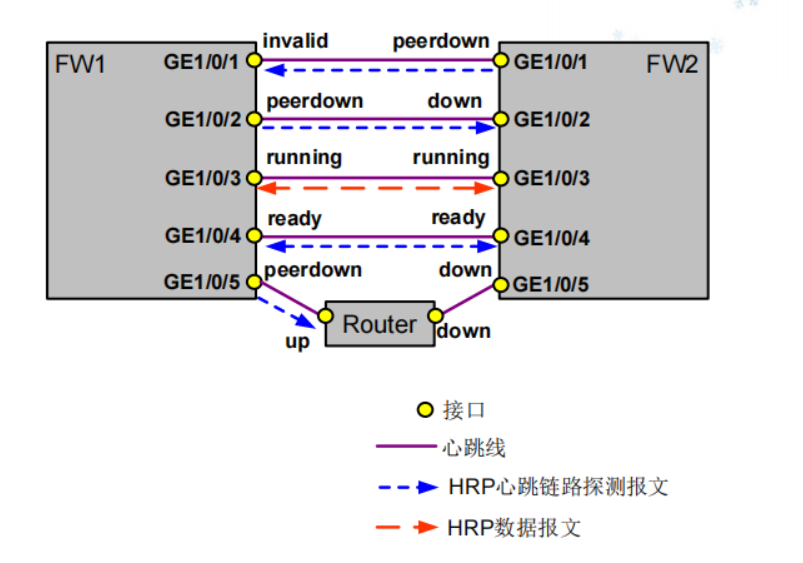

##### invalid：

##### down：

##### peerdown：

##### ready:

##### running:
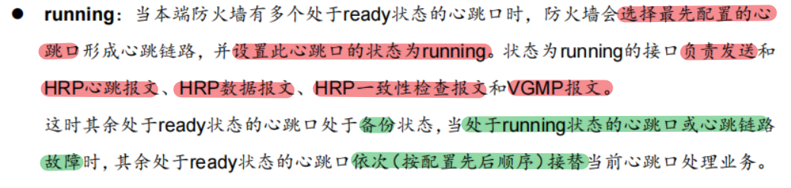

#### 两台防火墙的心跳口配置顺序不一致时的情况
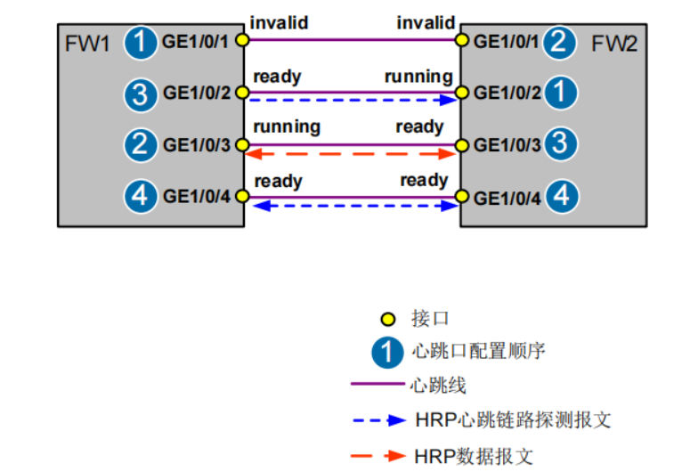
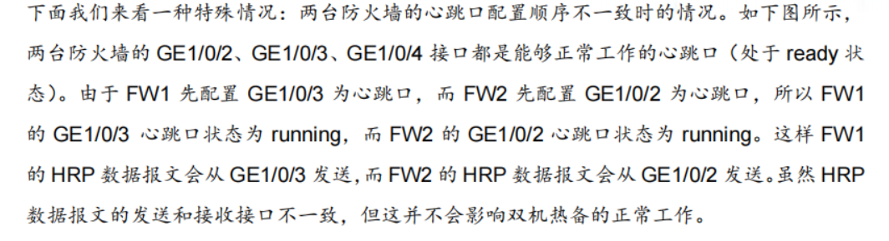

#### 总结 心跳链路探测报文和 HRP 心跳报文的区别
```
心跳链路探测报文

    - 用于检测对端设备的心跳口能否正常接收本端设备的报文，以确定心跳口是否可用的。

    - 只要本端心跳接口的物理和协议状态 up 就会向对端心跳口发送心跳链路探测报文进行探测。
```
```
HRP 心跳报文

    - 是用于探测和感知对端设备（VGMP 组）是否正常工作的。

    - HRP 心跳报文只有主用设备的 VGMP组通过状态为 running 的心跳口发出。
```
