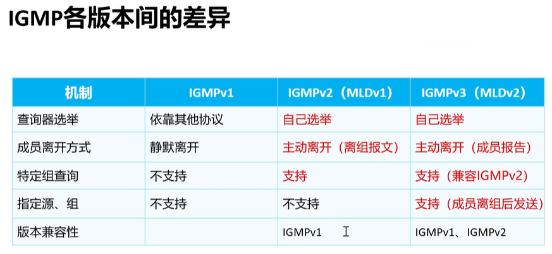
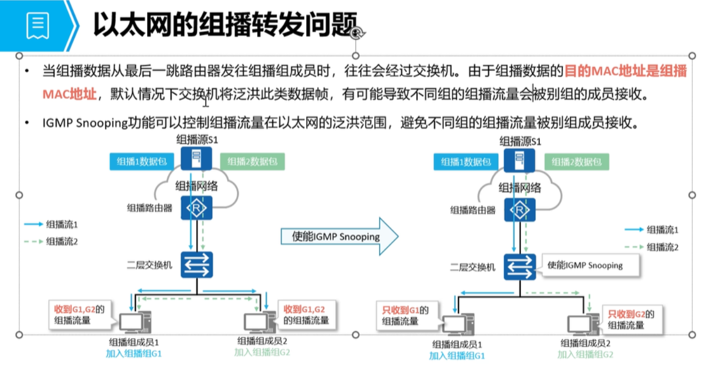
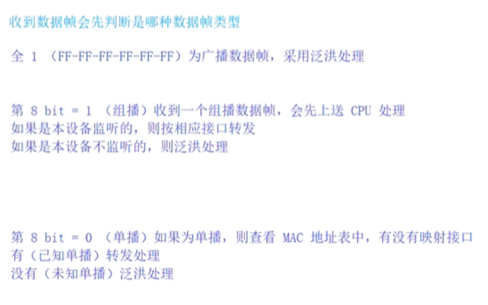
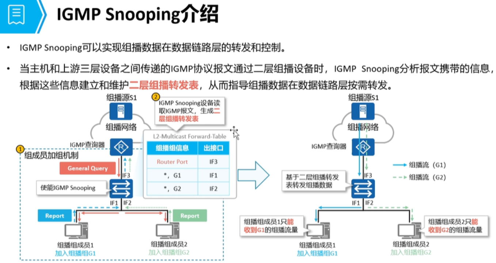
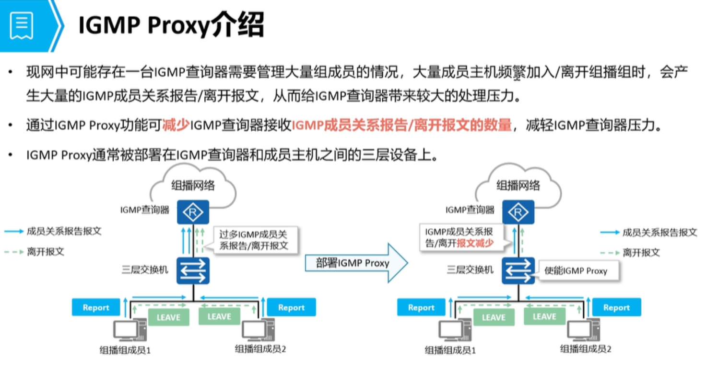
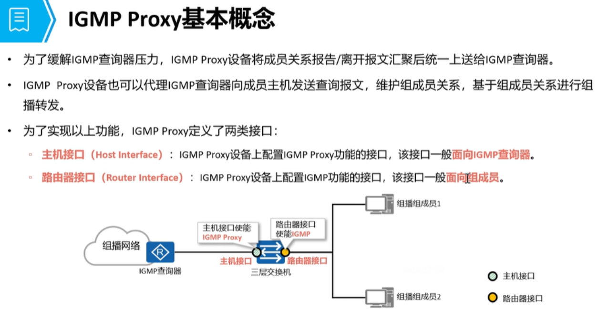
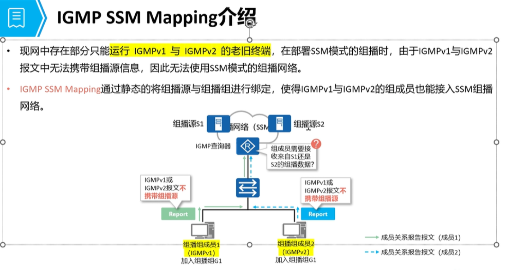

# IGMP (互联网组管理协议)
```
作用：
    维护组播组 与 组成员的关系
    （如：成员加组、成员离组 以及 成员需要接收的组播组信息）
```
## IGMPv1
### 报文
#### 1. 查询报文：
```
    ① 普遍组查询报文
        周期性（60s）发送用于查询组播组中是否存在组成员
```
#### 2. 成员报文
```
    ① 成员报告报文
        用于响应普遍组查询报文，当收到普遍组查询报文后，
        等待响应时间超时，超时后立即回复
        （告知查询器，本设备所加入的组播组）
```
### 工作过程
```
    1. 查询器主动发送普遍组查询报文，查看网络中是否存在组成员
    2. 组成员收到普遍组查询报文后，会主动发送成员报告报文（告知查询器本设备加入的组播组，以及组播组的关系）
    3. 组播成员也可以主动发送成员报告报文进行加组 
```
### 不足
```
    1. 没有查询器的选举机制，需要通过 PIM协议 的 DR 来充当查询器
    2. 成员静默离组
    （IGMPv1 没有成员离组报文，成员都是静默离开的（最长可能需要 130s 才得知成员离组）
```
### 特性
```
    IGMPv1 支持成员报告报文抑制：   
        在同一个组播组中，只需要以他成员响应即可，
        其他成员收到成员报告报文后会抑制本地发送
        （本设备就不会发送成员报告报文）
```

## IGMPv2
```
添加了（查询器选举机制、成员离组机制）

查询报文中还添加了最大响应时间
    （普遍组查询报文的响应时间为 10s，特定组查询报文的时间为 1s）
```
### 报文
#### 查询报文
```
    1. 普遍组查询报文：
        周期性（60s）发送用于查询组播组中是否存在组成员
    
    2. 特定组查询报文：
        收到成员离组报文后，会针对成员离开的组播组进行特定组查询，查看是否还存在其他组播组成员
```
#### 成员报文
```
    1. 成员报告报文：
        用于响应普遍组查询报文，当收到普遍组查询报文后，等待响应时间超时，超时后立刻回复
        （告知查询器，本设备所加入的组播组）
    
    2. 成员离组报文：
        当成员离组时，会主动发送成员离组报文，告知查询器某个组播组中有成员离开
```
### 工作过程
#### 成员加组
```
1. 查询器主动发送 普遍组查询报文，查看网络中是否存在组成员
2. 组成员收到普遍组查询报文后，会主动发送成员报告报文
（告知查询器本设备加入的组播组，以及组播组关系）
3. 组播成员也可以主动发送成员报告报文进行加组
```

#### 成员离组
```
1. 成员会主动发送离组报文，告知查询器需要离开的组播组
2. 查询器收到后会针对该组播组查询报文
    ① 如果有成员回复，则代表组播组中依然存在组播成员，不删除该表项，刷新老化时间
    ② 如果没有成员回复（2s）后会直接删除表项
    （把成员的离组时间缩短为 2s，减少组播流量的无效发送）
```

### 特性
```
1. IGMPv2 支持成员报告抑制：
    在同一个组播组中，只需要有一台成员响应即可，其他成员收到成员报告报文后会抑制本地发送
    （本设备就不会发送成员报告报文）

2. Last Reporter：
    为了避免成员离组后，查询器发送特定组查询报文，导致大量的成员回复
    
3. IGMPv2 还可以兼容 IGMPv1
    （IGMPv2 的查询器可以兼容 IGMPv1 的成员报告报文）
```

## IGMPv3
### 报文
#### 查询报文
```
    1. 普遍组查询报文：
        周期性（60s）发送用于查询组播组中是否存在组成员
    
    2. 特定组查询报文：
        收到成员离组报文后，会针对成员离开的组播组进行特定组查询，查看是否还存在其他组播组成员
        (特定组查询报文用于兼容 IGMPv2)
    
    3. 特定源/组查询报文：
        用于成员离开组播组后，查询特定的源和组中是否存在组成员
```
#### 成员报文
```
     1. 成员报告报文：
        用于响应普遍组查询报文，当收到普遍组查询报文后，等待响应时间超时，超时后立刻回复
        （告知查询器，本设备所加入的组播源）

    IGMPv3 的 成员报告报文 会携带 成员设备 与 组播的映射关系
```

### 模式
#### 1. 现有模式（用于响应普遍组查询报文，或 主动加组）
```
    1. INCLUDE：
        代表接收来自特定组播源的组播流量
    2. EXCLUDE：
        代表拒绝接收来自特定组播源的组播流量
```
```
    例如：
        现有源服务器（S1,S2,S3 都服务于 239.1.1.1 组播组）

    PC1 希望接收来自于 S1 和 S2 的组播流量，PC1 的成员报告报文中会携带，以上两个关系信息 
    G1 INCLUDE S1 , 
    G2 INCLUDE S2

    PC2 可以接收来自任意源的组播流量，但是拒绝接收 S1 的组播流量 G1 INCLUDE S1
```

#### 2. 过滤模式
```
    1. CHANGE_TO_INCLUDE_MODE:
        代表从 EXCLUDE 转换为 INCLUDE，
        如果源列表为空，则代表离开组播组
    
    2. CHANGE_TO_EXCLUDE_MODE:
        代表从 INCLUDE 转换为 EXCLUDE
```
```
    例如：
    1. PC2 从拒绝接收来自 S1 的组播流量转换为能够接收 S1 的组播流量
        
        CHANGE_TO_INCLUDE_MODE (S1)
            代表从拒绝接收S1源的组播流量，转发换为能够接收 S1 源的组播流量

    2. PC1 从接收 S1 和 S2 源的组播流量，转换为只接收 S1源的组播流量

        CHANGE_TO_EXCLUDE_MODE (S2)
            代表从接收 S2 源的组播流量，转换为拒绝接收 S2 源的组播流量
    
    补充：
        PC1 如果发送 G1，CHANGE_TO_INCLUDE_MODE（null）
        代表离开 G1 组播组，来自于该组的流量均不接收
```

#### 源列表模式
```
    1. ALLOW_NEW_SOURCES：代表从源列表中再接收些组播源
		如果原本的关系为 INCLUED（S1、S2）
		ALLOW_NEW_SOURCES（S3、S4）代表从接收来自于 S1、S2 源的流量，再添加上 S3 和 S4 源的组播流量
		修改后为（INCLUDE  S1、S2、S3、S4）			

		如果原本关系为 EXCLUDE（S1、S2、S3、S4）
		ALLOW_NEW_SOURCES（S3、S4）代表从拒绝接收 S1、S2、S3、S4 源的列表中，删除 S3 和 S4 源的组播流量
		修改后为（EXCLUDE  S1、S2）
			
	2. BLOCK_OLD_SOURCES：代表从源列表中删除这些组播源
		如果原本的关系为 INCLUDE（S1、S2、S3）
		BLOCK_OLD_SOURCES（S1、S2）从原有的 INCLUDE 列表中，删除这些源；
		最终改为  INCLUDE（S3）

		如果原本的关系为 EXCLUDE（S1、S2）
		BLOCK_OLD_SOURCES（S3、S4）从原有的 EXCLUDE 列表中，添加这些源；
		最终改为  EXCLUDE（S1、S2、S3、S4）
			
	补充：
	1. IGMPv3 没有专门的成员离开报文，
    查询器可以根据组播组成员的报告报文来判断成员是否离组，
    以及需要监听的组播组和组播源关系
	
    2. IGMPv3 也没有成员报告抑制
	如：PC1 关系为（INCLUDE S1、S2）代表 PC1 能够接收 S1 和 S2 的组播流量
		PC2 关系为（INCLUDE S2、S3）代表 PC2 能够接收 S2 和 S3 的组播流量
		（如果存在响应抑制则可能会导致 PC 设备无法遵循自身的选择接收组播源流量）
```

## IGMP 区别

### 对比
```
1、IGMPv1 没有查询器的选举机制，成员为静默离开

2、IGMPv2 相比于 IGMPv1 新增了查询器选举机制，成员主动离开（发送离组报文）成员离开后还会发送特定组查询报文，查看组播组是否还存在其他组成员

3、IGMPv3 相比于前两个版本，新增了指定源的能力，有查询器选举机制，也有成员离开机制（成员离开后会主动发送特定源\组查询报文，查看是否存在其他组成员）
```

## 配置命令
```
1、开启组播路由器协议（系统配置视图）
	multicast routing-enable 

2、进入终端连接的接口（或者网关接口）
	interface G0/0/X
	igmp enable						// 开启 IGMP 功能（默认：IGMPv2 版本）
	igmp version（1、2、3）

3、如果是 IGMPv1 版本，必须先开启 PIM 协议（IGMPv1 配置方式）
	interface G0/0/X
	pim dm 或 pim sm
	igmp enable
	igmp version 1						// 否则无法选举查询器，IGMPv1 无法正常工作

查看配置
	display igmp interface G0/0/0				// 可以用于查看接口的 IGMP 版本信息，查询间隔，最大响应时间等
	
	display igmp group					// 查看当前的组播组信息，last reporter、组播组地址等
```

# IGMP 特性
## IGMP snooping
### 作用
```
可以实现组播流量在（以太网）二层按需转发
运行了 IGMP snooping 后，交换设备会监听查询器 和 组播成员交互的报文生成二层组播转发表
```




### 表项信息（也能手工配置）
```
    1. 组播组 IP地址：
        根据成员报告报文生成
    2. 路由器端口：
        根据收到的 IGMP普遍组查询报文 和 PIM Hello 报文生成
    3. 成员端口：
        根据接收到的 IGMP成员报告报文生成
    4. VLAN ID：
        根据二层数据帧的头部 VLAN 生成
```

### 配置命令
```
    1、开启组播路由器协议（系统配置视图）
		multicast routing-enable 

	2、系统配置视图，开启 IGMP snooping 功能
		igmp-snooping enable
	
	进入相应 VLAN 
		vlan 1
		igmp-snooping enable

	查看信息
	display igmp-snooping port-info vlan 1		
    // 查看 VLAN 1 中的组播组和成员接口信息

	display igmp-snooping router-port vlan 1	
    // 查看 VLAN 1 中的路由器接口信息

	补充：手工指定成员接口
	interface G0/0/X
	l2-multicast static-group group-address 239.1.1.1 vlan 1		
    // 指定 G0/0/X 接口为成员接口（属于 239.1.1.1 组播组，VLAN 1）

	补充：指定为路由器端口
	interface G0/0/X
	igmp-snooping static-router-port vlan 1					
    // 指定 G0/0/X 接口为路由器端口，属于 VLAN 1
```

#### 接口时间
```
接口时间：
    手工指定的表项，没有老化时间
    动态学习的表项，根据报文时间来判断是否老化

    路由器端口:
        （使用普遍组查询报文学习，老化时间为：180s）
        （使用PIM Hello报文学习，老化时间与PIM hello 的 holdtime 一致，105s）

    成员端口老化时间为：
        （130s = 健壮系数 * 查询间隔 + 最大响应时间）
    
    动态端口收到成员报告报文，查询报文等会主动刷新时间
```

## IGMP proxy
### 作用
```
    减少查询器的工作压力
```


### 接口角色
```
    1. 主机接口（上行接口）连接查询器
    2. 路由器接口（下行接口）连接成员设备
```

### 代理功能
```
    成员加组：
        当代理设备收到组播组成员加组，会生成 2个表项
        一个是 IGMP Group 表，另一个是 proxy 表

        如果相同组中有多个成员加组，则只会向查询器发送一份成员报告报文
        中途如果有成员加组，代理设备的 proxy 有相应的组播表项，则不会向查询器发送报告报文


    成员离开：
        当设备收到成员离开报文，则会立刻发送特定组查询报文，查看是否存在组播组成员
        1. 如果有，则不向查询器发送成员离组报文
        2. 如果没有其他组播组成员，则才会删除表项并且向查询器发送离组查询报文
```

### 配置命令
```
    interface g0/0/0
    igmp-proxy enable
```

## IGMP mapping
### 作用

```
    可以使得 IGMPv1 和 IGMPv2 设备也能够指定组播源进行加组

    注意：
        使用 IGMP mapping 路由器必须为 IGMPv3 版本
```

### 配置命令
```
	1. 开启组播路由器协议（系统配置视图）
	multicast routing-enable 

	2. 进入终端连接的接口（或者网关接口）
	interface G0/0/X
	igmp enable						// 开启 IGMP 功能（默认：IGMPv2 版本）
	igmp version 3

	3. 配置 SSM mapping
	igmp
	ssm-mapping 239.1.1.1 32    1.1.1.1			// 代表加组 239.1.1.1/32 组时，选择 1.1.1.1 作为组播源 IP 地址（指定源）

	查看方式
	display  igmp ssm-mapping group				// 查看组信息及源 IP 地址映射关系

补充：如何让设备接入就能立刻获取组播组信息
	interface G0/0/X （静态加组）
	igmp static-group 239.1.1.1				// 指定该接口加入 239.1.1.1 组播组中（表项不会老化）
	
    弊端：该接口会持续收到 239.1.1.1 的组播流量，无论是否存在接收者	
```