# IPv6
## IPv6 书写格式
```
    采用冒号分16进制，将 128 bit 平均分为 8 个组，存在一种表现格式
    
    前缀表示法
        2001:1234:0000:0000:abcd:0000:aaab:abcd
```
## IPv6 地址缩写格式
```
    1. 每个组中的前导 "0" 可以省略，
        - 如果一个组全是 "0",可以缩写为一个 '0'
        2001:1234:0:0:abcd:0:aaab:abcd
    
    2. 地址中包含一个 或者 多个连续的组都为 0，可以用 "::" 代替
        2001:1234::abcd:0000:aaab:abcd
    
    注意：
        在一个 IPv6 地址中只能存在一个":",不能存在多个，因为会导致设备无法判断"::"代表了多少个 0
```

## IPv6 地址格式
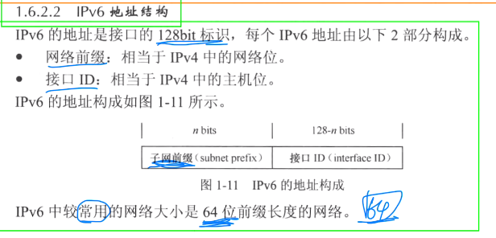
```
    1. 网络前缀：
        相当于 IPv4 中的网络位，
        前缀是工程师在网络规划的初期阶段设定好的网络范围
        
        在IPv6中最常用的网络前缀长度是 64位
    
    2. 接口ID： 
        相当于IPv4 中的主机位，存在两种产生方式
        
        - 手工配置
            - 一般服务器，打印机等设备进行手动配置
        - 自动产生(两种产生方式)
            - IEEE EUI-64 标准规范产生: 叫做扩展的唯一标识符，是最常用的接口ID产生方式
            - 系统通过软件自动产生
```


### EUI-64
```
    扩展的唯一标识符，根据设备网卡的 MAC地址，产生的IPv6后 64bit
        
        好处:
          MAC 地址是全球唯一，所以根据MAC地址产生接口ID部分，
          能够更有效的放置 IPv6 地址的冲突
        
        产生方式：
            1. MAC地址 ：          0012-3400-ABCD
            2. 在中间加入FFFE ：   0012-34FF-FE00-ABCD
            3. 写成IPv6地址格式：  0012:34FF:FE00:ABCD
            4. 将第 7 bit进行反转: 0212:34FF:FE00:ABCD

            反转： 
            1->0, 0->1

            当前缀不够64bit，而EUI-64只能产生64bit接口ID，
        剩余接口ID部分补0

            2001:1234:1234:: 48

        EUI-64 所产生：
            2001:1234:1234:0:2E0:FCFF:FE82:2C75
                           -                    
        
        当前缀超过64bit时，接口ID 如何产生？
            不能这么配置(华为)
            
        
        当接口没有MAC地址的时候，系统会通过系统软件自动生成

        
        一般在服务器 打印机 网络设备之间等，采用接口ID人为配置
        而其他终端设备大多采用自动配置

        
        风险：
            可能存在攻击者通过二层MAC反推出IPv6地址 接口ID
```

## IPv6 地址类型
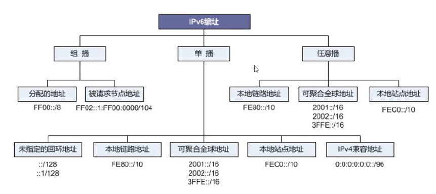

```
1. 未指定地址
    ::/128
        用于标识一个没有实际IPv6地址的接口，类似IPv4的 0.0.0.0

        不能分配给任何节点

2. 回环地址
    ::1/128
        类似IPv4的 127.0.0.1/8 一般用于本地测试
    
    不能分配给任何物理接口

3. 链路本地地址 (Link-local address， LLA)
    范围:  FE80::/10
    
    作用：
        使运行了IPv6协议的链路两端，天生就有三层通讯能力，无需像IPv4 接口一样配置
    
    作用范围：
        只局限于本地链路
    
    产生方式：
        1. 动态产生：当接口开启IPv6功能之后，将会自动调用EUI-64方式产生LLA地址
        2. 人为配置：
            ipv6 address FE80::2 link-local
    
    用途：
        riping 以及OSPFv3 都会使用该地址作为协议报文的源地址
        路由表项下一跳是该地址
```

### 单播地址
- 
- 可以分为：
    - 链路本地地址（Link-local）
        - 可以在节点配置全球单播地址的前提下，任然互相通信
        - 使用特定前缀 FE80::/10，接口使用 EUI-64生成
        - 每个 IPv6接口都必须具备一个链路本地地址

    - 唯一本地地址
        - 是IPv6 网络中，可以自己随意使用的私有网络地址
        - 使用特定前缀 FD00/8
        - 唯一本地地址的设计使私有网络地址具备唯一性，既使任两个使用私有地址的Site互联也不用担心地址冲突
        - IPv6 唯一本地地址
            - 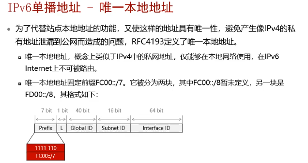

    - 全球单播地址
        - 相当于IPv4中的公网地址
        - 已经分配出去的前3位固定为 001
            - 所以已分配地址为 2000::/3

#### 嵌入IPv4 地址的 IPv6 地址
- 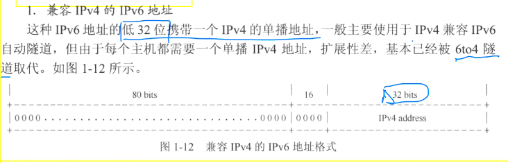
- 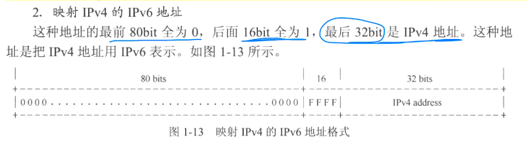
- 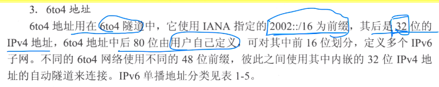

#### IPv6 单播地址分类
- 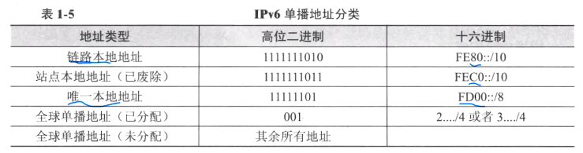

### 任拨（Anycast）
#### 概念
- 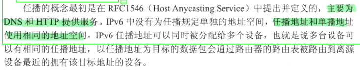

#### 分类
- 任拨
    - 基于网络层面的任拨
    - 基于应用层面的任拨
    - ```
        区别：
            网络层的任拨: 
                仅仅依靠网络本身来选择目标服务器节点

            应用层的任拨:
                基于一定探测手段和算法来选择最好的目标服务器节点 
      ```

### 组播（Multicast）
- IPv6 中不存在广播报文，部分广播的应用使用组播来实现

#### 地址构成
```
    组播地址标识一组接口，目的地址是组播地址的数据包会被属于该组的所有接口所接收
```
- 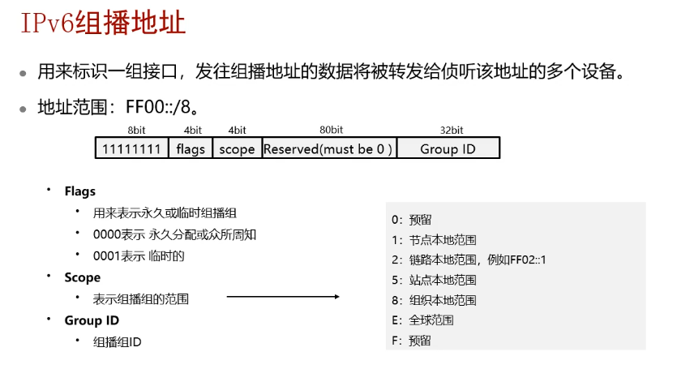
- 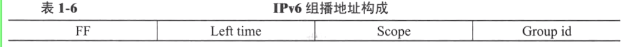
- 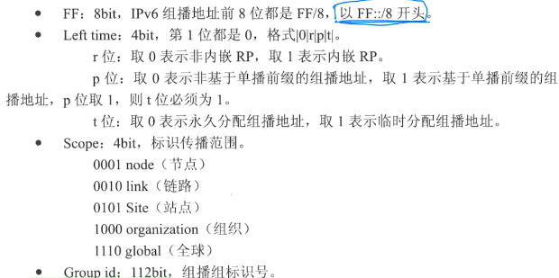
- 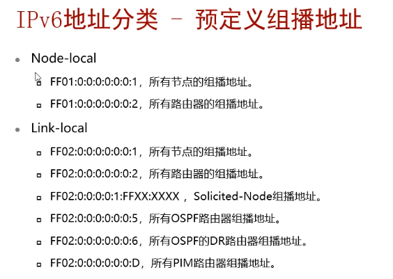
- 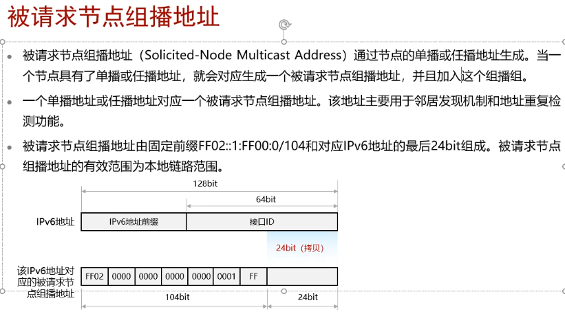

- 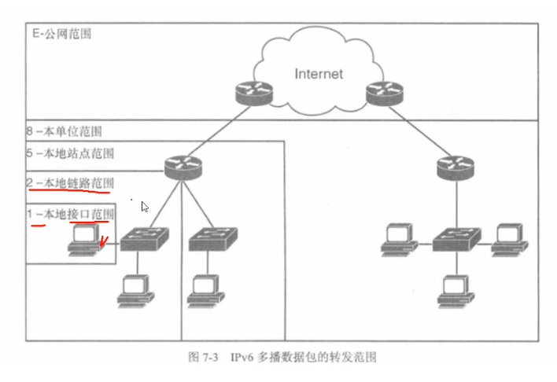

## IPv6 报文
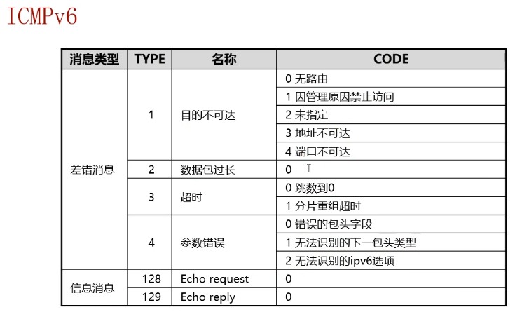
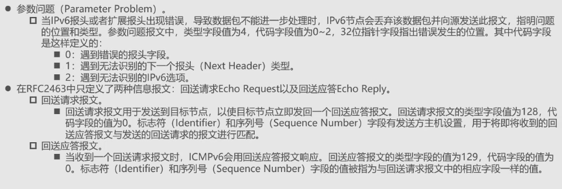

### RS 消息
- 作用：
    - 当主机刚接入网络中并且配置为自动获取地址
    - 主机需要自动获取前缀，前缀长度等信息，就会发送RS消息

### RA 消息
- RA消息由路由器周期性发送，或 在收到主机发送的RS消息后立即发送
    - 为主机提供编制信息 以及 其他配置信息
    - 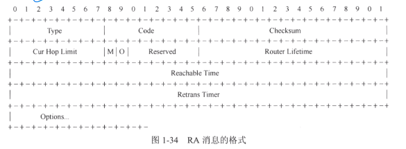
    - 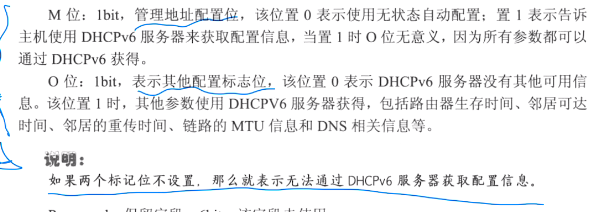

### IPv6 设备通过RS RA 消息实现
- 无状态自动配置
- 路由器发现

### NS 消息
- 作用
    - 获取目标地址的链路层地址(通过组播方式发送: 目标地址是被访问地址所对应的被请求节点组播地址)
    - 检测邻居可达性
    - 进行地址冲突检测

```
    注意；
        当节点需要验证邻居的可达性时，将发送单播的NS消息，在DAD(地址冲突检测)，源地址是 未指定地址
```

### NA 消息
- 节点收到NS消息后，如果 NS中源地址 不是未指定地址
    - 会通过 单播 方式回复NA消息
    - 如果是未指定地址
        - 通过组播方式会回应

### 重定向消息
- 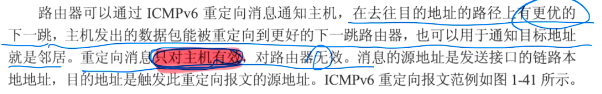

## NDP 协议 （IPv6 邻居发现协议）
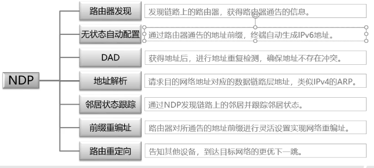

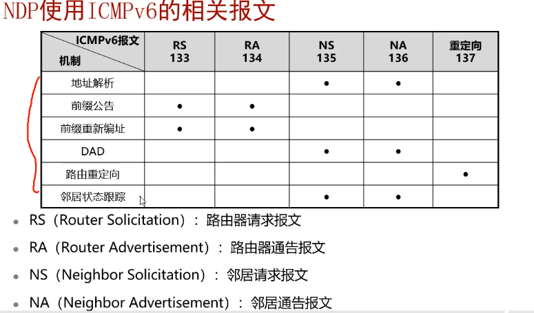

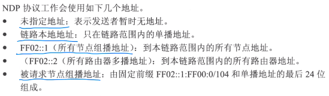

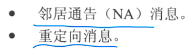

### 无状态自动配置
- 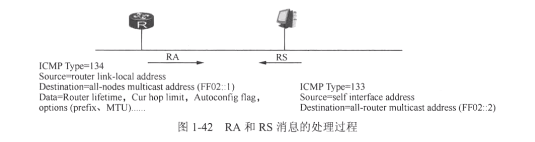
- 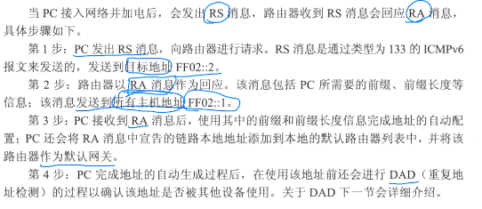

### 路由器发现
- 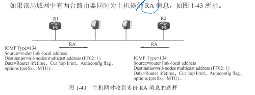
    - 每个RA消息中有一个 Router Preference 用于标记主机的选择默认网关
    - Router Preference 分为3个等级 low medium high
        - 华为设备 默认 medium
    - 优先级高的路由器作为默认网关
    - 如果优先级相同，则都作为默认网关，实现负载均衡
    - 路由器(华为)每隔 200-600s 内的一个随机值发送 NA报文
        - 华为默认不开启RA通告
    - 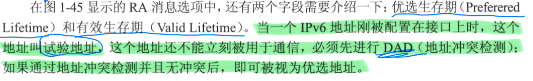

### NS 和 NA 实现的功能
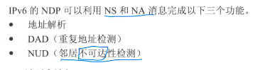

## 地址解析
```
概念
    使用NS 和 NA 消息来完成IPv6 地址到链路层地址映射的过程
```
### 过程
- 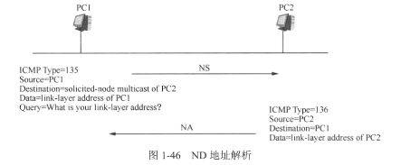
1. PC1 向 PC2 发送 请求节点的组播地址发送 NS 消息
2. PC2 收到后通过 单播方式回应PC1 NA 消息，消息中包含了PC2 的 MAC 地址
    - PC2 会将 PC1 的 IPv6 地址 和 MAC 地址添加到本地邻居缓存表中
3. PC1 收到 PC2 的NA消息后，将 PC2 的 IPv6 地址 和 MAC 地址添加到本地邻居缓存表中

- ping ipv6 报文
    - 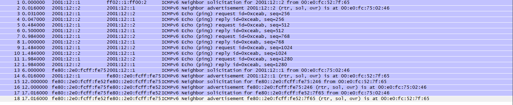

## DAD （重复地址检测）
- 作用
    - 用于检测自己用的IPv6 地址是否被其他设备使用

### 过程
- 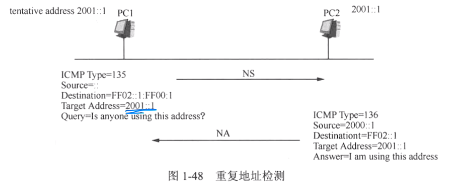
    1. PC1 配置2001::1，（该地址在DAD过程之前称为 试验地址）
    2. PC1 发送 NS消息，目标为2001::1 对应的请求组播地址
    3. 如果PC2的地址2001::1 ，则收到NS消息后会回应，告诉PC1自己在使用该地址
        - 否则响应
    4. PC1 发送 NS时候会设置一个定时器，
        - 如果超时时间内收到响应，说明地址被占用
        - 超时，则说明地址可以使用，地址就会从试验状态切换为已分配状态

## NUD (邻居不可达性检测)
- 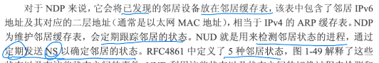
- 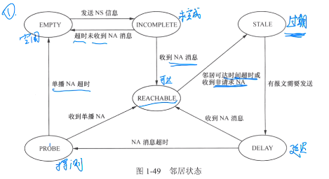
    - INCOMPLETE (未完成状态)
        - 此状态表示地址解析还在进行，本机已经发送 NS消息，但是还没有收到 NA回应
    - REACHABLE（可达状态）
        - 表明已经收到对方的 NA消息，获得对方的链路层地址
    - STALE（过期状态）
        - 邻居可达时间超时
        - 或者 收到了邻居发送的 非请求NA消息，携带的链路层地址和本地表项中地址不匹配，直接变为 STALE状态
    - DELAY（延迟状态）
        - 不稳定的状态，是延迟等待状态
        - 当处于 STALE 状态的邻居发送报文时，邻居状态变为DELAY，同时发送NS消息
    - PROBE（探测状态）
        - 节点会向处于PROBE状态的邻居持续发送单播NS报文
            - 如果持续收不到NA回应，则删除该表项
            - 收到则状态变为 REACHABLE
    - EMPTY（空闲状态）
        - 节点上没有相关邻接点的邻居缓存表项

### 地址解析 和 邻居状态跟踪 的区别
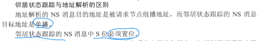

## 重定向原理
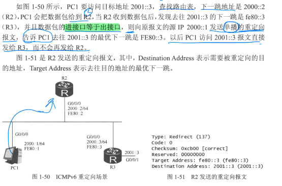