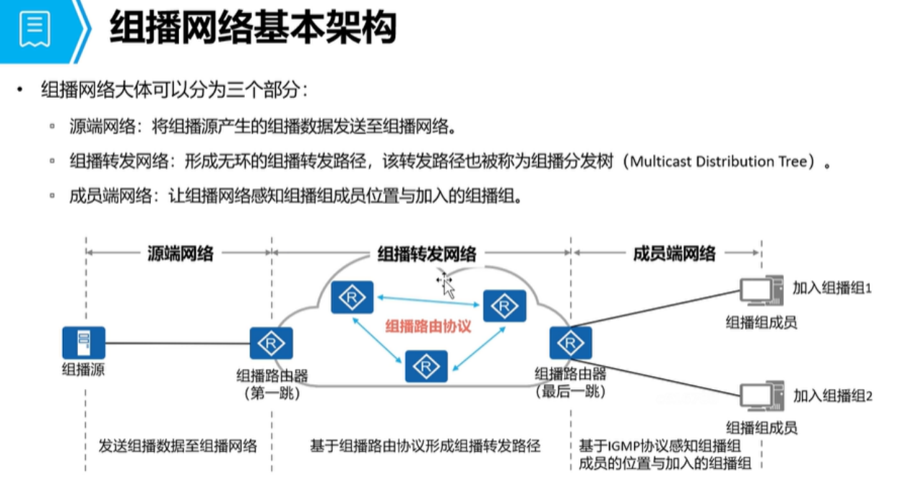

# IP 组播基础
## 传输方式(IPv4)
### 单播
```
1. 单播(A,B,C类地址)  1:1 的转发方式
    A 类： 0.0.0.0 - 127.255.255.255 (固定前缀 0)
    B 类：128.0.0.0 — 191.255.255.255（固定前缀 10）
	C 类：192.0.0.0 — 223.255.255.255（固定前缀 110）

	优点：
        ① 安全性较高，只发送给目的用户
        ② 只要路由可达，就能跨越广播域和三层设备转发

	缺点：
        ① 流量的产生源设备、和中转设备都会占用大量的设备资源和链路带宽
        ② 数据的信息可能会不一致（如：目的地址信息）对源设备产生数据的压力非常大
```
### 广播
```
2. 广播：
    （255.255.255.255 或主机地址为全 1 的也为广播地址，
      如：192.168.1.255/24）1:all 的转发方式
	
    优点：
        ① 可以减少源设备和中转设备的压力（如：设备资源的占用和链路带宽的占用）
        ② 数据包有一致性保障（所有用户收到的信息都是一致，同一份数据包）
	
	缺点：
        ① 广播流量无法跨越广播域，传输范围受限
        ② 无法指定接收者，可以能导致安全性问题（如：信息泄露）
```

### 组播
```
3. 组播：
    （D 类地址）1:N 	（根据组播转发表，把组播流量发送给对应的组设备）
	（224.0.0.0 — 239.255.255.255）固定前缀（1110）

	优点：
        ① 与广播设备类似，源设备仅需要产生一份组播流量即可转发给所有的组播接收者
            （减少设备资源占用和链路带宽占用）
        ② 可以根据组播转发表跨越三层设备转发（转发范围相比广播更大，组播流量会根据转发设备逐跳生成，逐跳转发）

	缺点：
	    ① 需要额外运行组播协议（IGMP、PIM 等）额外占用设备资源，且需要维护大量的组播协议
```

## 组播地址分类
### 永久组播地址
```
永久组播地址：为协议预留，由固定协议使用
	范围：224.0.0.0 — 224.0.0.255
	
    ① 所有网络节点组地址：224.0.0.1
	② 路由器组地址：224.0.0.2
	③ OSPFv2 组播地址：224.0.0.5、OSPFv2 的 DR 组播：224.0.0.6
```

### 特定源组播地址
```
特定源组播地址：服务于 SSM 模型，组播流量必须指定源 IP 地址才能接收
	范围：232.0.0.0 — 232.255.255.255
```

### 本地管理组播地址
```
本地管理组地址：组播的私网地址（不传输到公网）服务于 ASM 模型
	范围：239.0.0.0 — 239.255.255.255
```

### 任意源组播地址
```
任意源组播地址：可以给用户或者企业使用，临时的任意组播地址，服务于 ASM 模型
	范围：224.0.1.0 — 231.255.255.255
		  233.0.0.0 — 238.255.255.255
```

## 组播 MAC 地址通过 IP地址进行映射
```
固定前缀 (25bit)：
    01-00-5E-0
    
    （后23位 由 IPv4 组播地址映射（IPv4组播地址，固定前缀为 4bit， "1110" 所以剩余 28bit）

补充：
      组播MAC 仅需要 23bit 即可以完成映射，但是 IPv4 组播地址有 28bit，
    会导致 5bit 没有对应的映射关系，会导致 32个 组播IP地址映射相同的 MAC地址

    224.0.0.1  1110 0000 . 0000 0000 . 0000 0000 . 0000 0001
    225.0.0.1  1110 0001 . 0000 0000 . 0000 0000 . 0000 0001 
    // 后面的 23 bit 一致 “000 0000 . 0000 0000 . 0000 0001”

    所以使用相同的组播 MAC 地址：
        01-00-5E-00-00-01
```

## 组播工作模式
### 1. 组播源
- 产生组播流量，并转发到第一跳路由器

### 2. 组播转发路径
- 由第一跳路由器（源端 DR）到最后一跳路由器（成员端 DR）组成
    - 并且需要运行组播协议生成组播分发树（一般为 PIM 协议，生成 S,G 或者 *， G 表项）

### 3. 成员端路径
- 由最后一跳路由器（成员端 DR） 和 组播接收者组成
    - 需要运行 IGMP 或 MLD 等协议，维护组播组 和 成员映射关系


