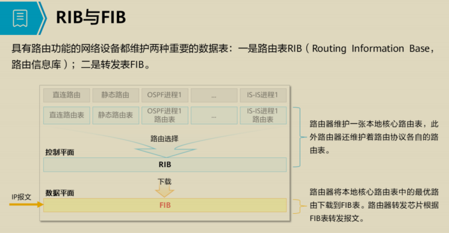
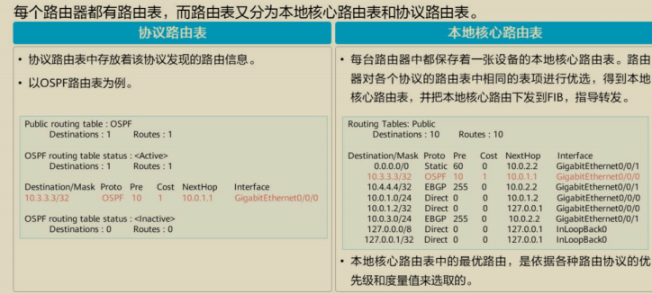
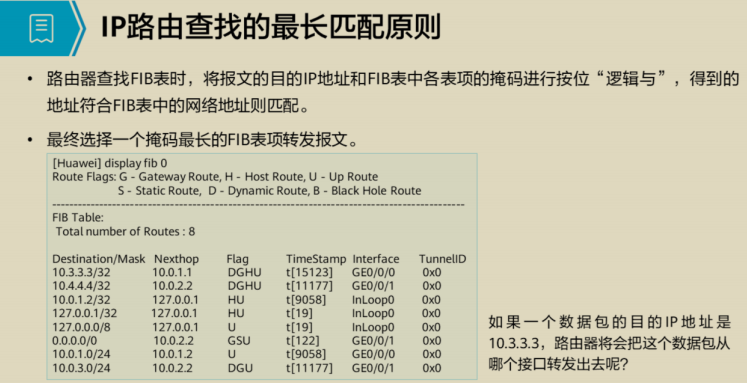
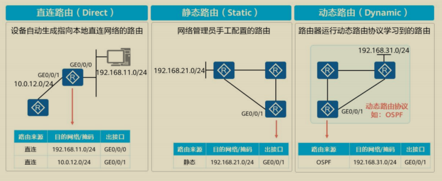

## IP 编址
### 一、IP 编址
1. 网络部分：代表主机的所属网段，判断是否同一个网段内
2. 主机部分：代表相同网段中的，唯一，一台主机
3. 网络掩码：网络掩码用于标识网络部分，掩码为 1 代表网络部分对应，并且固定不变， 掩码为 0 ，代表主机部分，主机部分可变，可以为 1 也可以为 0

IPv4 地址长度（32） = 掩码长度 + 主机地址长度
```bash
例如：10.1.2.3/24         24 代表掩码的长度，有 24 个网络地址固定
	0000 1010 . 0000 0001 . 0000 0010 . 0000 0011  =  10.1.2.3 ( IP 地址)
	1111 1111 . 1111 1111 . 1111 1111 . 0000 0000  =  掩码长度

	网络地址中， 10.1.2 是无法改变的，因为掩码为 1 映射固定
	所以网络部分为：10.1.2.
	主机部分为：3 （0000 0011）	 主机部分是可变的，3 只能代表主机部分的其中一台设备
	主机地址 = 2 的 N 次方， N 等于主机位的长度（8），所以主机地址数量 = 2 的 8 次方（256 个地址）


# 主机使用的地址为单播地址，分为 3 类，A、B、C 三类地址（称为有类 IP 地址）
通过 IP 地址的前 8 bit 范围来分类
# A 类地址，第 1 bit 固定为 0
	取值范围：0—127，地址（0.0.0.0 — 127.255.255.255）			有类地址有固定的掩码长度，也就是固定的网络地址范围
				128、64、32、16    8、4、2、1  = 255		A 类地址掩码长度为：8           主机位：24
			 	 0      X     X     X     X   X   X   X

# B 类地址，前 2 bit 固定为 1 0
	取值范围：128—191，地址（128.0.0.0 — 191.255.255.255）		B 类地址掩码长度为：16          主机位：16
				128、64、32、16    8、4、2、1  = 255
			 	 1      0     X     X     X   X   X   X

# C 类地址，前 3 bit 固定为 1 1 0
	取值范围：192—223，地址（192.0.0.0 — 223.255.255.255）		C 类地址掩码长度为：24           主机位：8
				128、64、32、16    8、4、2、1  = 255
			 	 1      1      0     X     X   X   X   X
	例如：192.168.1.1 是一个 C 类地址，10.1.1.1 是一个 A 类地址
	掩码长度 + 主机位长度 = 32 （无论怎么改变长度，它们的和都是等于 32 的）掩码越长，主机位越短，能用的地址就越少，反之地址容量越大
	一个 C 类地址的地址数量为：256，  2的N次方 （N = 主机位长度）  B 类地址数量为：2的16次方 = 65536

	# 但是每个网段中都会保留2个特殊地址
	# ① 网络地址：用于标识主机是否属于相同网段  （以 C 类地址  192.168.1.1  为例）
			网络地址是主机位为全0的，192.168.1.0/24

	# ② 广播地址：在相同网段中，广播地址发送的数据包，所有主机都能收到
			广播地址是主机位为全1的，192.168.1.255/32

	所以可用的地址范围，等于（2的N次方-2），一个 C 类地址段，总共有 254 个可用主机地址
```

### 二、VLSM（可变长子网掩码）
	网络位向主机位，借位，来划分子网段
	可以根据可用地址数量来进行计算，2的N次方-2 >= 所需的地址数量                    
    
    掩码长度 + N(主机位长度) = 32
	
	CIDR（无类域间路由，路由汇总）主机位向网络位借位
## IP 路由基础
### IP 路由概述
```
当路由表收到一个 IP 报文时，路由器根据该 IP 报文的 目的地址 匹配路由条目(或路由表项)
	- 若有匹配的路由条目，则依据该条目中的出接口 或 下一跳等信息进行报文转发
	- 若无匹配的路由条目，则路由器没有相关路由信息用于指导报文转发，此时丢弃该报文
```
#### RIB 与 FIB

```javascript
- 路由表
	- 可以将路由表视为位于路由器的控制平面，实际上路由表并不直接指导数据的转发。
	- 路由器在执行路由查询时，并不是在路由表中进行 报文的目的地址 的查询
	- 真正指导数据转发的是 FIB 表，路由器将路由表中的最优路由下载到 FIB 表
	- 此后如果路由表中的相关表项发生变化，FIB 表也将立即同步

	- 实际上 路由器查询的是 FIB 表，位于控制层面的路由表只提供路由信息

- FIB 表
	- 位于路由器的数据平面，也称为 转发表项， 每条转发表项都指定要达到某个目的地所需通过的出接口 及 下一跳 IP 地址 等信息

· OSPF （Open Shortest Path First，开放式最短路径优先）和 IS-IS（Intermediate System to Intermediate System，中间系统到中间系统），均基于 链路状态信息， 使用最短路径优先算法进行路由计算。

· 路由进程: 路由器支持 OSPF 和 IS-IS 多进程，可以根据业务类型划分不同的进程，不同进程之间相互独立。
	- 进程号 是 本地概念， 不影响其他路由器之间的报文交换。
	- 因此，不同路由器之间，即使进程号不同也可以进行报文交换
```

#### 路由表


#### IP 路由查找的最长匹配原则


```javascript
- FIB 表中每条转发项都 
	- 指明 到达某网段或某主机的报文应通过路由器的哪个物理接口 
	- 或 逻辑接口发送，然后就可到达该路径的下一个路由器，
	- 或者 不在经过别的路由器 
	- 而传送到直接相连的网络中的目的主机

• FIB表信息查看命令：display fib [ slot-id ]
	▫ slot-id：显示指定槽位号的FIB表信息。整数形式，取值范围请根据设备实际配置选取。
• FIB表中的字段说明：
	▫ Total number of Routes：路由表总数。
	▫ Destination/Mask：目的地址/掩码长度。
	▫ Nexthop：下一跳。
	▫ Flag：当前标志，G、H、U、S、D、B的组合。
		▪ G（Gateway）：网关路由，表示下一跳是网关。
		▪ H（Host）：主机路由，表示该路由为主机路由。
		▪ U（Up）：可用路由，表示该路由状态是Up。
		▪ S（Static）：静态路由。
		▪ D（Dynamic）：动态路由。
		▪ B（Black Hole）：黑洞路由，表示下一跳是空接口。
	▫ TimeStamp：时间戳，表示该表项存在的时间，单位是秒。
	▫ Interface：到目的地址的出接口。
	▫ TunnelID：表示转发表项索引。该值不为0时，表示匹配该项的报文通过隧道转发
	（如：MPLS隧道转发）。该值为0时，表示报文不通过隧道转发。
```

#### 路由的来源

- 动态路由
	- 路由器通过动态路由协议(如 OSPF，IS-IS，BGP等)学习到的路由
		- BGP (Border GateWay Protocol，边界网关协议)
			- 是一种实现 AS (Autonomous System, 自治系统)之间的路由可达，并选择最佳路由的距离矢量路由协议
		- AS 是指在一个实体管辖下的拥有相同选路策略的 IP 网络

#### 动态路由协议
```javascript
- 动态路由协议根据作用范围不同，可分为：
	- 内部网关协议 IGP (Interior Gateway Protocol):
		- 在同一个自治系统内部运行。常见的 IGP协议 包括 OSPF 和 IS-IS
	- 外部网关协议 EGP (Exterior Gateway Protocol):
		- 运行于不同自治系统之间。BGP 是目前最常用的 EGP 协议
```

#### 路由迭代
```javascript

```