# ISIS协议

## 一、ISIS是属于链路状态协议的一种，集成的ISIS可以工作在TCP/IP和OSI网络模型
```
 地址格式：（8B ~ 20B）
 地址组成：
    area id +  system id    +  sel 
    49.0001 . 0000.0000.0001  .00

    area id： 区域ID
    
    system id 始终占6B；

    sel（特殊标识符） 是占 1B；
```
## 二、设备等级
```
  ISIS设备可以分为：
    - L1
    - L2
    - L1-2（L是level的意思）

    设备默认属于：L1-2设备
```

### 邻居建立规则
```
  建立邻居：
    - L1设备，必须和相同的area id的设备建立邻居
    - L2设备，可以与相同或者不同的area ID的设备建立邻居

  L1只能和L1或者L1-2的设备建立L1的邻居
  
  L2只能和L2或者L1-2的设备建立L2的邻居
  
  L1-2设备可以与L1设备建立L1邻居
  
  L1-2设备可以与L2设备建立L2邻居
  
  L1-2设备可以与L1-2设备同时建立L1和L2邻居
```

### 注意
```
    L1-L2 的设备之间可以同时建立L1和L2的邻居，所以会建立两条邻居 L1 和 L2

    一个 IS-IS进程下，可以支持 3个区域id，但是系统id 必须一致

        作用： 
            可以让邻居平滑过渡到不同区域
```
- topu
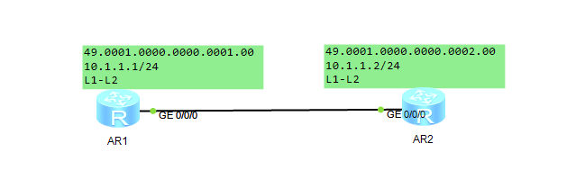
- AR1
    - 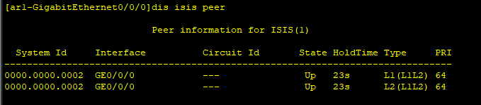
- AR2
    - 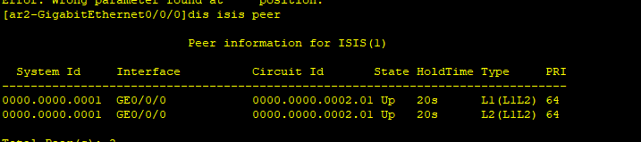


## 三、划分区域
```
    连续的 L2路由器，可以组成 骨干区域；

    连续的 L1路由器可以组成 普通区域；

    L1 和 L2区域 通过L1-2设备 连接
```
## 四、报文类型
```
    只支持 P2P 和 BMA 类型
```
### 1. IIH
```
    IIH（ISIS hello）：
        - 用于邻居发现，协商邻居参数；
        - 建立邻居关系和维持邻居关系（与OSPF的hello报文类似）
            1. level-1 LAN IIH:
                - 使用组播方式发送 (0180-C200-0014)
            2. level-2 LAN IIH:
                - 使用组播方式发送(0180-C200-0015)
            3. P2P IIH


    IIH报文在广播网络当中，可以进行 DIS的选举

        默认优先级：64（取值范围是0-127）越大越优

        当优先级一致，则比较接口MAC 地址，地址越大越好

    DIS 在 MA网络类型中，进行LSDB的同步
```
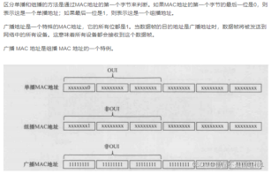

### 2. LSP
```
  LSP（链路状态协议数据单元）:
    - 携带网络参数信息、拓扑信息等内容（与OSPF的LSA类似）
        1. level-1 LSP
        2. level-2 LSP
```

### 3. SNP
```
  SNP（序列协议数据单元）
============================================
    -  PSNP（部分时序协议数据单元）：
        - 携带 LSP 的摘要信息（部分摘要）；
        - 可以用于同步 LSDB；请求和确认（类似于LSACK 和 LSR）

            1. level-1 PSNP
            2. level-2 PSNP

        作用1:
            用于请求本设备缺失的 LSP信息(类似OSPF 的 LSR)
        
        作用2:
            用于确认收到的 LSP信息(类似 OSPF 的 LSAck)

=============================================        

    -  CSNP（全时序列协议数据单元）：
        - 携带LSP的摘要信息（全部摘要），
        - 可以用于同步LSDB（与OSPF当中的DD报文类似）

            1. level-1 CSNP
            2. level-2 CSNP
```

### IS-IS设备LSDB
```
    IS-IS 只维护本设备支持等级的 LSDB
    
    （如 L1 只维护 L1 的LSDB）

    L1-2 设备类似于 OSPF的ABR 同时维护L1 和 L2 的LSDB
```
- 


## 五、邻居建立过程
```
1.（P2P网络类型）
      （两次握手）
    双方设备互相发送IIH报文；收到的一方，状态直接转为UP

     - 优点：邻居建立的速度快
     - 缺点：如果有一方，没有收到IIH报文，会导致单通现象

2. （三次握手）
     双方设备互相发送报文；收到的一方；
     先检查邻居标识是否包含自身；
        - 如果是，则转为UP；
        - 如果否；则转为init
 
     - 优点：邻居建立可靠
     - 缺点：建立速度慢

BMA网络类型只能支持三次握手；与P2P的3次握手过程一致
```

### IS-IS 工作过程
#### 1. 邻居建立
```
双方设备互相发送 IIH 协商参数信息


BMA类型：
===============================================================
（BMA）例如：AR1（system id 0000.0000.0001，MAC=A） AR2（system id 0000.0000.0002，MAC=B）

	① 双方互相发送 IIH（携带自己的 SYS ID 数据包会封装到 802.3 头部中，802.3 会封装源和目的 MAC 地址）

	② 收到的一份设备（如：AR2）会记录对端设备的 SYS ID 和 MAC 地址，状态从 down 转为 init
	并且回复一份 IIH（携带自己的 SYS ID 和邻居标识 “MAC=B”）

	③ AR1 设备收到该 IIH 后，查看 MAC 地址是否与本接口一致，如果是则状态为 up
	同时 AR1 也会回复相应 IIH（携带自己的 SYS ID 和邻居标识 “MAC=B”）

	④ AR2 设备收到后，状态也从 init 转为 up，标识邻居关系建立成功
```
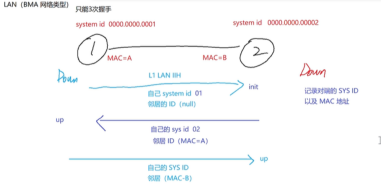

```
P2P 类型
================================================
（P2P 邻居建立）例如：AR1（system id 0000.0000.0001） AR2（system id 0000.0000.0002）
	
    ① 双方互相发送 IIH（携带自己的 SYS ID 数据包）
	
    ② 收到的一份设备（如：AR2）会记录对端设备的 SYS ID 和邻居系统 ID，状态从 down 转为 init
	并且回复一份 IIH（携带自己的 SYS ID 和邻居系统 ID）
	
    ③ AR1 设备收到该 IIH 后，查看邻居系统 ID是否与本设备的系统 ID 是否一致，如果是则状态为 up
	同时 AR1 也会回复相应 IIH（携带自己的 SYS ID 和邻居系统 ID）
	
    ④ AR2 设备收到后，状态也从 init 转为 up，标
    识邻居关系建立成功

----------------------------------------
P2P 可以分为 2way 和 3way
	1.  2way 收到对端的 IIH 状态立刻从 down 转为 up（但是不可靠，容易导致单通现象）
	
    2.  3way 需要手动对端的 IIH 并且携带本地设备的邻居标识，才会转至 up，可靠性更高（默认支持 3way 和 2way，使用 3way 方式工作）
	
    （isis ppp-negotiation 3-way 默认支持 2次和3次握手）
```
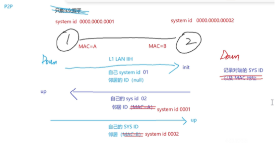


#### 2. 同步链路状态数据库
```
================================================================================
P2P 同步过程（理论方式）

	① AR1 与 AR2 设备会互相发送 CSNP 报文（携带本设备的 LSP 摘要信息）

	② 缺少 LSP 的一方（如：AR2 缺少 LSP X）则 AR2 会使用 PSNP 向 AR1 设备发起请求，PSNP 报文中携带（LSP X）的摘要信息

	③ AR1 收到 PSNP 请求后，响应并回复携带明细信息的（LSP X）

	④ AR2 收到（LSP X）后，会把 LSP 同步到 LSDB 中，并响应回复 PSNP

================================================================================
DIS 选举
	在同一个广播域的设备会根据 IIH 报文进行选举 DIS
	
    ① 先比较 DIS 优先级，默认：64（取值范围 0—127，越大越优）
	
    ② 如果优先级一致，则比较接口的 MAC 地址（越小越优）
	
    （DIS 与其他邻居的 holdtime 为原有时间的 1/3 为了保障每隔 10s 都会有 DIS 发送 CSNP 报文）

================================================================================
BMA 同步过程
	
    ① 所有的 IS-IS 设备都会组播发送自身的 LSP 报文，然后各自收集到 LSDB 中

	② DIS 设备会周期性 10s 发送一次 CSNP 报文（携带 DIS 自身所有的 LSP 摘要信息）
	
    ③ 如果有设备缺失 LSP，则主动向 DIS 请求，DIS 收到后会响应 LSP（收到 LSP 的设备无需确认，10s 同步一次）
	
    ④ 如果其他设备发现 DIS 缺失了 LSP，则这些设备会主动把自身拥有 LSP 发送给 DIS
```

#### 3. 计算SPF(最短路径)
```
每台设备都会产生一份 LSP（真实节点的 LSP，类似于 OSPF 中 1类 LSA，携带拓扑信息和网络信息）

	SOURCE       0000.0000.0002.00				// 代表本设备的 LSP-ID
 	NLPID        IPV4							// 代表本设备支持的网络类型：IPv4
 	AREA ADDR    49.0001 						// 区域 ID
 	INTF ADDR    10.1.123.2						// 与邻居相连的接口 IP 地址（标识哪一个接口与 DIS 相连）
 	NBR  ID      0000.0000.0001.01  COST: 10    // 邻居节点的 LSP-ID（DIS），本设备到 DIS 开销值为 10
 	IP-Internal  10.1.123.0      255.255.255.0    COST: 10 			
    // 本设备网络信息（连接着 10.1.123.0/24 路由，开销为 10）


	DIS 的伪节点 LSP（类似于 OSPF 的 2类 LSA）
	SOURCE       0000.0000.0001.01				// 伪节点的 LSP-ID
 	NLPID        IPV4							// 支持网络类型
 	NBR  ID      0000.0000.0001.00  COST: 0     // 与 DIS 相连的真实节点 LSP-ID 及开销值
 	NBR  ID      0000.0000.0002.00  COST: 0         
 	NBR  ID      0000.0000.0003.00  COST: 0 


	P2P 网络类型，则 仅有真实节点的 LSP
	SOURCE       0000.0000.0002.00				// 代表本设备的 LSP-ID
 	NLPID        IPV4							// 代表本设备支持的网络类型：IPv4
 	AREA ADDR    49.0001 					    // 区域 ID
 	INTF ADDR    10.1.123.2						// 与邻居设备相连的接口 IP 地址
 	NBR  ID      0000.0000.0001.00  COST: 10        			
    // 邻居节点的 LSP-ID，且开销为 10

 	IP-Internal  10.1.123.0      255.255.255.0    COST: 10 			
    // 本设备网络信息（连接着 10.1.123.0/24 路由，开销为 10）
```

```
概念：
	① LSP-ID：
    （如：0000.0000.0001.00-00）
        0000.0000.0001-00 为系统 ID 
        和节点 ID（00 为真实节点）（非 00 则伪节点）
			
    最后的 00 为分片 ID（当单份 LSP 大于接口 MTU 则开始分片，通过分片 ID 标识）
```

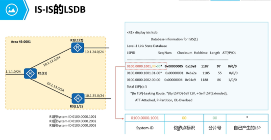


#### 4. 计算路由
```
level-1 的路由会主动注入到 level-2 区域（非骨干区域的路由会主动引入到骨干区域）
	
    反之 level-1 只能通过缺省路由访问 level-2 的设备
	
	减少非骨干区域的 LSDB 大小，降低该区域的设备性能消耗（类似于 OSPF 的 NSSA 区域）

```
---
```
level-1-2 设备满足以下条件，则会自动下发一份带 ATT bit 位置为1的 LSP，使得 level-1 设备会生成一跳指向该 level-1-2 设备的缺省路由
	
    ① level-1-2 设备必须有 2 个邻居，一个是 level-1，另一个是 level-2
	
    ② level-1 和 level-2 的邻居区域 ID 不能一致（代表该区域的设备有访问其他区域的能力）
```
---
```
路由渗透可以解决次优路径问题，可以把 level-2 的路由渗透到 level-1 区域中
	（但是可能会引发次优和环路问题 “优先级不一致的问题”）
```
---
```
    默认情况下，从高等级到达低等级的路由，level-1-2 设备会主动为这些路由打上 up/down 位

    设备会优先选择没有携带 up/down bit 位的路由，防止次优，从而也防止环路问题
```

## 六、LSP
```
LSP （Link State PDUs）链路状态报文
    - 用于交换链路状态信息
```
### LSP更新
```
LSP 更新：到达 900s 更新一次
（默认情况下：LSP 的老化时间为 1200s，递减）
（所以是300s更新一次）

	如果比较 LSP 的新旧程度
	1、查看 LSP 的序列号，越大越优
	2、如果序列号一致则比较，老化时间
		① 0s 是最优的，代表路由需要撤销
		② 如果不为 0 直接查看校验和
	3、校验和越大越优（如果校验和也一致，则不处理收到的 LSP）
```

```
LSP 分为两种：
    1. Level-1 LSP
        - 由 Level-1 IS-IS 传送
    2. Level-2 LSP
        - 由 Level-2 IS-IS 传送

通过LSP ID来唯一标识一份LSP
    （LSP由三部分组成：system id/伪节点标识/分片标识符）
 
例如：0000.0000.0001.00-01   
        //0000.0000.0001是system id
        //00代表是真实节点；若是非0；则为伪节点
	    //01代表是分片的第一份
```

```
LSP package

## flags:
    ================================
    
    - ATT (Attached): 区域关联位
        · 由 Level-1-2 路由器产生，用于 指明 始发路由器是否与其他区域相连
        · 当 L1 区域中的路由器收到 Level-1-2 路由器发送的 ATT 位被置位的 L1 LSP 后，
            · 将创建一条指向Level-1-2 路由器的缺省路由，以便数据可以被路由到其他区域
    
    ================================

    - OL (LSDB Overload): 过载标志位
        · 设置 过载标志位的LSP 虽然还会在网络中扩散，但是计算通过过载路由器的路由时，不会被采用。
        · 即对路由器设置过载位后，其他路由器在进行 SPF计算时候不会使用这台路由器做转发，只计算该节点上的直连路由
    
    作用：
        只接收本设备的 IP流量，其他流量无法从本设备经过(完成引流和调试前置功能)

    ================================

    - IS Type: 生成 LSP 的 IS-IS 类型
        · 用来指明 Level-1 还是 Level-2 IS-IS（01 表示 Level-1，11 表示Level-2）
```


## 开销类型：
```
narrow（窄度量）支持开销范围：1—63		
    且不支持打标签（管理标签）（默认）
	
wide（宽度量）支持开销范围：1—2的24次方		
    支持 sub-tlv（如：打上管理标签）

	不同开销类的路由器，可以建立邻居（但是无法计算路由）最好保障路由器的度量值都为一致的

# 注意
    - 在修改开销类型的时候，需要全局在相同的类型下才行
```


## 接口等级
```
IS-IS 等级分为进程等级和接口等级
	
    ① 进程支持 L1-L2，如果接口为 L1，则接口生效，接口发送 L1 的数据包（进程支持，接口优先）
	
    ② 进程只支持 L2，如果接口为 L1，则进程生效，接口仅发 L2 的数据包（进程不支持，进程优先）
```
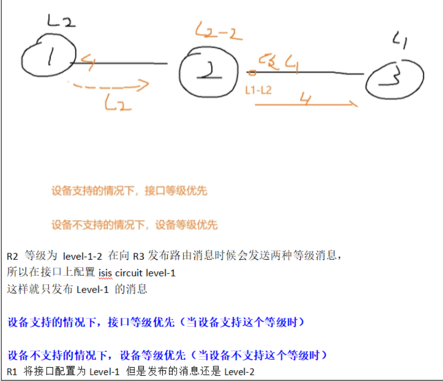


## 配置命令
```bash
1、创建 IS-IS 进程
	isis 1

2、配置 NET 地址
	network-entity 49.0001.0000.0000.0001.00	// 配置 NET 地址，其中（00 是 SEL）（0000.0000.0001 为系统 ID）
								（剩余的为区域 ID：49.0001）
3、（可选）修改设备等级
	is-level level-1				// 把设备修改为 level-1（默认为：level-1-2）

4、（可选）强制 level-1-2 设备的 ATT bit 位是否置位
	attached-bit advertise always 			// 强制把 ATT 位修改位 1（能够产生默认路由）
	attached-bit advertise never			// 强制把 ATT 位修改位 0（不能产生默认路由）
	（如果不配置以上任意命令，则需要根据条件是否满足来判断 ATT 是否置位）

5、把接口发布到 IS-IS 进程中
	interface G0/0/X
	isis enable 1					// 把 G0/0/X 接口发布到 IS-IS 进程 1 中

6、（可选）渗透路由
	isis
	import-route isis level-2 into level-1		// 把 IS-IS level-2 的路由引入到 level-1 中
							（默认情况下有一条  level-1 into level-2）
7、（可选）认证
	① 接口认证
		interface G0/0/X
		isis authentication-mode md5 plain 123

	② 区域认证（针对 level-1）
		isis 1
		area-authentication-mode md5 plain 123

	② 路由域认证（针对 level-2）
		isis 1
		domain-authentication-mode md5 plain 123

8、开销类型
	isis 1
	cost-style wide					// 修改为宽度量

9、接口等级修改
	 isis circuit-level level-1			// 把接口修改为 L1 等级

10、路由渗透
	IS-IS 默认只会把路由引入到 level-2 区域
	isis
	import-route static level-1			// 把静态路由引入到 level-1

查看配置命令
	display isis peer				// 查看邻居关系
	display isis interface + 接口 ID			// 查看某个接口的信息（如：支持的协议类型、等级、DIS 信息等）
```

#### 例子
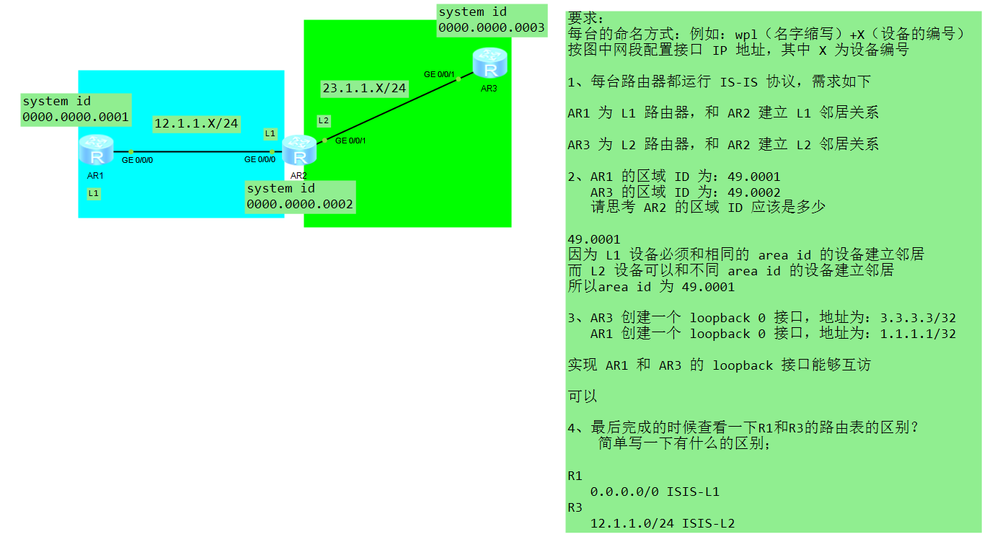
##### AR1
```
isis 1
     is-level level-1
     network-entity 49.0001.0000.0000.0001.00
#
interface GigabitEthernet0/0/0
     ip address 12.1.1.1 255.255.255.0 
     isis enable 1
     isis circuit-level level-1
#
interface LoopBack0
     ip address 1.1.1.1 255.255.255.255
     isis enable 1
     isis circuit-level level-2 
#
```
##### AR2
```
#
isis 1
 network-entity 49.0001.0000.0000.0002.00
# 因为 L1 设备必须和相同的 area id 的设备建立邻居
# 而 L2 设备可以和不同 area id 的设备建立邻居
# 所以area id 为 49.0001
#
interface GigabitEthernet0/0/0
 ip address 12.1.1.2 255.255.255.0 
 isis enable 1
 isis circuit-level level-1
#
interface GigabitEthernet0/0/1
 ip address 23.1.1.1 255.255.255.0 
 isis enable 1
 isis circuit-level level-2
#
```
##### AR3
```
#
isis 1
 is-level level-2
 network-entity 49.0002.0000.0000.0003.00
#
interface GigabitEthernet0/0/1
 ip address 23.1.1.2 255.255.255.0 
 isis enable 1
 isis circuit-level level-2
#
interface LoopBack0
 ip address 3.3.3.3 255.255.255.255
 isis enable 1
 isis circuit-level level-2 
#
```

#### 为什么上诉例子中 R1 的路由是 0.0.0.0/0

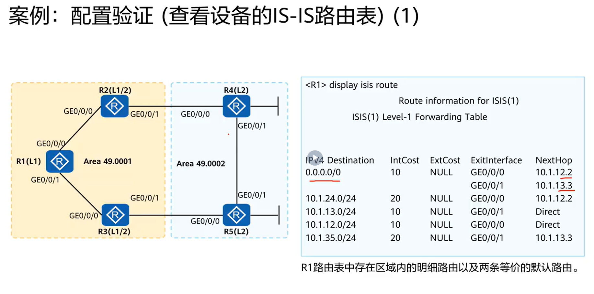
```
    L2 区域为骨干区域，
    L1 需要通过访问外部区域的话需要通过 L2 区域进行转发
```
- 由于 R4 这边的路由 与 R1 这边的 area id不同，在不同区域内
- R4 属于外部区域的设备
- 所以，通过使用默认路由来记录外部路由


##### 查看明细路由
```
    display ip route
```

### 路由渗透配置
```
背景:
    当我们想要导入给 R1 是明细路由
    而不是想要默认路由时候，使用 路由渗透来实现
```
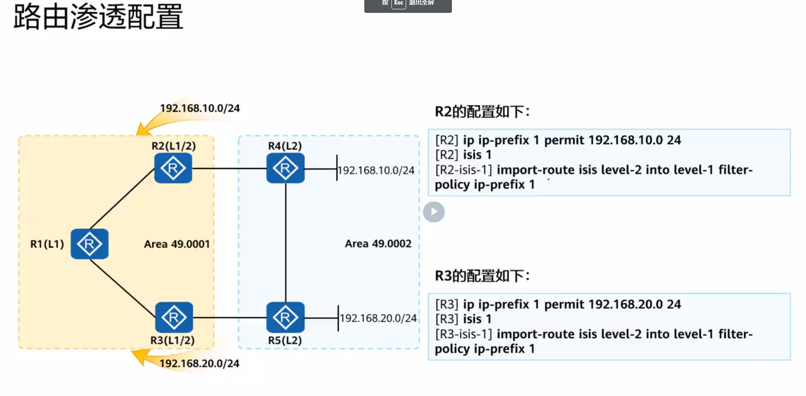

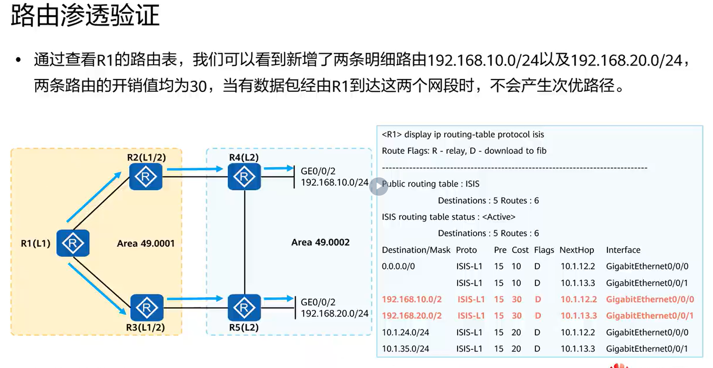

```

路由渗透
    可以解决次优路径问题，可以把 level-2 的路由渗透到 level-1 区域中
	（但是可能会引发次优和环路问题 “优先级不一致的问题”）
	
    默认情况下，从高等级到达低等级的路由，level-1-2 设备会主动为这些路由打上 up/down 位
	
    设备会优先选择没有携带 up/down bit 位的路由，防止次优，从而也防止环路问题

--------------------------------------------------------

路由渗透
     L1 区域的设备，
        默认情况下，会把路由传递给 L1区域的所有的路由器（包括L1-2设备）
     L1-2 设备
        会把路由通过 引入（渗透）的方式传递给 L2区域
        
     因为 L2区域是骨干区域，需要得知其他 L1区域的明细路由
  
     L1区域是普通区域，
        默认情况下只有缺省路由，用于访问其他区域
     
    - 产生默认路由的条件，ATT=1（代表该设备具有访问其他区域的能力）

#######################################################################
## ATT  
    正常情况下，当 L1-2路由器两端链接的是 L1 和 L2 的设备，ATT 位会自动置位，
    会向 L1 设备 下放 吓一跳 为自己的缺省路由

### 配置
    isis 1
        attached-bit advertise
        # 在 L1 设备中配置 表示即使 ATT 位置 为 1，也不生成默认路由
     
    isis 1
        attached-bit advertise // 在 L1-2 上配置
        always  // 即使 没有 L2 的邻居 ATT 位 也置 1
        never   // 即使满足条件 ATT 位 也不置 1 

########################################################################
    - 使用 loopback接口来 指定ping 的对象
        ping –a 1.1.1.1 3.3.3.3
    
    - 将level-1 中的 路由导入 level-2
        Import-route isis level-1 into level-2
        (因为 L1 不会将自己的路由 发给 L2)

     - 要为ATT = 1 时候 才会导入默认路由
         ATT=1的条件
             1. L1-2设备，必须有两个邻居，一个是L1，一个是L2
             2. L1邻居的区域和L2邻居的区域ID，不能一致


    - 因为 L1区域的设备无法得知L2区域的拓扑和明细路由，
        - 所以可能会发生次优的问题
    - 所以 L1-2路由器，需要对 L2区域的路由进行 渗透

    配置命令
	isis
 	     import-route isis level-2 into level-1   //把L2的路由引入到L1当中
    （引入之后，会保留原有的开销值，L1区域的设备通过明细的路由进行访问；解决次优路径的问题）
```

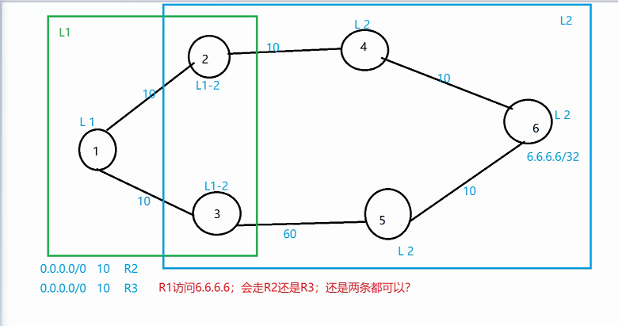
```
## 两条都可以走

    - 如果走了 ar3 则走了次优路径，
        原因是因为 ar1 不知道 6.6.6.6 这个路由的明细路由
    - 所以需要对 L2 区域的路由进行渗透
        通过 路由渗透 来解决

配置
    isis
# 把 L2 的路由导入到 L1 中
    import-route isis level-2 into level-1
（引入之后，会保留原有开销值，L1 区域的设备通过明细路由进行访问，解决次优路径问题）
```

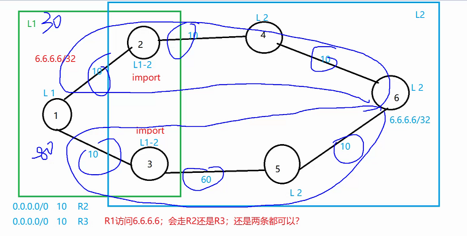
```
    同时涉及 L1 和 L2区域，不看路由开销，看路由优先级 越小越优
```
##### 路由回挂问题（环路问题）
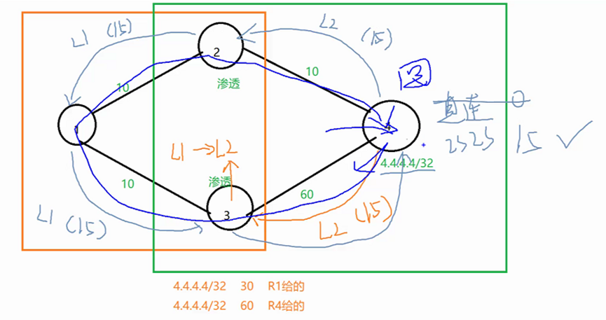

```
UP/DOWN 置位 可以解决 ????????????????


```

### IS-IS 认证分类
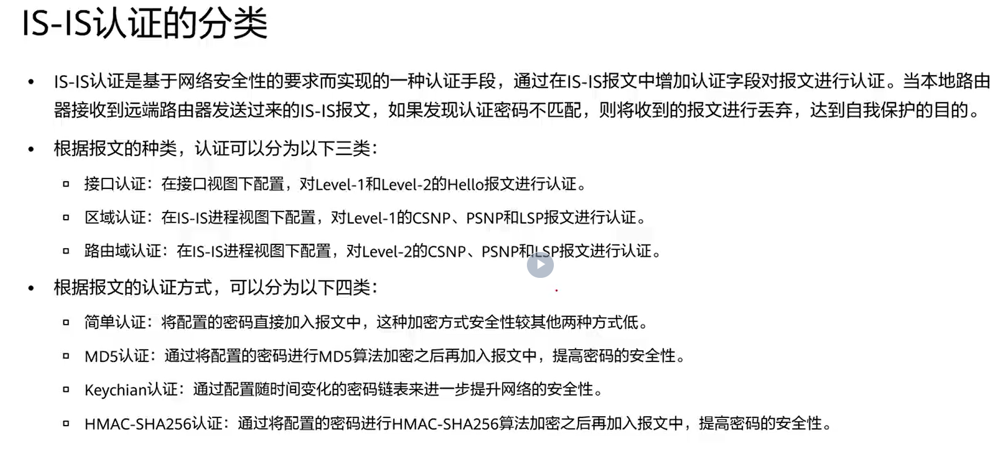
#### IS-IS 认证详解
```
1. 接口认证
    - Hello 报文使用的认证密码保存在接口下
    - 发送带认证 TLV 的认证报文，互相连接的路由器接口必须配置相同的口令
2. 区域认证
    - 区域内的每一台 L1路由器都必须使用的认证模式 和 具有共同的钥匙串
3. 路由域认证
    - IS-IS 域内的每一台L2 和 L1/L2 类型的路由器都必须使用相同模式的认证，并使用共同的钥匙串
    - 对于区域内和路由域认证，可以设置 SNP 和 LSP 分开认证
```
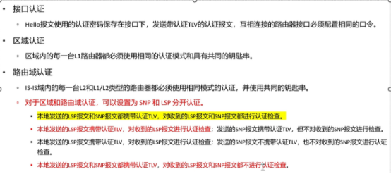
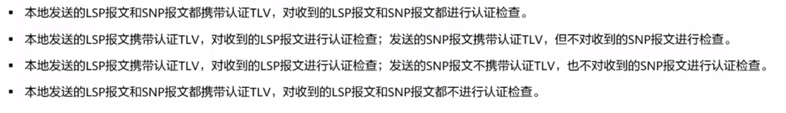
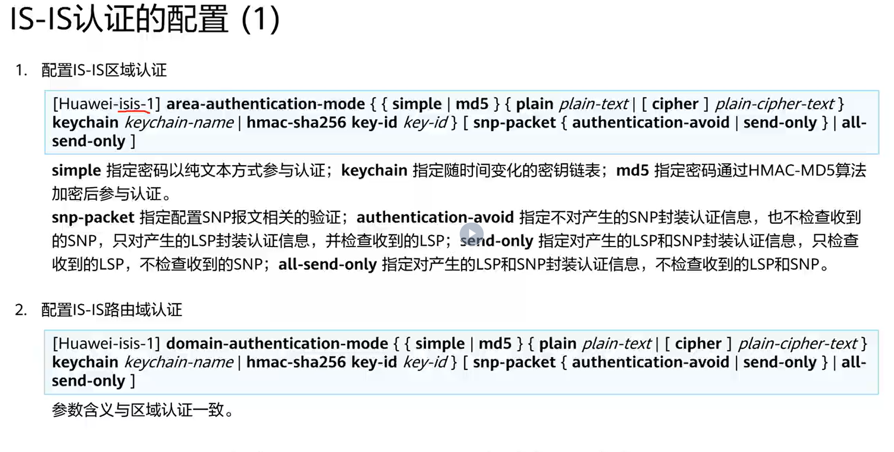
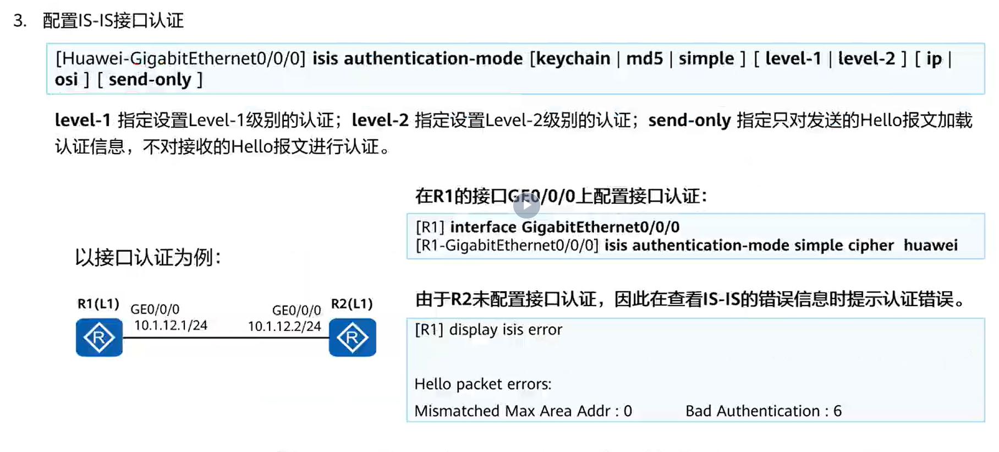

```
与 OSPF 不同，OSPF 是每包认证（因为认证信息携带在 OSPF 的头部）

IS-IS 的认证信息，携带在 TLV=10 中

（可以选择单向认证，发送的数据包都带认证 TLV，对于接收的数据包都不检查认证 TLV）
（可以针对 SNP 或者 LSP 单独进行检查）
```
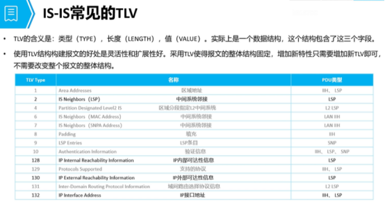

#### 配置
```
    1、接口认证：在接口视图下配置，对Level-1和Level-2的Hello报文进行认证。
interface GigabitEthernet0/0/0
     isis authentication-mode md5 cipher +密码

    2、区域认证：在IS-IS进程视图下配置，对Level-1的CSNP、PSNP和LSP报文进行认证。
isis 1
     area-authentication-mode md5 cipher +密码

    3、路由域认证：在IS-IS进程视图下配置，对Level-2的CSNP、PSNP和LSP报文进行认证。
isis 1
     domain-authentication-mode md5 cipher +密码
```

### 例题
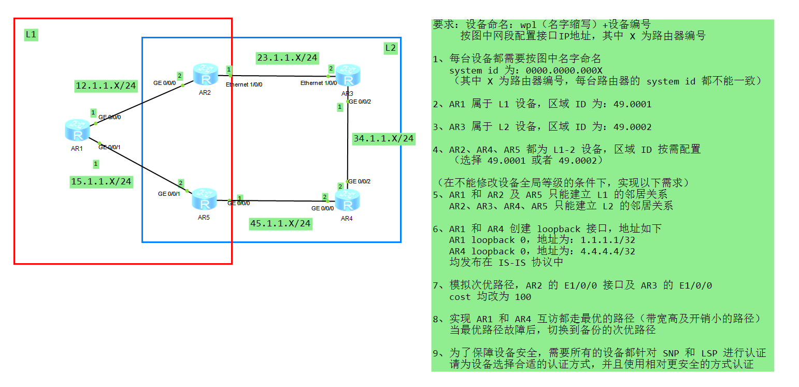
#### AR1
```
#
isis 1
 is-level level-1
 cost-style wide
 network-entity 49.0001.0000.0000.0001.00
 area-authentication-mode md5 cipher %$%$>_.$%-e3{8!jB%<aZ$SY+l0~%$%$
#
interface GigabitEthernet0/0/0
 ip address 12.1.1.1 255.255.255.0 
 isis enable 1
 isis circuit-level level-1
#
interface GigabitEthernet0/0/1
 ip address 15.1.1.1 255.255.255.0 
 isis enable 1
 isis circuit-level level-1
#
interface LoopBack0
 ip address 1.1.1.1 255.255.255.255 
 isis enable 1
 isis circuit-level level-1
#
```

#### AR2
```
#
isis 1
 cost-style wide
 network-entity 49.0001.0000.0000.0002.00
 import-route isis level-2 into level-1
 area-authentication-mode md5 cipher 123456
 domain-authentication-mode md5 cipher 123456
#
interface Ethernet1/0/0
 ip address 23.1.1.1 255.255.255.0 
 isis enable 1
 isis cost 100
#
interface GigabitEthernet0/0/0
 ip address 12.1.1.2 255.255.255.0 
 isis enable 1
#
```

#### AR3
```
#
isis 1
 cost-style wide
 network-entity 49.0002.0000.0000.0003.00
 domain-authentication-mode md5 cipher 123456
#
interface Ethernet1/0/0
 ip address 23.1.1.2 255.255.255.0 
 isis enable 1
 isis circuit-level level-2
 isis cost 100
#
interface GigabitEthernet0/0/2
 ip address 34.1.1.1 255.255.255.0 
 isis enable 1
 isis circuit-level level-2
#
```

#### AR4
```
#
isis 1
 cost-style wide
 network-entity 49.0002.0000.0000.0004.00
 domain-authentication-mode md5 cipher 123456
#
interface GigabitEthernet0/0/0
 ip address 45.1.1.2 255.255.255.0 
 isis enable 1
 isis circuit-level level-2
#
interface GigabitEthernet0/0/2
 ip address 34.1.1.2 255.255.255.0 
 isis enable 1
 isis circuit-level level-2
#
interface LoopBack0
 ip address 4.4.4.4 255.255.255.255 
 isis enable 1
 isis circuit-level level-2
#
```

#### AR5
```
#
isis 1
 cost-style wide
 network-entity 49.0001.0000.0000.0005.00
 import-route isis level-2 into level-1
 area-authentication-mode md5 cipher 123456
 domain-authentication-mode md5 cipher 123456
#
interface GigabitEthernet0/0/0
 ip address 45.1.1.1 255.255.255.0 
 isis enable 1
#
interface GigabitEthernet0/0/1
 ip address 15.1.1.2 255.255.255.0 
 isis enable 1
#
```