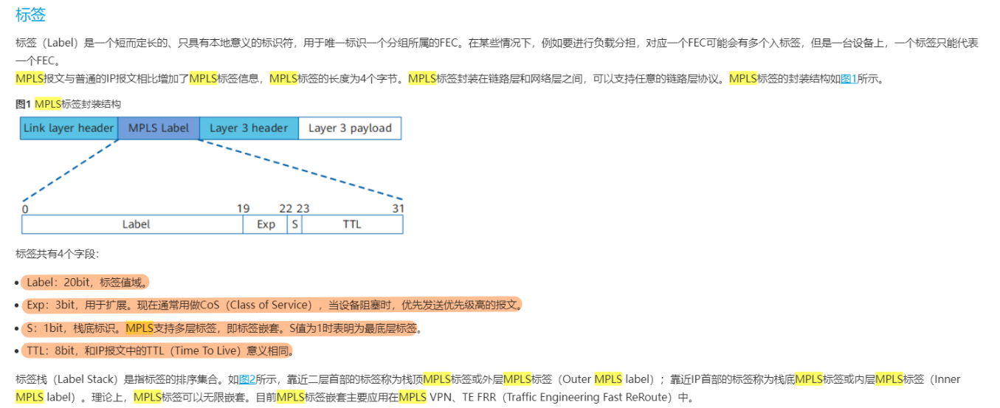
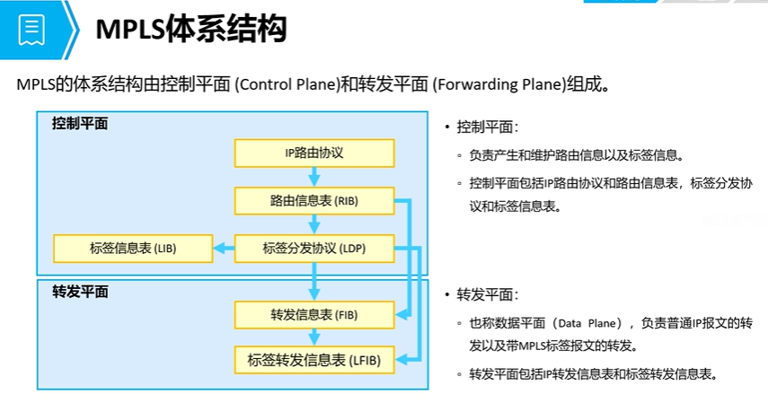
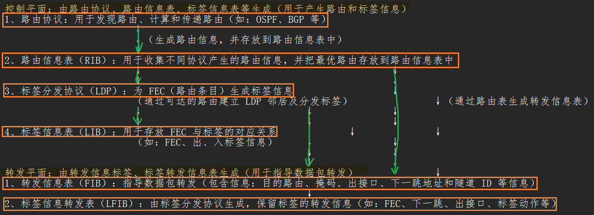

# MPLS 
## 概念
```
1、MPLS 域：
   由运行了 MPLS 技术的路由器组成，这些设备组成的区域就称为 MPLS 域

2、LSR（标签交互路由器）运行了 MPLS 技术并且支持标签交互转发的路由设备
	① core LSR：位于 MPLS 域内部，一般为传输设备（transit）
	② LER：位于 MPLS 域的边缘，一般为 ingress 和 egress

3、LSR 角色
	① ingress：是 LSP 的入节点，执行标签动作为 PUSH（压入标签）
	② transit：是 LSP 的传输节点，执行标签动作为 SWAP（标签交互）
	③ egress：是 LSP 的出节点（末尾）执行标签动作为 POP（弹出标签）

4、FEC（转发等价类）
   是指具有相同转发行为的数据包集合，可以根据（如：目的 IP 地址、下一跳等信息划分）

5、LSP（标签交互路径）标签交互协议为 FEC 分配标签后，可以组成一条连续的标签转发路径
			
      MPLS 带标签的数据包所经过的转发路径就称为标签交互路径
```

## 二、MPLS 标签格式

```
（MPLS 是 32 bit，4 字节组成的）
```
### 1、label（标签字段）长度 20 bit，代表 MPLS 的标签范围
```	
   ① 保留标签：0—15  给 MPLS 特定的动作保留
		如：0 号标签（显式空标签，收到该标签的设备会弹出标签，并查看 IPv4 转发表进行转发）
		如：3 号标签（隐式空标签，收到该标签的设备会执行 PHP 特性，并提前弹出标签，查找 IPv4 转发表进行转发）

	② 静态标签空间：16—1023 用于管理员手工指定（如：静态 LSP）

	③ 动态标签空间：1024—1048575 由动态标签协议分配（如：LDP、MP-BGP、RSVP-TE 等）
```
### 2、EXP（扩展位）长度 3bit，用于 QOS 服务
```
	取值范围：0—7 给 MPLS 数据包划分不同的服务等级
```
### 3、S（栈底位）长度 1bit，用于标识标签是否栈底标签
```
	S=0 代表非栈底标签，弹出后依然执行标签转发
	S=1 代表栈底标签，弹出后根据标签来执行相应转发
```

### 4、TTL（生存时间）长度 8bit，用于 MPLS 域中避免数据包成环和无休止转发
```
① uniform（统一模式）IP 数据包进入 MPLS 域和离开 MPLS 域时，都会进行 TTL 复制，使得 IP 数据包与 MPLS 数据包的 TTL 一致
      优点：能够使用 tracert 等工具查看数据包经过的设备信息（如：下一跳）
      缺点：无法隐藏 MPLS 域信息（如：设备数量、下一跳地址等）

② pipe（隧道模式）仅在 IP 数据包进入 MPLS 域时复制一次 TTL，IP 数据包经过 MPLS 域（相当于经过了一次管道）无论中间设备有多少台设备都只算 1 跳
      优点：可以隐藏 MPLS 域信息
      缺点：故障定位相比统一模式更加困难
```

## 三、表项信息


```
当收到不带标签的数据包
   （如：Ethernet II 中 type 字段为：0x0800 "IPv4" 转发）则先查看 FIB 表项
	① 如果 FIB 表中，
      tunnel id 为 0x0 
      则根据 FIB 表的下一跳和出接口进行转发
	② 如果 FIB 表中，
      tunnel id 为非 0（0x1）
      则根据对应的 tunnel ID 寻找隧道转发（如：LSP、GRE 等隧道）

当收到带标签的数据包
（如：Ethernet II 中 
      type 字段为：0x8847 或 0x8848 
      则代表 MPLS 转发）
      直接查看 LFIB 表项
```

## 四、LSP 建立
### 1、静态 LSP：由管理员手工建立和维护
```
	优点：不需要运行标签协议，节省带宽和资源
	缺点：拓扑发生改变后，无法动态收敛，需要管理员干预（如：下一跳地址发生了改变）

	适合于小型且网络稳定的场景
```

### 2、动态 LSP：由标签分发协议建立（如：LDP、BGP 等）

## 配置命令 （静态 LSP）
```
前提条件：除 BGP 路由，其他的 FEC 和互联接口地址均必须可达，可以运行任意 IGP 协议使其可达

（以下配置所有的 MPLS 域设备均要完成）
1、配置 MPLS LSR-ID
	mpls lsr-id X.X.X.X					// 静态的 MPLS LSR-ID 是 MPLS 域设备的唯一标识
							      （用于标识一台 MPLS 设备，不作为传输地址，无传输意义）
2、开启 MPLS 功能
	mpls							// 开启 MPLS 功能

3、进入 MPLS 数据包经过的接口（建立隧道）
	interface G0/0/X
	mpls							// 开启接口 MPLS 功能

4、一般为 BGP 业务路由的下一跳地址建立隧道
  （为 FEC 建立，而非目的 IP 地址）
  （系统配置视图）可以通过 display this 查看

① 入节点：
	static-lsp ingress + 名称 destination + FEC路由 + 掩码 outgoing-interface + 出接口 nexthop + 下一跳地址 out-label + 出标签

	例：static-lsp ingress 1to4 destination 4.4.4.4 32 outgoing-interface G0/0/0 nexthop 10.1.12.2 out-label 102
	隧道名称为：1to4（入节点）到达目的地址为：4.4.4.4/32 的 FEC，从 G0/0/0 接口发出，到达 10.1.12.2 接口，携带 102 出标签


② 传输节点
	static-lsp transit + 名称 incoming-interface + 入接口 in-label + 入标签 outgoing-interface + 出接口 nexthop + 下一跳 out-label + 出标签

	例：static-lsp transit 1to4 incoming-interface G0/0/0 in-label 102 outgoing-interface G0/0/1 nexthop 10.1.23.3 out-label 203
	隧道名称为：1to4（传输节点）从 G0/0/0 收到 102 标签的数据包，从 G0/0/1 接口转发出去，到达 10.1.23.3 接口，并携带出标签 203


③ 出节点
	static-lsp egress + 名称 incoming-interface + 入接口 in-label + 入标签

	例：static-lsp egress 1to4 incoming-interface G0/0/0 in-label 304
	隧道名称为：1to4（出节点）从 G0/0/0 收到带 304 标签的数据包，弹出标签（后续根据 FIB 表转发）

	测试或查看隧道建立情况
	① 在入节点设备使用 tracert -v X.X.X.X 进行测试（如果可达，且出现标签信息，代表隧道建立成功）
	② display mpls lsp verbose 查看隧道详细信息
```
### 5、迭代隧道
```
	（默认情况下，非公网路由都不会优先寻找隧道转发，根据 FIB 表进行转发）
		route recursive-lookup tunnel			//源设备需要补充隧道迭代命令，让数据包转发时优先递归隧道（非 FIB 表项）
```
- [MPLS 路由迭代问题](MPLS%20路由迭代问题.md)
