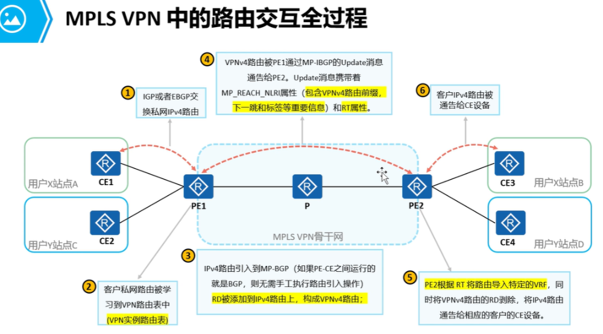
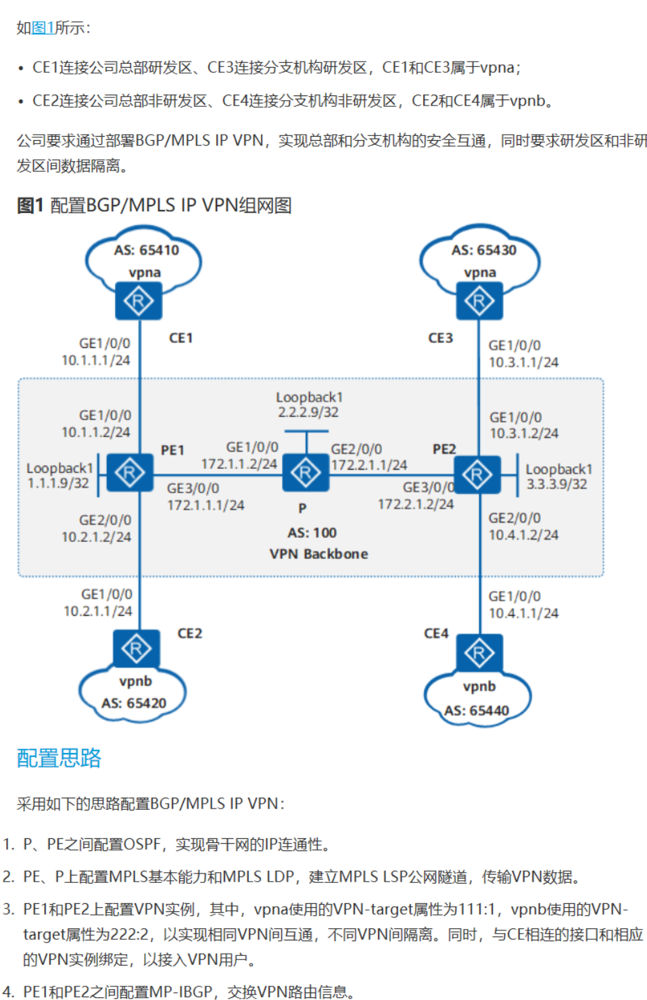
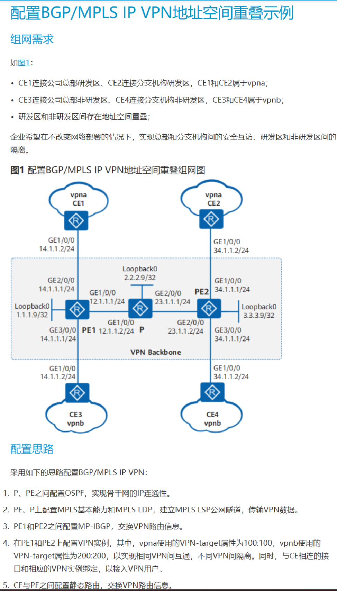
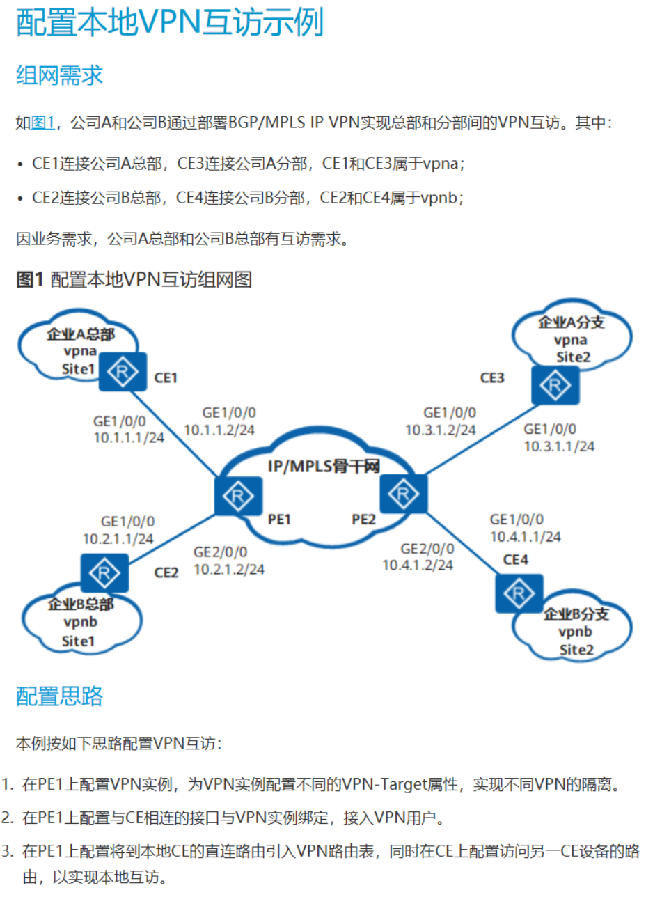
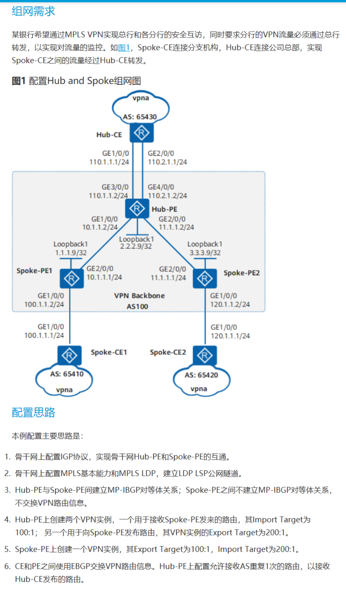
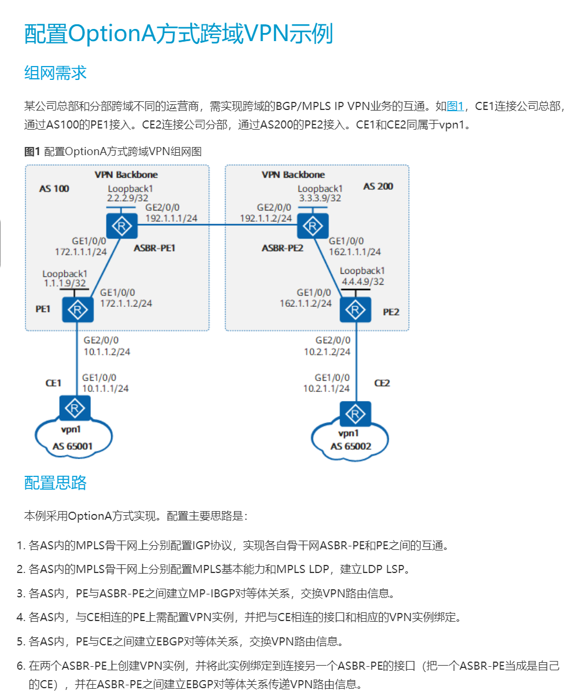

# MPLS VPN
```
1、物理专网：通过专用的物理线缆搭建（如：裸光纤、物理传输网络等）
	优点：网络品质好、安全性极高
	缺点：价格较高、不易于扩容和维护

2、虚拟专网：通过现有的 internet 来组建（使用虚拟方式来创建出传输隧道，如：IPsec VPN、LT2P、MPLS VPN 等）
	优点：安全性高，价格相比物理线缆便宜（共享网络）
	缺点：网络品质相较物理专网低、维护复杂
```

```
CE (Custom Edge):
    用户网络的边界设备， 直接与服务提供商网络相连

PE (Provider Edge Router)：
    骨干网络的边缘设备
    直接连接 CE， 从而提供 VPN 业务接入

P (Provider Router)
    骨干网络中的核心路由器
    主要提供骨干网内部的路由和数据包的快速转发
```

## RD （Route Distinguisher，路由区分符）
- 用于保证每个用户的 VPN路由的唯一性
- PE 为每个用户分配一个唯一的 RD，并在通告用户私网路由的时附带该 RD值

```
IPv4 前面添加 RD 后 => 变成了 VPN-IPv4 地址簇
    - 地址簇 只在 运营商骨干网内部存在，由 PE 路由器产生并发布
```

## VPN Target (也称为 RT， 路由标签)
```
是 BGP 的一个扩展团体属性

    用于判断该路由该被送入哪一个 VPN 实例中

    RT 值分为：
        • Export Target：
            本地PE从直接相连Site学到IPv4路由后，转换为VPN-IPv4路由，并为这些路由设置Export Target属性。Export Target属性作为BGP的扩展团体属性随路由发布。

        • Import Target：
            PE收到其它PE发布的VPN-IPv4路由时，检查其Export Target属性。当此属性与PE上某个VPN实例的Import Target匹配时，PE就把路由加入到该VPN实例中。

```

## 地址空间重叠
```
VPN 是一种私有网络，不同VPN独立管理自己的地址范围，也称为地址空间


不同 VPN 之间可能会重叠，这就发生了地址空间的重叠

    允许VPN 重叠的地址空间
        1. 两个 VPN 没有共同的 site
        2. 两个 VPN 有共同的 Site， 但是此 Site 中的设备不与两个 VPN 中的使用重叠地址空间的设备互访 
```

## MPLS VPN 概念
### 1. 如何解决客户地址空间重叠问题
```
地址空间重叠：
    不同客户（如A1 和 B1 用户都存在 192.168.1.0/24 的路由，同时传递到运营商会导致地址空间重叠 “IP地址冲突”）

    解决方法：
        使用 VRF(vpn-instance)来进行隔离，相当于给不同用户单独创建一张专用的路由表（以及转发表）
```

### 2. PE 设备间传递路由产生的地址空间重叠问题
```
VRF 只有本地有效，例如：PE1 收到的用户 A1（192.168.1.0/24的路由，会存放到 VRF-A1 和 VRF-B2，无法区分用户路由）

    解决本地的用户地址重叠问题，但是 PE1 把路由传递给 PE2时，（PE2 设备没有划分VRF-A1 和 VRF-A2，无法区分用户路由）

    解决方法：
        为路由打上标识（RD “路由区分符号”）

        RD 长度为（8字节）前 2 字节固定，
        后 6 字节可以分为 2：4 和 4:2 组合

        如：
            2:4 组合（0-65535 : 0-4294967295）
            例如： 
                1:1  192.168.1.0/24、  
                60000:1000000 192.168.1.0/24、
                1:1.1.1.1 192.168.1.0/24
            
            4:2 组合 (0—4294967295 ：0—65535)
                例如：
                    1:1  192.168.1.0/24、  
                    1.1.1.1：1  192.168.1.0/24

        添加 RD后的路由长度为 96 bit ，称为 VPNv4 路由
        RD + IPv4 = VPNv4
        如：
            RD（1：1） + IPv4路由(192.168.1.0/24) = VPNv4路由 (1:1 192.168.1.0/24)
```

###  3. 添加 RD 后，路由变为 VPNv4路由（OSPF，is-is等协议都无法承载 VPNv4路由）
```
解决方法：
    使用 MP-BGP 传递 VPNv4 路由（MP-BGP 能够承载 VPN 路由信息）
```

### 4. 对端 PE 收到路由后，无法区分路由应该传递哪一个客户站点
```
例如：
    PE1 把路由 1:1 192.168.1.0/24 和 2:2 192.168.1.0/24 传递给 PE2后，PE2 无法得知哪条路由应该传递客户 A2 或 B2

解决方法：
    使用 RT 值 解决

    RT 值也为 8 字节的标识符，
    与 RD 格式一致，但可以分为 import RT 和 export RT

    例如： 2:4 组合(0—65535 : 0—4294967295)
        例：1:1、100:100、100:1.1.1.1
    例如:  4:2 组合（0—4294967295 ：0—65535）
        例：1:1、100:100、1.1.1.1:100
    
    当 RT 值能够进行私网交叉则可以接收
    如：PE1 把 1:1 192.168.1.0/24 的 VPNv4 路由传递给 PE2（协议 export RT 值为：100:100）
		PE2 如果需要接收路由，则必须 import RT 为 100:100

例1：
	A1 （RT）				A2 (RT)
	export  100:100				export  200:200
	import  200:200				import  100:100

	A1 和 A2 能够互相传递和接收路由，因为 A1 传递路由时，携带 export RT（100:100）  A2 的入 RT 为 100:100 可以接收路由


例1：
	A1 （RT）总部				A2 (RT)	分支1			A3（RT）分支2
	export  100:100				export  200:200			export  200:200		
	import  200:200				import  100:100			import  100:100

	A1（总部）可以接收任意分支的路由（A2 和 A3）
	同理总部 A1 的路由也可以传递给任意的分支
	但分支之间，无法直接传递路由，因为 A2 传递路由给 A3（export RT 为 200:200）A3 的（import RT 为 100:100）无法匹配接收
	可以使用 RT 值灵活的控制路由传递和接收
```

---
### 数据包转发过程遇到的问题
### 5. PE 设备使用 MP-BGP 建立邻居并传递 VPNv4 路由，当 PE 设备为非直连建立邻居时（P 设备不运行 BGP）会产生路由黑洞问题

```
解决方法：
    PE、P 设备均运行 MPLS LDP，使用 LDP LSP 解决数据包传递的路由黑洞问题
```

### 6. 转发数据包时，PE 设备无法携带（RT、RD 等控制平面的信息）
```
例如：
    PE1 收到数据包，目的地址为：192.168.1.1    
    PE1 无法区分数据包应该交给 VRF-A1 的 192.168.1.0/24 设备
                        还是 VRF-B1 的 192.168.1.0/24 设备
	
解决方法：使用私网标签
	    当 PE1 引入路由时，会为私网路由（来自于用户的路由）产生私网标签
	
    例如：VRF-A1 的私网标签为 3000    VRF-B1 的私网标签为 4000
	    
        当收到数据包  192.168.1.1 时会携带 2 层标签
        （外层：公网标签，由 LDP 分配，用于解决路由黑洞问题 ；  
          内层：私网标签，由 MP-BGP 分配）
	    
        当内层标签为 3000 时，交给 VRF-A1 处理，
        当内层标签为 4000 时，交给 VRF-B1 处理
```



## MPLS VPN 配置
### 运营商
#### 1、underlay （底层网络）
```
① 保障内网的接口可达（如：loopback0 接口）可以使用任意的 IGP 协议
    配置完成后
    使用 display ip routing-table 查看是否有各设备的 loopback 接口地址
    （如果有则执行下一步操作，否则检查邻居和 loopback 接口地址是否发布）

② 搭建 MPLS LDP 隧道（PE 与 PE 间建立完整的通信隧道）
    配置完成后
    使用 display mpls lsp		//查看是否有到达各节点的 LSP 隧道（PE、P 设备）

③ PE 与 PE 之间使用 loopback 接口建立 MP-BGP 邻居关系（VPNv4 邻居）
    配置命令：
    bgp 100
    peer X.X.X.X as-number 100 
    peer X.X.X.X connect-interface LoopBack0		// 例如：使用 loopback0 接口与 X.X.X.X 设备建立邻居关系

    ipv4-family unicast
    undo peer X.X.X.X enable				// 进入 IPv4 单播地址簇，删除不必要的邻居关系

    ipv4-family vpnv4
    peer X.X.X.X enable					// 进入 IPv4 的 VPNv4 地址簇，使能邻居关系

    完成配置后
    使用 display bgp vpnv4 all peer				// 查看是否建立 VPNv4 邻居关系（否则检查以上配置）

```

#### 2、overlay （上层网络）
```
① 为不同的客户创建 VRF（vpn-instance）“系统配置视图”
    ip vpn-instance A1					// 创建 VRF，名称：A1
    route-distinguisher 1:1					// 配置 RD 值，为：1:1 （补充：RD 值必须唯一，不能冲突）

    （方法一）出入 RT 单独配置
    vpn-target 100:100 export-extcommunity			// 配置 export RT 值（100:100）
    vpn-target 200:200 import-extcommunity			// 配置 import RT 值（200:200）

    (方法二) 出入 RT 批量配置
    vpn-target 100:100					// import 和 export 同为 100:100
    ——————————————————————————————————————————————————————
    补充：对端设备接收路由时 import 必须和路由发出设备的 export 一致
    例如：A2 的 RT 配置
    vpn-target 200:200 export-extcommunity			// A2 RT 值与 A1 的相反
    vpn-target 100:100 import-extcommunity			// A1 传递路由时 RT 为（export）100:100，A2 接收路由时 RT 为（import）100:100

    
② 进入链接客户的物理接口，绑定 VRF（PE 设备接口配置）
    interface G0/0/X					// 进入 PE 设备连接 CE 的接口
    ip binding vpn-instance A1				// 绑定实例（VRF-A1）
    ip address 10.1.13.3 24					// 绑定信息后，接口上所有的 IPv4 和 IPv6 配置都会清空，需要重新配置 IP 地址等信息

    补充：绑定实例前，可以先备份接口配置，避免绑定实例后，接口配置消失


③ 运行 IGP 或 BGP 协议，获取用户路由（PE 设备配置）
    ospf 1 router-id 3.3.3.3 vpn-instance A1		// 创建 OSPF 进程 1，配置 router-id 及绑定实例 A1
    area 0.0.0.0 
    network 10.1.13.3 0.0.0.0 				// 把 G0/0/X 绑定实例 A1 的接口发布到 OSPF 进程 1 中

    注意：OSPF 进程 1 因为绑定了实例 A1，仅能发布带 A1 实例的接口（如：物理接口、逻辑接口等都需要绑定 A1 实例才能发布）	
    补充1：如果第一次创建 OSPF 进程没有绑定实例，则需要删除整个进程，重新创建
    补充2：一个路由协议进程，只能绑定一个 VPN 实例
```

#### 客户配置
```
① 客户与运营商运行相同的路由协议建立邻居即可（CE 配置）
	ospf 1 router-id 1.1.1.1 
 	area 0.0.0.0 
  	network X.X.X.X Y.Y.Y.Y					// 客户仅需要创建相应的协议进程，发布路由即可

	进入 PE 设备，查看客户路由是否传递到 PE 设备上
	display ip routing-table vpn-instance A1		// 查看对应客户实例的 VRF 路由表
	display ospf peer brief					// 还可以查看 PE 与 CE 间的邻居关系（如：OSPF 协议）
```
	
#### 运营商配置（PE）
```
④ 引入客户路由
	bgp 100
	ipv4-family vpn-instance A1 				// 创建 IPv4 VRF 路由表（A1）
	import-route ospf 1					// 引入绑定实例 A1 的 OSPF 进程

	补充：BGP 创建 ipv4-family 实例名称必须与客户站点的 VRF 实例一致，同时引入路由的进程（OSPF）也必须绑定该实例

	完成配置后
	使用 display bgp vpnv4 all routing-table
	（补充：确保 PE 双方的 RT 配置正确，就可以查看对端 PE 是否学习到本端的 VPNv4 路由，display bgp vpnv4 all routing-table）

⑤ 把 VPNv4 路由引入到对端客户 CE（PE2 配置）
	ospf 1 router-id 5.5.5.5 vpn-instance A2		// PE2（A2 站点）
	import-route bgp					// 引入 VPNv4 邻居传递过来的路由，再传递给 A2 站点的 CE 设备

	完成后
	在 CE 设备上查看是否学习到对端 CE 的业务路由
	display ip routing-table
```


## 配置
### 配置 PE 与 PE 之间的 MP-IBGP
```
1. 进入 bgp 视图
    bgp 100

2. 建立 对等体
    peer 1.1.1.9 as 100

3. 设置连接接口
    peer 1.1.1.9 connnect-interface lookback 0

4. 进入 BGP-VPNv4 地址族视图
    ipv4-family vpnv4

5. 使能对等体交换 VPN-IPv4 路由的能力
    peer ipv4-address enable
```
---
### 配置 PE 上的 VPN 实例
```
1. 创建VPN实例，并进入VPN实例视图。
    ip vpn-instance vpna

2. 使能VPN实例IPv4地址族，并进入VPN实例IPv4地址族视图。
    ipv4-family

3. 配置VPN实例IPv4地址族的RD
    route-distinguisher 100:1

    - VPN实例IPv4地址族只有配置了RD后才生效。
    - 同一PE上的不同VPN实例IPv4地址族下的RD不能相同。

    • RD配置后不能被修改或删除。
    · 如果要修改RD或删除RD，需要先
        - 删除对应的VPN实例 
         或者 
        - 去使能VPN实例IPv4地址族。

4. 为VPN实例IPv4地址族配置VPN-target扩展团体属性。 
    vpn-target 1:1
```
---

### 配置接口 与 VPN 实例绑定
```
1. 进入接口
    interface g0/0/0

2. 绑定 VPN 实例
    ip binding vpn-instance vpna

3. 配置接口地址
    ip address 192.168.1.1 24
```
- 配置VPN实例后，需要将本设备上属于该VPN的接口与该VPN实例绑定，
    - 否则该接口将属于公网接口，无法转发VPN数据。

- 绑定VPN实例的接口将属于私网接口
    - 需重新配置IP地址，以实现 PE-CE 间的路由交互
---

## 配置 PE 和 CE 之间的路由交换
### 配置 PE 和 CE 之间使用 EBGP
```
## PE 上
1. 
    bgp 100

2. 进入BGP-VPN 实例IPv4地址族视图
    ipv4-family vpn-instance vpna

3. 配置 VPN 私网对等体
    peer 1.1.1.9 as-number 200

4. 配置 EBGP 连接的最大跳数
    peer 1.1.1.9 ebgp-max-hop

5. （可选）需要将到 本端CE的直连路由引入VPN路由表中，以发布给对端PE时配置
    import-route direct

    - PE 会自动学习到 本地CE直连路由，
        - 该路由 优于 本地CE 通过 EBGP发布过来的直连路由，
        - 因此如果不配置此步骤，
        - PE 不会将该直连路由通过 MP-BGP发布给 对端PE。

## CE 上
1. 
    bgp 200

2. 配置 对等体
    peer 2.2.2.9 as-number 100

3. 配置 EBGP 连接的最大跳数
    peer 2.2.2.9 ebgp-max-hop

4. 引入本站点的路由
    import-route direct
```
---
### 配置 PE 和 CE 之间使用 IBGP
```
## PE 端
1. 
    bgp 100

2. 进入BGP-VPN 实例IPv4地址族视图
    ipv4-family vpn-instance vpna

3. 配置 VPN 私网对等体
    peer 1.1.1.9 as-number 200

4. （可选）需要将到 本端CE的直连路由引入VPN路由表中，以发布给对端PE时配置
    import-route direct

## CE 端
1. 
    bgp 200

2. 配置 对等体
    peer 2.2.2.9 as-number 100

3. 引入本站点的路由
    import-route direct
```
---

### 配置 PE 和 CE 之间使用静态路由
```
1. 配置 vpn 的静态路由
    ip route-static vpn-instance vpna dip int g0/0/0

2. bgp 100

3. 进入 BGP-VPN 实例 IPv4 地址族视图
    ipv4-family vpn-instance vpna

4. 将配置的静态路由引入到 BGP-VPN 实例IPv4 地址族路由表
    import-route static
```
---

### 配置PE 和 CE 间使用 RIP
```
1. 创建PE和CE间的RIP实例，并进入RIP视图
    rip process-id vpn-instance vpn-instance-name

2. 在VPN实例绑定的接口所在网段运行RIP
    network network-address
 
3. 引入BGP路由
    import-route bgp
 
4. 进入BGP视图
    bgp 100

5. 进入BGP-VPN实例IPv4地址族视图
    ipv4-family vpn-instance vpn-instance-name
 
6. 将RIP路由引入BGP-VPN实例IPv4地址族路由表
    import-route rip process-id
```
---

### 配置 PE 和 CE 间使用OSPF

### 配置 PE 和 CE 间使用ISIS

# BGP/MPLS VPN 实例


# BGP/MPLS VPN 地址空间重叠实例

- 注意：
    - 给 CE 设备配置 
    - ip route-static 0.0.0.0 0.0.0.0 g0/0/0 14.1.1.1 # 的默认路由
    - 相同路由中不能配置两个相同 ip
        - 使用 vpn-instance 来划分，配置

# 配置本地VPN互访

- 注意
    - 在 vpn-target 111:1 222:2 import-extcommunity 
    - 配置 vpn实例地址族的 入方向的拓展团体属性
    - 入方向 VPN Target属性通过与VPNv4或VPNv6路由中携带的 VPN Target属性匹配来决定哪些VPNv4或VPNv6路由 能交叉到 本地的VPN实例地址族 的路由表中。

# Hub and Spoke 示例


# 跨域VPN
## OptionA

