# MPLS VPN 应用场景
## 一、intranet（内部互访）
```
MPLS VPN 站点内可以实现互访，站点间隔离互访

如：A1 和 A2 都为公司 A 的站点，A1 和 A2 能够互访

	A1						A2
	RT 值						RT 值
	100:100 both （import 和 export 一致）		100:100 both	
	（A1 可以与 A2 通信）

另一个用户为公司 B，B1 和 B2 站点能够互访，但禁止公司 A 与公司 B 互访
	B1						B2
	RT 值						RT 值
	200:200 both （import 和 export 一致）		200:200 both	
	（B1 可以与 B2 通信，但无法与 A1 或 A2 任意公司 A 的站点通信）
```
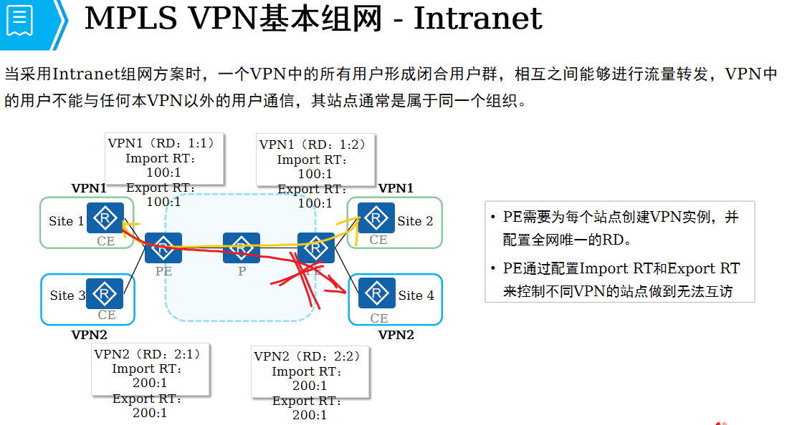

## 二、extranet（外部互访）
```
如：总部站点为 A，分支站点为 B1 和 C1，实现总部 A 站点能够与任意分支站点互访，分支站点之间无法实现互访
	A			        B1			        C1
	RT			        RT			        RT
	100:100 both		100:100 both		200:200 both
	200:200 both
	
	A 站点可以使用 100:100 与分支 B1 交互路由信息，也能使用 200:200 与分支 C2 交互路由信息
	B1 和 C2 因为 RT 不一致的原因，无法交互路由，也无法实现通信
```

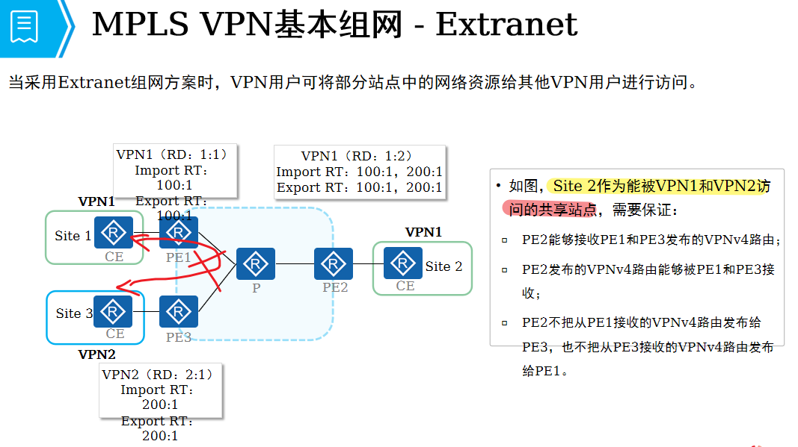

## 三、HUB-spoke 组网
```
某公司网点，需要由总部来收集分支机构的数据，分支机构之间的互访都需要经过总部 HUB

	总部 RT					分支A			分支B
	VRF-IN					VRF-A			VRF-B
	RT					RT			RT
	200:200  300:300 import			200:200 export		300:300 export
						200:200 import		300:300 import

	VRF-OUT
	RT
	200:200   300:300 export

	路由传递方向
	分支 A 和 分支 B 均能把路由直接传递到总部 PE，再由总部 PE 的 VRF-IN 接收，同时传递给 VRF-IN 的 BGP 邻居，到达总部 CE
```
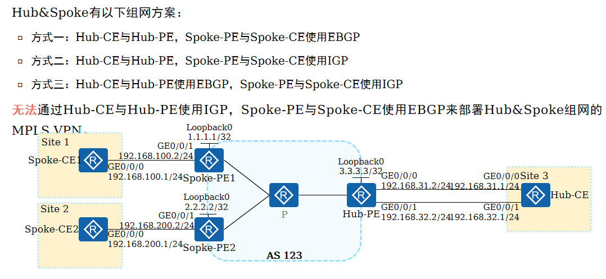
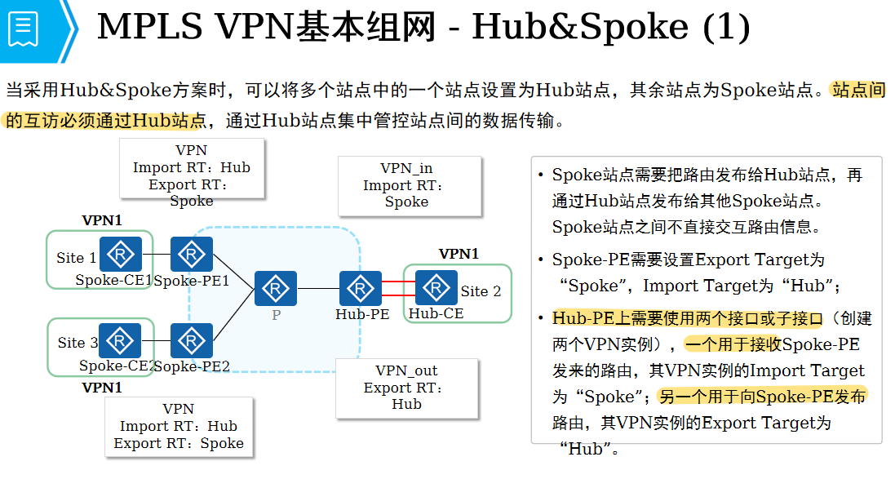

### 对应配置
#### 总部 HUB-PE
```
	ip vpn-instance IN
 	ipv4-family
  	route-distinguisher 10:10
  	vpn-target 200:200 300:300 import-extcommunity

	ip vpn-instance OUT
 	ipv4-family
  	route-distinguisher 20:20
  	vpn-target 300:300 200:200 export-extcommunity
```

#### 站点 A（分支 A 配置）	
```
	ip vpn-instance A
 	ipv4-family
  	route-distinguisher 2:2
  	vpn-target 200:200 export-extcommunity
  	vpn-target 200:200 import-extcommunity
```

#### 站点 B（分支 B 配置）
```
	ip vpn-instance B
 	ipv4-family
  	route-distinguisher 3:3
  	vpn-target 300:300 export-extcommunity
  	vpn-target 300:300 import-extcommunity
```
```
	——————————————————————————————————————————————
	补充总部 PE 与总部 CE（HUB-PE 与 CE）
	需要建立 2 个 BGP 邻居
	ipv4-family vpn-instance IN 				// 用于接收分支站点路由
  	peer 10.1.14.4 as-number 300 

 	ipv4-family vpn-instance OUT 				// 用于传递路由给分支站点
  	peer 20.1.14.4 as-number 300 
  	peer 20.1.14.4 allow-as-loop				// 添加忽略 AS 属性
```


## MPLS VPN（PE 与 CE 使用 OSPF 协议对接）
```
PE 设备把 OSPF 路由引入到 MP-BGP 时，会为 OSPF 路由携带以下属性
```
### 1、domain ID
```
	PE1 与 PE2 的 OSPF 实例进程，domain ID 相同（则：1、2、3 类 LSA，以 3 类形式传递）（原本为 5、7 类 LSA，则以 5、7 类形式传递）
	PE2 与 PE2 的 OSPF 实例进程，domain ID 不同（则：1、2、3 、5、7 类 LSA，以 5、7 类形式传递）
```
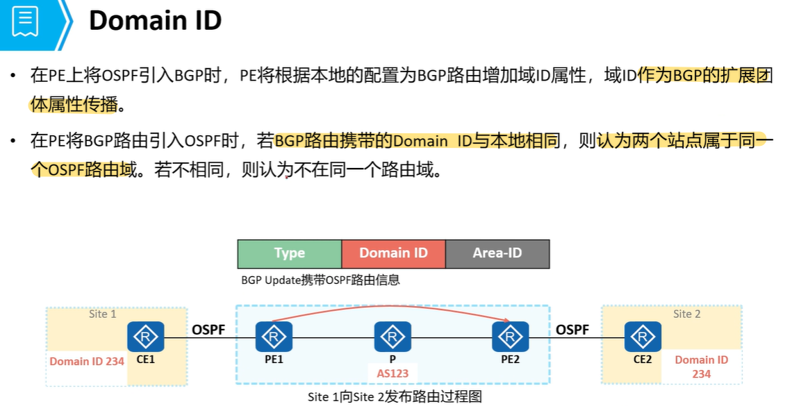

### 2、VPN  Router tag（domain tag）
```
	3 、5、7 类 LSA 从 PE 注入到 CE 时，都会携带 DN bit 位，防止路由从 CE 重新回到 PE
	收到带 DN bit 的 LSA，只接收，但执行 SPF 计算

	domain tag 用户 5、7 类的防环
	收到的 LSA domain tag 与 BGP AS 号一致，则拒绝接收
```

## OSPF VPN 拓展
### OSPF 与 BGP 互操作
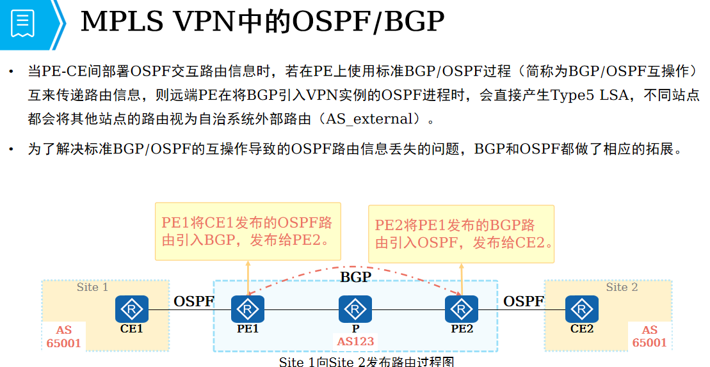
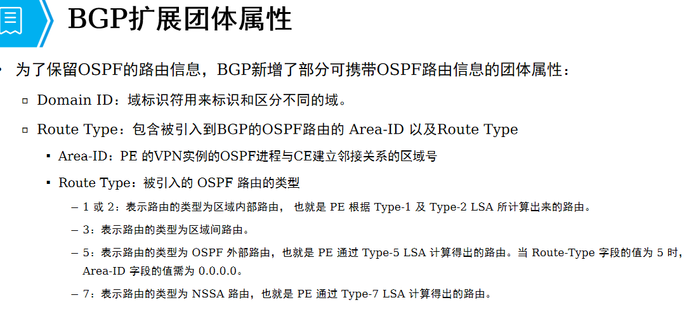
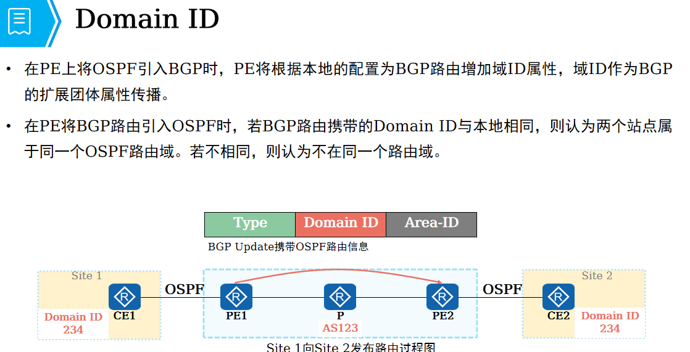
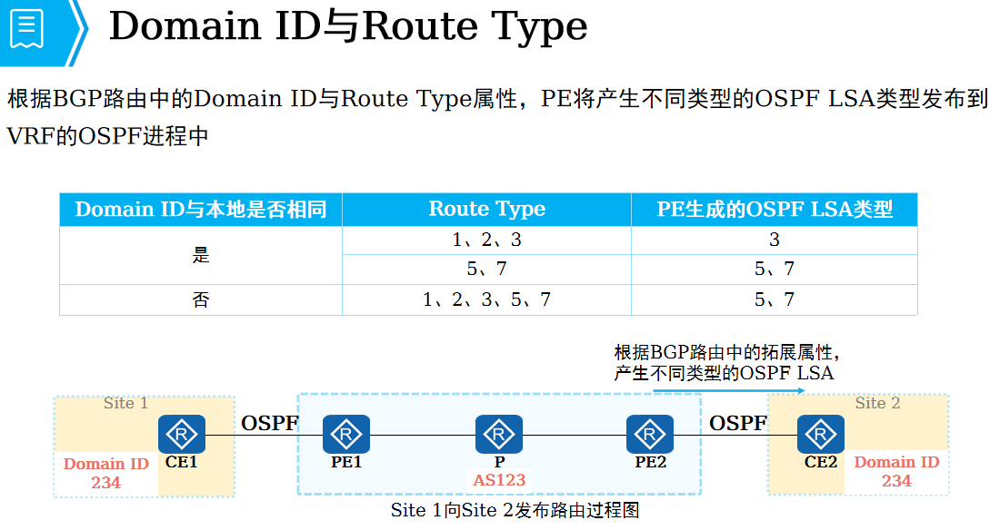

### OSPF 防环
#### Type3类路由防环 案例
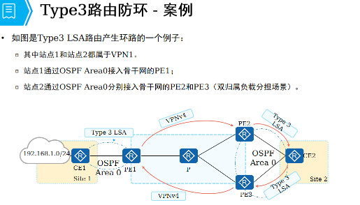
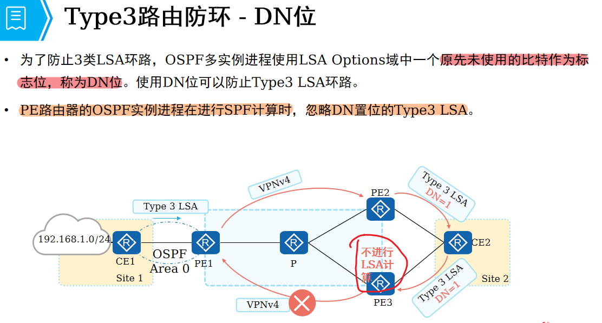

#### Type5/7类路由防环 案例
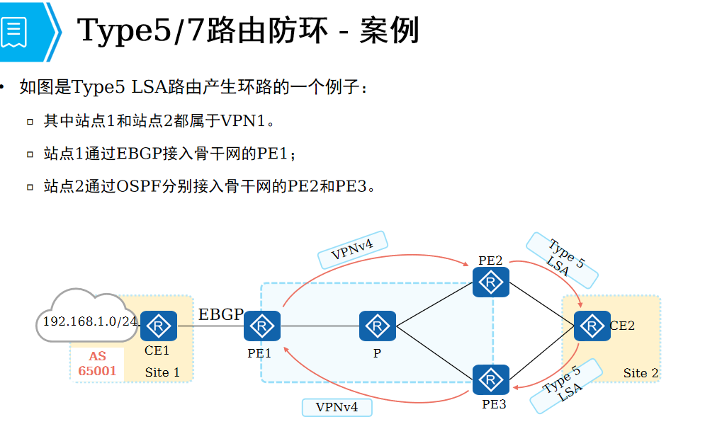
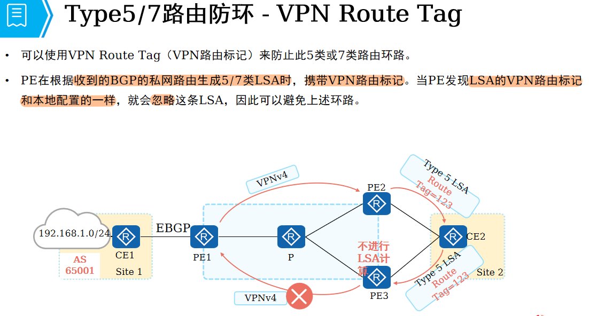

### OSPF Sham link
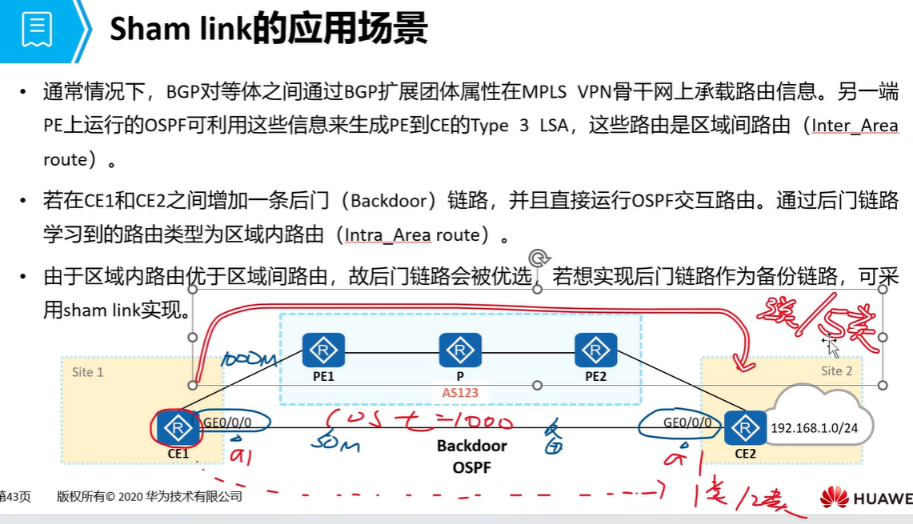
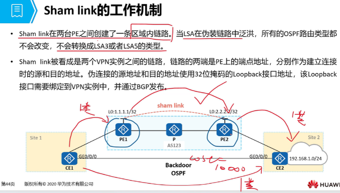
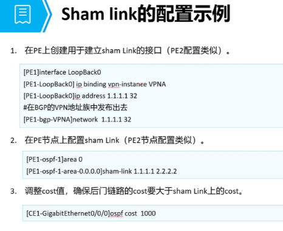
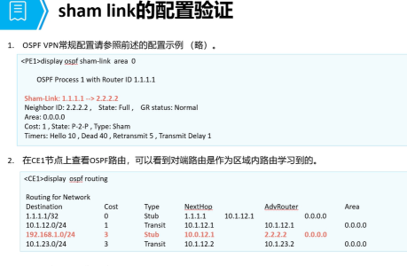

## 特殊场景下的 BGP 配置
### AS号替换
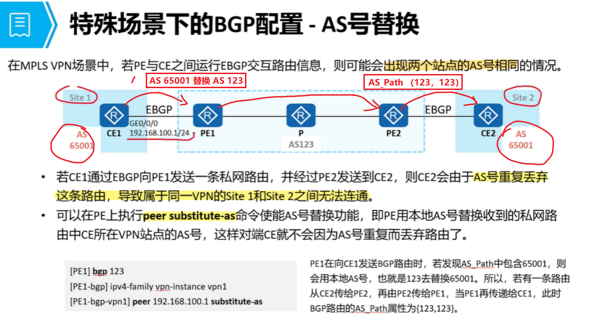

### SoO （Site of Origin）
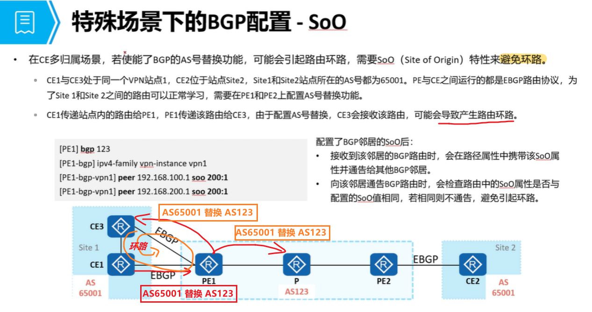

# 总结
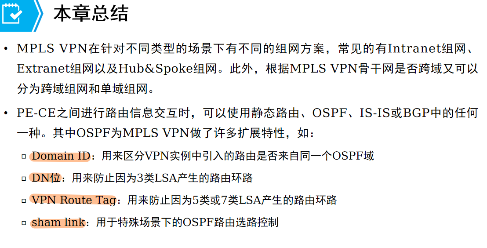