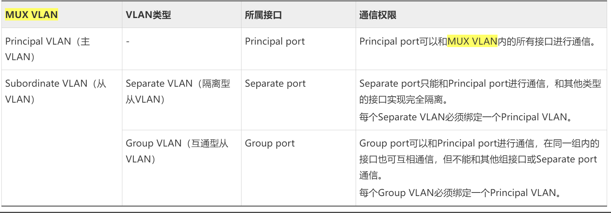
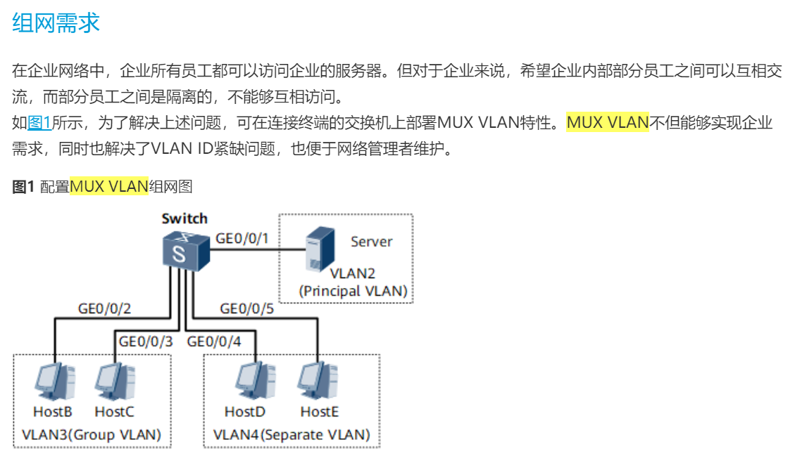
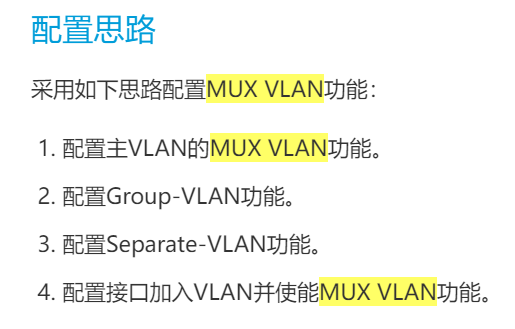
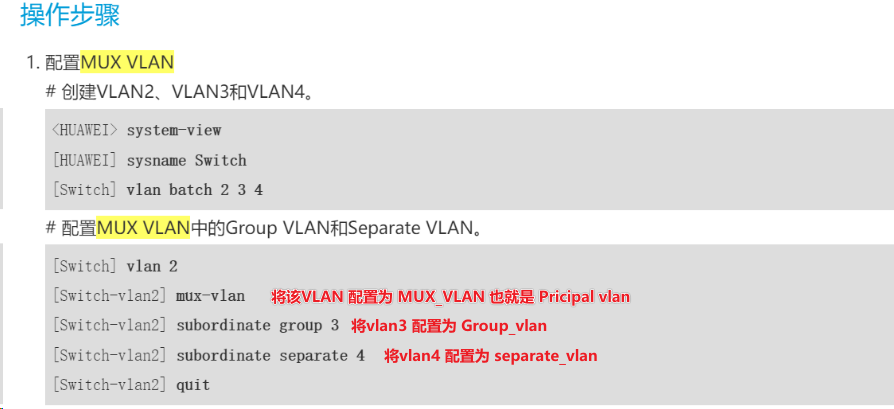
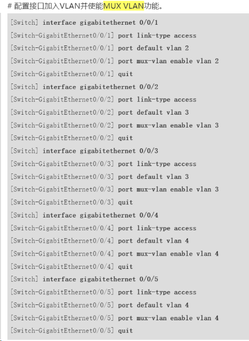
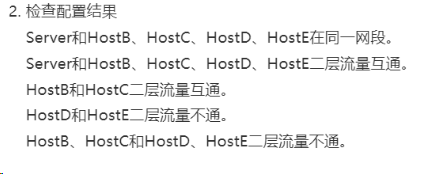
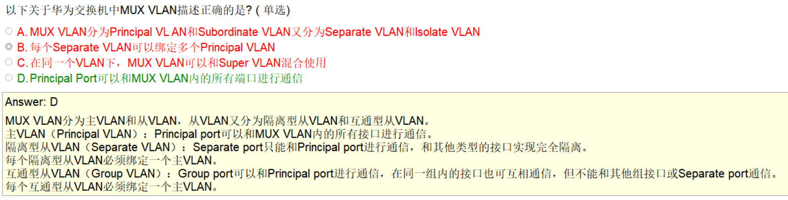

# MUX_VLAN
## 产生背景
```
    在企业网络中，企业员工和企业客户可以访问企业的服务器。对于企业来说，希望企业内部员工之间可以互相交流，而企业客户之间是隔离的，不能够互相访问。

    为了实现所有用户都可访问企业服务器，可通过配置VLAN间通信实现。如果企业规模很大，拥有大量的用户，那么就要为不能互相访问的用户都分配VLAN，这不但需要耗费大量的VLAN ID，还增加了网络管理者的工作量同时也增加了维护量。

    通过MUX VLAN提供的二层流量隔离的机制可以实现企业内部员工之间互相交流，而企业客户之间是隔离的
```
## 概念
```
    MUX_VLAN 分为：
        1. Principal VLAN （主VLAN）
        2. Subordinate VLAN （从VLAN）
            1. Separate VLAN （隔离型）
            2. Group VLAN （互通型）
```


## 作用
```
    通过 VLAN 实现二层的访问控制
    （MUX-VLAN的端口无法配置为 VLANIF端口，也就是无法包含三层接口的使用）一般用于接入交换设备
```

## 配置案例
### 接入层设备








## 测试


