## OSPF 基础

### 一、 IGP (内部网关协议):

    用于 发现路由 和 计算路由

1. OSPF
2. IS-IS
3. RIP

```bash
传输区域 (train area):

末端区域 (Stub Area):
```

### 二、 EGP (外部网关协议):

    用于 AS 之间 传递路由 和 控制路由选路

1. BGP

### 三、 OSPF (开放式的最短路径优先)

    链路状态协议、工作过程

1. 邻居建立
2. 同步链路状态数据库 (LSDB)
3. 计算最短路径 (SPF)
4. 计算路由

#### 概念

1. Router id:
   - 用于 OSPF 协议唯一标识一台路由器
2. LSA:
   - 每台路由器都会产生，携带自己的路由信息 和 拓扑信息

================================================================

## 报文类型

1. Hello 报文；

   - 用于发现邻居，建立邻居关系以及维护邻居关系
   - Hello 报文会周期性发送 (10s) 邻居关系的保持时间(4倍 = 40s)
2. DD 报文

   - 用于选举 主从路由器
     - ```
       使用第一份 DD 报文（flags 中 I = 1 的 DD 报文）进行选举，
         优选 Router id 大的为 Master
         从设备 必须 对主设备进行确认
         （主的序列号为：100，从必须回复一份序列号为：
         	 100 的 DD 报文，否则 5s 重传一次）
       ```
   - 用于同步 LSDB：携带本设备 LSDB 中，所有的 LSA 摘要列表
3. LSR 报文

   - 请求缺失 LSA 信息,携带 LSA 摘要信息
4. LSU 报文；

   - 响应请求，携带明细的 LSA 信息
5. LSAck 报文；

   - 确认收到的 LSU，携带 LSA
     摘要信息

================================================================

## 状态机

1. down

   - 代表 OSPF 刚使能，邻居状态还没有建立
2. attempt

   - (特殊状态)
   - 只在 NBMA 中出现，
   - NBMA 需要手工指定邻居，指定邻居后才会发送 hello 报文，如果本端发送了，对端没有回复，则处于 attempt
3. init

   - 本端设备收到对端的 hello 报文，但对端的 hello 报文中(邻居标识为 NULL) 或者不是本端设备的 ID，代表需要和对端协商邻居关系
4. 2way

   - 本端设备收到对端的 hello 报文，但是对端的 hello 报文中(邻居标识为本端设备)
5. exstart:

   - 代表邻居建立完成，开始建立邻接关系
   - 双方互相发送 DD 报文选举主从路由器， router id 大的会成为 Master(主)
   - 小的成为(Slave)
   - 主路由器发送的数据，从路由器必须回复(确保同步的可靠性)
6. exchange：

   - 代表主从选举完成，从设备先给主设备发起 DD的确认，同时携带 LSA的摘要信息
   - 主设备收到从设备的确认后，也会发送 DD 报文，并且携带 LSA的摘要信息
7. loading:

   - 通过摘要信息对比，如果由缺失的，则代表 LSDB 没有同步。进入 loading 进行同步
   - 缺少 LSA 的一方，会发起过 LSR 请求(请求确实的 LSA)
   - 收到 LSR 请求的一方，会通过 LSU 进行响应 (回复具体的 LSA 明细信息)
   - 缺少的一方收到 LSU 后会再次发起 LSACK，确认收到 LSA 信息
8. full

   - 代表双方 LSDB 完全一致，同步完成
   - 如果在 exchange 同步摘要信息时，已经一致，则可以直接到达 full 状态

##### 注意

```
注意：

一、如何唯一确定一份 LSA
    1、LSA 的类型（Type）：描述 LSA 是哪一种（如：Router LSA、Network LSA、Network Summary LSA 等）
    2、LSA 的描述信息（LinkState ID）：会根据不同的 LSA 描述不同的信息（如：Router id、网络前缀、DR 地址等）
    3、LSA 的产生者（AdvRouter）：产生该 LSA 路由器的 Router id

二、当ospf邻居一直处于2-way状态时候
    ① MA网络中
        (优先为0的设备，不参与DR选举，但是在MA网络中，如果设备优先级都为0，则无法进行DR选举，设备都会处于2-way状态)
                设备配置ospf dr-priority 0


三、当ospf邻居状态一直处于exstart状态
    (因为exstart 状态下的DD报文是通过单播的方式进行传递的，
            所以如果出现卡在exstart状态的时候，
        可以考虑是否是acl等路由策略的拦截导致，无法进行数据同步以及选举)

四、DR 是否具有抢占性？
    ① 当DRother设备加入已经选举DR的网络中，
        是不具有DR抢占性的 [例如:一台优先级比DR优的路由器加入]

    ② 当另一个ospf网络已经选举好DR的网络加入，DR就具有抢占性，
            此时会有两个DR ，和 两个BDR，
            从DR之间先比较，次优的直接变成DRother，BDR同理)
```

================================================================

## 路由计算
```
OSPF 采用 SPF 算法计算路由（达到路由快速收敛目的）
```
```
Router LSA 描述设备之间连接 和 链路属性
```
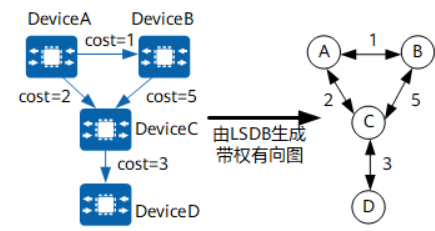
```
每台设备根据有向图，
    - 使用 SPF算法计算出一棵以自己为根的最短路径树
    - 这棵树给出了到 自治系统中各个节点的路由
```
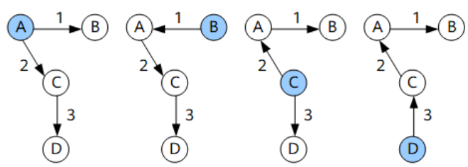
```
    当OSPF的链路状态数据库LSDB发生改变时，需要重新计算最短路径，
        - 如果每次改变都立即计算最短路径，将占用大量资源，并会影响设备的效率，
        - 通过调节SPF的计算间隔时间，可以抑制由于网络频繁变化带来的占用过多资源。
        - 缺省情况下，SPF时间间隔为5秒钟。
```
### 1. 区域内路由计算
```
Router LSA 和 Network LSA 可以精确的描述出整个区域内部的网络拓扑
    - 根据SPF算法，可以计算出到各个设备的最短路径
    - 根据Router LSA描述的与设备的网段情况，得到到达各个网段的具体路径

** 计算过程中，如果有多条等价路由，
    - SPF 算法会将所有等价路径保留在LSDB中
```

### 2. 区域外路由计算
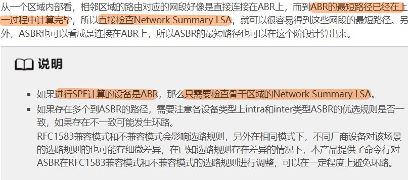


## OSPF 网络类型

    OSPF 会根据 接口的类型 和 链路协议自动生成网络类型

1. P2P (点对点)

   - 当使用的接口为光口 和 串口等，并且连路层协议为 PPP、HDLC 则网络类型为 P2P
2. BMA (广播多路访问)

   - 使用以太网链路，且链路层协议为 Ethernet、802.3 则网络协议为 BMA
3. NBMA (非广播多路访问)

   - 只在 FR (帧中继)网络才会修改为 NBMA
4. P2MP (点到多点)

   - 只能手工修改

OSPF 在 MA 的网络类型 (2,3)会选举 DR 来减少邻接关系
DR 会根据优先级来进行比较(越大越好，默认为 1) 取值范围是 0-255, 但是 0 不参与 DR 选举
如果优先级一致， 则比较 Router id，大的设备会成为 DR
(DR 和 BDR 选举完成后，更优的设备进入网络也不会被抢占)

### 配置命令

```bash
# 1、配置接口 IP 地址
	interface G0/0/X
	ip address  10.1.1.1   24			// 例如：进入 G0/0/X 接口，配置 IP 地址

# 2、创建 OSPF 进程，配置 router id
	ospf  1  router-id  1.1.1.1			// 例如：AR1 创建进程 1，router id 为 1.1.1.1（不同路由器 ID 也需要不同）

# 3、进入 OSPF 后，创建区域，并且发布接口
	area  0
	network   10.1.1.1  0.0.0.255			// 进入骨干区域，并且把接口 G0/0/X 的 IP 地址发布给邻居

	# 如果存在其他接口使用相同的方式发布
	network  1.1.1.1  0.0.0.0			// 例如：发布 AR1 的 loopback0 接口

# 4（配置方式 2 取代 2 和 3 命令行）
	ospf  1  router-id  1.1.1.1			// 创建 OSPF 进程，配置 router id
	area  0					// 进入区域 0
	quit					// 退出

	interface G0/0/X
	ospf enable 1 area 0			// 把 G0/0/X 接口所有的地址都发布给邻居

	interface loopback0
	ospf enable 1 area 0			// 把 loopback0 接口所有的地址都发布给邻居

# 5、配置完成后，查看 OSPF 邻居关系
	display  ospf  peer  brief			// 查看 OSPF 邻居摘要信息


# 6、查看路由
	display  ip  routing-table
	测试 ping + 目的地址


# 7、修改接口 DR 优先级
	interface G0/0/X
	 ospf dr-priority  0					// 把 AR2、AR3、AR4 的接口 DR 优先级改为 0，不让他们参与选举
								AR1 会自动成为 DR
```

### [LSA](./OSPF-LSA.md)

#### 区域间路由计算

##### LSA 概述

###### LSA 老化时间为 3600s

###### LSA 基本概念

---

```
- LSA 是 OSPF 进行路由计算的关键依据
- OSPF 的 LSU 报文可以携带多种不同类型的 LSA
- 各种类型的 LSA 拥有相同的报文头部
```

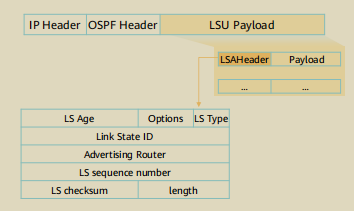

- 重要字段解释

```
================================================================
- LS Type (链路状态类型)
	指示本 LSA 的类型

- Link State ID (链路状态 ID)
	不同的 LSA 对应字段 定义不同

- Advertising Router (通告路由器)
	产生该 LSA 的路由器的 Router ID

以上三要素，唯一标识一份LSA
================================================================


================================================================
- LS Age (链路状态老化时间) 0 ~ 3600s
	此字段表示 LSA 已经生存的时间，单位是秒

- Options (可选项)
	每一个 bit 都对应了 OSPF 所支持的某种特性

- LS Sequence Number (链路状态序列号)
	取值范围 0X7FFFFFF (序列号越大表示越新)
	当 LSA 每次有新的实例产生时，序列号就会增加

- LS Checksum (校验和)
	用于保证数据的完整性 和 准确性

以上三要素用于标识一份 LSA 的新旧程度
----------------------------------------------------------------
比较顺序:
    ①先比较序列号大小，越大越优（代表是新产生的）
    ②如果序列号一致，则比较校验和，越大越优
    ③如果校验和一致，则比较老化时间（ls age）

Age 为 3600s 是最优的LSA，用于撤销路由
如果不为 3600s 则查看LSA之差（差值大于15min）越小越好
如果不为 3600s，查看时间之差（差值在15min及15min内）则同等优先

================================================================

- Length
	是一个包含 LSA 头部在内的 LSA 的总长度值


# 链路状态类型
# 链路状态 ID
# 通告路由器    唯一的标识了一个 LSA

# 链路状态老化时间、链路状态序列号、校验和 用于判断 LSA 的新旧
```

### 常见 LSA 类型

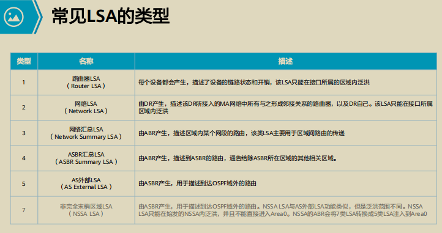

#### Router LSA （1 类）

```
	1. 每台 OSPF 路由器都会产生。 它描述了该路由器直连接口的信息
	2. 只能在所属区域内泛洪

	Router LSA 使用 Link 来承载路由器直连接口的信息

	每条 Link 均包含 “链路类型”，“链路ID”， “链路数据” 以及 “度量值(Cost值)”
```

|      Link Type      |                                          描述                                          |                   Link ID                   |                Link Data                |
| :------------------: | :-------------------------------------------------------------------------------------: | :------------------------------------------: | :--------------------------------------: |
| Point-to-Point (P2P) |             描述一个从本路由器到邻居路由器之间的点到点链路，属于   拓扑信息             |            邻居路由器的 Router ID            | 宣告该 Router LSA 的路由器接口的 IP 地址 |
|       TransNet       | 描述一个从本路由器到一个 Transit 网段 (例如 MA 或者 NBMA 网段) 的连接， 属于   拓扑信息 |              DR 的接口 IP 地址              | 宣告该 Router LSA 的路由去接口的 IP 地址 |
|       StubNet       |      描述一个从本路由器到一个 Stub 网段 (例如 Loopback接口)的连接，属于  网段信息      | 宣告该 Router LSA 的路由器接口的网络 IP 地址 |          该 Stub 网络的网络掩码          |

- 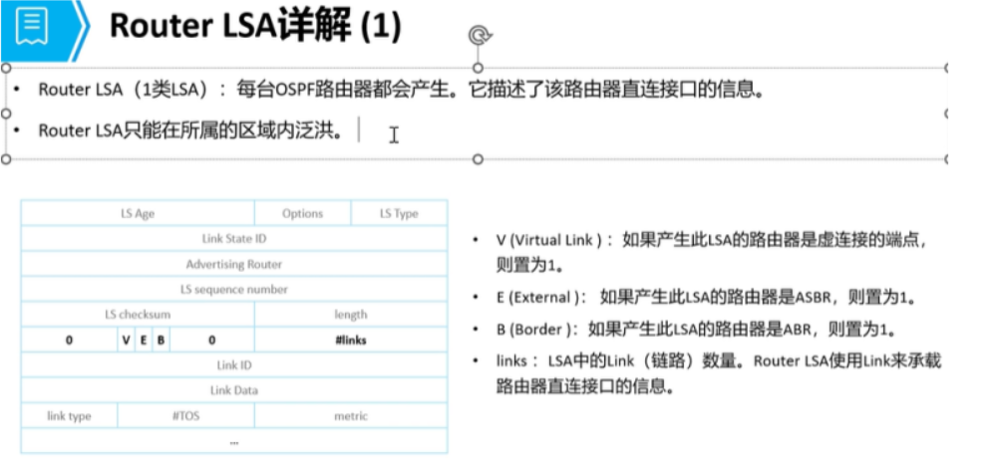
- Router LSA 有3个 flag位，标识设备角色
  - V： 代表是虚链路的其中一个节点
  - B： ABR（代表本设备为区域边界路由器）
  - E： ASBR（代表本设备为自治系统边界路由器）

##### P2P 网络类型

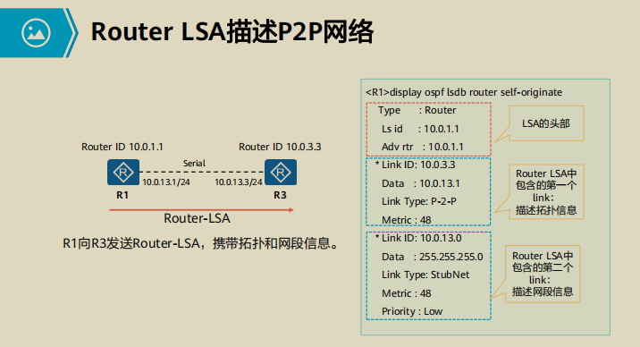
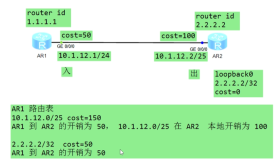
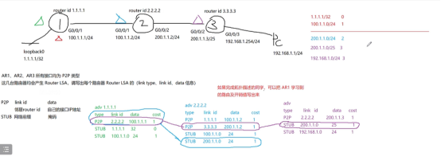
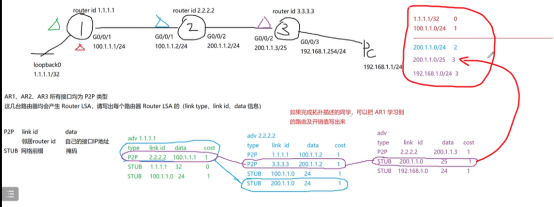

```
    200.1.1.0/25 的路由是通过 P2P类型的2.2.2.2 到 3.3.3.3（因为算的是路由器到路由器之间的开销） 再到 Stub 接口的200.1.1.0/25 的入接口cost累加得到的

    同理
```

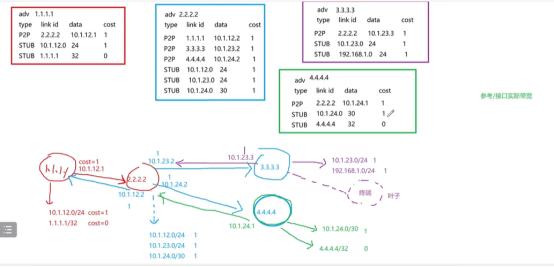

```
    P2P 和 P2MP 都使用P2P 和 STUB 描述
    BMA 和 NBMA 都使用 transitnet 描述
```

##### MA 网络类型

```
    MA网络类型的Hello 报文会携带network mask (掩码) ，不同的掩码，无法建立起邻居
```

- 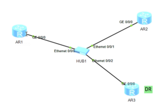

  - 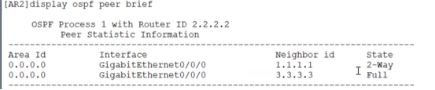
  - 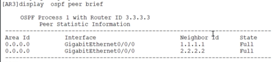
  - 因为DRother 之间不进行信息同步，DRother只和DR进行信息同步
    - 所以 DRother 设备之间状态为 2-Way
    - DRother 与 DR 之间状态为 FULL
- 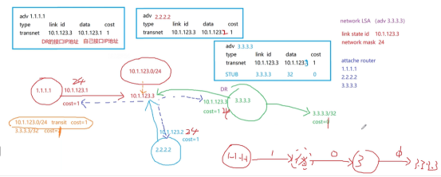

  - 通过router lsa画出拓扑图后，
  - 如何通过伪节点10.1.123.3来确认3.3.3.3 是DR，看network LSA (adv 3.3.3.3) 的 10.1.123.1 可以得出
- 练习

  - 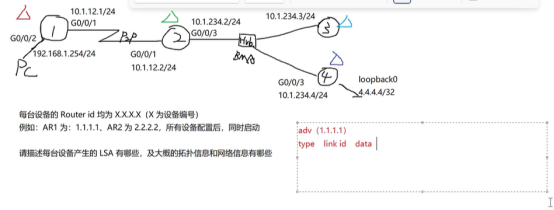
- 答案

  - 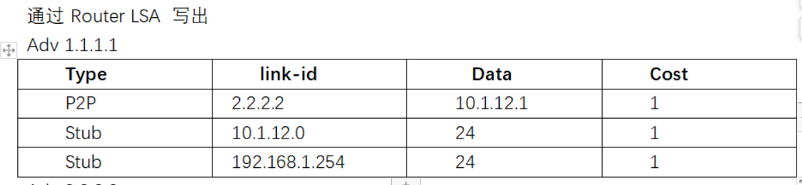
  - 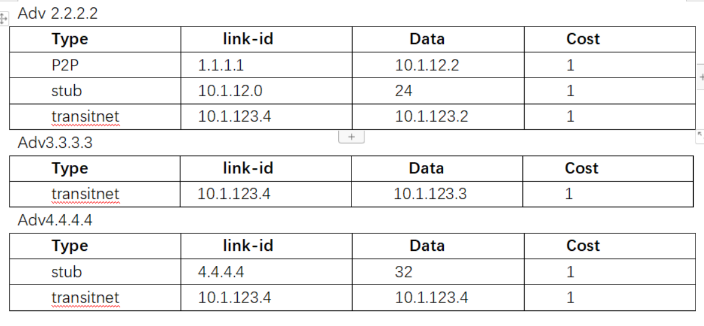
  - 再通过network LSA adv 4.4.4.4 的 10.1.123.4 得到 路由器(4.4.4.4) 是DR
    - 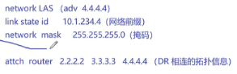

#### Network LSA (2 类)

```
	Network LSA ( 2类 LSA)： 由 DR 产生，描述本网段的链路状态，在所属的区域内传播

	Network LSA 记录了该网络内所有与 DR 建立了邻接关系的 OSPF 路由器，同时携带了该网段的网络掩码

	Link State ID： 
		DR 的接口 IP 地址

	Network Mask： 
		MA 网络的子网掩码

	Attached Router： 
		连接到该 MA 网络的路由器的 Router-ID 
		(与该 DR 建立了邻接关系的邻居的 Router-ID，以及 DR 自己的 Router-ID)，
		如果有多台路由器接入该 MA 网络，则使用多个字段描述。
```

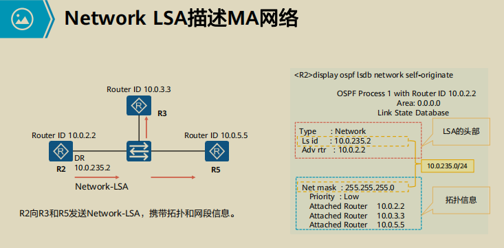

### 例题

AR 中两边都有 area 时， 该 AR 要创建两个 area 并发布对应的网段
    - 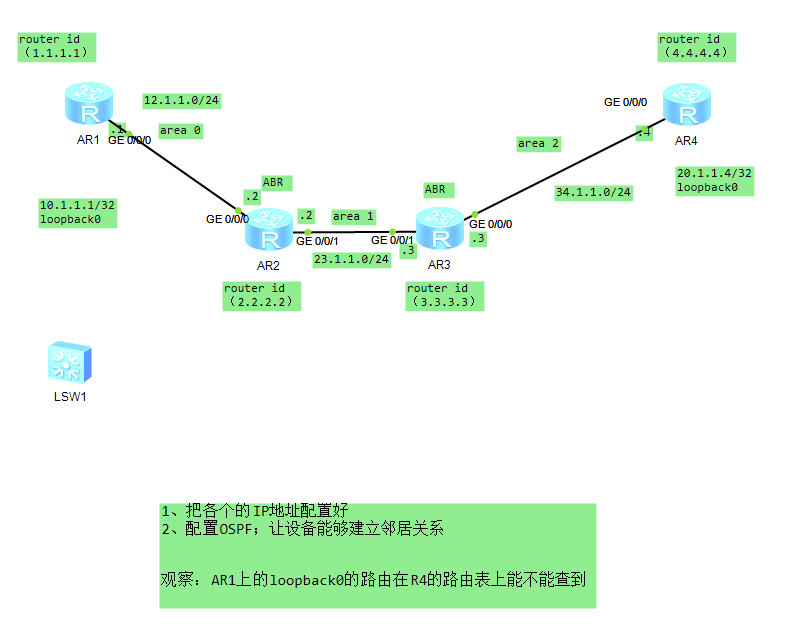

- 出现未配置 route-id 后学习到了邻居的最大端口
  - 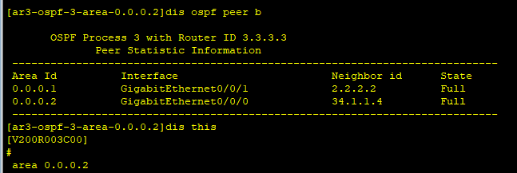
- 退出到系统模式 reset ospf process 刷新 ospf
  - 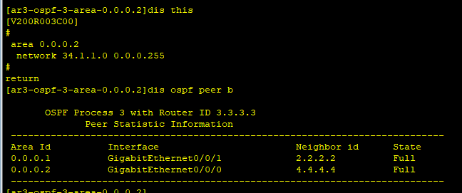

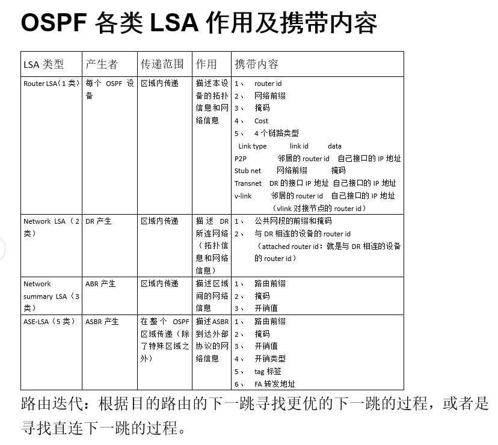


- 唯一确认一份LSA的三要素

  1. type：类型：用来表明是第几种LSA
  2. LS ID：类型不同，所表达的意思也不同
  3. ADV：产生者：用来表明是哪台设备所产生的LSA
- 对于P2P网络来说：

  - P2P 可以补全拓扑信息
  - STUB net  补全网络信息（IP路由信息）
- ABR：

  - 区域边界路由器。
  - 必须是与骨干区域有连接的才为ABR
- ASBR：

  - 自治系统边界路由器，该类路由器与其他AS交换路由信息；
  - 只要一台OSPF路由器引入了外部路由，他就成为ASBR。

#### 上述配置 中 ar3 路由表中 学不到 ar4 中的 loopback 0 接口的 20.1.1.4/32

- 原因

  - 因为 AR3 不是 ABR 设备(区域边界路由器)
  - 【AR3 不会成为 ABR 设备 因为 AR3 的防环特性】
  - 防环特性： 完全意义上的 ABR，不适用来自非骨干区域的汇总 LSA
- 解决（将 AR3 变成 ABR 路由器）

```bash
# 解决方法 一
    将 area 2 改为 area 0
    使 AR3 变成 ABR 设备

# 解决方法二
    在 AR2 和 AR3 之间 建立 vlink 链接 (配置为 area 0 主干区域)
    AR2
        进入 ospf 2
        进入 area 1
        配置 vlink-peer 3.3.3.3

    AR3 
        进入 ospf 3
        进入 area 1
        配置 vlink-peer 2.2.2.2

vlink 可以 修补骨干区域的被分割问题，延伸 area 0 的区域
```

================================================

## 虚连接 vlink 的目的

- 将没有物理连接的区域连接到主干网
- 在发生区域 0 的不连续的情况下修改主干

### vlink 应用场景

1. 不规则区域连接

- 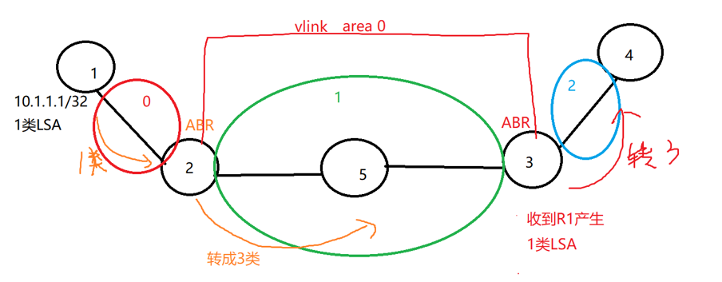

2. 骨干区域被分割

- 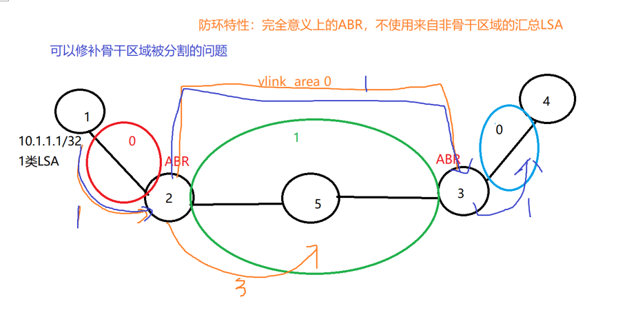

```
（避免骨干区域被分割后，完全意义的ABR导致无法计算非骨干区域的路由，可以在传输的区域1中，建立虚链路，让其传递1、2类LSA）
```

3. 解决次优路径以及增强网络的稳定性

- 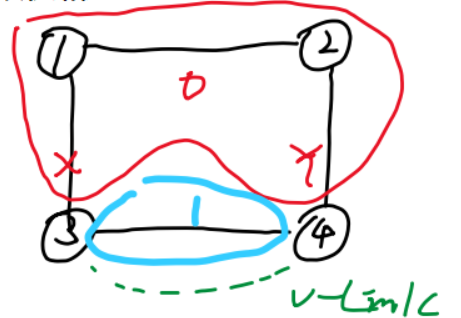

```
如果没有建立vlink，R3访问R4时候因为1类LSA优先于3类LSA，所以路由会经过R1，R2访问R4，于是产生了次优路径
（所以在AR3与AR4建立v-link，可以通过v-link传递X和Y接口的1类LSA信息，解决次优路径问题）
```

### V-link 特性

```
1、V-link跨域的区域为传输区域，
    被V-link跨区域传输的LSA，不会再回到该区域（用于防止环路产生）

2、V-link一般建立在相同区域中的ABR上
    （因为V-link通过1类LSA描述，无法跨区域传递，不能跨区域建立vlink）

补充：
        V-link是通过指定对端的Router id建立的，
    所以建立V-link的设备必须手工配置Router id
    （自动选举Router id设备重启或者进程重置，可能会导致Router id发生改变

虚链路的开销
    是通过实际链路之间的最短路径开销算出来的
```

### V-link 建立不当可能导致的环路问题(面试题)

- 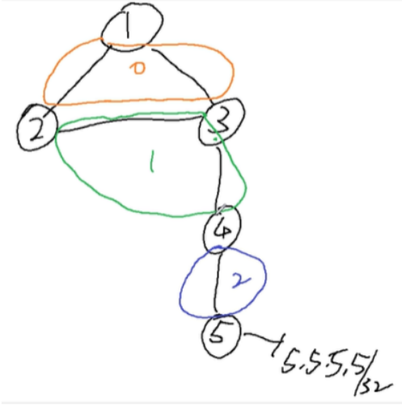
- 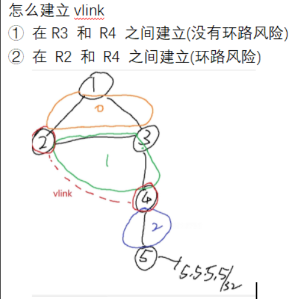
- 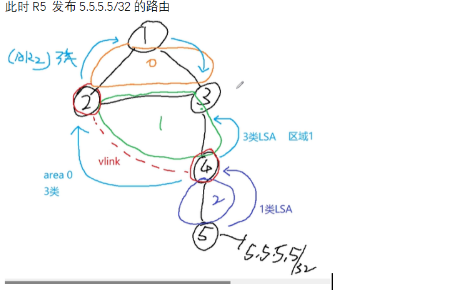
- 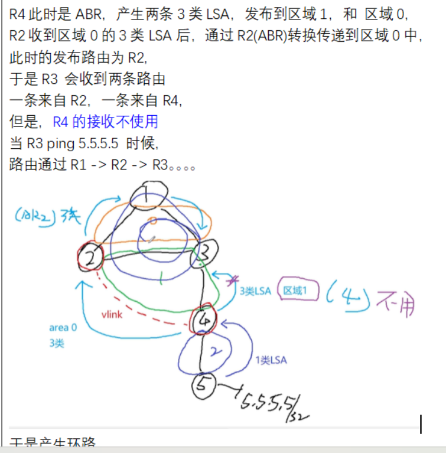

## OSPF 区域概念

```
连续的 OSPF 路由器组成的范围称为 OSPF 域

一个 area 中的 OSPF 路由器，需要同步 LSDB
（当单个区域的设备数量越多，LSA 产生的就会越多，LSDB 也会越庞大）

    ① 导致 OSPF 设备计算压力过大，消耗设备资源

    ② 单区域的路由变化，会导致区域中的路由器产生 I-SPF 计算（导致设备性能下降）

    ③ 设备可能会有性能差异

为了解决单区域的不足，一般在中大型的网络都会部署多区域

    ① 可以减少单区域中设备的计算压力

    ② 设备性能差异大，可以划分区域管理（减少设备导致的网络品质下降）

    ③ 区域间还能进行路由汇总（减少路由条目）

    ④ 单区域的 LSDB 容量减少，加快收敛 
```

================================================================

## ABR

```
通常ABR会连接骨干区域以及非骨干区域（多区域互联的设备）

①完全意义的ABR：
    在骨干区域中有full的邻接关系且其他区域有2way或full关系的称为完全意义的ABR

②非完全意义的ABR：
    在骨干区域中没有full邻接关系（但必须有接口属于区域0，或者存在2way关系），
    其他区域中有full邻接关系的设备称为非完全意义的ABR


以上两种ABR都会连接多区域，都会有多个区域的LSDB，并且能够把区域的LSA1和LSA2进行汇总
（汇总为3类LSA并传递到其他区域中，实现互访）
（3类和4类LSA，每经过一个ABR产生者都会重新修改，修改为转发ABR的router-id）
```

### ABR 有区域防环功能(水平分割)

```
从非骨干区域收到的 汇总LSA（3、4类）
只 存放 在LSDB中，
但 不计算 路由（防止环路）
该规则 只对完全意义的ABR有效
```

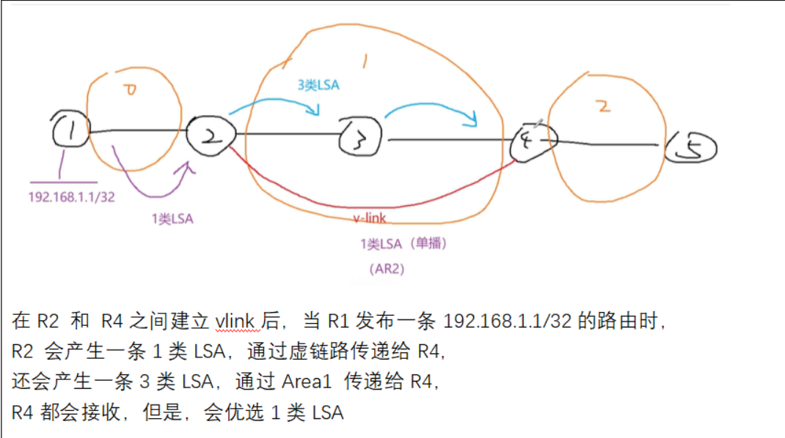
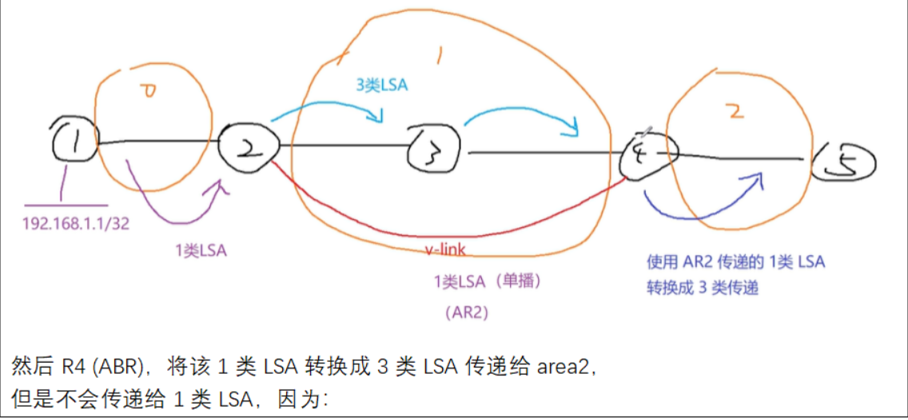
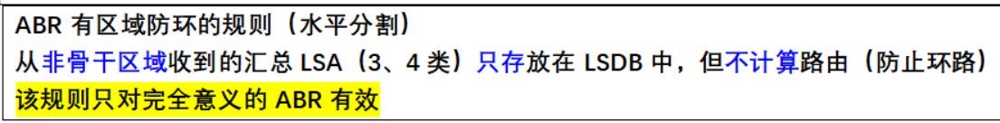

#### 情况一

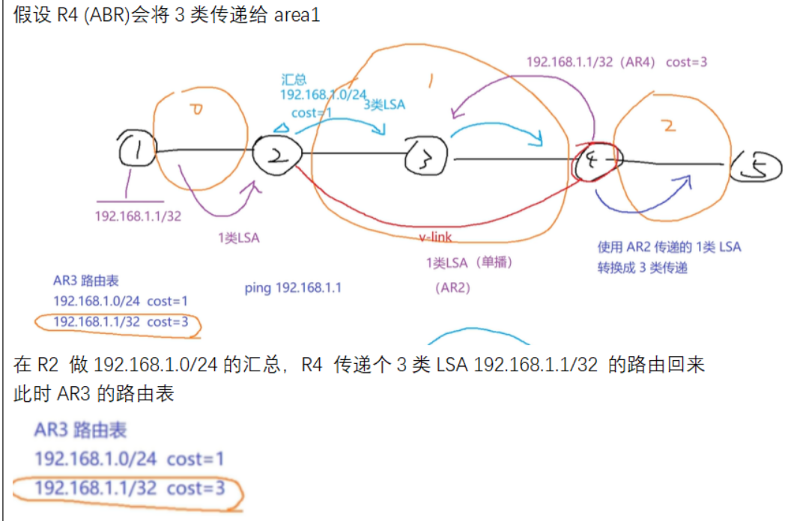
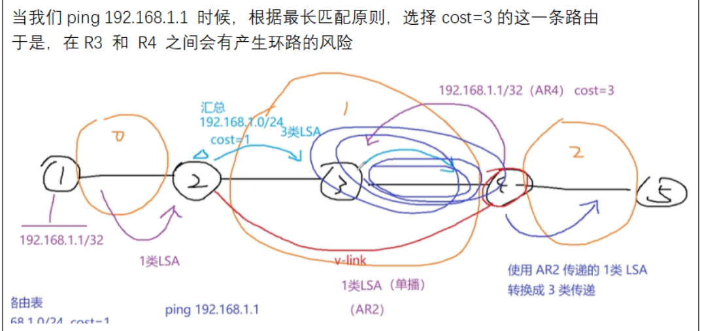

#### 情况二

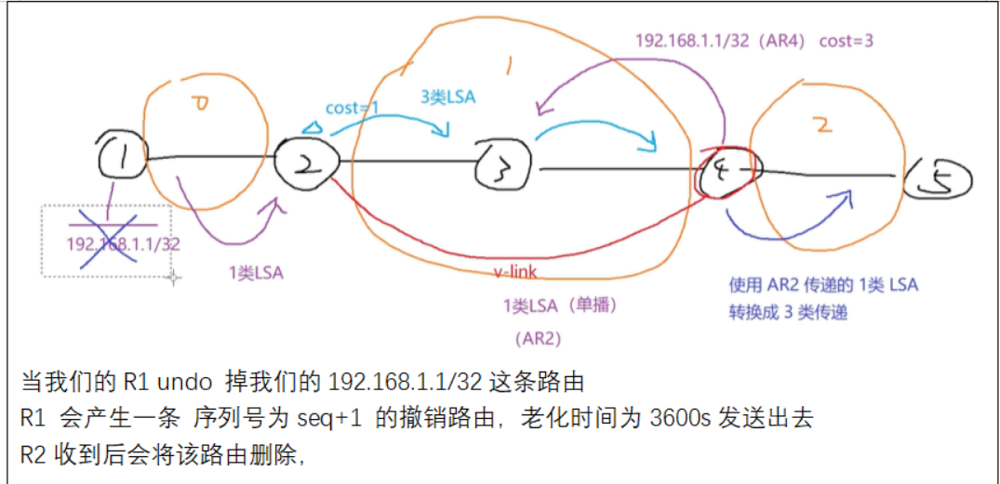
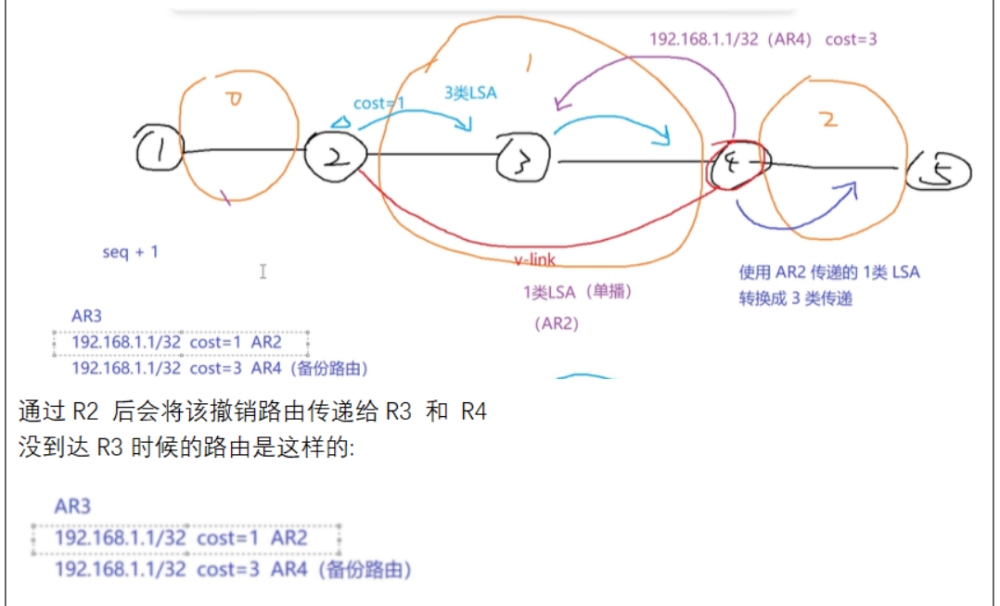
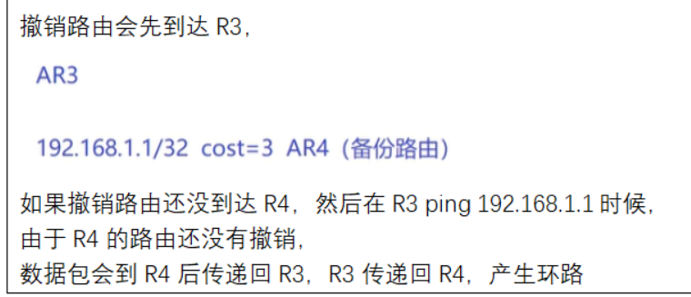
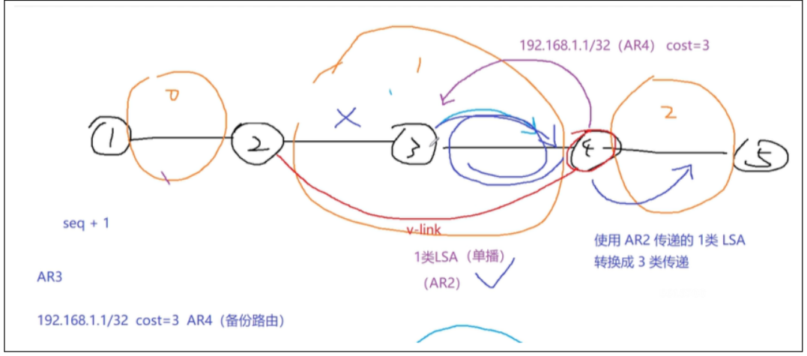

## 外部路由(5类 和 7类)

### 开销计算方式

```
bandwidth-reference / bandwidth
接口开销=带宽参考值/接口带宽

开销类型
    E1 和 E2 (默认 E2)

开销计算方式
    1. E1（内部开销 + 外部开销）
  
        比较方式：
            直接比较开销之和，越小越优先
  
    2. E2 (只显示外部开销，默认)
  
        比较方式：
            先比较外部开销（越小越优）
            当外部开销一致，再比较内部开销(越小越优)
  
    注意：
        1. E1 优先于 E2 （不比较开销值）
        （因为 E1 更加精确）

        2. 修改开销类型时：
            是谁产生的LSA，就找谁改
   
```

================================================

## FA 地址

### FA地址必须满足以下三个条件才可以不为0

#### 三个条件如下

1. 必须是 MA 网络类型
2. FA地址 必须发布在 OSPF 中
3. FA地址 所属网段 不为 静默接口
   - （不能收也不能发OSPF报文）

### FA地址的作用

1. 解决次优路径
2. 防环（当FA地址等于本设备下一跳或者出接口，不使用这一份5类LSA）

## ospf 发布 静态路由

```bash
# 查看 ospf 的数据库
dis ospf lsdb

在当前 ospf 进程中

# net 发布后需要用
import-route static
# 导入 ospf， 因为 静态路由 与 ospf 是不同协议
```

================================================================

## 特殊区域

```
 减少区域对外部路由的承载，减轻设备压力
```

### 1. Stub 区域

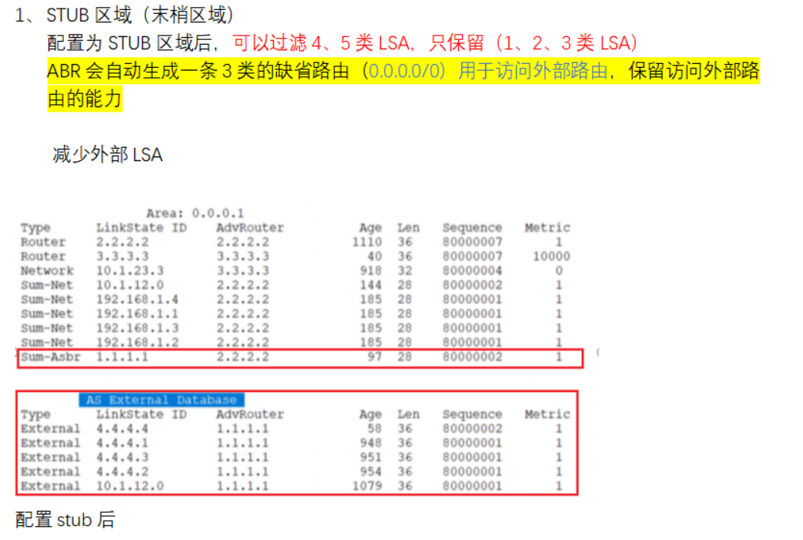
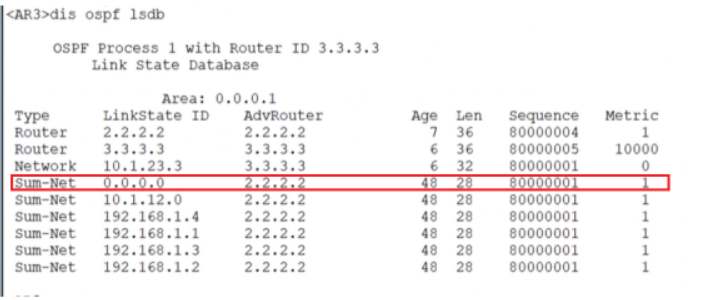

- 配置命令

```bash
OSPF

Area 1

Stub // 将区域 1 设置为 Stub
```

### 2. Totally Stub区域

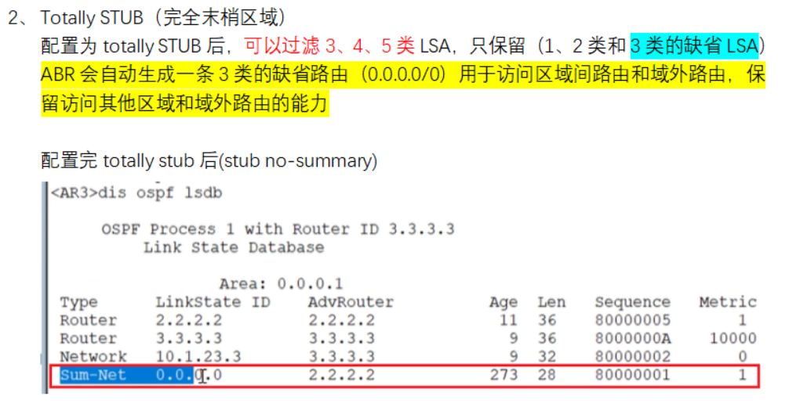

- 配置命令

```bash
OSPF

Area 1

Stub no-summary // 将区域 1 设置为 Stub
```

### 3. NSSA 区域

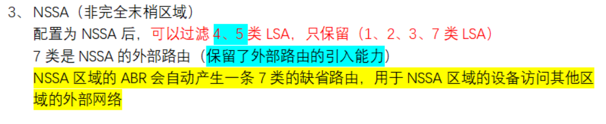

- 补充：

  - 如果其他区域访问该区域的 NSSA 路由的时候，NSSA 区域的 ABR 设备会进行 7 转 5 的操作； 把路由传递给其他区域
- 配置命令

```bash
OSPF 

Area 1

NSSA // 将区域 1 设置为 stub
```

### 4. Totally NSSA区域

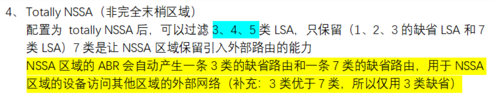
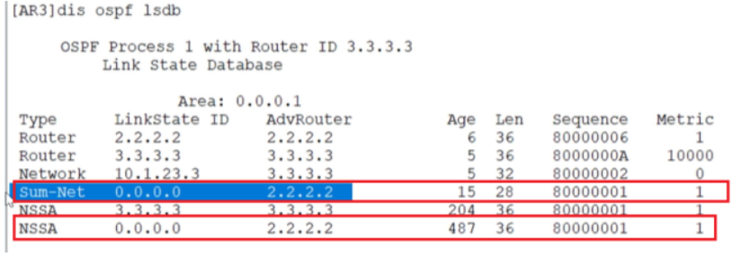

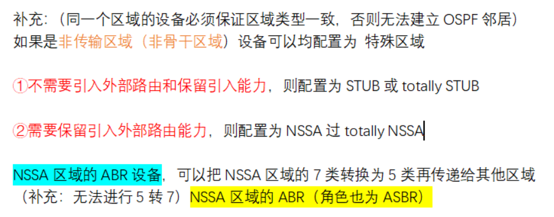

- 配置命令

```bash
OSPF

Area 1

Nssa no-summary // 将区域 1 设置为 totally nssa
```

##### 路由类的优先级

    - 1 > 2 > 3 > 5 > 7

##### 补充

所有的特殊区域，都只能是配置在 普通区域当中，骨干区域，不支持特殊区域的配置

- 0 ~ 2的32 次方
- 0 是骨干区域
- 1 ~ 2的32 次方（普通区域）

```bash
骨干区域无法使用特殊区域来减少路由承载， 可以使用 CIDR 来汇总
CIDR（无类域间路由） = https://bbs.huaweicloud.com/blogs/399323

始发 ABR： 第一次将 1、2类 LSA 转换成 3 类
```

[CIDR 无类域间路由](https://bbs.huaweicloud.com/blogs/399323)

### 传输区域 和 末端区域

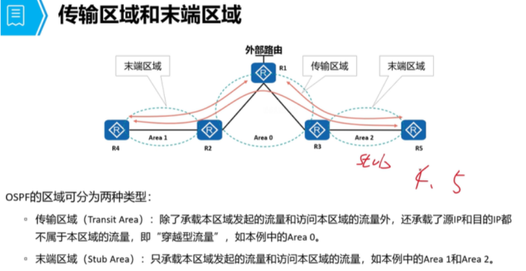

### 如何判断区域类型

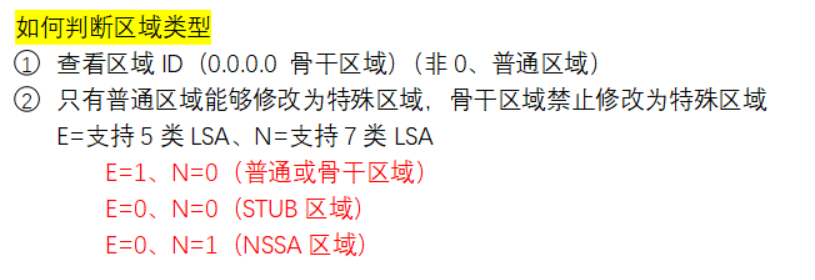

- 查看 Hello 报文的 options 位
  - 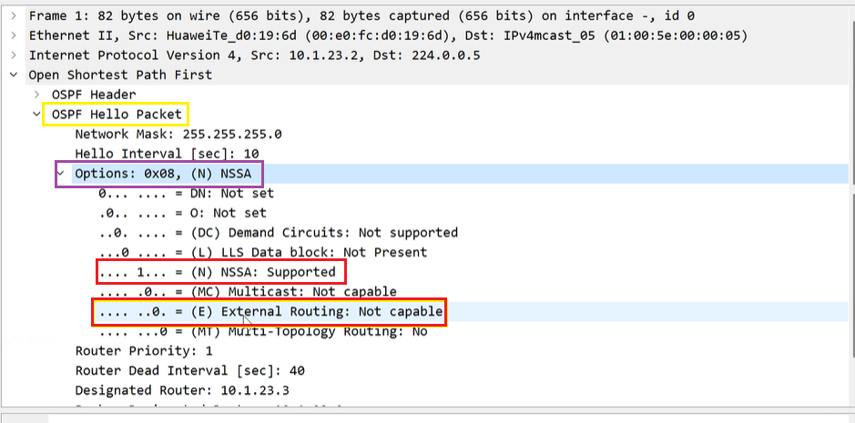

================================================================

## OSPF 汇总

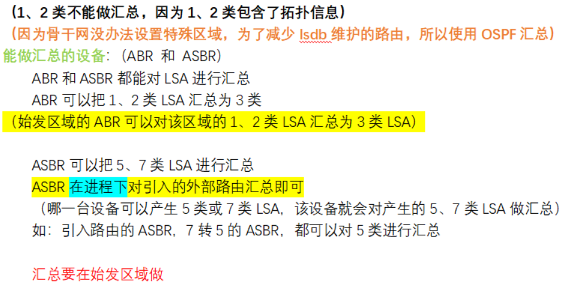

1. 针对 3 类 LSA 的汇总

```bash
在始发区域的始发 ABR 上去做汇总

# 配置命令
OSPF

Area 1

abr-summary 192.168.1.0  255.255.255.0  
//将192.168.1.0的前缀的路由汇总成一条
```

2. 针对 5、7 类汇总

```bash
在引入路由的 ASBR 上使用命令汇总
在产生该 5 类或则 7 类的设备上进行汇总

# 配置命令
OSPF

asbr-summary 100.1.1.0 255.255.255.0  
//将100.1.1.0的路由前缀的路由汇总成一条
```

- 补充： 7 转 5 的 ABR 上，可以对该 5 类进行汇总

###### 总结

- 3 类路由是始发 ABR 的始发区域上做汇总，
- 5 类、7类由产生者做汇总

================================================================

## 静默接口

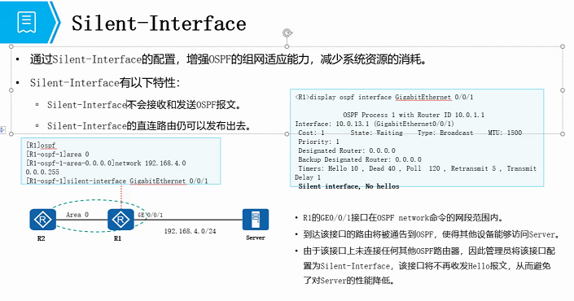

================================================================

## OSPF 报文认证

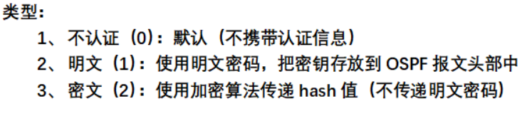

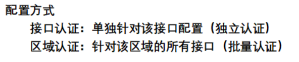

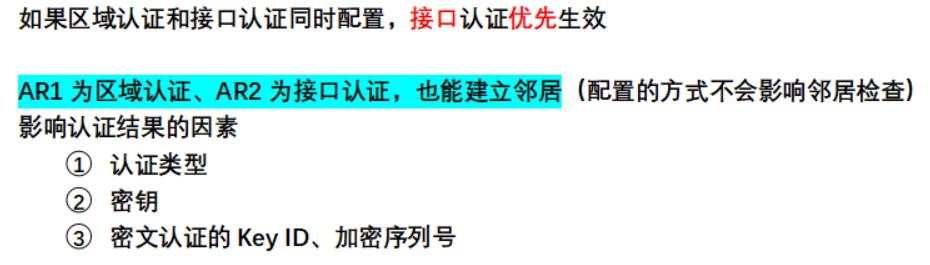

- 接口 优先于 区域

```
OSPF的认证：

•	OSPF支持报文认证功能，只有通过认证的OSPF报文才能被接收。
•	路由器支持两种OSPF报文认证方式，当两种认证方式都存在时，优先使用接口认证方式：
```

- 区域认证：

```
▫	区域认证方式：一个OSPF区域中所有的路由器在该区域下的认证模式和口令必须一致。
•	    [R2]ospf
•	    [R2-ospf-1]area 0
•	    [R2-ospf-1-area-0.0.0.0]authentication-mode simple cipher Huawei
```

- 接口认证

```
▫	接口认证方式：相邻路由器直连接口下的认证模式和口令必须一致。
▫	配置：
▫	    [R2]interface GigabitEthernet 0/0/1
▫	    [R2-GigabitEthernet0/0/1]ospf authentication-mode md5 1 cipher Huawei

```

## 注意

```
1. 创建 ospf 进程
    ospf 1 
    ospf 1 router-id 1.1.1.1
        区别：
            1. 一个没有指定
            2. 一个指定了 router-id 
      
        在 router-id 缺省的情况下
            1. 系统会优先从已经配置的 loopback接口中找最大的 IP 地址作为设备的 路由 ID
            2. 如果没有配置 Loopback 接口，则找其他物理接口中 IP地址最大的作为设备的 路由器ID

    但是如果 使用 ospf 1 router-id 1.1.1.1
        指定了 1.1.1.1 但是没有创建这个IP 或 loopback 接口
        会导致学不到 区域内的 ip ，建立了邻居但是，无法互访
```

================================================

## OSPF 配置及查看命令

```
1、创建OSPF进程及配置Router id
    ospf 1 router-id 1.1.1.1

2、创建区域发布接口路由

方式一：进入区域发布
    ospf 1 router-id 1.1.1.1
    area 0
    network 10.1.12.0  0.0.0.255			//把10.1.12.0/24发布到区域0中
    其中0.0.0.255 是掩码 255.255.255.0的通配符（或反掩码）

方式二：进入接口发布
	ospf 1 router-id 1.1.1.1
	area 0

	interface G0/0/X				// 进入接口 G0/0/X
    ospf enable area 0.0.0.0		// 把 G0/0/X 接口发布到OSPF进程1区域0中

3、虚链路配置
    ospf 1 router-id 1.1.1.1
    area x						    // X 为虚链路需要跨越的区域
    vlink-peer X.X.X.X				// X 代表对端ABR的Router-id

4、特殊区域配置
    ospf 1 router-id 1.1.1.1
    area x						    // X 为非骨干区域（需要修改为特殊区域的区域）
    nssa							// nssa 区域
    stub							// stub 区域

    nssa 和 stub 后都可以添加 no-summary 参数
    （代表配置为 totally 的 nssa 或 stub）补充：该区域所有设备都必须相同区域类型

5、路由汇总（3类LSA）
    ospf 1 router-id 1.1.1.1
    area x								    // X 需要汇总的路由始发区域
    abr-summary X.X.X.X  Y.Y.Y.Y			// X 代表汇总路由，Y代表掩码

6、路由汇总（5、7类LSA）
    ospf 1 router-id 1.1.1.1
    asbr-summary X.X.X.X  Y.Y.Y.Y			// X 代表汇总路由，Y代表掩码

7、静默接口
    ospf 1 router-id 1.1.1.1
    silent-interface G0/0/X			
    //被静默的接口，能够把接口网段发布到OSPF中，
        但是不收也不发OSPF报文（无法建立邻居）一般用于连接终端

8、认证
接口配置
    Interface G0/0/X
    ospf authentication-mode md5 1 plain 123		
    //接口认证（1为key id）123为密码

区域认证
    ospf
    area 0
    authentication-mode md5 1 plain 123  			// 区域0，区域认证

9、查看邻居命令
    display ospf peer brief			// 查看邻居摘要信息
    display ospf lsdb				// 查看设备LSDB是否完整（摘要信息）

    display ospf lsdb	router		// 查看所有的1类LSA
  
    （display ospf lsdb router 1.1.1.1）
    通过添加link state id 可以查看到具体设备的1类LSA

    display ospf lsdb	network		// 查看所有的2类LSA
    display ospf vlink				// 查看OSPF虚链路邻接关系
```
