# PIM 协议
```
    PIM-DM:
        密集模式
    PIM-SM:
        PIM-SM(ASM)： 为任意源组播建立组播分发树
        PIM-DM(SSM)： 为指定源组播建立组播分发树
```
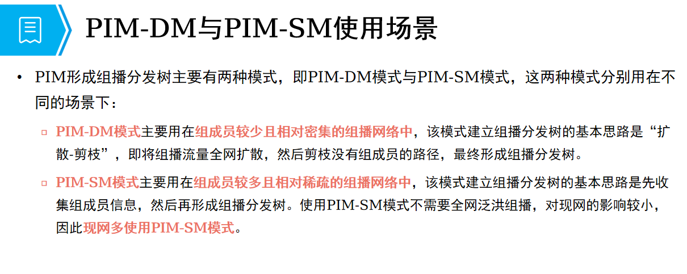
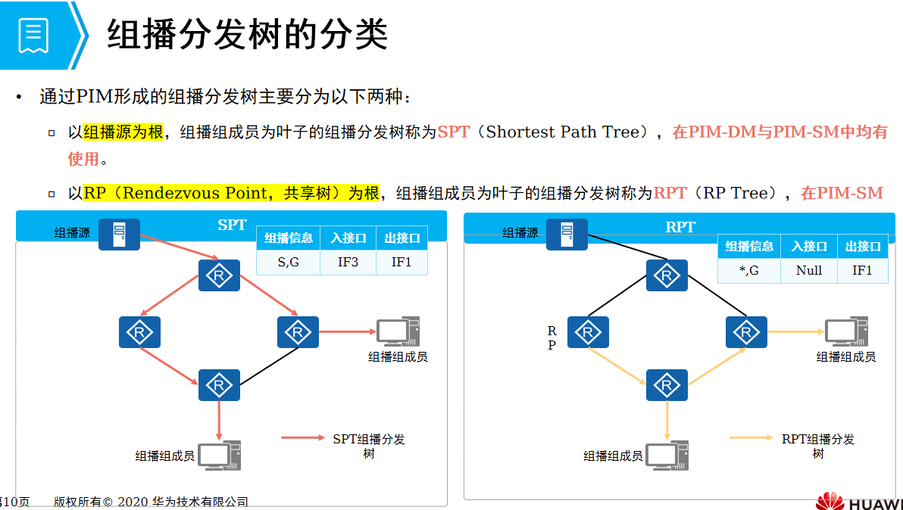
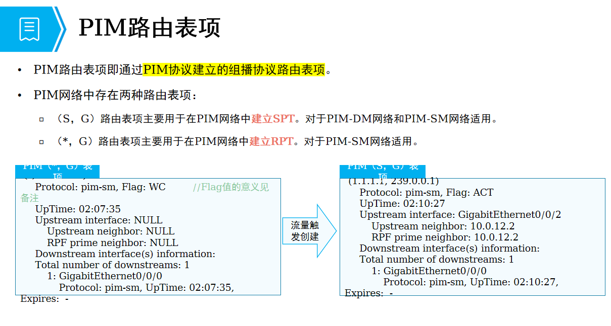


## 一、 PIM-DM（密集模式）
```
	可以从组播源到接收者建立一棵无环的组播分发树（SPT）
	工作方式：把组播流量通过 “推” 的方式发送给接收者

    PIM协议报文直接采用IP封装
    目的地址是 224.0.0.13，IP协议号为103
```
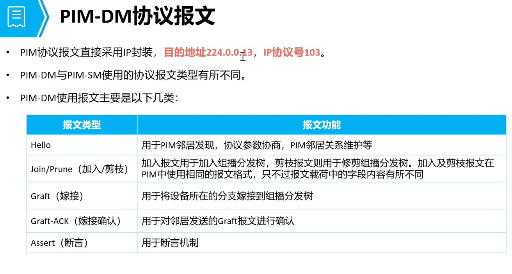

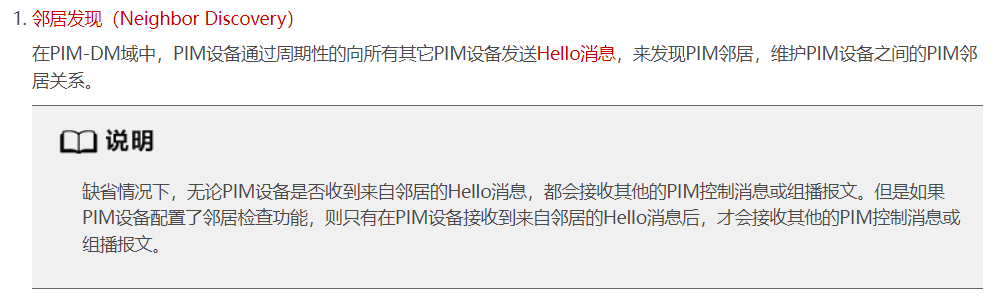
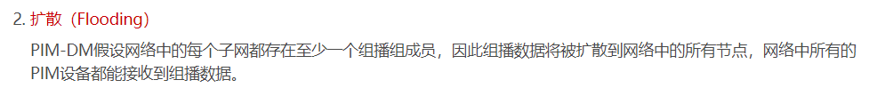
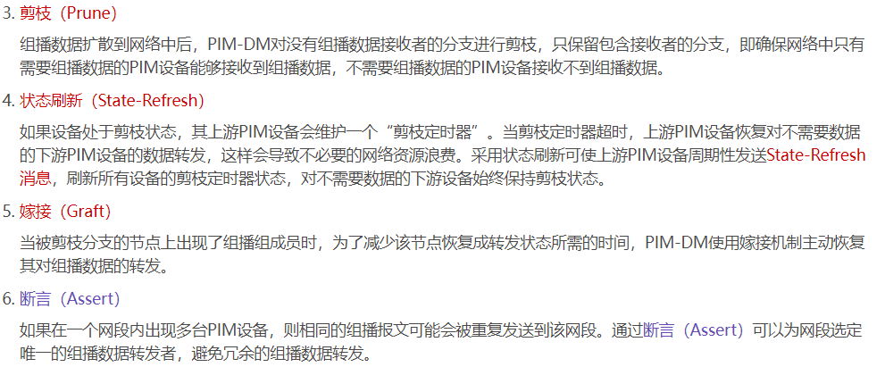

### 工作过程
#### 1. 邻居发现
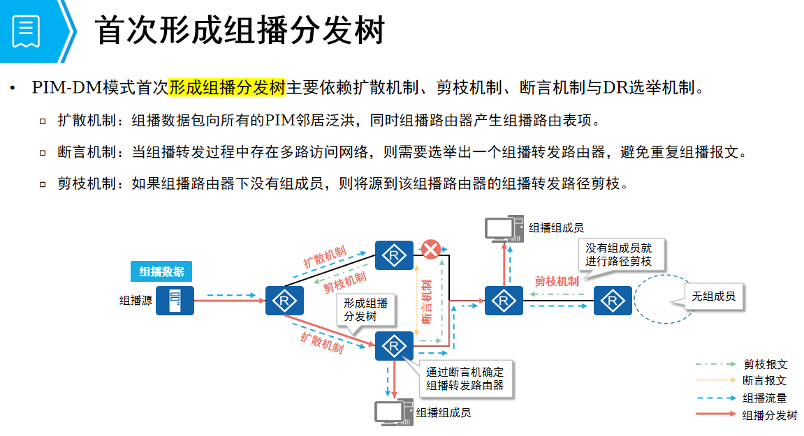
```
    1. 运行了 PIM 协议的接口，会主动发送 hello 报文，
        - 发现邻居和建立邻居关系（组播发送：224.0.0.13）
    2. 收到 Hello 报文的设备，会把对端 Hello 报文的源 IP 地址记录，作为邻居标识
    3. Hello 报文
        - 周期发送（30s）
        - 老化时间为 105s

    补充：
        hello 报文还可以选举 DR（每个网段都会选举一个 DR，有意义的是源端 DR）

		DR 选举，先比 DR 优先级（越大越优）默认：1（范围：1—65535）
			再比 DR 接口的 IP 地址，越大越优
```
#### 2. 扩散
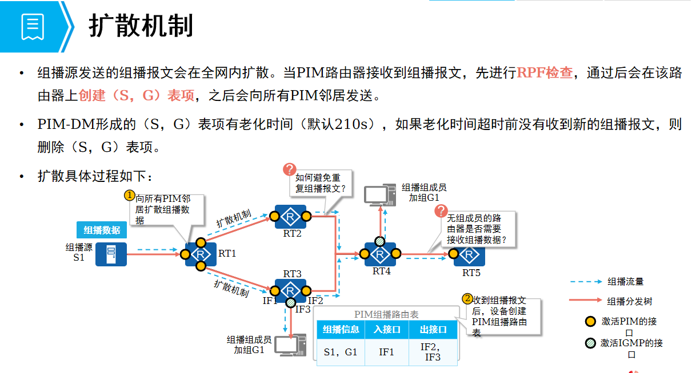
```
    当组播源活跃后，会主动发送组播流量，源端 DR 会建立(S,G)表项并推送组播流量给下游设备
    下游设备收到组播流量后为了防止次优路径 和 环路，会进行RPF检测(RPF反向转发检测)
    查看到达 组播源IP 地址的路由表

    判断依据：
        收到组播流量的接口是否与路由表出接口一致
        到达组播源的下一跳地址，是否PIM-DM的邻居（或RPF邻居）

    以上两个条件都通过，则流量是最优的，可以接收生成(S,G)表项，否则丢弃流量

    对于后续流量，只需要检测收到组播流量的接口与(S,G)表项的上游接口是否一致即可（减少检测的压力）
        1. 如果一致，则直接接收转发组播流量
        2. 如果不一致，则需要重新进行RPF检测（如果检测结果的接口与SG一致，则代表收到的组播流量次优，直接丢弃）
        （如果检测结果与SG表项的接口不一致，则更新 SG表项，SG 表项可能老化了）
```
#### 3. 剪枝
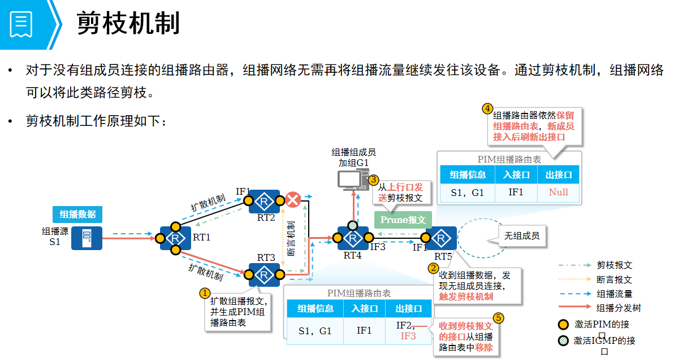
```
    当（S,G）表项下游接口为空的时候，就会触发剪枝，该（剪枝）设备回向（S.G）表项中的上游接口发送 prune（剪枝）报文
    上游设备接收到剪枝报文后，会从下游接口列表中，剪掉收到prune报文的接口，下一次组播流量就不会再往该接口发送

    补充：
        被剪枝的接口会启动 210s 的剪枝计时器，210s 后会直接重新加入转发
```
#### 4. 状态刷新
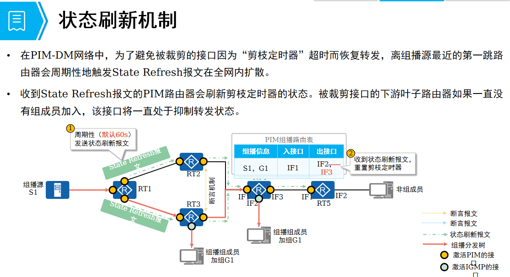
```
    为了避免频繁的扩散剪枝（被剪枝的接口 210s后会重新进入转发状态，下游如果依然没有接收者，还会触发一次新的剪枝）
    
    源端DR 会每隔60s 发送一次状态刷新报文，刷新剪枝接口的计时器，保障被剪枝接口不会频繁的进行扩散和剪枝
```
#### 5. 嫁接
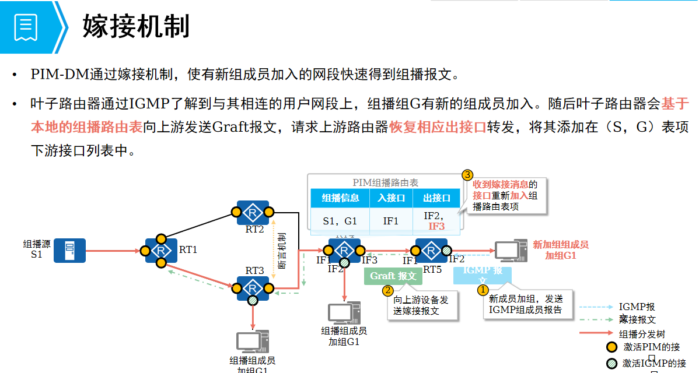
```
    当(S,G) 表项下游接口非空的时候，会触发嫁接报文，嫁接设备会根据(S,G) 表项的上游接口发送一个 Graft “嫁接” 报文（字段为：join）报文进行嫁接

    上游设备收到嫁接报文后（Graft）会把下游接口重新加入到（S,G）表项中，同时回复 Graft-ACK 报文
    （补充：如果没有收到Graft-ACK则每隔 3s 重新进行嫁接）

    完成嫁接后，第二次组播流量就可以根据新的（S,G）转发给接收者
```
#### 6. 断言
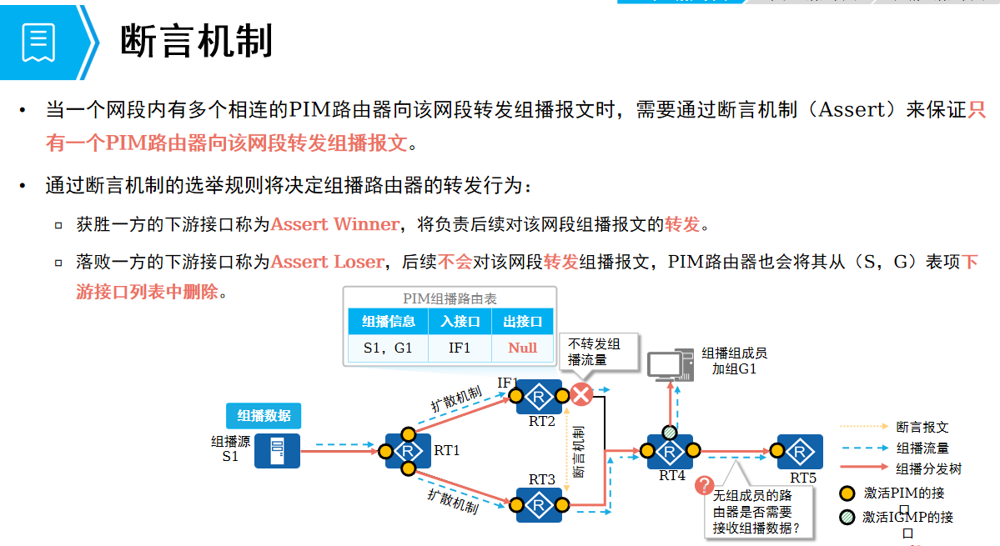
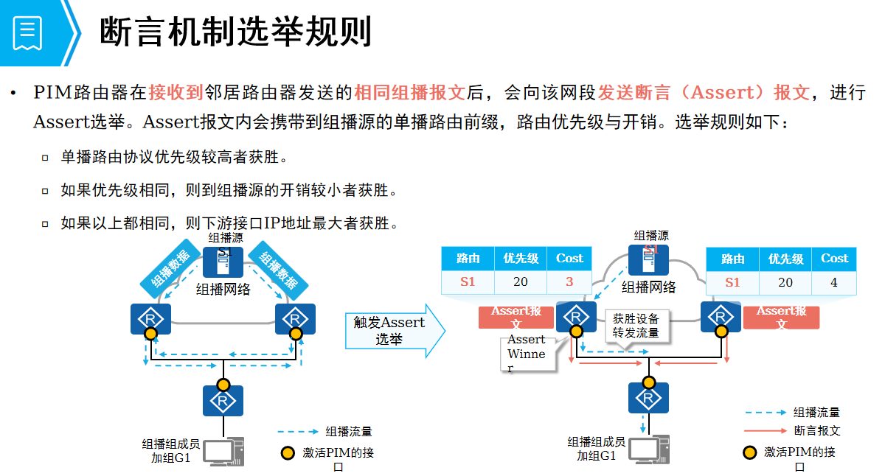
```
    （S,G）表项从下游接口收到同源同组的组播流量，该接口就会触发断言机制（代表下游收到多份重复的组播流量）

        1. 当多台设备的下游接口都收到 同源同组的组播流量，则会触发断言机制，互相发送断言报文
            携带内容（到达组播源IP地址的）：协议优先级、开销值、断言接口的IP地址

            先比较优先级，越小越优
            再比较开销值，越小越优
            最后比较断言接口的IP地址，越大越优
        
        2. 比喻的设备为 loser 会先把下游接口进行剪枝，同时从下游接口向wininer 发送剪枝报文
            winner 收到剪枝报文后会进行判断
            1. 如果下游有接收者（IGMP加组）则不会剪掉下游接口
            2. 如果下游有接收者（PIM邻居）则会等待3s，等待下游邻居发送join报文进行剪枝否决
            3. 如果下游没有其他接收者，则直接剪枝
```
### 配置命令
```
1、所有 PIM 路由器都需要开启组播功能
	multicast routing-enable				// 系统配置视图，打开组播功能

2、组播流量经过的接口，都需要开启 PIM-DM 协议
	interface G0/0/X
	pim dm

3、成员端 DR（最后一跳路由器）接口需要开启 PIM-DM 和 IGMP
	interface G0/0/X
	pim dm
	igmp enable						// 需要先打开 PIM-DM 再打开 IGMP 协议

4、模拟组播流量发送
	ping multicast  X.X.X.X					// 在组播源设备上（路由器模拟）ping 组播流量
									X.X.X.X 为组播 IP 地址

查看命令
	display pim routing-table 				// 组播路由表（一般维持 210s）
	display pim neighbor					// 查看 PIM 邻居
	

（因为组播流量需要进行 RPF 检测，PIM-DM 的 RPF 检测主要针对组播源 IP 地址进行，所以需要组播设备运行 IGP 协议，确保都能到达组播源）

补充命令：手工配置 RPF 静态路由
	ip rpf-route-static X.X.X.X 32 Y.Y.Y.Y			// X 为服务器源 IP 地址，32 为掩码，Y 为到达服务器的下一跳 IP 地址
								（该静态路由不会影响全局路由表，但是可以影响 RPF 检测）
```

## RPF 检测
```
先查看组播静态路由（RPF 静态路由）
    如果没有，则查看 MP-BGP 路由表，
    如果也没有最终查看全局路由表


默认情况下：
    （先查看最长掩码匹配原则，掩码一致则按以下顺序比较）
    
    组播静态路由 > MP-BGP > 全局路由表
```


## 二、 PIM-SM（ASM模式）

### 产生原因：
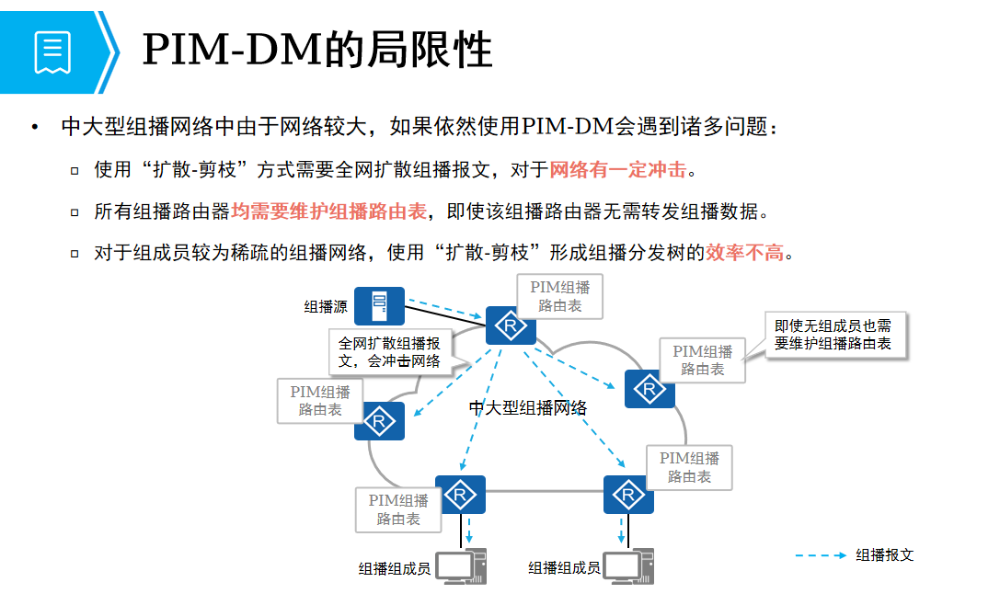
### 报文
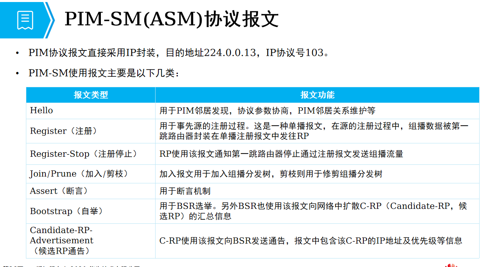

### 基本概念
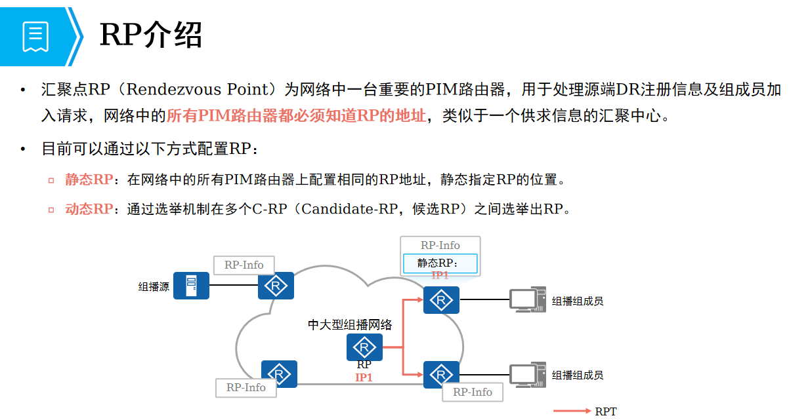
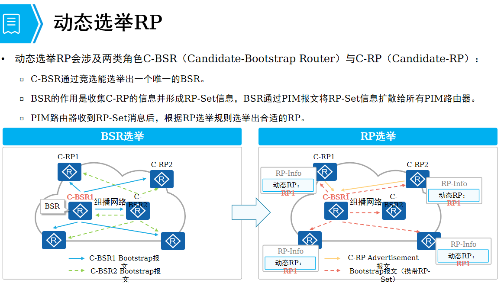

### 建立流程
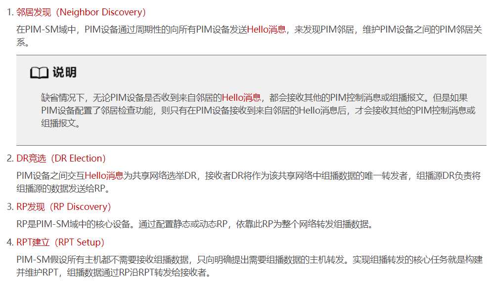
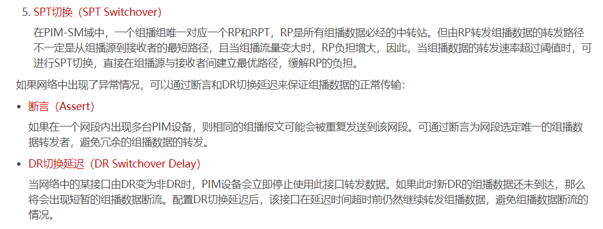

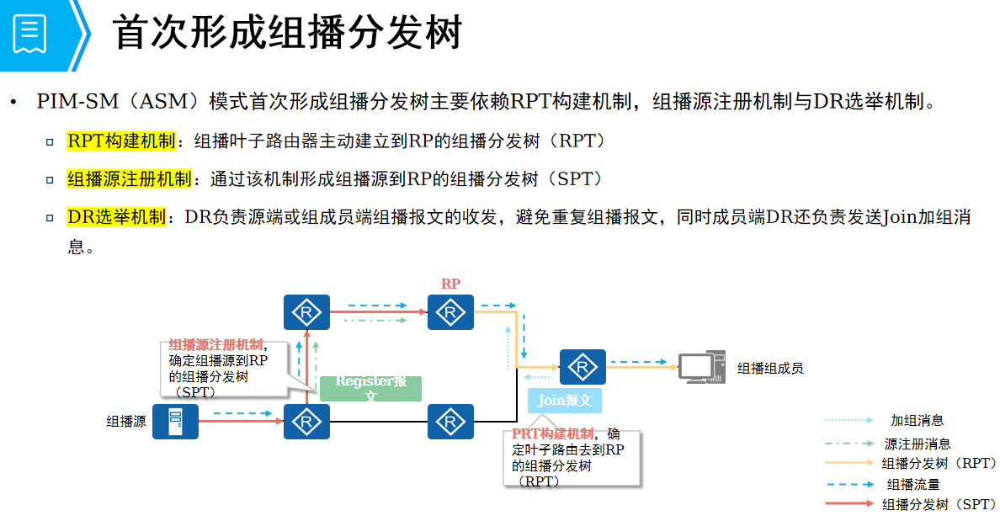

### 1. 发现邻居
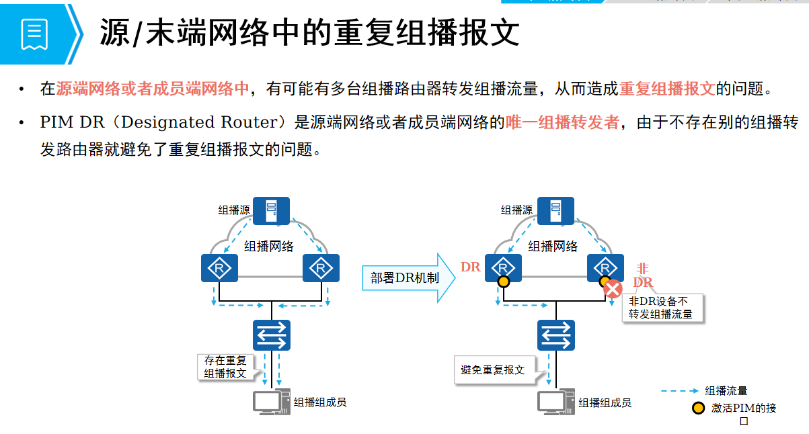
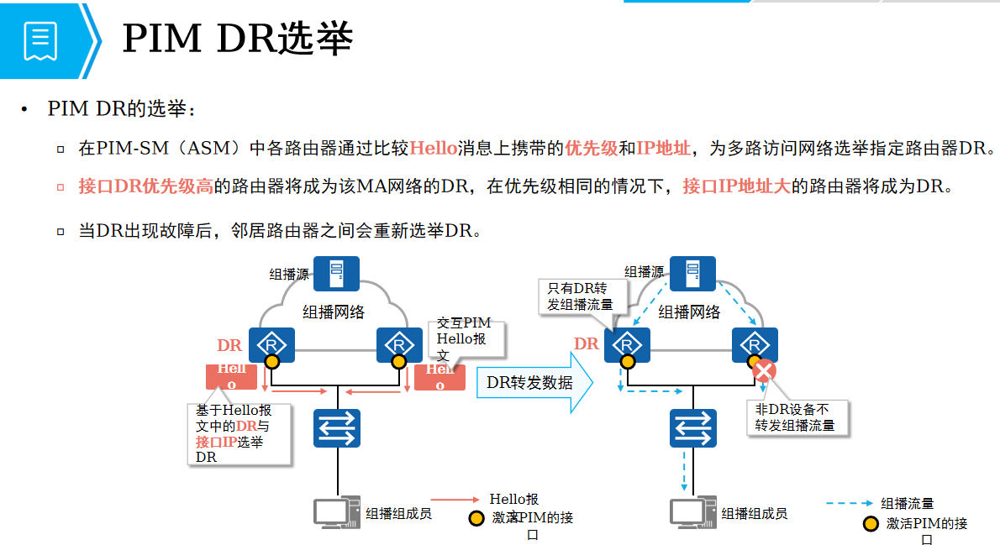
```
    1. 运行了 PIM-SM协议的接口，都会主动发送PIM Hello报文，发现邻居和建立邻居关系
    2. PIM Hello 报文也能用于 DR选举，优先级大的 和 IP地址大的会成为 DR（源端DR 和 成员端DR 有意义，其余的 DR 无意义）
```

#### DR 切换延迟
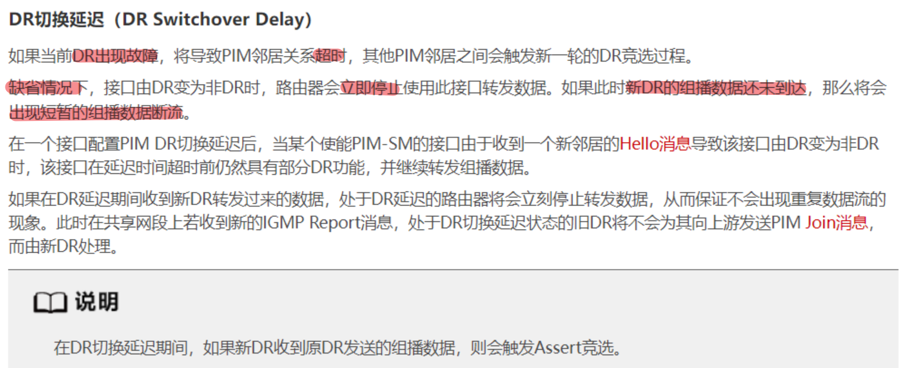

### 2. 选举RP
```
    在PIM-SM网络中，所有的PIM路由器都必须知道RP设备在哪里（用于建立共享树 和 源树）
        1. 静态选举：每台 PIM-SM 路由器都由手工指定RP的IP地址
        2. 动态选举：由 BSR（自主选举路由器）设备通告，告知全网PIM-SM设备，RP信息

    补充：
        全网可以设备多个 C-BSR，每台C-BSR都会认为自己是BSR设备，每隔60s 周期性发送 BSR报文
        这些 C-BSR 会进行比较，选举一台最优的BSR，其他C-BSR不会再发送 BSR报文

        比较规则：
            1. 先比较 BSR的优先级，默认0（0 ~ 255）越大越优
            2. 比较 BSR的IP地址，越大越优

        选举 BSR后，全网的C-RP都会单播把自身的信息通告给BSR，BSR 收集到 RP-SET中，再泛洪到全网

            通过BSR全网设备都能收集到RP信息
            成员端DR 会选举最优的 RP 进行加组，建立RPT，选举规则
            1. 服务组范围，越精确越优（最长掩码匹配原则）
            2. RP 优先级，越小越优（默认：0）
            3. Hash掩码长度，越大越优（默认：30）
            4. RP的IP地址，越大越优
```

### 3. 建立RPT（成员先活跃，终端设备通过IGMP协议加组）
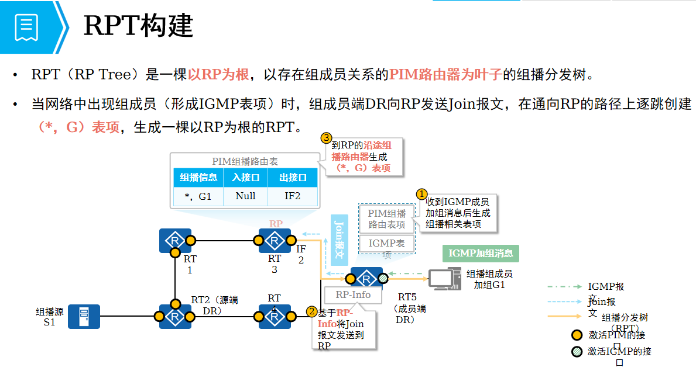
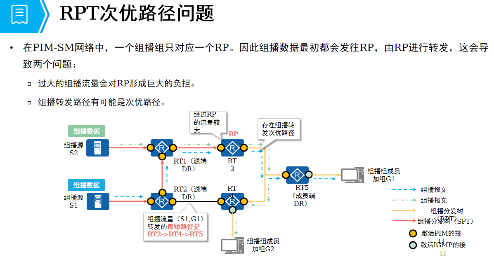

```
    当成员设备活跃后，成员端DR 会向 RP 设备进行RPF检测，同时建立RPT
    
    RPF检测过程
    查找路由表，如何到达 RP 设备
        1. 到达RP设备的下一跳地址，是否为 PIM-SM邻居，如果是，则该接口为 RPF邻居（也是RPF建树的下一跳地址）
        2. 到达 RP设备的出接口，是否与路由表到达 RP地址的出接口，如果是，该接口为上游接口
        3. 成员端 DR会生成（*，G）表项的上游接口，并且从上游接口向RPF下一跳发起（*，G）的 join报文

    上游设备收到join报文后，会查看 join 报文中的加组地址 与 接口IP地址是否一致，如果一致也会生成（*，G）表项，同时继续执行RPF检测（1. 2. 3. 操作）
    
    该设备会继续向上游发送（*，G）join 报文构建RPT，直到RP结束（到达RP后意味着 RPT 构建完成）
```
### 4. 注册（构建SPT）
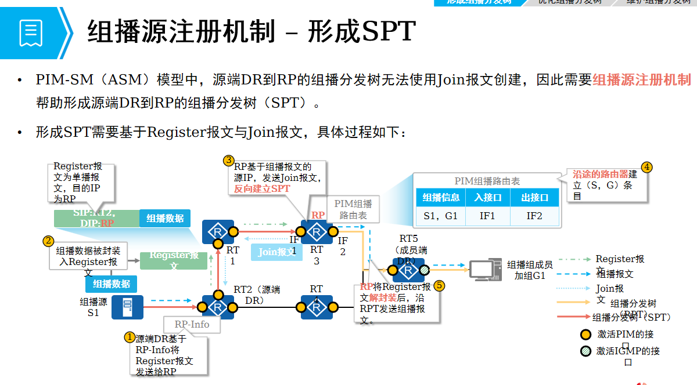
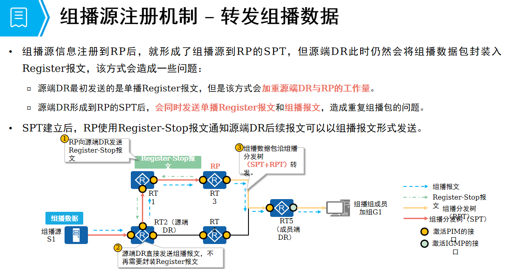
```
    当源服务器活跃后，会主动推送组播流量到达第一跳路由器（源端DR）
        1. 源端DR 会主动把组播流量封装到注册报文中，单播发送给RP设备
        2. 当RP设备收到注册报文后，会根据（*，G）表项的上下游接口生成（S,G）表项，并根据（S,G）表项转发流量给接收者
        3. 下游设备收到（S,G）的组播流量会根据（*，G）生成（S,G）逐跳到达组播接收者

    上游设备收到 join 报文后，会查看 join 报文中的加组地址与接口 IP 地址是否一致，如果一致也会生成（*，G）表项，同时继续执行 RPF 检测（1，2，3 操作）

	该设备会继续往上游发送（*，G）join 报文构建 RPT，直到 RP 结束（到达 RP 后意味着 RPT 构建完成）
```
### 5. 注册停止
```
    构建完成SPT后，RP的（S,G）表项没有添加 action 标志位（代表树无效，不活跃）

    当RP设备收到两份组播流量时，触发注册停止报文
        1. 由源端 DR 单播发送的组播流量
        2. 根据源端 DR 的（S,G）表项发送的组播流量

    RP 设备的（S,G）表项会打上 ACT 标志位，代表（S,G）活跃
    这时候 RP 会主动向源端 DR 单播发送注册停止报文，告知源端DR 不需要再发送单播承载的组播流量
    （补充：
        注册停止后，实际上源端DR 还是会发送注册报文，只不过不会携带组播流量，用于维持SPT的活跃）
```
### 6. SPT切换
```
    ① RP 设备的 SPT 切换（用于注册停止）参考（第 4、5 点）

	② 成员端 DR 的 SPT 切换，收到第一份（S，G）组播流量时，会根据 S（源地址）进行 RPF 检测，实现 SPT 切换
		
        （因为成员端 DR 到达 RP 的 RPT 是最优的，只是到达 RP 是最优的，到达组播源不一定是最优的）
```
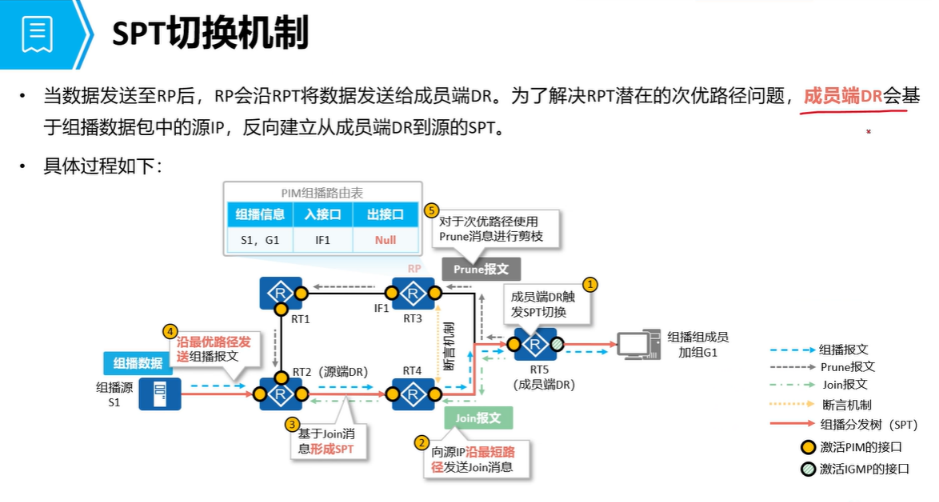

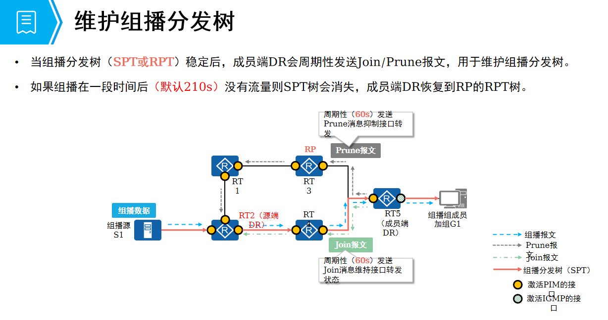

## PIM-SM（SSM模式）
```
    因为客户设备可以通过 IGMPv3 或者 IGMP mapping 直接获取组播源的 IP 地址
        ① 所以无需建立 RPT，无需维护 RPT，可以直接由成员端 DR 到达组播源，建立 SPT
        ② 无需进行注册
        ③ 无需进行 SPT 切换，因为直接建立的就是 SPT
```
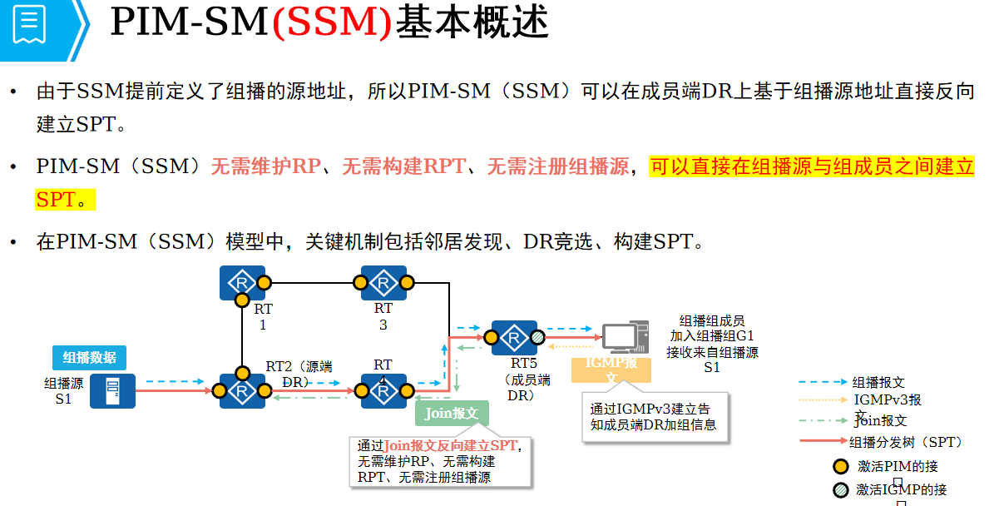
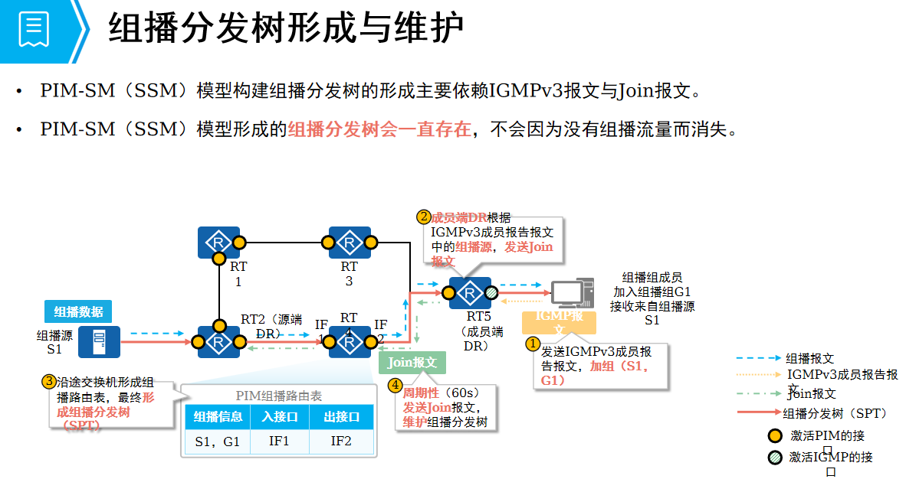

## 配置命令
```
1、开启组播协议（所有的 PIM-SM 设备都需要开启）
	multicast routing-enable


2、进入组播流量经过的接口，开启 PIM-SM 协议
	interface G0/0/X
	pim sm


3、（ASM 模型）指定 RP 和 BSR
	静态指定（RP）
	pim
	static-rp X.X.X.X			// X 为 RP 设备的 IP 地址（每台 PIM-SM 设备都需要手工指定）
	（保障 RP 地址必须可达）
	补充：静态 RP 没有备份，一旦 RP 失效，则需要重新指定


	动态指定
	pim
	c-bsr loopback0				// 例如：把 loopback0 指定为 C-BSR
	c-rp loopback0				// 例如：把 loopback0 指定为 C-RP

	（使用 IGP 协议，保障 BSR 和 RP 的 IP 地址可达，再指定为 C-BSR 或者 C-RP）
	补充：动态 RP 有备份功能，设备会根据 C-RP 的信息进行选举，一个 PIM-SM 域中可以存在多个 C-RP
	      设备会根据 RP-SET 信息进行选举，选出最优的 RP 进行加组（或者根据 HASH 掩码长度，选择不同的 RP 进行动态加组，负载均衡）

4、成员端接口
	interface G0/0/X
	pim sm
	igmp enable				// 开启 PIM-SM 协议以及 IGMP 协议

5、（SSM 配置）跳过 RP 和 BSR 的配置，其余一致
	interface G0/0/X
	pim sm
	igmp enable				// 开启 PIM-SM 协议以及 IGMP 协议
	igmp version 3				// 指定版本（IGMPv3）
	
	
	并且需要配置 SSM mapping 或者手工加组
	方法一：静态加组
	interface G0/0/X
	igmp static-group 239.1.1.1 source 1.1.1.1		// 手工指定加入的组播组和源 IP 地址

	
	方法二：配置 SSM mapping
	igmp							// 进入 IGMP 视图
	ssm-mapping 239.1.1.1 32 1.1.1.1			// 配置 SSM 映射关系（组播地址：239.1.1.1/32  源地址：1.1.1.1）

	interface G0/0/X
	igmp ssm-mapping enable 				// 在接口启动 SSM mapping 功能


查看配置命令
display pim routing-table					// 查看是否加组成功，获取组播流量信息
```

## PIM 模型比较
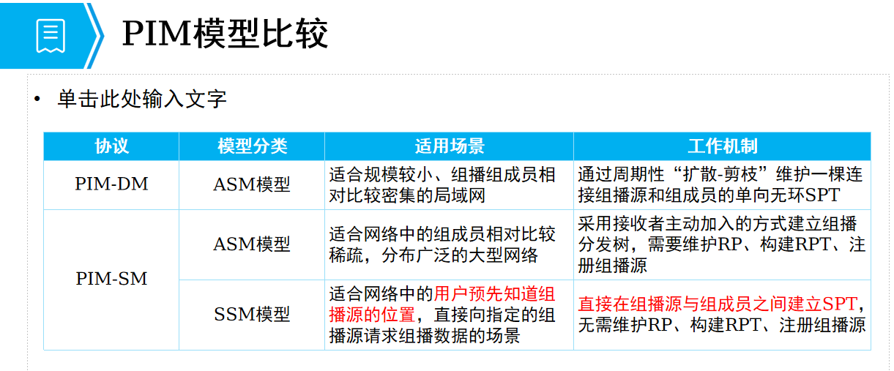


