## PPP (Point-to-Point，点对点协议)
### 广域网技术
- 广域网是连接不同地区局域网的网络，
- 通常所覆盖的范围从几十公里到几千公里。
- 它能连接多个地区、城市和国家，或横跨几个洲提供远距离通信，形成国际性的远程网络。

### 局域网 与 广域网 的区别
- 局域网
	- 是一种覆盖地理区域比较小的计算机网络
- 广域网
	- 是一种通过租用 ISP 网络 或者 自建专用网络来构建的覆盖地理区域比较广的计算机网络

### 广域网设备角色介绍
- CE (Customer Edge, 用户边缘设备)
	- 用户端连接服务提供商的边缘设备。
	- CE 连接一个或多个PE，实现用户接入。

- PE (Provier Edge, 服务提供商边缘设备)
	- 服务提供商连接 CE 的边缘设备。
	- PE 同时连接 CE 和 P 设备，是重要的网络节点。

- P (Provider, 服务提供商设备)
	- 服务提供商不连接任何 CE 的设备。

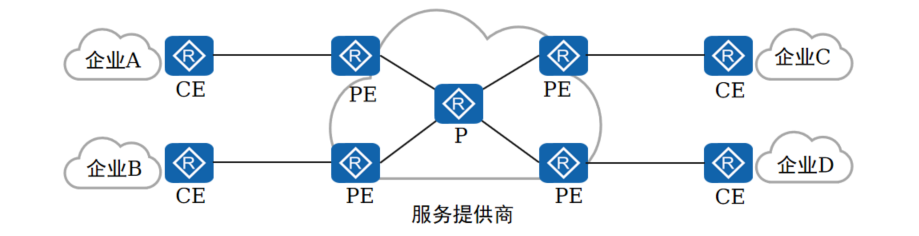

### PPP 协议
- 是一种常见的广域网数据链路层协议，
	- 主要用于在 全双工 的链路上进行点到点的数据传输封装
---
	1. PAP (Password Authentication Protocol, 密码验证协议)

	2. CHAP (Challenge Handshake Authentication Protocol, 挑战握手认证协议)

	3. PPP 便于扩展，可以扩展为 PPPoE

	4. PPP 提供 LCP (Link Control Protocol, 链路控制协议)， 用于各种链路层参数的协商

	5. PPP 协议提供各种 NCP (Network Control Protocol, 网络控制协议)， 用于各网络层参数的协商，更好的支持了网络层协议
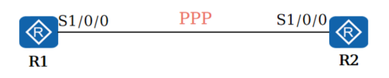

#### PPP 链路建立流程
	建立流程有三个阶段的协商过程:
		1. 链路层协商
		2. 认证协商(可选)
		3. 网络层协商
1. 链路层协商:
	- 通过 LCP 报文进行链路参数协商，建立链路层连接

2. 认证协商 (可选):
	- 通过链路层建立阶段协商的认证方式进行链路认证

3. 网络层协商
	- 通过 NCP 协商来选择和配置一个网络层协议并进行网络层参数协商

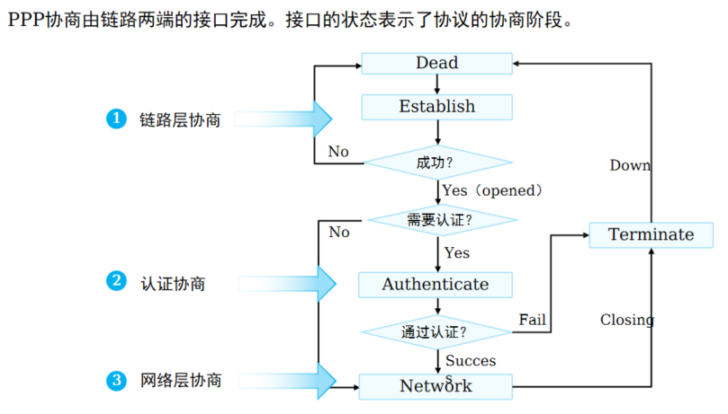
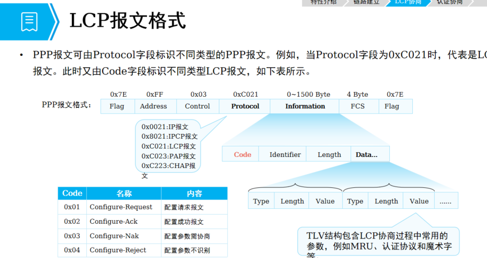
##### LCP 协商过程 - 正常协商
	- LCP 协商由不同的 LCP 报文交互完成。
	
	- 协商任意一方发送 Configure-Request报文发起。 
	
	- 如果对端接收此报文且参数匹配，则通过回复 Configure-Ack 响应协商成功
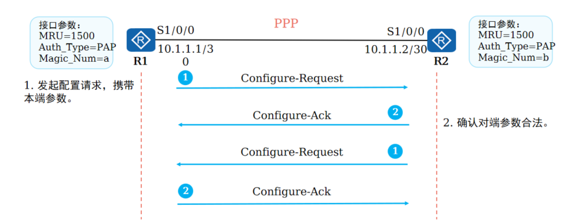

##### LCP 协商过程 - 参数不匹配
	- 在 LCP 报文交互中出现 LCP 参数不匹配时， 

	- 接受方回复 Configure-Nak 响应告知对端修改参数然后重新协商
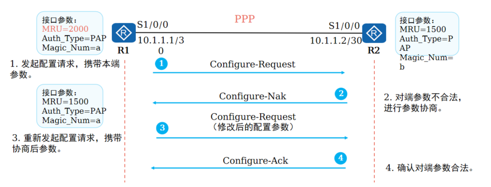

##### LCP 协商过程 - 参数不识别
	- 在 LCP 报文交互中出现 LCP 参数不识别时，
	
	- 接收方回复 Configure-Reject 响应告知对端删除不识别的参数然后重新协商
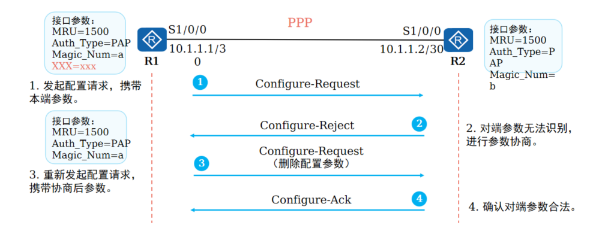

##### PPP 认证模式 - PAP
- 链路协商成功后， 进行认证协商(此过程可选).
	- PAP
	- CHAP
- PAP 认证双方有两次握手。协商报文以明文的形式在链路上传输
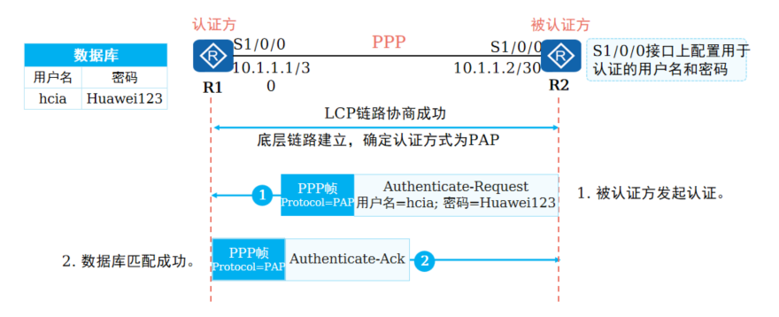

##### PPP 认证模式 - CHAP
- CHAP 认证双方有三次握手。协商报文被加密后再在链路上传输

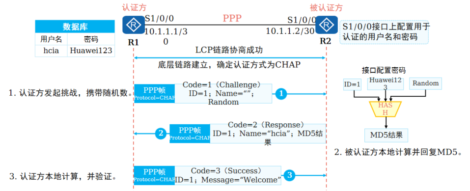

- LCP协商完成后，认证方要求被认证方使用CHAP进行认证。
- CHAP认证过程需要 三次报文 的交互。过程如下：
	- 认证方主动发起认证请求，认证方向被认证方发送 Challenge 报文，报文内包含随机数（Random）和 ID。
	- 被认证方收到此 Challenge 报文之后，进行一次加密运算，运算公式为 MD5{ ID＋随机数＋密码}，意思是将 Identifier、随机数 和 密码 三部分连成一个字符串，然后对此字符串做 MD5运算，得到一个 16 Byte 长的摘要信息，然后将此摘要信息和端口上配置的 CHAP 用户名一起封装在 Response报文 中发回认证方。

	- 认证方接收到被认证方发送的 Response 报文 之后，按照其中的用户名在本地查找相应的密码信息，得到密码信息之后，进行一次加密运算，运算方式和被认证方的加密运算方式相同；然后将加密运算得到的 摘要信息 和 Response报文 中封装的摘要信息做比较，相同则认证成功，不相同则认证失败。
- 使用 CHAP认证 方式时，被认证方的密码是被加密后才进行传输的，这样就极大的提高了安全性。
- 加密算法声明
	- 使用加密算法时，MD5（数字签名场景和口令加密）加密算法 安全性低，存在安全风险，在协议支持的加密算法选择范围内，
	- 建议使用更安全的加密算法，
		- 例如AES/RSA（2048位以上）/SHA2/HMAC-SHA2。

##### NCP 协商 - 静态 IP 地址协商
	- PPP 认证协商后，双方进入 NCP 协商阶段，
	- 协商在数据链路上所传输的数据包格式 与 类型。
	
	- 以常见的 IPCP 协议为例，
		- 它分为 静态 IP地址协商 和 动态 IP 地址协商

- 静态 IP 地址协商需要手动在链路两端配置 IP 地址
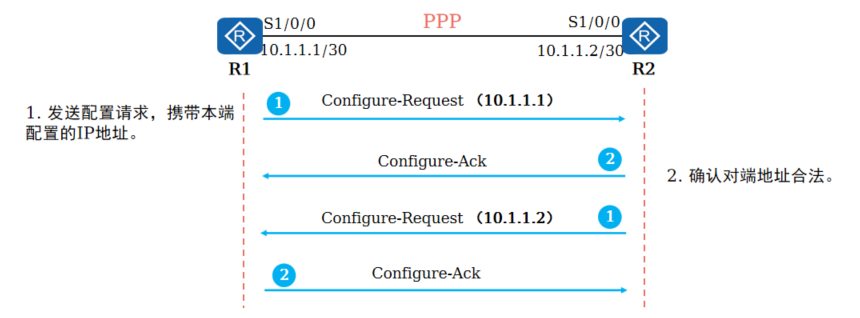

---
##### NCP 协商 - 动态 IP 地址协商
- 动态 IP 地址协商支持 PPP 链路一端为对端配置 IP 地址
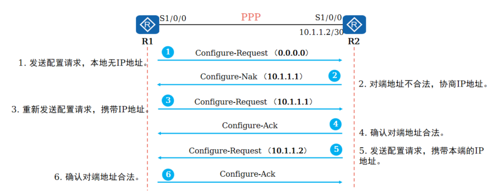
---
#### 基本配置命令
##### PPP 基础配置
```bash
# 1. 配置接口封装 PPP 协议
[Huawei-Serial0/0/0] link-protocol ppp
# 2. 配置协商超时时间
[Huawei-Serial0/0/0] ppp timer negotiate seconds

# 在 PPP LCP 协商中，本端设备会向对端设备发送 LCP 协商报文，如果在指定协商时间间隔内没有收到对端的应道报文，则重新发送
```
##### PAP 认证配置命令
```bash
# 1. 配置验证方式 PAP 方式认证对端
[Huawei-aaa] local-user user-name password { cipher | irreversible-cipher } password

[Huawei-aaa] local-user user-name service-type ppp

[Huawei-Serial0/0/0] ppp authentication-mode pap
# 配置验证方以 PAP 方式认证对端，首先需要通过 AAA 将被验证方的用户名 和 密码加入本地用户列表，然后选择认证模式

# 2. 配置被验证方以 PAP 方式被对端认证
[Huawei-Serial0/0/0] ppp pap local-user user-name password { cipher | simple } password

# 配置本地被对端以 PAP 方式验证时，本地发送 PAP 用户名和口令
```

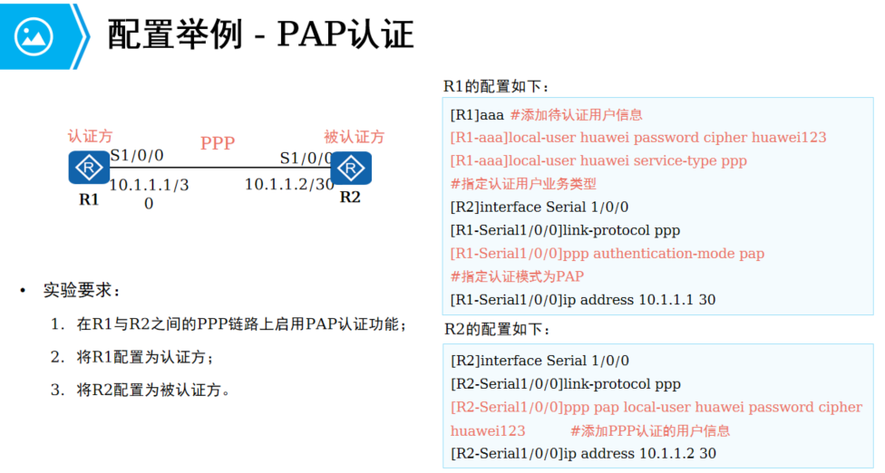

##### CHAP 认证配置命令
```bash
# 1. 配置验证方以 CHAP 方式认证对端
[Huawei-aaa] local-user user-name  password { cipher | irreversible-cipher } password
[Huawei-aaa] local-user user-name service-type ppp
[Huawei-Serial0/0/0] ppp authentication-mode chap

# 2. 配置被验证方以 CHAP 方式被对端认证
[Huawei-Serial0/0/0] ppp chap user user-name
[Huawei-Serial0/0/0] ppp chap password { cipher | simple } password

# 配置本地用户名，配置本地被对端以 CHAP 方式验证时的口令
```
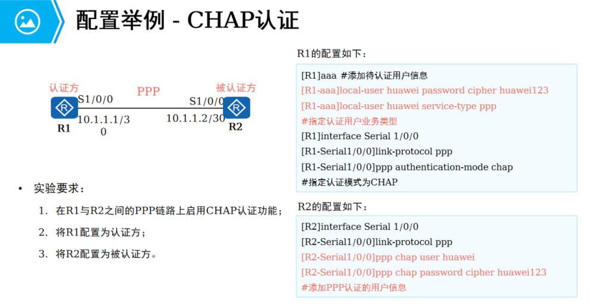

### PPPoE (PPP over Ethernet, 以太网承载PPP协议)
- 一种把 PPP 帧封装到以太网帧中的链路层协议，
	- 可以使以太网网络中的多台主机连接到远端的宽带接入服务器

- 运营商希望把一个站点上的多台主机连接到同一台远程接入设备，
	- 同时接入设备能够提供与拨号上网类似的访问控制和计费功能。
- 在众多的接入技术中，把多个主机连接到接入设备的比较经济的方法就是 **以太网**，
	- 而 PPP协议 可以提供良好的访问控制和计费功能，
	- 于是产生了在**以太网上传输 PPP报文的技术**，即 **PPPoE**。

- PPPoE利用以太网将大量主机组成网络，
	- 通过一个远端接入设备接入因特网，
	- 并运用PPP协议对接入的每个主机进行控制，
	- 具有适用范围广、安全性高、计费方便的特点。
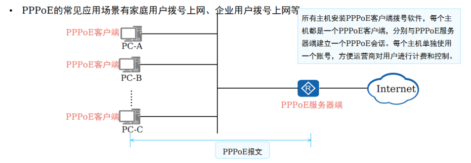

---
#### PPPoE 会话建立
1. PPPoE 发现
	- PPPoE 协商； 用户接入，创建 PPPoE 虚拟链路
2. PPPoE 会话
	- PPP 协商: LCP 协商、PAP/CHAP 协商、NCP协商等阶段
3. PPPoE 终结
	- PPPoE断开：用户下线，客户端断开连接或者服务器断开连接

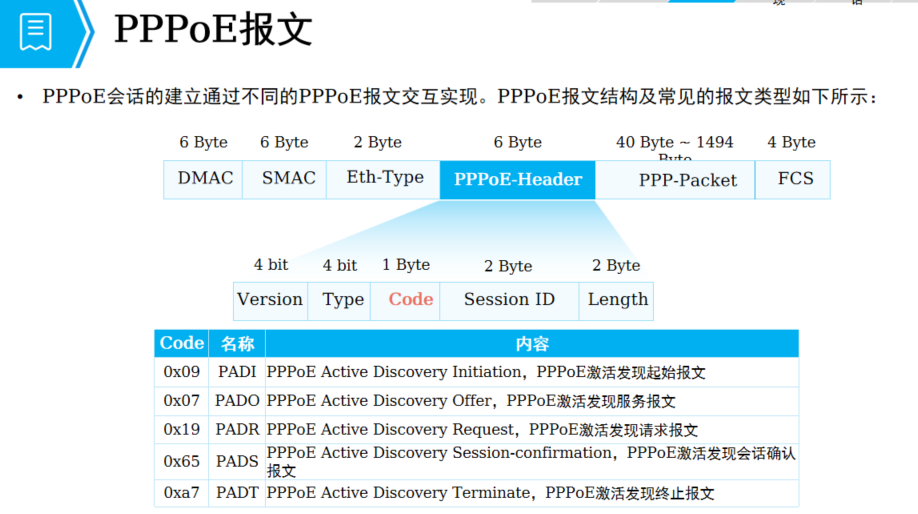
- PPPoE 报文封装在Ethernet帧中，Ethernet中各字段解释
	- DMAC：
		- 表示目的设备的 MAC地址，通常为以太网单播地址 或 以太网广播地址
	- SMAC：
		- 表示源设备的以太网 MAC 地址
	- Eth-Type:
		- 表示协议类型字段，
		- 当值为 0x8863 时表示承载的是 PPPoE发现阶段 的报文。
		- 当值为 0x8864 时表示承载的是 PPPoE会话阶段的报文
	- PPPoE 字段中的各个字段解释如下
		- VER: 
			- 表示 PPPoE 版本号，值为 0x01
		- Type: 
			- 表示类型，值为 0x01
		- Code: 
			- 表示 PPPoE 报文类型，不同取值标识不同的 PPPoE 报文类型
		- PPPoE会话ID，
			- 与以太网 SMAC 和 DMAC 一起定义了一个 PPPoE 会话
		- Length: 
			- 标识 PPPoE 报文长度

#### PPPoE 发现阶段
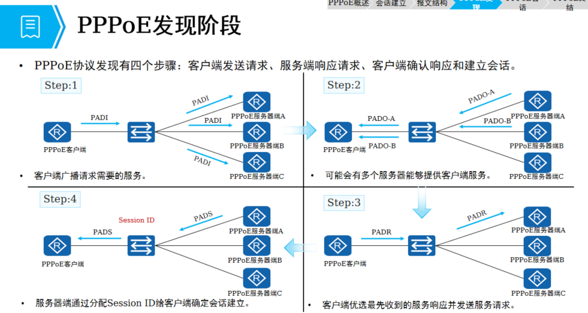

1. PPPoE 客户端在本地以太网中广播一个 PADI 报文，此PADI 报文包含了客户端需要的服务信息
	- PADI 报文的目的 MAC 地址是一个广播地址，
	- Code 字段为 0x09, 
	- Session ID 字段为 0x0000
	- 所有 PPPoE 服务器端收到 PADI报文 之后，
		- 会将报文中所请求的服务与自己能够提供的服务进行比较

2. 如果服务端可以提供客户端请求的服务，就会回复一个PADO报文
	- PADO 报文的目的地址是发送 PADI 报文的客户端 MAC 地址， 
		- Code 字段为 0x07, 
		- Session ID 字段为 0x0000

3. 客户端可能会收到多个 PADO 报文，此时将选择最先收到的 PADO 报文对应的 PPPoE服务器端，并发送一个 PADR报文给这个服务器端
	- PADR 报文的目的地址是选中的服务器端的 MAC地址，
		- Code 字段为 0x19，
		- Session ID字段为 0x0000

4. PPPoE 服务器端收到 PADR 报文后，会生成一个唯一的Session ID来标识和 PPPoE 服务器端为本 PPPoE会话产生的 Session ID

5. 会话建立成功后，PPPoE 客户端和服务器进入 PPPoE会话阶段

#### PPPoE 会话阶段
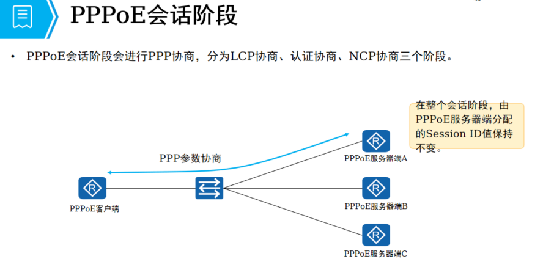

- PPPoE会话阶段可分为两部分：PPP协商阶段和PPP报文传输阶段。
	- PPPoE Session上的PPP协商 和 普通的 PPP协商方式一致，
		- 分为LCP、认证、NCP三个阶段。
	- LCP阶段主要完成 建立、配置 和 检测数据链路连接。
	- LCP协商成功后，开始进行认证，认证协议类型由LCP协商结果决定。
	- 认证成功后，PPP进入NCP阶段，NCP是一个协议族，用于配置不同的网络层协议，
	 	- 常用的是IP控制协议（IPCP），它负责配置用户的IP地址和DNS服务器地址等。
- PPPoE Session的PPP协商成功后，
	- 就可以承载PPP数据报文。
	- 在这一阶段传输的数据包中必须包含 在发现阶段确定的Session ID 并保持不变。

#### PPPoE 会话终结阶段
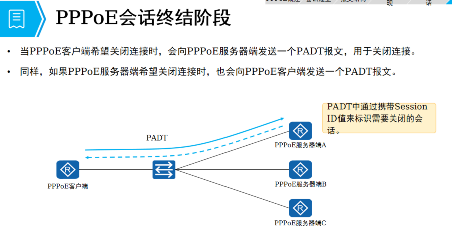
- 在 PADT 报文中， 目的 MAC 地址是单播地址
- Session ID 为希望关闭的连接的 Session ID
- 一旦受到一个 PADT 报文后，连接随即关闭

#### PPPoE 基本配置
```bash
# 1. 通过拨号规则来配置发起PPPoE会话的条件 
[Huawei] dialer-rule

# 2. 配置拨号接口用户名，此用户名必须与对端服务器用户名相同
[Huawei-Dialer1]dialer user username

# 3. 将接口置于一个拨号访问组
[Huawei-Dialer1]dialer-group group-number

# 4. 指定当前拨号接口使用的拨号绑定
[Huawei-Dialer1]dialer-bundle number  

# 5. 将物理端口与dialer-bundle进行绑定
[Huawei-Ethernet0/0/0]pppoe-client dial-bundle-number number
```
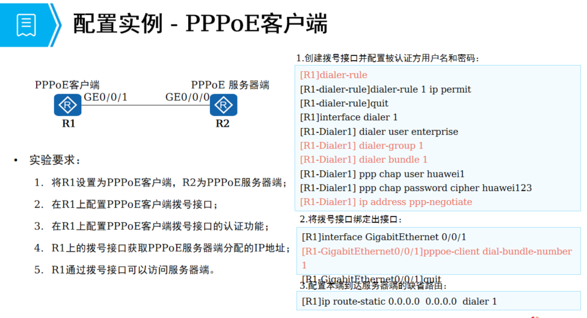
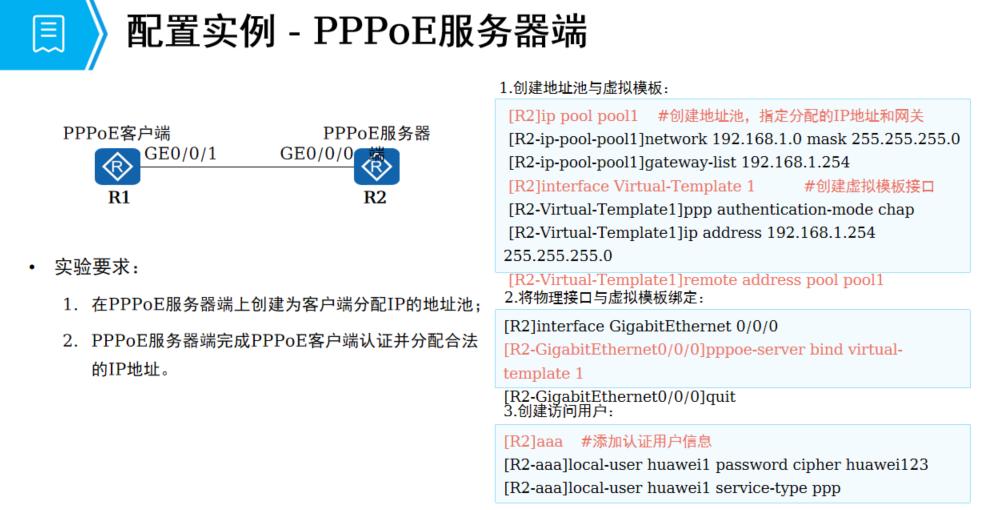
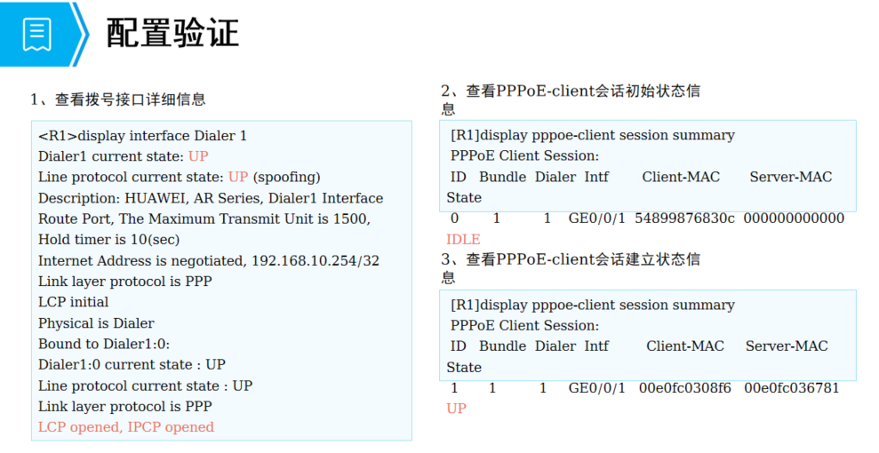

#### PPPoE 笔记
##### 一、PPPoE 笔记
- 作用：
	- 把 PPP 协议封装在以太网上，实现以太网的灵活组网，也能实现 PPP 的认证功能

- 优点：
	- 相比于 PPP 协议封装，PPPoE 更加灵活
		- （使用以太网作为传输）且覆盖范率更高
	
	- 相比于以太网组网，PPPoE 安全性更高
		- （可以结合 PPP 协议进行用户的身份认证、授权、审计等）


- 1、发现阶段：用户寻找服务器，以及请求会话 ID
	- ① 发送 PADI 报文，发现服务器，并请求相关的服务内容
	- ② 收到 PADI 报文的服务器，会根据用户请求的服务进行响应，回复 PADO 报文	
		- （包含：用于请求的服务、服务器 ID）
	- ③ 用户设备收到 PADO 后
		- （如果存在多份，会使用优先级高的，或者第一份收到的）
		- 用户选择了 PADO 报文后，会通过 PADR 进行响应
			- （包含：服务器 ID、会话 ID 的请求）
	- ④ 服务器收到后会根据服务器 ID 来判断，客户是否选择了本设备，
		- 如果是则通过 PADS 回复会话 ID


- 2、会话阶段：进行 PPP 协商（LCP、认证、NCP）
	- ① LCP：
		- 用于协商链路状态（魔术字、MRU、认证类型等）
	- ② 认证：
		- 提供 PAP、CHAP
	- ③ NCP：
		- 分配 IP 地址，协商接口网段信息
- 通过以上两个阶段，用户接口上网获取服务


- 3、终止阶段：
	- 当用户下线时，需要释放相应的网络资源
	- （IP、会话 ID 等）


##### PPPoE 配置
###### 服务器配置
```bash
# 1、创建虚拟模板
	interface Virtual-Template0				// 创建 VT 虚拟模板
	ppp authentication-mode pap 			// 开启 PAP 认证功能			
 	ip address 100.1.1.3 24				// 配置服务器通信地址

# 2、创建地址池，用于拨号用户获取公网 IP 地址
	ip pool client
	network 100.1.1.0 mask 24
	excluded-ip-address 100.1.1.3 			// 创建地址池，并且排除服务器已经使用的 IP 地址

# 3、调用地址池
	interface Virtual-Template0				// 进入 VT 虚拟模板
	remote address pool client				// 调用地址池（名称不能错误，否则无法分配 IP）

# 4、创建 PPPoE 用户账户
	aaa
	local-user ar1 password cipher Huawei@123		// 进入 AAA 配置相应的账户
 	local-user ar1 service-type ppp			// 并且指定为 PPP 服务

# 5、进入 PPPoE 服务器的物理接口，调用虚拟模板
	interface G0/0/0					
 	pppoe-server bind Virtual-Template 0			// 把 VT0 模板的配置应用于 G0/0/0 物理接口（使得物理接口能够使用虚拟模板的功能）
```

##### 客户端配置
```bash
# 1、创建虚拟的拨号接口
	interface Dialer0					// 创建接口
 	ppp pap local-user ar1 password simple Huawei@123	// 配置运营商分配的账户信息
 	ip address ppp-negotiate				// 通过 PPPoE 服务器获取 IP 地址

 	dialer user ar1					// 拨号接口需要设置用户名称信息，可以使用与 PAP 拨号相同的用户名
 	dialer bundle 1					// 拨号接口必须指定相关的 ID 用于后续绑定（需要先配置用户名 user 才能绑定 ID）

# 2、进入链接 PPPoE 服务器的物理接口，调用虚拟模板
	interface G0/0/1					// 进入物理接口
 	pppoe-client dial-bundle-number 1			// 把 D0 相关的配置映射到物理接口使用（因为以太网接口无法直接调用 PPP 配置）

# 3、实现私网与公网互访
	# ① 配置静态缺省路由
		ip route-static 0.0.0.0  0   Dialer0		// 设置静态路由，下一跳指定为（虚拟拨号接口）

	# ② 配置 NAT 
	 	acl 2000
		rule permit  source  any			// 允许所有的数据包通过

		interface Dialer0	
		nat outbound 2000				// 使用 D0 接口的 IP 地址进行 NAT 转换
```