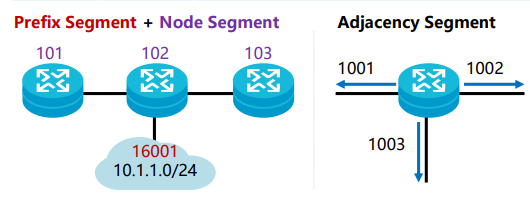
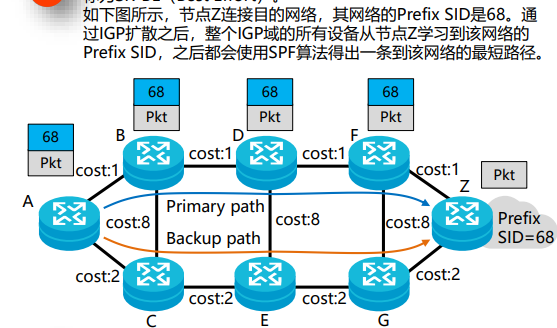
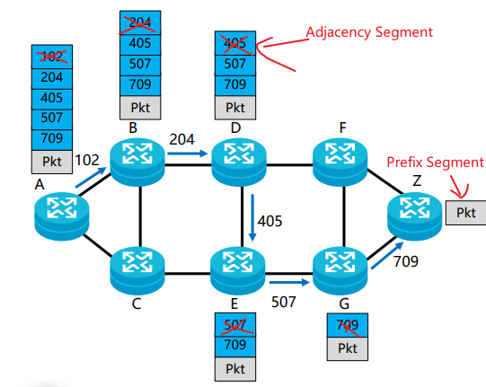
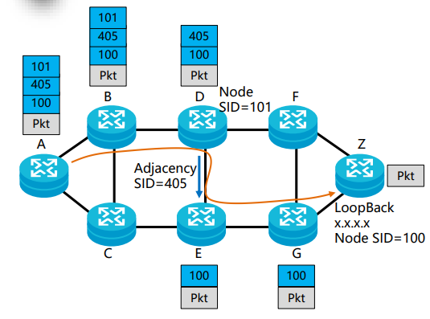
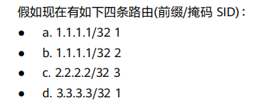
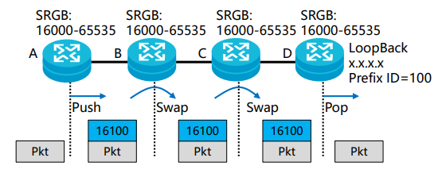
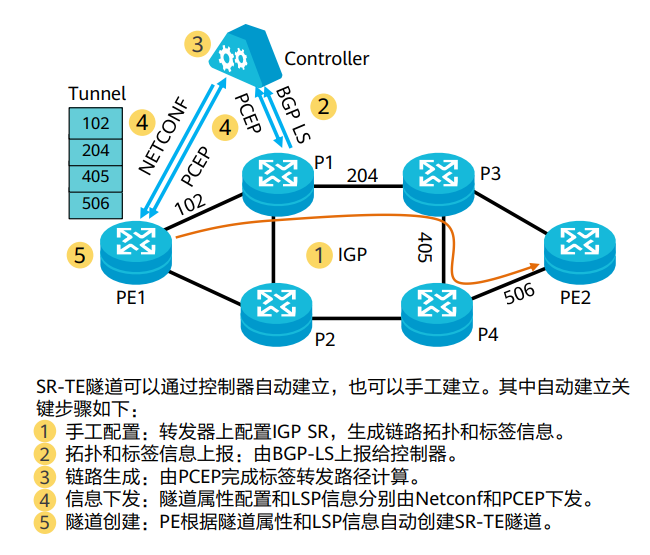

# Segment Routing 段路由

```
基于源路由理念而设计的在网络上转发数据包的一种协议
 
Segment Routing 将网络分为一个个段，并为这些段和网络节点分配 Segment ID

通过对 SID 的排列得到一条转发路径
```

## 概念

```
SR 域：
    SR 节点的集合

SID：
    - Segment ID，用于标识唯一的Segment。
    - 在转发平面，SID 可以映射为 MPLS 标签

SRGB
    - Segment Routing Global Block
    - 用户指定的为 Segment Routing 预留的本地标签集合

SRLB
    - Segment Routing Local Block
    - 用户指定的为 Segment Routing MPLS 预留的本地标签集合
    - 本地有效，全局可见
```

## Segment 分类

- Prefix Segment (前缀段)
  - （代表路由）
  - 手工配置
  - 作用
    - 标识 网络中的某个目的地址前缀(Prefix)
    - IGP 扩散，全局可见，全局有效
    - Node Segment 是特殊的 Prefix Segment，
      - 用于标识特定的节点（网元）
      - （代表设备）

- Adjacency Segment
  - （代表接口，本地有效）
  - 通过协议动态分配 或 手工配置
  - 作用
    - 标识网络中的某个邻接
    - IGP 扩散，全局可见，本地有效



## 基于 Segment 组合转发路径
1. 基于 Prefix Segment：
  - 由 IGP 使用 SPF 算法计算得出，
  - 也叫 SR-BE（Best Effort）
  - 

2. 基于 Adjacency Segment：
  - 头节点指定严格显式路径（Strict Explicit）
  - 主要用于 SR-TE
  - 

3. 基于 Adjacency Segment + Node Segment：
  - 显式路径与最短路径相结合，称为 松散路径
  - 主要用于 SR-TE
  - 

## Segment Routing 标签冲突处理原则
```
标签冲突分为：
1. 前缀冲突
  - 指相同前缀关联了 两个不同SID
2. SID 冲突
  - 相同 SID 关联到了不同前缀
```
```
处理原则
  1. 优先处理前缀冲突
  2. 再根据处理结果，进行 SID冲突处理
    ① 前缀掩码更大者优先
    ② 前缀更小者优先
    ③ SID 更小者优先
```

1. 先进行前缀冲突处理，a 和 b为前缀冲突
```
  a 的 SID 比 b 的 SID小，选a

  - a: 1.1.1.1/32 1
  - b: 2.2.2.2/32 3
  - c: 3.3.3.3/32 1
```
2. 根据上述结果进行 SID冲突处理，a 与 d 为 SID 冲突，
```
  a 的前缀 比 b 的前缀小，选a

  - a: 1.1.1.1/32 1
  - c: 2.2.2.2/32 3
```

## SR-BE的实现
```
  基于 SR-BE 技术建立的转发路径实际上是一种 LSP，
    - 这种 LSP 不存在 Tunnel 接口
```
### SR LSP 建立的关键步骤

#### 1. 手工配置
- 网元上配置 Prefix SID 和 SRGB，
  - 通过 IGP 报文泛洪扩散。
#### 2. 标签分配
- 各个网元解析收到 IGP 报文，
  - 根据自己的 SRGB计算标签值
    - 公式：
      - 标签值 = 自己的 SRGB的起始值 + Prefix SID
    - 根据下一跳节点发布的 SRGB计算出标签值
      - 出标签值 = 下一跳 SRGB 起始值 + Prefix SID值

#### 3. 路径计算
- 各个网元根据 IGP ，使用 SPF 计算标签转发路径，生成转发表

```
SR LSP 数据转发 和 MPLS LDP LSP完全相同
```

## SR-TE的实现
```
使用 SR-TE 技术建立的隧道
  - 称为 SR-TE 隧道
```

