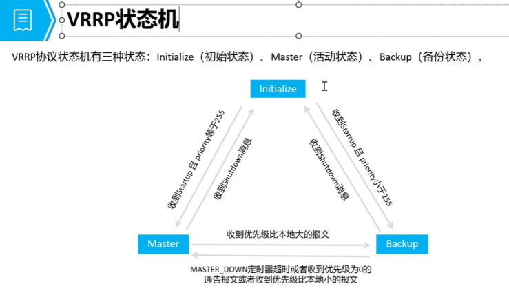
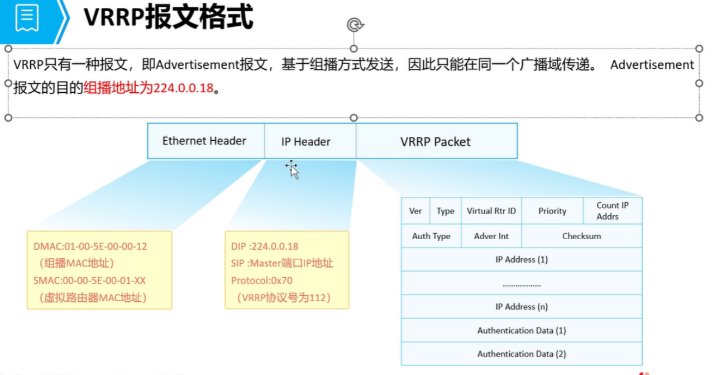
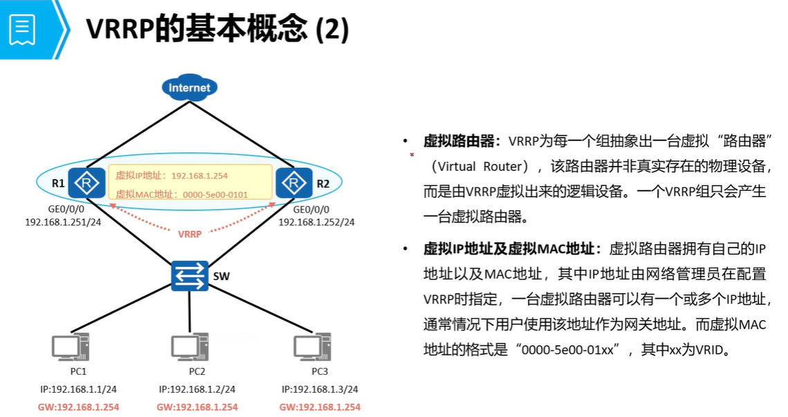

# VRRP
## 
```
作用：
    通过多台物理路由器逻辑成一台虚拟路由器，实现网关冗余

只有一种报文(VRRP通告)，使用组播发送（224.0.0.18）
目前只有 2 种版本（VRRPv2、VRRPv3）

VRRPv2
    支持IPv4，收敛速度秒级
VRRPv3
    支持IPv4、IPv6，收敛速度为厘秒级别
（VRRPv3 兼容 VRRPv2，反之不兼容）
```

## VRRP 状态机


## VRRP 报文格式


## 一、概念
```
VRRP 组使用虚拟的 IP 地址来响应终端设备的请求，并且会使用虚拟的 IP 地址和 MAC 地址来进行回复
```



### 特性
```
① 当请求的数据信息为虚拟的 MAC 地址，
    则只有 Master 设备会进行响应，Backup 不响应

② 虚拟 IP 地址和 MAC 地址的关系
	IP 地址为管理员手工指定的 IP 地址，
    必须与接口 IP 地址同一网段

	MAC 地址固定前缀为：00-00-5E-00-0Y-XX		
    
                            Y=1 代表 IPv4、Y=2 代表 IPv6
							XX = VRRP 组 ID（vrid）
③ 角色选举
master：在一个 VRRP 组内，有且只有一个 Master
backup：在一个 VRRP 组内，可以有多个 backup（N 个）
```

## 选举过程
```
最初情况下所有的设备都会认为自己是 Master（互相发送 vrrp 通告报文）
```
### 1. 如果是优先级为 255，
```
    状态直接从初始切换为 Master
```
### 2. 如果优先级不为 255，
```
    状态会切换到 backup 状态（并且根据对方发送的 VRRP 报文进行选举）

	1. 如果对方的优先级更高，则本地保存为 backup 状态
	2. 如果本地的优先级比对方高，则本地会立刻切换为 master 状态
```
### 3. 只有 master 设备会周期性发送 VRRP 通告报文，backup 不会发送通告报文（但会启动 VRRP 计时器）
```
	Master 老化计时器（3 倍 hello 时间 + 偏移时间）
    	① hello 时间：1s
	    ② 偏移时间 = 256 - 优先级 / 256
```

### 4. 优先级 255 无法手工指定
```
	当虚拟 IP 地址和接口的 IP 地址一致时，会自动把优先级升级为 255
    
    （确保不会出现多个相同 IP 进行回复的情况，避免 IP 地址冲突）
	
    （多个IP进行回复，就是 实际IP 和 虚拟ip 都相同）
```

### 5. 优先级 0 无法手工指定
```
	当 master 设备退出 VRRP 组时，会主动发送优先级为 0 的 VRRP 通告报文（可以使得 backup 设备快速进行切换，减少数据中断的时长）
```

### 6. 当 master 设备从故障恢复，会重新抢占 master 的状态，并且发送 免费 ARP，用于刷新交换设备的 MAC 地址和 ARP 表项
```
	使得接入设备能够快速进行流量切换
    
    （如果网络不稳定，则需要开启抢占延迟，
        避免主备设备频繁切换导致流量丢包，
    
        默认抢占延迟为：0s）
```

## 二、VRRP 双主
### 1. 配置 VRRP 组时，同组设备保持 VRID 一致，否则会出现双主情况（导致 IP 地址冲突）

### 2. 配置 VRRP 组时，保证同组设备版本一致
```
	（VRRPv3 能够兼容 VRRPv2，反之不兼容）
```

### 3. 接入交换设备必须保证接口能够联通
```
	（VRRP 接入交换设备的接口不能被同组隔离，不能时隔离 VLAN 或不同 VLAN 的接口）
	避免 VRRP 因为无法交互通告报文导致出现双主情况
```

### 4. 双方配置的认证信息不一致，会导致无法交互 VRRP 通告报文，出现双主情况
```
	（认证类型、密码等）
```

## 三、VRRP 联动
### 1. VRRP 会根据交互的通告报文来确定主备设备的运行状态，
```
    如果能够正常交互 VRRP 通告报文，则不会进行主备切换
	
    Master 设备需要开启上行链路的检查功能，一旦上行链路故障也可以实现主备切换
   
   （否则，主设备的上行链路故障，
          但因为主备设备依然能够交互通告报文，
          导致无法切换，流量中断问题）
```

### 2. BFD 联动：
```
    非直连接口需要通过 BFD 联动，通过 BFD 检测整条传输链路的情况（一旦上行链路发送故障，可以根据 BFD 状态降低 VRRP 优先级）
```

## 四、VRRP 负载均衡（异组负载）
```
Backup 设备默认不承载虚拟 IP 地址的业务流量，会导致带宽浪费的情况

可以在 Backup 设备设备上配置备份组

（如：不同的 VRID，相同网段但不同网关的 IP 地址）
	如：vrid 1 192.168.1.254
        vrid 2 192.168.1.253		
            分别为不同的 PC 提供转发业务（实现主备负载均衡）
```

## VRRP 配置命令：
```
1、进入接口配置接口 IP 地址
	interface G0/0/0
 	ip address 192.168.1.200 24
 	vrrp vrid 1 virtual-ip 192.168.1.254			
    // 指定 VRRP 虚拟 IP 地址（虚拟 IP 地址必须与接口相同网段）
 	vrrp vrid 1 priority 120				
    // 指定优先级（默认为：100）取值范围：1-254

2、配置监测接口
 	vrrp vrid 1 track interface G0/0/1 reduced 30		
    // VRID 组 1，监测上行链路（G0/0/1）一旦故障，则降低优先级（30）

3、（可选）配置抢占延迟
	 vrrp vrid 1 preempt-mode timer delay 10			
     // 在 Master 设备上开启抢占延迟 10s（默认：0s）
		（避免链路不稳定，Master 设备频繁 up/down 导致频繁切换）

4、查看配置信息
	display vrrp 1						
    // 查看组 ID 为：1 的 VRRP 组信息
```