## WLAN (Wirless Local Area Network, 无线计算机网络)

### [AP上线流程和故障处理.pdf](./AP上线流程和故障处理.pdf)

### 一、WLAN 基础

1. 二层组网：
   AP 与 AC 设备处于相同的广播域中（相同 VLAN，相同网段的设备）
   可以通过广播方式实现 AC 发现和建立 CAPWAP 隧道
   时候小型或简单的园区网络
2. 三层组网：
   AP 与 AC 不在同一广播域（VLAN 隔离，不同网段等）需要通过网关，路由器和交换设备等实现互联
   三层组网适合于中大型的网络
3. 直连方式组网：
   AC 设备直连在网络拓扑的转发路径上，参与用户数据的转发
   适合于中小型网络，可以对流量和控制信息做集中管理
4. 旁挂方式组网：
   AC 连接在网络的核心路由器或汇聚交换设备的边缘，不参与用户数据转发
   适合于中大型的网络，AC 只参与 AP 的认证和用户身份鉴定等

### AC + AP 上线配置

```
1. AP 获取 IP 地址阶段
	- 一般都是通过 DHCP 方式获取 IP地址
2. CAPWAP 隧道建立阶段
	- AC 通过 CAPWAP 隧道来实现对 AP 的集中管理和控制
3. AP 接入控制阶段
	- AC 对 AP 进行接入认证，认证成功则允许 AP上线，
	- 认证失败，则不允许 AP 上线
4. AP 版本升级阶段
	- AP 判断当前系统软件版本是否与 AC 配置的一致
	- 不一致，则 AP 根据 AC 上配置的一致
5. CAPWAP 隧道维持阶段
	- AP 与 AC 之间通过交互心跳报文来维护 CAPWAP 隧道连通状态
6. AC 业务配置下发阶段
	- AC 将 AP 的业务配置信息下发给 AP
	- 成功后，AP 正常上线
```

### AC 上线配置流程

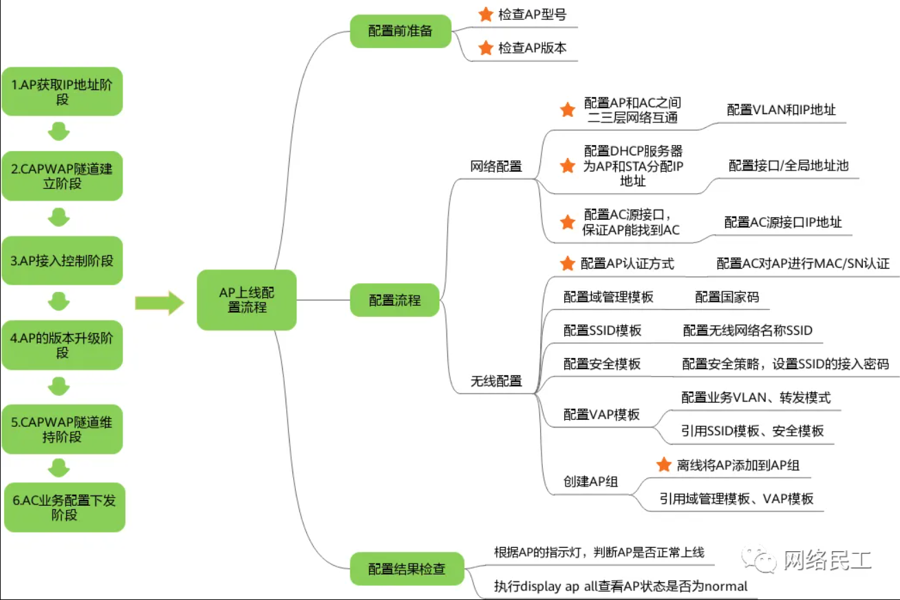

### WLAN 工作过程

```bash
# 1、配置 DHCP 地址池，AP 获取 IP 地址（交换设备）
# ① 开启 DHCP 服务
	dhcp enbale

# ② 创建地址池
	vlan 10						//创建 VLAN 10
	interface  Vlanif10					// 进入 VLANIF 10 接口
	ip address  192.168.10.254  24				// 配置 IP 地址（该地址是网关）
							（地址池范围：192.168.10.0/24，192.168.10.254 是网关地址）
 	dhcp select interface				// 开启接口地址池模式
 	dhcp server excluded-ip-address 192.168.10.100		// 排除 AC 设备的 IP 地址，避免分配给其他 AP

# ③ 交换设备与 AP 互联的接口，配置 Trunk 并放行 VLAN 10
	interface G0/0/X					// 进入 G0/0/X 接口
 	port link-type trunk					// 把接口类型修改为 Trunk
 	port trunk pvid vlan 10				// 并且需要配置 PVID （AP 发送的数据包不带标签，需要通过 PVID 打上 VLAN 10 的标签）
							（PVID 与 DHCP 地址池的 VLAN ID 一致）
 	port trunk allow-pass vlan 10				// 允许 VLAN 10 的数据帧通过

	# 配置完成后，在 AP 设备上查看是否获取 IP 地址  display  ip  interface  brief
	# （如果没有 IP 地址，或地址是 169.254.1.1 则查看以上配置是否错误）


# 2、AC 配置通信 IP 地址（AC 设备）
# ① AC 创建通信地址
	vlan 10						//创建 VLAN 10
	interface  Vlanif10					// 进入 VLANIF 10 接口
	ip address  192.168.10.100  24				// 配置 IP 地址（AC 通信地址）

# ② AC 与 交换机互联的端口，放行 VLAN 10（AC 和 LSW 互联的接口均需要配置）
	interface G0/0/X					// 进入 G0/0/X 接口
 	port link-type trunk					// 把接口类型修改为 Trunk
 	port trunk allow-pass vlan 10				// 允许 VLAN 10 的数据帧通过

	# 配置完成后，在 AC 或 AP 设备上 ping 测试双方是否可达
	# （如果不可达，则查看以上配置是否有误，或者接口是否放行相关 VLAN）


# 3、AP 上线建立 CAPWAP 隧道（AC 设备配置）
# ① 指定 CAPWAP 隧道源地址
	capwap source ip-address 192.168.10.100		// 该地址为 AC 的通信地址，AP 与 AC 之间必须可达

# ② 进入 WLAN 视图，配置 AP 认证
	wlan						// 进入 WLAN 视图
	ap-id  1   ap-mac  XXXX-XXXX-XXXX			// 配置 AP-ID 1，并且绑定 AP 设备的 MAC 地址
							（MAC 地址可以在 AP 的配置中找到，或者 display  interface  vlanif 查找）

	# 配置完成后，在 AC 设备上使用  display  ap  all		// 查看 AP 是否上线，如果上线及状态为 nor 代表上线成功
	# （否则检测以上配置是否有误，MAC 地址是否有误）


# 4、AP 业务下发（AC 设备上配置）
# ① 进入 WLAN 创建 SSID 模板
	wlan
	ssid-profile name A					// 模板名称为：A
	ssid  office					// SSID 名称为：office（用户搜索的服务集名称）

# ② 设置安全模板
	security-profile name A				// 创建安全模板，名称：A
	security wpa2 psk pass-phrase  12345678  aes		// 设置密码：12345678  认证方式为 wpa2  aes 加密

# ③ 设置 VAP 模板，并绑定 SSID 和 安全模板
	vap-profile name  A					// 创建 VAP 模板（名称：A）用于区分一个 BSS 覆盖范围
  	ssid-profile A					// 把 SSID 名称：office 和密码 12345678 绑定在一起
  	security-profile A

	service-vlan vlan-id 20				// 可选，为了避免用户设备获取的 IP 地址和 AP 管理的一致
							可以指定用户的服务 VLAN ID，让用户从 VLAN 20 获取 IP 地址
	# （补充：交换设备需要重新创建一个 VLAN 20 的 DHCP 地址池，并且交换设备与 AP 连接的端口要允许 VLAN 20）

# ④ 调用 VAP 模板
	ap-id 1
	vap-profile  A wlan  1 radio  0				// AP-ID 1 设备调用模板 A，同时使用 2.4GHZ 射频（WLAN ID 为 1）

	# 查看 AP 是否放射出信号


# 三、WLAN 大型组网（AC 与 AP 处于不同网段）
# 1、创建 VLAN （业务 VLAN 10、20、30  和管理 VLAN  200） 交换设备作为 DHCP 服务器，在交换设备配置
# ① 业务 VLAN（用于接入的终端设备获取 IP 地址）   ② 管理 VLAN（给 AP 设备分配 IP 地址）
# 配置命令：（交换设备）
# ① 创建 VLAN
	vlan  batch  10  20  30   200

# ② 为不同的 VLAN 创建 DHCP 地址池
	dhcp  enable

	ip pool vlan10
 	gateway-list 192.168.10.254
	network 192.168.10.0 mask 24 

	ip pool vlan20
 	gateway-list 192.168.20.254
	network 192.168.20.0 mask 24 

	ip pool vlan30
 	gateway-list 192.168.30.254
	network 192.168.30.0 mask 24 				// 配置业务 VLAN 的地址池（10、20、30）

	ip pool vlan200					// 配置管理 VLAN 的地址池（200）
 	gateway-list 200.1.1.254
	network 200.1.1.0 mask 24
	option 43 sub-option 1 ip-address 100.1.1.1		// 添加选项字段，告知 AP 设备 AC 的 IP 地址为：100.1.1.1
							（如果有多个 AC 则可以再添加子选项）
							例如：option 43 sub-option 2 ip-address 100.1.1.2

# ③ 创建相关的三层接口，并且调用地址池
	interface Vlanif10
 	ip address 192.168.10.254 24
 	dhcp select global

	interface Vlanif20
 	ip address 192.168.20.254 24
 	dhcp select global

	interface Vlanif30
 	ip address 192.168.30.254 24
 	dhcp select global					// 调用业务 VLAN 接口的地址池

	interface Vlanif200
 	ip address 200.1.1.254 24
 	dhcp select global					// 调用管理 VLAN 的接口地址池	 

# ④ 交换设备与 AP 互联的接口，需要放行相关的 VLAN
	interface G0/0/X					// 进入交换设备与 AP 互联的接口
 	port link-type trunk					// 配置为 Trunk 接口
 	port trunk pvid vlan 200				// AP 发出的数据帧不会携带标签，无法从 VLAN 200 获取 IP 地址
							（配置 PVID 后，可以让 AP 的数据帧打上标签 200）

 	port trunk allow-pass vlan 200  10  20  30		// 允许管理 VLAN 以及业务 VLAN 通过

	# 配置完成后，在 AP 设备上执行  display  ip  interface brief   	// 查看 AP 是否获取 IP 地址
				（如果有 IP 地址，并且不是 169.254.1.1 则代表配置成功。否则则查看以上配置是否有误）

# 2、AP 上线（需要在 AC 设备上完成配置）
# ① AC 设备需要配置通信地址
	vlan 100
	interface Vlanif100
 	ip address 100.1.1.1  24

# ② 交换设备也需要配置同网段的通信地址
	vlan 100
	interface Vlanif100
 	ip address 100.1.1.254  24

# ③ 交换设备与 AC 互联的接口，需要放行 VLAN 100
	interface G0/0/X					// 进入交换设备与 AP 互联的接口
 	port link-type trunk					// 配置为 Trunk 接口
	port trunk allow-pass vlan 100 			// 允许 100 通过

# ④ AC 设备需要配置到达 AP 的路由信息
	ip route-static  200.1.1.0  24  100.1.1.254

	# 完成以上配置后，在 AP 或 AC 上 ping 测试，对方的 IP 地址是否能互通
	如果可以则执行下一步，否则查看以上的配置是否有误

# ⑤ AP 完成注册（在 AC 设备上配置）
	wlan
	ap-id 1 ap-mac  XXXX-XXXX-XXXX		// 进入 WLAN 视图，指定 AP 的 ID 以及 MAC 地址
						（MAC 地址可以进入 AP 使用 display  interface  vlanif）

# ⑥ 指定 AC 设备的 CAPWAP 隧道源地址
	capwap source ip-address 100.1.1.1		// 指定 AC 的通信地址

	# 配置完成后，在 AC 上查看 display  ap  all		// 如果能够发现 AP 信息，并且状态为 nor 则代表上线成功


# 3、AC 为 AP 设备下发配置信息
# ① 创建 VLAN POOL 把相关的 vlan 地址池汇总在一起
	vlan batch  10  20  30			// 创建业务 VLAN 10、20、30
	vlan pool  A				// 创建 VLAN 池 A
	vlan 10 20 30				// 业务 VLAN 10、20、30 都属于 VLAN 池 A

# ② 创建模板（SSID、安全、VAP）
	ssid-profile name A				// 创建 SSID 模板，名称：A
  	ssid office					// 创建 SSID 为：office 是 AP 的信号覆盖范围
						（quit 退出到上一级视图，WLAN 视图）	

	security-profile name A			// 创建安全模板，名称：A
  	security wpa2 psk pass-phrase 12345678 aes	// 设置认证和加密为 WPA2 和 AES 组合，密码为：12345678
						（quit 退出到上一级视图，WLAN 视图）

	vap-profile name A				// 创建 VAP 模板，名称：A
  	service-vlan vlan-pool A			// 指定用户的业务 VLAN 为：10、20、30
  	ssid-profile A				// 指定 wifi 名称：office
  	security-profile A				// 指定密码：12345678

# ③ 调用模板
	wlan
	ap-id 1					// 进入 WLAN 视图，进入 AP-ID 1 设备
	vap-profile  A wlan 1 radio 0			// AP-ID 1 设备使用模板 A（并且以 2.4 Ghz 射频信号工作）
						（radio 0 为 2.4Ghz，1、2 是 5 Ghz）

	查看是否有 AP 释放的信号，如果有则配置完成，否则查看以上配置是否有误

# ④ STA 获取 IP 地址补充配置
	# AC、交换设备、交换设备与 AP 互联的接口，都需要检测是否放行了业务 VLAN
	interface G0/0/X
	port link-type trunk					// 配置为 Trunk 接口
	port trunk allow-pass vlan 10 20  30			// 允许所有的业务 VLAN 通过


# 4、漫游配置（新增一台 AP 完成以下配置即可）
# ① 进入交换设备与新 AP 互联的接口
	interface G0/0/X					// 进入交换设备与 AP 互联的接口
 	port link-type trunk					// 配置为 Trunk 接口
 	port trunk pvid vlan 200				// AP 发出的数据帧不会携带标签，无法从 VLAN 200 获取 IP 地址
							（配置 PVID 后，可以让 AP 的数据帧打上标签 200）

 	port trunk allow-pass vlan 200  10  20  30		// 允许管理 VLAN 以及业务 VLAN 通过

	# 配置完成后，在 AP 设备上执行  display  ip  interface brief   	// 查看 AP 是否获取 IP 地址
				（如果有 IP 地址，并且不是 169.254.1.1 则代表配置成功。否则则查看以上配置是否有误）

# ② 进入 AC 设备完成新 AP 的注册
AP 完成注册（在 AC 设备上配置）
	wlan
	ap-id 2 ap-mac  XXXX-XXXX-XXXX		// 进入 WLAN 视图，指定 AP 的 ID 以及 MAC 地址
					（新 AP 的 MAC 地址可以进入 AP 使用 display  interface  vlanif）
	使用 display  ap all 			//查看 新的 AP 是否上线（状态 nor ）

# ③ 调用模板
	wlan
	ap-id 2					// 进入 WLAN 视图，进入 AP-ID 1 设备
	vap-profile  A wlan 2 radio 0			// AP-ID 1 设备使用模板 A（并且以 2.4 Ghz 射频信号工作）
						（radio 0 为 2.4Ghz，1、2 是 5 Ghz）

	# 查看是否有 AP 释放的信号，如果有则配置完成，否则查看以上配置是否有误
	# 如何测试漫游是否成功
	连接一台 STA 到 AP 设备上，使用 ping X.X.X.X -t 测试，并移动 STA 在不同的 AP 上工作
	如果信号不中断（ping 不中断，或者丢 1-2 个数据包，则代表漫游成功）如果需要重新输入密码或者中断网络则查看以上配置
```

## Wlan 基本配置

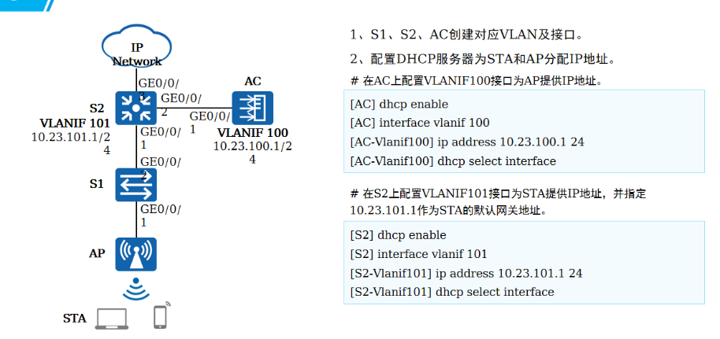
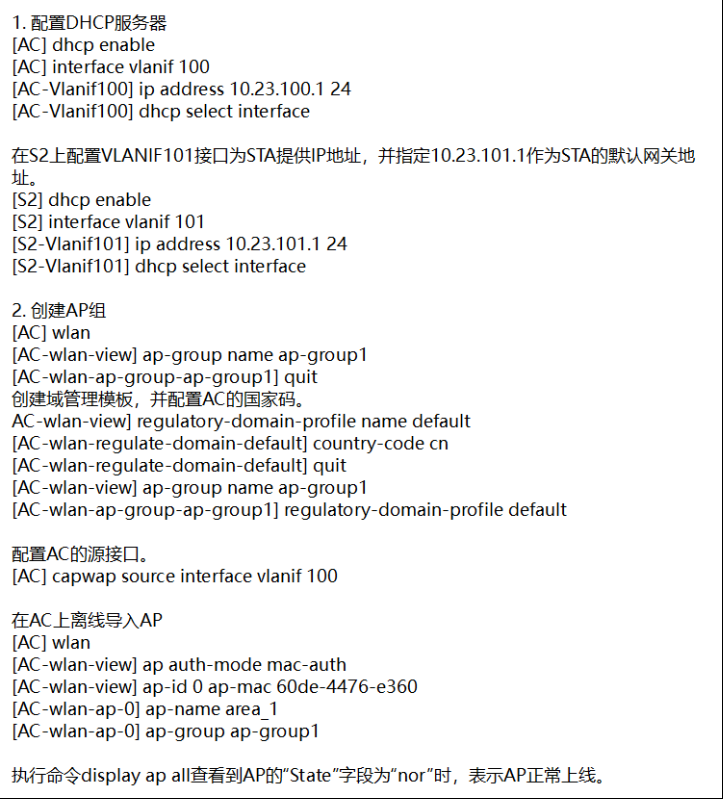
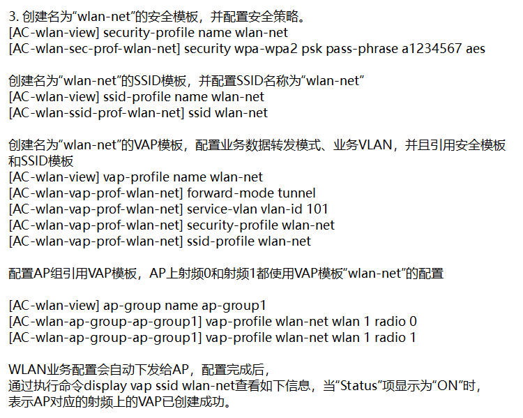

## 问题

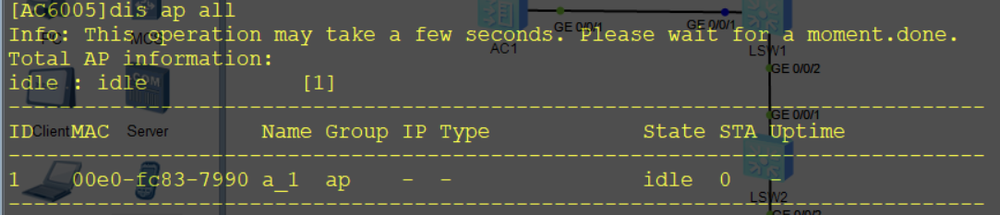

- 拓扑图
  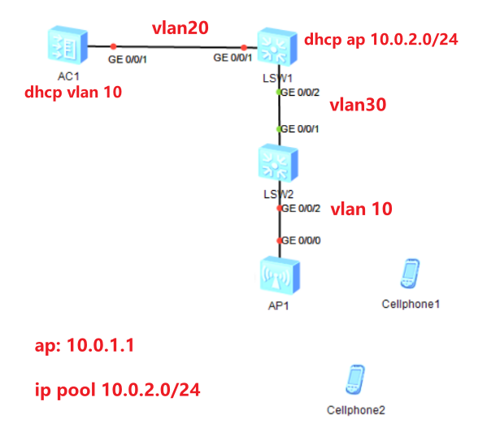

### 出现该问题的原因

```
ap 没有获取到地址
	1. 要保证LSW2 到 AC1 之间能够互访
	2. 配置给 AP分配ip的dhcp服务器，使ap 可以获取到地址
```

解决方法

```
	到AC1 上的 vlanif 10 接口
		配置 dhcp select interfact
			以及 IP 地址
```

[AP无法上线？是不是已经焦头烂额了？故障处理方法都在这里了](https://mp.weixin.qq.com/s/nf0WgDJxKcoQ7F9RfVkhWA)

## 大型旁挂三层组网

```
需求
	1. 旁挂三层组网
	2. AC 为 AP 和 STA 分配IP
	3. 业务转发方式为 隧道转发

管理vlan 100
业务vlan pool
	wifi 员工
		vlan41 192.168.7.0/24
		vlan42 192.168.8.0/24
	guest 访客
		vlan51 192.168.9.0/24
		vlan52 192.168.10.0/24
	AP
		192.168.14.0/24
```

### 配置

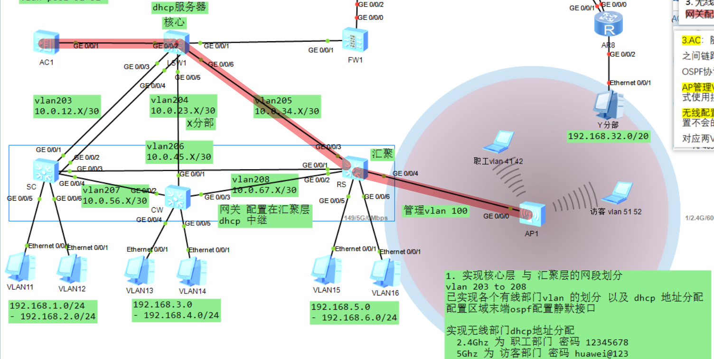

```
# AC
1. 创建 vlan
	vlan batch 41 to 42 51 to 52 100

2. 配置接口
	interface GigabitEthernet0/0/1
	port link-type trunk
	port trunk allow-pass vlan 2 to 4094

	ospf 1
	area 0.0.0.1
	network 10.1.100.2 0.0.0.0

3. dhcp
	dhcp enable

	ip pool AP
		network 192.168.14.0 mask 255.255.255.0 
		option 43 sub-option 3 ascii 10.1.100.2

	interface Vlanif100
		ip address 10.1.100.2 255.255.255.0
		dhcp select interface

	interface Vlanif41
		ip address 192.168.7.1 255.255.255.0
		dhcp select interface
		dhcp server gateway-list 192.168.7.254 

	interface Vlanif42
		ip address 192.168.8.1 255.255.255.0
		dhcp select interface
		dhcp server gateway-list 192.168.8.254 

	interface Vlanif51
		ip address 192.168.9.1 255.255.255.0
		dhcp select interface
		dhcp server gateway-list 192.168.9.254 

	interface Vlanif52
		ip address 192.168.10.1 255.255.255.0
		dhcp select interface
		dhcp server gateway-list 192.168.10.254 

4. vlan pool
	vlan pool WIFI
		vlan 41 to 42
	vlan pool guest
		vlan 51 to 52

5. wlan
	wlan
	# 创建AP组， 用于将想通了配置的AP都加入到同一个组
	ap-group name ap1
	# 配置 AC 源接口
	capwap source interface vlanif100
	# 在AC上离线导入AP
	ap auth-mode mac-auth
	ap-id 0 ap-mac 00e0-fc22-8070
	ap-name ap1
	ap-group name ap1

	####### 查看ap是否上线成功
		dis ap all
	#######

#配置 wlan 业务
wlan
	1. 配置 安全模板
	security-profile name WIFI
  		security wpa-wpa2 psk pass-phrase 12345678 aes
	security-profile name guest
		security wpa-wpa2 psk pass-phrase huawei@123 aes

	2. 配置 ssid 模板
	ssid-profile name WIFI
		ssid WIFI
	ssid-profile name guest
		ssid guest

	3，配置 vap 模板
	vap-profile name WIFI
	// 配置业务数据转发模式
		forward-mode tunnel
	// 业务vlan
		service-vlan vlan-pool WIFI
	// 并引入安全模板 和 SSID模板 
		ssid-profile WIFI
		security-profile WIFI

	vap-profile name guest
		forward-mode tunnel
		service-vlan vlan-pool guest
		ssid-profile guest
		security-profile guest

	4. 配置 AP组引用vap模板
	wlan
	ap-group name ap1
		vap-profile WIFI wlan 1 radio 0
		vap-profile guest wlan 1 radio 1

```

```
# LSW1
vlan batch 100

interface GigabitEthernet0/0/2
 port link-type trunk
 port trunk allow-pass vlan 2 to 4094

interface GigabitEthernet0/0/6
 port link-type trunk
 port trunk allow-pass vlan 2 to 4094

interface Vlanif41
 ip address 192.168.7.254 255.255.255.0

interface Vlanif42
 ip address 192.168.8.254 255.255.255.0

interface Vlanif51
 ip address 192.168.9.254 255.255.255.0

interface Vlanif52
 ip address 192.168.10.254 255.255.255.0

interface Vlanif100
 ip address 10.1.100.1 255.255.255.0
 dhcp select relay
 dhcp relay server-ip 10.1.100.2

ospf 1
 area 0.0.0.1
  network 10.0.34.0 0.0.0.255
  network 10.1.100.1 0.0.0.0
```

```
# RS
vlan batch 100 205

interface GigabitEthernet0/0/3
 port link-type trunk
 port trunk allow-pass vlan 2 to 4094
#
interface GigabitEthernet0/0/4
 port link-type trunk
 port trunk pvid vlan 100
 port trunk allow-pass vlan 100

ospf 1
 area 0.0.0.1
  network 10.0.34.0 0.0.0.255
```

### 项目配置

[WLAN 项目，网络规划.zip](./网络规划项目.zip)


### AP 上线慢案例
```
情况一：（如果地址池配置网关254，且ac接口是1，将会导致ap上不了线）
```
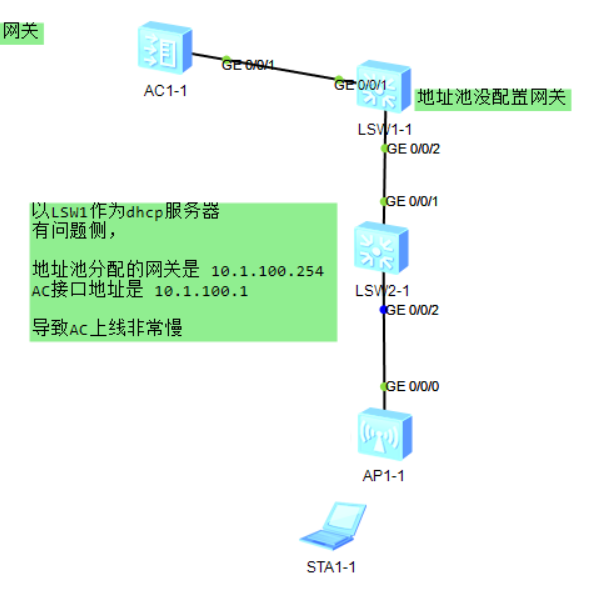
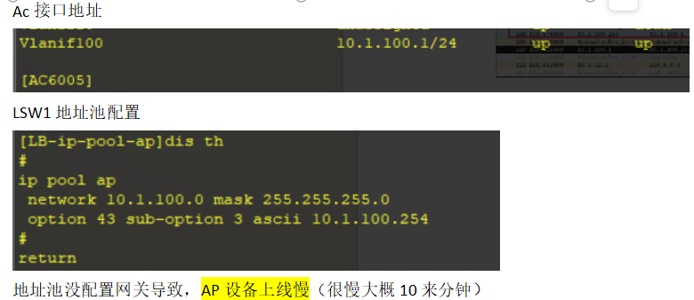
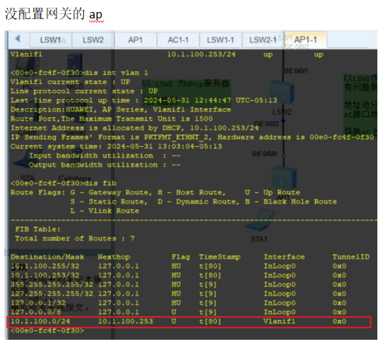
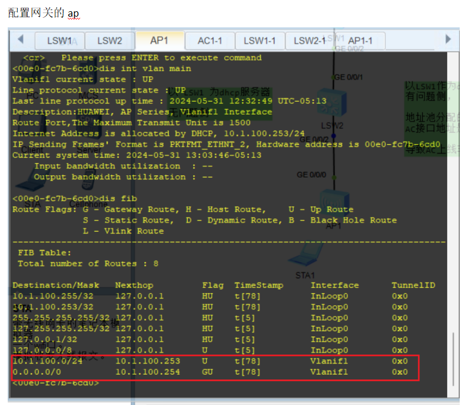

#### AP 的 dhcp服务器 在 交换机上
#### AP 的dhcp服务器在AC上
[AP上线慢原因分析.zip](./AP上线慢原因分析.zip)
[AP上线慢原因分析抓包.pcapng](./AP上线慢原因抓包.pcapng)


## ap 不上线问题（type-id）
[wlan二层.zip](./wlan二层.zip)
```
原因：
	ac 配置了type-id 与 ap 的 type-id 不一致导致无法通过认证上线 
```
### ac 与 ap 的 type-id 要对上
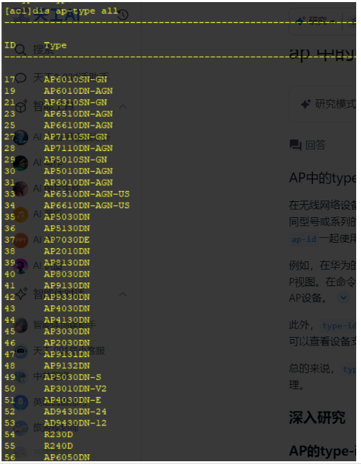
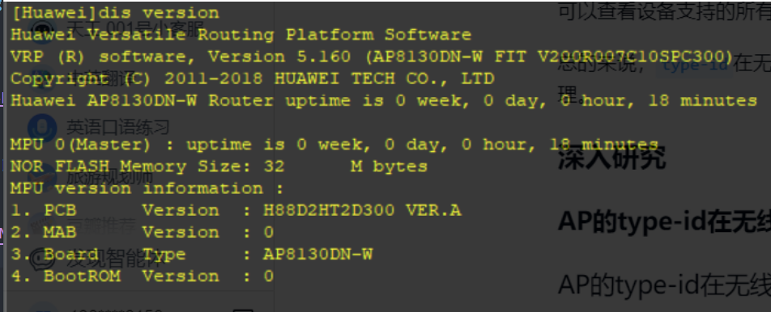

### 删除ap-id 配置
```
undo ap ap-id 1
```

### 解决方法
#### 1. 默认配置 不写 type-id 会自己识别并配置进去
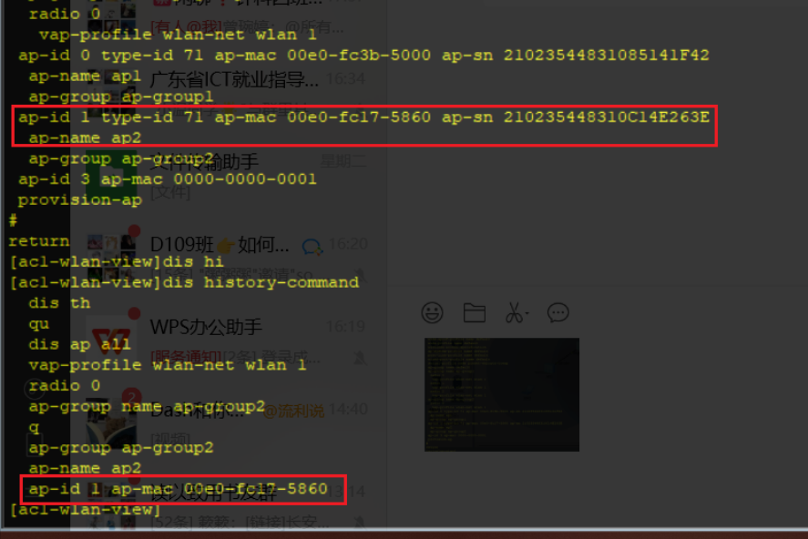

#### 2. type-id 对上


#### 3. 关闭认证
```
ap auth-mode no-auth
```
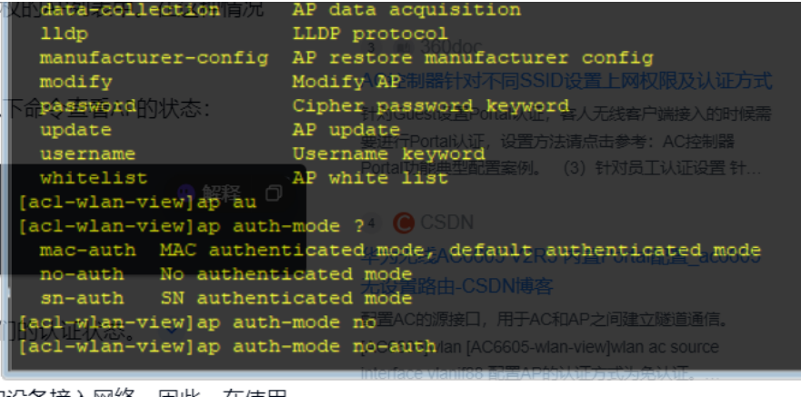

## STA 获取到 ip 但是 ping 不通网关（目的地址不可达）
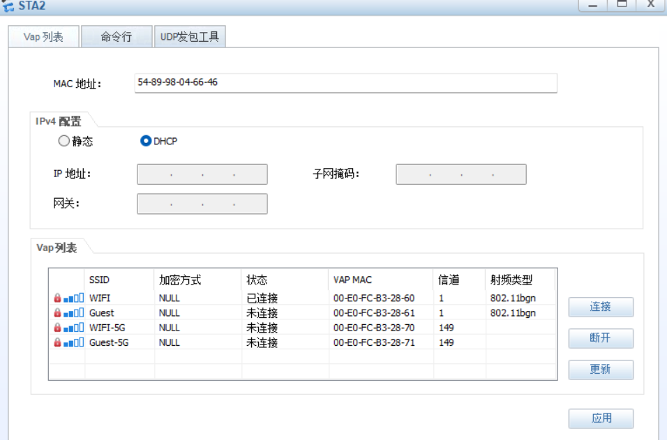
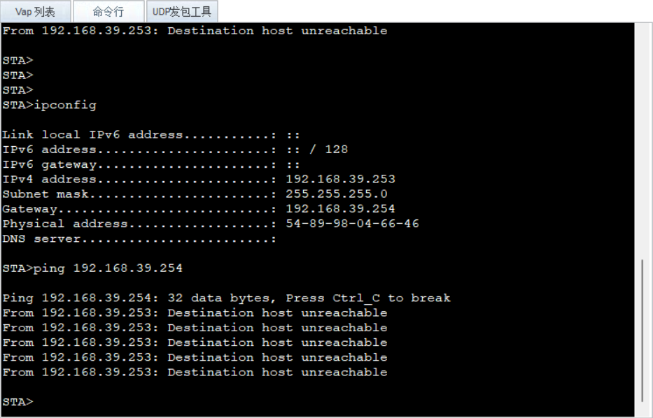
```
原因：
	AC 中配置vap模板，采用的是直接转发
	但是该 ap 使用的是隧道转发，导致该问题
```
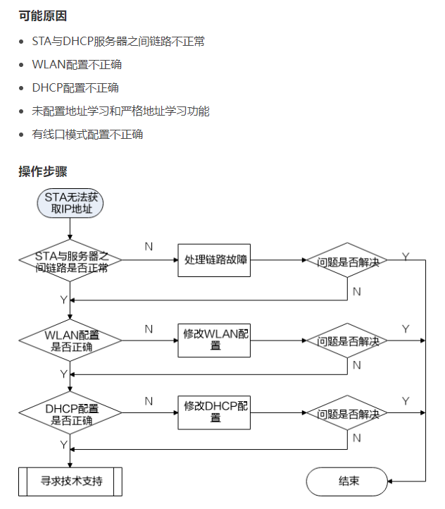