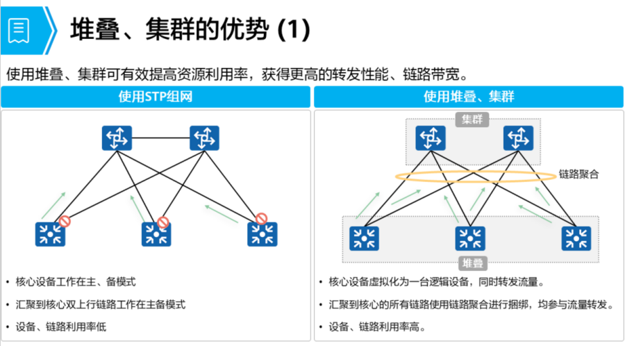
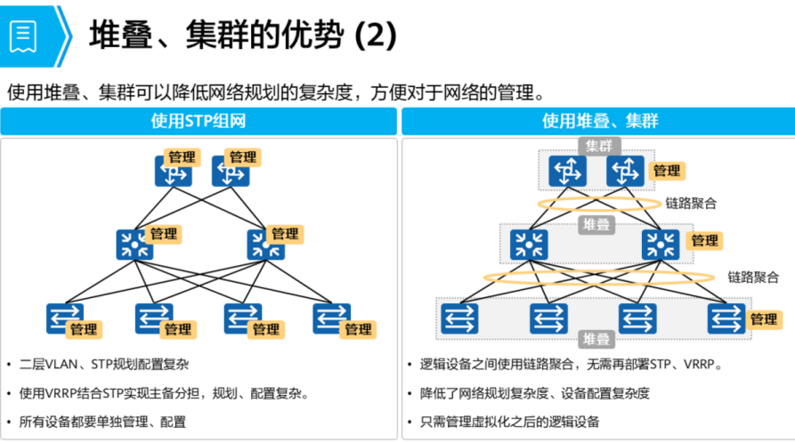
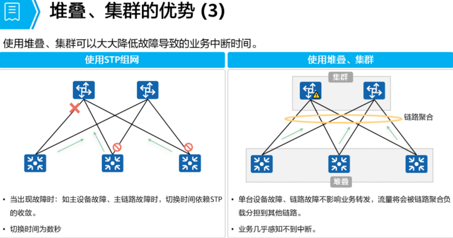
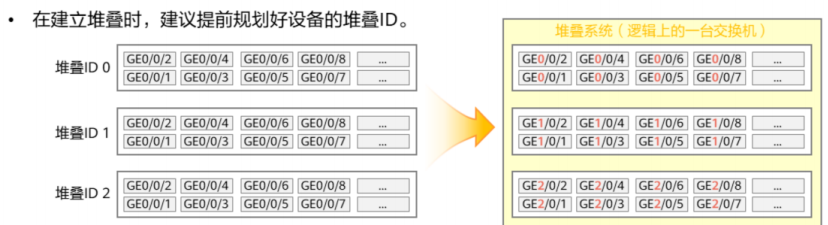

# 交换机堆叠 与 集群
## 堆叠、集群技术描述
```
堆叠 (iStack)
    将多台支持堆叠特性的交换机通过堆叠线缆连接在一起，从逻辑上虚拟成一台交换设备，作为一个整体参与数据转发。

集群 (Cluster Switch System, CSS)
    将两台支持集群特性的交换机组合在一起，从逻辑上虚拟成一台交换设备。

集群只设置两台设备，一般高端框式交换机支持CSS、盒式设备支持 iStack
```




## 堆叠技术原理
    - 堆叠系统中所有的单台交换机 都称为 成员交换机
        - 可以分为三种角色：
            1. 主交换机(Master):
                - 主交换机负责整个堆叠。
                - 堆叠系统中只有一台主交换机

            2. 备份交换机(Standby):
                - 备交换机是主交换机的备份交换机。
                - 堆叠系统中只有一台备交换机
                - 当主交换机故障，备接替
            
            3. 从交换机(Slave):
                - 从交换机用于业务转发，堆叠系统中，可以有多台从交换机
                - 从交换机数量越多，堆叠系统的转发带宽越大
    
    - 堆叠优先级：
        - 堆叠优先级是成员交换机的一个属性
        - 主要用于角色选举过程中确认成员交换机的角色
        - 优先级值越大表示优先级越高，优先级越高当选为主交换机的可能性越大

### 堆叠ID
- 堆叠ID
    - 成员交换机的槽位值(Slot ID)
    - 用于标识和管理成员交换机，堆叠中 所有成员交换机的堆叠ID 都是唯一的

- 设备堆叠 ID 缺省为 0
    - 堆叠时由堆叠主交换机对设备的堆叠ID进行管理，
    - 当堆叠系统有新成员加入时，如果新成员与已有成员冲突，则堆叠主交换机从 0 ~ 最大堆叠ID 进行遍历，找到第一个空闲ID分配给该新成员
    - 

