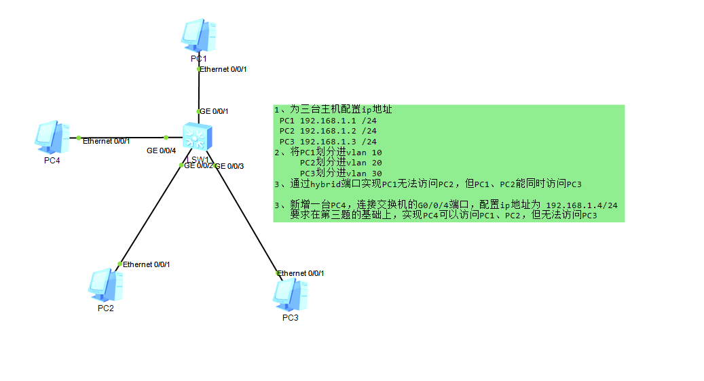
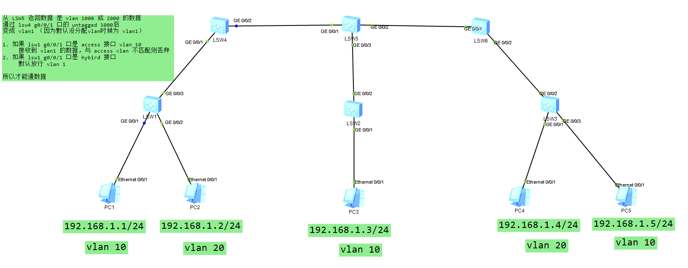
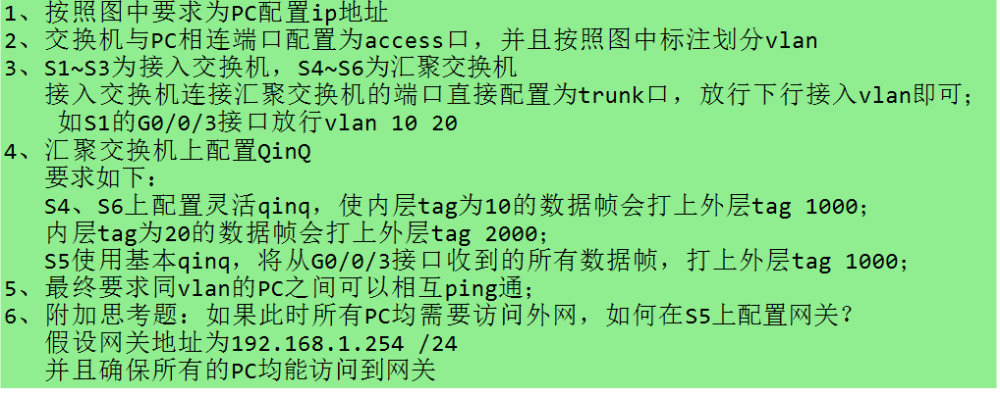
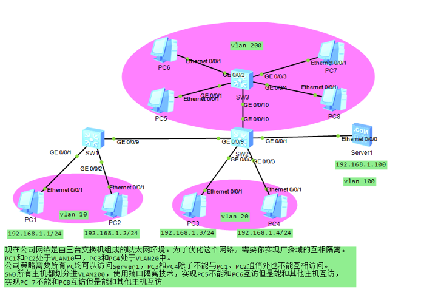

## 以太网交换基础
### 数据帧类型
```bash
# 1、Ethernet II：一般用于承载用户数据（ICMP、OSPF、ARP 等上层协议流量）
		使用 Type 来标识上层协议（0x0800 代表上层为 IP 协议）

# 2、802.3：一般用于承载控制协议数据（STP 的 BPDU、IS-IS 协议的 PDU 等）
		使用 Length、LLC、SNAP 来标识上层协议
```
### MAC 地址
```bash
48 bit 由 24 bit OUI + 24 bit 厂商分配地址生成
OUI：厂商代码，不同的厂商都会分配固定代码（华为、华三、思科等）

# MAC 地址分类
# ① 单播地址，第 8 bit 固定为 0
    例如：02-00-00-00-00-0A 为单播地址
    格式：0X-00-00-00-00-0A  当 0X 的 X 为偶数就是一个单播地址

# ② 组播地址，第 8 bit 固定为 1
    例如：01-00-5E-00-00-00 为组播地址
    格式：0X-00-5E-00-00-00，其中 0X 的 X 为奇数就是一个组播地址

# ③ 广播地址，全为 1
    FF-FF-FF-FF-FF-FF 为广播地址
```

### 交换对数据帧的处理方式
```bash
	① 转发：
		- 从一个接口接收，从另一个指定的接口发出（1:1）
	② 泛洪：
		- 从一个接口接收，除该接口以外，所有的其他接口发出（1: ALL）
	③ 丢弃：
		- 收到一个不完整或者黑洞 MAC 数据帧，直接丢弃不转发

	学习：
		- 收到一个数据帧，会根据数据帧的源 MAC 地址进行学习
		- （记录 MAC 地址与接口的对应关系）

	转发行为：
		- 收到一个数据帧，根据目的 MAC 地址进行发送
	
# 1、单播
	① 未知单播：
		- 收到一个单播数据帧，目的 MAC 地址在 MAC 地址表中没有记录，为未知单播帧
			- 未知单播帧采用泛洪方式处理

	② 已知单播：
		- 收到一个单播数据帧，目的 MAC 地址在 MAC 地址表中有相关的接口记录，
		- 则根据 MAC 地址表转发
			- 已知单播帧，采用转发方式处理

# 2、组播：
        交换机收到组播数据帧会先上送 CPU 处理

		如果是 监听的数据帧 则根据相关 接口转发
		如果是 非监听的数据帧 ，则采用 泛洪方式处理

# 3、广播：
        交换设备收到一个广播帧，会直接采用泛洪方式处理
```
### STP（生成树协议）
	背景：冗余链路会导致环路的产生，STP 既可以解决环路又可以实现交换网络的冗余
```bash
# 端口角色
RP 端口：
	- 非根交换机用于接收根桥数据的接口
DP 端口：
	- 指定端口，用于发送 BPDU 和用户数据
AP 端口：
	- 阻塞端口，无法转发数据，是一个备份接口

# 选举要素
    # ① Root ID（根桥 ID）优先级 + MAC 地址
        - 优先级（16 bit = 65536，取值范围：0—65535）
			- 但是 后 12 bit 固定，所以优先级的取值只能是 4096 的倍数
        	- 默认值：32768，可选范围：0—61440，
				- 并且只能以 4096 倍数修改（0、4096、8192、32768 等）	
        	- 越小越好

        如果优先级一致，则比较 MAC 地址，越小越好

    # ② RPC（根路径开销）交换设备到达根桥的总开销值

    # ③ BID（发送设备的桥 ID）
        - 优先级（16 bit = 65536，取值范围：0—65535）但是 后 12 bit 固定，所以优先级的取值只能是 4096 的倍数
        - 默认值：32768，可选范围：0—61440，
			- 并且只能以 4096 倍数修改（0、4096、8192、32768 等）	
        - 越小越好

        如果优先级一致，则比较 MAC 地址，越小越好

    # ④ PID：如果前 3 个参数无法选出端口，会根据端口发送的 PID
            优先级 + 端口号形成 = 128：1 越小越好

# 1、根桥选举：
        - 最开始的时候所有的交换机都会认为自己是根桥，
		- 然后互相发送 BPDU 进行选举
		- 参考选举要素 ①

# 2、非根桥选举根端口（RP）：
        - 除了根桥以外的设备，都为非根桥，他们会选举一个到达根桥最近的接口（用于接收数据）
			
        - 这个接口称为 RP 端口（每台非根交换设备，有且只有一个 RP 端口）
		- 参考选举要素 ② 越小越优

# 3、选举 DP 接口（指定接口）每段链路都要选举一个 DP 端口
		- 先比 ① 和 ②，如果无法比较则参考 ③

# 4、阻塞接口
        - 阻塞既不是 DP 又不是 RP 的接口，该接口为 AP
```

### STP 状态机
```bash
# 1、discarding：
        代表接口不转发用户数据，不学习 MAC 地址（可以转发 BPDU 和处理 BPDU），AP 端口的最终状态

# 2、learning：
        代表接口不转发用户数据，可以学习 MAC 地址（也可以转发 BPDU 和处理 BPDU）是 DP 和 RP 的过渡状态

# 3、forwarding：
        代表接口可以转发用户数据，可以学习 MAC 地址以及转发和处理 BPDU。是 DP 和 RP 的最终状态

	每个状态之间的切换都需要等待一个 forward  delay（15s）
	
	从 discarding 到 forward 需要经历 2 个 forward  delay（30s）

	STP 收敛速度慢，每次端口变化或者终端设备接入都需要等待 30s 才能访问网络
	
    # 用户无法接收延迟
	# 问题一：
        - PC 设备接入后，需要等待 30s 才能进入状态
		- （接口从 down 到 up 还需要经历 discarding 到 forwarding 才能转发用户数据）

	# 问题二：
        - AP 端口是 RP 的备份端口，
		- 但 AP 切换到新的 RP 端口后，状态为 discarding，
			- 需要等待 30s 才能切换到 forwarding

	# RSTP（快速生成树）和 MSTP 都能解决 STP 收敛慢的问题
	- 使用 EP 端口解决问题一，
		- EP 端口可以在端口状态 up 后，直接切换到 forwarding 状态
	
	- AP 预备端口，可以解决问题二。
		- 当 AP 端口切换到 RP 端口后，可以直接切换到 forwarding 状态，无需等待 30s 的转发延迟
		
	RSTP 或 MSTP 的 AP 端口是 RP 的预备端口
```

### 配置命令
```bash
# 1、把设备接口修改为 EP 接口
	interface G0/0/X
	stp edged-port enable				// 把 G0/0/X 接口修改为 EP 端口，接入终端设备后可以快速进入转发状态
							（终端：PC、服务器、打印机、IP 电话等）

# 2、配置 BPDU 保护（边缘端口保护）
	为了避免 EP 端口接入交换设备导致环路的产生，可以配置 BPDU 保护
	一旦接入交换设备，收到 BPDU，立刻关闭端口（error-down）
	stp  bpdu-protection 				// 系统配置视图，配置保护功能（只针对 EP 生效）

# 3、为了减少管理员配置，可以设置 error-down 的自动恢复
	error-down   auto-recovery   cause   bpdu-protection    interval   30		// 因为 BPDU 保护关闭的端口，在 30s 后没有收到 BPDU 会自动恢复

# 4、修改 STP 模式
	stp  mode  （stp、rstp、mstp）			// 默认情况下，设备为 MSTP 模式

# 5、修改设备优先级
	# 方式一：指定设备角色
	stp   root  primary 					// 把设备设定为根桥，相当于优先级  0
	
	stp   root  secondary 				// 相当于把设备优先级改为 4096

	# 方式二：指定优先级
	stp  priority  0					// 把设备的优先级改为 0 ，相当于 root  primary

	stp  priority  4096					// 命令相当于  root  secondary	

	stp  priority  8192					// 灵活修改优先级，按需修改

# 6、修改接口的开销值
	interface G0/0/X
	stp  cost  100					// 默认 G0/0/X 的开销值为：20000
							    把 G0/0/X 接口开销值改为 100
# 7、查看生成树信息
	display   stp					// 查看详细的 STP 信息
	display   stp  brief					// 查看摘要信息
```

## VLAN 基础
### VLAN
    作用: 隔离广播域，实现二层访问控制
```bash
一个 VLAN 就是一个广播域，通过数据帧中添加 VLAN ID 来进行区分

	# 802.1Q，
     中有 VLNA ID 字段可以用于标识数据帧属于哪一个广播域
	（VLAN ID 有 12 bit，取值范围：0—4095，其中 0 和 4095 为保留标签）

	# PVID：
        端口默认的 VLAN ID，当交换设备收到数据帧时必须携带标签，如果没有标签则会根据 PVID 打上标签
		（华为 X7 系列的交换设备，默认的 PVID=1。接口有且只能有 1 个 PVID）
```

### 交换设备的接口类型
```bash
# 1、Access：
    - 用于连接终端设备（如：PC、服务器、打印机、IP 电话等）
		- “大部分的终端都无法识别带标签的数据帧，终端不识别则会丢弃数据帧”
	- 有且只能允许一个 VLAN 通过，但是从该接口发出的数据帧会剥离标签
		- （不携带标签发送）

	# 收规则：
        ① 收到一个带标签的数据帧，会先查看标签的 VLAN 与接口 PVID 是否一致，如果一致则接收，否则丢弃
		② 收到一个不带标签的数据帧，会根据接口的 PVID 先打上标签，然后接收

	# 发规则：
		- 发送带标签的数据帧，会查看标签与接口的 PVID 是否一致，
		- 如果一致则发送，否则不发送
	

# 2、Trunk：
    - 用于连接交换设备（或干道链路）可以允许单个或多个 VLAN 同时通过
	- 并且通过的时候会保留原来的 VLAN 标签（PVID 一致除外）

	# 收规则：
        ① 收到一个带标签的数据帧，
			- 会先查看允许列表（allow-pass）中是否包含该 VLAN，
			- 如果包含则接收，否则丢弃
		② 收到一个不带标签的数据帧，
			- 会先根据接口的 PVID 打上标签，
			- 再查看允许列表中是否存在该 VLAN，
			- 如果有则接收，否则丢弃

	# 发规则：
        - 发送一个带标签的数据帧，会先查看允许列表（allow-pass）中是否存在该 VLAN，如果有则发送，如果没有则不发
		- 发送时还会查看接口的 PVID，
        	① 数据帧的标签与接口 PVID 一致，则剥离标签发送
			② 数据帧的标签与接口的 PVID 不一致，则保留标签发送


# 3、Hybrid：华为和华三特殊的接口（交换设备默认的接口类型）混合接口 (默认放行 vlan1)
	- 既可以连接交换设备又可以连接终端设备，能够同时允许单个或多个 VLAN 通过，
		- 并且可以选择保留标签发送或者剥离标签发送
		- tagged：代表保留标签发送
		- untagged：代表剥离标签发送

	# 收规则：
        ① 收到带标签的数据帧，会先查看允许列表（tagged、untagged）中是否存在相关 VLAN，如果存在则接收，否则丢弃
		② 收到不带标签的数据帧，会根据接口的 PVID 打上相关的标签，再查看允许列表中是否存在相关 VLAN，如果存在则接收，否则丢弃

	# 发规则：
        - 发送带标签的数据帧，先查看允许列表（tagged、untagged）中是否存在相关 VLAN，
        - 如果存在则可以发送，否则不发送
			
        - 发送过程中还会根据不同的表项来控制标签，
            ① 如果存在于 tagged 列表，则保留标签发送
			② 如果存在于 untagged 列表，则剥离标签发送
```
### 同网段，不同vlan互通
---
1. hybrid
2. mux vlan + access 、trunk

#### 题目


### 配置命令：
```bash
# 1、创建 VLAN
	vlan batch 10 20 30 100				// 批量创建 VLAN（如：10、20、30、100）
								1 to 100（创建 1 到 100 的 VLAN）
# 2、进入接口配置接口类型
	interface G0/0/X
	port  link-type  access
	port  default  vlan  10				// 把接口类型修改为 Access，并且配置 PVID 10
							（代表只允许 VLAN 10 通过）

# 3、进入接口配置接口类型
	interface G0/0/X
	port  link-type  trunk				// 把接口类型修改为 trunk
	port  trunk  allow-pass  vlan  10 20 30			// 允许 VLAN 10、20、30 同时通过
	port  trunk  pvid  vlan 10				// 把接口的 PVID 修改为 10（一般不需要修改 PVID，默认为：1）
							（例如接口连接 PC 或者 AP 设备时可以修改 PVID）

# 4、进入接口配置接口类型
	interface G0/0/X
	port  link-type  hybrid				// 修改接口类型为 hybrid（默认接口也为 hybrid，可以不用修改类型）	
	
	port  hybrid  tagged  vlan  10 20
	port  hybrid  untagged   vlan  30			// 代表同时允许 VLAN 10、20、30 通过（接收）
							（发送）VLAN 10 和 20 都会携带标签发送，VLAN 30 会剥离标签发送

	port  hybrid  pvid vlan 10				// 把接口的 PVID 修改为 10
        // 通过修改 pvid 来划分 vlan
		（hybrid 接口的 PVID 不会影响数据包的发送，只影响不带标签的数据帧接收，接收不带标签数据帧会根据 	PVID 打上标签）


# 5、查看配置信息
	display  port  vlan					// 查看接口的类型，PVID，以及带标签的 VLAN 信息
	display  vlan  10					// 例如：查看 VLAN 10 带标签的接口或不带标签的接口信息
	display  cur   int					// 查看所有接口的配置信息、
```

#### mux vlan
---
- 作用：
    - 实现同一个网段，不同 vlan 之间设备的互通
    - 实现同一 vlan 设备之间的隔离

- 原理： 将 vlan 进行分类
    - 主 vlan  Principal vlan
        - 一个 mux-vlan 组中，只能有一个
    - 从 vlan  subordinate vlan
        - 细分
            - 互通型从 vlan 
                1. 一个 mux vlan 组中，可以配置多个
            - 隔离型从 vlan    
                1. 一个 mux vlan 组中，只能有一个

##### 互通原则
   1. 主 vlan 可以跟所有从 vlan 互通
   2. 互通型从 vlan 内的设备可以互通
   3. 隔离型从 vlan 内的设备无法互通
   4. 不同从 vlan 之间不能互通 (不管什么类型)

```bash
vlan 100
  mux-vlan               //进入主vlan视图，开启mux vlan，同时将vlan 100定义为主vlan
  subordinate separate 20           //将vlan 20设置为隔离型从vlan
  subordinate group 10               //将vlan 10设置为互通型从vlan

**有将vlan 10/20/100中的任意vlan划分进物理接口中的交换机，均需要执行上述配置；
  在所有的access接口下开启mux vlan
  interface GigabitEthernet0/0/4
    port mux-vlan enable
  
    display mux-vlan           //查看mux vlan信息
```

#### super vlan（vlan聚合）
---
  - 作用：可以使多个vlan使用相同网段，使用同一网关地址，从而节省ip地址；
  - 原理：
```bash   
   super vlan：主vlan，不允许划分到物理接口中，只允许存在vlanif接口；
                      super vlan对应的vlanif接口作为access vlan的网关使用；

   access vlan：子vlan，不允许创建vlanif接口，只允许划分到物理接口中；
                        access vlan之间默认无法互通；
```      
##### 配置：
```bash
    vlan 100
      aggregate-vlan               //进入vlan 100视图，开启super vlan，并且将vlan 100设置为主vlan
      access-vlan 10 20            //设置vlan 10 20为从vlan

    interface Vlanif100
     ip address 192.168.1.254 24                             //创建super vlan对应的vlanif接口，作为access vlan的网关使用
     arp-proxy inter-sub-vlan-proxy enable            //开启vlan间的ARP代理功能，使access vlan之间可以互通；
```
######   vlan间的ARP代理 ：
- 当网关收到ARP请求后，发现目的ip不是自己，则检查自身的ARP缓存表中是否存在被请求的mac地址，
- 如果存在，则使用自身的网关mac地址进行回应；
###### 请求端获取到的mac地址为网关的mac；
## 题目



## 技术
1. super-vlan
2. qinq

### 配置
#### LSW 1
```bash
interface GigabitEthernet0/0/1
 port hybrid pvid vlan 10
 port hybrid untagged vlan 10
#
interface GigabitEthernet0/0/2
 port link-type access
 port default vlan 20
#
interface GigabitEthernet0/0/3
 port link-type trunk
 port trunk allow-pass vlan 10 20
```
#### LSW 4
```bash
interface GigabitEthernet0/0/1
 qinq vlan-translation enable
 port hybrid untagged vlan 1000 2000
 port vlan-stacking vlan 10 stack-vlan 1000
 port vlan-stacking vlan 20 stack-vlan 2000
#
interface GigabitEthernet0/0/2
 port link-type trunk
 port trunk allow-pass vlan 1000 2000
```
#### LSW 5
```bash
interface Vlanif100
 ip address 192.168.1.254 255.255.255.0
 arp-proxy inner-sub-vlan-proxy enable
#
interface GigabitEthernet0/0/1
 port link-type trunk
 port trunk allow-pass vlan 1000 2000
#
interface GigabitEthernet0/0/2
 port link-type trunk
 port trunk allow-pass vlan 1000 2000
#
interface GigabitEthernet0/0/3
 port link-type dot1q-tunnel
 port default vlan 1000
```
#### LSW6
```bash
interface GigabitEthernet0/0/1
 port link-type trunk
 port trunk allow-pass vlan 1000 2000
#
interface GigabitEthernet0/0/2
 qinq vlan-translation enable
 port hybrid untagged vlan 1000 2000
 port vlan-stacking vlan 10 stack-vlan 1000
 port vlan-stacking vlan 20 stack-vlan 2000
```


#### 端口隔离
- 作用
    - 实现 vlan 之间内设备隔离
- 原理：
    - 将交换机端口划分进端口隔离组，处于相同隔离组的设备，无法互通 (同组隔离)
- 配置
```bash
interface GigabitEthernet  0/0/3
  port-isolate enable group 10            //接口开启端口隔离，并且划分进个隔离组10

  display port-isolate group all              //查看端口隔离组信息
```



## VLAN 间路由
### VLAN 间路由
- VLAN 可以隔离广播域，实现二层的访问控制（但是 VLAN 隔离也把 PC 互访的需求隔离了）
- 添加三层网关，实现数据包的二层隔离吗，三层互通功能

- 因为数据包到达网关后，网关会拆开二层头部（同时把 VLAN ID 也剥离了）
- 网关在转发的时候，需要重新封装二层头部，并重新封装新的 VLAN ID。
	- 实现跨 VLAN 互访

#### 单臂路由
    路由器的接口比交换设备要少（转发能力较弱，主要是学习路由）当交换设备无法支持三层 IP 设置时，需要由路由器配置网关
	路由器接口不足时，可以使用子接口来扩展路由器的接口配置

```bash
	配置命令：
	interface G0/0/0.2				// 如果物理接口不足，可以在后面加子接口（0.1—0.4096）
 	ip address  192.168.2.254  24 			// 例如：为 VLAN 20 配置网关地址
	dot1q  termination  vid 20			// 需要开启子接口，识别 VLAN 20 的标签，并且可以剥离标签和打标签
						（VID 根据 VLAN 的网关绑定，例如：VLAN 200 的网关，vid 则为：200）

 	arp broadcast enable			// 开启 ARP 广播功能，默认子接口无法支持 ARP 广播请求
```

#### VLANIF 接口
    三层交换机可以支持一次路由多次交换，提高转发效率（第一次转发需要查看路由表获取下一跳信息
	后续通过 ARP 和 MAC 地址学习后，交换设备可以根据 ARP 和 MAC 地址表对应的接口转发
	（如果交换设备能够支持三层接口，则使用 VLANIF 配置会比路由器作为网关更好）
```bash
    配置命令
	interface vlanif 10
    // 例如：为 VLAN10 的主机配置网关
	ip address 192.168.1.254 24				
							（前提：先创建 VLAN 10 和把 PC 划入 VLAN 10 接口）
	（每有一个 PC 属于不用的 VLAN，就配置一个 VLANIF 接口网关）
```

#### ARP 代理
```bash
    # ① 路由式的 ARP 代理
	- 当 PC 设备处于相同的网段，但被路由器隔离，就需要使用 ARP 代理
	- 因为路由器每一个接口都是一个广播域，ARP 无法跨越广播传输（所以在网关接口开启 ARP 代理）
	- 由网关代替被请求的主机设备响应 ARP

		interface  G0/0/X
        // 在网关接口开启代理
		arp-proxy enable				
	

	# ② VLAN 间的 ARP 代理
	- 当 PC 处于相同网段，但不同 VLAN 时，可以使用 VLAN 间的 ARP 代理以及 super vlan 实现互通
		
		配置命令
            // 创建 VLAN 100
            vlan 100					
            // 把 VLAN 100 指定为 super vlan
            aggregate-vlan				
            // vlan 10 和 vlan 20 均为 VLAN 100 的成员
            access-vlan 10 20				

            interface VLNAIF 100
            // 设置super vlan 的网关地址
            ip address  192.168.1.254  24			
                                （所有的成员 VLAN 都能访问）

            // 在网关接口开启 ARP 代理，实现不同 VLAN 的主机可以互访
            arp-proxy inter-sub-vlan-proxy enable		


	# ③ VLAN 内的 ARP代理
	- 可以用于 PC 属于相同的网段，相同的 VLAN，但是处于相同的隔离组中
	- 隔离端口组：同组隔离，不同组互通
	- 可以把物理端口划入端口组中，
		- 实现二层的隔离互访

        // 把 G0/0/2 划入隔离端口组 1 中
		interface G0/0/2					
 		port-isolate enable group 1
	
        // 把 G0/0/1 划入隔离端口组 1 中
		interface G0/0/1					
 		port-isolate enable group 1

		（ G0/0/1 与 G0/0/2 相同隔离组，连接的 PC 无法互访）

		如果希望隔离的端口能够互访，则配置三层网关即可
		interface  VLANIF 1
        // 为这些 PC 配置网关，并且开启 ARP 代理
		ip  address  192.168.1.254  24				
        // vlan 内的 ARP 代理
		arp-proxy inner-sub-vlan-proxy enable			


		补充：隔离组只在本交换设备有效，不能跨设备使用
			如果希望跨设备隔离，则配置 VLAN
```
