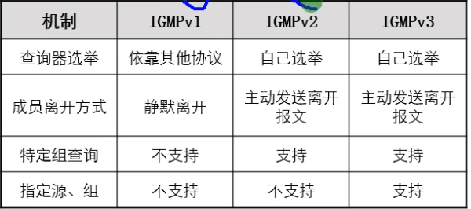
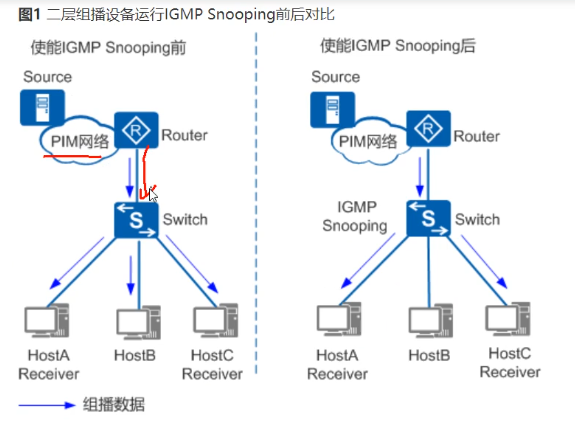
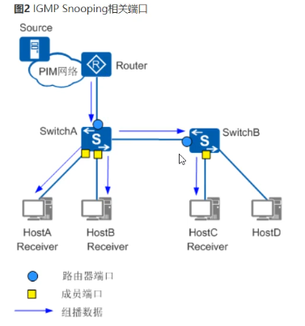
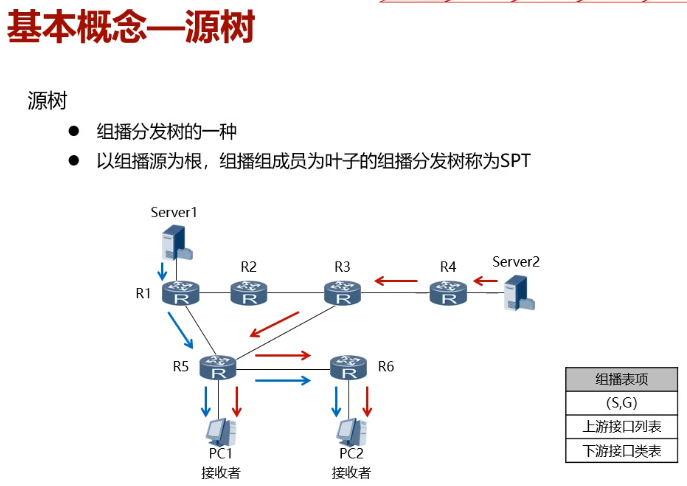
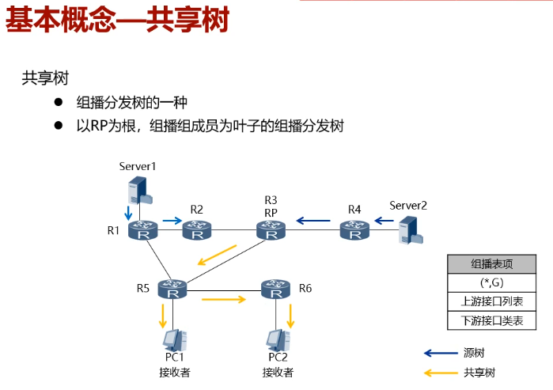
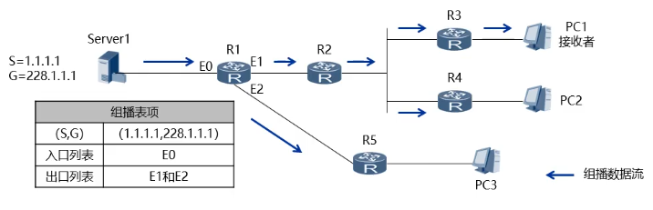

# 组播
## 一、IGMP（因特网组管理组协议）
- 作用：
    - 管理组播成员的加入，离开组播组的状态，维护组播路由器与组成员之间的关系。
    - 工作在组成员和网关(组播路由器)之间，基于 IP 协议
- 版本：
    - V1,V2
        - 用于 ASM（任意源组播）
    - V3
        - 用于 SSM（指定源组播）

## 二、 IGMP原理
### IGMPv1
1. 组成员加入(成员报告): report 报文
2. 普通组查询报文: 路由器 每60s 周期性的查询组成员的状态，
    - 如果局域网中有组成员在线，收到查询后，会通过成员报告报文进行响应
    - 如果没有成员在线，路由器连续查询 2 次后，加上 10s 超时时间，则确定该局域网中已经没有组成员，则立即切断组播流
3. 组播超时时间为： 2*60+10 = 130s
4. 如果局域网中有多台组播路由器，选举一台查询器：
    - 规定使用 PIM的路由协议的DR路由器作为查询器
    - DR 路由的选举机制:
        - 选择 优先级高的
        - 选 ip 地址大的
5. 成员报告抑制机制:
    - 作用:
        - 当局域网中组播组成员数量太多时，为了减少响应查询的报文数量，V1版本默认启用成员报告抑制机制
    - 原理:
        - 接收成员收到查询报文后，启动一个响应计时器(10s)，在计时器的时间内随机选择一个时间进行响应，响应较慢的成员报告被抑制。
    - 查询器只需要了解组播是否有成员在线，不需要知道组成员数量
6. 静默离开:
    - 需要等待查询器 2 个查询时间，在加上 10s 的超时时间，共 130s， 才知道接收者已经不在组内，才会删除该成员。

#### V1 缺点
```
没有离开机制，增大了成员离开的延时，浪费带宽资源
```

### IGMPv2
1. 成员加入(成员报告): report报文
2. 普通组查询报文: 每60s查询一次
3. 成员离开报文： leave 报文
4. 特定组的查询(查询指定的组播组)

#### 原理
1. 成员报告报文 和 V1 的区别
    - V1 没有查询器的选举机制
    - V2 有查询器选举机制: 比 IP地址，选小的
2. 查询器周期查询 和 V1是一样的
    - (V2普通组查询报文中明确携带了最大响应时延(默认10s，可以修改))
3. 成员离开时的处理：
    - 成员离开发送离开报文
    - 路由器接收到离开组的报文时，立刻针对该组发送特定组查询，如果还有其他成员在线，会得到响应
    - 如果没有其他成员，连续发送 2 次特定组查询，间隔为 1s，还没有得到任何响应，那么宣布改组超时
        - 华为的设备默认针对每次收到的离开报文，都会发送特定组查询

### IGMPv3 (SSM)
- 只接收特定源发送的组播数据
##


### IGMP Snooping
```
广播是概念 
泛洪是广播的实现
不是同一个东西
```


#### 原理
```
用于在三层组播设备和组成员之间侦听IGMP报文，构建二层组播转发表，实现组播报文按需传递
```

#### 端口角色


#### 影响
- 连接到IGMP Snooping 的交换机下的组播成员，将不存在响应机制，这是因为 Report 报文只向路由器端口转发

### 问题
1. IGMPv2中，特定组查询的目的IP是 224.0.0.1？
    - 不是
    - 特定组查询的目的IP是所查询组播组的组播IP地址

2. IGMP Snooping 的实现原理是什么？
    - IGMP Snooping 通过 侦听组播路由器 与 主机之间交互的 IGMP报文 建立组播数据报文的二层转发表项，
    - 从而管理和控制组播数据报文在二层网络中的转发

## PIM
```
PIM (协议无关组播) 
V1，V2 目前使用PIMv2，224.0.0.13

PIM DR
    1. 在PIM DM 中无实际意义
    2. 在PIM SM 中存在应用意义
    选举机制
        1. 比较 DR优先级，默认为1， 越大越优
        2. 比较 接口IP地址，越大越优

    PIM DR 可以在 IGMPv1中，充当查询器使用
```

### PIM DM (密集模式)
- 
- 
```
# 配置
1. 全局使能
[AR1]multicast routing-enabled
[AR1]PIM
2. 接口使能
[AR1-G0/0/0]PIM DM

# 概述
- 使用 "推"模式 转发组播报文
- 通过周期性扩散 - 剪枝构建 和 维护单项无环STP
- 是用于小型组播网络
```
#### 工作机制：
##### 1. 邻居建立
· 接口每隔 30s 周期发送 PIM Hello 消息
· 默认情况下， 3.5倍PIM Hello周期
    - 也就是 105s 内没有收到邻居的Hello消息，则认为邻居故障

##### 2. 扩散
- 将组播源发送的组播报文扩散到全网
- 沿途每台 PIM-DM 路由器创建 (S,G) 表项
- 
    - ```
        1. 第一跳 PIM 路由器，收到组播流量后，RPF检测成功之后，创建 (S,G) 表项，然后从所有下游接口转发组播流量

        2. 下游路由器收到组播流量，RPF检测成功之后，也创建 (S,G) 表项，从所有下游接口转发组播流量，以此类推，将组播流量扩散至全网 
      ```
- RPF检测：
    - 用于防止组播报文的 转发环路 以及 次优路径

    - 检测机制：
        - 收到组播数据之后，查看单播路由器中，去往组播源的地址，是否和收包接口一致
        - 如果一致则接收转发，否则丢弃

    - RPF 检测成功的后续操作：
        - 创建 (S,G) 表项，将 RPF接口作为 SG表项的上游接口
        - 将所有存在 PIM邻居和组成员的接口作为下游接口

- 如果去往组播源，存在多个等价的出接口，则等价路由中下一跳地址大的接口作为RPF接口，RPF接口上下一跳地址作为 RPF邻居

- 无论是(S,G) 还是(*,G)，上游接口只能存在一个，而下游接口可以存在多个

- 当连接组成成员的接口，没有启动 PIM协议时，组播流量到达最后一条路由器，虽然 PIM表项没有下游接口信息
    - 但是 IGMP表项存在下游接口信息，组播流量可以使用 IGMP表项进行转发，此时组成员可以正常接受数据。
    - 但是在组播路由转发表项中，是存在下游接口信息的

- 所以依然建议连接组播成员的接口开启 PIM协议：
    - 是因为开启 PIM协议之后，IGMP表项就不存在下游接口信息
    - 而使用统一的 PIM表项进行表述，便于运维 和 管理

##### 3. 剪枝
```
触发剪枝的条件：
    - 当路由器 PIM 表项 和 IGMP 表项中不存在下游接口信息，将会触发剪枝行为

过程：
    1. 剪枝由最后一跳路由器发起，朝上游发送 Prune(剪枝)消息，修剪掉多余组播分发路径
    2. 上游收到 Prune 之后，将收包接口从 SG表项的下游接口删除，删除之后
        - 如果存在其他下游接口，则剪枝停止
        - 如果不存在其他下游接口，则继续朝上游发送 Prune消息
            - 以此类推，修剪掉多余的组播分发路径

剪枝细节：
    - Prune 消息目的组播地址是 224.0.0.14，其中携带自身的 RPF邻居地址
    
    - 路由器朝上游发送剪枝之后，上游路由器不会立即将接收到 Prune消息的下游接口删除
        - 而是根据不同场景执行不同处理
    
    1. 如果该下游接口存在 IGMP组成员，
        - 则忽略该剪枝信息
    2. 如果该接口只存在一个 PIM邻居，
        - 则立即修剪该接口
    3. 如果该接口存在多个 PIM邻居，
        - 则开启剪枝否决机制

剪枝否决机制:

    即将收到 Prune消息的接口，开启一个 3s的延迟定时器
    1. 如果 3s 没有收到 Join消息，
        - 则该下游接口被修剪
    2. 如果 3s 内，收到了其他路由器发送的 Join 消息，
        - 则忽略之前的 Prune 消息，接口不被修剪

hold time：
    210s：
        1. PIM 路由器朝上游发送 Prune之后，下一个 Prune需要等待210s 之后进行发送
        2. 收到 Prune 消息被修剪的接口，在 210s 之后会再次出现在 SG 表项中
```

##### 4. 嫁接


##### 5.

### PIM SM (稀疏模式)


