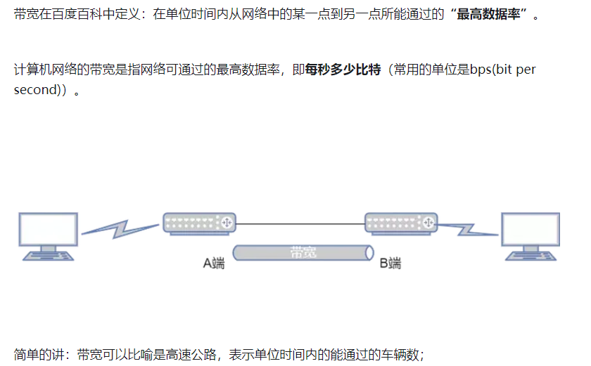
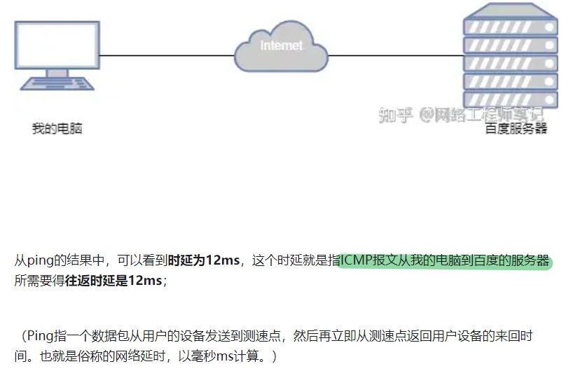
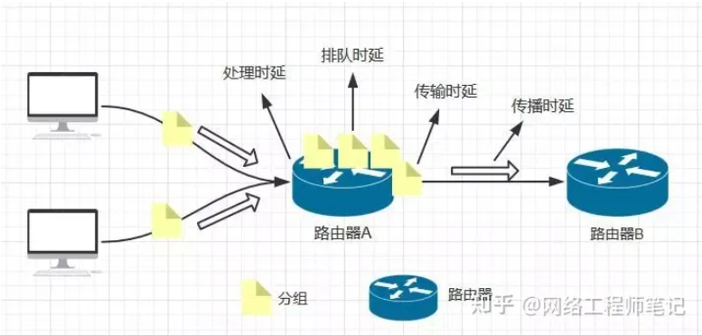
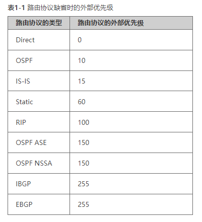
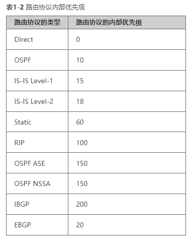

# 网络基础

### 影响网络性能的四大指标
```
1. 带宽
2. 时延
3. 抖动
4. 丢包
```
#### 带宽（路宽）bps


```
1000 bit/s = 1kbit/s
100 0000 bit/s = 1Mbit/s
100 0000 0000bit/s = 1Gbit/s 
```

#### 时延 (报文从网络一端到另一端所需要的时间) ms




##### 处理时延
```
网络设备收到报文后，需要一定实际时间对报文进行处理
	（ms ~ us级别）
```
##### 排队时延
```
网络设备 处理数据包排队 所消耗的时间
	（ms ~ us级别）
```
##### 发送时延
```
网络设备 发送数据所需要的时间
	（ms ~ us级别）
```
##### 传播时延
```
报文在实际物理链路上传输所需要的时间
	(ms 级别)
```

#### 抖动
```
指的是：
	- 最大延迟 与 最小延迟 的时间差

	抖动 = 最大时延 - 最小时延

	抖动越小，网络越稳定

产生原因：
	- 网络拥塞
		- 导致延迟忽大忽小，造成网络抖动
```

#### 丢包
```
指的是：
	数据包无法通过网络到达目的地
```

### 一、基础设备分类

1. 路由器：
	- 运行路由协议，维护路由表，寻址、转发等功能

2. 交换机：
	- 提供网络接入接口（如：24、48、64等）也提供了数据交互的功能

3. 防火墙：
	- 提供访问行为管理、安全区域划分、安全策略、用户身份认证等功能，保证网络访问的安全性

4. AP：无线接入点
    - FAT AP：功能集中（如：身份认证、IP地址分配、鉴权管理等功能）并提供无线网络接入的设备
    - FIT AP：一般只提供无线网络接入，身份认证等其他功能由 AC 负责

- FAT AP 适合于家庭、中小型办公环境使用（更灵活、便于迁移）  

- AC + FIT AP 适合于中大型的网络使用，
	- AC 可以对 AP 集中下发配置数据，并且管理 AP 上线（监控 AP）
	- （集中管理，减少管理员配置和运维压力，便于扩展站点）


### 二、网络拓扑
1. 总线型网络：设备通过单线状连接在一起
	- 优点：
		- 相对环形组网成本更低，更适合于地理位置不佳的设备连接
	- 缺点：
		- 没有冗余性，一旦传输站点和线缆故障，都会导致设备无法访问


2. 环形组网：设备首尾相连，连成环状结构
	- 优点：
		- 有一定的冗余性，适合于中远距离的组网（城域网、广域网等）
	- 缺点：
		- 成本相对总线更高（线缆和中转设备）
        
- 相比于星型网络，环形组网不便于扩展，节点之间会相互影响
- （容易因为节点多，带宽不足导致网络品质下降，次优路径的产生）

		
3. 星型组网：通过核心站点连接各分支站点组网，形成星型网络
	- 优点：
		- 扩容和迁移比较灵活，分支站点不会互相干扰
	- 缺点：
		- 没有冗余性，核心站点故障会导致网络瘫痪


4. 双星型组网：通过增加核心站进行组网
	- 优点：
		- 提高了冗余性，不会因为单核心故障导致网络瘫痪。通过双上行的接口进行负载均衡
	- 缺点：
		- 增加了设备和线缆的成本

## 基础配置命令
设备可以通过 web 或则 CLI 方式登录

### VTY 接口
- 配置级(2级以上):  可以完成 系统配置
- 管理级(3级以上):  可以对 设备进行配置，以及设备升级，故障判断
- 等级越高，权限越高 (0-3 或者 0-15)

### 查看命令
    // 查看接口的 IP 地址摘要
	display  ip interface brief 				

    // 查看设备所有的配置信息
	display current-configuration 			

    // 查看设备所有的接口配置信息
	display current-configuration   interface		

    // 查看字符 "OSPF" 的配置信息
	display current-configuration |  begin  ospf		

    // 查看当前视图的信息
	display  this 					

## 网络参考模型
### 一、 传输层
1. TCP（传输控制协议）可以提供稳定可靠的，面向连接的传输服务
	1. 可靠性机制
	- 三次握手：传输数据前，必须经过 TCP 的三次握手，确保 TCP 会话的可靠性

	- 序列号，确认序列号：  

		- 序列号  可以在数据收发过程中，确保数据的顺序（避免乱序）

		- 确认序列号，从收到的数据序列号 + 1 确认，
        
        - 例如：发送 seq = 100，ack = 101
		代表收到了 100 的数据包，下一个数据包从 101 开始发送
		
        - 如果收到的 ack 有误，则会重传（例如：ack=99）则从 99 重新进行发送
	    
        - 用于确保数据在传输过程中的可靠性

	2. 控制传输数据的速率
        - 滑动窗口机制：通过接收方的窗口值进行协商，以接收方的窗口大小来调整发送方的速率

        - 慢启动机制：当发送方出现拥塞的时候，会执行慢启动，通过窗口抑制来控制发送速率		
			用于 QOS 服务（服务质量）
	
	3. 四次挥手：TCP 在完成数据传输后，会通过四次挥手中断 TCP 连接（释放端口号）
	
	    - 应用场景：适合于稳定可靠传输的业务（例如：文件传输业务，FTP、HTTP 等）
		- 也适用于需要稳定可靠的控制协议（如：Telnet、BGP 协议等）
		

2. UDP（用户数据包协议）可以提供快速的，面向无连接的传输服务（不可靠）
	- UDP 没有可靠传输的机制，也不会重传数据包，适合于对可靠性要求不高，但是时延要求高的业务
	例如：语音、视频流量等
	
    - UDP 头部只有 8 字节，TCP 20 字节

### 二、 网络层
1. IPv4：采用点分十进制显示，4 字节长度的地址（2的32次方，地址数量约等于 42.9 亿个地址）
	- IPv4 地址可以分为两部分
	    - 网络部分和主机部分
	        - 网络部分：代表主机是否属于同一个网络（相同网段的设备默认能够互相访问）
	        - 主机部分：表示在同一个网段中的不同主机，唯一标识一台主机或者接口
	- 网络部分和主机部分的长度可变，但是相加之和一定是等于 32 bit 的

2. IPv6：
    - 地址容量是 2 的 128 次方，使用十六进制来显示的

## IP 编址
### 一、IP 编址
1. 网络部分：代表主机的所属网段，判断是否同一个网段内
2. 主机部分：代表相同网段中的，唯一，一台主机
3. 网络掩码：网络掩码用于标识网络部分，掩码为 1 代表网络部分对应，并且固定不变， 掩码为 0 ，代表主机部分，主机部分可变，可以为 1 也可以为 0

IPv4 地址长度（32） = 掩码长度 + 主机地址长度
```bash
例如：10.1.2.3/24         24 代表掩码的长度，有 24 个网络地址固定
	0000 1010 . 0000 0001 . 0000 0010 . 0000 0011  =  10.1.2.3 ( IP 地址)
	1111 1111 . 1111 1111 . 1111 1111 . 0000 0000  =  掩码长度

	网络地址中， 10.1.2 是无法改变的，因为掩码为 1 映射固定
	所以网络部分为：10.1.2.
	主机部分为：3 （0000 0011）	 主机部分是可变的，3 只能代表主机部分的其中一台设备
	主机地址 = 2 的 N 次方， N 等于主机位的长度（8），所以主机地址数量 = 2 的 8 次方（256 个地址）


# 主机使用的地址为单播地址，分为 3 类，A、B、C 三类地址（称为有类 IP 地址）
通过 IP 地址的前 8 bit 范围来分类
# A 类地址，第 1 bit 固定为 0
	取值范围：0—127，地址（0.0.0.0 — 127.255.255.255）			有类地址有固定的掩码长度，也就是固定的网络地址范围
				128、64、32、16    8、4、2、1  = 255		A 类地址掩码长度为：8           主机位：24
			 	 0      X     X     X     X   X   X   X

# B 类地址，前 2 bit 固定为 1 0
	取值范围：128—191，地址（128.0.0.0 — 191.255.255.255）		B 类地址掩码长度为：16          主机位：16
				128、64、32、16    8、4、2、1  = 255
			 	 1      0     X     X     X   X   X   X

# C 类地址，前 3 bit 固定为 1 1 0
	取值范围：192—223，地址（192.0.0.0 — 223.255.255.255）		C 类地址掩码长度为：24           主机位：8
				128、64、32、16    8、4、2、1  = 255
			 	 1      1      0     X     X   X   X   X
	例如：192.168.1.1 是一个 C 类地址，10.1.1.1 是一个 A 类地址
	掩码长度 + 主机位长度 = 32 （无论怎么改变长度，它们的和都是等于 32 的）掩码越长，主机位越短，能用的地址就越少，反之地址容量越大
	一个 C 类地址的地址数量为：256，  2的N次方 （N = 主机位长度）  B 类地址数量为：2的16次方 = 65536

	# 但是每个网段中都会保留2个特殊地址
	# ① 网络地址：用于标识主机是否属于相同网段  （以 C 类地址  192.168.1.1  为例）
			网络地址是主机位为全0的，192.168.1.0/24

	# ② 广播地址：在相同网段中，广播地址发送的数据包，所有主机都能收到
			广播地址是主机位为全1的，192.168.1.255/32

	所以可用的地址范围，等于（2的N次方-2），一个 C 类地址段，总共有 254 个可用主机地址
```

## 子网数、主机数 与 子网掩码的关系
1. 利用子网数目计算子网掩码
```bash
把B类地址172.16.0.0划分成30个子网络，它的子网掩码是多少？

1. 将子网络数目30转换成二进制表示11110

2. 统计一下这个二进制的数共有5位

3. 注意：当二进制数中只有一个1的时候，所统计的位数需要减1（例如:10000要统计为4位）

4. 将B类地址的子网掩码255.255.0.0主机地址部分的前5位变成1

5. 这就得到了所要的子网掩码（11111111.11111111.11111000.00000000）255.255.248.0。
```


2. 利用子网掩码计算最大有效子网数
```bash
A类IP地址，子网掩码为255.224.0.0，它所能划分的最大有效子网数是多少？

1. 将子网掩码转换成二进制表示11111111.11100000.00000000.00000000

2. 统计一下它的网络位共有11位

3. A类地址网络位的基础数是8，二者之间的位数差是3

4. 最大有效子网数就是2的3次方，即最多可以划分8个子网络
```


3. 利用主机数目计算子网掩码
```bash
把B类地址172.16.0.0划分成若干子网络，每个子网络能容纳500台主机，它的子网掩码是多少？

1. 把500转换成二进制表示111110100

2. 统计一下这个二进制的数共有9位

3. 将子网掩码255.255.255.255从后向前的9位变成0

4. 这就得到了所要的子网掩码（11111111.11111111.11111110.00000000）255.255.254.0。
```


4. 利用子网掩码计算最大可用主机数
```bash
A类IP地址，子网掩码为255.252.0.0，将它划分成若干子网络，每个子网络中可用主机数有多少？

1. 将子网掩码转换成二进制表示11111111.11111100.00000000.00000000

2. 统计一下它的主机位共有18位

3. 最大可用主机数就是2的18次方减2（除去全是0的网络地址和全是1广播地址），即每个子网络最多有262142台主机可用。
```


5. 利用子网掩码确定子网络的起止地址
```bash
B类IP地址172.16.0.0，子网掩码为255.255.192.0，它所能划分的子网络起止地址是多少？

1. 利用子网掩码计算，最多可以划分4个子网络

2. 利用子网掩码计算，每个子网络可容纳16384台主机（包括网络地址和广播地址）

3. 用16384除以256（网段内包括网络地址和广播地址的全部主机数），结果是64

4. 具体划分网络起止方法如下：

	172.16.0.0～172.16.63.255

	172.16.64.0～172.16.127.255

	172.16.128.0～172.16.191.255

	172.16.192.0～172.16.255.255
```


### 二、VLSM（可变长子网掩码）
	网络位向主机位，借位，来划分子网段
	可以根据可用地址数量来进行计算，2的N次方-2 >= 所需的地址数量                    
    
    掩码长度 + N(主机位长度) = 32
	
	CIDR（无类域间路由，路由汇总）主机位向网络位借位
## IP 路由基础
### IP 路由概述
```
当路由表收到一个 IP 报文时，路由器根据该 IP 报文的 目的地址 匹配路由条目(或路由表项)
	- 若有匹配的路由条目，则依据该条目中的出接口 或 下一跳等信息进行报文转发
	- 若无匹配的路由条目，则路由器没有相关路由信息用于指导报文转发，此时丢弃该报文
```
#### RIB 与 FIB

```javascript
- 路由表
	- 可以将路由表视为位于路由器的控制平面，实际上路由表并不直接指导数据的转发。
	- 路由器在执行路由查询时，并不是在路由表中进行 报文的目的地址 的查询
	- 真正指导数据转发的是 FIB 表，路由器将路由表中的最优路由下载到 FIB 表
	- 此后如果路由表中的相关表项发生变化，FIB 表也将立即同步

	- 实际上 路由器查询的是 FIB 表，位于控制层面的路由表只提供路由信息

- FIB 表
	- 位于路由器的数据平面，也称为 转发表项， 每条转发表项都指定要达到某个目的地所需通过的出接口 及 下一跳 IP 地址 等信息

· OSPF （Open Shortest Path First，开放式最短路径优先）和 IS-IS（Intermediate System to Intermediate System，中间系统到中间系统），均基于 链路状态信息， 使用最短路径优先算法进行路由计算。

· 路由进程: 路由器支持 OSPF 和 IS-IS 多进程，可以根据业务类型划分不同的进程，不同进程之间相互独立。
	- 进程号 是 本地概念， 不影响其他路由器之间的报文交换。
	- 因此，不同路由器之间，即使进程号不同也可以进行报文交换
```

#### 路由表


#### IP 路由查找的最长匹配原则 (CIDR)


```javascript
- FIB 表中每条转发项都 
	- 指明 到达某网段或某主机的报文应通过路由器的哪个物理接口 
	- 或 逻辑接口发送，然后就可到达该路径的下一个路由器，
	- 或者 不在经过别的路由器 
	- 而传送到直接相连的网络中的目的主机

• FIB表信息查看命令：display fib [ slot-id ]
	▫ slot-id：显示指定槽位号的FIB表信息。整数形式，取值范围请根据设备实际配置选取。

• FIB表中的字段说明：
	▫ Total number of Routes：路由表总数。
	▫ Destination/Mask：目的地址/掩码长度。
	▫ Nexthop：下一跳。
	▫ Flag：当前标志，G、H、U、S、D、B的组合。
		▪ G（Gateway）：网关路由，表示下一跳是网关。
		▪ H（Host）：主机路由，表示该路由为主机路由。
		▪ U（Up）：可用路由，表示该路由状态是Up。
		▪ S（Static）：静态路由。
		▪ D（Dynamic）：动态路由。
		▪ B（Black Hole）：黑洞路由，表示下一跳是空接口。
	▫ TimeStamp：时间戳，表示该表项存在的时间，单位是秒。
	▫ Interface：到目的地址的出接口。
	▫ TunnelID：表示转发表项索引。该值不为0时，表示匹配该项的报文通过隧道转发
	（如：MPLS隧道转发）。该值为0时，表示报文不通过隧道转发。
```

#### 路由的来源

- 动态路由
	- 路由器通过动态路由协议(如 OSPF，IS-IS，BGP等)学习到的路由
		- BGP (Border GateWay Protocol，边界网关协议)
			- 是一种实现 AS (Autonomous System, 自治系统)之间的路由可达，并选择最佳路由的距离矢量路由协议
		- AS 是指在一个实体管辖下的拥有相同选路策略的 IP 网络

#### 动态路由协议
```javascript
- 动态路由协议根据作用范围不同，可分为：
	- 内部网关协议 IGP (Interior Gateway Protocol):
		- 在同一个自治系统内部运行。常见的 IGP协议 包括 OSPF 和 IS-IS
		
	- 外部网关协议 EGP (Exterior Gateway Protocol):
		- 运行于不同自治系统之间。BGP 是目前最常用的 EGP 协议
```

#### 路由迭代
```javascript

```

### 一、ICMP
    作用：用于网络设备传递差错信息和控制信息
```bash
# 1、ping（差错信息）
	发起访问的设备会通过发送 ICMP Echo Request 来测试是否能够到达目的主机
	如果有回复，则代表发起访问的设备与目的主机网络连通（还可以收集网络品质信息）
		如：延迟、抖动、丢包率等
	如果没有回复，或者回复差错信息则代表网络可能有故障，无法连通

# 2、重定向（控制信息）
	如果网关设备发现目的数据包有更好的下一跳，则会发送重定向报文，告知访问者
	下一次转发时，选择更优的下一跳地址转发（解决次优路径问题）

# 3、Tracert（利用差错信息进行故障定位）
例如：R1-R2-R3-R4
    ① R1 设备访问 R4 的时候，会发起一个 TTL=1 的测试数据包
    ② R2 设备收到后会继续转发，当发现 TTL=0 ，则 R2 会丢弃数据包，并且向 R1 发起 ICMP 的差错通告
	    R2 会告诉 R1 （TTL=0） R1 设备就得知数据包经过了 R2
    ③ R1 会把 TTL 修改为 2 继续测试，如此类推（重复 ① 和 ② 的过）使得数据包到达 R4 时，获取到经过的设备信息
	    设备有 R2-R3-R4
	    作用：可以进行故障定位，例如 R3 没有回复，则故障出现在 R2 与 R3 之间


# 配置命令：
ping + 目的 IP 地址
ping  4.4.4.4			// 测试本设备到达 4.4.4.4 是否能连通
ping -a  2.2.2.2  4.4.4.4		// 使用 2.2.2.2 这个接口作为源地址测试是否能够到达 4.4.4.4
				（-a 可以指定源 IP 地址）
ping -c  1000  4.4.4.4		// 默认测试数据包只会发送 5 个，-c 可以指定数量（如：1000 个）

tracert  4.4.4.4			// 跟踪数据包到达 4.4.4.4 经过的设备或接口有哪些s
```

### 二、路由表
    用于指导数据包转发的，路由器会运行路由协议收集路由信息并存放到路由表中
```bash
# 1、目的地址/掩码
	作用：路由器通过路由协议收集到的网络信息（目的网段/掩码）也成为路由信息

# 2、路由协议类型
	代表路由时通过哪一种方式进入到路由表的
	Direct（直连路由）通过本设备的接口收集的路由信息，一般属于设备本身的接口

	Static（静态路由）静态路由是由管理员手工配置和维护的路由

	（动态路由）OSPF、IS-IS、RIP、BGP：通过运行路由协议自动发现和学习的路由

# 3、协议优先级（管理距离）
	通过不同协议学习到的路由（如：目的地址和掩码一样）路由器会进行优选
	根据协议优先级选择，优先级（0—255）越小越好
```
#### 外部优先级：可以由管理员手工修改
| 外部优先级：可以由管理员手工修改||		
|:-:|:-:|
| Direct			    |        0		|		
| Static			    |        60		|	
| OSPF	内部（OSPF）	|      10		|	
| OSPF    外部（O_ASE、NSSA）|  150		|  
| IS-IS	level-1		    |    15		    | 
| IS-IS	level-2		    |    15			| 
| RIP			        |        100	|		
| BGP	    IBGP		|        255	|				
| BGP	    EBGP		|        255	|		
                                             
                                             

#### 内部优先级：设备默认，且不能修改
	当外部优先级一致的时候，会比较内部优先级

|（不同的路由协议，无法比较开销值，只能比较内部优先级）||
|:-:|:-:|
| Direct			   |       0   |
| OSPF	内部（OSPF）	|      10   |
| OSPF  外部（O_ASE、NSSA）|	150   |
| Static			       |     60   |
| IS-IS	level-1		       | 15   |
| IS-IS	level-2		       | 18   |
| RIP			           |     100   |
| BGP	    IBGP		   |     200   |
| BGP	    EBGP		   |     20   |




```											
	# 例1：						
	① 1.1.1.1/32   OSPF
	② 1.1.1.1/32   RIP		优选  ①  因为 OSPF 的路由优先级更小
	
	# 例2
	① 1.1.1.1/32   OSPF   10
	② 1.1.1.1/32   RIP	  10（手工修改优先级）	优选 ① 因为 OSPF 的内部优先级更小

	# 例3
	① 1.1.1.1/32   BGP（IBGP）	255
	② 1.1.1.1/32   RIP		255（手工修改优先级）	优选 ② 因为 RIP 的内部优先级更小
	
# 4、开销值
	相同的路由协议，无法比较优先级，则会根据开销值来进行比较
	开销值越小，代表距离越近，越优
	# 例1：
	① 1.1.1.1/32   OSPF     cost=10
	② 1.1.1.1/32   OSPF	     cost=20	优选 ① 路由，因为 cost 更小
	
	# 例2：
	① 1.1.1.1/32   OSPF     cost=10	如果协议一致，优先级一致，开销值也一致，两条路由都能使用
	② 1.1.1.1/32   OSPF	     cost=10	（负载均衡）
```
#### 练习
```bash

① 1.1.1.1/32   OSPF	 10	cost=10	  √		
② 1.1.1.1/32   RIP	 100	cost=1		


① 1.1.1.1/32   OSPF		cost=10
② 1.1.1.1/32   OSPF		cost=1		√
   

① 1.1.1.1/32   OSPF	  10		 cost=1		√		
② 1.1.1.1/32   RIP	（手工修改优先 10）  cost=1		


① 1.1.1.1/32  Static  优先改为 100	cost=0		√
② 1.1.1.1/32   RIP	100		cost=1
```

### 三、静态路由
	是由管理员手工配置和维护的路由
```bash	
# 配置命令：（系统配置视图）
	ip  route-static   目的地址 + 掩码  +  出接口 /  下一跳地址
	例：ip route-static   3.3.3.3  32    G0/0/0   10.1.12.2				
    // 目的地址为：3.3.3.3/32 的路由，出接口为 G0/0/0 ，下一跳地址为：10.1.12.2

	补充：在以太网的网络类型（广播型多路访问）必须添加下一跳地址		
        // ip route-static   3.3.3.3  32  10.1.12.2
		在点到点网络类型（PPP 或 HDLC）则可以指定下一跳或者出接口		
          // ip route-static   3.3.3.3  32    G0/0/0

	（查看静态路由的配置命令：系统配置视图 display  this 可以查看）

# 1、等价路由（负载均衡）
	- 同一个目的地址和掩码的路由（协议类型、优先级一致、开销值也一致）有多个下一跳或者出接口
	- 这时候可以选择使用任意一条路由发起访问，称为等价路由
	- 使用场景：主要使用在带宽一致且多个下一跳出口的场景


# 2、浮动路由（主备）
	- 同一个目的地址和掩码的路由（优先级或者开销值不一致）访问时优先选择优先级更小的，或者开销值更小的路由访问
	- 当主路由故障了，备份的路由就可浮现（优先级更大的路由）
	- 使用场景：主备在带宽不一致的场景，带宽更高的可以配置为主路由，带宽更低的则为备份路由

	ip route-static   3.3.3.3  32  20.1.12.2	（主路由）
	ip route-static   3.3.3.3  32  10.1.12.2  preference  100（备份路由）				
    // 把静态路由的优先级修改为 100
									（优先级默认是：60，取值范围：1—255，数值越小越优先）


# 3、CIDR 与 VLSM
	# VLSM（可变长子网掩码）：可以把一个子网划分为多个子网
    例如：把 192.168.1.0/24（地址范围：0—255）
			 分为 2 个子网（192.168.1.0/25 ，地址范围：0—127）和 （192.168.1.128/25，地址范围：128—255）

	# CIDR（无类域间路由）：可以把多个子网汇总成一个子网
		10.1.1.1/32	从左往右把相同的网络位保留下来，10.1.1（24 bit） 1 和 2 是不同
		10.1.1.2/32		1 = 0000  0001
					    2 = 0000  0010	0000 00XX =  10.1.1.0/30	
                        XX = 01 代表 10.1.1.1 ，XX = 10 代表 10.1.1.2

	loopback1：192.168.16.1/24
           	loopback2：192.168.17.1/24
           	loopback3：192.168.18.1/24
           	loopback4：192.168.19.1/24		192.168（16 bit）	16、17、18、19
					
					16 = 0001  0000						
					19 = 0001  0011	0001  00XX	最终：192.168.16.0/22
```
