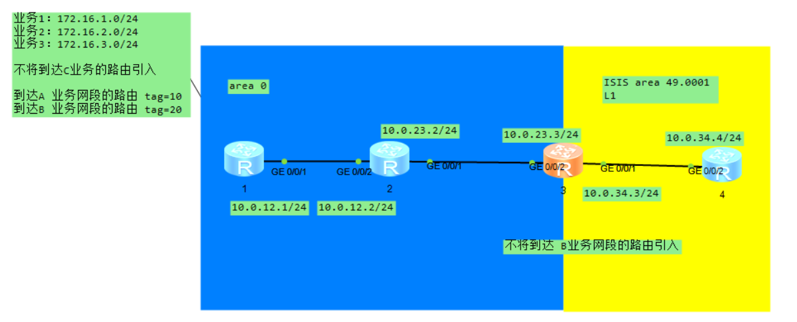
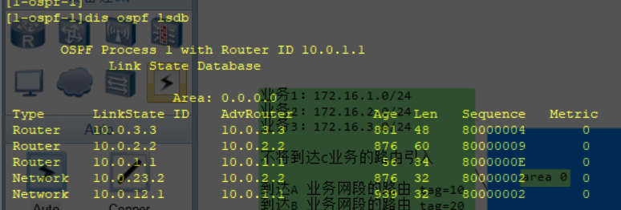
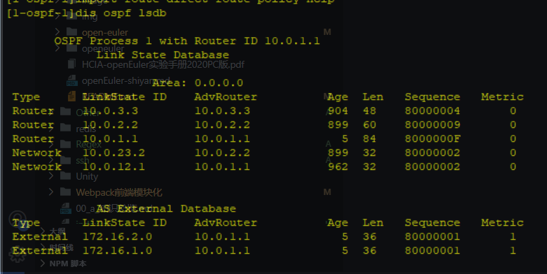
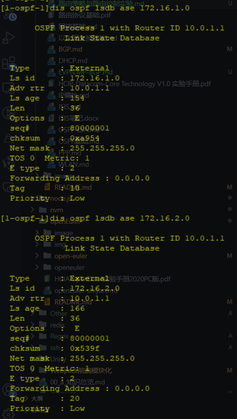
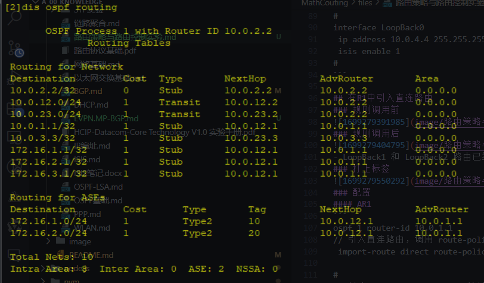
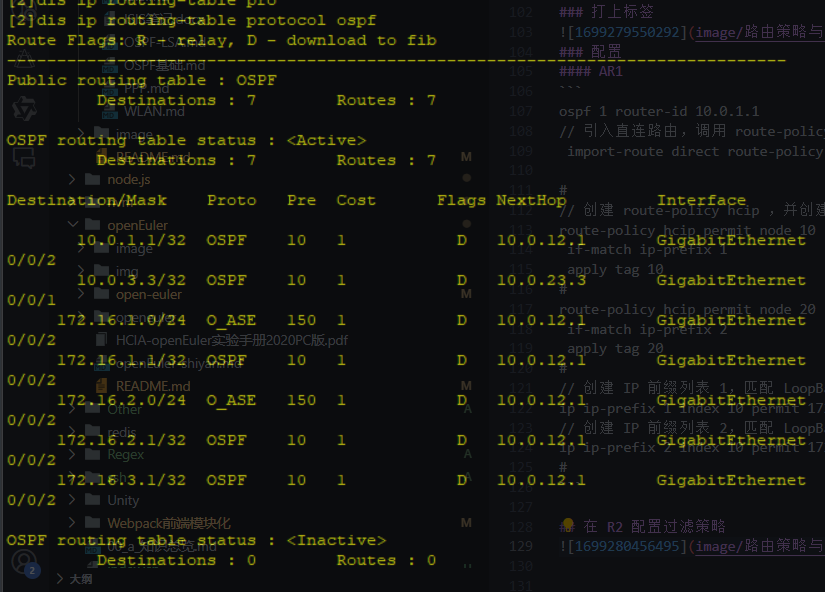
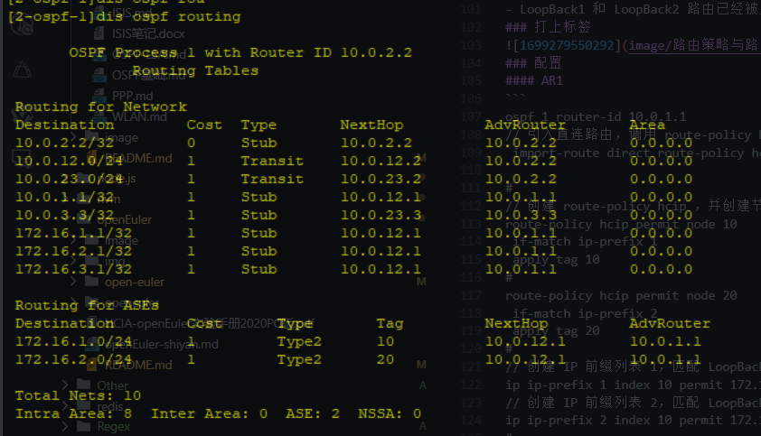
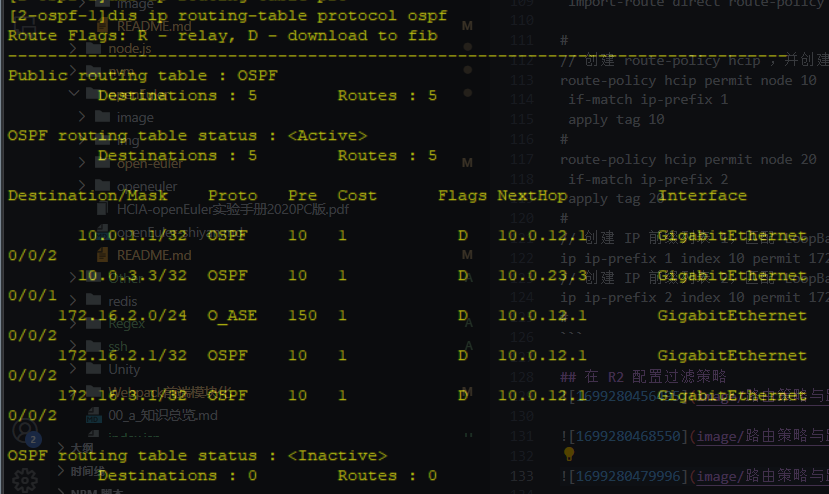
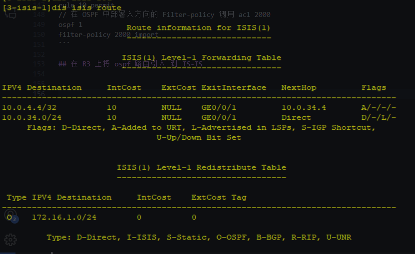

# 路由策略与路由控制实验


## 基本配置
- AR1
```
#
interface GigabitEthernet0/0/1
 ip address 10.0.12.1 255.255.255.0 
#
interface LoopBack0
 ip address 10.0.1.1 255.255.255.255 
#
interface LoopBack1
 ip address 172.16.1.1 255.255.255.0 
#
interface LoopBack2
 ip address 172.16.2.1 255.255.255.0 
#
interface LoopBack3
 ip address 172.16.3.1 255.255.255.0 
#
ospf 1 router-id 10.0.1.1 
 area 0.0.0.0 
  network 10.0.1.1 0.0.0.0 
  network 10.0.12.1 0.0.0.0 
  network 172.16.1.0 0.0.0.255 
  network 172.16.2.0 0.0.0.255 
  network 172.16.3.0 0.0.0.255 
#
```
- AR2
```
#
interface GigabitEthernet0/0/1
 ip address 10.0.23.2 255.255.255.0 
#
interface GigabitEthernet0/0/2
 ip address 10.0.12.2 255.255.255.0 
#
interface NULL0
#
interface LoopBack0
 ip address 10.0.2.2 255.255.255.255 
#
ospf 1 router-id 10.0.2.2 
 area 0.0.0.0 
  network 10.0.2.2 0.0.0.0 
  network 10.0.12.2 0.0.0.0 
  network 10.0.23.2 0.0.0.0 
#
```
- AR3
```
#
isis 1
 is-level level-1
 network-entity 49.0001.0000.0000.0003.00
#
interface GigabitEthernet0/0/1
 ip address 10.0.34.3 255.255.255.0 
 isis enable 1
#
interface GigabitEthernet0/0/2
 ip address 10.0.23.3 255.255.255.0 
#
interface LoopBack0
 ip address 10.0.3.3 255.255.255.255 
#
ospf 1 router-id 10.0.3.3 
 area 0.0.0.0 
  network 10.0.3.3 0.0.0.0 
  network 10.0.23.3 0.0.0.0 
#
```
- AR4
```
#
isis 1
 is-level level-1
 network-entity 49.0001.0000.0000.0004.00
#
firewall zone Local
 priority 15
#
interface GigabitEthernet0/0/2
 ip address 10.0.34.4 255.255.255.0 
 isis enable 1
#
interface LoopBack0
 ip address 10.0.4.4 255.255.255.255 
 isis enable 1
#
```

## 在R1中引入直连路由
### 规则调用前

### 规则调用后

- LoopBack1 和 LoopBack2 路由已经被成功引入 OSPF 中
### 打上标签

### 配置
#### AR1
```
ospf 1 router-id 10.0.1.1 
// 引入直连路由，调用 route-policy hcip
 import-route direct route-policy hcip

#
// 创建 route-policy hcip ，并创建节点 10 20 分别调用 IP 前缀列表 1、2 打上路由标记
route-policy hcip permit node 10 
 if-match ip-prefix 1 
 apply tag 10 
#
route-policy hcip permit node 20 
 if-match ip-prefix 2 
 apply tag 20 
#
// 创建 IP 前缀列表 1，匹配 LoopBack1 接口路由
ip ip-prefix 1 index 10 permit 172.16.1.0 24 greater-equal 24 less-equal 24
// 创建 IP 前缀列表 2，匹配 LoopBack2 接口路由
ip ip-prefix 2 index 10 permit 172.16.2.0 24 greater-equal 24 less-equal 24
#
```

## 在 R2 配置过滤策略
- 设置 acl 前


- 设置 acl 后



```
图中 ip 路由表 172.16.10.0/24 不存在，但是 ospf 路由表中的依旧存在

说明 对于 ospf，  filter-policy 只是限制路由加入 IP 路由表，不影响本地 LSDB，以及 LSA 传递 
```

### 配置
- AR2
```
acl number 2000
rule 5 deny source 172.16.1.0 0.0.0.255
rule 10 permit
// 在 OSPF 中部署入方向的 Filter-policy 调用 acl 2000
ospf 1
filter-policy 2000 import
```

## 在 R3 上将 ospf 路由引入 到 IS-IS
```
通过 route-policy 匹配路由标记，只引入 A 业务网段的 OSPF 外部路由
```
- 只引入了 tag 10 的路由


- 配置
```
route-policy hcip permit node 10 
 if-match tag 10

isis 1
import-route ospf 1 level-1 route-policy hcip
```

# 思考
```
在距离矢量路由协议、链路状态路由协议中使用 Filter-Policy 有什么区别?

    距离矢量协议是基于路由表生成路由的，Filter-Policy 会影响从邻居接收的路由和向邻居发布的路由，
    
    而链路状态路由协议是基于 LSDB 来生成路由的，且路由信息隐藏在链路状态 LSA 中，

    但 Filter-Poicy 不能对发布和接收的LSA 进行过滤，所以Filter-Policy 不影响链路状态通告 或 LSDB 的完整性以及协议路由表，
    
    而只会影响本地路由表，且只有通过过滤路由才可以被添加到路由表，没有通过过滤的路由不会被添加到路由表中
```