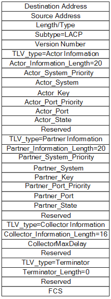
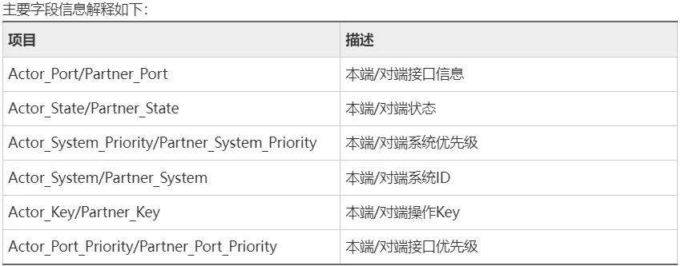
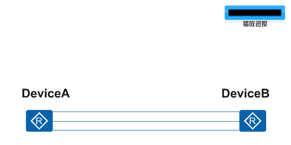
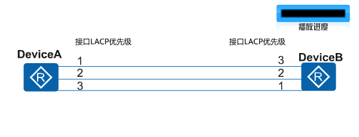
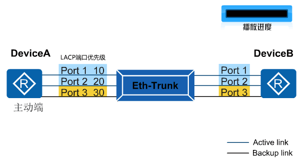
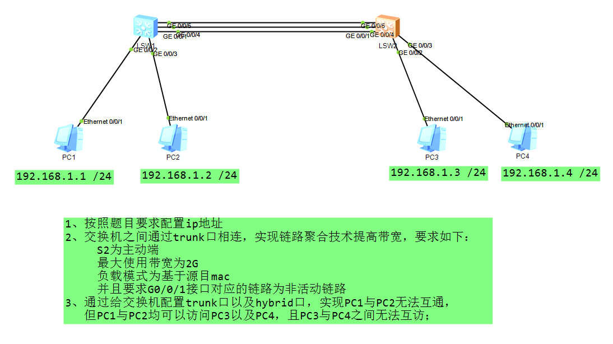

## 链路聚合
### 链路聚合
    - 产生背景: 
        - 当带宽不足的时候可以添加冗余链路增加带宽(但是交换设备上的冗余链路会被生成树阻塞，避免环路)
    
    - 使用链路聚合，可以把多条物理线缆逻辑成一条链路，实现增加带宽，同时解决环路问题

    链路聚合成员接口需求如下
        1. 相同带宽
        2. 相同的双工模式
        3. 接口类型
        4. 接口数量 (最大支持 8 条链路聚合)

### 基本概念
```
系统 LACP优先级
  - 小优
  - MAC 小优
  - 用于区分 两端设备优先级的高低 而配置的参数
  - 两端的活动端口必须保持一致，否则链路聚合组无法建立

接口LACP优先级
  - 小优
  - 用于区别同一个Eth-trunk 中，被选为活动接口的优先程度
```

### LACP 实现原理
```
基于 IEEE802.3ad 标准的LACP是一种实现链路聚合 与 解聚合的协议
```
#### LACP 报文
```
通过 LACPDU 报文进行交互信息
```



#### 建立过程
##### 1. 两端互相发送 LACPDU报文

```
当 A 与 B 上创建了Eth-trunk 并配置了LACP模式
  - 将成员接口加入后
  - 此时，成员接口就启用了LACP协议
    - 两端互相发送 LACP报文
```

##### 2. 确定主动端口和活动链路

```
收到LACPDU报文后，
  - 比较 系统优先级字段
    - 选出LACP主动端（小优）
      - 优先级 小优
      - MAC 地址 小优 为主动端
  
  - 根据 主动端设备的接口优先级 来选择活动接口，
    - 比较 接口优先级 字段

  - 两端选择了一致的活动接口，便建立起来了活动链路组
```

##### 3. LACP 抢占(默认不使能)
```
使能后，聚合组会始终保持高优先级的接口作为活动接口的状态
```


###### 需要使能 LACP 的抢占功能情况
```
1. Port1 Down 后又恢复正常，
  - 未使能时，一直处于备份状态

2. 希望 Port3 替换 1 或 2 其中一个接口，修改3优先级
```

##### LACP 抢占延时(保证数据传输稳定性)
```
配置抢占延时是:
  - 为了避免由于某些链路状态频繁变化
  - 而导致Eth-Trunk数据传输不稳定的情况
```
##### 活动链路 和 非活动链路切换
```
触发条件：
  1. 链路Down
  2. 以太网 OAM 检测到链路失效
  3. LACP协议发现链路故障
  4. 接口不可用
  5. 使能LACP抢占功能的前提下，
    - 更改备份接口优先级高于活动接口优先级
```


#### 1. 手工模式
    只要本地成员接口时 UP 就会认为可用，无法感知邻居接口状态
    
    缺点:
        没办法根据网络变化来进行收敛 (对端邻居端口 down 也无法感知)
        一般只有不支持 LACP 或者 老旧的设备使用手工模式
```bash
特点：
       1、绑定的物理接口，马上可以up，参与数据转发；
       2、无活动以及非活动链路之分；
       3、双方不协商报文，节省链路资源；

     interface eth-trunk 1                                        //创建链路聚合端口，编号为1（手工模式，两端编号可以不同）
        trunkport GigabitEthernet 0/0/1 0/0/3           //将G0/0/1以及G0/0/3接口捆绑进链路聚合口中

     interface GigabitEthernet0/0/1
         eth-trunk 2                               //进入物理接口，将该接口捆绑进eth-trunk 2中；
    **以上两种捆绑接口的方式，二选一即可；
        
      缺陷：
      1、不交互报文，无法感知对端状态，
        - 如果对方存在错误配置，容易导致丢包
      2、只能实现负载，不能实现主/备
```

#### 2. LACP 模式
- 通过周期性的发送 LACPDU 来检测邻居和链路的状态，
    - 能够感知邻居的链路等信息
    - 同时该报文还能对链路进行控制 (主备链路 和 轮询模式 等)

##### 配置命令
```bash
    # ① 创建链路聚合端口
		interface Eth-Trunk1				// 链路聚合端口的取值范围（0—63），例如：创建聚合接口 1

	# ② 修改聚合模式为 LACP 模式
 		mode lacp-static					// 该配置需要在未加入成员接口的状态下配置，如果已经加入了成员接口，则需要先删除成员

	# ③ 把成员接口加入到聚合链路中
		trunkport  GigabitEthernet 0/0/5 to 0/0/6		// 把 G0/0/5 和 G0/0/6 同时加入到聚合链路中（端口需要配置为明细接口，不能是 G0/0/5）


	# 可选配置
	# ① 指定控制端设备（系统配置视图）
		lacp priority 100					// 指定系统优先级为 100（默认：32768 ，取值范围：0—65535 越小越好）

	# ② 设置最大的活跃链路
 		max active-linknumber 2				// 设置链路为 2（默认支持 8 条链路聚合）
								（如果成员接口有 4 个，活跃链路为 2，则剩余的为备份链路）

	# ③ 开启端口切换
		lacp preempt enable				// 默认情况下，主端口故障了，备份端口会立刻进行切换
 		lacp preempt delay 10				但是，当主端口从故障中恢复，为了保障数据的稳定，不允许回切
								（需要开启回切功能才能根据优先级实现主备切换，设置切换时间为：10s）

	# 查看配置
	display   eth-trunk						// 可以查看端口的状态、邻居信息和优先级等信息

	（补充：成员接口加入到 Eth-trunk 中，后续的接口属性直接在 Eth-trunk 中修改，成员接口不在单独使用）

# 配置负载模式
int Eth-trunk 1
load-balance ?
     dst-ip       According to destination IP hash arithmetic
     dst-mac      According to destination MAC hash arithmetic
     src-dst-ip   According to source/destination IP hash arithmetic
     src-dst-mac  According to source/destination MAC hash arithmetic
     src-ip       According to source IP hash arithmetic
     src-mac      According to source MAC hash arithmetic
```


#### 例题
