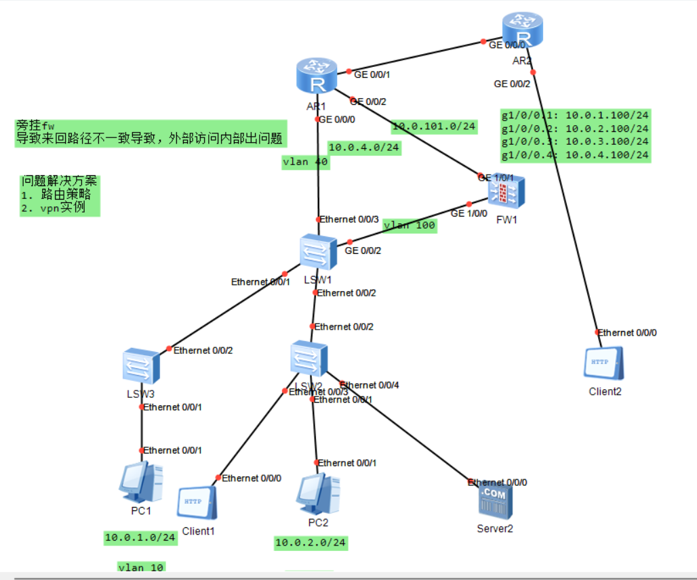

# 旁挂防火墙
## 拓扑


## [旁挂防火墙.zip](./旁挂防火墙.zip)

## AR1
```

[V200R003C00]
#
 sysname AR1
#
acl number 2000  
 rule 5 permit source 10.0.2.0 0.0.0.255 
 rule 10 permit source 10.0.2.2 0 
#
acl number 3000  
 rule 5 permit ip source 10.0.2.0 0.0.0.255 
#
interface GigabitEthernet0/0/0
 shutdown
 ip address 10.0.4.2 255.255.255.0 
#
interface GigabitEthernet0/0/1
 ip address 202.101.100.18 255.255.255.0 
 ospf enable 2 area 0.0.0.0
 nat server protocol tcp global current-interface www inside 10.0.2.10 www
 nat outbound 3000
#
interface GigabitEthernet0/0/2
 ip address 10.0.101.1 255.255.255.0 
#
interface LoopBack0
 ip address 1.1.1.1 255.255.255.255 
#
ospf 1 router-id 1.1.1.1 
 import-route unr
 area 0.0.0.0 
  network 1.1.1.1 0.0.0.0 
  network 10.0.4.0 0.0.0.255 
  network 10.0.101.0 0.0.0.255 
#
ospf 2 
 area 0.0.0.0 
#
ip route-static 0.0.0.0 0.0.0.0 202.101.100.2
ip route-static 0.0.0.0 0.0.0.0 202.101.100.17
```

## AR2
```

[V200R003C00]
#
 sysname AR2
#
interface GigabitEthernet0/0/0
 ip address 202.101.100.17 255.255.255.0 
 ospf enable 1 area 0.0.0.0
#
interface GigabitEthernet0/0/2
 ip address 202.101.100.13 255.255.255.252 
 ospf enable 1 area 0.0.0.0
#
ospf 1 
 area 0.0.0.0 
```

## AR3
```
sysname FW
#
interface GigabitEthernet1/0/0
 undo shutdown
 ip address 10.0.100.2 255.255.255.0
#
interface GigabitEthernet1/0/1
 undo shutdown
 ip address 10.0.101.2 255.255.255.0
#
interface LoopBack0
 ip address 111.111.111.111 255.255.255.255
 ospf enable 1 area 0.0.0.0
#
firewall zone trust
 set priority 85
 add interface GigabitEthernet0/0/0
 add interface GigabitEthernet1/0/0
#
firewall zone untrust
 set priority 5
 add interface GigabitEthernet1/0/1
#
ospf 1 router-id 111.111.111.111
 area 0.0.0.0
  network 10.0.100.0 0.0.0.255
  network 10.0.101.0 0.0.0.255
#
ip route-static 0.0.0.0 0.0.0.0 10.0.101.1
```

## LSW1
```

#
sysname LSW1
#
vlan batch 10 20 40 100
#
interface Vlanif10
 ip address 10.0.1.254 255.255.255.0 
#
interface Vlanif20
 ip address 10.0.2.254 255.255.255.0 
#
interface Vlanif40
 ip address 10.0.4.1 255.255.255.0 
#
interface Vlanif100
 ip address 10.0.100.1 255.255.255.0 
#
interface Ethernet0/0/1
 port link-type trunk
 port trunk allow-pass vlan 10 20 100
#
interface Ethernet0/0/2
 port link-type trunk
 port trunk allow-pass vlan 10 20 100
#
interface Ethernet0/0/3
 port link-type access
 port default vlan 40
#
interface GigabitEthernet0/0/2
 port link-type access
 port default vlan 100
#
interface LoopBack0
 ip address 11.11.11.11 255.255.255.255 
#
interface LoopBack1
 ip address 10.0.2.100 255.255.255.255 
#
ospf 1 router-id 11.11.11.11 
 area 0.0.0.0 
  network 10.0.4.0 0.0.0.255 
  network 10.0.2.0 0.0.0.255 
  network 10.0.100.0 0.0.0.255 
  network 11.11.11.11 0.0.0.0 
#
ip route-static 0.0.0.0 0.0.0.0 10.0.100.2
```

## LSW2
```

#
sysname lsw2
#
vlan batch 10 20 30 40 100
#
interface Ethernet0/0/1
 port link-type access
 port default vlan 20
#
interface Ethernet0/0/2
 port link-type trunk
 port trunk allow-pass vlan 10 20 30 40 100
#
interface Ethernet0/0/3
 port link-type access
 port default vlan 20
#
interface Ethernet0/0/4
 port link-type access
 port default vlan 20
#
```