# HCIA 刷题笔记

## 以下哪一个是IPV6的 链路本地地址？
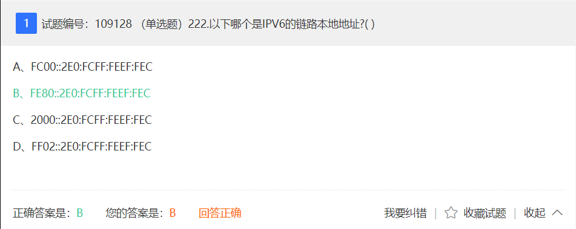

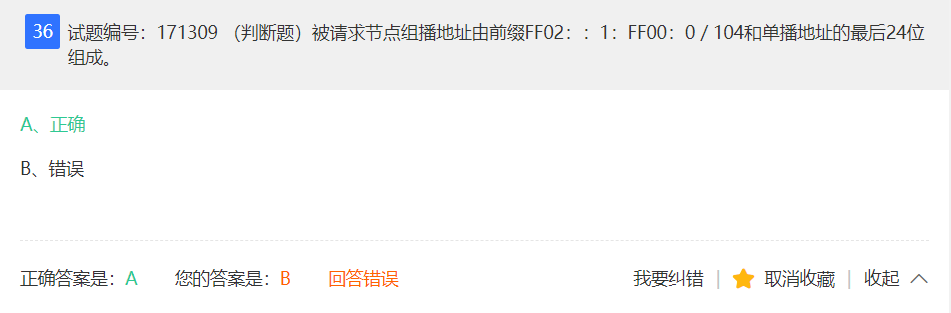


```javascript
// IPv6 地址结构

    网络前缀 | 接口ID

例：2001::1/64
    - 64 用于确定从头开始的几位是网络位 

    网络前缀： 
        - 相当于IPv4的网络位 
    接口ID：   
        - 相当于IPv4的主机位
        - 由 EUI-64 方式获得

*********************************
单播地址 Unicast
    - 唯一标识一个接口
    - 一个单播地址只能标识一个接口
    - 但一个接口可以有多个单播地址

    1. 链路本地地址(Link-local):
        - FE80::/10
    2. 唯一本地地址:
        - FD00/8
    3. 全球单播地址:（相当于IPv4的公网地址）
        - 固定前缀 001
        - 已分配的地址范围是 2000::/3

任播 Anycast
    - 主要为 DNS 和 HTTP 提供服务
    - 任播地址 和 单播地址使用相同的地址空间
    - 分为基于 网络层 和 基于 应用层 的任播
        - 网络层的任播仅仅依靠网络本身来选择目标服务器节点
        - 应用层任播是基于一定的探测手段和算法来选择性能最好的目标服务器节点

组播 Multicast
    - Ipv6 不存在 广播报文，部分广播应用使用 组播实现
    - 组播地址标识一组接口，目的地址是组播地址的数据包会被属于该组的所有接口所接收
    - 以 FF::/8 开头

    Ipv6 固定的组播地址
        - 所有节点的组播地址:
            - FF02::1 (相当于 IPv4 中的广播)
        - 所有路由器的组播地址：
            - FF02::2 (相当于 224.0.0.2)
        - 所有 OSPFv3 路由器地址:
            - FF02::5 (相当于 224.0.0.5)
        - 所有 OSPFv3 DR 和 BDR:
            - FF02::9 (相当于 224.0.0.6)
        - 所有的 RIP 路由器:
            - FF02::9 (相当于 224.0.0.9)
        - 所有的 PIM 路由器:
            - FF02::D (相当于 224.0.0.13)
        
    被请求的节点组播地址:
        - 由固定的前缀 FF02::1:FF00:0/104
        - 和 单播地址的最后 24 位组成

特殊地址
    0:0:0:0:0:0:0:0 简化为 ::
        - 未指定地址
        - 不能分配给任何节点
        - 表示当下状态没有地址
    
    0:0:0:0:0:0:0:1 简化为 ::1
        - 环回地址
        - 发送后返回给自己的 IPv6 报文
        - 不能分配给任何物理接口
        - 看作属于链路本地范围
            - 当作虚拟接口的链路本地单播地址


*********************************

**********************************
     Mac 地址 
        - 前 48 位为公司标识符
        - 后 24 位为拓展标识符
            - 高 7 位为 0 表示MAC地址本地唯一 
            - 高 7 位为 1 表示此接口标识全球唯一

EUI-64 的生成方式
    
    1. 将 FFFE 插入MAC地址的公司标识和扩展标识符之间
    2. 将高 7 位的 0 改为 1，表示此接口标识全球唯一
            
例：
    MAC: F8-A9-63-1E-A1-07
    
    1. 分为 F8A963 1EA107 中间加上 FFFE 
    2. 变为 F8A963 FFFE 1EA107
    3. 高 7 位由 0 改为 1，变为 FAA963 FFFE 1EA107
    4. 所以 EUI-64 计算出 接口ID：
            FAA9:63FF:FE1E:A107

**********************************
```

## DHCP客户端在租期到达哪个比例时第一次发送续租报文？
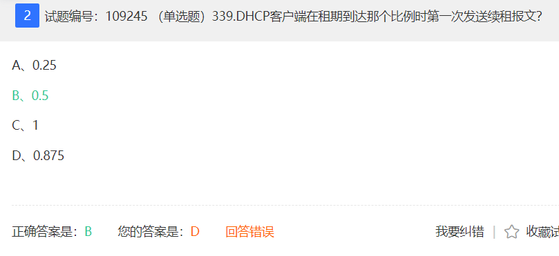
## DHCP客户端想要离开网络时发送哪种DHCP报文？

```javascript
// DHCP 客户端更新租期的工作原理
    - DHCP 服务器采用动态分配机制给客户端分配IP地址，
    当租期到达一定比例时，客户端会向 DHCP 服务器发送续租报文，
    通知服务器续租。
```
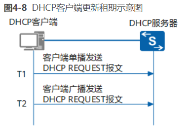
```javascript
1. 当租期达到 50% (T1)时候，
    - DHCP 客户端会以单播的方式向 DHCP服务器
    - 发送 DHCP REQUEST 报文，请求更新 IP 地址租期。
        - 如果收到 DHCP ACK 报文，则租期更新成功 (即租期从0开始计算)
        - 如果收到 DHCP NAK 报文，则重新发送 DHCP DISCOVER 报文请求新的IP地址

2. 当租期道道 87.5% (T2)时候
    - 如果仍未收到 DHCP 服务器的应答，DHCP 客户端后自动以广播的方式向 DHCP 服务器发送 DHCP REQUEST 报文，请求更新 IP 地址租期。
    - 如果收到 DHCP ACK 报文，则租期更新成功 (即租期从0开始计算)
    - 如果收到 DHCP NAK 报文，则重新发送 DHCP DISCOVER 报文请求新的IP地址

3. 如果租期时间到时都没有收到服务器回应，客户端停止使用此 IP地址
    - 重新发送 DHCP DISCOVER 报文请求新的IP地址

** 客户端在租期时间到之前，
    - 如果用户不想使用分配的IP地址（例如客户端网络位置需要变更），
    - 会触发 DHCP客户端 向 DHCP服务器 发送 DHCP RELEASE 报文，
    - 通知 DHCP服务器 释放IP地址的租期。

** DHCP服务器会保留这个DHCP客户端的配置信息，
    - 将IP地址列为曾经分配过的IP地址中，
    - 以便后续重新分配给该客户端或其他客户端。

** 客户端可以通过发送 DHCP INFORM 报文向服务器 请求更新配置信息。
```

## （acl）如下图所示网络，已知主机A不能和主机B通信，通过以下哪一个配置可以实现所有主机都能和主机C通信？
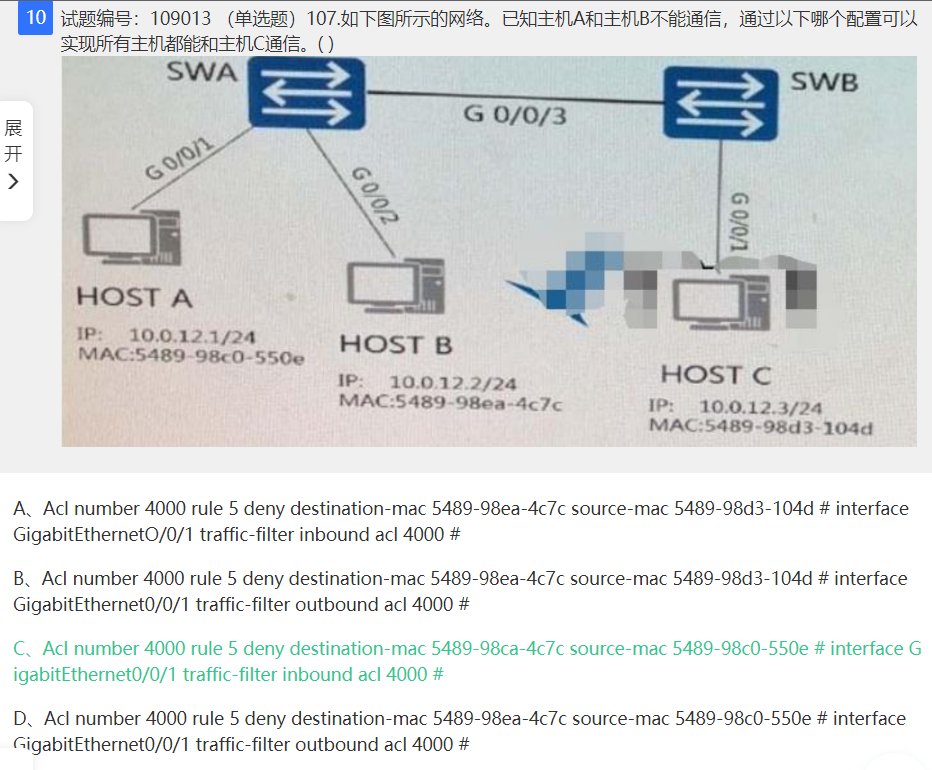

```
    acl number 4000 rule 5 deny destination-mac 5489-98ea-4c7c source-mac 5489-98c0-550e
    interface GigabitEthernet0/0/1 traffic-filter inbound acl 4000
```

### ACL (Access Control List) 访问控制列表
- **语法**
```javascript
规则 规则编号 动作 源地址 生效时间段
rule 5 permit source 1.1.1.1 0.0.0.255 time-range time 1
```

## 交换机某个端口配置信息如图，下列说法错误的是？
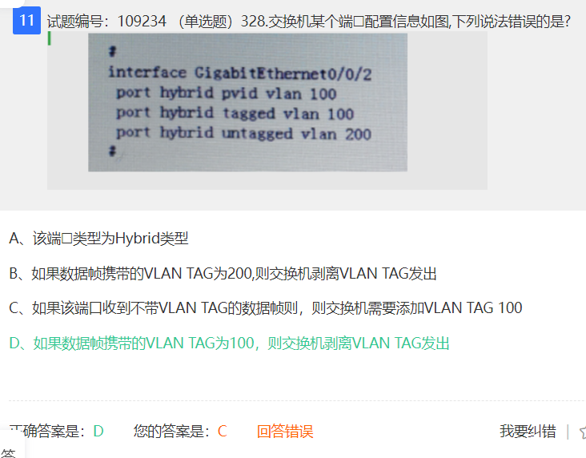

## 缺省情况下，广播网络上OSPF协议的 HELLO 报文的发送周期为?


## 以下关于 RSTP配置BPDU 的处理说法正确的有哪些？
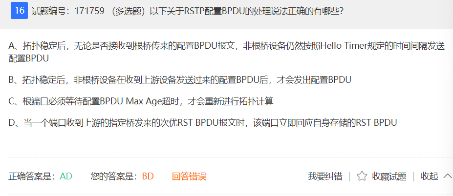
```javascript
RSTP 的配置BPDU变换
    1.  拓扑稳定后，配置 BPDU 报文的发送方式。
        无论非根桥设备是否接收到根桥传来的 RST BPDU 报文，非根桥设备仍然按照 Hello 定时器规定的时间间隔定期发送 BPDU
    2. 更短的 BPDU 超时计时。
        在 RSTP 中规定，如果一个端口连续3倍 Hello 定时器时间内没有收到上游设备发送来的 RST BPDU，那么该设备认为与此邻居之间的协商失败。
    3. 处理次优 BPDU
        不管是否是指定端口，收到次优 RST BPDU 都会马上发送本地的更优的 RST BPDU 给对端，以使对端口快速更新自己的 RST BPDU
```

## 路由器 Radius 信息配置如图，下列说法正确的是？
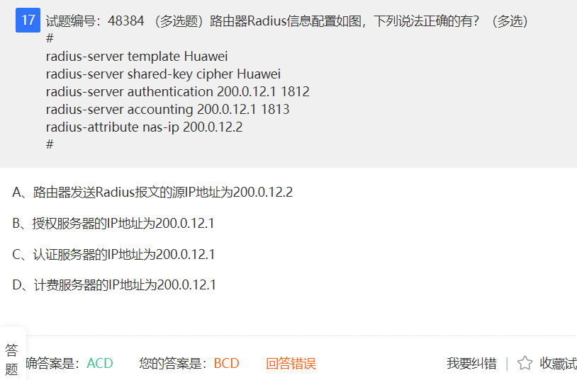
```
Radius （Remote Authentication Dial-In User Service, 远程用户拨号认证）
    - 一种分布式的、客户端/服务器结构的信息交互协议，
    - 能保护网络不受未授权访问的干扰，
    - 常应用在既要求较高安全性、又允许远程用户访问的各种网络环境中。

RADIUS协议具备如下三个特点。
    - 服务器/客户端结构
    - 安全的消息交互机制
    - 良好的扩展性。

#######################

1. 进入 RADIUS 服务器模板视图
    radius-server template name

2. 配置 RADIUS 计费服务器
    radius-server accounting 10.1.1.1 1813 

3. 配置 RADIUS 认证服务器
    radius-server authentication 10.1.1.1 1813

4. 配置与指定IP地址的RADIUS服务器通信的共享密钥
    redius-server shared-key cipher Huawei

5. 配置NAS发送RADIUS报文使用的NAS-IP-Address属性。
    radius-attribute nas-ip

#######################
```

## 以下哪些 IEEE 802.11 标准支持工作在 2.4GHz，5GHz两个频段下？
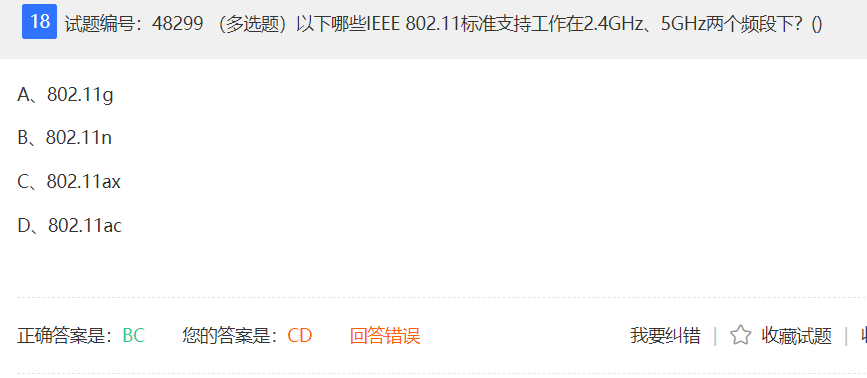
```javascript
802.11ac 与 802.11n 有什么不同？
    - 802.11ac 是对上一代标准 802.11n 的优化和发展
```
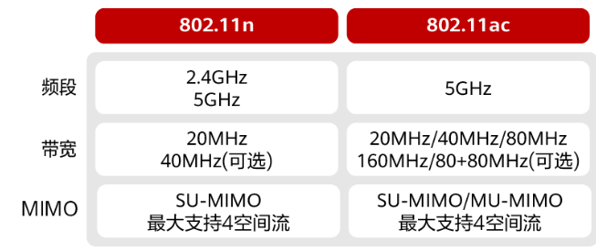

## 路由表条目 10.0.0.24/29 可能由如下哪几条子网路由汇聚而来？
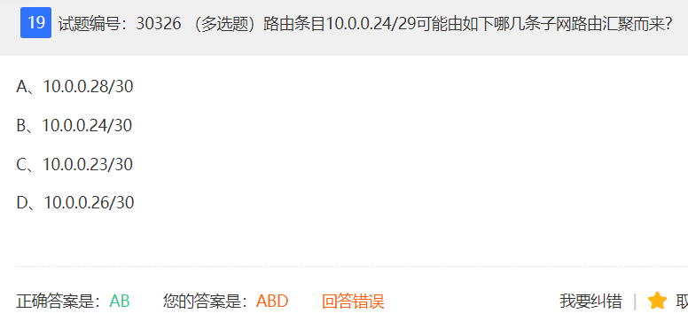

```
10.0.0.24/29
    0000 1010.0000 0000.0000 0000.0001 1 000
                                       1
10.0.0.28/30
    0000 1010.0000 0000.0000 0000.0001 1 1 00
                                         1
10.0.0.24/30
    0000 1010.0000 0000.0000 0000.0001 1 0 00
                                         1
10.0.0.23/30
    0000 1010.0000 0000.0000 0000.0001 0 1 11
                                         1
10.0.0.26/30
    0000 1010.0000 0000.0000 0000.0001 1 0 10
                                         1
```

## 下列关于 IPv6 中的 RA 和 RS 报文说法正确的是？
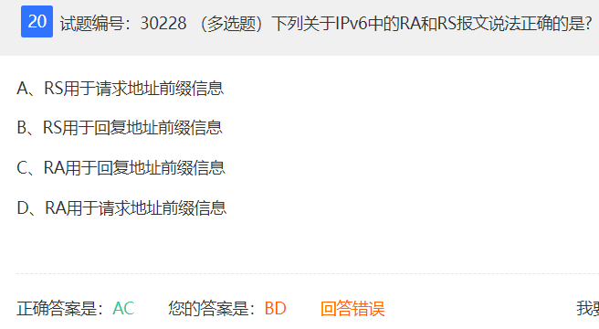

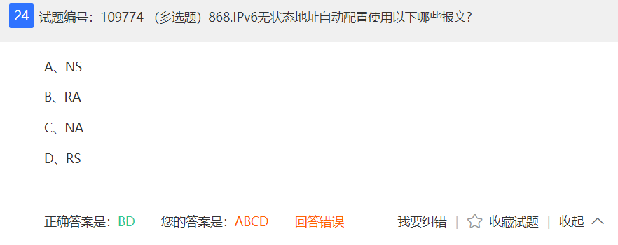

```javascript
NDP 邻居发现协议
    1. RS
        - 路由请求消息
    2. RA
        - 路由通告消息
    3. NS
        - 邻居请求消息
    4. NA
        - 邻居通告消息
    5. 重定向消息
```

## 以下接口 可以接收哪些组播地址的数据?
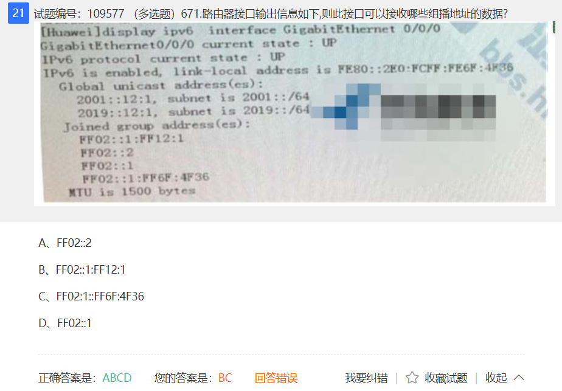

## STA (Station 站点 , WLAN)
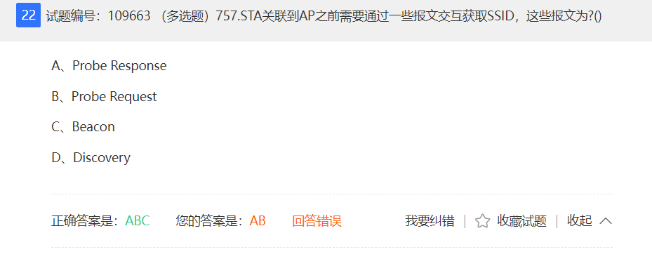
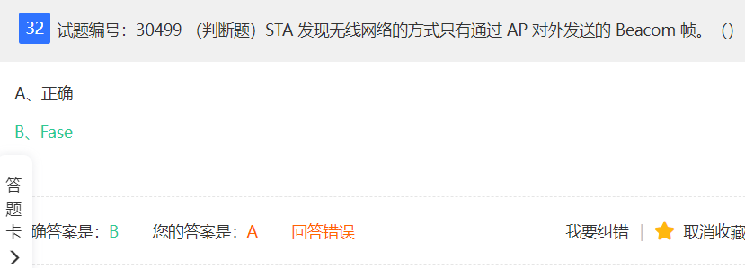
```javascript
STA:
    指的是 WLAN 网络中的终端设备
```
### STA 接入 AP 过程 
---
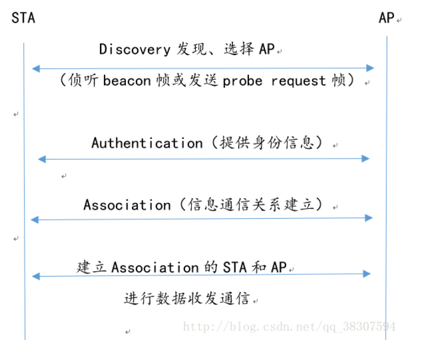


## IEEE 802.11 系列标准技术指标
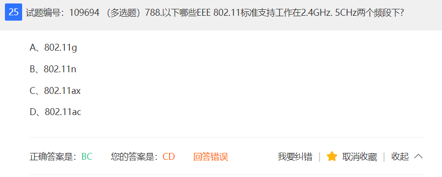

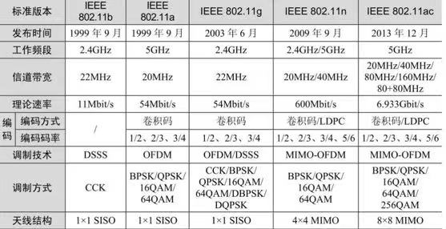

## 广播域 冲突域
- [广播域 和 冲突域](https://www.cnblogs.com/jiayuexuan/p/12525415.html)
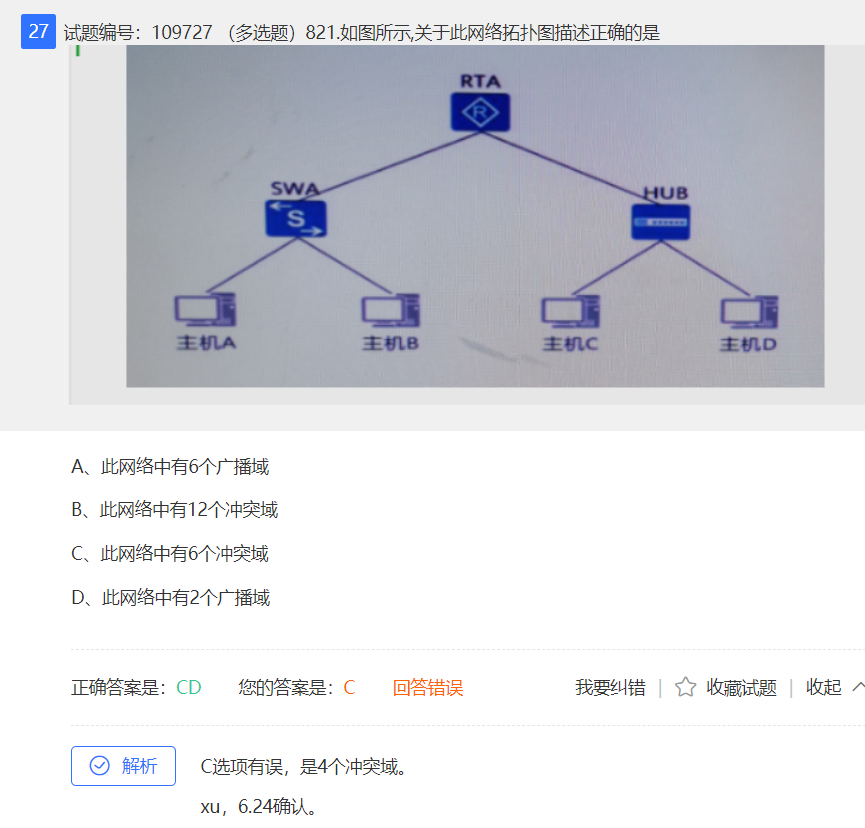
```javascript
1. 广播域
    概念：
        - 接收同样广播消息的节点的集合。
    设备:
        - 第三层设备能划分广播域
        - 即路由器的每一个端口就是一个广播域

2. 冲突域
    概念；
        - 连接在同一个导线上的所有工作站的集合。
        - 或者 同一物理网段上所有节点的集合或以太网上竞争同一带宽的节点集合
    设备:
        - 第二层设备能划分冲突域
        - 即每个交换机接口就是一个冲突域
        - 集线器 Hub 是物理层设备，不能划分冲突域
        - 所以 Hub 下面连接的所有主机组成一个冲突域
```
### 例题
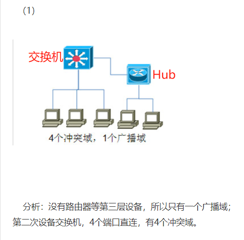
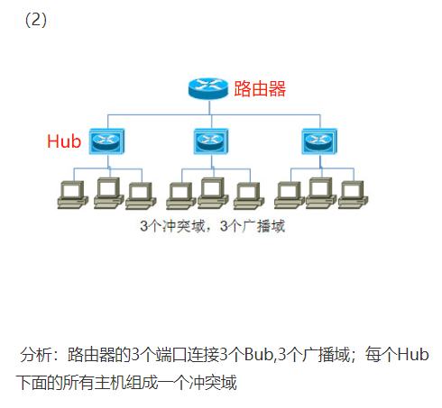
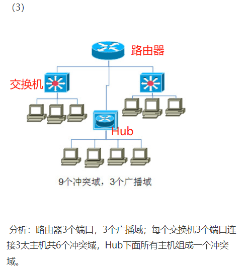
- 关键:
    - 路由器到交换机之间还是存在冲突域，所以到两个交换机分别有两个冲突域

### 总结
```javascript
1. 第二层设备只能隔离冲突域，第三层设备只能隔离广播域
2. 路由器不但可以隔离广播域，也可以隔离冲突与
3. 路由器直连交换机，则路由器到交换机之间也是存在冲突域的
```
---

## SNMP协议（）
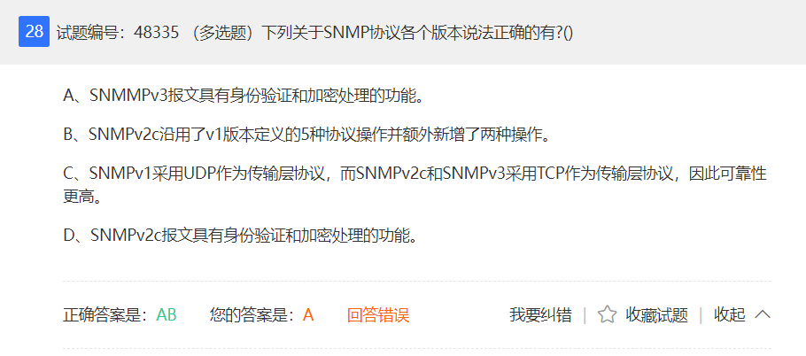
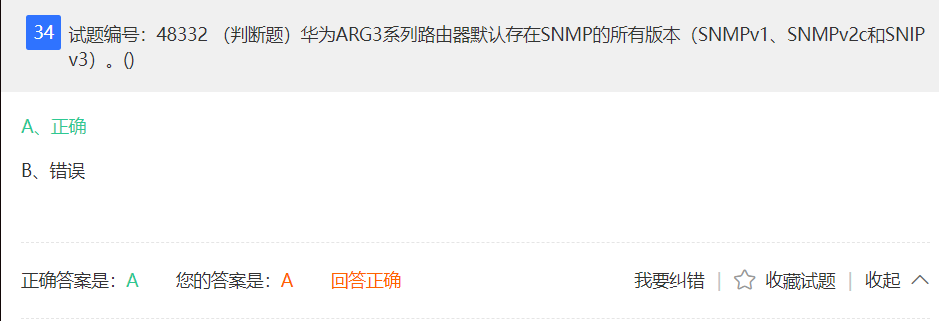

## RSTP

```javascript
RSTP 端口状态重新划分
    1. 不转发用户流量 也 不学习 MAC 地址， 端口状态就是 Discarding
    2. 不转发用户流量 学习 MAC 地址， 端口状态就是 Learning
    3. 即转发用户流量又学习 MAC 地址，端口状态就是 Forwarding
```

## 路由器 数据报转发

```
    路由器在进行数据报转发时每经过一个数据链路层都需要重新封装。
    - 这是因为数据链路层的封装包含了源和目的的MAC地址，
    - 而MAC地址是在每个局域网内唯一的，不同的局域网可能有相同的MAC地址。
    - 因此，当数据报从一个局域网转发到另一个局域网时，需要更新MAC地址，
    - 以便正确地定位到目的主机或网关。
    - 这个过程称为MAC地址解析，通常通过ARP协议来实现。
```

## NAS 


## OSPF


## 路由器聚合端口


## RSTP
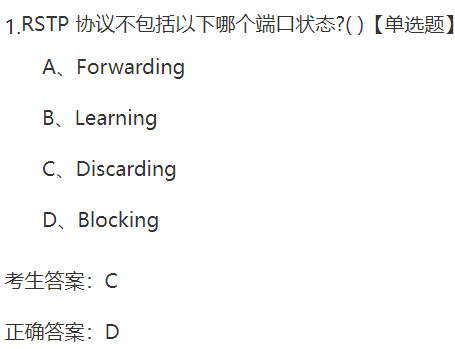
```
RSTP 对 STP 的改进
```

## Access 端口
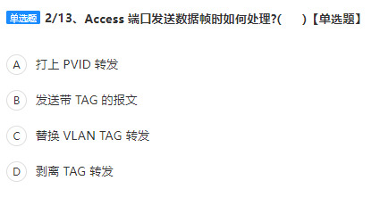
- D
    - 剥离 Tag 转发

## 
- 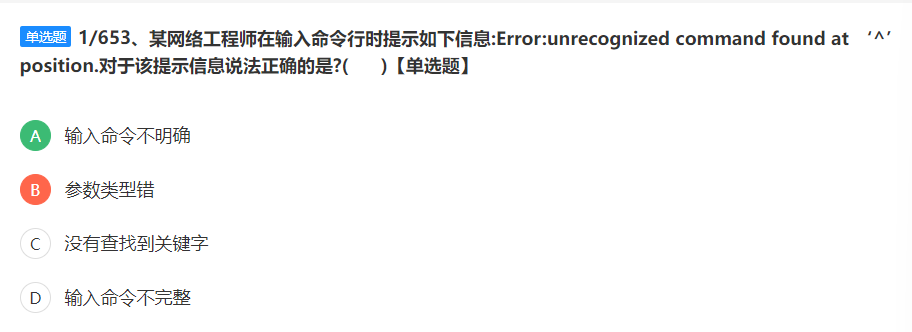

- 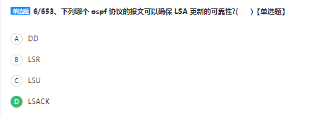
- 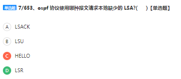
    - LSR
        - Link State Request packet
        - 用于向对方请求所需要的LSA。
        - 设备只有在OSPF邻居双方成功交换DD报文后才会向双方发出LSR报文
    - Hello
        - 周期性发送，用来发现和维护OSPF邻居关系
    - DD（Database Description packet）
        - 描述本地LSDB的摘要信息，用于同步两台设备数据库
    - LSU
        - Link State Request packet
        - 用于向对方发送其所需要的LSA
    - LSAck
        - 用来对收到的LSA进行回复

- 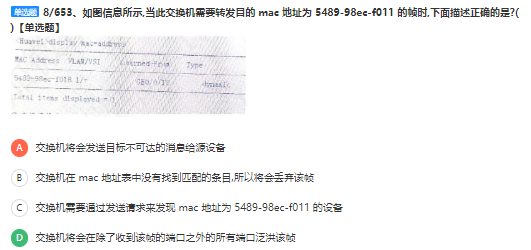
    - 收到 arp 表中没有的mac地址
        - 广播除了该端口外的所有端口泛洪

- 
    - 当邻居设备将TPID值配置为非0x8100时，为了能够识别这样的报文，实现互通
    - 必须在本设备上修改TPID的值，确保和邻居设备的TPID值配置一致

- 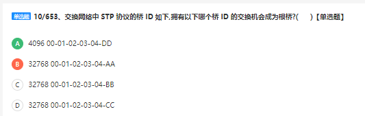
    - BID
        - 桥优先级 + MAC地址
        - 桥优先级
            - 4096倍数
- 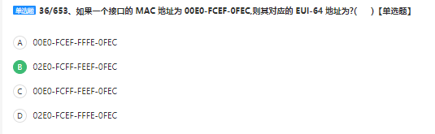
    - 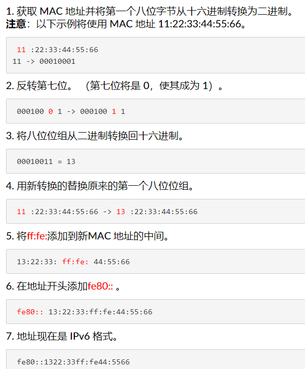

- Mac 地址分类
    - 物理MAC地址：
        - 第 8bit 为 0 的 MAC地址为物理MAC地址，用来唯一标识以太网上的一个终端
        - 全球唯一的硬件地址
    - 广播MAC地址：
        - 全 1 的MAC地址(FFFF-FFFF-FFFF)
        - 用来表示LAN上的所有终端设备
    - 组播MAC地址：
        - 除广播地址外，第 8bit 为 1 的 MAC地址 为 组播MAC地址
        - 用来代表LAN上的一组终端

