# 葵花宝典

## 二层技术<a id="二层技术"></a>
### 一、 STP 与 RSTP 的区别 （后6点可以作为 RSTP 比 STP 收敛快的原因）<a id="section1"></a>
#### 端口角色<a id="端口角色"></a>
```
    STP:
        1. RP
        2. DP 
        3. BP（blocking）
    
    RSTP：
        1. RP
        2. DP
        3. BP
        4. AP
        5. EP
```
#### 端口状态<a id="端口状态"></a>
``` 
    RSTP 端口状态 由 STP 的 5 种状态缩减为 3种。
```
##### 根据端口 是否 转发用户流量 和 学习MAC地址 来划分：

|状态|转发用户流量|学习MAC地址|
|:-:|:-:|:-:|
|Discarding|不转发|不学习|
|Learning|不转发|学习|
|Forwarding|转发|学习|
#### STP 和 RSTP 对比<a id="STP和RSTP对比"></a>
|STP端口状态|RSTP端口状态|端口在拓扑中的角色|
|:-:|:-:|:-:|
|Forwarding|Forwarding|包含 根端口、指定端口|
|Learning|Learning|包括 根端口、指定端口|
|Listening|Discarding|包括 根端口、指定端口|
|Blocking|Discarding|包括 Alternate端口、Backup端口|
|Disabled|Discarding|包括 Disabled端口|
#### Flag 位<a id="Flag位"></a>
##### STP 
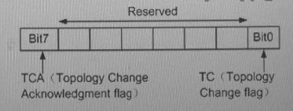
##### RSTP
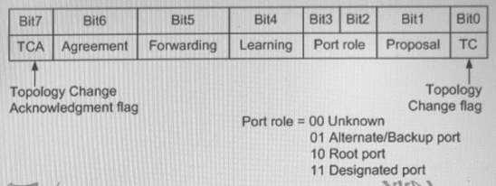
#### 保护机制（RSTP 提供的保护功能）<a id="保护机制"></a>
##### 1. BPDU保护
```
    边缘端口： 
        在交换设备上，通常将直接与用户终端 或 文件服务器等
    非交换机向量的端口配置为 边缘端口

    正常情况下：
        边缘端口不会收到 RST BPDU。

            如果有人伪造 RST BPDU报文恶意攻击交换设备，
        当边缘端口收到 RST BPDU后，交换设备会自动将边缘端口设置为 非边缘端口，并重新进行生成树计算，从而引起网络震荡
```
###### 作用
```
    交换设备启动 BPDU 保护功能后
        
            如果边缘端口收到 RST BPDU，
        边缘端口将被 error-down，
        但是 边缘端口属性 不变，
        同时 通知网关系统
```
##### 2. 根保护
```
    由于维护人员的 错误配置 或 网络中的恶意攻击，网络中合法根桥有可能收到优先级更高的 RST BPDU，使得合法根桥失去根地位，引起网络拓扑结构的错误变动。

    这种不不合法的拓扑变化，会导致原来应该通过高速链路的流量被牵引到低速链路上，造成网络拥塞
```
###### 作用
```
    对于启用 Root 保护功能的指定端口，其端口角色只能保持为指定端口。

    一旦启用 Root 保护功能的指定端口收到优先级更高的 RST BPDU时候，端口状态进入 Discarding 状态，不再转发报文。

    经过 一段时间（2倍 Forwarding Delay），如果端口一直没有再收到优先级较高 RST BPDU，端口会自动恢复为 Forwarding状态

    说明：
        Root 保护功能只能再指定端口上生效
```
###### 拓扑变化定义
```
    一个非边缘端口状态迁移到 forwarding
```
##### 3. 环路保护
```
    在运行该 RSTP 协议的网络中，根端口 和 其他阻塞端口状态是依靠不断接收来自上游设备的 RST BPDU 维持。

    当由于 链路拥塞 或者 单向链路故障导致这些端口收不到来自上游交换设备的 RST BPDU 时，
        1. 此时交换设备会重新选择 根端口。
        2. 原先 根端口 会变成 指定端口
        3. 原先 阻塞端口 会迁移到 转发状态
    从而造成交换网络中可能产生环路
```
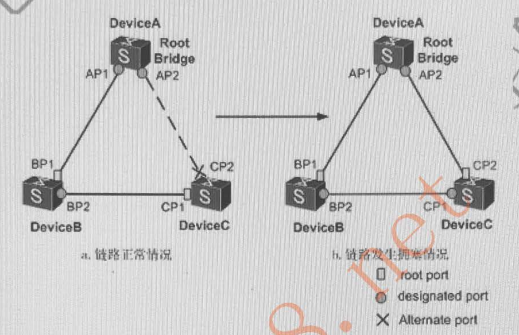
```
    如上图：
        当 BP2-CP1 之间的链路发生拥塞（或者是 单向链路故障），
        Device C 由于 根端口CP1 在超时时间内收不到来自上游设备的 BPDU报文，
            1. Alternate 端口 CP2 放开转变为 根端口，
            2. 根端口CP1 转变 CP1 转变为指定端口，
        从而形成环路
```
###### 原理
```
    在启动了环路保护后，如果 根端口 或 Alternate 端口长时间收不到来自上游设备的 BPDU 报文时， 则
        1. 向网管发出通知（此时根端口进入 Discarding状态，角色切换为 指定端口）
        2. Alternate 端口一直保持在阻塞状态（角色也会切换为指定端口），不转发报文
    从而不会在网络中形成环路。

    直到链路不在拥塞 或 单向链路故障恢复，端口重新收到 BPDU 报文进行协商，并恢复到链路拥塞 或 单向链路故障前的角色和状态
```
###### 说明：
```
        环路保护功能 只能在根端口 或 Alternate端口上生效
```
##### 4. 防 TC-BPDU 攻击
```
    交换设备在接收到 TC-BPDU 报文后，会执行 MAC 地址表项 和 ARP表项 的删除操作。

    如果有人伪造 TC-BPDU 报文恶意攻击交换设备时，交换设备短时间内会收到很多 TC-BPDU 报文，频繁的删除操作会给设备造成很大的负担，给网络的稳定性带来很大的隐患。
```
###### 作用
```
    启用防 TC-BPDU 报文攻击功能后：
        单位时间内，交换设备处理 TC-BPDU 报文数量可配置
        1. 单位时间内，交换设备收到的 TC-BPDU 报文数量大于配置的阙值，
            那么设备只会处理阙值的 TC-BPDU 报文，
            定时器到期后设备只对其统一处理一次。
            （这样可以避免频繁的删除 MAC 地址表项 和 ARP表项，从而达到保护设备的目的）
```
#### RSTP EP 端口
1. 接入设备进入 Forwarding 状态，避免 30s 的等待延迟，直接转发
2. 边缘端口进入 Forwarding 状态时不产生 TC
3. 生成树拓扑变化时，进行 P/A 协商 是不会被阻塞
4. 收到 TC 不删除 MAC 表项
5. 不向边缘端口发送 TC 报文
6. 收到 BDPU 报文变为普通端口
#### 端口快速切换机制
```
    RSTP 中， RP 端口 down 后，AP 会立刻切换为 RP

        如果有多个 AP 会选择 PID 小的成为 RP

    EP端口
        变为 转发状态没有两个 forwarding delay （ 2*15s = 30s ）
```
#### P/A 机制
```
    新链路连接成功后，P\A机制协商过程
```
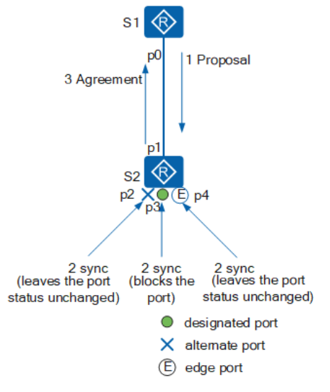
```
新链路连接成功后，P/A机制协商过程如下：
    1. p0 和 p1 两个端口马上都先成为 指定端口，发送RST BPDU。
    2. S2 的 p1口 收到更优的RST BPDU，
        - 马上意识到自己将成为 根端口，而不是指定端口，
        - 停止发送 RST BPDU。
    3. S1 的 p0 进入Discarding状态，
        - 于是发送的 RST BPDU 中把 proposal 置1。
    4. S2 收到 根桥 发送来的携带 proposal 的RST BPDU，
        - 开始将自己的所有端口 进入 sync 变量置位。
    5. p2 已经阻塞，状态不变；
        - p4 是边缘端口，不参与运算；
        - 所以只需要 阻塞非边缘指定端口 p3。
    6. 各端口的 synced变量置位后，
        - p2、p3 进入Discarding状态，
        - p1 进入Forwarding状态 并向 S1返回Agreement位置位的 回应RST BPDU。
    7. 当 S1 判断出这是对刚刚发出的Proposal的回应，
        - 于是端口 p0 马上进入Forwarding状态。
```
```
下游设备继续执行P/A协商过程。

    - 事实上对于STP，指定端口的选择可以很快完成，
    - 主要的速度瓶颈在于：
        - 为了避免环路，必须等待足够长的时间，使全网的端口状态全部确定，
        - 也就是说必须要等待至少一个Forward Delay所有端口才能进行转发。
        - 而 RSTP的主要目的: 
            - 就是消除这个瓶颈，通过阻塞自己的非根端口来保证不会出现环路。
            - 而使用P/A机制加快了上游端口转到Forwarding状态的速度
```
##### 注意
```
    P/A机制要求
        1. 两台交换设备之间链路必须是点对点的全双工模式。
        2. 一旦P/A协商不成功，指定端口的选择就需要等待两个Forward Delay，协商过程与STP一样。

    备注：
        - 交换机没有自动协商点对点的能力，
        - 如果端口状态全双工的，那么交换机就工作在点对点模式
        - 全双工模式是物理层使用电子脉冲进行协商
```
##### 端口状态
```
proposing（提议请求）：
    当一个端口处于Discarding状态或Learning状态时，
        - proposing变量置位，
        - 并向下游桥设备传递 Flags 字段proposal标志位置1 的 RST BPDU，
        - 请求快速切换到Forwarding状态。

proposed（提议采纳）：
    - 当对端的根端口收到以上 Proposal标志位置1 的RST BPDU时，
    - proposed变量置位。
    - 该变量指示本网段上的指定端口希望尽快进入Forwarding状态。

sync（同步请求）：
    - 当根端口的proposed 变量置位后
    - 会依次为本桥上的其他端口使sync变量置位，
    - 使所有非边缘端口都进入 Discarding状态，准备重新同步。

synced（同步完成）：
    - 当端口进入到 Discarding 状态后 
        - 会将自己的 synced 变量置位，
        - 包括本桥上的
            - 其他所有Altermate端口、
            - Backup 端口
            - 和边缘端口，实施同步操作。

    - 此时，根端口 监视 其他端口的 synced变量置位情况，
        - 当所有其他端口的synced变量 全被置位，
        - 则 根端口最后也会将自己的synced变量置位，
            - 表示本桥上 已正式完成同步操作；
        - 然后，该根端口转变为forwarding状态，
        - 向上游设备传回Agreement标志位置1的RST BPDU
        - （表示此BPDU为Agreement RST BPDU报文）。

agreed（提议确认）：
    - 当原来想要进入转发状态的上游设备 指定端口 收到对端根端口发来的一一个Agreement RST BPDU时，
        - 则此指定端口的agreed变量被置位。
    - Agreed变量一旦被置位，则该指定端口马上转入Forwarding状态。
```        
[参考](https://blog.csdn.net/weixin_42106049/article/details/122849192)
#### TC 机制
##### STP
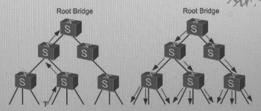
```
1. T点接口发生变更后，下游设备会不间断地向上游设备发送TCN BPDU报文
2. 上游设备收到下游设备发来的TCN BPDU 报文后，
    - 只有指定端口处理 TCN BPDU报文。
    - 其他端口也有可能收到 TCN BPDU 报文，但不会处理
3. 上游设备会把配置 BPDU报文中的 Flags 的TC 和 TCA 位置为 1，
    - 然后发送给下游设备，告知下游设备停止发送 TCN BPDU报文
4. 上游设备复制一份 TCN BPDU 报文，向根桥方向发送
5. 重复步骤1，2，3，4，直到根桥收到 TCN BPDU报文
6. 根桥把配置 BPDU 报文中的 Flags 的 TC 位置 1 后发送
    - 通知下游设备直接 删除桥MAC地址表项

说明：
    - TCN BPDU 报文主要用来向 上游设备乃至根桥 通知拓扑变化
    - 置位的TCA 标记的 配置BPDU报文 
        - 主要是上游设备用来告知下游设备已经知道拓扑变化，
        - 通知下游设备停止发送TCN BPDU 报文
    - 置位的TC标记的 配置BPDU报文主要是上游设备用来告知下游设备拓扑发生变化，
        - 请下游设备直接删除桥MAC地址表项，从而达到快速收敛目的
```

##### RSTP 拓扑变化处理
```
在 RSTP中检测拓扑是否变化只有一个标准:
    - 一个非边缘端口迁移到 Forwarding 状态
```
```
一旦检测到拓扑发生变化，将进行以下处理
1. 为本交换设备的所有非边缘指定端口启动一个 TC While Timer，
    - 该计时器值是 Hello Time 的两倍
    - 在这个时间内，清空状态从 Forwarding 到 Discarding 的端口上学习到的MAC地址
    - 同时由这些端口向外发送 RST BPDU，其中 TC 置位
    - 一旦 TC While Timer 超时，则停止发送 RST BPDU报文
2. 其他交换设备接收到 RST BPDU后，清空所有端口学习到的 MAC地址，
    - 除了收到RST BPDU的端口，
    - 然后也为自己所有非边缘端口 和 根端口启动 TC While Timer，
    - 重复上述过程
    - 如此，网络中就会产生RST BPDU 的泛洪
```
#### 收到次级BPDU会立即回复优质BPDU
```
当一个端口收到上游的指定端口发来的 RST BPDU 报文时，该端口会将自身存储的 RST BPDU 报文 与 收到的RST BPDU 进行比较
    - 如果自身优于收到，
        - 直接丢弃
        - 回应自身存储的 RST BPDU
由此，RSTP 处理次优 RST BPDU 不在依赖任何定时器超时解决
    - 加快了拓扑收敛
```
|参数|缺省值|取值范围|
|:-:|:-:|:-:|:-:|
|Hello time|200|100~1000|
|Max Age|2000|600~4000|
|Forwarding Delay|1500|400~3000|
#### Timer
```
如果一个端口连续 3 个Hello Time 时间内
    - 没有收到上游设备发送过来的配置BPDU
    - 则认为邻居之间协商失败

STP 需要等待一个 MAX Age。
默认情况，华为的时间因子是 3 ，
    - 所以超时时间是 18s = 2*3*3
    - 时间因子取值为 1 ~ 10
```

### 二、 STP 与 RSTP 的基础
#### 1. 报文格式及类型
|域|说明|
|:-:|:-:|
|Protocol Identifier | 总是0|
|Protocol Version Identifier | 总是0|
|BPDU Type | 当前BPDU类型：0x00： 配置BPDU; 0x80: TCN BPDU|
|Flags|网络拓扑变化标志|
|Root Identifier|当前根桥的BID|
|Root Path Cost|本端口累计到根桥的开销|
|bridge Identifier|本交换设备的BID|
|Port Identifier|发送该BPDU的端口ID|
|Message Age|该BPDU 的消息年龄|
|Max Age|消息老化年龄|
|Hello Time|发送两个相邻BPDU的时间间隔|
|Forward Delay|控制Listening 和 Learning 状态的持续时间|

#### 2. STP 树的构建过程
1. 根据每台设备的BID来选举Root，Root 的 BID 即RID
2. 到根桥的 cost
3. 发送者的 BID（掌握BID格式）
4. 发送者的 PID（掌握PID格式）
5. 自己的 PID

### 三、 MSTP
#### 1. 为什么要使用 MSTP
```
主要作用是
    - 用来负载
    - 通过实例进行 vlan 内流量的负载
```
```
生成树协议    特点                
STP         - 形成一棵无环路的树，解决广播风暴并实现冗余备份
            - 收敛速度较慢

        应用场景
            - 无需区分用户 或 业务流量，所有vlan 共享一棵生成树

RSTP        - 形成一棵无环路的树，解决广播风暴并实现冗余备份
            - 收敛速度快
        
        应用场景
            - 无需区分用户 或 业务流量，所有vlan 共享一棵生成树

MSTP    
            - 形成多棵无环路的树，解决广播风暴并实现冗余备份
            - 收敛速度快
            - 多棵生成树在vlan间实现负载均衡，不同vlan的流量按照不同路径转发
        
        应用场景
            - 需要区分用户 和 业务流量，并实现负载分担
            - 不同的vlan通过不同的生成树转发流量，每棵生成树之间相互独立
```
#### 2. 同一个域的条件
1. regoin name
2. region level
3. 实例中的 vlan映射

#### 3. CST
```
公共生成树，在多域时域间的树
```

#### 4. IST
```
内部生成树，在每个域内除了被阻塞的链路所构成的树
```

#### 5. CIST
```
CIST 就是 CST + IST 的树
```

#### 6. 总根、域根
```
全网中 BID 最小的为 总根

其他域中，离根最近的交换机为 域根
```

### 四、 Smark Link
```
作用：
    华为私有，用于解决二层环路

原理：
    一台交换机的两个端口启用一个 smark link组
        - 一个为 master 端口
        - 一个为 slave 端口
        - 两个端口同时只有一个端口在转发，
            - 一般只有master 端口在转发，
            - slave 端口保持阻塞
            - 当master 端口down
            - slave 端口变为 转发状态
```

### 五、 交换机端口特性
#### 1. Access
```
Access 接口添加 或 剥除vlan标签的处理过程
```
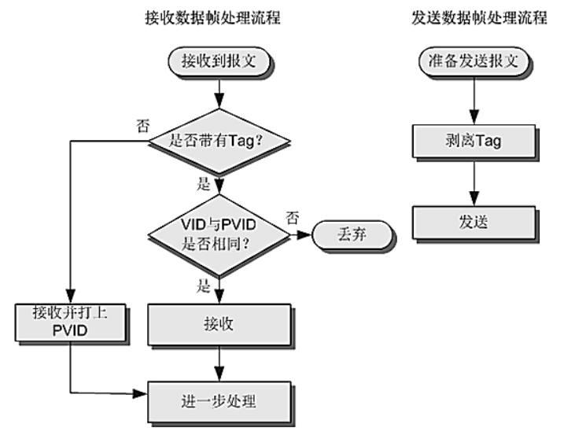

#### 2. trunk
```
Trunk 接口添加 或 剥除 vlan标签的处理过程
```
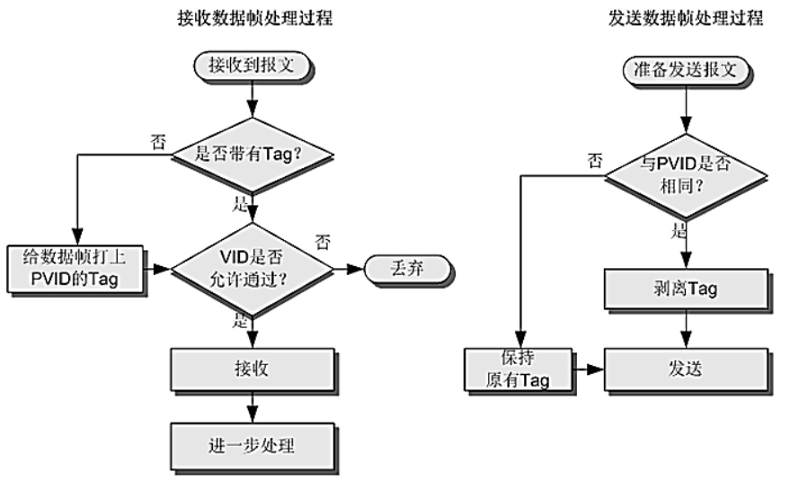

#### 3. hybrid
```
Hybrid 接口添加 或 剥除 vlan标签的处理过程
```
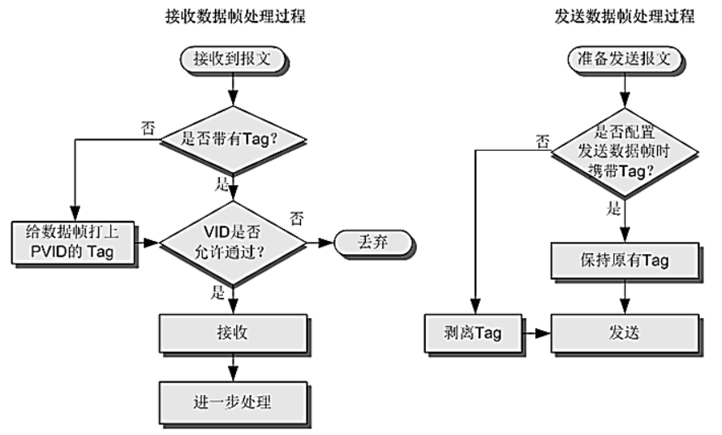

#### 4. 什么时候必须使用 Hybrid？
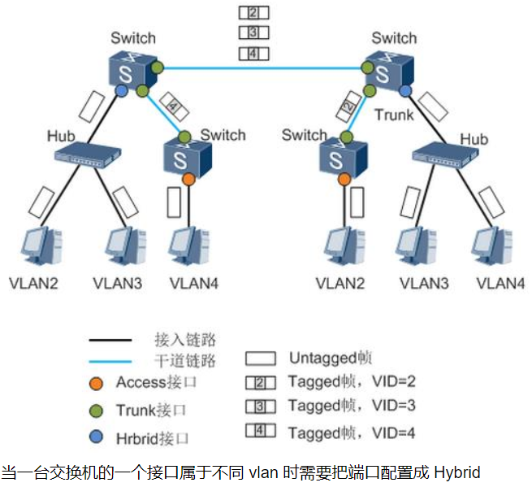

### 六、 QinQ （类似MPLS VPN）
```
1. 作用：使用私网 vlan 透传公网
    A. 扩展 VLAN，对用户进行隔离 和 标识不再受到限制
    B. QinQ 内外层标签可以代表不同信息，
        - 如 内层代表用户，外层代表业务，更有利于业务部署
    C. QinQ 封装、终结的方式很丰富，帮助运营商实现业务精细化运营

2. 原理
    打上双层标签，使私网的vlan透传到公网，外层放的是公网标签
        - 内层放私网标签，在公网上剥离公网标签，两边设备就可以跨公网互访了
```

### 七、 Mux vlan
```
作用
    实现vlan间的隔离
```


#### 配置命令
```
1. 创建VLAN并进入VLAN视图。
    vlan batch 2 3 4
    vlan 2
2. 配置该VLAN为 主VLAN。
    mux-vlan
3. 配置互通型从VLAN。
    subordinate group vlan 3
4. 配置隔离型从VLAN。
    subordinate separate vlan 4
5. 使能接口的MUX VLAN功能。有多个接口时请重复执行如下步骤。
    interface g0/0/0
    port mux-vlan enable vlan 3

检查配置结果
执行命令display mux-vlan，查看所有MUX VLAN相关配置信息。
```

### 八、 Super Vlan（聚合Vlan）
```
VLAN Aggregation技术（也称为Super VLAN，即VLAN聚合）
    - 就是在一个物理网络内，用多个VLAN隔离广播域，
    - 使不同的VLAN属于同一个子网

1. 作用
    节省 ip 地址
    (这样，Sub-VLAN间共用同一个三层接口，
        - 既减少了一部分子网号、子网缺省网关地址和子网定向广播地址的消耗，
        - 又实现了不同广播域使用同一子网网段地址的目的，
            - 消除了子网差异，
            - 增加了编址的灵活性，
            - 减少了闲置地址浪费。)

2. 原理
    启用 super vlan 后，不同的vlan可以共用一个 网关ip
    - 正常的vlan，
    - 一个 vlan 就需要一个网关ip

Super-VLAN：
    - 只建立三层接口，与该子网对应，
    - 不包含物理端口。
Sub-VLAN：
    - 只包含物理端口，
    - 用于隔离广播域的VLAN，
    - 不能建立三层VLANIF接口。
    - 它与外部的三层交换是靠Super-VLAN的三层接口来实现的。

- 一个Super-VLAN可以包含一个或多个保持着不同广播域的Sub-VLAN。
    - Sub-VLAN不再占用一个独立的子网网段。
    - 在同一个Super-VLAN中，无论主机属于哪一个Sub-VLAN，
        - 它的IP地址都在Super-VLAN对应的子网网段内。

3. Super vlan 与 Mux vlan 的区别
？？？
```

#### Sub-Vlan 与外部网络的二层通信组网图
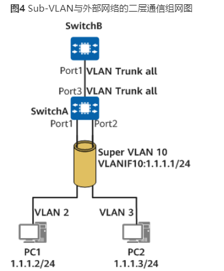
```
从PC1侧Port1进入设备SwitchA的帧会被打上VLAN2的Tag，
    - 在设备SwitchA中这个Tag不会因为VLAN2是VLAN10的Sub-VLAN而变为VLAN10的Tag。
    - 该数据帧从Trunk类型的接口Port3出去时，依然是携带VLAN2的Tag。
    - 也就是说，
    - 设备SwitchA本身不会发出VLAN10的报文。
    - 就算其他设备有VLAN10的报文发送到该设备上，
    - 这些报文也会因为设备SwitchA上没有VLAN10对应物理端口而被丢弃。

Super-VLAN中是不存在物理端口的，这种限制是强制的
    - 如果先配置了Super-VLAN，
    - 再配置Trunk接口时，
    - Trunk的VLAN allowed表项里就自动滤除了Super VLAN。

如图所示，
    - 虽然SwitchA的Port3允许所有的VLAN通过，
    - 但是也 不会有作为Super-VLAN的VLAN10的报文
    - 从该接口进出。

如果先配置了Trunk端口，
    - 并允许所有VLAN通过，
    - 则在此设备上将无法配置Super VLAN。
    - 本质原因是
        - 有物理端口的VLAN都不能被配置为Super VLAN。

对于设备SwitchA而言，
    - 有效的VLAN只有VLAN2和VLAN3，
    - 所有的数据帧都在这两个VLAN中转发。
```

#### Sub-Vlan 与外部网络的三层通信组网图
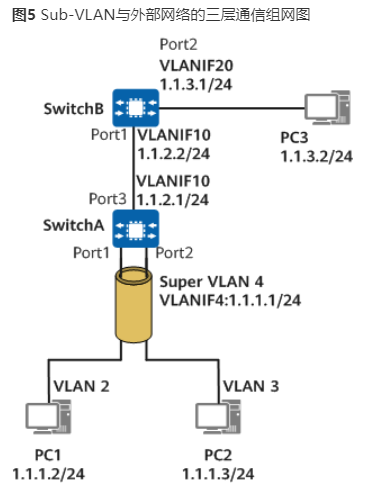
```
如图所示，
SwitchA上配置了
    - Super-VLAN 4，
    - Sub-VLAN 2和Sub-VLAN 3，
    - 并配置一个普通的VLAN10；
SwitchB上配置两个普通的VLAN，VLAN 10和VLAN 20。

假设Super-VLAN 4中的Sub-VLAN 2下的PC1想访问与SwitchB相连的主机PC3，通信过程如下：（假设SwitchA上已经配置了去往1.1.3.0/24网段的路由，SwitchB上已配置了去往1.1.1.0/24网段的路由）
PC1将PC3的IP地址（1.1.3.2）和自己所在网段1.1.1.0/24进行比较，发现PC3和自己不在同一个子网。
PC1发送ARP请求给自己的网关，请求网关的MAC地址。
SwitchA收到该ARP请求后，查找Sub-VLAN和Super-VLAN的对应关系，从Sub-VLAN 2发送ARP应答给PC1。ARP应答报文中的源MAC地址为Super-VLAN 4对应的VLANIF4的MAC地址。
PC1学习到网关的MAC地址。
PC1向网关发送目的MAC为Super-VLAN 4对应的VLANIF4的MAC、目的IP为1.1.3.2的报文。
SwitchA收到该报文后进行三层转发，下一跳地址为1.1.2.2，出接口为VLANIF10，把报文发送给SwitchB。
SwitchB收到该报文后进行三层转发，通过直连出接口VLANIF20，把报文发送给PC3。
PC3的回应报文，在SwitchB上进行三层转发到达SwitchA。
SwitchA收到该报文后进行三层转发，通过Super-VLAN，把报文发送给PC1。
```

### 九、 ARP （需要知道报文的封装）
#### 正向ARP
```
IP地址解析为 MAC 地址
```

#### 反向ARP
```
把 MAC地址解析为 IP地址
```

#### 代理ARP
```
两个互访的节点在同一个网段，但是广播的ARP报文
    - 无法到达时，需要使用代理ARP
```
##### A. vlan间代理： super vlan
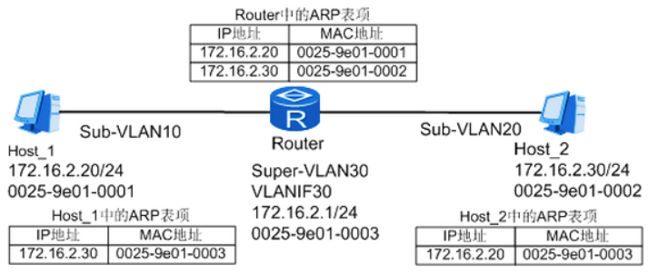

##### B. vlan内代理
```
同处于一个广播域，但是配置 二层/三层隔离，
    - 双方都需要通过网关进行互访
    - 双方封装的目的MAC 也是 网关的MAC地址
```
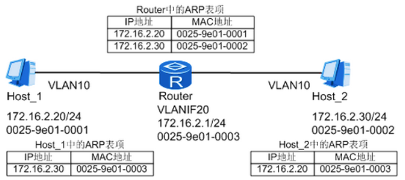

##### C. 路由式代理
```
PC1 想要访问PC2，
    - PC1 首先会判断PC2 的 IP地址是否和自己在同一个广播域
    - 如果相同
        - PC1 会直接向路由器发送ARP请求
    - 当路由器开启了ARP 代理的功能后，
        - 当收到PC 请求的ARP后，会查自己的路由表中的路由是否可达
        - 如果可达，路由器会将自己的MAC地址
        - 回复给 发送ARP请求的PC
        - 如果不在同一个广播域，则无法通信
```
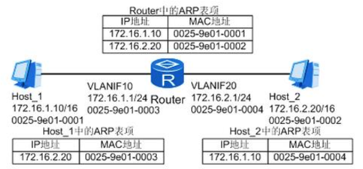

#### 免费ARP（DAD，vrrp主备切换，通知一个新的MAC地址）
- 免费 ARP请求
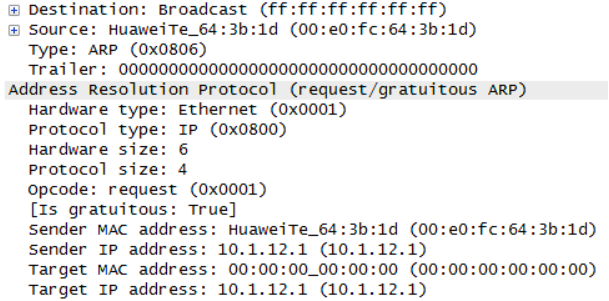
- 免费 ARP响应
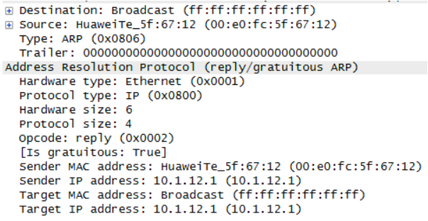

#### 如何使用代理ARP来实现VRRP功能？

#### ARP 攻击
##### 1. ARP 泛洪攻击（DOS拒绝服务攻击，Denial of Service）
```
有两种场景
1. 处理ARP报文 和 维护ARP表项都需要消耗系统资源，
    - 同时为了满足ARP表项查询效率的要求，
    - 一般设备都会对ARP表项规模有规格限制
    - 攻击者利用这一点，通过伪造大量源IP地址变化的ARP报文
    - 使得设备 ARP 表资源被无效ARP给耗尽，
    - 合法用户的ARP报文不能继续生成ARP条目，导致正常通信中断

2. 本网段主机 或者 进行跨网段扫描时候，会向设备发送大量目标IP地址不能解析的IP报文，
    - 导致设备触发大量 ARP Miss 消息
    - 生成并下发大量 临时ARP表项，并广播大量ARP请求报文
    - 以对目标IP地址进行解析，从而造成 CPU 负荷过重
```
###### 避免
```
为了避免上述危害，可以在网关设备上部署
    - 防ARP泛洪攻击功能，
    - 包括 ARP报文限速功能、ARP Miss 消息限速功能、ARP 表项严格学习功能 以及 ARP表项限制功能

1. 部署ARP报文限制功能后，
    - Gateway 会对收到的ARP报文进行数量统计，
    - 如果在一定时间内，ARP报文的数量超出了配置的阙值（ARP报文限速值）
    - 则丢弃超出阙值部分的ARP报文，
    - 这样可以防止设备因处理大量ARP报文造成CPU负荷过重

2. 部署ARP Miss消息限速功能后，
    - Gateway 会对 ARP Miss 消息进行数量统计
    - 如果在一定时间内，ARP Miss消息超出了配置的阙值（ARP Miss 消息限速值）
    - 则超出部分的 ARP Miss 消息将被忽略
    - 且Gateway 会丢弃触发 ARP Miss 消息的 IP报文
    - 这样可以 防止Gateway 因处理大量目标IP地址不能解析的IP报文造成CPU负荷过重

3. 部署ARP表项严格学习功能后，
    - Gateway 仅仅学习自己发送的ARP请求报文的应答报文
    - 并不学习其他设备主动向 Gateway 发送的ARP报文，
    - 这样可以防止 Gateway 因学习大量 ARP报文
    - 而导致ARP表项资源被无效的ARP条目耗尽

4. 部署 ARP表项限制功能后，
    - Gateway 会对各个接口学习动态ARP表项的数目进行限制
    - 当指定端口下的动态ARP表项达到允许学习的最大数目后
    - 将不允许新增动态ARP表项
    - 这样可以防止一个接口所接入的某个用户主机发起ARP攻击
    - 导致整个设备的ARP表资源都被耗尽
```

##### 2. ARP欺骗攻击
```
指攻击者通过发送伪造的ARP报文，
    - 恶意修改设备 或 网络内其他用户主机的ARP表项，
    - 造成用户 或 网络报文通信异常
```
```
为了避免上述危害，可以在网关设备部署防ARP欺骗攻击功能
    - 包括ARP表项固化功能
    - ARP表项严格学习功能
    - 发送免费ARP报文等
如果局域网中的用户大多是DHCP用户，
    - 还可以在接入设备上部署动态ARP检测功能

1. 部署ARP表项固化功能后：
    - Gateway 在第一次学习到ARP之后，
    - 不再允许用户更新此ARP表项 
    - 或 只能更新此ARP表项的部分信息
    - 或 通过发送单播ARP报文的方式对更新ARP条目的报文进行合法性确认
    - 这样可以防止攻击者伪造ARP报文修改网关上其他用户的ARP表项

2. 部署ARP表项严格学习功能后，
    - 
```
