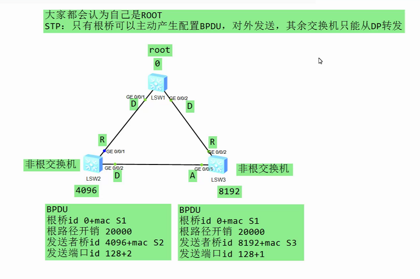
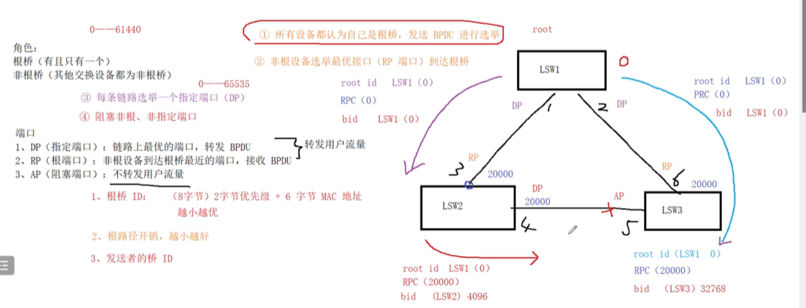
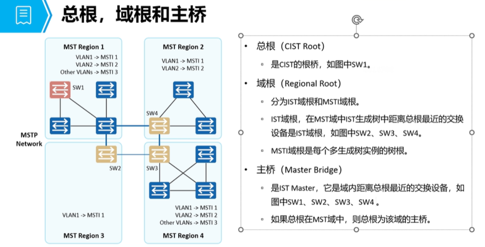
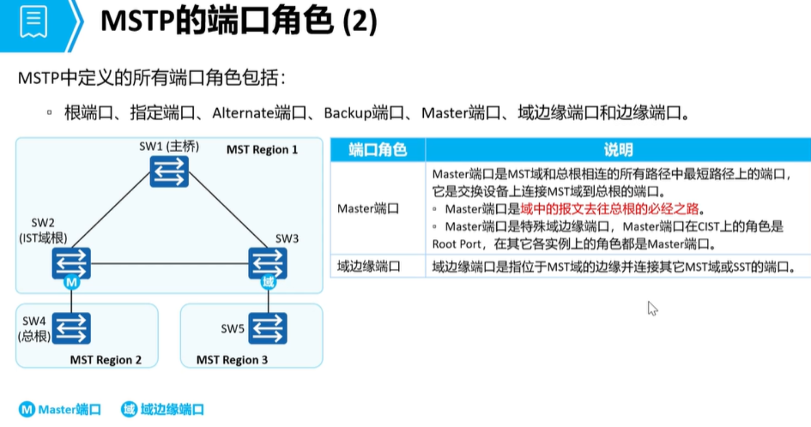
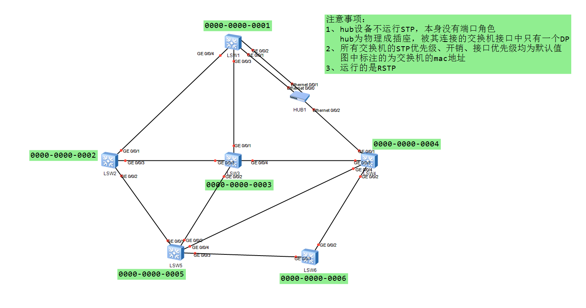

# STP 生成树

## 生成树类型
```
STP： 
    使用定时器收敛
    （hello time = 2s）
    （max age = 20s）
    （forwading delay = 15s）

STP 收敛速度慢，当网络不稳定时候会导致用户的网络体验下降
STP 安全性较差（无法防止临时环路 和 根桥被抢占等攻击行为）
```

### 作用：
- 防环
### 版本：
  - STP——802.1d——慢收敛（30~50s）
  - RSTP——802.1w——快收敛（秒级）
  - MSTP——802.1s——计算多颗生成树

### 工作过程：
  1. 在整个交换网路中选出一台交换机为根桥（ROOT）；

  2. 每台非根交换机上，各选举出一个根端口（RP）；
      - 用于非根交换机通过最短路径访问根桥；
      - 用于接收最优的BPDU；

  3. 每段二层链路上各选举出一个指定端口（DP）；
      - 用于发送最优的BPDU;
      - 一般根桥的所有端口均为DP，交换机连接PC/路由器/防火墙等不支持STP的设备接口均为DP；  

  4. 剩余的端口为AP（非根非指定端口），直接堵塞，用于防环；
       
### 选举规则：
  - 使用BPDU选举；
  - 顺序比较、数值越小越优；
   1. 根桥id
```
*标识根桥的桥id；
       
桥id：stp优先级+mac地址（先比较优先级，再比较mac地址）
       
STP优先级：默认为32768，可调，可调步长4096；
       
选举完根桥后，全网的BPDU的根桥id字段均一致；
       
**简单理解*：
    比较每台交换机的优先级以及mac地址，最优的为根桥；
```

  2. 根路径开销
```
标识BPDU发送者到根桥的最短路径开销；
       
如果选举RP，则直接比较候选端口到根桥的最短路径开销，最优的为RP；
       
如果选举DP，则直接比较报文数值；
```
  3. 发送者桥id
```       
标识BPDU发送者的桥id；
```

  4. 发送端口id
```       
标识BPDU的发送端口的优先级（默认128，调整步长16）+ 端口id
       
先比较端口优先级、再比较端口id；
```





## 端口角色
```
STP：DP、RP、AP（非根非指定端口）
       所有的堵塞的端口均为AP；

RSTP：DP、RP、AP、BP
       AP（替代端口）：因为收到其他交换机发送的更优的BPDU而堵塞；
          作为RP的备份，当RP故障，如果本设备存在AP，则AP马上切换为RP，并且进入forwarding状态，无需等待转发延时；

       BP（备份端口）：因为收到本交换机发送的更优的BPDU而堵塞；
          作为DP的备份，当DP故障，如果本设备存在BP，则BP切换为DP
```

## 端口状态
```
    标准：
     STP：
        disable、
        blocking、
        listening、
        learning、
        forwarding；

     RSTP：
        - discarding (包括了 blocking，listening)、
        - learning、
        - forwarding；

    华为：
     STP、RSTP：
        - discarding、
        - learning、
        - forwarding；

    初始：
        默认是 discarding
```

## RSTP（快速生成树协议）对STP的改进：
### 快收敛机制
#### 1. BPDU 的发送模式
```
  相比于 STP 、RSTP 每个接口都会保留最优 BPDU （在老化时间内，每隔 2s 自主发送 BPDU）

  补充：
       STP 非根桥设备需要等待根桥发送 BPDU，且在接收后进行转发
```
```
    （1）分类
         STP：
                - 配置BPDU、
                - TCN BPDU（拓扑改变BPDU）；
         RSTP：
                - RST BPDU（作用类似于配置BPDU）；

    （2）发送机制
         STP：
              - 只有根桥可以 2s 从DP口发送一次，
              - 其余交换机只有收到来自根桥的BPDU才能从DP口转发；
         RSTP：
              - 非根交换机会保存根桥的BPDU，自主启用计时器，每2s从DP口向外发送一次；
 
    （3）老化时间
         STP：20s
         RSTP：18s

    （4）flags位
         STP：
               TCA（拓扑改变请求）、TC（拓扑改变）

         RSTP：
               TCA、TC
            改变：
            新增：P、A位（实现PA协商）
              2bits端口 角色位（用于标识BPDU发送端口的角色）
              
              2bits端口 状态位（用于标识BPDU发送端口的状态）

    （5）对次优BPDU的处理行为
          STP：
                - AP/RP收到次优BPDU，直接丢弃；（STP中只有DP可以发送配置BPDU）
          RSTP：
                - AP/RP收到次优BPDU后，会将本交换机收到的 更优的BPDU 发送出去，
                - 进行回应，无需等待 20s的老化时间 实现收敛；
```

#### 2. P/A协商 （只在 DP和RP 端口之间协商）
```
作用：
     加快 DP — RP 之间链路的收敛；
```
```
机制：
    （1）双方先交互普通的 RST BPDU（P=0 A=0），用于确认端口角色；
    
    （2）DP端 先发送 P=1 的RST BPDU，RP端 收到后会 堵塞 其他的非边缘端口，并且进入forwarding状态（同步），并且 回应 A=1 的 RST BPDU；
    
    （3）DP端 收到 A=1 的RST BPDU后，也进入forwarding状态；
```

#### 3. AP 预备端口
```
   AP端口是 RP 的预备端口，一旦 RP 端口失效，本交换设备最优的 AP 端口会切换为 RP，且状态转换为 forwarding (减少收敛时间)
```

#### 4. 边缘端口（EP）
```
     定义：
        特殊的 DP口；

     应用：
        配置在连接 PC、路由器等 不支持STP的设备接口上；

     特性：
     （1）一旦接口up，
              - 马上可以进入 forwarding 状态，
              - 无需等待转发延时；（加快收敛）
              
     （2）当EP口收到BPDU后，
              - 会丢失边缘特性，变回普通的DP口，
              - 重新进行生成树计算；（防止环路）

     （3）EP口进入 forwarding状态 
              - 不会触发拓扑变更机制；
```
##### 配置
```
     方法1：直接接口下配置
       interface GigabitEthernet0/0/3
         stp edged-port enable      

     方法2：全局下将所有端口设置为边缘端口，再将交换机相连的端口取消边缘特性；
       [S2]stp edged-port default
           interface GigabitEthernet0/0/2
              stp edged-port disable
```

#### 5. 次优 BPDU 处理
```
补充：
   STP 只有 DP 端口会对次优 BPDU 进行处理，其他端口都是丢弃处理
   (所以上行链路故障，有可能需要 20s 才嫩感知对端设备的拓扑改变)

  RSTP 无论哪一个端口收到 次优BPDU 都会立即回复 自身缓存的最优BPDU ，进行端口选举(可以减少最长20s 的收敛机制)
```

#### 6. holdtime
```
       RSTP端口角色的保持时间为 holdtime (3倍的 hello = 6s，就能发现端口故障) 可以快速发现链路故障，无需等待 20s 的max age

       文档描述：
           3倍 hello * 时间因子（3） = 18s

           时间因子取值范围（1 - 10）
```

#### 7. 拓扑变更机制
```
1.     触发条件：
            有非边缘端口进入转发状态；

2.     机制：
      STP：
         （1）由发生拓扑变更的设备从 RP口 向上游 发送 TCN BPDU，
                - 上游设备收到后会回应 TCA=1 的配置BPDU，
                - 继续从RP口向上游发送 TCN BPDU，
                - 直至根桥收到为止；
    
         （2）根桥收到TCN BPDU后，
                - 回应 TCA=1 的配置BPDU，
                - 再从自身的所有DP接口发送 TC=1 的配置BPDU，持续发送 35s，
                - 沿途交换机收到后会 清空 自身的 mac地址表 以及 ARP缓存表，
                - 并且从 DP接口转发，确保全网均能收到；
    
      RSTP：     
        （1）发生拓扑变更的设备，会清空 自身从 非边缘接口 所学习到的 mac地址表以及ARP缓存表项，
             - 并且从这些接口启用一个4s的计时器，
             - 4s内向外发送TC=1的RST BPDU；
        （2）其余交换机收到后，会 清空 除接收接口以外的非边缘接口 所学习到的mac地址表以及ARP缓存表项，
             - 并且从这些接口启用一个4s的计时器，
             - 4s内向外发送TC=1的RST BPDU，
             - 继续重复上述流程，
             - 直至没有需要清空的表项，则收敛完成；
```

## 保护机制
### （1）BPDU保护
```
作用：
       保护边缘端口，防止边缘端口收到恶意的BPDU攻击；
机制：
       当配置了BPDU保护的EP口，收到BPDU后，会进入error-down状态（自动shutdown）；
       error-down恢复：
              a、手动恢复
              b、配置自动恢复

       //30s内不收到BPDU保护，则自动恢复；
       [S2]error-down auto-recovery cause bpdu-protection interval 30  // 全局下

配置：
       [S2]stp bpdu-protection // 全局下
```

### （2）根保护
```
作用：
       - 防止根桥被抢占，所导致的端口角色改变，进而导致次优或者网络不通的问题；
机制：
       - 作用于DP口，当DP口收到更优的BPDU后，
       - 则接口进入discarding状态，不处理该BPDU，
       - 直至30s内没有再收到该BPDU，则恢复forwarding；
配置：
配置在非边缘DP口
interface GigabitEthernet0/0/3
       stp root-protection
```
### （3）TC BPDU保护 (默认开启)
```
作用：
       防止交换机 收到大量的 TC=1的BPDU 攻击，导致网络中的表项 被频繁清空
机制：
       - 设置阈值，单位时间内（一般为3s）收到超过阈值数目的TC=1的BPDU，
       - 则只会处理阈值数目次；
配置：
[S3]stp tc-protection threshold 2     // 设置阈值为2； 全局配置
```
### （4）环路保护
``` 
作用：
       防止快速切换机制导致的环路问题；
机制：
       在RP以及AP上开启环路保护，如果RP在18s内无法收到来自根桥的BPDU，则进入discarding状态，开启了环路保护的AP也不会触发快速切换机制；
配置：
       interface GigabitEthernet0/0/1
       stp loop-protection
```

# STP/RSTP的缺陷：
```  
- 只计算一颗生成树；
  1、存在次优风险；
  2、链路资源利用率不高，容易导致链路过载；
  3、无法实现负载（不同vlan走不同路径），配置不当时，会导致部分vlan的流量不通；
```

## MSTP（多实例生成树）
```
用于解决单生成树（STP、RSTP）的不足

默认情况下，单生成树所有的 VLAN 都处于一个生成树内，无法实现负载均衡
问题
	① 不能利用阻塞链路实现负载均衡
	② 阻塞链路不承担业务（导致带宽浪费）
	③ 阻塞链路有可能会导致部分业务中断
       （如：通信接口放行了 VLAN 10，阻塞接口放行了 VLAN 20，阻塞接口无法转发 VLAN 20 流量，其余接口无法转发 VLAN 20 流量）

```
### 域内概念

```
MSTP 可以划分 0—48 个实例，每个实例都是一棵独立的生成树（除实例 0 ，其余都可以删除和创建）

实例 0 为（MSTI 0，又称为内部生成树，默认所有的 VLAN 都属于该生成树，无法删除）

补充：一个实例可以划入多个 VLAN，但一个 VLAN 只能属于一个实例
	每一个实例都是单独的生成，称为 MSTI（多生成树实例）

```
## 二、MST 域概念
```
如何划分一个域，每个域都需要满足以下条件，才是相同的一个域
	① 域名（默认为交换设备的 MAC 地址）
	② 修订等级（默认为 0）
	③ 实例配置（默认均为实例 0）
```

### 设备角色
```
1、总根：
       是所有域中最优的一台交换设备（CIST 中最优的交换设备）
2、域根：
       一个域中最优的一台交换设备
3、主桥：
       除总根所在的域，都需要选举一台主桥设备（到达总根最近的一台设备）


CST：公共生成树（域间相连的链路为公共生成树）

IST：内部生成树（域内相连的链路为内部生成树，但必须是 MSTI 0） 

CIST：公共内部生成树（由公共生成树和内部生成树组成）
```


### 端口角色
```
1、DP
2、RP
3、AP
4、BP
5、EP（1—5 端口可以参考 RSTP 的端口角色）

6、主端口：主桥到达总根最近的端口（也是 RP 端口、也是域边缘端口）
7、域边缘端口：域间互联的端口都为域边缘端口
```


### 配置命令：
```
1、创建 VLAN
	vlan batch 10 20

2、接口划分 VLAN
	interface G0/0/X
	port link-type trunk
	port trunk allow-pass vlan 10 20

3、配置 MST 域
	stp region-configuration
	region-name Huawei			// 指定域名（Huawei）
	revision-level	10			// 配置修订等级（10）
	instance 1 vlan 10
	instance 2 vlan 20			// 配置实例

	active region-configuration		// 激活域配置（该命令必须最后配置，并且修改配或删除置后需要重新添加）

4、指定根桥角色
	stp instance 1 root primary		// 把交换设备实例 1 的优先级修改为 0 （主根桥）
	stp instance 2 root secondary 		// 把交换设备实例 2 的优先级修改为 4096（备份根桥）
```
#### 选举练习

- 注意
    - 通过修改 stp 优先级 来修改替代 mac 小的选举
---


