# MPLS

MPLS并不是一种业务或者应用，它实际上是一种**隧道技术**。

[MPLS是什么？MPLS是如何工作的？ - 华为](https://info.support.huawei.com/info-finder/encyclopedia/zh/MPLS.html)

## 一、MPLS基本结构

#### 1.MPLS域

能够进行标签转发的区域

#### 2.MPLS 设备角色

LER(label edge router)：处于MPLS网络的边界设备，负责标签的压入push（进入方向）和弹出pop（出去方向）

LSR(label switch router)：处于MPLS网络的中间区域，负责标签的交换swap

#### 3.LSP标签转发路径

到达**同一目的地址**的报文在mpls网络中经过的**路径**

数据转发过程中的LSP是单向的

LSP需要构建成功后才能进行标签转发

- 构建方式：静态、动态

**LSP的建立过程时间就是将FEC和标签进行绑定**

#### 4.FEC转发等价类

- 具有相同转发处理方式的报文，在MPLS网络中，到达同一目的地址的所有报文就是一个FEC
- MPLS中，**一条FEC对应着一条路由**
- FEC的划分方式
  - 以源地址、目的地址、源端口、目的端口、协议类型或VPN等为划分依据
- 设备为FEC进行标签分配；**设备对一条FEC完成标签分配后(FEC和标签绑定)，建立一条LSP**
  - 设备为FEC分发的标签作为入标签
  - 设备收到FEC对应的标签作为出标签
  - 标签值只具有本地意义（不同设备的标签分发是可以一致的）

#### 5.数据流向

上游：数据源方向

下游：数据目的方向

ingress入节点：负责压入标签

transit中间节点：负责标签交换

egress出节点：负责弹出标签

**标签分发是从下游往上游方向分发**

#### 标签动作

| 动作 |        解释        |
| :--: | :----------------: |
| push |        压入        |
| swap |        交换        |
| pop  |        弹出        |
| null | 剥离标签，出空标签 |

# 二、MPLS体系结构

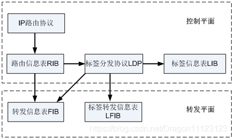

### 控制层面

负责生成和维护路由信息和标签信息

##### 1.IP路由协议

- 产生路由信息

##### 2.RIB路由信息表

- 存放路由信息

##### 3.LDP标签分发协议

- Label Distribution Protocol
- **为FEC分发标签**

##### 4.LIB标签信息表

- Label Information Base
- 由LDP生成，存放FEC和标签的映射关系，管理标签信息
  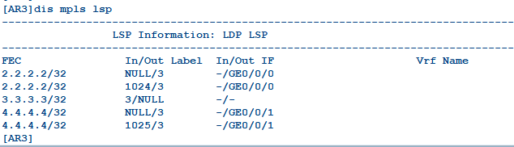

### 数据层面

负责IP报文的转发和带MPLS标签报文的转发

从控制层面下发得到，形成最优表项，直接指导数据转发

##### 1.FIB转发信息表

- Forwarding Information Base
- 基于RIB生成，**指导IP报文转发**
- 判断数据是否需要标签转发
  - tunnel ID为0x0：进行IP转发
  - tunnel ID为非0x0：查看LFIB表，进行标签转发
- 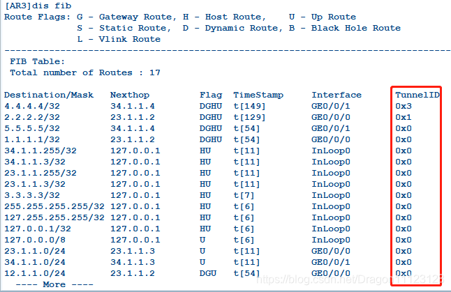

##### 2.LFIB标签转发信息表

- Label Forwarding Information Base
- 基于LIB表和IP路由表生成，**指导标签报文转发**
- **由ILM表(入标签映射表)和NHLFE(下一跳标签转发表)构成**

**NHLFE表**(下一跳转发表项)

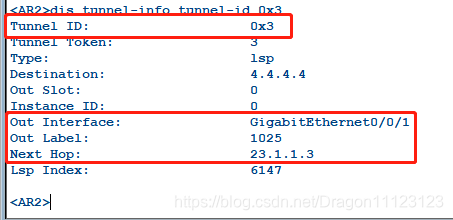

- 内容

  - 出接口
  - 下一跳
  - 出标签

- 查看方式

  - ```css
    display tunnel-info tunnel-id xxx
    display mpls lsp include x.x.x.x 32 verbose
    ```

**ILM表(入标签映射表)**

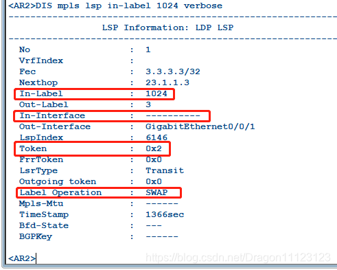

- 内容

  - 入标签
  - 入接口
  - tunnel ID(token)
  - 标签操作类型

- 查看

  - ```css
    display mpls lsp in-label xxxx verbose
    display mpls lsp
    ```

**FIB表通过tunnel ID关联到LFIB表，ILM表通过tunnel ID关联到NHLFE表**

##### 3.转发方式

- 接收到IP数据包，查看目的地址对应的tunnel ID
  - tunnel ID为0x0：进行IP转发
  - tunnel ID为非0x0：查看LFIB表，进行标签转发
- 接收到带MPLS标签的数据包，直接查看LFIB表
  - LFIB出标签为**普通标签**进行标签交换
  - LFIB出标签为**空标签**查看FIB进行IP转发

# 三、MPLS的数据转发流程

当数据进入MPLS域时：

根据FIB表查找相对应的转发条目，转发条目中包含tunnel ID字段**

查看tunnel ID字段

- tunnel ID为0x0，进行IP转发
- tunnelID为非0x0，进行MPLS转发

查看二层头部信息中的TYPE字段

- type=0x0800表示上层为IP
- type=0x8847表示上层为MPLS

#### 1.ingress的处理

**查询FIB表和NHLFE表指导报文转发**

- 查看FIB表，根据**目的IP地址**找到对应tunnel ID

  - ```mipsasm
    display fib 		##可以找到相关目的地的tunnel ID
    ```

- 根据tunnel ID找到对应的NHLFE表项，将FIB表项和NHLFE表项相关联起来(FTN)

  - ```shell
    ##查看详细信息（出接口、下一跳、出标签）
    display tunnel-info tunnel-id 0x3
    ##查看详细信息（出接口、下一跳、出标签，标签操作类型）
    display  mpls  lsp  include 4.4.4.4 32 verbose  
    ```

- 查看NHLFE表项得出接口、下一跳、出标签和标签操作类型

- 在IP报文中压入出标签、同时处理TTL，然后将封装好的MPLS报文从相应出接口发给下一跳

#### 2.transit的处理

**通过查询ILM和NHLFE表指导MPLS报文转发**

- 根据MPLS的**标签值**查看对应的ILM表，可以得到tunnel ID。

  - ```css
    display mpls lsp in-label 1025 verbose		##根据标签查找tunnel id
    ```

- **根据ILM表的tunnel ID找到对应的NHLFE表项**

- 查看NHLFE表项，得出出接口、下一跳、出标签和标签操作类型

- 在IP报文中压入出标签、同时处理TTL，然后将封装好的MPLS报文从相应出接口发给下一跳

**transit节点上MPLS对不同的label有不同的处理方式**

- 如果label>=16，则用新标签替换替换旧标签，同时处理TTL，然后将替换完标签的报文发送给下一跳
- 如果label=3，直接弹出标签，同时处理TTL，然后进行I**P转发或下一层标签转发**(mpls vpn还有私网标签)

#### 3.egress的处理

**通过查询ILM表指导MPLS报文转发**，或者查找IP路由表指导IP报文转发

- 如果egress节点收到IP报文，查看路由表，进行IP转发。(上游路由器有次末跳弹出3号标签)
- 如果egress节点收到MPLS报文，查看ILM表查看标签操作类型，同时处理TTL
  - 如果标签中栈底标识S=1，表明该标签是栈底标签，直接进行IP转发
  - 如果标签中的栈底标识S=0，表明还有下一层标签，继续进行下一层标签转发

> **NHLFE表项为什么存在下一跳？**
>
> 正常情况下，根据出标签值和出接口即可完成数据转发
>
> 存在下一跳主要是为了完成二层头部 目的MAC地址封装
>
> **ILM表项为什么存在入接口？**
>
> 正常情况下，根据入标签即可查找到对应的ILM表项
>
> 但是设备中的标签一般会有很多，添加入接口是为了加快标签的查找时间
>
> **tunnel ID的作用？**
> 1.在ingress节点根据tunnel id判断是进行IP转发还是MPLS转发
>
> 2.通过tunnel id查找NHLFE标签
>
> 3.标识隧道

# 四、MPLS的数据报文结构

标签：短而定长，4字节

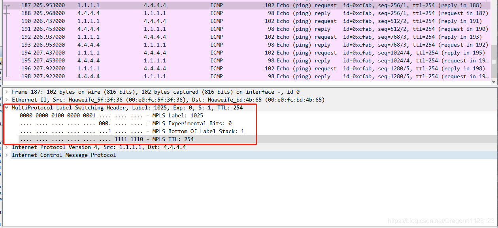

### MPLS报文(32bit)

内容：

##### 1.label

- 标签值；20bit；范围：0-2^20
- 0---15：特殊标签、保留位
  - 0：显示空标签
  - 3：隐式空标签
- 16---1023：静态分配的标签
- 1024---2^20：动态分配的标签

路由器为FEC分发标签作为自身入标签，**同一个设备为不同FEC分发的标签是不能相同的**

路由器收到标签作为自身出标签，入标签和出标签可以相同的也可以不同

标签值只具有本地意义（不同设备的标签分发是可以一致的）

##### 2.EXP

- 实验位；3bit；范围：0-7
- 表示数据优先级，用于QoS

##### 3.S

- 栈底位；1bit
- 表示是否是最后一层标签
  - S=1：表示是最后一层标签
  - S=0：表示不是最后一层标签

##### 4.TTL

- 生存时间；8bit；范围：0-255
- 用于MPLS数据防环
- 两种模式
  - uniform统一模式(默认)
    - 在入接点将IP报文TTL复制到MPLS报文的TTL中，在MPLS域中IP报文TTL不变
    - MPLS报文在MPLS域内经过一台路由器MPLS报文TTL-1
    - **最后在出节点将MPLS报文TTL重新复制回IP报文TTL**
  - pipe管道模式(隐藏MPLS域设备路径)
    - 在入接点将IP报文TTL复制到MPLS报文的TTL中，在MPLS域中IP报文TTL不变
    - MPLS报文在MPLS域内经过一台路由器MPLS报文TTL-1
    - **最后在出节点，IP报文TTL-1**

管道模式下，报文将MPLS域看作一台设备，不会将MPLS报文TTL映射到IP报文TTL。报文经过MPLS域，无论MPLS域内有多少台设备，对于IP报文来说TTL只会减一。这样可以更好的隐藏MPLS域，保证安全性

```perl
mpls		##进入MPLS视图
entropy-label ttl-mode {uniform | pipe}		##修改模式为 统一/管道
```

### 防环

**控制层面防环**

- IGP防环
- LDP防环(默认不开启)

**数据层面防环**

依靠TTL防环

# 五、LSP建立

静态LSP、动态LSP两种建立方式

### 静态LSP

由用户通过手工建立的方式为FEC分发标签建立LSP隧道

优点：不需要交互控制报文，设备资源消耗比较小

缺点：配置麻烦、易出错；网络拓扑发送改变，无法动态感知，需要管理员调整

适用于拓扑结构简单，网络稳定场景

**配置：**

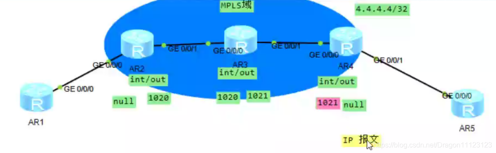

```delphi
##配置底层路由协议
##全局视图下配置
mpls lsr-id 2.2.2.2		//配置该设备的LSR-ID(该地址需要路由可达)
mpls

##接口视图下配置
interface g0/0/1
mpls	//接口激活MPLS，使得接口能够发送、接收MPLS报文


##入接点设备AR2配置
static-lsp ingress 4 destination 4.4.4.4 32 outgoing-interface g0/0/1 nexthop 23.1.1.3 out-label 1020		
##传输结点AR3配置
static -lsp transit 4 incoming-interface g0/0/0 in-label 1020 outgoing-interface g0/0/1 nexthop 34.1.1.4 out-label 1021		
##出节点设备AR4配置
static-lsp egress 4 incoming-interface g0/0/0 in-label 1021	
```

检查命令

```scss
display mpls static-lsp
```

### 动态LSP

通过交互报文形式为FEC分配标签，并进行维护

优点：方便管理，可动态感知拓扑发生变化

缺点：交互报文，资源消耗大

**有LDP协议、MP-BGP协议**

1. LDP标签分发协议，主要是为静态以及IGP协议路由分配标签(默认只是为32位的主机路由分发标签)
2. MP-BGP多协议BGP，主要位BGP VPNv4路由分配标签(主要用于MPLS VPN)

### LDP会话建立过程

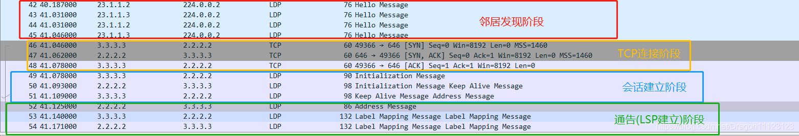

##### LDP协议的配置

```delphi
##1.底层IGP配置(ospf,static等)

##2.全局视图下配置
MPLS lsr-id x.x.x.x		//配置该设备的LSR-ID
mpls		//开启MPLS
mpls ldp	//激活LDP协议
##3.接口视图下配置
interface g0/0/1
mpls 
mpls ldp	//是接口有自动分发的能力
```

检查命令

```scss
display mpls lsp		//查看LSP
display mpls ldp
display mpls ldp session		//查看邻居会话
```

#### 1.LDP邻居发现

**使用hello message报文**

设备激活LDP后，互相发送**hello message报文**

- DIP为224.0.0.2发送
- 基于UDP，端口号646
- 报文携带LSR-ID和传输地址(transport address)，默认一致
- 发送间隔5s，15超时

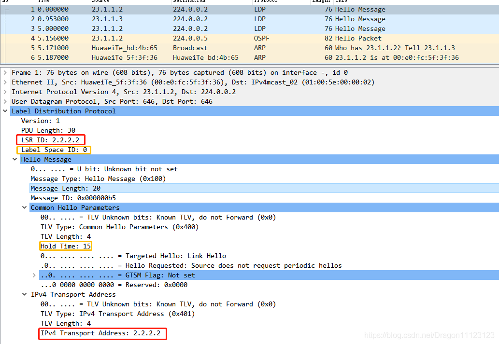

- 报文内容
  - LSR ID
  - label space标签空间
    - 0 基于平面标签分发：所有接口使用同一套标签值进行分发
    - 1 基于接口标签分发：每个接口都存在一套独立的标签
  - hold time超时时间：默认15s
  - transport address传输地址：用来建立TCP连接

**hello message报文主要用于对等体间的互相发现，互相学习传输地址，以便建立TCP连接**

#### 2.TCP连接

基于TCP，端口号646，保证标签传递时是可靠

**传输地址大的作为主动端发起TCP连接**

**以hello报文协商的传输地址做连接**

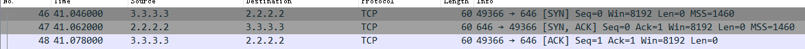

#### 3.LDP会话建立

**使用Initialization message报文和keepalive报文**

1.由主动端先发出**init报文**进行参数协商

- **init报文内容**包含：LSR ID、标签空间ID，标签分发方式、PDU长度、keepalive的计时器

2.被动端收到init报文。如果协商成功发送**keepalive报文**确认+init报文进行参数协商；如果协商失败，发送notification报文终止会话

- keepalive的计时器：**周期15S，超时45S**

3.主动端收到init报文。如果协商成功发送keepalive报文确认，会话建立成功；如果协商失败，发送notification报文终止会话

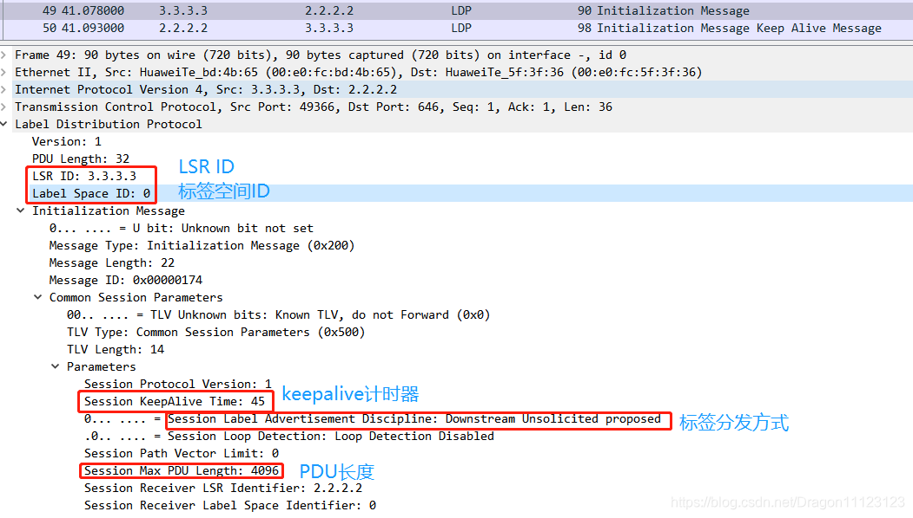

keepalive报文

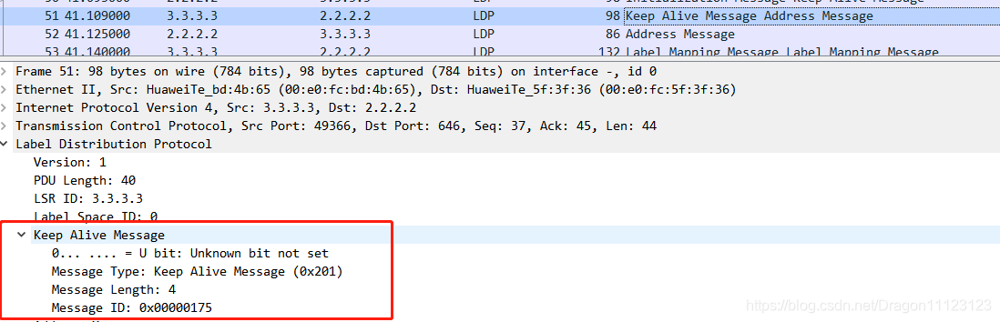

#### 4.通告阶段

**使用address message报文、label mapping message报文**

> 用来请求、通告及撤销标签绑定
>
> Address Withdraw message、Label request message、Label mapping message、Label withdraw message、Label release message、Label abort request message

**相互发送address报文**

- 用于给邻居设备生成**表项的下一跳**

**相互发送maping message报文**

- 用于给邻居发送FEC+标签的映射关系

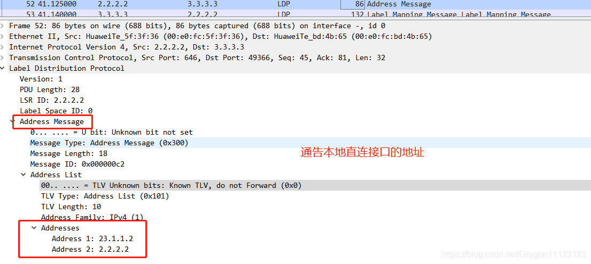
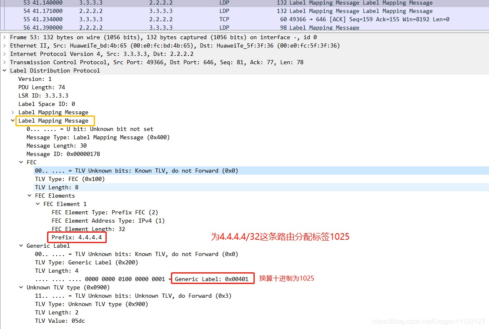

# 六、MPLS标签管理

数据从上游(ingress)去往下游(egress)

标签的分发是下游设备向上游设备发布，下游设备将分配的标签作为入标签，上游设备将收到的标签作为出标签

### 1.标签发布方式

**决定是否主动分发标签**

##### DU方式

- 下游自主，**下游不需要接收上游请求**就可以主动向上游发送标签映射
- 优点：标签分配速度快
- 缺点：浪费内容存储部分无用标签

##### DOD方式

- 下游按需，**下游需要收到上游请求**(label request报文)才会主动向上游发送标签映射
- 优点：只针对有用路由进行标签请求，不会存在无用标签
- 缺点：分配速度较慢

修改

```bash
##两台设备都要配置
interface g0/0/0
mpls ldp advertisement dod		##修改接口标签分发方式为DOD
```

### 2.标签分配控制方式

**决定LSP隧道是否有序建立**

##### independent方式

- 独立方式，**不需要收到下游分配的标签**可以往上游分配标签
- 优点：LSP隧道建立速度快
- 缺点：可能造成LSP隧道断裂

##### order方式

- 有序方式，

  需要收到下游分配的标签

  才可以往上游分配标签

  - FEC的出标签不为null才会向上游分配标签

- 优点：保证隧道的完整性

### 3.标签保持方式

##### Liberal方式

- 自由方式，**会保存不是最优**的标签
- 优点：存在备份标签，收敛速度快

##### conservation方式

- 保守方式，**只保存最优**的标签
- 优点：减少内存消耗
- 缺点：当最优标签链路断开。若存在备份链路，需要重新分配标签，收敛速度忙

> 案例场景：
>
> R1、R2、R3、R4在同一MPLS域，R1上会收到3.3.3.3/32这条FEC的从两个方向(R2和R3)来的标签
>
> 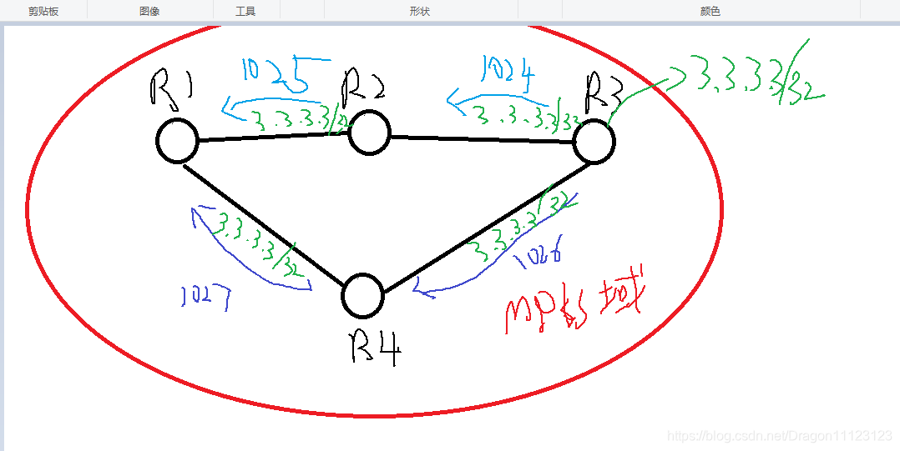
>
> 1.如果是liberal方式，只保存一个最优的 1025或者1027
>
> 2.如果是conservation方式，两个都保存，选择最优的作为主标签用于转发数据，另一个作为备份标签，当主标签链路断开，备份标签会浮现出来

**华为默认：DU+ordered+liberal**

# 七、PHP次末跳弹出

**隐式空标签**

用于解决最后一跳设备负担大的问题

在数据发送给最后一跳路由器前提前弹出标签，使最后一跳路由器只查看一次FIB表，减少最后一条的负担

##### 实现方式

- 最后一跳路由器为上游分发特殊3号标签
  - 最后一跳路由器：一条FEC在MPLS中的egress节点
- 3号标签作为倒数第二跳的出标签
- 当转发MPLS数据包时，倒数第二跳发现出标签为特殊3号标签，提前弹出标签，在与最后一条路由器之间的链路上使用IP转发

### 0号标签

显示空白标签

**最后一跳弹出**

用于QoS，保证QoS在整个链路中不丢失

- MPLS报文中EXP位

实现：

- 最后一跳路由器为上游分发特殊0号标签
- 0号标签作为倒数第二跳的出标签
- 倒数第二跳LSR将值为0的标签正常压入标签值顶部，转发给最后一跳路由器，最后一跳路由器发现报文标签值为0，则标签弹出

### 0号标签和3号标签区别

|              |        **0号标签**        |  **3号标签**   |
| :----------: | :-----------------------: | :------------: |
|   **名称**   |      **显示空标签**       | **隐式空标签** |
| **弹出设备** |     **最后一跳弹出**      | **次末跳弹出** |
|   **备注**   | **用于有配置QoS的mpls域** |                |

**华为LDP协议默认情况下置位32位的主机路由分配标签**
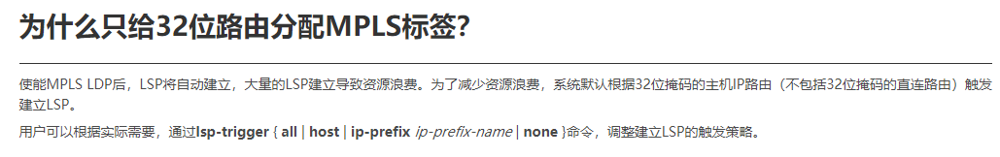

修改可以为不是32位的主机路由分配标签

```sql
mpls
lsp-trigger all 
```